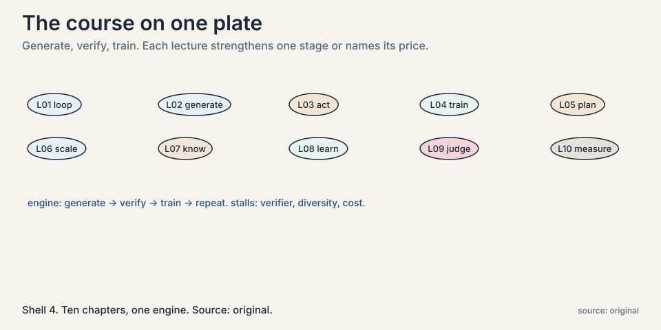
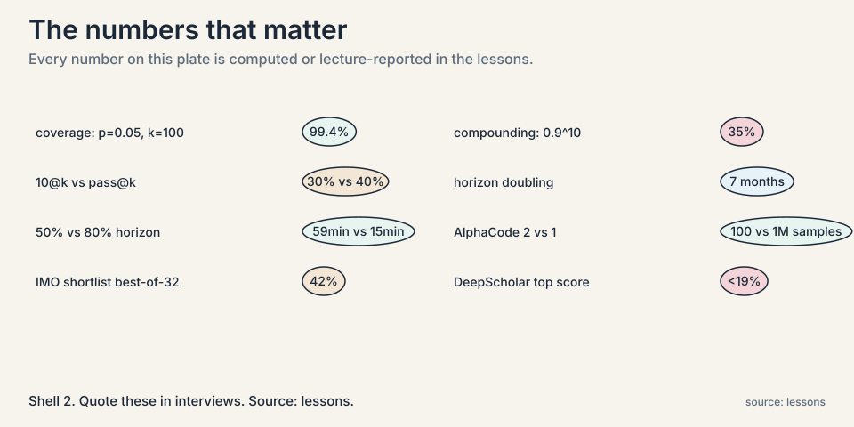

Read this and the lessons become review. Everything below is in
the lessons with the numbers. This page compresses it to what
you must know to clear the exam.

## The one engine

Everything in this course is one loop:

**Generate** many attempts. **Verify** them automatically.
**Train** on the winners. Repeat. Mnemonic: **GVT**.

Compute flows between two axes. Test-time compute spends money
per question: sampling, traces, tools, search. Train-time
compute spends it once: fine-tuning, reinforcement learning on
winners. The verifier is the bottleneck behind all of it. It
must be fast, automatic, and honest. Slow or subjective domains
stay outside the loop.

## The ten chapters, fast

### L01: The loop itself

Test-time compute makes data. Train-time compute absorbs it.
The course's through-line: whenever a loop feeds its own
outputs back as training signal, it improves, and the
constraints are always verifier quality and diversity.
Memory aid: the engine is GVT. Every chapter strengthens one
stage or names its price.
[L01](l01-self-improving-agents.html)

### L02: Test-time scaling

Coverage at k tries is 1-(1-p)^k. Worked: p=0.05, k=10 gives
40%. k=100 gives 99.4%. Coverage is log-linear in samples. A
Llama 3 8B with thousands of verified samples beats GPT-4o-class
models at one try. DeepSeek v3 at 1,000 samples beats Claude
3.5 Sonnet and o1-preview on SWE-bench-style tasks. Majority
vote plateaus at 10-50 samples: the generation-verification
gap, where the model knows more than it can say. Archon
composes generators, critic, ranker, fuser, tuned by search:
+14.1% average pass@1 over frontier closed models, open models
only. Price: pays per question, needs the verifier at answer
time. Easy questions: 1-2 samples. Hard questions: sequential
revision beats parallel sampling.
[L02](l02-test-time-scaling.html)

### L03: ReAct, the acting loop

Thought, action, observation, repeat. Mnemonic: **TAO**. Tools
ground reasoning in facts from the world. Paper numbers:
ALFWorld +34 points absolute, WebShop +10, best trial 71%,
from 1-2 examples. Price: compounding error. Ten 90%-reliable
steps give 0.9^10 = 35% task success. Poor tool choice grounds
the trace in wrong facts. Tool descriptions are prompts, not
docs. Overthinking stalls. Underthinking acts blind. Memory
across tasks is named and unsolved.
[L03](l03-agents-that-act.html)

### L04: RLEF, execution as teacher

Code has a free teacher: run it. Inference-time loop: try,
read the test failure, retry. Train-time: PPO on binary reward
from hidden private tests. Public tests guide iteration.
Private tests grade, blocking memorization. Turn-level value:
one advantage for all tokens in the program. PPO's clip caps
each update for stability. Price: sparse signal, needs
executable tests, failures teach nothing. Never start from a
model that passes nothing.
[L04](l04-learning-from-execution.html)

### L05: LATS, tree search over plans

ReAct walks one path. LATS grows a tree. Six stages, mnemonic
**SEESBR**: select by UCT, expand, evaluate, simulate,
backpropagate, reflect. Evaluate: LLM-judge 0-1 plus
self-consistency frequency. Worked: judge 0.6 + consistency
0.75 = 1.35. Backprop (1.35*3+1)/4 = 1.26. UCT = value +
c*sqrt(ln(parent visits)/node visits): exploit plus explore.
Worked: 2.13 beats 1.55. SPRINT: parallel plan-execute baked
in. SWiRL: process rewards before tools answer, transfers
across tools. Price: hundreds of model calls per task. The
judge can mislead the tree. Irreversible actions out of
scope.
[L05](l05-planning-with-search.html)

### L06: AlphaCode, sampling at scale

10@k: generate k programs, submit at most 10. Example tests
remove ~95%. Clustering by behavior buys diversity: 41B plus
clustering beats 41B beats 9B. Log-linear in samples. Bigger
models steeper slopes. Selection bottleneck: unlimited pass@k
passes 40%, 10@k stalls near 30%. AlphaCode 2: fine-tune the
Gemini Pro family for diversity, learned scoring model
replaces heuristic clustering. 100 samples matched AlphaCode's
million. ~85% of Codeforces participants beaten. Price:
diversity must keep growing with samples. Loss is a poor proxy
for solve rate. Breadth for one-artifact problems, depth for
dependent steps.
[L06](l06-sampling-at-scale.html)

### L07: Deep research agents

Knowledge cutoffs plus silent guessing. Uncertainty words
("perhaps", "wait") mark gaps. Single-shot RAG dumps 10
documents and still fails. Agentic RAG: search mid-reasoning
per gap, query the gap not the question. Search-o1: reason in
documents, extract chunks, file notes not documents. Chemistry
toy: guess 14 wrong, dump wrong, search plus read 10 right.
Context length is not reasoning capacity. Price: trigger
heuristics miss gaps both ways. Every search costs latency and
context. Stop when chunks stop changing the answer.
[L07](l07-search-that-reads.html)

### L08: STaR, teaching reason

No reasoning data on the internet, so manufacture it. Attempt
10k problems, keep the 3k with correct answers, fine-tune,
repeat. Rationalization: for failures, hand the model the
answer as hint, keep the rationale, train without the hint.
Construction is easier than search. Three assumptions: correct
answer implies good rationale (the live wire), the model can
rationalize, the base can bootstrap. Price: unfiltered
rationales bake in bad reasoning. Needs answer keys. Negatives
teach nothing. Industrial form: DeepSeekMath (120B curated
tokens, 51.7% MATH at 7B) with GRPO (group-relative
advantages, majority@K not pass@K). DAPO: dynamic sampling,
watch entropy and response length.
[L08](l08-teaching-reason.html)

### L09: The verifier bottleneck

Outcome rewards approve right answers with broken reasoning.
LLM-as-judge certifies invalid proofs as valid.
DeepSeek-Math V2: meta-verifier judges the judge, generator
and verifier lift each other. 8 iterations climbing,
best-of-32 reaches 42% proof score on IMO 2024 shortlist.
Absolute Zero: no answer keys, model proposes its own tasks
scored by learnability (1 - success rate), verified by
execution. Multi-agent debate: generators plus critic keep
chains diverse where single-agent fine-tuning collapses.
Gains transfer to adjacent domains. Weaver: filter weak
verifiers, weight on ~1% labels, distill small. Price:
human-seeded standards. Slow domains (chip sims, wet labs)
have no fast judge. Stand-in reward models invite hacking.
[L09](l09-verifier-bottleneck.html)

### L10: Measuring agents

METR time horizon at 50% success doubles every 7 months: 2
seconds (GPT-2, 2019), 8 minutes (GPT-4, 2023), 59 minutes
(Claude 3.7, 2025). At 80% success the frontier drops to about
15 minutes. 50% is not deployable. Failure modes: poor
planning, poor tool choice, no error recovery, lost goal state
(the unsolved one). GDPval: instruction following fails on
expert tasks. DeepScholar: no system above 19%, fluency trades
off against verifiability. Open problems: diversity,
verifiers, curriculum, non-verifiable domains, cost of
intelligence. Intelligence per watt: local <=20B models cover
most chat queries.
[L10](l10-measuring-agents.html)

## Cheat-sheet tables

### Which method for which problem

| Your problem | Reach for | Why |
|---|---|---|
| Answers exist but one try misses them | Repeated sampling + verifier (L02) | Log-linear coverage, cheapest capability gain |
| Model cannot check facts or run code | ReAct (L03) | Grounds each step in tool observations |
| Coding agent must improve itself | RLEF (L04) | Execution is a free, honest teacher |
| One path keeps failing, need alternatives | LATS (L05) | Tree keeps untried branches alive |
| Competition coding, one program per problem | AlphaCode pattern (L06) | Breadth + learned selector |
| Knowledge cutoff, silent guesses | Agentic search (L07) | Fill gaps mid-thought, read the docs |
| No reasoning data, but answer keys exist | STaR (L08) | Manufactures rationales from answers |
| Verifier is weak or learned | Meta-verifier / Weaver / debate (L09) | Judge the judge, maintain diversity |
| "Is it ready to deploy?" | METR-style eval at 80% (L10) | 50% capability is not reliability |

### Test-time vs train-time, fast lookup

| | Test-time compute | Train-time compute |
|---|---|---|
| Weights | Fixed | Change |
| Examples | Sampling, traces, tools, search | Fine-tuning, RL on winners |
| Pays | Per question, forever | Once, up front |
| Needs | Verifier at answer time | Verifier during training |
| Fails when | No checkable answer | No training signal |

## Memory aids

- **GVT**: generate, verify, train. The whole course is one
  loop.
- **TAO**: thought, action, observation. The ReAct cycle.
- **SEESBR**: select, expand, evaluate, simulate,
  backpropagate, reflect. The LATS cycle.
- **10@k**: 10 submissions from k samples. The AlphaCode
  budget.
- **The 35% rule**: 0.9^10 = 35%. Ten 90%-reliable steps make
  a 35%-reliable task.
- **The 99% rule**: p=0.05, k=100 gives 99.4% coverage. One
  hundred diverse tries almost always work.
- **The 50/15 rule**: 59 minutes at 50%, 15 at 80%. 50% is
  not deployable.
- **The 1% rule**: Weaver weights verifier quality on ~1%
  labeled data. Small labels, large payoff.

## Never-confuse pairs

- **Coverage vs pass@k.** Coverage: at least one of k solves
  it, oracle assumed. Pass@k: the same, verifier folded in.
- **Test-time vs train-time compute.** Test-time: weights
  fixed, answers improve per question. Progression in answers
  per question. Train-time: weights change, answers get
  cheaper forever after.
- **Outcome vs process reward.** Outcome: checks the ending,
  cheap, blind to broken steps. Process: checks the steps,
  expensive, mostly does not exist yet.
- **ReAct vs chain of thought.** CoT: reasoning only. ReAct:
  reasoning interleaved with tool actions.
- **Generation vs selection.** Generation: is the winner in
  the set. Selection: can the filter pick it. The bottleneck
  moved from the first to the second.
- **Verifier vs reward model.** Verifier: any judge. Reward
  model: a learned verifier, gameable.
- **Majority@K vs pass@K.** Majority@K: the most common
  answer is right. Pass@K: any of K is right. GRPO improves
  the first, not the second.
- **50% horizon vs 80% horizon.** 50%: capability, steep.
  80%: deployability, lags years.

## If-this-then-that rules

- If samples are not diverse, then the effective k is the
  cluster count. Stop sampling, fix the generator.
- If the verifier is learned, then hold out a trusted check
  the loop cannot see. Flat held-out plus rising loop scores
  means hacking.
- If the task has irreversible actions, then tree search is
  out.
- If every prompt in the batch is all-pass or all-fail, then
  the batch carries no gradient. Drop them.
- If entropy falls while loss falls, then the policy is
  collapsing. Stop.
- If response length grows with flat scores, then the model
  is padding, not reasoning.
- If the question is easy, then 1-2 samples. If hard, then
  sequential revision beats parallel sampling.
- If the judge must be fast, then answer keys and tests
  qualify. Learned judges risk honesty. Humans do not
  qualify.
- If deploying, then measure at 80% success, not 50%.
- If the trigger fires constantly, then calibrate it: keep
  only searches that change answers.

## Rapid-fire self-tests

**1.** Why does majority vote plateau at 10-50 samples?
Because it samples the answer distribution, not the coverage
set. It cannot create a capability that never appears.

**2.** A model solves 5% of problems per try. How many tries
for 90% coverage?
k = ln(0.1)/ln(0.95) = 44.9, so 45 tries.

**3.** Why does 0.9^10 = 35% matter for ReAct?
Each step's errors compound. Ten steps at 90% reliability
each give 35% task success. Every mechanism subchapter is a
way to buy reliability back.

**4.** Why do private tests exist in RLEF?
To block memorization. Public tests guide iteration. Private
tests grade. A model that memorizes public tests gets zero
from the private ones.

**5.** What does UCT balance in LATS?
Exploitation (high-value branches) against exploration
(under-visited branches). Worked: value 2.13 with 3 visits
beats value 1.55 with 8 visits.

**6.** Why did AlphaCode 2 beat AlphaCode with 100x fewer
samples?
Learned scoring replaced heuristic clustering, and the
generator was fine-tuned for diversity. Effective k, not raw
k.

**7.** What is the generation-verification gap?
The model knows more than it can say: gold answers appear
with enough samples, but the model cannot select them. The
gap is a verifier problem, not a knowledge problem.

**8.** Why do outcome rewards approve broken reasoning?
They check the ending, not the steps. Right answer with
broken reasoning passes. The fix is process rewards or
meta-verifiers, and neither exists cheaply yet.

**9.** What does GRPO improve, and what does it not?
Majority@K goes up, pass@K stays flat. The distribution gets
sharper, not wider. More consistent, not smarter.

**10.** Why is the 50% horizon not a deployment metric?
Because 50% success is a coin flip. Claude 3.7: 59 minutes at
50%, about 15 at 80%. Deploy on the 80% number.

**11.** What is the one failure mode the course never
solves?
Lost goal state. Planning gets LATS, tool choice gets
grounding, recovery gets reflection. Memory of the objective
over long horizons stays open.

**12.** What makes a domain eligible for the
self-improvement loop?
A fast, automatic, honest verifier. Code execution qualifies.
Human judges do not. Slow domains (chip sims, wet labs) are
excluded until a fast stand-in exists.

**13.** Why query the gap, not the question, in agentic
search?
Because the search must fill what the reasoning lacks, not
repeat what it knows. Notes filed per gap, not documents
dumped per question.

**14.** What is the live wire in STaR?
Correct answer implies good rationale. It is an assumption,
not a theorem. Outcome checks leak through it, and unfiltered
rationales bake in bad reasoning.

**15.** You have a coding agent and a verifier. Do you add
more samples or more training?
Both, in order. First, sampling: log-linear coverage is the
cheapest gain. Then train on the verified winners so the
answers get cheaper. The verifier is the bottleneck either
way.
