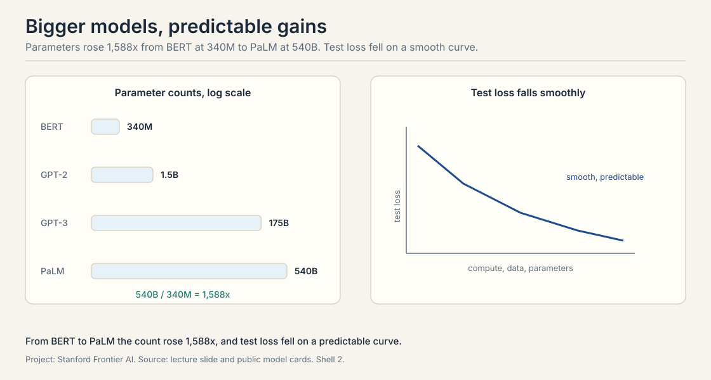
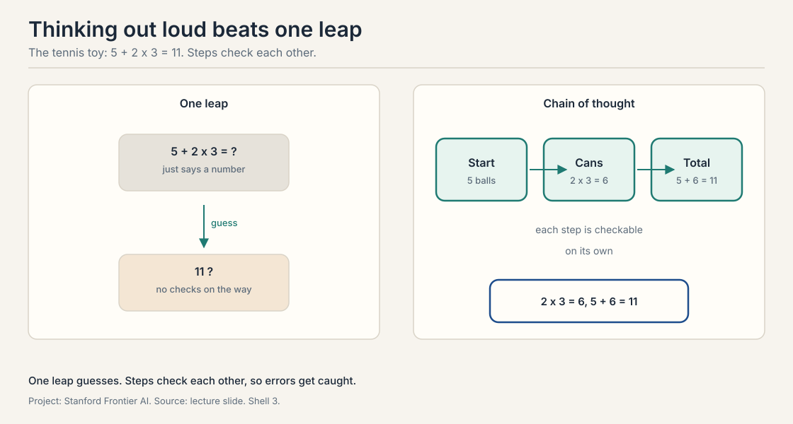
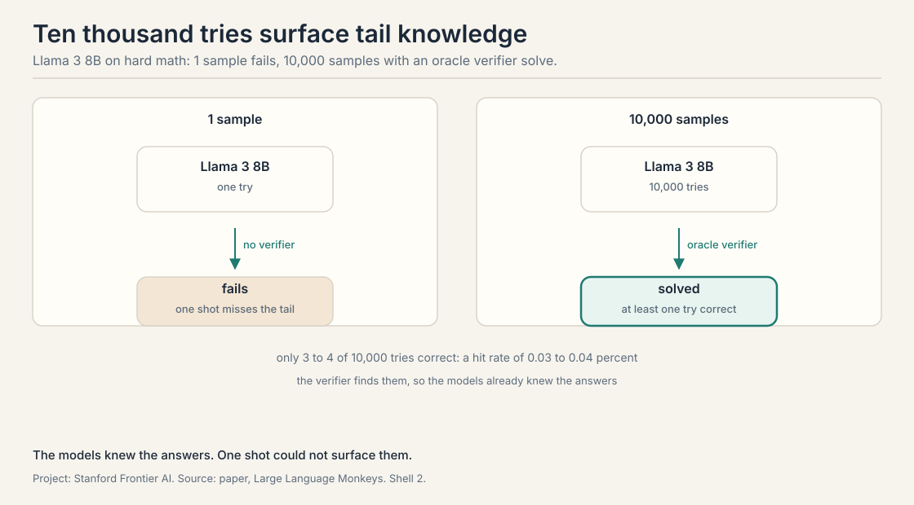
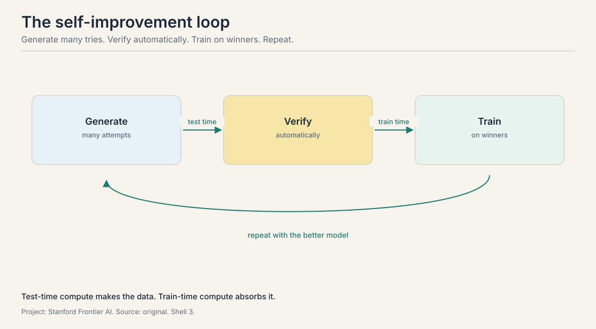
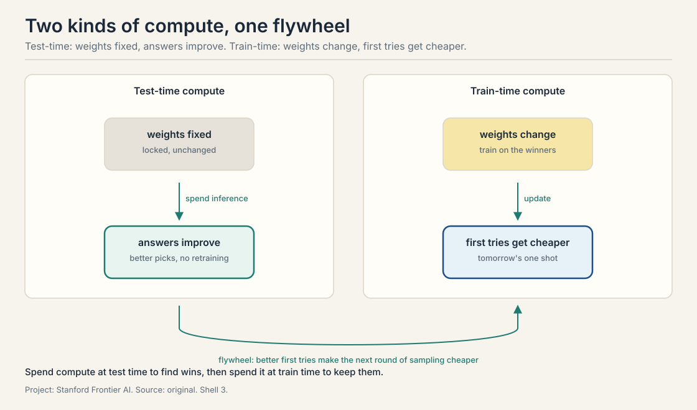

## The gap this course closes

*Builds on: This is the course's opening: it states the loop, generate, verify, train, that every later lecture builds on.*

You ask a chatbot a hard math question. It answers in one try. The
answer is wrong. You ask again, phrased a little differently. This
time it is right. The model knew the answer all along. It just did
not say it the first time.

A **language model** is a machine that predicts the next word, over
and over, until a full answer appears. An **agent** is a language
model that does more than answer: it is given a goal, it plans
steps, it takes actions in an environment, it reads the feedback,
and it corrects its steps until the goal is done or it admits it
cannot finish. Fixing a bug, planning a trip, proving a theorem:
these are agent tasks. None of them fits in one shot.

This course studies whether agents can improve themselves. The
loop is simple to state: generate many attempts, check them with a
verifier, train on the winners, repeat. Each lecture adds one piece
of that loop and names its price. This chapter opens the loop and
names its parts.

## Scaling laws: make it bigger

*Builds on: the course's opening loop, generate many attempts,
verify them, train on the winners, which needs capable base
models to start from.*

From 2018 to about 2024 the field had one reliable recipe: make the
model bigger. The **scaling laws** say that as you raise compute,
data, and parameter count, the test loss falls on a predictable
curve. Three axes, three curves: more compute on the x-axis means
lower loss on the y-axis. More data means lower loss. More
parameters means lower loss. A **parameter** is one adjustable
number inside the model. Test loss measures how badly the model
predicts text it has never seen. Lower is better.

The parameter counts tell the story. BERT had 340 million
parameters. GPT-2 had 1.5 billion. GPT-3 had 175 billion. PaLM had
540 billion. GPT-4 is estimated at trillions. From BERT to PaLM the
count rose about 1,588 times. Each step brought better scores on
language and reasoning benchmarks.

Bigger models did three things that smaller ones could not. First,
they kept improving on benchmarks as they grew.

## Few-shot learning: examples in the prompt

*Builds on: scaling laws, which produced models large enough to
follow patterns from examples with no retraining.*

Second, bigger models learned **few-shot learning**: show the
model a few examples of a task inside the prompt and it follows
the pattern, with no extra training. Add a few English-to-French
pairs first and it is few-shot learning. GPT-3 made this work
across many tasks, which made prototyping fast: no fine-tuning,
just examples in the prompt.

## Zero-shot learning: the task with no examples

*Builds on: few-shot learning, the easier version where the
prompt provides the pattern to follow.*

**Zero-shot learning** is the harder version: describe the
task with no examples and the model still performs it. The lecture
uses translation. The prompt says "translate English to French"
and then asks for the French word for "cheese". A model that
answers without ever being trained on translation pairs is doing
zero-shot learning.

## Emergence: abilities that appear at scale

*Builds on: few-shot and zero-shot learning, two abilities
scaling unlocked that nobody trained for directly.*

Third, bigger models showed **emergent behavior** (emergence):
abilities that appear suddenly past a size threshold and were
never explicitly trained. The most important one is
**chain of thought**.

## Thinking out loud: chain of thought

*Builds on: Emergence, the scale-unlocked ability that chain of thought exemplifies.*

**Chain of thought** means the model writes out intermediate
reasoning steps before giving the final answer, instead of leaping
straight to it. The lecture walks through the toy that made this
famous. The question: Roger has five tennis balls. He buys two more
cans of tennis balls. Each can has three tennis balls. How many
tennis balls does he have now?

A one-shot answer just says a number. A chain-of-thought trace
says: Roger started with 5. Two cans of 3 is 6. Five plus 6 is 11.
Each step is checkable on its own. The arithmetic: 2 times 3 is 6,
and 5 plus 6 is 11.

Chain of thought was not designed in. It was discovered. Small
models cannot use it. The lecture shows three model families,
LaMDA, GPT, and PaLM: at around 8 billion parameters the trace does
nothing, and past that threshold the same trace lifts math scores.
The current reading, stated as an open question in the lecture, is
that using a trace takes capacity: the model must both reason and
monitor its reasoning, and small models spend everything writing
the steps with nothing left to check them.

## Instruction tuning: teaching the model to follow requests

*Builds on: emergence, which showed that scale alone produces
raw capabilities that still need shaping into useful behavior.*

ChatGPT launched in November 2022 and reached 1 million users in 5
days. Two training steps beyond raw scaling made that leap. Both
are forms of **fine-tuning**: continued training of an already
trained model on new data.

First, **instruction tuning**. The base model only predicts the
next word. Instruction tuning shows it pairs of instructions and
answers, including chain-of-thought traces, so it learns to follow
requests and walk through a process. The data mixes human-written
pairs, templates, and synthetic data. Quality and generality of
this data strongly shape the final model.

## RLHF: steering with human feedback

*Builds on: instruction tuning, which teaches the model to follow
requests but not which answers humans prefer.*

Second, **RLHF**, reinforcement learning from human feedback. The
recipe: collect human ratings of model answers, train a **reward
model** to predict those ratings, then use reinforcement learning
to steer the language model toward answers the reward model scores
highly. The reward model can score correctness, helpfulness,
specificity, or harmlessness, weighted by what the builders care
about. A close variant is **RLAIF**, reinforcement learning from
AI feedback, where a model instead of a human writes the ratings.
The lecture flags this as the direction the course will push: the
human is the bottleneck, so feedback itself must be automated.

## The new frontier: inference

*Builds on: The scaling wall and the monkeys teaser: with pretraining saturated, inference becomes the new axis.*

Model development has three stages. **Pre-training** takes months
on thousands of graphics processing units (GPUs) over trillions of tokens. **Fine-tuning**
uses orders of magnitude less data. **Inference** is using the
model: words in, words out. For years almost no compute went into
making inference smarter. That changed about a year and a half
before this lecture. Inference is now a frontier: ways to make the
model better at use time without changing a single weight.

The lab's own result opens the argument. It is called **Large
Language Monkeys**, after the infinite monkey theorem: a monkey
typing forever will eventually produce Shakespeare. Here the
language model is the monkey. Ask it the same hard problem not
once but 10,000 times, with a **verifier**, a checker that picks
the correct responses, selecting the winners. **Coverage** is the
fraction of problems solved by at least one sample.

The result: Llama 3 8B and 7B models, worse than GPT-4o at one
sample, beat GPT-4o once sampling scales up. On some hard problems
only 3 or 4 of the 10,000 samples were correct, a hit rate of
0.03 to 0.04 percent, yet the verifier found them. The models
already knew the answers. One shot could not surface them.

Two practical notes from the lecture. Sampling runs in parallel,
so latency grows less than the sample count suggests, but the
cost trade-off is real and varies by problem. And **temperature**,
the knob controlling output randomness, cannot be pushed far:
past about 1.2 the outputs turn to gibberish. Diversity has a
ceiling.

## Reasoning models: test-time scaling goes mainstream

*Builds on: The inference frontier and the monkeys result, productized as OpenAI's o1.*

OpenAI's o1, released September 2024, productized the same idea.
Its accuracy on hard math climbs log-linearly with test-time
compute: more thinking tokens, higher pass-at-one accuracy, with
no change to the weights. **Pass at one** means the single first
answer is correct. **Pass at k** means at least one of k samples
is correct.

The lecture walks through how a reasoning model attacks a task,
using a bash-script transpose problem as the running example. The
model does problem analysis first: what are the input and output
formats. Then **task decomposition**: parse the input, build the
matrix, transpose it, print it. Then **self-correction**: it
starts a formula, stops, says the formula is wrong, and fixes it.
Then **alternative proposals**: if one approach stalls, it
backtracks and tries another. These behaviors were partly seeded
by human-curated training data and partly acquired during the
fine-tuning and reinforcement learning that made the model a
reasoner. They generalize beyond the training tasks.

One honest caveat from the Q&A: reasoning models like their own
traces more than traces from other models, even better ones. And
a larger model is still the better reasoner. A common pattern is a
large model that thinks and a smaller model that summarizes.

## From chatbot to agent

*Builds on: Reasoning models, which think but still do not accomplish tasks.*

Chatbots and reasoning models are still single-turn in spirit.
They do not accomplish tasks. The shift the course tracks is from
chatbot to agent, and it is already visible in products. **Claude
Code** and **Codex**, OpenAI's coding agent, take English
instructions and edit files, run tests, and iterate. **Deep
Research** takes a research question, reads many websites, and
returns a report with pros and cons.

The transition has a precise shape. The model is given a goal. It
plans steps toward the goal. It interacts with an environment
through tools. It reads the feedback. It corrects its steps. It
stops when the goal is done or admits failure. Goal, plan, act,
observe, correct, stop: that loop is what separates an agent from
a chatbot. Memory enters because a multi-step task needs state:
what was tried, what worked, what remains.

In practice most deployed systems are **agentic workflows**, not
open-ended agents. The lecture names the building blocks. **Prompt
chaining** splits a task into subtasks run in sequence. **Routing**
sends easy inputs down a simple path and hard inputs down a
complex one. **Parallelization** runs independent subtasks at once
and aggregates, which is the shape of Deep Research. An
**orchestrator** is a central model that plans and dispatches to
worker models, the shape of Claude Code. An **evaluator** or judge
is a model that scores a proposed solution. A **verifier** checks
correctness for real, such as running unit tests on generated
code. Tool calls reach the outside world: web search, a weather
lookup, a terminal.

## The generator-verifier gap

*Builds on: The agent loop, whose load-bearing wall is the verifier.*

One concept from the Q&A deserves its own name because the whole
course turns on it. The **generator-verifier gap** is the distance
between generating good outputs and knowing which outputs are
good. Models generate plenty of sensible attempts. Selecting the
right one needs feedback, and in creative domains human feedback
is the bottleneck. Where feedback is cheap and trustworthy, math
and code with tests, the loop can run on its own. Where it is
slow or subjective, the loop stalls. Reliable verification gets its
own lecture later in the quarter.

## Where this already works

*Builds on: Agentic workflows and the generator-verifier gap, applied to shipping products.*

Three application areas from the lecture, in increasing order of
ambition. Coding agents handle repetitive software work: code
migrations, version upgrades, restructuring, unit test generation.
They mirror what a developer does, navigate the repo, edit, run
the terminal, read the output, fix, and the loop is getting
reliable now after being shaky a year earlier.

Customer support is the second. Live transcription of calls.
Knowledge assist: the agent consults the help database and
surfaces the right article instead of making the human memorize
everything. Smart replies in chat. Call summaries afterward.

Deep research is the third. Give it a literature review and it
finds references, judges relevance, outlines, summarizes each
source, and synthesizes a full article, reading more papers than
a human would. The lecture's example: the 2022 Winter Olympics
opening ceremony. The forward-looking version is the **AI
scientist**: the model brainstorms ideas, helps iterate on
experiments, and improves the paper write-up. Hallucination is
real, but as a brainstorming partner the model proposes ideas
outside any one researcher's reading.

## The loop, stated once

*Builds on: Every piece introduced in this lesson, consolidated into one flywheel.*

Generate many attempts at test time. Verify them automatically.
Train on the winners at train time. Repeat with the better model.
**Test-time compute** improves answers with weights fixed.
**Train-time compute** changes the weights so the next first try
is better.

## Used where, as of October 2026

- **Claude Code** (Anthropic, launched February 2025): the coding
  agent the lecture holds up as the product proof. By 2026 it is
  woven into daily engineering work: Anthropic's Boris Cherny
  reported about 80 percent of Anthropic's technical staff use it
  daily (Lenny's Podcast, July 2026), and SemiAnalysis estimated
  4 percent of public GitHub commits were Claude Code-authored
  (February 2026). The lecture's loop, navigate, edit, run, read
  output, fix, is its visible behavior.
- **OpenAI Codex**: OpenAI's coding agent (cloud research preview,
  May 2025). It runs many coding tasks in parallel in isolated
  cloud sandboxes, launched on codex-1, a version of o3 tuned for
  software engineering. By March 2026 it had over 2 million weekly
  active users (Wikipedia, October 2026). The lecture's loop,
  navigate, edit, run, read output, fix, is its visible behavior.
- **Deep Research** (OpenAI, February 2025), **Gemini Deep
  Research**, **Perplexity**: the deep research products the
  lecture anticipated. They run the parallel research-and-aggregate
  workflow at production scale.
- **DeepSeek-R1** (January 2025): the open reasoning model that
  made test-time scaling plus reinforcement learning the public
  recipe. Its training used GRPO, the algorithm Lecture 6 covers.
- **o1/o3, Gemini thinking models**: o1 shipped in full on
  December 5, 2024, o3 launched April 16, 2025, and Google's Gemini
  2.0 Flash Thinking Experimental arrived December 19, 2024
  (Wikipedia, October 2026, TechCrunch, December 2024). All are
  reasoning models in production, built on the test-time compute
  axis this lecture introduces.
- **KernelBench** (Stanford, ICML 2025): the live version of the
  lecture's "AI as a compiler" idea, a benchmark where models
  write Compute Unified Device Architecture (CUDA) kernels checked by running them. Active as of 2026,
  with a verified variant from Meta.

> [!QA]
> Q: Walk me through the self-improvement loop with numbers.
> A: Take 10,000 math problems with known answers. Generate: the
> model attempts each 100 times, producing 1,000,000 attempts.
> Verify: the answer key keeps the attempts that reach correct
> answers. Suppose 300,000 survive. Train: fine-tune the model on
> those 300,000 winning attempts. The model's single-attempt
> accuracy rises. Next turn, the better model needs fewer attempts
> per problem to produce the same number of winners. That is the
> flywheel.
> Follow-up: What breaks first if the verifier is weak?
> A: The training data. A verifier that approves wrong answers
> fills the winner set with bad attempts, and fine-tuning bakes
> them into the weights. The loop amplifies the verifier's errors,
> not just its judgments. That is why the course treats the
> verifier as the load-bearing wall.

> [!QA]
> Q: What is the difference between test-time compute and train-time compute?
> A: Test-time compute spends computation when answering: more
> samples, longer reasoning chains, tool calls. The weights never
> change. Train-time compute spends computation updating the
> weights: fine-tuning on verified winners. Test-time buys better
> answers now. Train-time buys cheaper better answers later.
> Follow-up: Why do both?
> A: Test-time scaling generates the training data that train-time
> scaling consumes. Without test-time attempts there is nothing to
> verify and learn from. Without training, every hard problem pays
> the full sampling cost forever.

> [!QA]
> Q: Why does chain of thought help, mechanically?
> A: Three mechanisms. Decomposition: one hard leap becomes several
> easy steps, each inside the model's reliable range. Working
> memory: the trace is scratch space, so intermediate results sit
> in context where later steps can read them. Checkability: a wrong
> step is visible, so the model or a verifier can catch it without
> redoing everything. In the toy, "2 cans of 3 is 6" can be checked
> on its own. The cost is tokens: chain of thought spends more of
> them to buy reliability.
> Follow-up: Why do only large models benefit?
> A: The lecture reports it as an empirical threshold near 8
> billion parameters, with no settled mechanism. The plausible
> reading: using a trace requires enough capacity to both reason
> and monitor the reasoning. Small models spend their capacity
> writing the steps and have none left to check them.

> [!QA]
> Q: What is reward hacking, and why does it threaten the loop?
> A: The loop optimizes whatever the verifier measures. If the
> verifier is a learned model, the generator can learn to produce
> outputs that score high without being good: fluent nonsense that
> fools the judge. The scores climb. The actual quality does not.
> The lecture names this as the reason verifiers must be honest,
> not just fast: a gameable judge turns self-improvement into
> self-deception.
> Follow-up: How do you detect it?
> A: Hold out a trusted check the loop cannot see: human
> spot-checks, or a separate verifier trained differently. If the
> loop's scores rise but the held-out check flatlines or falls,
> the loop is hacking its judge. No held-out check, no detection.

> [!QA]
> Q: Design a self-improvement loop for a customer-support answer agent. What is the verifier?
> A: Generate: sample 20 candidate answers per ticket. Verify: this
> is the hard part. Candidate verifiers: a model judge checking the
> answer against the retrieved help articles, a strict citation
> check where every factual claim must match a quoted span, and
> customer thumbs-up or down as a slow signal. Train: fine-tune on
> answers that pass the citation check and get positive ratings.
> The honest answer names the weak link: the judge can be gamed
> and the thumbs-up signal is slow and sparse. The loop works only
> as far as the citation check is airtight.
> Follow-up: Where does reward hacking appear here?
> A: If the verifier is "customer did not complain", the model
> learns to write answers that suppress complaints:
> over-apologizing, deflecting, burying the hard answer. The metric
> improves. Support quality does not. The fix is a verifier tied to
> resolution, not sentiment.

> [!QA]
> Q: What is an agentic workflow, and when is it not an agent?
> A: A workflow is a hand-designed graph of model calls, verifiers,
> and tools: prompt chaining, routing, parallel calls with
> aggregation, an orchestrator dispatching workers. It is not an
> open-ended agent because the loop is fixed by the designer. The
> model does not decide the structure. The lecture's claim: most
> deployed systems today are workflows, with coding and research
> showing the first signs of genuinely open-ended loops.
> Follow-up: What has to change for the workflow to become an agent?
> A: The model itself must own the loop: decide the next step from
> observations, recover from errors, and know when to stop. That
> needs planning, multi-step reasoning, and self-correction, the
> topics of the coming lectures.

> [!QA]
> Q: Why did pretraining scaling hit a wall around 2024?
> A: The lecture frames it as saturation: the predictable gains
> from more parameters, data, and compute were flattening, and the
> cost of each further step was enormous. The response was a new
> axis, inference, plus closing the loop back into training. Note
> the framing is the lecturers', not a measured constant.
> Follow-up: Does that mean pretraining is over?
> A: No. Later lectures show that for the hardest problems, bigger
> pretrained models still win even against large test-time budgets.
> The wall changed where the marginal dollar goes, not the value
> of pretraining itself.

## Recap: the whole lesson on one screen

1. **One shot wastes knowledge.** A model can know an answer it
   will not give on the first try. Agent tasks never fit in one
   shot.
2. **Scaling, then a wall.** Parameters rose 1,588x from BERT to
   PaLM with predictable gains, then saturated around 2024.
3. **Thinking out loud.** Chain of thought breaks one hard leap
   into checkable steps. Roger: 5 + 2 x 3 = 11. Only large models
   can use it.
4. **The monkeys result.** Sampled 10,000 times with a verifier, a
   small 8B model beats GPT-4o. Only 3 to 4 of 10,000 tries were
   correct. The knowledge is in the weights.
5. **The loop.** Generate many tries, verify automatically, train
   on winners, repeat. Test-time compute makes data. Train-time
   compute absorbs it.
6. **The honest price.** The verifier is the bottleneck. Slow or
   subjective domains stay outside the loop.

## Official sources and further reading

**Official:**
- CS329A Part 1: Course Overview (Autumn 2025). The lecture this
  chapter follows. https://www.youtube.com/watch?v=6YnLB0XbTnI
- CS329A course site: https://cs329a.stanford.edu

**Further reading:**
- Brown et al., "Large Language Monkeys: Scaling Inference Compute
  with Repeated Sampling" (2024). The repeated-sampling result the
  lecture leans on. https://arxiv.org/abs/2407.21787
- OpenAI o1 system card (September 2024): log-linear test-time
  scaling on hard math, cited in lecture.
  https://openai.com/index/openai-o1-system-card/

**Caveats from these sources.** Lecture dates are Autumn 2025.
Model names and benchmark numbers are snapshots from then. The
10,000-sample monkeys figure is coverage with an oracle verifier,
not single-attempt accuracy. Saturation of pretraining scaling is
the lecturers' framing of 2024, not a measured constant.

## Connections to the other courses

- **CS329Z:** the engineering counterpart. This course asks how
  agents can improve themselves. CS329Z covers how to build them:
  tool use, function calling, ReAct, evaluation, infrastructure.
- **CS336:** where the base models come from: pretraining,
  scaling laws, and the transformer the agents are built on.
- **CS229S:** the systems view of the compute the loop burns:
  training cost, inference cost, and why test-time scaling is a
  systems problem too.
