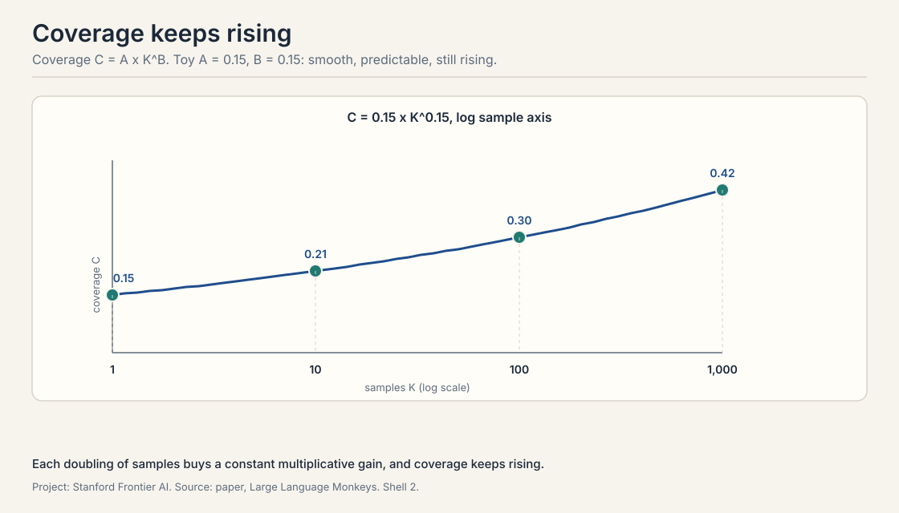
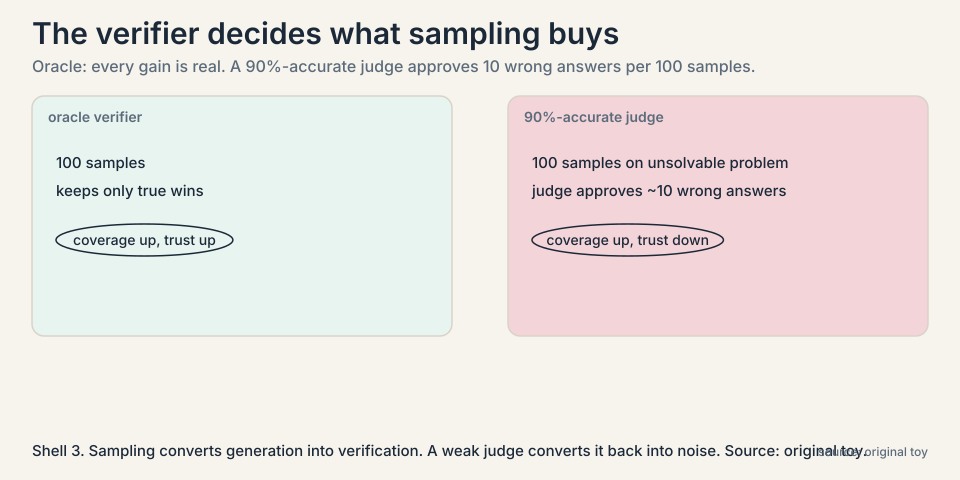
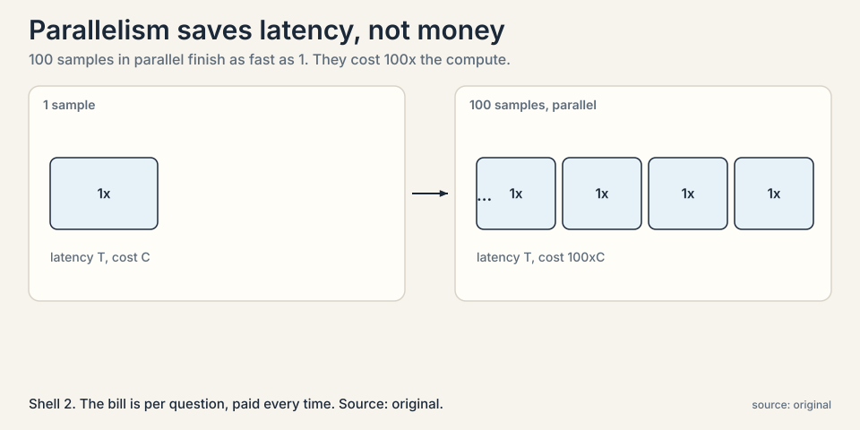
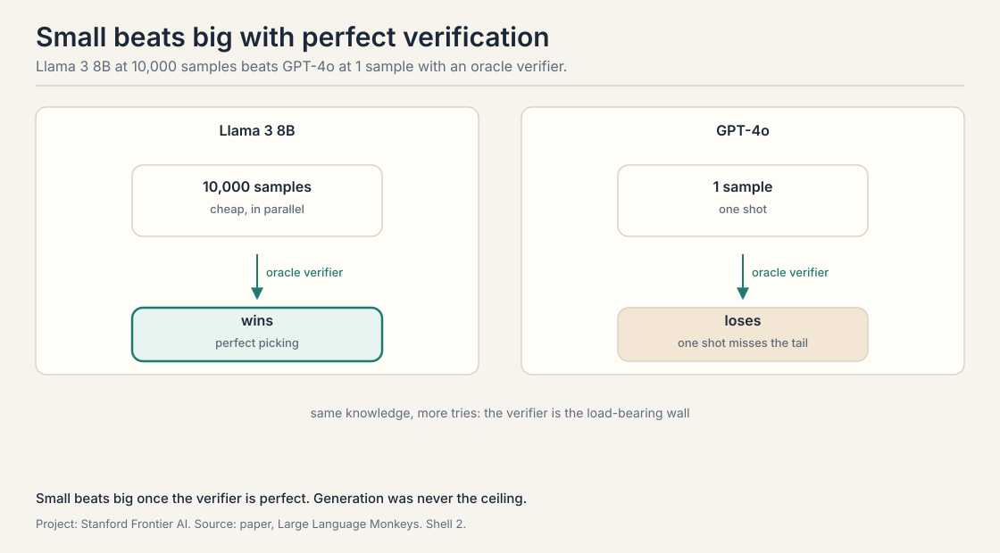
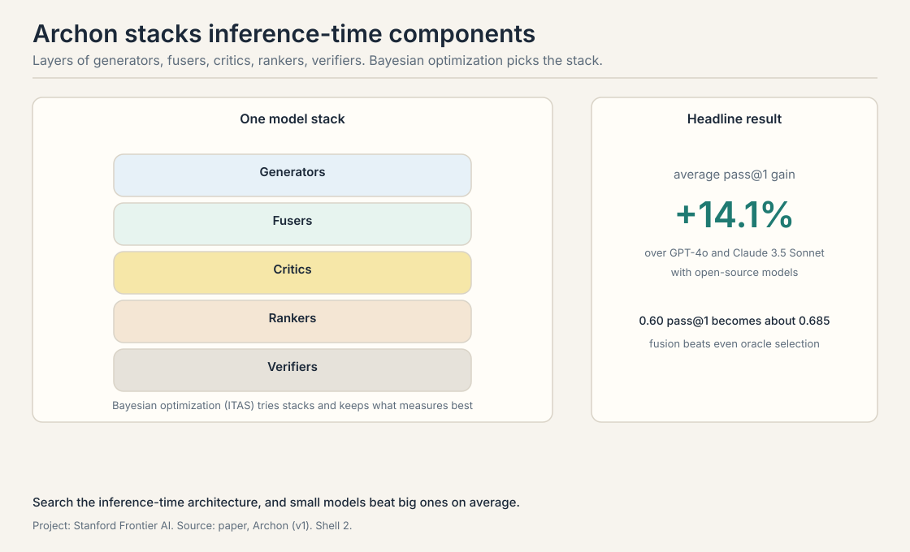

## The problem: the answer is in there, but one try misses it

Lecture 1 ended with a claim: a small model can solve problems far
above its apparent level if you ask it enough times. This chapter
turns that claim into a method and does the arithmetic.

Start with a concrete number. Suppose a model solves a given hard
problem with probability 5 percent per attempt. One try: 5 percent.
That is a failing grade. But the failures are not the whole story.
Each attempt is an independent draw. Some draws land.

A **verifier** decides which draws land. For math, the verifier
checks the answer against the known solution. For code, it runs
unit tests. The strongest possible verifier is the **oracle
verifier**: it always knows the right answer, so it never keeps a
wrong one. With an oracle, the only question is whether at least
one attempt was right. That fraction, problems solved by at least
one of k samples, is called **coverage**.

## First attempt, worked by hand: the math of asking again

Take the 5-percent model. Ask it 10 times. The chance that all 10
fail is 0.95 multiplied by itself 10 times:

```ascii
p(one try works)      = 0.05
p(all 10 fail)        = 0.95^10 = 0.60
coverage at 10 tries  = 1 - 0.60 = 0.40
```

Ten tries lift 5 percent to 40 percent. Ask 100 times:

```ascii
p(all 100 fail)       = 0.95^100 = 0.006
coverage at 100 tries = 1 - 0.006 = 0.994
```

A model that looks useless at one try solves the problem 99.4
percent of the time at 100 tries, provided something can spot the
right answer. That is the entire trick of repeated sampling. The
lecture's phrase for it: the models already know the answers to
hard problems. Sampling surfaces them.



### Subchapter: why the curve is log-linear

Each extra sample multiplies the failure chance by another 0.95,
so coverage climbs fast at first and then flattens: 10 tries give
40 percent, 100 give 99.4, 1000 give essentially 100. Plotted
against the log of the sample count, this curve is close to a
straight line. The paper calls it **log-linear scaling**: coverage
rises linearly with each tenfold increase in samples. That
predictable line is what makes the method engineering rather than
luck.

The line has a slope, and the slope has a meaning. Steeper means
each tenfold buys more coverage. Bigger models have steeper
slopes: their per-try p is higher, so the same k reaches further.
The lecture's reading: sampling and scale are complements. Scale
raises p. Sampling multiplies the draws.

### Subchapter: the independence assumption, honestly

The arithmetic assumes independent draws. Real samples are not
fully independent: the model's favorite patterns repeat, so the
effective number of distinct tries is smaller than k. The
coverage formula is an upper bound, and the gap between the bound
and reality is the **diversity** problem. Lecture 6 is about
closing it. For now, read every coverage number as "if the
samples were truly independent", and remember they are not.

## Where it breaks, part 1: the verifier is doing the real work

The arithmetic above assumed an oracle verifier. Real verifiers
are weaker, and the method is only as good as the check. The
lecture is blunt about this: with verifiers, the problem is easy.
Without them, you need a whole research area, training models to
judge answers, which the course covers later.



### Subchapter: the verifier's error budget, worked

Watch the failure concretely. Suppose the verifier is a learned
judge that is right 90 percent of the time. At 100 samples on a
problem the model truly cannot solve, the judge still approves
about 10 wrong answers by mistake. Sampling more now hurts: more
draws mean more chances for the judge to err. The coverage curve
keeps climbing, but the answers it certifies get less trustworthy.
The method converts a generation problem into a verification
problem. If verification is unsolved, nothing is solved.

The lecture adds a measured version of this decay. Trained
verifiers lose precision as the sample count grows: past roughly
400 samples, the judge's precision drops, because more draws mean
more adversarial-looking wrong answers for it to sift. The
operating point the lecture reports as shipped is around 100
samples: enough for the log-linear gains, before the judge
drowns. [uncertain: the 400-sample decay figure is from the
lecture's Part 3 summary. the lecture does not name the
verifier architecture.]

### Subchapter: the generation-verification gap

Here is the sharper form of the same problem. Coverage keeps
rising with k, but our ability to *pick* the winner does not.
With majority vote as the selector, accuracy plateaus at 10 to
50 samples: more samples add votes, but the votes keep saying
the same wrong thing. The generation-verification gap is the
distance between what sampling can find and what selection can
pick. It grows with k. Closing it needs better selectors, not
more samples. That is the subject of Lectures 6 and 7.

## Where it breaks, part 2: the bill

One hundred tries cost one hundred times one try. The samples run
in parallel, so wall-clock latency need not grow, but the compute
bill grows linearly with k.



### Subchapter: the cost frontier per problem

The lecture frames this as a frontier: for each problem there is
a tradeoff between the compute you spend and the accuracy you
get, and the right point on the frontier depends on the
problem's difficulty. Easy problems should get few samples. Hard
ones earn many. Spending 10,000 samples on a question a single
try would answer is pure waste.

The lecture walks through the Snell et al. result on how to
split the budget: parallel sampling versus sequential revision,
allocated by difficulty. On easy and medium problems, parallel
sampling wins: independent tries find the answer. On hard
problems, sequential revision wins: each attempt builds on the
last, and blind parallelism wastes draws. Test-time compute
beats more pretraining on easy and medium problems, and loses
on hard ones. The decision rule: match the strategy to the
difficulty, and spend where the verifier says it pays.

## The key question

If small models already contain the answers, can repeated
sampling plus verification make a small model beat a big one?

## What the papers found

The Large Language Monkeys paper answers yes, with numbers. A
Llama 3 8B model, far weaker than GPT-4o at one attempt, sampled
thousands of times with verification, outperforms the larger
proprietary models on hard math and coding benchmarks. On
agentic coding tasks in the style of SWE-bench, DeepSeek v3 with
1,000 samples beats Claude 3.5 Sonnet and o1-preview. The small
model does not get smarter. It gets more chances, and the
verifier does the selecting.



OpenAI's o1 showed the same scaling from the other side: with no
change to the weights, accuracy on the hard AIME math benchmark
rises log-linearly with test-time compute. Same curve, same
message. Inference-time effort is a real axis of capability,
independent of model size.

### Subchapter: Archon, the pipeline

The lecture then pushes one step further: **Archon**, an
**inference-time architecture**. Instead of sampling one model
many times and voting, Archon composes generators, critics, and
fusers into a small system that is itself tuned, per task, by
search over its configuration.



The pipeline, in order: ten generator models each sample once,
for diversity. A critic model lists strengths and weaknesses of
each candidate. A ranker orders them. Fuser models then write
the final answer, synthesizing across candidates rather than
picking one. The lecture's headline result: fusion beats oracle
selection. Even picking the best candidate perfectly does worse
than fusing several good ones.

Then the meta move: the architecture itself is searched. Under
a fixed call budget, Bayesian search over configurations finds
the per-task best: the critic-to-ranker-to-fuser ordering, how
many fusers to stack, where the funnel narrows. The reported
result: using only open-source models, Archon matches or beats
the frontier closed-source models of its day at pass@1, with an
average improvement of 14.1 percent over GPT-4o and Claude 3.5
Sonnet across instruction following, reasoning, math, and
coding. The point is architectural: how you spend inference
compute matters as much as how much you spend.

## Mapping back: what each property fixes

| One-shot failure | Test-time scaling answer | How |
|---|---|---|
| One try misses tail knowledge | Sample k times | Coverage is 1-(1-p)^k: 5% per try becomes 99.4% at 100 tries. |
| No way to pick the winner | Verify each sample | An oracle or test-based verifier selects without human labor. |
| Fixed effort per question | Spend compute where it pays | Parallel sampling plus per-problem budgets put tries on hard problems. |
| One model, one strategy | Compose inference architectures | Archon-style systems tune generators, critics, and fusers per task: +14.1% average pass@1. |

## The honest price: compute per question, forever

Test-time scaling never changes the model. Every question pays
the sampling bill again. A thousand samples per hard problem is
fine for a benchmark and ruinous for a product. Worse, the method
needs the verifier at answer time: for open-ended questions with
no checkable answer, the coverage trick does not apply.

That is why the loop of Lecture 1 matters. Test-time scaling
finds the answers. Training on them, the subject of Lecture 6,
moves the answers into the first try so you stop paying per
question. Test-time scaling is the discovery engine. It is not
the final product.

## Go deeper

<div style="position:relative;padding-bottom:56.25%;height:0;overflow:hidden;max-width:100%;margin:16px 0;">
<iframe style="position:absolute;top:0;left:0;width:100%;height:100%;" src="https://www.youtube-nocookie.com/embed/AZrU6y3pUcU" title="Noam Brown: Really Big Test-Time Compute in AI Changes Benchmarks, Safety and Research" frameborder="0" allow="accelerometer; autoplay; clipboard-write; encrypted-media; gyroscope; picture-in-picture" allowfullscreen></iframe>
</div>

- Noam Brown on large-scale test-time compute (No Priors, 2026): capability as a function of budget, benchmark-maxxing, limits on recursive self-improvement. https://www.youtube.com/watch?v=AZrU6y3pUcU
- Brown et al., Large Language Monkeys (2024): repeated sampling, coverage, the log-linear law. https://arxiv.org/abs/2407.21787
- Zhao et al., Archon (2024): inference-time architectures, critic-ranker-fuser pipelines, architecture search under a call budget. https://arxiv.org/abs/2409.15254
- OpenAI o1 system card (2024): test-time scaling curves on AIME, cited in lecture. https://openai.com/index/openai-o1-system-card/

> [!QA]
> Q: What is the difference between coverage and pass@k?
> A: Coverage asks: did at least one of the k samples solve the problem, assuming a verifier can identify it. It measures the search power of sampling. Pass@k in its common use is the same idea with the verifier folded in: the fraction of problems where a correct answer appears among k tries. Both rise log-linearly with k in the papers. The lecture stresses coverage because it isolates what sampling alone can do.
> Follow-up: Why log-linear and not some other shape?
> A: Because each sample multiplies the all-fail probability by (1-p). The failure probability decays exponentially in k, so success rises as 1 minus an exponential, which looks linear against log k over the practical range. The monkeys paper derives this theoretically. The lecture reports the empirical match.

> [!QA]
> Q: Walk me through the coverage arithmetic on a new example.
> A: A model solves a coding problem with p = 0.2 per try. At k = 5: all fail with 0.8^5 = 0.33, so coverage is 67%. At k = 20: 0.8^20 = 0.0115, coverage 98.9%. Notice the shape: the first 5 tries bought 47 points (20 to 67), the next 15 bought 32. Diminishing returns per sample, linear returns per tenfold. That is the whole planning intuition for sampling budgets.
> Follow-up: When does the formula overstate reality?
> A: When samples are not independent. If the model repeats its favorite wrong pattern, the effective k is much smaller than the nominal k. The formula is an upper bound. Diversity, Lecture 6's subject, is what closes the gap between the bound and the measured curve.

> [!QA]
> Q: If sampling works so well, why train bigger models at all?
> A: Three reasons. First, the verifier: without a reliable check, more samples add noise, not signal. Second, cost: k samples cost k times the compute on every question, while a bigger model pays once at training time. Third, the base rate p matters: a stronger model has higher per-try success, so it needs fewer samples to reach the same coverage. Sampling and scale are complements, not substitutes.
> Follow-up: Then what is the right number of samples?
> A: It depends on the problem. The lecture frames a cost-accuracy frontier: easy problems deserve few samples, hard ones many. Adaptive budgets, spending compute where the verifier says it pays, are the practical form of the idea.

> [!QA]
> Q: What did Archon add beyond "sample a lot and vote"?
> A: Architecture. Instead of one generator sampled k times, Archon builds a small system: multiple generators for diversity, critic models that judge candidates, and a fuser that produces the final answer, with the whole configuration tuned per task by search. With only open-source models it beat the frontier closed models of its day by 14.1 percent on average at pass@1. The lesson: inference compute is a design space, not just a dial.
> Follow-up: Does Archon change the weights?
> A: No. It is pure test-time scaling. That is both its strength, no training needed, and its price, the system cost is paid on every question.

> [!QA]
> Q: Walk me through Archon's pipeline on one question.
> A: Ten generator models each produce one answer: diversity by construction. The critic reads each candidate and lists strengths and weaknesses. The ranker orders the candidates by quality. Then fuser models read the ranked set and write a single final answer, synthesizing the best parts instead of picking one winner. The lecture's key finding: fusion beats even oracle selection. Synthesizing several good candidates outperforms perfectly picking the best one.
> Follow-up: Who decides the pipeline shape?
> A: Search. Under a fixed inference-call budget, Bayesian optimization tries configurations: how many generators, critic before or after ranker, how many fuser layers, where the funnel narrows. The critic-to-ranker-to-fuser ordering and stacked fuser layers emerged from that search, not from first principles.

> [!QA]
> Q: What is the generation-verification gap?
> A: Coverage rises with k, but our ability to pick the winner does not keep up. With majority vote as the selector, accuracy plateaus around 10 to 50 samples: the votes keep coming, but they keep agreeing on the same wrong answer. The gap between what sampling finds and what selection picks grows with k. Better selectors, learned reward models, debate, are the only way to close it.
> Follow-up: Why does majority vote plateau instead of slowly improving?
> A: Because the model's errors are correlated, not random. If 70% of samples share the same wrong reasoning pattern, more samples just add more votes for that pattern. Majority vote converges to the model's favorite answer, right or wrong. It measures popularity, not correctness.

> [!QA]
> Q: You ship a product where each query may spend at most 10 model calls. How do you allocate them?
> A: Not 10 blind samples. First, classify difficulty: a cheap model or a short probe estimates whether the question is easy, medium, or hard. Easy: 1-2 samples, spend the rest nowhere. Medium: parallel samples with majority vote. Hard: sequential revision, where each attempt sees the last, plus a critic pass on the finalists. Reserve 1-2 calls for verification, because an unverified answer from 10 samples is worth less than a verified answer from 5. The lecture's frontier logic: match strategy to difficulty, never spend uniformly.
> Follow-up: What breaks when the difficulty classifier is wrong?
> A: Easy questions get the hard-question budget, pure waste, and hard questions get starved. The classifier is itself a model call with its own error rate. In practice teams set a floor: every question gets at least 2 samples plus a verification call, so misclassification degrades gracefully instead of catastrophically.

## Recap: the whole lesson on one screen

1. **The answer is in there.** A 5-percent-per-try model is not
   a 5-percent model. Independent tries accumulate.
2. **The arithmetic.** Coverage at k tries is 1-(1-p)^k. At
   p=0.05: 10 tries give 40%, 100 give 99.4%.
3. **Log-linear.** Coverage rises linearly with each tenfold
   increase in samples. Predictable, engineerable.
4. **Small beats big.** Llama 3 8B with thousands of verified
   samples outperforms GPT-4o-class models at one try. DeepSeek
   v3 at 1,000 samples beats Claude 3.5 Sonnet and o1-preview on
   SWE-bench-style tasks.
5. **The verifier does the work.** An oracle makes sampling
   pure gain. A 90-percent judge approves wrong answers, and
   more samples then add noise. Precision drops past ~400
   samples.
6. **The bill.** k samples cost k times the compute. Parallelism
   saves latency, not money. Spend samples on hard problems.
   Match parallel vs sequential to difficulty.
7. **Architecture matters.** Archon composes generators,
   critics, rankers, and fusers, tuned per task by search:
   +14.1% average pass@1 over frontier closed models, with
   open models only. Fusion beats oracle selection.
8. **The price.** The model never improves. Every question pays
   again. The generation-verification gap grows with k.
   Training on the winners, Lecture 6, is how you stop paying.

## Official sources and further reading

**Official:**
- CS329A Part 2: Test-Time Compute Scaling (Autumn 2025): the
  lecture this chapter follows. [link](https://www.youtube.com/watch?v=-Ggc37xLj_Y)
- Brown et al., "Large Language Monkeys" (2024): repeated
  sampling, coverage, the log-linear law. [paper](https://arxiv.org/abs/2407.21787)
- Zhao et al., "Archon" (2024):
  - [inference-time](https://arxiv.org/abs/2409.15254)
  architectures, the 14.1% figure.

**Further reading:**
- OpenAI o1 system card (2024): test-time scaling curves on
  AIME, cited in lecture. https://openai.com/index/openai-o1-system-card/
- Snell et al., "Scaling LLM Test-Time Compute Optimally"
  (2024): parallel vs sequential allocation by difficulty,
  covered in lecture.

**Caveats from these sources.** All benchmark numbers are
Autumn 2025 snapshots. Model names date quickly. The monkeys
coverage figures assume oracle verification, which real
deployments do not have. The 14.1% Archon gain is an average
across four task families, not a uniform win. The 400-sample
verifier-precision decay is lecture-reported without a named
architecture. Snell et al. details are from the lecture's
walkthrough, not re-derived.

## Connections to the other courses

- **CS329Z:** how to build the verifiers this chapter assumes:
  unit-test harnesses and evaluation pipelines for agents.
- **CS329A L06:** where the verified samples go: training data
  for the next turn of the loop.
- **CS329A L07:** what happens when the verifier itself is
  learned and fallible.
- **CS229S:** the systems cost of the sampling bill: what
  1,000 parallel samples actually cost in FLOPs and memory.
