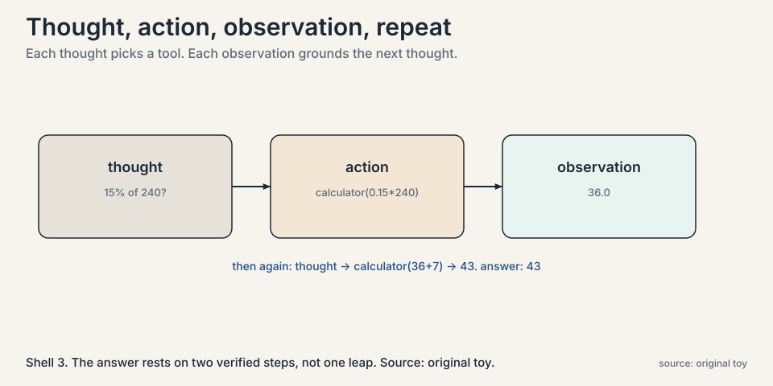
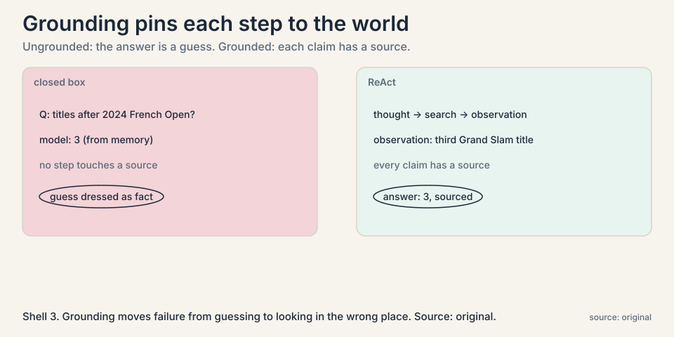
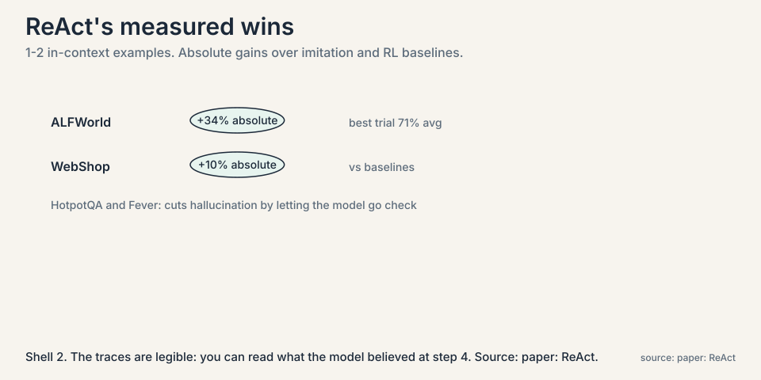
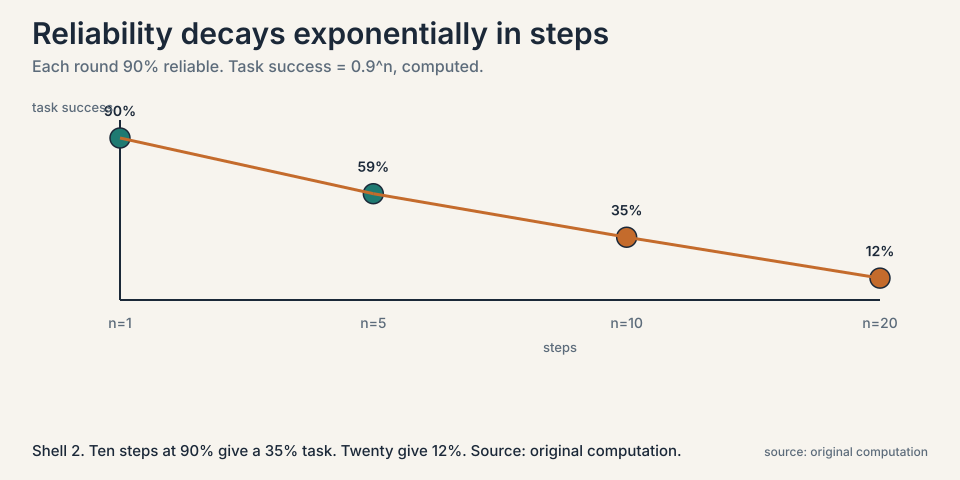
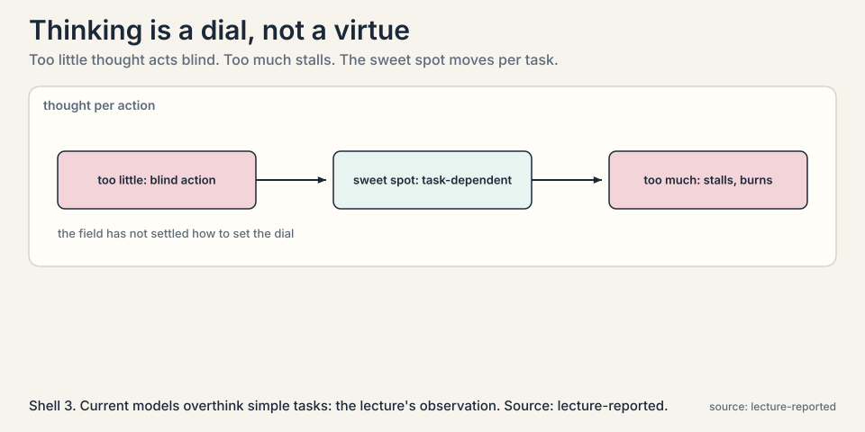

## The problem: the model cannot check anything

A language model on its own is a closed box. Ask it for the
population of a city, and it answers from memory. If the memory is
wrong, the answer is wrong, and nothing in the process can catch
it. Ask it to fix a bug, and it cannot run the code to see whether
the fix works. Reasoning, even long chain-of-thought reasoning,
stays inside the box.

Real tasks live outside the box. A coding agent must run tests.
A research agent must search the web. A data agent must query a
database. The lecture's starting point is plain: to be useful on
real-world tasks, models must interact with environments, tools,
and code, and learn from the interaction.

A **tool** is any function the model can call: web search, a
calculator, a code interpreter, a database query. A **trajectory**
is the full record of one task attempt: what the model thought,
what it did, what came back, step after step.

## First attempt: answer from memory

Watch the closed box fail on a concrete question: "How many
tennis Grand Slam titles did the winner of the 2024 French Open
men's final have at that moment?" A model answering from memory
might say 3, confusing the winner with someone else, or hedge.
There is no step in its process that touches a source. The answer
is a guess dressed as a fact.

### Subchapter: the uncheckable path, mechanically

This is not a rare edge. Every factual question, every
computation, every claim about the outside world goes through the
same uncheckable path. Chain of thought helps the model reason
about what it knows. It cannot give the model what it does not
know.

The mechanism of the failure: the model's only inputs are the
prompt and its weights. Both are fixed at answer time. There is
no channel by which the world can correct a wrong memory, so a
confident wrong answer and a confident right answer are
indistinguishable from the inside. The model cannot even know
it should be uncertain, because uncertainty would need a signal
it does not have.

## The key question

What if the model could act, read the result, and then keep
reasoning, with thought and action interleaved?

## The new idea: the ReAct loop

**ReAct** is a pattern, not a new model. The model writes a
thought, takes an action with a tool, reads the observation, and
repeats. Thought, action, observation. The reasoning guides the
acting. The acting grounds the reasoning.



### Subchapter: the loop, step by step

Here is the mechanism on a toy. The question: "What is 15 percent
of 240, rounded up, plus 7?"

```ascii
Thought:    I need 15% of 240 first. I will use the calculator.
Action:     calculator("0.15 * 240")
Observation: 36.0
Thought:    36 is already whole, so rounding changes nothing.
            Now add 7. I will use the calculator again.
Action:     calculator("36 + 7")
Observation: 43
Answer:     43
```

Read the loop. The thought says what is needed and picks the
tool. The action calls it. The observation, 36.0, is a fact from
the world, not a guess. The next thought builds on that fact.
The final answer rests on two verified steps instead of one
unverified leap.

Now the Grand Slam question in the same pattern:

```ascii
Thought:    I need the winner of the 2024 French Open men's final
            and his title count at that time. I will search.
Action:     search("2024 French Open men's final winner")
Observation: Carlos Alcaraz defeated Alexander Zverev.
Thought:    Now I need his Grand Slam title count after that win.
Action:     search("Alcaraz Grand Slam titles after 2024 French Open")
Observation: Third Grand Slam title.
Answer:     3, won at the 2024 French Open.
```

Each claim now has a source. The model still reasons, but the
reasoning is pinned to observations. That pinning has a name:
**grounding**. A grounded step is one the world has confirmed.



### Subchapter: what the paper measured

The pattern is old enough to have numbers. ReAct (Yao et al.,
2022), prompted with only one or two in-context examples:



On HotpotQA and Fever, ReAct with a simple Wikipedia API cuts
through the hallucination and error propagation of plain
chain-of-thought, because the model can go check. The paper
counts legibility as a result: the traces are readable, so you
can see what the model believed at step 4 and why it acted as
it did at step 5. That legibility is also what makes the
failure modes of the next section diagnosable.

The train-time counterpart exists too. Toolformer (2023) teaches
the model itself when to call tools, moving the decision from
the prompt into the weights. ReAct is the test-time pattern.
Toolformer is the train-time absorption. Same loop, different
stage of the flywheel.

## Where it breaks, part 1: errors compound along the trajectory

The loop's strength is also its weakness. Every step depends on
the steps before it.



### Subchapter: the compounding arithmetic

Work the numbers on a toy. Suppose each
thought-action-observation round is correct 90 percent of the
time, and a task needs 10 rounds:

```ascii
p(all 10 rounds correct) = 0.9^10 = 0.35
```

A 90-percent-reliable step gives a 35-percent-reliable task.
At 20 rounds it is 0.9^20 = 0.12. Long trajectories decay
exponentially in reliability. One bad tool call, one
misread observation, and everything downstream builds on sand.
The lecture's evaluation chapter returns to this with real data:
long-horizon tasks are where agents fail most.

### Subchapter: the independence simplification, honestly

The arithmetic assumes each round fails independently. Real
errors correlate: a confused model makes confused tool calls,
and a misleading observation misleads the next thought in the
same direction. Correlated failures are worse than independent
ones, because recovery behaviors assume the next step is a
fresh draw. Read 0.9^10 as the optimistic bound. Reality
decays faster.

## Where it breaks, part 2: choosing badly, thinking too much

Two more failure modes, both from the lecture discussion. First,
**poor tool choice**: the model calls the wrong tool, or calls
the right tool with a bad query, and the observation misleads the
rest of the trace. The loop amplifies the mistake instead of
catching it.

### Subchapter: tool choice is the new failure surface

Grounding moves the failure from "the model guessed" to "the
model looked in the wrong place". A bad search query returns a
misleading snippet, and the trace builds on it confidently.
The practical consequence: the tool's description is not
documentation, it is a prompt. It is the only thing telling the
model when to reach for that tool. Teams that treat tool
descriptions as API docs get misrouted agents. Teams that write
them as decision rules get better routing.

### Subchapter: the thinking dial

Second, the ratio of thinking to acting.



The lecture notes that current models **overthink**: they produce
very long reasoning traces even for simple tasks, burning time
and compute before acting. Too little thought and the action is
blind. Too much and the agent stalls. The right balance differs
per task, and the field has not settled how to set it. The
decision rule for now: budget thinking per task difficulty, and
watch for the symptom, long traces on trivial tasks, as the
signal to turn the dial down.

## Mapping back: what the loop fixes

| Closed-box failure | ReAct answer | How |
|---|---|---|
| Answers from memory, uncheckable | Act with tools | Search, calculators, and code execution return facts from the world. |
| Reasoning floats free of evidence | Interleave thought and observation | Each thought is followed by an action. Each action's result feeds the next thought. |
| One leap, no recovery | Stepwise trajectory | A bad observation is visible in the trace, so later steps, or a retry, can correct it. |

The lecture also names what ReAct does not solve, which becomes
the next chapters: ReAct follows one path greedily, with no
backtracking and no search over alternatives (Lecture 5). Its
trajectories are training data for the loop only if something
scores them (Lecture 4).

## The honest price: time, money, and compounding error

Every tool call costs latency and often money: a search query, a
code execution, an API call. A 20-step trajectory with three
tool calls per step is 60 external calls. And reliability decays
as 0.9^n in the number of steps. The pattern that grounds the
model is the same pattern that makes long tasks fragile.

The lecture discussion points at the open engineering questions:
how much thinking before acting, which model does which subtask
(a **compound system** that delegates to specialized models), and
how the agent remembers what it learned. That last one has a
name: **memory**. An agent that keeps notes across tasks, say a
mental map of a codebase it works in often, starts each new task
less blind. The lecture treats memory as important and
under-built: the right structures for agent memory are still an
open research question.

## Go deeper

<div style="position:relative;padding-bottom:56.25%;height:0;overflow:hidden;max-width:100%;margin:16px 0;">
<iframe style="position:absolute;top:0;left:0;width:100%;height:100%;" src="https://www.youtube-nocookie.com/embed/R_mdD6dRqz0" title="How ReAct loops work, built line by line" frameborder="0" allow="accelerometer; autoplay; clipboard-write; encrypted-media; gyroscope; picture-in-picture" allowfullscreen></iframe>
</div>

- How ReAct loops work, built line by line: the full loop as code, including the failure cases, tool-failure handling, and the iteration cap. https://www.youtube.com/watch?v=R_mdD6dRqz0
- Yao et al., ReAct (2022): the pattern, HotpotQA/Fever/ALFWorld/WebShop results. https://arxiv.org/abs/2210.03629
- Schick et al., Toolformer (2023): teaching the model itself when to call tools, the train-time side. https://arxiv.org/abs/2302.04761

> [!QA]
> Q: What exactly is the ReAct pattern?
> A: An interleaved loop: the model writes a thought about what to do next, takes an action by calling a tool, reads the observation the tool returns, and repeats. Thought guides action. Observation grounds thought. In the worked toy, the model computes 15% of 240 with a calculator (36.0), then adds 7 (43), with each step verified by the tool instead of guessed.
> Follow-up: How is this different from chain of thought?
> A: Chain of thought is reasoning only: the whole trace stays inside the model. ReAct alternates reasoning with actions whose results come from outside the model. The observations can surprise the model, correct it, or supply facts it never knew. That outside contact is the whole point.

> [!QA]
> Q: Walk me through the mechanism: what does each part of the loop do?
> A: The thought does two jobs: it states what is needed next, and it selects the tool. The action executes the tool call with arguments the model wrote as text. The observation returns the world's answer into context, where the next thought can read it. The loop stops when the model emits no tool call: the model decides it is done, not the harness. That exit rule is load-bearing, because a wrong stop condition means either infinite loops or truncated tasks.
> Follow-up: What is the one line of code that matters most?
> A: The branch on "is there a tool call". That single branch is the entire control flow: tool call means continue, no tool call means answer. Everything else, the registry that validates arguments, the cap on iterations, the log of one line per turn, is scaffolding around that branch.

> [!QA]
> Q: Why do long agent trajectories fail so often?
> A: Compounding error. If each round is 90 percent reliable and the task needs 10 rounds, the task succeeds 0.9^10 = 35 percent of the time. At 20 rounds it is 12 percent. Every step inherits the mistakes of the ones before, so reliability decays exponentially with trajectory length. This is why the lectures treat long-horizon reliability as the central open problem.
> Follow-up: What helps?
> A: Three things the course covers: verifiers that check intermediate steps, not just final answers. Search over trajectories so one bad path does not doom the task (Lecture 5). And recovery behaviors, where the agent detects a bad observation and replans. None of them removes the exponential. They improve the base.

> [!QA]
> Q: What did the ReAct paper actually measure?
> A: With only one or two in-context examples, ReAct beat imitation-learning and RL baselines by 34 points absolute on ALFWorld and 10 points on WebShop, with its best ALFWorld trial averaging 71% success. On HotpotQA and Fever, a Wikipedia API let it cut the hallucination that plain chain-of-thought suffers, because the model could go check. The paper also counts trace legibility as a result: you can read what the model believed at each step.
> Follow-up: What did it not solve?
> A: Large action spaces, which need more demonstrations than fit in context, and the token and latency cost of interleaving reasoning with every action. A model that simply acts is cheaper per step. ReAct buys reliability per step at a per-step price.

> [!QA]
> Q: What is "grounding" and why does the lecture care about it?
> A: Grounding means pinning a reasoning step to something outside the model: a search result, a calculator output, a test run. An ungrounded step is a guess. A grounded step is a fact the world confirmed. ReAct grounds each step through the observation that follows the action. The lecture's claim is that real-world usefulness starts where grounding starts, because uncheckable reasoning cannot be trusted on facts, code, or data.
> Follow-up: Can the model still go wrong with grounding?
> A: Yes. Poor tool choice grounds the reasoning in the wrong facts: a bad search query returns a misleading snippet, and the trace builds on it confidently. Grounding moves the failure from "the model guessed" to "the model looked in the wrong place", which is more diagnosable but still a failure.

> [!QA]
> Q: What is overthinking, and how do you set the thinking dial?
> A: Overthinking is long reasoning traces on simple tasks: the model burns time and compute reasoning about what to do instead of doing it. Underthinking is the reverse: acting on a thin read of the situation. The lecture reports no settled rule. The working practice: budget thinking per task difficulty, cap iterations in the harness rather than the prompt, and watch trace length on trivial tasks as the signal to turn the dial down.
> Follow-up: Why not let the model decide how much to think?
> A: That is what happens by default, and it overthinks. The model's training rewards thorough-sounding traces, not cheap ones. An external budget, a max-iteration cap or a difficulty-based token budget, is the only reliable control. The model optimizes the trace. You optimize the bill.

> [!QA]
> Q: You are building a ReAct support agent with 6 tools. Where does it break first in production?
> A: At the tool registry, then at the stop condition. The model writes tool arguments as text, so malformed arguments are normal: the registry must validate and return the error as an observation, not raise, so the model can route around it. Then the exit: with no tool call meaning "done", a model that keeps finding things to check loops until the cap. Set the cap as a bounded range, log one line per turn, and pin the goal in context so long traces do not drift. The first production outage is always the unbounded loop.
> Follow-up: How do tool descriptions affect reliability?
> A: Directly. The description is the model's only decision rule for when to call the tool. Vague descriptions get misrouted calls. Write each description as a when-to-use rule with an example, not as API documentation. Then test routing on 30 realistic tasks before trusting it.

## Recap: the whole lesson on one screen

1. **The closed box.** A model alone cannot check facts, run
   code, or query data. Chain of thought reasons about what the
   model knows. It cannot supply what it does not.
2. **The toy failure.** A from-memory answer to a factual
   question is a guess dressed as a fact. No step touches a
   source.
3. **The key question.** What if thought and action interleave,
   each grounding the other?
4. **ReAct.** Thought, action, observation, repeat. The toy:
   calculator("0.15 * 240") returns 36.0, then 36 + 7 = 43,
   each step verified by the tool.
5. **The paper's numbers.** ALFWorld +34 points absolute,
   WebShop +10, best trial 71%, from 1-2 examples. Traces are
   legible.
6. **Grounding.** Every claim in the trace is pinned to an
   observation from the world.
7. **Compounding error.** 0.9^10 = 0.35. Ten 90-percent steps
   give a 35-percent task. Long trajectories decay exponentially.
   Errors correlate, so reality is worse.
8. **Tool choice and overthinking.** Wrong tool, wrong facts.
   Tool descriptions are prompts, not docs. Too much thought
   stalls. Too little acts blind. The ratio is unsettled.
9. **The honest price.** Tool calls cost latency and money.
   Reliability decays with length. Memory across tasks, and
   which model does which subtask, are open questions.

## Official sources and further reading

**Official:**
- CS329A Part 4: Learning from Feedback with Tools and Code
  (Autumn 2025): the lecture this chapter follows. [link](https://www.youtube.com/watch?v=Lxh9RF5S-K0)
- Yao et al., "ReAct: Synergizing Reasoning and Acting in
  Language Models" (2022): the pattern. [paper](https://arxiv.org/abs/2210.03629)

**Further reading:**
- Schick et al., "Toolformer" (2023): models that teach
  themselves when to call tools, the train-time side of this
  chapter's test-time pattern. https://arxiv.org/abs/2302.04761

**Caveats from these sources.** ReAct is a prompting pattern
over a frozen model. Later work folds the behavior into
training. The compounding-error arithmetic assumes independent
per-step reliability, which is a simplification: real errors
correlate. The Grand Slam toy uses 2024 facts as illustration.
Verify current counts independently.

## Connections to the other courses

- **CS329Z:** the engineering of this chapter's pattern: tool
  definitions, function calling, and agent frameworks in code.
- **CS329A L04:** what happens when the trajectory's feedback,
  test results, becomes a training signal.
- **CS329A L05:** the fix for ReAct's greediness: searching
  over many trajectories instead of following one.
- **CS329A L08:** why long trajectories fail in practice, and
  how the field measures it.
