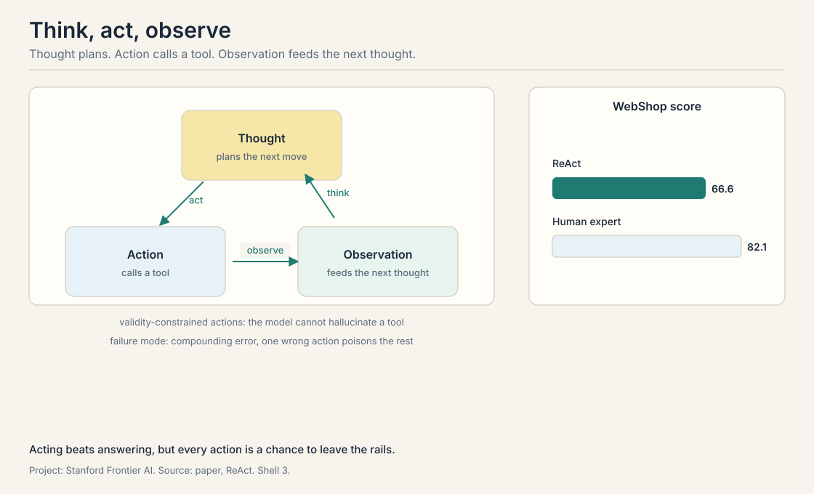
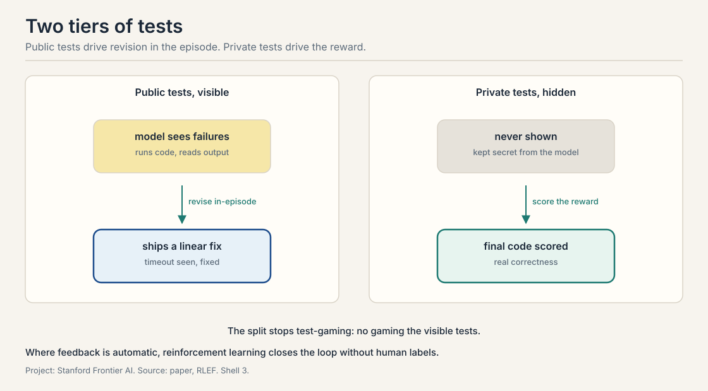

## Acting beats answering

*Builds on: Lecture 1's agent definition and Lecture 2's verifiers.*

A model that only answers is stuck with what it knows. A model
that can act can look things up, run code, and check its work.
The shift from answering to acting is the shift from Lecture 1's
chatbot to Lecture 1's agent. This lecture studies three ways to
make action work: a prompting pattern that interleaves thought
and action, reinforcement learning that grounds code in execution
feedback, and a method that teaches harmlessness without armies
of human labelers.

## ReAct: think, act, observe

*Builds on: The shift from answering to acting, with the prompting pattern that interleaves thought and action.*

**ReAct** is a **thought-action-observation** loop: a prompting
pattern that interleaves reasoning and acting. The model writes a
thought, takes an action, reads the observation the environment
returns, and repeats. A thought is a
reasoning trace. An action is a tool call, such as a search or a
lookup. An observation is what the tool returns.

The lecture walks through the paper's HotpotQA example. The
question asks which film's director also directed a given movie.
The model thinks: I need to find the director. It acts: searches
for the film. It observes: the search results. It thinks: now I
need the director's other films. It acts: looks up the director's
page. The observation contains "Front Row", the answer. In the
paper's second example the model chases the film "Apple Remote"
through the same loop. Each action grounds the next thought in
facts outside the model's weights.

The results: on HotpotQA, **FEVER**, Fact Extraction and
VERification, a fact-checking benchmark, and WebShop, ReAct beats
reasoning-only and acting-only baselines. WebShop is a shopping
task where the agent buys items from instructions. ReAct scores
66.6 percent against a human expert's 82.1. Two design facts
matter. The action space is **validity-constrained**: the model
can only take actions the environment accepts, so it cannot
hallucinate a tool. And the failure mode is **compounding
error**: one wrong action poisons the observations that follow,
so long chains drift. Acting beats answering, but every action
is a chance to leave the rails.

## RLEF: grounding code in execution

*Builds on: ReAct's tool use, training the model to use tools well through execution feedback.*

ReAct gives the model tools. **RLEF**, reinforcement learning
from execution feedback, teaches the model to use them well for
code. The problem: a model can write code that looks right and
fails. The fix: train on what the code does when run.

The design has **two-tier tests**. **Public tests** are visible
to the model during the episode: it writes code, runs the public
tests, reads the failures, and revises. **Private tests** are
hidden and used only for the reward: the model's final code is
scored against them. The split stops the model from gaming the
visible tests at the expense of real correctness. The lecture's
example is a palindrome check that times out on the public tests:
the model sees the timeout, finds the quadratic loop, and ships a
linear fix.

The learning algorithm is **PPO**, proximal policy optimization,
a reinforcement learning method that updates the model in small
steps so it does not forget what it already knows. The design
choice the lecture stresses: a **token-level policy** paired with
a **turn-level value**. The policy chooses each token of code.
The value estimates the worth of the whole turn. One
**advantage** signal, how much better this turn was than expected,
trains both. The lecture reports training on **CodeContests** with a
Llama 3.1 model: solve rate rises on a log scale of attempts, the
10-at-K metric climbing as the model learns from execution.

The lecture draws the general lesson. For math and code, the
environment gives free, honest feedback: the answer is right or
wrong, the code runs or crashes. Wherever feedback is automatic,
reinforcement learning can close the loop without human labels.
Where it is not, the next section shows what replaces the
human.

## Constitutional AI: feedback without the crowd

*Builds on: RLEF's execution feedback, asking what replaces the human where execution feedback does not exist.*

**Constitutional AI** asks whether a model can teach itself to be
harmless. The method, from Anthropic's 2022 paper, has two
phases.

Phase one: give the model a **constitution**, a list of
principles, 16 in the original paper. The model generates a
response to a harmful prompt, then **self-critiques**: it reads
its own response against the constitution, finds the violation,
and performs **self-revision**. The revised pairs become supervised training
data. No human wrote the labels. The model did.

Phase two: **RLAIF**, reinforcement learning from AI feedback.
The model compares pairs of responses and a **preference model**
learns which the constitution prefers. Then reinforcement
learning steers the model toward preferred responses. The
preference model is the RLAIF counterpart of RLHF's reward model,
but its labels come from a model, not from human raters.

The results, reported as **Elo** scores from human evaluations:
the method moved the helpfulness-versus-harmlessness frontier
outward. **Helpfulness** is how well the model serves the user:
correct, specific, complete answers. Before, safer meant less
helpful. After, the model got safer without getting dumber. Two honest footnotes from the
lecture. Post-training, all of this, is about 5 percent of the
total compute. The base model's knowledge comes from
pretraining. And **unlearning**, removing knowledge the model
already has, remains an open problem: teaching the model not to
say something is easier than making it not know it.

> [!QA]
> Q: Trace one ReAct episode on the Apple Remote question.
> A: Thought: the question asks about the film Apple Remote, so I
> need to search for it. Action: search Apple Remote film.
> Observation: results mention a 2005 documentary. Thought: the
> question asks for the director's other work. Action: look up
> the director. Observation: the director page lists Front Row.
> Thought: I have the answer. Action: answer Front Row. Each
> observation grounds the next thought. If the first search had
> returned nothing, the thought would have pivoted to a
> different query.
> Follow-up: Where does compounding error enter this trace?
> A: At the first action. A bad search query returns irrelevant
> results, the next thought reasons about the wrong film, and
> every step after inherits the mistake. The trace has no way to
> know it went wrong except a later observation that fails to
> cohere. Longer chains mean more chances to derail.

> [!QA]
> Q: Why split RLEF's tests into public and private?
> A: The model needs feedback during the episode, so some tests
> must be visible. But if the reward used the same visible
> tests, the model would optimize for them specifically: pass the
> known tests, fail the general case. Hidden private tests make
> the reward measure real correctness. The public tests teach
> revision. The private tests keep it honest.
> Follow-up: Is this just train-test split with extra steps?
> A: In spirit, yes, with one twist: the "train" tests are
> interactive. The model runs them, reads failures, and revises
> inside the episode. A static split only scores. The two-tier
> split scores and teaches.

> [!QA]
> Q: What does the turn-level value buy in RLEF?
> A: Credit assignment. The policy writes tokens. Some tokens are
> load-bearing, most are scaffolding. The turn-level value
> estimates the whole attempt's worth, and the single advantage
> signal tells the policy which turns were better than expected.
> Without it, the model would not know whether the fix came from
> the loop rewrite or the variable rename.
> Follow-up: Why not a token-level value?
> A: Tokens in code have meaning only in context. Scoring each
> token in isolation is noisy and expensive. The turn is the
> natural unit: the code either passes or fails.

> [!QA]
> Q: How does Constitutional AI avoid just teaching the model to hide bad behavior?
> A: It might not fully. The honest answer: the constitution is
> enforced through the model's own judgments, so the method's
> ceiling is the model's current moral competence. The paper's
> evidence is behavioral: human evaluators rated the outputs as
> both safer and not less helpful, and the Elo frontier moved
> outward. Whether the model internalized the principles or
> learned to perform them is not measured.
> Follow-up: What would measure it?
> A: Adversarial probing: prompts designed to make the safe
> behavior fail, especially in distribution shifts the
> constitution never mentions. The lecture flags unlearning as
> the open problem: the knowledge behind the bad behavior is
> still in the weights.

> [!QA]
> Q: Post-training is 5 percent of compute. Why does it matter so much?
> A: Because pretraining teaches what the model knows and
> post-training teaches how it behaves. A base model that knows
> everything but answers like a document is useless as an agent.
> Instruction tuning, RLHF, RLAIF, RLEF: all of them are the
> final 5 percent that turns a text predictor into something
> that follows instructions, uses tools, and avoids harm. The
> payoff is behavioral, not factual.
> Follow-up: Does that mean pretraining is over-engineered?
> A: No. The lecture's later evidence says the opposite: for the
> hardest problems, bigger pretrained models still win. The 5
> percent steers the ship. The 95 percent builds it.

> [!QA]
> Q: Design a verifier for a ReAct shopping agent. What breaks?
> A: The verifier checks the bought item against the instruction:
> right product, right price bound, right quantity. WebShop's
> 66.6 percent versus the human 82.1 shows the headroom. What
> breaks: ambiguous instructions the verifier cannot judge, and
> compounding error, where one bad search poisons the chain.
> The validity-constrained action space stops hallucinated
> tools but cannot stop bad reasoning with real tools.
> Follow-up: How would RLEF-style training help here?
> A: Split the feedback: visible checks during the episode, such
> as price bounds and attribute matches, and a hidden reward on
> final purchase correctness. The model learns to revise from
> the visible checks without gaming them.

> [!QA]
> Q: When is AI feedback better than human feedback?
> A: When the feedback is cheap, fast, and consistent, and the
> task is well-specified. RLAIF scales to millions of
> comparisons where human labeling stalls. Execution feedback
> is better than both when it exists: a compiler does not have
> opinions. AI feedback is worse when the judgment is genuinely
> human: taste, values, what counts as helpful. The lecture's
> map: use execution where it exists, AI feedback where it
> scales, humans where judgment is the product.
> Follow-up: What is the failure mode of AI feedback?
> A: Shared blind spots. The labeler and the learner are the
> same species of model, so the same weaknesses hide in both.
> The feedback amplifies what the model already believes. Human
> labels, for all their cost, are an independent check.

## Recap: the whole lesson on one screen

1. **Act, do not just answer.** ReAct loops thought, action,
   observation. WebShop: 66.6 against a human 82.1.
2. **Actions compound.** One wrong tool call poisons the chain.
   Validity-constrained actions stop fake tools, not bad
   reasoning.
3. **Execution is honest feedback.** RLEF trains code models on
   what runs. Public tests teach revision. Private tests keep
   the reward honest.
4. **Credit per turn.** Token-level policy, turn-level value, one
   advantage signal. The unit of learning is the attempt.
5. **Constitutions replace crowds.** Self-critique plus revision
   makes the training data. RLAIF makes the preference model.
   The helpfulness-harmlessness frontier moves outward.
6. **Five percent steers.** Post-training is a sliver of compute
   with outsized behavioral effect. Unlearning stays open.

## Used where, as of October 2026

- **Claude Code, Codex:** Anthropic's agent guidance defines an
  agent as an LLM using tools in a loop on environmental feedback
  (Anthropic, December 2024). Codex runs that loop on coding tasks:
  it writes and edits code, executes commands, runs tests, and
  inspects files (Wikipedia, October 2026). The ReAct shape,
  thought, tool call, observation, is the visible loop of these
  production coding agents.
- **RL on verifiable rewards (RLVR):** the RLEF idea generalized.
  DeepSeek-R1's training used execution-style rewards on math and
  code, and the recipe spread across labs in 2025.
- **Constitutional AI in production:** Anthropic rewrote
  Claude's constitution in January 2026 (reported September
  2026), and the constitutional training methodology remains the
  documented basis of Claude's alignment (Anthropic, 2022). The
  RLAIF pattern, models writing the preference labels, is now
  the standard hybrid: most production systems combine RLAIF for
  scale with RLHF for quality validation.
- **WebShop-style evaluation:** the tool-use benchmark lineage
  continues in tau-bench (Sierra, June 2024), tau-2-bench (2025),
  and tau-3-bench (March 2026), all listed as current tool-use
  agent benchmarks (Wikipedia, October 2026).

## Official sources and further reading

**Official:**
- CS329A Part 4: Learning from Feedback with Tools and Code
  (Autumn 2025). https://www.youtube.com/watch?v=Lxh9RF5S-K0

**Further reading:**
- Yao et al., "ReAct" (2022).
  https://arxiv.org/abs/2210.03629
- Gehring et al., "RLEF" (ICML 2025).
  https://arxiv.org/abs/2410.02089
- Bai et al., "Constitutional AI" (2022).
  https://arxiv.org/abs/2212.08073

**Caveats from these sources.** The ReAct numbers are from the
2022 paper's benchmarks. The RLEF results are as reported in the
lecture from the ICML 2025 paper. The 5 percent post-training
figure is the lecture's estimate of compute share.

## Connections to the other courses

- **CS329Z:** the builder's view of tool use: function calling,
  agent loops, and how ReAct is implemented in practice. This
  lecture adds the learning theory on top.
- **CS329H:** preference models, reward models, and the RLHF
  machinery that Constitutional AI's RLAIF mirrors.
- **CS336:** pretraining versus post-training: where the 95
  percent goes and why the last 5 percent has outsized
  behavioral effect.
