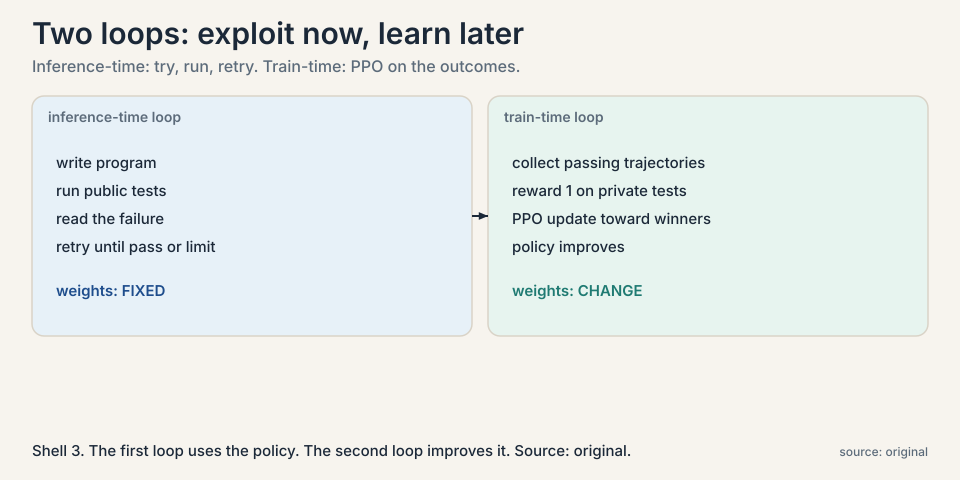
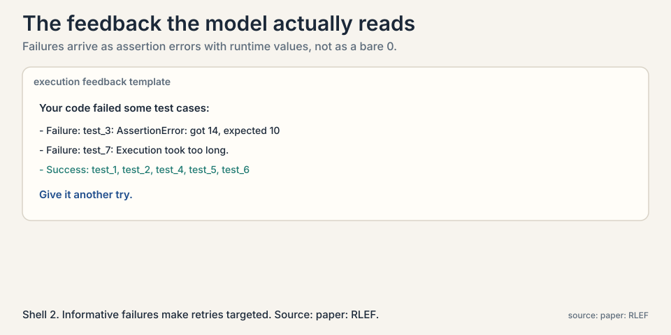
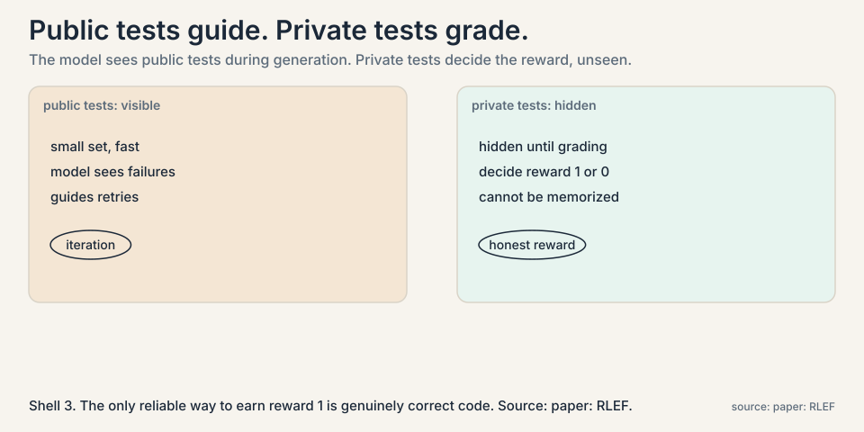
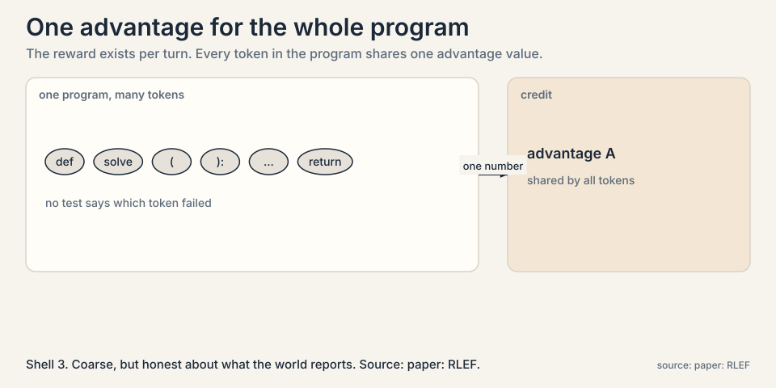
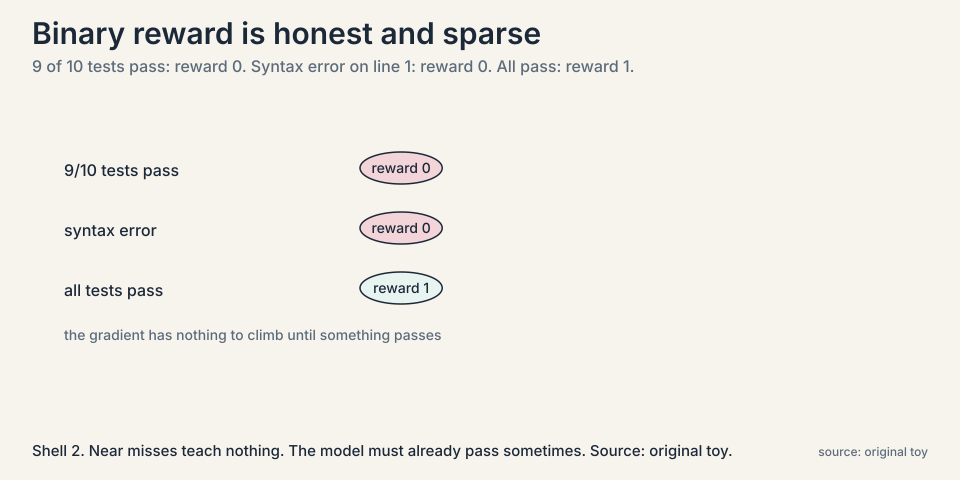

## The problem: coding agents need a teacher

Lecture 3 gave the agent hands: it can write code and run it.
Now a harder question: how does the agent get better at writing
code? Human feedback is slow. But code has a built-in teacher:
run it and see. A program either passes its tests or it does not.
That pass/fail signal is free, fast, and honest. This chapter is
about turning it into learning.

**Reinforcement learning** (RL) is learning from rewards. The
model, called the **policy**, takes actions. The world returns a
**reward**, a number saying how good the outcome was. The policy
updates toward actions that earned high reward. Here the actions
are generated programs, and the reward comes from executing them.

### Subchapter: the RL loop in one paragraph

Three objects, one cycle. The **policy** is the model that acts.
The **environment** is whatever responds: here, a code executor
running tests. The **reward** is the number the environment
returns: 1 for pass, 0 for fail. The update nudges the policy's
probabilities toward actions that earned reward. Repeat
thousands of times. The policy that once guessed now writes
code that passes, because passing is the only behavior the
update ever reinforced.

## The toy: a palindrome fix, step by step

The lecture's example: write code that finds palindrome
substrings, strings that read the same forwards and backwards.
The loop runs in turns. Watch two of them.

```ascii
turn 1:
  model writes:  a straightforward palindrome checker
  run public tests:  FAIL, execution timeout on long inputs
  feedback to model: "timeout on input of length 500"

turn 2:
  model writes:  an optimized version, skips redundant checks
  run public tests:  PASS
  feedback to model: "all public tests pass"
```

The first attempt is too slow. The test output says exactly how:
timeout. The model reads that feedback and writes a faster
version. This is the **inference-time feedback loop**: try, run,
read the failure, try again. No weights change yet. The model is
just iterating with the compiler as its critic.



### Subchapter: the inference-time loop, step by step

Then comes the training step. Collect the trajectories that ended
in passing solutions. Give them reward 1, failures reward 0, a
**binary reward**. Update the policy with RL so that
pass-producing behavior becomes more likely. This is the
**train-time loop**: the policy itself improves.

The lecture names the algorithm family as PPO, a standard
policy-gradient method, and stresses the two phases: exploit the
current policy with inference-time retries, then update the
policy on the execution results.

### Subchapter: PPO in one paragraph

**PPO** (proximal policy optimization) is the workhorse
policy-gradient algorithm. It estimates which actions were
better than average, the **advantage**, and nudges the policy
toward them, but clips the nudge: no single update may move the
policy too far. The clip is the whole idea. Without it, one
lucky batch of rewards can yank the policy into a region where
everything it learned breaks. With it, learning is boring and
stable, which is what you want when each update costs a training
run.

### Subchapter: the feedback the model reads

The loop works because the feedback is informative, not just a
number.



The paper's template shows assertion errors with runtime values,
which tests timed out, and which passed. "Got 14, expected 10"
tells the model what to fix. A bare 0 would not. The
inference-time loop is only as smart as the failure text it
reads.

## The trick that makes it honest: two tiers of tests

Here is the failure the paper's design prevents. If the model
practices on the same tests it is graded on, it can memorize the
expected outputs instead of learning to code.



### Subchapter: the two tiers, deep

The fix is a **two-tier test strategy**:

- **Public tests**: a small set, visible during generation. Fast
  iteration. The model sees failures here and retries.
- **Private tests**: hidden during generation. They decide the
  reward. The model never sees them, so it cannot memorize them.

The separation is doing real work. Public tests guide the search.
Private tests grade it. Because the reward comes only from hidden
tests, the only way to earn reward 1 reliably is to write
actually correct code. The lecture calls this out as a key
innovation of the self-improvement loop: the model gets execution
feedback without getting the answers.

### Subchapter: why memorization is the threat

A model that sees the grading tests can pass by storing
input-output pairs, the way a student passes by memorizing the
answer key. The behavior looks like coding skill on the
benchmark and collapses on any new problem. The two-tier split
is a train-test split applied to the reward itself: the public
tests are the training signal the model may adapt to, the
private tests are the held-out check it cannot. Any self-training
loop needs this split, or it trains a memorizer.

## A subtlety: who gets the credit

The policy writes code one token at a time, so the finest control
is per token. But the reward arrives per turn: the whole program
either passes or fails.



### Subchapter: why per-token credit is impossible here

The paper computes the **value function**, the model's estimate
of future reward, at the turn level, using the last token of the
response, and assigns a single advantage number to all tokens in
the turn. Every token in a passing program shares the credit
equally.

The lecture notes this is close in spirit to GSPO-style updates:
reward the whole sequence, not individual tokens. It is honest
about the tradeoff. Per-token credit would be more precise but
the signal does not exist: no test says "this semicolon was the
problem". Turn-level credit is coarse but matches what the world
actually reports.

### Subchapter: what turn-level credit loses

All localization. A program that is perfect except one wrong line
gets the same per-token update as a program that is wrong
everywhere, since both earn reward 0. The model cannot learn
"everything except line 7 was fine". This is the price of
outcome-only feedback, and it motivates process-level rewards in
later work.

## Where it breaks, part 1: the signal is sparse

Binary reward is a blunt instrument.



### Subchapter: sparsity, worked

A program that fails 9 of 10 tests gets the same reward, 0, as
one that fails all 10, and the same 0 as one with a syntax error
on line 1. The model learns nothing from near misses. Work the
consequence: early in training, when almost everything fails,
almost every trajectory carries reward 0, and the policy has no
gradient to climb. The loop needs the model to be good enough
already that some trajectories pass. Bootstrapping from zero is
the hard part.

The decision rule this forces: never start RLEF from a model
that cannot pass anything. The paper trains Llama 3.1 models
that already write plausible code, then lets execution feedback
sharpen them. The base model must clear the first bar on its
own, or the loop has nothing to amplify.

## Where it breaks, part 2: negatives teach little

The lecture is candid: learning from negative examples is not
nailed. The loop keeps the winners and drops the losers, so the
model learns what success looks like but gets no structured
lesson from failure. A failed trajectory contains information,
which step went wrong, but the binary reward discards it. Later
lectures return to this gap: process-level feedback, judging
intermediate steps, is an active research area precisely because
outcome-only reward wastes so much signal.

### Subchapter: the shaping temptation

The obvious fix is shaped rewards: 0.7 for passing 7 of 10
tests, partial credit for partial progress. It densifies the
signal, and it changes the objective. The model learns to pass
easy tests while ignoring hard ones, because the reward says
easy tests are worth nearly as much. Shaped rewards invite
gaming. The paper's binary choice keeps the objective clean at
the cost of sparsity. There is no free option here, only the
choice of which failure you prefer.

## The key question, answered

Can a coding agent improve with no human labels? Yes, where
execution is the teacher: public tests for iteration, hidden
tests for reward, RL to absorb the wins. The lecture reports this
as one of the first demonstrations that execution feedback alone
can drive large gains in coding models. The paper's headline
result: Llama 3.1 8B and 70B models trained with RLEF on
CodeContests compete with GPT-4-class systems across sampling
budgets. [uncertain: exact solve-rate numbers are read from the
paper's Figure 1. the lecture does not quote them.]

## Mapping back

| Missing piece | RLEF answer | How |
|---|---|---|
| No training signal for agents | Execution feedback | Run the code. Tests pass or fail. Free, fast, honest. |
| Memorizing the tests | Two tiers | Public tests guide retries. Hidden private tests decide the reward. |
| One-shot generation | Inference-time loop | Try, read the failure, retry until pass or turn limit. |
| Winners discarded | Train-time RL | PPO on binary rewards. Turn-level value shares credit across the program's tokens. |

## The honest price

The loop demands executable tests for every training problem.
Where tests do not exist, there is no signal. The binary reward
is sparse: near misses teach nothing, and failures are discarded
rather than diagnosed. And the whole thing assumes a base model
strong enough to pass sometimes. A model that never passes never
learns. RLEF closes the loop for code. The next chapters ask how
far the same idea reaches: planning over many attempts, sampling
at massive scale, and training on reasoning itself.

## Go deeper

<div style="position:relative;padding-bottom:56.25%;height:0;overflow:hidden;max-width:100%;margin:16px 0;">
<iframe style="position:absolute;top:0;left:0;width:100%;height:100%;" src="https://www.youtube-nocookie.com/embed/PEssdKXOobU" title="How AI agents actually work: one loop, tested on real models" frameborder="0" allow="accelerometer; autoplay; clipboard-write; encrypted-media; gyroscope; picture-in-picture" allowfullscreen></iframe>
</div>

- How AI agents actually work, one loop tested on real models: execution-feedback loops measured on planted bugs, with failure modes (context rot, bad stop rules) the lecture names. https://www.youtube.com/watch?v=PEssdKXOobU
- RLEF: Grounding Code LLMs in Execution Feedback with Reinforcement Learning: the two-tier test strategy and hybrid token/turn-level policy details. https://arxiv.org/abs/2410.02089
- Schulman et al., PPO (2017): the policy-gradient algorithm family the paper builds on. https://arxiv.org/abs/1706.03761

> [!QA]
> Q: What is RLEF in one paragraph?
> A: Reinforcement Learning from Execution Feedback. A coding agent generates a program, runs it against public tests, reads the failure output, and retries. Programs that pass earn reward 1 on a hidden set of private tests. Failures earn 0. An RL update, PPO in the paper, then shifts the policy toward pass-producing behavior. Two loops: inference-time retries exploit the current policy, train-time updates improve it.
> Follow-up: Why two sets of tests instead of one?
> A: To block memorization. If the model saw the grading tests during generation, it could learn their expected outputs by heart instead of learning to code. Public tests are for fast iteration. Private tests, hidden until grading, decide the reward. The only reliable way to earn reward 1 is genuinely correct code.

> [!QA]
> Q: Walk me through the two loops on one problem.
> A: Problem: write a function that passes hidden tests. Inference-time loop, weights fixed: the model writes version 1, runs public tests, reads "timeout on input of length 500", writes a faster version 2, public tests pass. Train-time loop, weights change: version 2 runs against hidden private tests. If it passes, the trajectory earns reward 1 and PPO nudges the policy toward version-2-like behavior. Next problem, the policy writes version-1 code that is already closer to version 2. The first loop exploits. The second loop learns.
> Follow-up: What happens if the public tests are weak?
> A: The inference-time loop converges to code that passes weak tests and fails hidden ones: reward 0, no learning. Weak public tests waste the retry budget on the wrong target. The private tests stay honest, but the loop never reaches them with anything good. Test quality gates the whole method.

> [!QA]
> Q: Why is the value function computed at the turn level rather than per token?
> A: Because the reward exists only at the turn level: the whole program passes or fails. No test reports which token caused the failure, so per-token credit would be invented precision. The paper assigns one advantage value, computed from the last token of the response, to every token in the turn. Coarse, but honest about what the world reports.
> Follow-up: What is lost by doing that?
> A: All localization. A program that is perfect except one wrong line gets the same per-token update as a program that is wrong everywhere, since both earn reward 0. The model cannot learn "everything except line 7 was fine". This is the price of outcome-only feedback, and it motivates process-level rewards in later work.

> [!QA]
> Q: What does PPO's clipping actually do?
> A: It caps how far one update may move the policy. PPO estimates each action's advantage, how much better it was than average, and shifts probability toward good actions, but the shift per update is clipped to a small range. Without the clip, one lucky batch, a few fluke passes, could yank the policy somewhere its previous learning breaks. The clip trades speed for stability: many small safe steps instead of a few large risky ones.
> Follow-up: Why does RLEF need that stability in particular?
> A: Because the reward is binary and sparse. Most batches are mostly zeros with a few ones. An unclipped update would chase those few ones aggressively and collapse the policy onto whatever accidentally passed. The clip keeps the policy near what already works while it absorbs the wins slowly.

> [!QA]
> Q: What does "learning from negatives is not nailed" mean?
> A: The loop trains on winners and discards losers. A failed trajectory, which test failed and why, carries information the binary reward throws away. Some papers try to learn from failures, but the lecture reports no settled method. In practice this means the loop is sample-hungry: it needs enough passes to learn from, and it learns nothing from the far more numerous failures.
> Follow-up: Could you just reward partial progress, like 7 of 10 tests?
> A: You could, and that densifies the signal, but it changes what is being optimized: the model may learn to pass easy tests while ignoring hard ones. Shaped rewards invite gaming. The paper's binary choice keeps the objective clean at the cost of sparsity. There is no free option here.

> [!QA]
> Q: Why is the execution-feedback template load-bearing?
> A: Because the inference-time loop reasons from the failure text, not the reward number. "AssertionError: got 14, expected 10" tells the model the output is wrong and by how much. "Execution took too long" says the algorithm is slow, not wrong. A bare pass/fail would leave the model guessing what to change. Informative failures make retries targeted instead of random.
> Follow-up: What is the failure mode of bad feedback text?
> A: Misleading retries. A stack trace from the test harness instead of the program sends the model fixing the wrong code. A timeout with no input size gives no clue about the complexity bug. Teams building these loops spend real effort on feedback formatting, because the model's retry quality is bounded by what the failure text says.

> [!QA]
> Q: You want RLEF for a SQL agent. What breaks?
> A: The verifier. RLEF needs executable tests with known correct outputs for every training problem. For SQL, that means a database with fixed contents and gold queries whose result sets define correctness. Two problems: result-set equality is stricter than semantic correctness (two different valid queries can return the same rows, and order may differ), and the database contents are the private tests, which must stay hidden while the agent iterates. Build the gold result sets first, freeze the database, and accept that some correct queries will earn 0. The loop still works, but the reward is noisier than in code.
> Follow-up: What is the analog of the two-tier split?
> A: Public: a small set of example queries with visible outputs for iteration. Private: the full gold result sets, hidden until grading. Same anti-memorization logic: the agent must write queries that are actually correct, not queries that parrot the examples.

## Recap: the whole lesson on one screen

1. **Code has a free teacher.** Run the program. Tests pass or
   fail. No human needed.
2. **The toy.** Palindrome finder fails public tests with a
   timeout, reads the feedback, writes a faster version, passes.
3. **Two loops.** Inference-time: try, run, retry. Train-time:
   RL on the outcomes, PPO, policy improves.
4. **Two tiers.** Public tests for iteration, private hidden
   tests for the reward. Memorization blocked.
5. **Binary reward.** Pass is 1, fail is 0. Simple, honest,
   sparse. Never start from a model that passes nothing.
6. **Turn-level credit.** One advantage value for all tokens in
   the program. Matches what the world reports. Loses
   localization.
7. **Sparse signal.** Near misses earn 0 like total failures.
   Shaped rewards densify but invite gaming. Pick your poison.
8. **Negatives wasted.** Failures are discarded, not diagnosed.
   Learning from them is an open problem.

## Official sources and further reading

**Official:**
- CS329A Part 4: Learning from Feedback with Tools and Code
  (Autumn 2025): the lecture this chapter follows. [link](https://www.youtube.com/watch?v=Lxh9RF5S-K0)
- RLEF: Grounding Code LLMs in Execution Feedback with
  Reinforcement Learning. https://arxiv.org/abs/2410.02089

**Further reading:**
- Schulman et al., PPO (2017): the policy-gradient algorithm
  family the paper builds on. https://arxiv.org/abs/1706.03761

**Caveats from these sources.** Algorithmic details (the exact
PPO variant, the hybrid policy formulation) are summarized from
the lecture, not re-derived. Read the paper for the equations.
The "first demonstration" framing is the lecture's, for coding
LLMs with execution feedback in this form. RLEF solve-rate
comparisons are read from the paper's figures, not quoted in
the lecture.

## Connections to the other courses

- **CS329A L03:** the inference-time half of this chapter: the
  try-run-retry trajectory is a ReAct loop whose tool is code
  execution.
- **CS329A L06:** the train-time half generalized: STaR applies
  the same keep-the-winners idea to reasoning traces.
- **CS329A L07:** the missing piece: judging intermediate steps,
  not just outcomes.
- **CS329Z:** building the harnesses: sandboxed code execution
  and test infrastructure for agents.
