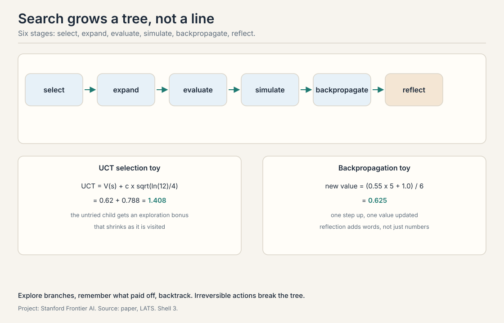
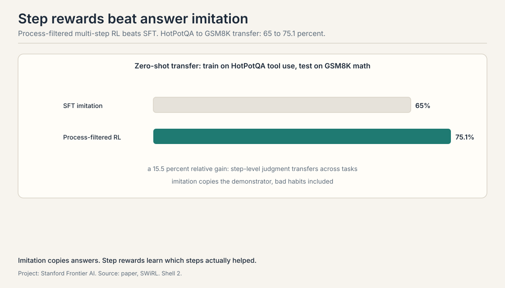

## Planning is search plus memory

*Builds on: Lecture 3's ReAct, which acts and thinks in a line.*

A plan is a sequence of actions that reaches a goal. Planning is
searching over action sequences without taking them all: think
first, act once. ReAct, from Lecture 3, acts and thinks in a line.
This lecture adds the tree. When actions branch, the agent should
explore branches, remember which ones paid off, and backtrack.
Three papers show three ways to make a language model plan.

## LATS: tree search with a language agent

*Builds on: Planning as search, with Monte Carlo tree search adapted to language agents.*

**LATS**, language agent tree search, runs **Monte Carlo tree
search (MCTS)** with a language model as the agent. MCTS is a
planning algorithm that grows a search tree by simulation: it
repeatedly selects a path, expands it, evaluates the new nodes,
and propagates the results back up. LATS adapts it to language
agents in six stages.

**Selection** walks down the tree from the root, at each node
picking the child with the highest **Upper Confidence bounds
applied to Trees (UCT)** score. UCT balances
exploitation of good nodes against exploration of untried ones:
UCT equals the node value V(s) plus c times the square root of
the log of the parent's visit count divided by the child's visit
count. A worked toy: V(s) 0.62, c 1.0, parent visited 12 times,
child visited 4 times. The exploration term is the square root of
ln(12)/4, about 0.788. UCT is 1.408. The untried child gets a
bonus that shrinks as it is visited.

**Expansion** adds new child nodes: candidate actions from the
current state. **Evaluation** scores them. The node value is the
average of an **LLM-judge score**, the model's own rating of the
state, and **self-consistency**, how much the model's samples
agree. **Simulation** rolls out a full trajectory from the node
to see where it leads. **Backpropagation** updates the values up
the path: the new value is the old value times visits minus one,
plus the return, divided by visits. A worked toy: old value 0.55,
5 visits, return 1.0. New value is (0.55 x 5 + 1.0) / 6, which is
0.625. One step up, one value updated.

The sixth stage is the paper's addition: **reflection**. When a
trajectory fails, the model writes a verbal summary of what went
wrong, and that summary goes into the context for the next
attempt. The tree remembers in words, not just in numbers.

The lecture demonstrates it on a maze: the agent plans paths,
hits walls, reflects, and reroutes. On HotpotQA and WebShop it
beats ReAct. The honest caveat from the lecture: the real world
is not a maze. Many actions are **irreversible**: you cannot un-send the email
to test the branch. This **irreversibility** breaks the tree
assumption. Tree search assumes you can
try and backtrack. Where actions commit, the tree is a fantasy.

## SPRINT: plan a little, run a lot

*Builds on: LATS tree search, adding the interleaved planning structure the models learned.*

Reasoning models learned something the lecture's authors did not
expect. In **SPRINT**, the paper studies how models like
DeepSeek-R1 plan multi-step tool tasks, and finds that their
**thinking length** grows with training: the more the model
trains, the longer it plans before acting.

The method: take 6,000 raw trajectories of planning and
execution, have GPT-4o annotate the plan-versus-execution
structure as a **DAG**, a directed acyclic graph, and supervise
the model on the result. The supervision used 1,700 curated
demonstrations. The structure the model learns is **interleaved
planning and parallelized execution**: plan one step, spawn the
independent tool calls in parallel, read the results, plan the
next step. Not plan-everything-then-act. Not act-without-a-plan.
Plan a little, run a lot, in parallel.

The numbers: on DeepSeek-R1-Distill-7B, accuracy on MATH500 rose
from 89.1 to 92.5 percent, a 3.4 point gain, while **sequential
tokens**, the tokens that must be waited for in series, fell
about 40 percent, 440 fewer per task. Parallel calls do not wait
for each other. The behavior transfers: the same model improved
on Countdown and GPQA-Diamond, tasks it was not trained on. And
the exploration pattern shifts with training: early training
explores broadly, late training converges, the model learns when
to stop searching.

The lecture connects this to production. Anthropic's published
SWE-bench Verified methodology for Claude Sonnet 4.5 documents
an evaluation prompt telling the model to use tools as much as
possible, ideally more than 100 times. That is an eval harness
instruction, not the system card the lecture names [uncertain].
The industry discovered the same shape: long-horizon
agents that plan in DAGs and execute in parallel.

## SWiRL: multi-step RL beats imitation

*Builds on: SPRINT's planning structure, adding step-level learning instead of imitation.*

**SWiRL** asks a sharper question: for multi-step tool tasks, is
it better to imitate good trajectories or to learn from rewards?
The method is **offline RL**: **offline multi-step reinforcement
learning**. Offline means the trajectories are collected once, up
front, not during training. Multi-step means the reward lands per step, not
just at the end.

The pipeline: generate 50,000 tool-use trajectories with a strong
model, Gemini 2.2T generating data for Gemma-2-27B, and score
each step with an **LLM-as-judge**. Then filter. **Outcome
filtering** keeps trajectories that end correctly.
**Process filtering** keeps steps the judge rates highly. The
finding: process-filtered data trains better RL policies than
outcome-filtered data, and multi-step RL beats **SFT**,
supervised fine-tuning, which just imitates the trajectories.
The lecture's headline: imitation copies the demonstrator's
habits, including the bad ones. RL on step rewards learns which
steps actually helped.

The numbers, from the paper: relative accuracy gains of 21.5
percent on GSM8K, 12.3 on HotPotQA, 14.8 on CofCA, 11.1 on
MuSiQue, 15.3 on BeerQA. The **zero-shot transfer** result is the striking one:
train on HotPotQA tool use, test on GSM8K math with no HotPotQA
in the prompt, and accuracy rises from 65 to 75.1 percent, a 15.5
percent relative gain. Step-level judgment transfers across
tasks. Imitation of answers does not.

> [!QA]
> Q: Work the UCT selection between two children.
> A: Parent visited 12 times, c 1.0. Child A: value 0.62,
> visited 4 times. Child B: value 0.55, visited 1 time. UCT of A
> is 0.62 plus sqrt(ln(12)/4), which is 0.62 + 0.788 = 1.408.
> UCT of B is 0.55 plus sqrt(ln(12)/1), which is 0.55 + 1.576
> = 2.126. B wins despite the lower value: it is nearly
> unexplored, and the bonus dominates. That is the point of
> UCT: optimism under uncertainty.
> Follow-up: When does UCT pick the worse child forever?
> A: When the value estimates are systematically wrong. UCT
> explores, but its optimism is bounded by c. If the judge
> scores a good branch badly every time, the exploration bonus
> decays with visits and the tree settles on the wrong branch.
> The search is only as good as the evaluator.

> [!QA]
> Q: Why does reflection help LATS beyond the numbers?
> A: Numbers remember that a branch failed. Words remember why.
> A failed trajectory's value update says "this path is bad".
> The reflection says "this path is bad because the search
> assumed the store was open on Sundays". The next attempt
> starts with the lesson in context, not just the penalty in
> the tree. The lecture presents this as the paper's
> contribution: verbal memory on top of statistical memory.
> Follow-up: What is the failure mode of verbal memory?
> A: It grows. Every reflection adds context, and long contexts
> cost tokens and attention. Worse, old reflections can
> contradict new situations. The tree's numbers decay cleanly
> with visits. Words do not decay at all.

> [!QA]
> Q: Explain interleaved planning with the SPRINT numbers.
> A: The model plans one step, launches the independent tool
> calls in parallel, reads the results, and plans the next
> step. On MATH500 the 7B model went from 89.1 to 92.5 percent
> accuracy while sequential tokens fell 40 percent, 440 fewer
> per task. Accuracy rose because the plan adapted to each
> step's results. Sequential tokens fell because parallel calls
> do not wait for each other. The DAG structure is the
> mechanism for both.
> Follow-up: Why not plan the whole DAG up front?
> A: The world answers back. A full up-front plan commits to
> branches whose results are unknown. Interleaving keeps the
> plan one step ahead of the observations, so a failed tool
> call rewrites the next step instead of invalidating the whole
> plan.

> [!QA]
> Q: Why does process filtering beat outcome filtering for RL?
> A: Outcome filtering keeps trajectories that end right. Some
> of them got there by luck: bad steps, right answer. Training
> on those teaches the bad steps. Process filtering keeps steps
> the judge rates highly, so the learner sees which moves
> helped. The paper's result: multi-step RL on process-filtered
> data beats both outcome-filtered RL and SFT imitation. The
> unit of learning is the step, not the trajectory.
> Follow-up: What does the judge cost?
> A: A judgment per step of 50,000 trajectories. That is the
> price of the whole method: step-level labels at scale. The
> lecture's bet is that the transfer result, 65 to 75.1 percent
> across tasks, repays it.

> [!QA]
> Q: When is tree search the wrong tool?
> A: When actions are irreversible. LATS assumes the agent can
> simulate branches and backtrack. Sending an email, charging a
> card, publishing a post: these commit. The tree cannot try
> them. The lecture's maze demo is honest about this: the
> method shines where simulation is free and the world forgives.
> Follow-up: What replaces search where actions commit?
> A: Caution and verification before acting: critics, rankers,
> and verifiers from the Archon menu, applied to the single
> planned action instead of a tree of them. Search moves from
> the action space to the verification space.

> [!QA]
> Q: How do these three papers fit together?
> A: LATS adds search to the agent: explore branches, remember
> in numbers and words. SPRINT adds structure to the search:
> interleave planning with parallel execution along a DAG.
> SWiRL adds learning to the steps: train on step rewards, not
> imitation. Search finds the plan. Structure makes it cheap.
> Step rewards make it learnable. The lecture's arc: from
> planning as inference to planning as training.
> Follow-up: Which one matters most for the self-improvement loop?
> A: SWiRL. The loop needs training signal per step, and
> process-filtered multi-step RL is the lecture's best
> candidate for that signal at scale.

> [!QA]
> Q: The lecture says thinking length grows with training. Why is that surprising?
> A: Because nothing told the model to think longer. The reward
> was on answers, not on trace length. The model discovered that
> longer planning pays, and training amplified the discovery.
> It is emergence at the behavioral level: not a capability
> appearing at a size threshold, but a strategy appearing at a
> training threshold.
> Follow-up: Is longer thinking always better?
> A: No. The SPRINT result pairs longer thinking with fewer
> sequential tokens: the thinking got more parallel, not just
> longer. Length without structure is just cost.

## Recap: the whole lesson on one screen

1. **Search the tree.** LATS runs MCTS with a language agent:
   select by UCT, expand, evaluate, simulate, backpropagate,
   reflect. Toy UCT 1.408. Toy backprop 0.625.
2. **Remember in words.** Reflection stores why a branch
   failed, not just that it did. Numbers decay. Words do not.
3. **Plan a little, run a lot.** SPRINT interleaves planning
   with parallel execution. MATH500 89.1 to 92.5 percent, 40
   percent fewer sequential tokens.
4. **Steps beat trajectories.** SWiRL: process-filtered
   multi-step RL beats SFT imitation. HotPotQA to GSM8K
   transfer: 65 to 75.1 percent.
5. **Search assumes forgiveness.** Irreversible actions break
   tree search. Verify before committing instead.
6. **The arc.** Planning as inference, then as structure, then
   as training. The loop needs the third.

## Used where, as of October 2026

- **Claude Sonnet 4.5 (2025):** Anthropic's published eval
  methodology instructs 100+ tool calls per task, an eval prompt
  instruction rather than the system card the lecture names
  [uncertain], the production form of interleaved planning
  and parallel execution.
- **DeepSeek-R1 family:** the thinking-length growth SPRINT
  studies is visible in the open reasoning models, and the
  SPRINT supervision recipe targets exactly them.
- **RLVR pipelines:** reinforcement learning on verifiable
  rewards, the dominant 2025-2026 paradigm (agentic-RL survey,
  2026). DeepSeek-R1 (January 2025) made RLVR plus GRPO the
  default industry template through 2025-2026. Step-level rewards
  and process filtering extend the recipe to tool-using agents.
- **Coding agents:** Codex runs many coding tasks in parallel in
  isolated cloud sandboxes (Wikipedia, October 2026). Anthropic's
  agent guidance lists parallelization, sectioning work and running
  the parts at once, as a standard production pattern (Anthropic,
  December 2024).

## Official sources and further reading

**Official:**
- CS329A Part 5: Planning and Multi-Step Reasoning (Autumn
  2025). https://www.youtube.com/watch?v=Ml_fp9XkB8Y

**Further reading:**
- Zhou et al., "LATS" (2023).
  https://arxiv.org/abs/2310.04406
- "SPRINT" (2025). https://arxiv.org/abs/2506.05745
- Goldie et al., "SWiRL" (COLM 2025).
  https://arxiv.org/abs/2504.04736

**Caveats from these sources.** The SPRINT supervision used
1,700 curated demonstrations from 6,000 raw trajectories: the
lecture reports both numbers. The SWiRL gains are relative
accuracy as reported in the paper. The Claude 100+ tool calls
figure is from Anthropic's published SWE-bench Verified
methodology, an eval prompt instruction, not the system card the
lecture names [uncertain].

## Connections to the other courses

- **CS329Z:** tree search and planning from the builder side:
  how agents explore and backtrack in practice. This lecture
  adds the algorithms and the training.
- **CS229:** search algorithms and dynamic programming: the
  classical roots of MCTS and UCT.
- **CS329H:** reward models and preference learning: the
  machinery behind the LLM-as-judge that SWiRL depends on.
