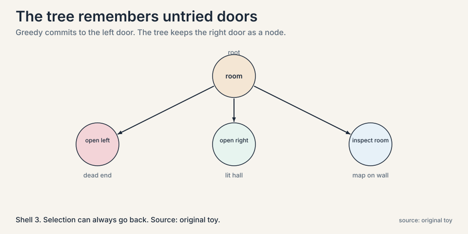
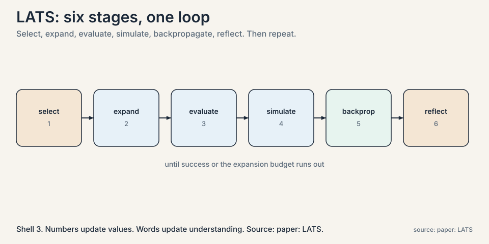
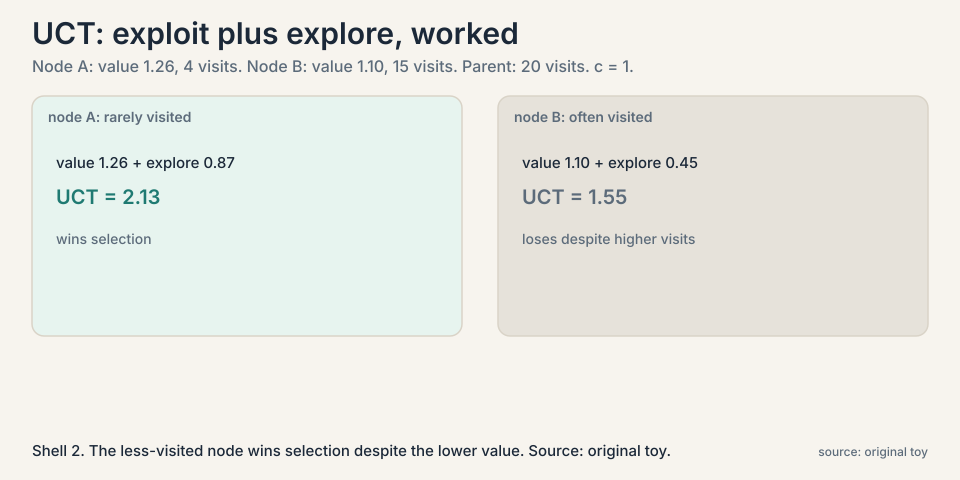
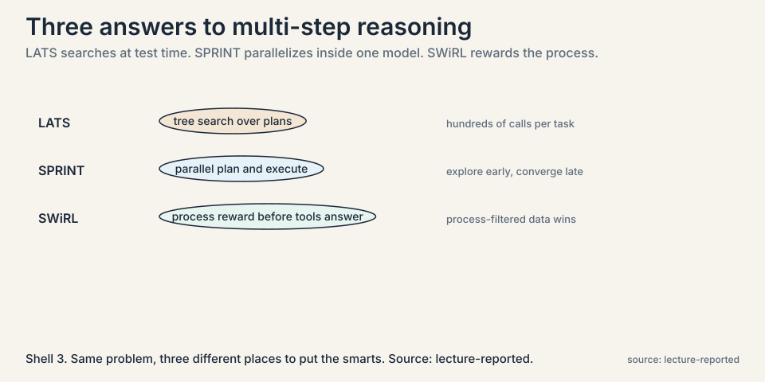

## The problem: one path, no way back

ReAct walks a single trajectory. Thought, action, observation,
thought, action, observation. If step 3 goes wrong, steps 4
through 10 build on the mistake. There is no backtracking, no
"let me try the other door instead". For a trip-planning prompt,
the model commits to the first plan that comes to mind: ask
friends, read blogs, book. It never compares that plan against
alternatives.

Humans do not plan this way. We consider several options, probe
the promising ones, abandon dead ends, and double back. The
lecture's target applications, multi-step tasks where the agent
must reason, act, gather information, and refine, need that same
ability: to explore many plans and spend effort where the
prospects are best.

### Subchapter: why greed fails structurally

The failure is structural, not a lack of cleverness. Any method
that generates one path and follows it cannot recover from an
early wrong turn. What is needed is a memory of the alternatives
not taken, and a policy for revisiting them. ReAct's trajectory
is a single root-to-leaf path. The missing object is the tree:
every branch the agent could have taken, kept alive, scored,
and available for a second try.

## First attempt, shown failing: the greedy walk

Take the lecture's maze toy. The prompt: navigate through a maze
to reach an exit. The initial observation: you are in a dimly lit
room, two doors, left and right.

A greedy agent samples one action, say "open the left door",
walks through, and continues from wherever it lands. Suppose the
left door leads to a dead end with no exit. The agent has no
mechanism to return to the room and try the right door. The
trajectory is committed. The information that the right door was
never tried is lost.



## The key question

What if the agent grows a tree of possible plans, scores each
branch by how promising it looks, and searches the tree the way
game-playing programs search moves?

## The new idea: Language Agent Tree Search

**LATS** (Language Agent Tree Search) unifies reasoning, acting,
and planning. Nodes are states: what the agent knows so far.
Edges are actions: things it can try. The agent expands the tree
in six stages, borrowed from Monte Carlo tree search (MCTS), the
family of algorithms behind game-playing programs.



### Subchapter: the six stages, deep

**1. Selection.** Starting at the root, repeatedly pick the most
promising child until reaching a node that still has untried
actions. "Promising" is measured by the UCT score, below.

**2. Expansion.** Sample fresh actions from that node. In the
toy: open left door, open right door, inspect the room. Each
becomes a new child node.

**3. Evaluation.** Score each new state. LATS adds two numbers.
First, an **LLM-as-judge** score: ask the model "how promising is
this state", on a 0 to 1 scale. Second, a **self-consistency**
score: sample many actions and count frequencies. If "open the
left door" was sampled 75 percent of the time, its
self-consistency score is 0.75. The state value is the sum. A
concrete instance: judge score 0.6 plus self-consistency 0.75
gives value 1.35 for that branch.

**4. Simulation.** From the best new node, keep going greedily:
sample, act, observe, until the task succeeds, fails, or hits an
expansion budget. In the toy, from the dark corridor the agent
tries "approach the staircase", observes "exit door clearly
marked", and the run succeeds.

**5. Backpropagation.** The final return, 1 for success or 0 for
failure, flows back up the path, updating every ancestor's value.
The update is a running average. If a node had value 1.35 over 3
visits and the new return is 1:

```ascii
V_new = (V_old * (n - 1) + return) / n
      = (1.35 * 3 + 1) / 4
      = 5.05 / 4
      = 1.26
```

Each visit nudges the value toward the observed outcomes. Nodes
on successful paths rise. Nodes on failed paths fall.

**6. Reflection.** After a trajectory ends, the model writes a
verbal reflection on what went wrong or right, and that text is
appended to the context for future expansions. Where
backpropagation updates numbers, reflection updates the agent's
stated understanding. A failed maze run might add: "the left door
led to a dead end twice. Prefer inspecting the room first."

### Subchapter: evaluation, two weak signals

Why add self-consistency to the judge instead of trusting the
judge? Because the judge is the same model grading its own
prospects, which is circular. Self-consistency is an independent
signal: if the model independently samples the same action most
of the time, that agreement carries information the single
judgment does not. Two weak signals beat one.

 / 4 = 1.26. Shell 2. Source: original toy. Project: Stanford Frontier AI.")

### Subchapter: reflection, words versus numbers

Backpropagation and reflection update different things.
Backpropagation moves numbers: ancestor values converge toward
observed returns. Reflection moves the agent's stated strategy:
verbal lessons join the context and change what gets sampled
next. Numbers say which branches worked. Words say why. The
lecture treats both as necessary: values without reflection keep
trying the same dead end with slightly lower scores, and
reflection without values has no memory of what actually paid
off.

## The dial that balances daring and caution: UCT

Selection needs one number per node that says "expand me next".
LATS uses **UCT** (upper confidence bound applied to trees):

```ascii
UCT(node) = V(node)  +  c * sqrt( ln(visits_parent) / visits_node )
            ^^^^^^^^     ^^^^^^^^^^^^^^^^^^^^^^^^^^^^^^^^^^^^^^^^^^
            exploit:     explore:
            trust the    prefer nodes visited rarely
            high-value   relative to their parent
            branches
```

The first term exploits: go where values are high. The second
explores: a node visited few times relative to its parent gets a
bonus, so the search does not lock onto the first good-looking
branch forever. The constant c sets the temperament.



### Subchapter: UCT worked

Work the toy: a node with value 1.26 visited 4 times, whose parent was
visited 20 times, with c = 1:

```ascii
explore bonus = sqrt( ln(20) / 4 ) = sqrt(3.00 / 4) = 0.87
UCT = 1.26 + 0.87 = 2.13
```

A sibling visited 15 times with value 1.10 gets bonus
sqrt(3.00/15) = 0.45, UCT 1.55. The less-visited node wins
selection despite the lower value. That is exploration doing its
job.

### Subchapter: the temperament constant

Who chooses c? The practitioner. Large c means restless
exploration: more branches tried, more compute burned. Small c
means greedy exploitation of the best-known branch. It is a
temperament dial, not a derived constant. The bandit literature
proves optimality for UCT under assumptions that LLM settings
violate, stochastic rewards, fixed action sets, so the lecture
presents it as a practical heuristic. Tune c on a validation
set of tasks, and expect the best value to move with the task
family.

## Beyond LATS: SPRINT and SWiRL

The lecture does not stop at LATS. Two more answers to
multi-step reasoning, each moving the smarts somewhere else.



### Subchapter: SPRINT, parallel plan and execute

**SPRINT** folds the parallelism inside a fine-tuned reasoning
model. Instead of one agent walking one path, the model plans
and executes in parallel: it explores many subplans at once,
then converges. The schedule the lecture reports: exploration
early, convergence late. Where LATS searches over plans at
test time with hundreds of calls, SPRINT bakes the
explore-then-converge pattern into the model itself, so one
forward process does both. The price moves from per-task
compute to training: someone must fine-tune the pattern in.

### Subchapter: SWiRL, reward the process

**SWiRL** attacks the value function instead of the search.
The process reward is computed on the query *before* the tool
answers: judge the agent's plan and tool choice, not just the
final outcome. The lecture's headline result: process-filtered
training data beat outcome-filtered training data. Training on
trajectories chosen for good process, not just good endings,
produces better agents. And the gains transfer across tools:
a model trained to plan well with one tool plans well with
others. Process supervision generalizes where outcome
supervision memorizes.

## Where it breaks: the judge can be wrong, and search is expensive

Two prices, both named in the lecture. First, the value function
leans on an LLM judging its own prospects. If the judge is
overconfident about a bad branch, the tree grows in the wrong
direction, and backpropagation takes many visits to correct it.
The search is only as wise as its scorer.

### Subchapter: the judge problem

The circularity is the point to press. The same model proposes
actions, judges states, and reflects on failures. Every stage
shares the model's blind spots, so a systematic misjudgment
infects all of them at once. Self-consistency helps, because
independent samples disagree in ways a single judgment cannot.
But nothing in the loop brings outside information. LATS is a
closed system that searches its own beliefs thoroughly. If the
beliefs are wrong, the search is thorough about the wrong thing.

### Subchapter: the compute bill

Second, compute. Every node expansion costs model calls:
sampling actions, judging states, simulating rollouts. A tree
with hundreds of nodes is hundreds of model calls per task. The
lecture is explicit that this is the tradeoff: LATS buys much
better plans than greedy ReAct, and pays in inference compute.
Test-time scaling again, now spent on search rather than blind
sampling.

### Subchapter: irreversible actions

The lecture is explicit about a boundary: irreversible actions
are not handled. LATS assumes the environment can be re-entered
cheaply, that trying the right door after the left door costs
little. Where actions are irreversible, sending an email,
deleting data, spending money, the tree cannot afford to
simulate by doing. The method needs a simulator or it does not
apply. This is a hard limit, not a tuning problem.

## Mapping back: what the tree fixes

| Greedy failure | LATS answer | How |
|---|---|---|
| One path, no recovery | Tree of alternatives | Untried branches persist as nodes. Selection can always go back. |
| Commits to first plan | Scores before committing | LLM-judge plus self-consistency values each branch. UCT picks. |
| No learning within a task | Backpropagation | Returns flow up the path. Ancestor values converge to observed outcomes. |
| Repeats the same mistake | Reflection | Verbal lessons from failed runs join the context for future expansions. |
| Exploits too early | UCT exploration bonus | Rarely visited nodes get selected despite lower current value. |

The lecture also notes the parallel structure this enables. In
the trip-planning example, independent actions, asking two
friends, can be expanded and executed in parallel, then synced.
Planning as a tree makes the independence visible. A linear
trajectory hides it.

## The honest price

Search multiplies the per-task cost: hundreds of model calls
where ReAct used dozens. The value function is a guess dressed
in arithmetic. A bad judge misdirects the whole tree. And the
method assumes the environment can be re-entered cheaply. Where
actions are irreversible or expensive, deep search is the wrong
tool.

The next chapter keeps the search idea but changes the domain:
instead of searching plans for one problem, sample programs at
massive scale for thousands of problems, and learn to pick the
winners.

## Go deeper

<div style="position:relative;padding-bottom:56.25%;height:0;overflow:hidden;max-width:100%;margin:16px 0;">
<iframe style="position:absolute;top:0;left:0;width:100%;height:100%;" src="https://www.youtube-nocookie.com/embed/idLkLxgpfo4" title="Language Agent Tree Search: unifying reasoning, acting and planning" frameborder="0" allow="accelerometer; autoplay; clipboard-write; encrypted-media; gyroscope; picture-in-picture" allowfullscreen></iframe>
</div>

- Language Agent Tree Search, explained: the MCTS adaptation, the LLM's triple role (proposer, evaluator, reflector), and the reversible-environment limit. https://www.youtube.com/watch?v=idLkLxgpfo4
- Zhou et al., LATS (2024): the six operations, the value function, the benchmarks. https://arxiv.org/abs/2310.04406
- Yao et al., Tree of Thoughts (2023): the related tree-over-thoughts method the lecture contrasts. https://arxiv.org/abs/2305.10601

> [!QA]
> Q: What problem does LATS solve that ReAct does not?
> A: Recovery and comparison. ReAct follows one trajectory. An early wrong turn poisons everything after it. LATS keeps every alternative as a tree node, scores branches with a value function, and uses UCT selection to revisit underexplored ones. It can abandon a dead end and try the other door, because the other door is still in the tree.
> Follow-up: What are the six stages, in one line each?
> A: Selection: walk down the tree by UCT to a node with untried actions. Expansion: sample new actions as child nodes. Evaluation: score each by LLM-judge plus self-consistency. Simulation: roll out greedily from the best child to success, failure, or budget. Backpropagation: average the return into every ancestor's value. Reflection: write down what the run taught, and append it to context.

> [!QA]
> Q: Walk me through the six stages on the maze toy.
> A: Root: dim room, two doors. Selection: UCT picks the root, all children untried. Expansion: sample three actions, open left, open right, inspect room, as child nodes. Evaluation: the judge scores "inspect room" 0.7, self-consistency agrees at 0.8, value 1.5. Simulation: from "inspect room", the agent finds the map, then the exit, return 1. Backpropagation: the return averages into the root and the "inspect room" node. Reflection: "the map was on the wall. Inspect first in dark rooms" joins the context. Next selection starts from a smarter tree.
> Follow-up: What stops the loop?
> A: Success, or the expansion budget: a cap on nodes or model calls. Without the cap, a hard maze grows the tree until the budget for the whole task is gone. The budget is the only thing standing between search and exhaustion.

> [!QA]
> Q: How is the value of a tree node actually computed?
> A: Two parts added together. An LLM-as-judge score: prompt the model to rate how promising the state is, 0 to 1. A self-consistency score: the fraction of sampled actions that chose this branch, so 0.75 if three quarters of samples agreed. In the worked toy, 0.6 plus 0.75 gives 1.35. Backpropagation then refines it: each completed trajectory's return (1 or 0) is averaged in, so values converge toward real outcomes with visits.
> Follow-up: Why add self-consistency to the judge instead of trusting the judge?
> A: Because the judge is the same model grading its own prospects, which is circular. Self-consistency is an independent signal: if the model independently samples the same action most of the time, that agreement carries information the single judgment does not. Two weak signals beat one.

> [!QA]
> Q: What does the UCT exploration term do, concretely?
> A: It bonuses nodes that are visited rarely relative to their parent. In the toy, a node with value 1.26 visited 4 of its parent's 20 visits gets bonus 0.87, total 2.13, beating a sibling with value 1.10 visited 15 times (total 1.55). The search tries the less-visited branch despite its lower value. Without the term, the first good-looking branch would be exploited forever and better branches elsewhere would never be tried.
> Follow-up: Who chooses the constant c?
> A: The practitioner. Large c means restless exploration, more branches tried, more compute. Small c means greedy exploitation of the best-known branch. It is a temperament dial, not a derived constant, and the lecture notes there is no proof it is optimal.

> [!QA]
> Q: How do SPRINT and SWiRL differ from LATS?
> A: LATS searches over plans at test time: hundreds of model calls per task, no training. SPRINT bakes parallel plan-and-execute into a fine-tuned reasoning model: explore early, converge late, inside one forward process. SWiRL changes the reward: judge the process (the query before tools answer) instead of the outcome, and train on process-filtered data, which the lecture reports beats outcome-filtered data and transfers across tools. Three different places to put the smarts: search, model, reward.
> Follow-up: When would you pick SPRINT over LATS?
> A: When per-task latency matters and you can afford training. LATS pays hundreds of calls per task, every task. SPRINT pays once in fine-tuning, then runs the pattern cheaply. Pick LATS when the task family is novel and training data is thin. Pick SPRINT when the task family is stable enough to bake in.

> [!QA]
> Q: What is the difference between backpropagation and reflection in LATS?
> A: Backpropagation updates numbers: each trajectory's return averages into its ancestors' values, so values converge toward observed outcomes. Reflection updates the agent's stated strategy: a verbal lesson from the run joins the context and changes what gets sampled next. Numbers remember which branches worked. Words remember why. The lecture treats both as necessary: values without reflection keep retrying dead ends with slightly lower scores.
> Follow-up: Can reflection hurt?
> A: Yes. A wrong lesson, "the left door is always bad", poisons every future expansion that reads it. Numbers decay with new evidence. Words persist in context until pushed out. Bad reflections are stickier than bad values, which is why the reflection prompt matters as much as the value function.

> [!QA]
> Q: When is tree search the wrong tool?
> A: Three cases. Irreversible actions: the tree cannot simulate by doing when doing cannot be undone. Expensive environments: hundreds of model calls per task is ruinous when each call is slow or costly. And miscalibrated judges: if the value function is systematically wrong, the search is thorough about the wrong thing, and a cheaper greedy method fails faster and cheaper. The decision rule: search pays when the environment is cheap to re-enter, the judge is roughly calibrated, and the task rewards comparing plans over committing early.
> Follow-up: What is the cheaper alternative that keeps some of the benefit?
> A: Best-of-N with a critic: sample N full trajectories, have a judge pick the best. No tree, no backprop, no reflection. It keeps the comparison benefit and drops the search machinery. The lecture's Archon result, fusion beats selection, suggests even this can be beaten by synthesizing, but best-of-N is the cost-effective baseline every search method must beat.

## Recap: the whole lesson on one screen

1. **One path, no way back.** ReAct commits to its first plan.
   An early wrong turn poisons the whole trajectory.
2. **The maze toy.** Two doors, dim room. Greedy opens the left
   door, hits a dead end, cannot return.
3. **The key question.** What if the agent grows a tree of
   plans and searches it like a game?
4. **LATS.** Nodes are states, edges are actions. Six stages:
   select, expand, evaluate, simulate, backpropagate, reflect.
5. **Values with numbers.** Judge 0.6 plus self-consistency 0.75
   is 1.35. Backprop: (1.35 times 3 plus 1) over 4 is 1.26.
6. **UCT.** Value plus exploration bonus. Rarely visited nodes
   get tried: 2.13 beats 1.55 in the toy. The constant c is a
   temperament dial.
7. **Reflection.** Failed runs add verbal lessons to context.
   Numbers update values, words update understanding. Words
   are stickier.
8. **SPRINT and SWiRL.** Parallel plan-execute baked into the
   model. Process rewards before tools answer. Process-filtered
   data beats outcome-filtered and transfers across tools.
9. **The honest price.** Hundreds of model calls per task. The
   judge can mislead the tree. Irreversible actions are out of
   scope. Assumes cheap re-entry.

## Official sources and further reading

**Official:**
- CS329A Part 5: Planning and Multi-Step Reasoning (Autumn
  2025): the lecture this chapter follows. [link](https://www.youtube.com/watch?v=Ml_fp9XkB8Y)
- Zhou et al., "Language Agent Tree Search Unifies Reasoning,
  Acting and Planning in Language Models" (2024): the paper. [paper](https://arxiv.org/abs/2310.04406)

**Further reading:**
- Kocsis and Szepesvari, "Bandit Based Monte-Carlo Planning"
  (2006): UCT, the selection rule LATS borrows.
- Yao et al., "Tree of Thoughts" (2023): the related
  tree-over-thoughts method the lecture contrasts. [paper](https://arxiv.org/abs/2305.10601)

**Caveats from these sources.** The maze and trip toys are the
lecture's illustrations. The paper's benchmarks are web and
reasoning tasks. UCT's optimality claims come from the bandit
literature with assumptions that LLM settings violate. The
lecture presents it as a practical heuristic. SPRINT and SWiRL
details are the lecture's summaries. The lecture does not name
their papers.

## Connections to the other courses

- **CS329A L03:** the greedy baseline this chapter fixes: one
  ReAct trajectory is a single root-to-leaf path with no tree.
- **CS329A L02:** the compute currency is the same: LATS spends
  test-time compute on search where Lecture 2 spends it on
  blind sampling.
- **CS329A L06:** from searching plans for one task to
  sampling programs for many: scale replaces depth.
- **CS329Z:** planning in production agents: when tree search
  is worth its cost and when it is not.
