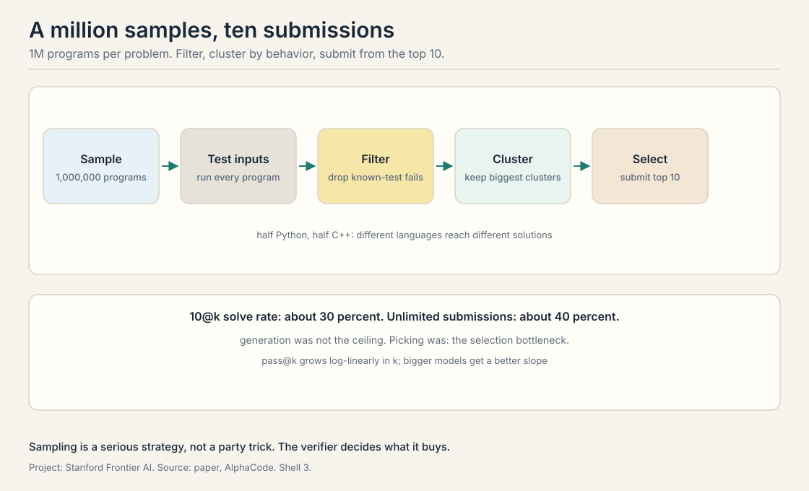
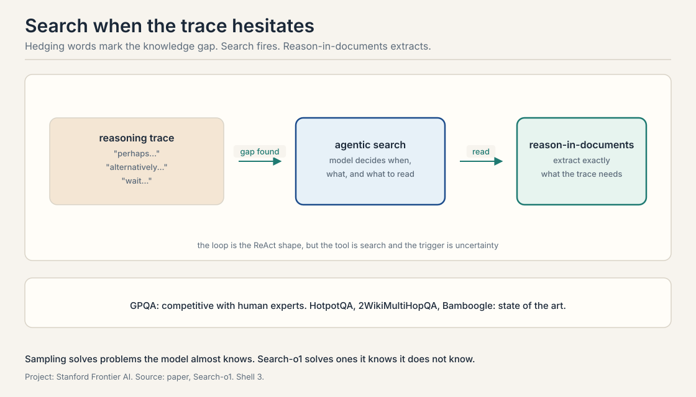

## A million tries per problem

*Builds on: Lecture 2's repeated sampling, pushed to industrial scale.*

Lecture 2 sampled thousands of times. **AlphaCode** samples a
million. The task is competitive programming: given a problem
statement, write a program that passes hidden tests. The method
is the generate-verify loop at industrial scale, and it is the
clearest proof in the course that sampling is a serious
strategy, not a party trick.

The pipeline has five stages. **Sampling**: generate 1,000,000
programs per problem, half Python and half C++. Two model sizes
in the paper, 9B and 41B parameters. **Test input generation**:
train a separate model to generate test inputs, then run every
sampled program on them. **Filtering**: drop every program that
fails known tests. **Clustering**: group the survivors by their
behavior on the generated tests, programs that agree on outputs
form a cluster, and keep the biggest clusters. **Selection**:
submit from the top 10 clusters. The metric is **10@k**: solve
the problem if any of 10 submissions from k samples is correct.

The result: an average rank placing in the top 54 percent of
5,000 **Codeforces** participants across 10 contests, roughly
54.3 percent average rank. The findings the lecture stresses:
pass@k grows **log-linear**ly in k. Log-linear means each
doubling of k buys the same additive gain, so the curve is a
straight line when k is plotted on a logarithmic axis. The
bigger models get a better slope, and there is a selection bottleneck. With unlimited
submissions the solve rate reached about 40 percent, but under
the 10@k constraint it fell to about 30. Generation was not the
ceiling. Picking was.

Three training details from the lecture. **GOLD
regularization**: the model is trained to match the
distribution of good solutions, not just to maximize likelihood,
so samples stay diverse. **Value conditioning**: the model is
told the target quality during training and asked for high
quality at sampling time. And the diversity is deliberate:
half the samples in Python, half in C++, because different
languages reach different solutions.

The honest weakness: AlphaCode is weak on dynamic programming
and constructive problems, the ones that need a flash of
insight rather than enumeration. Sampling covers the space of
obvious approaches. It does not invent the clever one.

## AlphaCode 2: learn to search

*Builds on: AlphaCode's sampling pipeline, replacing hand-designed filtering with a learned scorer.*

**AlphaCode 2** keeps the sampling strategy and improves the
search. Built on a fine-tuned Gemini Pro family of models, it
replaces hand-designed filtering with a **learned scoring
model** that predicts which samples are worth keeping.

The pipeline tightens. On **CodeContests v2**, with C++ only,
the system samples 1,000,000 programs, the scoring model filters
95 percent away leaving about 50,000, and clustering plus
selection continues from there. The headline from the lecture:
100 samples from AlphaCode 2 match 1,000,000 samples from
AlphaCode 1 on solve rate. At the million-sample budget, the
solve rate rose from 25 to 43 percent, and the system reached
the 85th percentile of contestants, up from the top 54 percent.

The lecture's moral is the course's moral in miniature. The
first system scaled sampling. The second scaled the selection.
The verifier, the scorer, the judge: every turn of the flywheel
moves the bottleneck from generation to verification and back.

## Search-o1: the model that knows it does not know

*Builds on: The selection bottleneck, extending the loop to knowledge the weights do not contain.*

Sampling solves problems the model almost knows. **Search-o1**
solves problems the model knows it does not know. It gives a
reasoning model an agentic search loop: when the trace hits a
**knowledge gap**, the model searches the web, reads documents, and
continues reasoning with the new facts.

The mechanism has two parts. **Agentic RAG**: the model itself
decides when to search, what to query, and which results to
read, inside the reasoning loop. **Reason-in-documents**: a
module that reasons over the retrieved documents to extract
exactly what the trace needs, instead of dumping raw pages into
context. The loop is the ReAct shape from Lecture 3, but the
tool is search and the trigger is uncertainty.

How does the model know it has a gap? The lecture points to the
trace itself. Words like "perhaps", "alternatively", and "wait"
mark **self-reflection**: the model hedging, reconsidering, or
catching its own error. Those moments are the search trigger.
The paper's carbon-atom example shows the mechanism: without
search the model answers from memory and gets the count wrong,
10 versus the correct 14. With search it reads the facts and
gets it right.

The results: on **GPQA**, Graduate-Level Google-Proof Q&A, a
hard science benchmark, the model is competitive with human
experts on the diagonal the lecture shows, and on **HotpotQA**,
2WikiMultiHopQA, and Bamboogle it reaches state of the art.
More retrieved documents help up to a point: accuracy rises with
document count, then the context fills and the gains flatten.
The lecture names the follow-up, **Search-R1**, which trains the
search behavior with reinforcement learning instead of
prompting it, but covers it only as a pointer.

## The selection bottleneck, restated

*Builds on: All three systems, naming the pattern that repeats across them.*

Put the three systems together and one pattern repeats. In
AlphaCode, unlimited submissions solve 40 percent, 10@k solves
30: the gap is selection. In AlphaCode 2, the learned scorer
closes most of that gap: 100 samples do the work of a million.
In Search-o1, the model must select not just answers but
questions: what to search for. Every system in this lecture
generates far more than it can use, and its intelligence lives
in what it keeps.

> [!QA]
> Q: Walk the AlphaCode pipeline with the lecture's numbers.
> A: Sample 1,000,000 programs per problem, half Python, half
> C++. Generate test inputs with a separate model. Run all
> programs on them. Filter out failures. Cluster survivors by
> output behavior. Submit from the top 10 clusters. With 10
> submissions the solve rate is about 30 percent. With
> unlimited submissions it would be about 40. The 10-point gap
> is the selection bottleneck: generation found the answer,
> selection could not always pick it.
> Follow-up: Why cluster by behavior instead of by code?
> A: Many programs are textually different but
> computationally identical. Clustering by outputs on test
> inputs groups true duplicates, so the 10 submissions cover
> 10 genuinely different approaches instead of 10 spellings of
> one idea.

> [!QA]
> Q: What do GOLD regularization and value conditioning buy?
> A: GOLD trains the model to match the distribution of good
> solutions rather than maximizing likelihood, which keeps the
> samples diverse. Maximum likelihood concentrates on the most
> common pattern. Diversity is the whole game when you sample a
> million times: identical samples waste the budget. Value
> conditioning tells the model the target quality during
> training, so at sampling time you can ask for the
> high-quality end of the distribution.
> Follow-up: Why split samples across Python and C++?
> A: Different languages reach different solutions. A
> Python-first approach and a C++-first approach explore
> different corners of program space. The split is deliberate
> diversity, same as temperature but structural.

> [!QA]
> Q: AlphaCode 2 matches AlphaCode 1's million samples with 100. Where did the million go?
> A: Into the learned scoring model. AlphaCode 1 filtered with
> tests and clustered by hand-designed rules, which needed
> volume to work. AlphaCode 2 trained a scorer to predict which
> samples are promising, filtering 95 percent before
> clustering. The million samples were paying for bad
> selection. Better selection costs fewer samples.
> Follow-up: Is there a limit to this trade?
> A: Yes: the scorer's own accuracy. A perfect scorer needs one
> sample. A weak scorer needs the million back. The lecture's
> 100-sample figure measures the scorer, not the generator.

> [!QA]
> Q: How does Search-o1 know when to search?
> A: The reasoning trace tells it. Hedging language,
> "perhaps", "alternatively", "wait", marks moments of
> uncertainty or self-correction. Those moments trigger a
> search: the model queries, reads, and continues with facts.
> The carbon example: memory said 10, the documents said 14,
> and the trace's hesitation was the signal to check.
> Follow-up: What goes wrong if it searches too much?
> A: Context fills with documents, attention dilutes, and the
> model reasons over retrieval instead of the problem. The
> paper's curve shows accuracy rising with document count then
> flattening. The reason-in-documents module exists to compress
> each retrieval to what the trace needs.

> [!QA]
> Q: Why is AlphaCode weak on dynamic programming?
> A: Dynamic programming needs the insight: the recurrence,
> the state definition. Sampling enumerates variations on
> approaches the model already considers. The clever
> reformulation is a single point in program space, not a
> region, so a million samples can miss it. The lecture is
> explicit: sampling scales the obvious, not the ingenious.
> Follow-up: What would fix it?
> A: A different generator: one that proposes reformulations,
> not completions. Or a verifier that rewards partial insight.
> The course's later lectures on planning and reflection aim at
> exactly this gap.

> [!QA]
> Q: Connect this lecture to the self-improvement loop.
> A: AlphaCode is the generate step at scale. AlphaCode 2 is
> the verify step learning to be smarter. Search-o1 is the
> generate step learning to ask for help. The loop from
> Lecture 1 needs all three: generate broadly, verify sharply,
> and know when the weights do not contain the answer. The
> 40-to-30 selection gap is the loop's current tax.
> Follow-up: Which part would you automate first?
> A: Selection. The lecture's numbers say generation already
> outruns it: 40 percent found, 30 percent picked. Every point
> of selection accuracy is a free point of solve rate with no
> new samples.

> [!QA]
> Q: Search-R1 is mentioned but not covered. What is the idea?
> A: Search-o1 prompts the search behavior: the model is told
> when and how to search. Search-R1 trains it: reinforcement
> learning rewards traces that search well and answer right.
> The lecture names it as the direction without details. The
> bet is that learned search policies beat prompted ones, the
> same bet the whole course makes about learned versus
> hand-designed behavior.
> Follow-up: What is the reward?
> A: Not stated in the lecture. The honest answer: presumably
> answer correctness with a cost term for searches, so the
> model learns to search when it pays. Designing that reward
> without teaching the model to game it is the open problem.

## Recap: the whole lesson on one screen

1. **A million tries.** AlphaCode samples 1M programs, filters,
   clusters by behavior, submits 10. Top 54 percent of
   Codeforces. 10@k about 30 percent, unlimited about 40.
2. **Selection is the tax.** The 10-point gap between found and
   picked is where intelligence lives.
3. **Learn the scorer.** AlphaCode 2's scoring model filters 95
   percent. 100 samples match the old million. 85th percentile.
4. **Know what you lack.** Search-o1 searches when the trace
   hesitates. Reason-in-documents compresses retrieval.
   GPQA competitive with experts.
5. **Sampling scales the obvious.** Weak on DP and insight
   problems. The clever point in program space needs a
   different generator.
6. **The loop's shape.** Generate broadly, verify sharply, ask
   for help when the weights are empty.

## Used where, as of October 2026

- **Competitive programming with AI:** AlphaCode (DeepMind,
  2022, Science) reached the top 54.3 percent of Codeforces
  competitors with the sample-filter-cluster pipeline: generate
  millions of programs, filter by execution, cluster by
  behavior, submit 10. The pattern remains the evaluation
  template for code generation.
- **Deep Research products:** OpenAI Deep Research (February
  2025) and Gemini Deep Research (rebuilt on Gemini 3 Pro,
  December 2025) run the agentic loop the lecture describes: an
  orchestrator plans, parallel sub-agents search, a synthesizer
  writes the cited report.
- **Learned selection:** AlphaCode 2 (DeepMind, 2024) replaced
  hand-designed filtering with a learned scoring model that
  filtered 95 percent of samples before clustering. The
  lecture's template: selection learned, not hand-built.
- **Agentic RAG in production (2026):** retrieval embedded in
  the reasoning loop, the agent deciding when to retrieve and
  when to re-retrieve, is the documented production pattern
  (Dify, January 2026). Reason-in-documents anticipates it:
  compress each retrieval to what the trace needs.

## Official sources and further reading

**Official:**
- CS329A Part 7: Self-Improvement and Deep Research Agents
  (Autumn 2025). https://www.youtube.com/watch?v=Uni9dqyuuDM

**Further reading:**
- Li et al., "AlphaCode" (2022).
  https://arxiv.org/abs/2203.07814
- Li et al., "Search-o1" (2025).
  https://arxiv.org/abs/2501.05366

**Caveats from these sources.** The AlphaCode numbers are from
the 2022 paper and the lecture's telling. The AlphaCode 2
figures are as reported in the lecture from DeepMind's
announcement. Search-R1 is named but not detailed in the
lecture.

## Connections to the other courses

- **CS329Z:** RAG and agentic retrieval from the builder side:
  how production systems implement the search loop Search-o1
  studies.
- **CS336:** the base models under the sampling: what
  pretraining puts in the weights that a million samples
  draw out.
- **CS229S:** the systems cost of a million samples: how
  inference infrastructure makes the AlphaCode budget
  thinkable.
