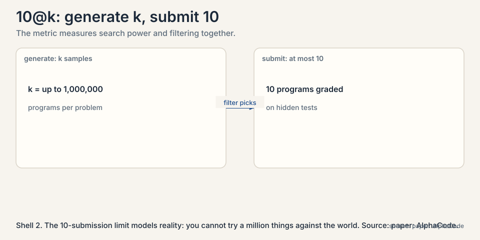
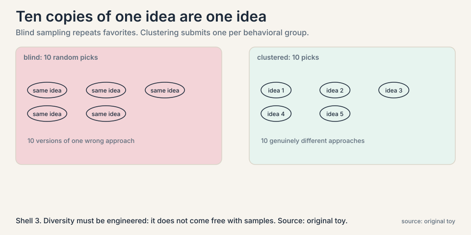
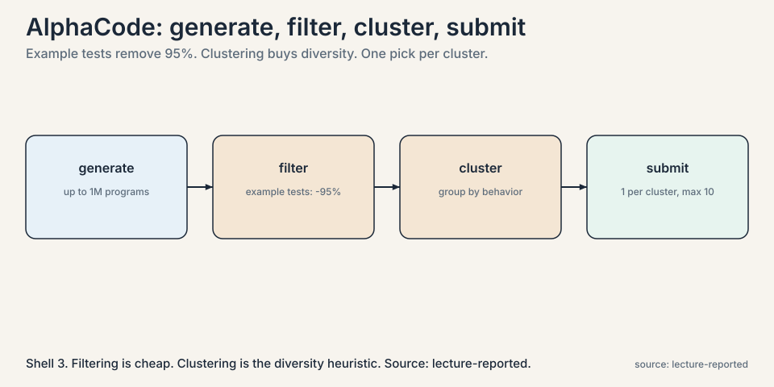
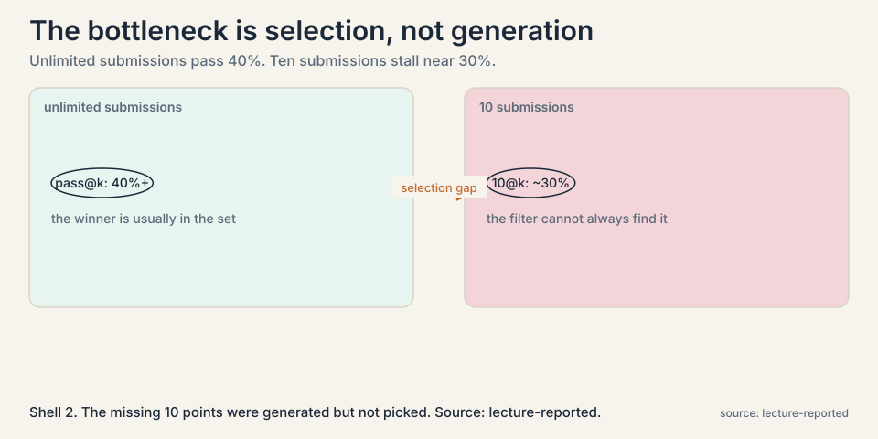
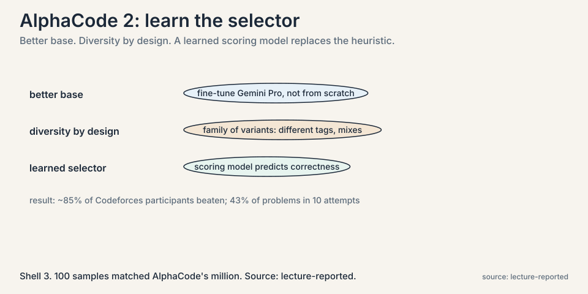

## The problem: one shot cannot solve competition coding

Competitive programming problems are brutal. A problem statement
describes a puzzle. The solution is a program that must pass
hidden tests on correctness and efficiency. A single generated
program almost never passes. The lecture's question: can scale
succeed where cleverness fails?



### Subchapter: the 10@k metric, deep

The setup matters. In the AlphaCode evaluation, the model may
generate up to a million candidate programs per problem, but it
may submit only 10 for grading against the hidden tests. This is
the **10@k metric**: generate k samples, submit at most 10. It
measures two things at once: the raw search power of sampling,
and the quality of the filtering that picks the final 10.

Why 10 submissions and not all k? Because grading is the
expensive, trusted step: hidden tests run by the benchmark, the
stand-in for the real world. The limit models reality, where
you cannot try a million things against production. The limit
is what makes selection a problem worth solving. Without it,
the metric would measure only generation, and the course's
hardest lesson, the selector is the bottleneck, would be
invisible.

## First attempt: sample blindly, submit randomly

Suppose you generate 1,000 programs and submit 10 at random.
Most of the 1,000 are variations of the same few ideas: the
model's distribution has favorite patterns, and blind sampling
repeats them. Your 10 random submissions are likely 10 versions
of the same wrong approach. The million samples are wasted
because they are not a million different ideas.



### Subchapter: the diversity problem, worked

This is the **diversity** problem, and the lecture hammers it:
sampling more only helps if the new samples are different. Ten
copies of one wrong program are one wrong program.

Work it against the coverage formula from Lecture 2. Coverage
assumes independent draws. If the model's 1,000 samples contain
only 40 genuinely different approaches, the effective k is 40,
not 1,000. Every diversity failure is a hidden tax on the
coverage curve: the nominal sample count climbs, the effective
count stalls. All of AlphaCode's machinery, filtering and
clustering, is a tax-avoidance scheme for this.

## The key question

If we generate at massive scale and select a diverse, promising
few, how far does sampling alone go, and what limits it?

## AlphaCode: scale plus clustering

AlphaCode's pipeline has three stages. Generate a huge number of
samples. Filter out the ones that fail the problem's example
tests. Then **cluster** the survivors: group programs that behave
the same on generated test inputs, and submit one representative
per cluster. Clustering is a heuristic for diversity: programs in
different clusters do different things, so 10 submissions cover
10 genuinely different approaches instead of 10 copies.



### Subchapter: filtering, the 95 percent

The first cut is brutal and cheap. The problem's example tests,
the few input-output pairs in the statement, filter the million
samples. The lecture reports that this removes about 95 percent:
most generated programs do not even pass the examples. What
survives is 50,000 programs that at least handle the basics.
Filtering costs almost nothing per program and does most of the
work. The lesson: never spend expensive selection on candidates
a cheap test can kill.

### Subchapter: clustering by behavior, not text

The survivors are then clustered by behavior: run them on
generated test inputs and group programs that produce the same
outputs. Two programs with different code but identical behavior
land in one cluster. One representative per cluster goes to the
final 10. The choice of behavior over text matters: textually
different programs can implement the same wrong idea, and
textually similar programs can differ in the one line that
counts. Behavior is what the hidden tests will judge, so
behavior is what the clustering groups by.

### Subchapter: the log-linear curves

The numbers, from the lecture's validation results. Three
systems, submitting 10 programs out of 1,000 generated:

```ascii
model             10@1K solve rate
9B                lowest
41B               higher
41B + clustering  highest of the three
```

Two trends. Larger models do better at every sample count, and
clustering helps at every model size. Now scale the samples.
Going from 10@1K to 10@1M, the solve rate climbs log-linearly,
the same straight line against log samples from Lecture 2.
Bigger models have steeper slopes: the 41B curve rises faster
than the small model at the bottom.



### Subchapter: the selection bottleneck, named

Then the sobering comparison. With unlimited submissions,
**pass@k**, the solve rate at large k passes 40 percent. With
only 10 submissions, **10@k**, it stalls near 30 percent. The gap
is the **selection bottleneck**: the right program is usually
somewhere in the million, but the filter cannot always find it.
Sampling solved generation. Selection is now the binding
constraint.

The lecture adds two honest observations from the paper. First,
the model was trained on loss, and loss is a poor proxy for
solve rate: many different programs solve a problem, and the
training objective does not know that. The model was notably
weak on dynamic programming and constructive algorithms.
Second, the approach was verified to generalize: the generated
code showed novelty against the training data, not memorization.
It was reasoning, expensively. In simulated Codeforces contests,
AlphaCode ranked around the top 54 percent: the median human
competitor, at a million samples per problem.

## AlphaCode 2: learn the selector

AlphaCode 2 attacks the bottleneck directly, with three changes
the lecture walks through.



### Subchapter: change 1, a better base

First, stop pretraining your own model. Fine-tune an existing
strong model, Gemini Pro in the paper's case, on competitive
programming data. Better base, fewer samples needed for the same
coverage. The lecture's summary of the effect: better models
need fewer samples for the same performance, and the headline
number is stark, 100 samples matched AlphaCode's million. The
base model does more of the work, so sampling does less.

### Subchapter: change 2, diversity by design

Second, manufacture diversity instead of hoping for it.
Fine-tune not one model but a family of variants, with different
hyperparameters, difficulty tags, and data mixes. Each variant
has different favorite patterns, so massive sampling across the
family covers genuinely different approaches. Diversity becomes a
design choice, not a sampling accident.

### Subchapter: change 3, the learned selector

Third, and most important, replace the heuristic filter with a
**learned scoring model**. Instead of clustering by behavior and
hoping the representatives are good, train a reward model to
predict which candidates are actually correct, and submit its
top picks. The selector is now learned from data rather than
hand-designed. Clustering says "these programs differ". The
scoring model says "this one is likely right". Learning the
selector beats the heuristic, at the cost of needing scored
training data.

The reported results: AlphaCode 2 beat about 85 percent of
participants in Codeforces contests, solved 43 percent of
problems within 10 attempts, and showed particular strength in
dynamic programming, the area where AlphaCode 1 was weak. The
pipeline is the same shape, generate then select, but both
stages got smarter.

## Where it breaks: diversity must keep growing

The method has one fragile assumption, and the lecture states it
plainly. The log-linear gains continue only if new samples keep
being different. If you sample 10 times more but the model
repeats its favorite patterns, the extra samples add nothing.
Clustering and model families are patches over a deeper issue:
the model's output distribution has limited true diversity, and
no selection method can submit a good program that was never
generated.

### Subchapter: breadth versus depth

There is also the domain limit. One-shot massive sampling works
for problems solvable in one program. For problems needing many
dependent steps, where step 2 depends on step 1's result, the
lecture notes that multi-step approaches do better. Sampling is
breadth. Some problems need depth. The decision rule: if the
problem decomposes into one artifact, sample wide. If it
decomposes into dependent steps, search deep, Lecture 5's
territory.

## Mapping back

| Problem | AlphaCode answer | AlphaCode 2 upgrade |
|---|---|---|
| One program rarely passes | Generate up to 1M candidates | Fine-tuned Gemini Pro family: better base, fewer samples needed |
| 10 random submissions repeat one idea | Cluster by behavior, submit per-cluster representatives | Family of diverse model variants: diversity by design |
| Heuristic filter misses winners | 10@k still log-linear, but capped near 30% vs 40%+ unlimited | Learned scoring model predicts correctness. Submits its top picks |
| Loss does not measure solving | Honest gap: weak on DP and constructive algorithms | Better data (CodeContests v2) plus the scoring model |

## The honest price

A million samples per problem is a research demonstration, not a
product. The selection bottleneck means most of the generation
budget is wasted on programs never submitted. Diversity is not
free: it must be engineered through clustering, model families,
or better base models. And the whole pipeline assumes cheap,
automatic checking: example tests to filter on, hidden tests to
grade against. No verifier, no AlphaCode.

The deeper lesson the lecture draws: sampling and selection are
two separate problems. Lectures 2 and 6 scaled the first. The
second, picking winners well, is where learned reward models
enter, and where the next chapter's troubles begin: who verifies
the verifier.

## Go deeper

<div style="position:relative;padding-bottom:56.25%;height:0;overflow:hidden;max-width:100%;margin:16px 0;">
<iframe style="position:absolute;top:0;left:0;width:100%;height:100%;" src="https://www.youtube-nocookie.com/embed/yw7IKOrS-Q8" title="AlphaCode: DeepMind's competitive programming system explained" frameborder="0" allow="accelerometer; autoplay; clipboard-write; encrypted-media; gyroscope; picture-in-picture" allowfullscreen></iframe>
</div>

- AlphaCode explained: the system's design, the clustering step, and the Codeforces evaluation. https://www.youtube.com/watch?v=yw7IKOrS-Q8
- Li et al., Competition-Level Code Generation with AlphaCode (2022): the 10@k setup, clustering, the scaling curves. https://arxiv.org/abs/2203.07814
- AlphaCode 2 technical report (2023): the Gemini fine-tune, model family, and learned scoring model. https://storage.googleapis.com/deepmind-media/AlphaCode2/AlphaCode2_Tech_Report.pdf
- CodeContests dataset: the open benchmark both papers build on. https://github.com/deepmind/code_contests

> [!QA]
> Q: What does 10@k actually measure?
> A: Generate k candidate programs, submit at most 10 for grading on hidden tests. It measures generation and selection together: whether the right program appears among the k, and whether the filter picks it. In the lecture's numbers, 10@1M beats 10@1K log-linearly, but 10@k stalls near 30 percent while unlimited pass@k passes 40 percent. The gap is the selection bottleneck.
> Follow-up: Why not just submit all k?
> A: Because grading is the expensive, trusted step: hidden tests run by the benchmark. The 10-submission limit models reality, where you cannot try a million things against the real world. The limit is what makes selection a problem worth solving.

> [!QA]
> Q: Walk me through AlphaCode's pipeline on one problem.
> A: Generate up to a million candidate programs. Filter with the problem's example tests: about 95 percent die here, cheaply. Cluster the survivors by behavior on generated inputs: programs that act the same group together. Submit one representative per cluster, at most 10, for grading on hidden tests. Each stage has one job: generate for coverage, filter for cheapness, cluster for diversity, submit for the score.
> Follow-up: Why cluster by behavior instead of by code text?
> A: Because the hidden tests judge behavior. Two textually different programs can implement the same wrong idea, and two similar programs can differ in the line that counts. Grouping by outputs on probe inputs clusters what will actually be graded, so the 10 submissions cover 10 genuinely different behaviors.

> [!QA]
> Q: Why does clustering help?
> A: Blind sampling repeats the model's favorite patterns, so 10 random submissions may be 10 versions of one wrong idea. Clustering groups behaviorally identical programs and submits one per cluster, so the 10 submissions cover 10 genuinely different approaches. In the lecture's table, 41B with clustering beats 41B without it at every sample count. It is a heuristic: cheap, no training, and consistently useful.
> Follow-up: What replaced clustering in AlphaCode 2?
> A: A learned scoring model, a reward model trained to predict which candidates are correct. Clustering says "these programs differ". The scoring model says "this one is likely right". Learning the selector beats the heuristic, at the cost of needing scored training data.

> [!QA]
> Q: What is the selection bottleneck, exactly?
> A: The gap between what sampling can find and what the filter can pick. At large k, the correct program is usually somewhere in the generated set: unlimited-attempt solve rates pass 40 percent. But with only 10 submissions allowed, the rate stalls near 30 percent. The missing 10 points are programs that were generated and then not chosen. Better generation cannot fix this. Only better selection can.
> Follow-up: Does this generalize beyond code?
> A: Yes. Anywhere you generate many candidates and keep few, math proofs, agent trajectories, the picker is the binding constraint once generation is strong enough. The lecture's framing is general: scale the generator, then the selector becomes the research problem.

> [!QA]
> Q: What were AlphaCode 2's three changes, and which mattered most?
> A: One, fine-tune Gemini Pro instead of pretraining from scratch: a better base needing fewer samples. Two, a family of diverse model variants: diversity by design, not by accident. Three, a learned scoring model replacing heuristic clustering: the selector trained on data. The lecture presents the third as the most important, because the bottleneck was selection. The result: 100 samples matched AlphaCode's million, and the system beat about 85% of Codeforces participants.
> Follow-up: Why did the better base matter so much?
> A: Coverage depends on per-try success p. A stronger base raises p, so the same k reaches further up the log-linear curve. The million-sample regime was compensating for a weak base. Fix the base and the compensation shrinks by four orders of magnitude.

> [!QA]
> Q: When does massive sampling fail, even with perfect selection?
> A: When the problem needs depth, not breadth. Sampling generates complete programs independently. If the solution requires dependent steps, where step 2 can only be designed after seeing step 1's result, independent samples cannot build on each other. The lecture's decision rule: one-artifact problems get breadth (sample wide), dependent-step problems get depth (search, plan, iterate). Also when diversity stalls: 10x more samples of the same favorite patterns add nothing, and no selector can submit a program that was never generated.
> Follow-up: How do you detect stalled diversity in practice?
> A: Cluster the samples and count clusters, not samples. If doubling k barely grows the cluster count, the model is repeating itself. The cluster count is the effective sample size. When it stalls, stop sampling and fix the generator: new variants, new prompts, new temperatures.

> [!QA]
> Q: You run a coding assistant product. Where does 10@k thinking apply?
> A: In the rerank layer. Generate 10-20 candidates per request (not a million: the product budget forbids it), filter with fast static checks and the repo's own unit tests, cluster by behavior on a few probe inputs, and show the user the top 2-3 diverse options instead of one guess. The AlphaCode lesson at product scale: never spend the submission budget, the user's attention, on near-duplicates. Diversity in the final few is worth more than raw count in the first many.
> Follow-up: What is the product version of the selection bottleneck?
> A: The user picks from what you show. If your ranker buries the right program at position 8, it might as well not exist. Invest in the ranker before the generator: at 20 candidates, selection quality dominates generation quantity. That is AlphaCode 2's lesson compressed to product size.

## Recap: the whole lesson on one screen

1. **One shot fails.** Competition coding needs programs that
   pass hidden tests. Single generations almost never do.
2. **10@k.** Generate k programs, submit at most 10. Measures
   search power and filtering together. The limit models
   reality.
3. **Diversity or waste.** Blind sampling repeats favorite
   patterns. The effective k is the cluster count, not the
   sample count.
4. **AlphaCode.** Generate up to 1M, filter on examples (-95%),
   cluster by behavior, submit per-cluster picks. 41B plus
   clustering beats 41B beats 9B. Log-linear in samples.
5. **The bottleneck.** Unlimited submissions pass 40 percent.
   10 submissions stall near 30. The winners are generated but
   not picked.
6. **AlphaCode 2.** Fine-tune Gemini Pro, not from scratch. A
   family of diverse variants. A learned scoring model replaces
   heuristic clustering. 100 samples matched the million.
7. **The fragile assumption.** Gains continue only if new
   samples stay diverse. Sampling is breadth. Some problems
   need depth.
8. **The honest price.** A million samples per problem is a
   demo, not a product. No verifier, no pipeline.

## Official sources and further reading

**Official:**
- CS329A Part 7: Self-Improvement with Search and Deep
  Research Agents (Autumn 2025): the lecture this chapter
  follows. https://www.youtube.com/watch?v=Uni9dqyuuDM
- Li et al., "Competition-Level Code Generation with
  AlphaCode" (2022): the 10@k setup, clustering, the scaling
  curves. https://arxiv.org/abs/2203.07814

**Further reading:**
- AlphaCode 2 technical report (2023): the Gemini fine-tune,
  model family, and learned scoring model. [technical report](https://storage.googleapis.com/deepmind-media/AlphaCode2/AlphaCode2_Tech_Report.pdf).
- CodeContests dataset: the open benchmark both papers build
  on. https://github.com/deepmind/code_contests

**Caveats from these sources.** The 40-vs-30 percent figures
are the lecture's validation-set readings, approximate. Model
sizes (9B, 41B) and the Gemini Pro base are 2022-2023
snapshots. The novelty-over-memorization check is the paper's
own analysis. The 95% filtering figure and the 100-samples
figure are lecture-reported. The AlphaCode 2 technical report
URL is the DeepMind blog post. Verify it loads.

## Connections to the other courses

- **CS329A L02:** the same log-linear sampling law, now with
  a submission limit that exposes the selector.
- **CS329A L04:** the same hidden-test discipline: RLEF's
  private tests are AlphaCode's hidden tests, used as reward.
- **CS329A L07:** the selector's next form: learned verifiers,
  and what happens when they err.
- **CS329Z:** running this pipeline in practice: sandboxed
  execution at scale and submission infrastructure.
