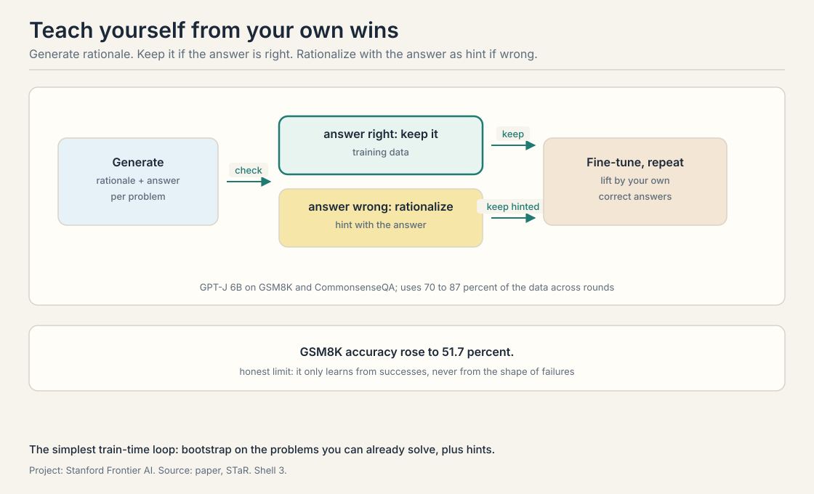
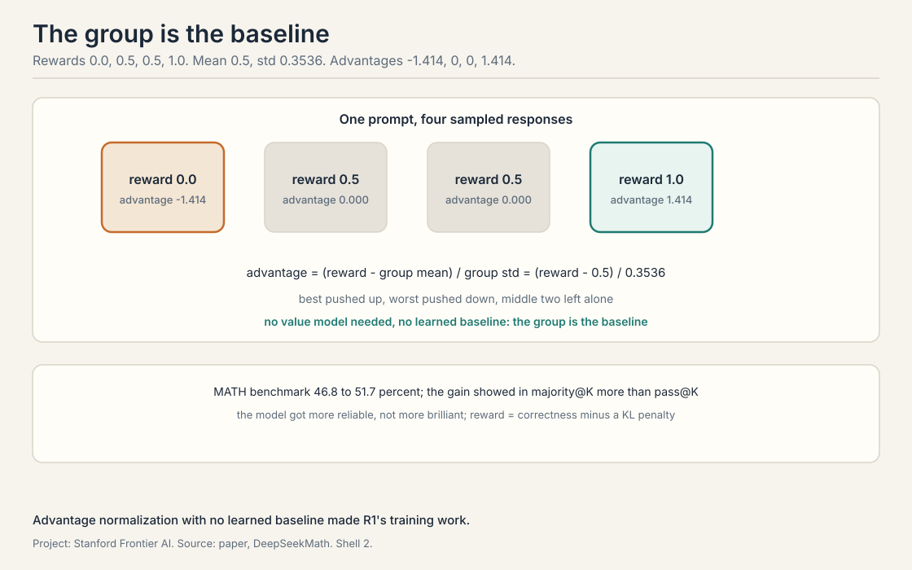
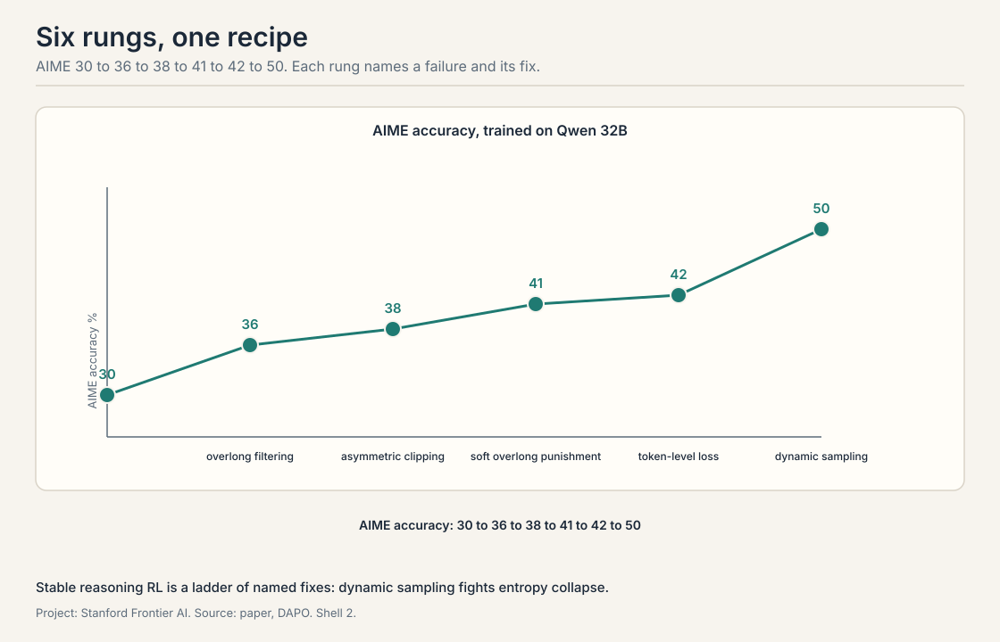

## The loop closes: training on your own answers

*Builds on: Lectures 2 through 5, which spent compute at test time.*

Lectures 2 through 5 spent compute at test time. This lecture
spends it at train time: the model generates its own training
data and learns from it. **Train-time compute** changes the
weights. The promise: today's expensive sampling becomes
tomorrow's cheap first try. The price: training on your own
outputs can amplify your own mistakes.

## STaR: bootstrap reasoning with reasoning

*Builds on: The train-time loop framing, in its simplest form.*

**STaR**, self-taught reasoner, is the simplest version of the
loop. The method is **rationale bootstrapping**: use the model's
own correct rationales as training data. Take a model, **GPT-J** 6B in the paper, and a dataset of
problems with answers, **GSM8K**, Grade School Math 8K, a set of grade-school word problems, and CommonsenseQA. For each
problem, have the model generate a rationale plus an answer. If
the answer is right, keep the rationale as training data. If it
is wrong, try **rationalization**: give the model the correct
answer as a hint and ask it to generate the rationale that
would lead there. If the hinted rationale reaches the answer,
keep it too. Then fine-tune the model on everything kept, and
repeat.

The numbers: accuracy on GSM8K rose to 51.7 percent, using 70 to
87 percent of the data across rounds. The model taught itself
from the problems it could already solve, plus the ones it
could solve with a hint.

The lecture is honest about the limits. STaR plateaus. It is
not true reinforcement learning: it only learns from successes,
never from the shape of failures. The method rests on three
assumptions the lecture names: the model can already solve some
problems, the answer key exists to check against, and
rationalization with a hint produces valid reasoning rather
than post-hoc stories. The follow-ups, **V-STaR** and
**Quiet-STaR**, extend the idea, but the core stays a
bootstrap: lift yourself by your own correct answers.

## DeepSeekMath and GRPO: the advantage trick

*Builds on: STaR's bootstrapping, moving to real reinforcement learning for reasoning.*

**DeepSeekMath** is the lecture's bridge from bootstrapping to
real reinforcement learning for reasoning. The recipe starts
from DeepSeek-Coder, not a general model: code training
transfers to math. The data is curated from Common Crawl with a
pipeline the lecture details: seed on arXiv and OpenWebMath,
train a classifier, crawl, filter, deduplicate. The training
algorithm is **GRPO**, group relative policy optimization.

GRPO's idea fits in one formula. For each prompt, sample a
group of responses and score them. The **advantage** of a
response is its reward minus the group mean, divided by the
group standard deviation: **advantage normalization** with no
learned baseline. A worked toy: rewards 0.0, 0.5, 0.5,
1.0. The mean is 0.5. The standard deviation is 0.3536. The
advantages are -1.414, 0.0, 0.0, 1.414. The best response gets
pushed up, the worst gets pushed down, and the middle two are
left alone. No separate value model, no learned baseline: the
group is the baseline.

The engineering detail the lecture stresses: GRPO needs four
copies of the model in memory, the policy, the reference, and
two for the optimizer state, later reduced to three. The reward
is the answer's correctness minus a **KL penalty**, a term that
keeps the policy from drifting too far from the reference
model. The result: **MATH benchmark** accuracy rose from 46.8 to
51.7 percent, and the gain showed in **majority@K**, the vote
over K samples, more than in pass@K. The model got more
reliable, not more brilliant.

## DAPO: the recipe, written down

*Builds on: GRPO, distilling the hard-won recipe for stable reasoning RL.*

**DAPO**, Decoupled Clip and Dynamic Sampling Policy
Optimization, is the lecture's payoff: an open-source RL system that
distills the hard-won recipe for stable reasoning RL, trained
on Qwen 32B. The lecture presents it as a ladder. Each rung
names a failure and its fix.

The climb, **AIME**, American Invitational Mathematics
Examination, accuracy at each step: start at 30. **Overlong
filtering**, drop responses that ramble past the length limit,
lifts it to 36. **Asymmetric clipping**, allow the policy to
move up more than down on good tokens, lifts it to 38.
**Soft overlong punishment**, penalize length smoothly instead
of cutting off, lifts it to 41. **Token-level loss**, weight
each token's contribution instead of each response's, lifts it
to 42. **Dynamic sampling**, keep generating until the batch
has enough non-trivial examples, lifts it to 50.

Two failure modes the lecture names. **Entropy collapse**: the
policy's outputs become deterministic too early, exploration
dies, and training stalls on a local optimum. Dynamic sampling
fights it by keeping the batch informative. And the
token-versus-response distinction: a long response with one
good token should not get the same update as a short response
that is all good. Token-level loss fixes the accounting.

## SFT versus RL: what each is for

*Builds on: STaR, GRPO, and DAPO, asking the field's live question about what each method is for.*

The lecture steps back and asks the field's live question. The
framing it offers: **SFT**, supervised fine-tuning, is
data-rich and fast. Show the model many examples and it absorbs
the pattern. **RL**, reinforcement learning, is a hill-climb
from few examples: it needs the infrastructure, the verifier,
and the patience, but it can find behaviors no demonstration
contained. SFT teaches the model what good looks like. RL
teaches it to search for better.

The lecture notes the industry gossip honestly: claims like
Grok 4 being "50 percent RL" circulate without public evidence.
Treat them as rumors, not results. The open problems the
lecture leaves: pass@K still lags behind majority@K, the
reliability-versus-brilliance gap from DeepSeekMath writ
large. Whether the learned behaviors are emergent or were
already prevalent in the data. And learning from failures:
every method in this lecture learns from successes. The
failures, the richest signal, are still mostly discarded.

> [!QA]
> Q: Work the STaR loop on one problem.
> A: Problem: a word problem with answer 11. Round one: the
> model generates a rationale ending in 9. Wrong, discard. The
> model is given the hint, answer 11, and generates a rationale
> ending in 11. Keep the hinted rationale. Fine-tune on it.
> Round two: the model now generates the right rationale
> unhinted on similar problems. The hint bootstraps the
> reasoning the model could not find alone.
> Follow-up: What if the hinted rationale is a post-hoc story?
> A: Then STaR trains the model to confabulate. The method
> assumes rationalization produces valid reasoning. The
> lecture names this as an assumption, not a result. A
> verifier that checks the steps, not just the answer, would
> close the hole. STaR has only the answer key.

> [!QA]
> Q: Why does GRPO not need a value model?
> A: The group is the baseline. Sample several responses to the
> same prompt, score them, and normalize: advantage equals
> reward minus group mean over group standard deviation. The
> comparison is relative within the group, so no separate model
> needs to predict absolute values. In the toy, the two middle
> responses get advantage exactly 0: they define the baseline
> the others are measured against.
> Follow-up: What breaks when the group is bad?
> A: Everything is relative. If all four responses are wrong,
> the least wrong gets a positive advantage and the policy
> learns to be least wrong. GRPO needs the group to contain
> signal: at least one response better than the rest by a
> margin the reward can see.

> [!QA]
> Q: Explain entropy collapse and how dynamic sampling fights it.
> A: Entropy measures the policy's randomness. Early in RL the
> policy explores: many different responses. If a few lucky
> responses get high reward, the policy collapses onto them,
> entropy falls to near zero, and exploration dies. Training
> then hill-climbs a local optimum. Dynamic sampling keeps
> generating until each batch contains enough responses that
> are neither all-right nor all-wrong, so every batch carries
> a learning signal and the policy keeps exploring.
> Follow-up: Why not just raise the temperature?
> A: Temperature raises randomness everywhere, including on
> problems the model already solves. Dynamic sampling is
> targeted: it spends the extra generation where the batch
> needs signal. The lecture's ladder shows it as the biggest
> single rung, 42 to 50.

> [!QA]
> Q: Why did token-level loss beat response-level loss?
> A: A response-level loss gives every token in a response the
> same update. A 200-token response with one brilliant token
> and 199 filler tokens gets the same per-token push as a
> 10-token response that is all good. The filler learns as
> much as the brilliance. Token-level loss weights each
> token's contribution, so credit lands where it belongs.
> Follow-up: Is this the same as the turn-level value in RLEF?
> A: Cousin, not twin. Both fix credit assignment. RLEF's
> turn-level value estimates the attempt's worth for the
> advantage. DAPO's token-level loss fixes the accounting of
> the update. One is about what to learn from, the other about
> how to count it.

> [!QA]
> Q: When would you choose SFT over RL?
> A: When you have the data and the pattern is known. SFT is
> fast, stable, and data-rich: show the model ten thousand
> good traces and it absorbs the shape. Choose RL when the
> demonstrations do not exist or the behavior must exceed
> them: no human writes the optimal reasoning trace, so the
> model must search. The lecture's rule: SFT for what good
> looks like, RL for better than demonstrated.
> Follow-up: What does RL need that SFT does not?
> A: A verifier and infrastructure. SFT needs examples. RL
> needs a reward signal per attempt, the sampling machinery,
> and the stability recipe: the whole DAPO ladder. That is why
> the lecture calls RL a hill-climb that needs infrastructure.

> [!QA]
> Q: Why does DeepSeekMath improve majority@K more than pass@K?
> A: Majority@K measures reliability: the most common answer
> across K samples is right. Pass@K measures reach: at least
> one sample is right. RL with a correctness reward teaches
> the model to put its probability mass on the right answer,
> which raises the majority vote. It does not teach the model
> new ways to be right, which is what pass@K needs. The model
> got more consistent, not more creative.
> Follow-up: Is that a failure?
> A: No, it is the expected signature of RL on verifiable
> rewards. The open problem the lecture names is the other
> direction: learning that expands what the model can reach,
> not just how reliably it reaches it.

> [!QA]
> Q: The lecture says RL can find behaviors no demonstration contained. Give the mechanism.
> A: The policy samples responses the training data never
> showed. Most are bad. A few stumble into a better reasoning
> pattern and get high reward. The update pushes the policy
> toward them. Repeat for thousands of steps and the policy
> settles on patterns no human demonstrated. SFT cannot do
> this: it only imitates what it is shown. The search is the
> difference.
> Follow-up: What stops it from finding degenerate patterns?
> A: The KL penalty and the verifier. The KL term keeps the
> policy near the reference model, so it cannot drift into
> gibberish that happens to score. The verifier decides what
> "better" means. A gameable verifier turns the search into
> reward hacking, the loop's permanent tax.

## Recap: the whole lesson on one screen

1. **Bootstrap from wins.** STaR keeps right rationales,
   rationalizes wrong ones with the answer as hint. GSM8K to
   51.7 percent. Then it plateaus.
2. **The group is the baseline.** GRPO advantage: reward minus
   mean over std. Toy: -1.414, 0, 0, 1.414. No value model.
3. **The ladder.** DAPO: 30 to 36 to 38 to 41 to 42 to 50 on
   AIME. Each rung fixes a named failure.
4. **Entropy dies first.** Collapse kills exploration. Dynamic
   sampling keeps batches informative.
5. **SFT shows, RL searches.** SFT is data-rich and fast. RL
   needs a verifier and infrastructure but can exceed
   demonstrations.
6. **Reliability before brilliance.** Majority@K rises before
   pass@K. Learning from failures is still open.

## Used where, as of October 2026

- **DeepSeek-R1 (January 2025):** the model that made GRPO
  famous. Its training is the public proof of the DeepSeekMath
  recipe at scale.
- **RLVR across labs:** reinforcement learning on verifiable
  rewards is the dominant 2025-2026 paradigm (agentic-RL survey,
  2026), and DeepSeek-R1 (January 2025) made it the default
  industry template. The DAPO recipe's components, dynamic
  sampling, token-level loss, length handling, ship in open
  implementations.
- **Qwen reasoning models:** the DAPO paper's Qwen 32B
  experiments feed directly into the open reasoning model
  line.
- **Quiet-STaR:** the STaR idea extended to reasoning at every
  token. Zelikman et al. showed it on Mistral 7B: CommonsenseQA
  rose from 36.3 to 47.2 percent, zero-shot, with no task
  fine-tuning (arXiv, March 2024).

## Official sources and further reading

**Official:**
- CS329A Part 6: Train-Time Scaling and Scaling RL (Autumn
  2025). https://www.youtube.com/watch?v=yVnmHSAy3ck

**Further reading:**
- Zelikman et al., "STaR" (2022).
  https://arxiv.org/abs/2203.14465
- Shao et al., "DeepSeekMath" (2024).
  https://arxiv.org/abs/2402.03300
- Yu et al., "DAPO" (2025).
  https://arxiv.org/abs/2503.14476

**Caveats from these sources.** The DAPO ladder numbers are as
reported in the lecture from the paper. The "50 percent RL"
Grok claim is cited in the lecture as unverified industry
gossip. The STaR assumptions are the lecture's, not the
paper's, framing.

## Connections to the other courses

- **CS329H:** the RLHF and preference machinery that GRPO and
  DAPO extend: reward models, KL penalties, and policy
  optimization.
- **CS336:** where the base models come from: DeepSeek-Coder
  as a starting point, and why code training transfers to
  math.
- **CS229:** policy gradients and advantage estimation: the
  classical roots of PPO, GRPO, and the DAPO recipe.
