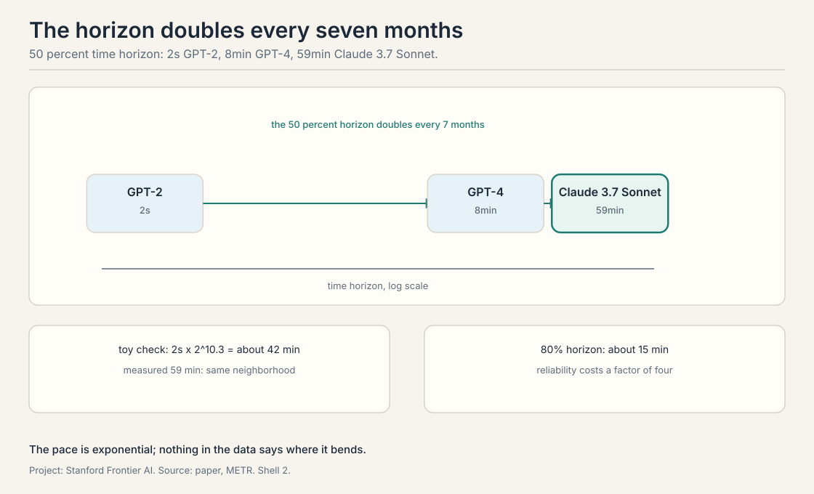
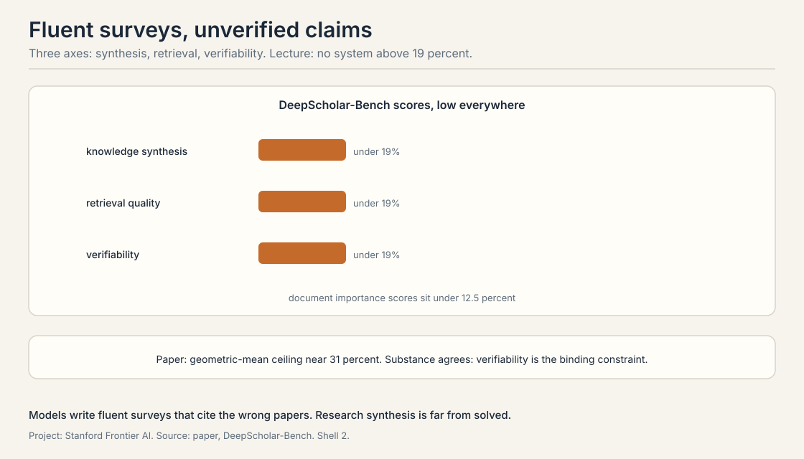

## Benchmarks saturate. Tasks do not.

*Builds on: The full self-improvement loop, which needs measurement of agency rather than answers.*

Answer benchmarks saturate: models hit the ceiling and the test
stops discriminating. Agent benchmarks measure something else:
whether the model can carry a task over hours, use tools, recover
from errors, and finish. This lecture covers three evaluations
that try to measure agency itself.

## METR: the time horizon

*Builds on: The agency measurement problem, with the time-horizon method.*

**METR**, Model Evaluation and Threat Research, asks a single
question: how long a task can an AI complete. The method: assemble a suite of real tasks, measure how
long each takes a skilled human, and find the task length at
which the model succeeds half the time. That length is the
**time horizon** at 50 percent. **Reliability** is measured the
same way at 80 percent: the task length the model completes 8
times out of 10.

The suite in the lecture: 170 tasks across three families.
**SWAA**, 66 small software tasks. **Edgecast**, 97 tasks from a
real company. **RE-Bench**, 7 hard research-engineering tasks.
Human times are **geometric means** across contractors: the
geometric mean damps outliers, so one very slow contractor does
not dominate. A detail the lecture stresses: contractors take 5
to 18 times longer than the original maintainers, because the
maintainers know the codebase. The human baseline is already a
choice, and the choice matters.

The headline: the 50 percent time horizon **doubles every 7
months**. GPT-2 managed 2 seconds. GPT-4 managed 8 minutes.
Claude 3.7 Sonnet, in 2025, managed 59 minutes. The toy that
checks the pace: start at 2 seconds, double every 7 months, run
6 years. That is 72 months, about 10.3 doublings, a factor of
roughly 1,250, landing at about 42 minutes. The measured 59
minutes is in the same neighborhood. The 80 percent horizon lags:
about 15 minutes when the 50 percent horizon was 59. Reliability
costs a factor of four.

The failure modes, from the lecture: poor planning, poor tool
choice, reasoning errors, **premature abandonment**, the agent
gives up while the task is still solvable, and repetitive loops,
the agent retries the same failing action. The lecture's warning
about the trend: the doubling pace cannot continue forever, but
nothing in the data says where it bends.

As of October 2026 the benchmark has moved. METR's **Time
Horizon 1.1**, January 2026, expanded to 228 tasks with a
doubling time of about 88.6 days for models since 2024. A late
2025 frontier model reached a 50 percent horizon near 4 hours 49
minutes, with the 80 percent horizon near 27 minutes. Claude
Mythos Preview, April 2026, pushed the 50 percent horizon past
16 hours, though METR notes measurements above 16 hours are
unreliable. The lecture's 7-month pace was already conservative.

## GDPval: against the professionals

*Builds on: METR's capability measurement, measuring economic value against professionals instead.*

**GDPval**, from OpenAI, measures economic value directly. The
method: 44 occupations, 322 tasks drawn from real professional
work, 220 of them gold-standard and public on HuggingFace,
spanning 9 GDP sectors. Each task is done by a professional with
10 or more years of experience, the **expert baseline**, and by
the model. Evaluators compare blind. The **win rate** is the fraction of tasks where
the model ties or beats the professional.

The trend the lecture shows is linear and steep. GPT-4o: 12.4
percent. Claude Opus 4.1: 47.6 percent. The line points at
parity. The failure mode the lecture names is
**instruction-following**: the model promises to check the
reference data and does not, or skips steps the professional
would never skip. Not reasoning. Diligence.

The economics: GPT-5 costs about 1.6 times more per task than the
model it replaced but finishes 1.4 times faster with multiple
trials, and the lecture reports model cost under 10 percent of
the expert's salary on these tasks. As of October 2026 the line
kept climbing: GPT-5.2 Thinking hit a 70.9 percent win-or-tie
rate against industry professionals in December 2025, up from
GPT-5's 38.8. The lecture's linear trend did not bend.

## DeepScholar-Bench: grading research synthesis

*Builds on: GDPval's professional comparison, grading the deep research agents of Lecture 5.*

**DeepScholar-Bench**, from Stanford, evaluates the deep
research agents of Lecture 5. The task: given a research
question, produce a related-work section. The benchmark is
**live**, a **live benchmark**: it reruns monthly on recent
post-training papers, so models cannot have memorized the answers. Three axes:
**knowledge synthesis**: does the report say the right things.
**retrieval quality**: did it find the right papers.
**verifiability**: is every claim backed by a citation that
says what the report claims it says.

The lecture's headline is blunt: no system exceeds 19 percent
overall, and document importance scores sit under 12.5 percent.
The models write fluent surveys that cite the wrong papers or
misstate what the papers say. The paper's own numbers are less
bleak: a geometric-mean ceiling near 31 percent across systems.
The gap between the lecture's telling and the paper's is a
measurement choice: which aggregation, which snapshot. The
substance agrees: research synthesis is far from solved, and
verifiability is the binding constraint.

> [!QA]
> Q: Work the METR doubling toy.
> A: Start at 2 seconds for GPT-2. Double every 7 months. Six
> years is 72 months, about 10.3 doublings. Two to the 10.3 is
> about 1,250. Two seconds times 1,250 is 2,500 seconds, about
> 42 minutes. The measured 50 percent horizon for Claude 3.7
> Sonnet was 59 minutes. The toy lands in the same
> neighborhood, which is the point: the pace is exponential
> and the arithmetic checks.
> Follow-up: Why does the 80 percent horizon lag so far behind?
> A: Reliability is a stricter test. The 50 percent horizon
> asks for one success in two tries. The 80 percent horizon
> asks for four in five. Long tasks multiply the chances to
> fail: one bad tool choice or one abandoned subtask sinks the
> run. The lecture's ratio, 59 minutes at 50 percent versus 15
> at 80, says most of the horizon is luck the model cannot yet
> convert into reliability.

> [!QA]
> Q: Why does the contractor-versus-maintainer gap matter?
> A: Contractors took 5 to 18 times longer than the maintainers
> who wrote the code. METR's human baseline uses contractors,
> so the "human time" for a task is already inflated. A model
> that matches the contractor has not matched the expert who
> knows the codebase. The baseline is a choice, and it flatters
> the model by a factor the lecture puts between 5 and 18.
> Follow-up: What is the right baseline?
> A: It depends on the claim. Against contractors, the claim is
> "the model does outsourced work at outsourced speed".
> Against maintainers, the claim is "the model does expert
> work at expert speed". The lecture reports the contractor
> numbers and flags the gap so the audience discounts
> accordingly.

> [!QA]
> Q: What does premature abandonment tell us about agents?
> A: That knowing when to stop is unsolved. The agent gives up
> on solvable tasks: it misjudges the difficulty, or one
> failure convinces it the task is impossible. Humans do this
> too, but humans can be told "keep going". The agent's stop
> condition is internal. The lecture lists it alongside poor
> planning and tool choice as a top failure mode, which means
> persistence is a capability, not a attitude.
> Follow-up: How would you fix it?
> A: Separate the stop decision from the work: a critic that
> reviews "should I quit" against the evidence, or a budget
> that forces N more attempts after the first quit signal.
> Both are verifiers over the agent's own judgment, the
> course's recurring answer.

> [!QA]
> Q: GDPval's failure mode is instruction-following, not reasoning. Why does that matter?
> A: Because it reframes the gap. The models can do the
> analysis. They skip the diligence: not checking the
> reference data, not following the steps. Professionals win
> on thoroughness, not brilliance. The lecture's implication:
> the next points of win rate come from obedience and
> verification habits, the unglamorous half of agency.
> Follow-up: Is that easier or harder than reasoning?
> A: Easier to specify, harder to guarantee. A checklist can
> demand diligence. But the model must notice each step
> matters and actually execute it. The 12.4 to 47.6 to 70.9
> climb suggests it is learnable. The remaining gap suggests
> it is not yet learned.

> [!QA]
> Q: Why is DeepScholar-Bench live?
> A: Static benchmarks leak into training data. A benchmark of
> research synthesis built on 2024 papers would be memorized by
> 2026 models, and the scores would measure recall, not
> research. Monthly reruns on recent post-training papers keep
> the questions fresh. The cost is comparability: the test
> changes, so scores across months are not strictly
> comparable.
> Follow-up: What does the 19 versus 31 percent gap mean?
> A: Different aggregations of the same weakness. The
> lecture's 19 percent is the headline from its snapshot. The
> paper's 31 percent geometric-mean ceiling is the kinder
> aggregation. Both say the same thing: verifiability is the
> binding constraint, and fluent unverified surveys are what
> current systems produce.

> [!QA]
> Q: Do these benchmarks measure what the course needs?
> A: Partially. METR measures how long a task the model can
> complete, which is the course's outer metric. GDPval
> measures economic value against professionals, which is the
> market's metric. DeepScholar-Bench measures verifiability,
> which is the loop's metric: unverified synthesis cannot
> train the next model. None measures self-improvement
> directly. The course's loop, generate, verify, train,
> repeat, has no benchmark that runs the full turn.
> Follow-up: What would that benchmark look like?
> A: A task suite where the model trains on its own verified
> outputs between rounds, and the score is the delta across
> rounds. The verifier would need to be airtight, or the
> benchmark would measure reward hacking. Nobody has built it.
> That absence is the field's open measurement problem.

> [!QA]
> Q: The lecture warns the doubling pace cannot continue. Where does it bend?
> A: The honest answer is that the lecture does not say. The
> candidates: task length hits the context window, the
> failure modes compound faster than capability grows, or the
> remaining tasks need judgment that does not scale with
> time. The October 2026 data shows the pace accelerating, 88.6
> day doubling, not bending. The warning is prudence, not a
> prediction.
> Follow-up: What would bending look like in the data?
> A: The 50 percent horizon stalling while the 80 percent
> horizon catches up: capability stops extending reach and
> starts converting reach into reliability. Or the failure
> modes shifting from planning and tool choice to judgment
> and values, which do not yield to more time.

## Recap: the whole lesson on one screen

1. **The horizon doubles.** 2 seconds, 8 minutes, 59 minutes
   at 50 percent. Doubling every 7 months. Toy predicts 42
   minutes over 6 years.
2. **Reliability lags.** 80 percent horizon was 15 minutes when
   50 percent was 59. Long tasks multiply failure chances.
3. **Baselines are choices.** Contractors take 5 to 18 times
   longer than maintainers. The human time flatters the model.
4. **Professionals lose on diligence.** GDPval: 12.4 to 47.6
   percent, linear. The failure mode is instruction-following.
   By late 2025, 70.9 percent.
5. **Synthesis is unverified.** DeepScholar-Bench: no system
   above 19 percent in the lecture's telling, 31 percent
   ceiling in the paper's. Verifiability binds.
6. **No loop benchmark.** Nobody measures a full
   generate-verify-train turn. The field's open measurement
   problem.

## Used where, as of October 2026

- **METR Time Horizon 1.1 (January 2026):** 228 tasks, 88.6-day
  doubling since 2024. The live continuation of the lecture's
  trend, now past 16 hours at 50 percent for the frontier.
- **GDPval (OpenAI, 2025):** the professional-comparison
  paradigm, with GPT-5.2 Thinking at 70.9 percent win-or-tie in
  December 2025.
- **DeepScholar-Bench:** Patel et al. plan new research queries
  every month, the template for leak-proof agent evaluation
  (arXiv, August 2025).
- **Frontier lab evals:** Terminal-Bench 2.0 (89 hard terminal
  tasks, ICLR 2026) and METR RE-Bench (seven research-engineering
  environments, November 2024) measure long-horizon work next to
  answer benchmarks (openreview, 2026, METR, 2024).

## Official sources and further reading

**Official:**
- CS329A Part 8: Agentic Evaluations and Long-Horizon Tasks
  (Autumn 2025). https://www.youtube.com/watch?v=8JAqLnTaZu4

**Further reading:**
- Kwa et al., "Measuring AI Ability to Complete Long Tasks"
  (METR, 2025). https://arxiv.org/abs/2503.14499
- Patwardhan et al., "GDPval" (2025).
  https://arxiv.org/abs/2510.04374
- Patel et al., "DeepScholar-Bench" (2025).
  https://arxiv.org/abs/2508.20033

**Caveats from these sources.** The 19 percent DeepScholar
figure is the lecture's telling. The paper reports a
geometric-mean ceiling near 31 percent. The October 2026 METR
figures are from Time Horizon 1.1, a larger suite than the
lecture's 170 tasks. The Claude Mythos Preview 16-hour figure is
from METR's May 8, 2026 time-horizon update. Above-16-hour
measurements are flagged unreliable by METR itself.

## Connections to the other courses

- **CS329Z:** evaluation of agents from the builder side:
  how to test tool use, RAG, and long-horizon behavior in
  practice.
- **CS329H:** human evaluation, Elo, and preference
  measurement: the machinery behind GDPval's blind
  comparisons.
- **CS229S:** what long-horizon tasks cost to run: the
  systems side of 16-hour agent evaluations.
