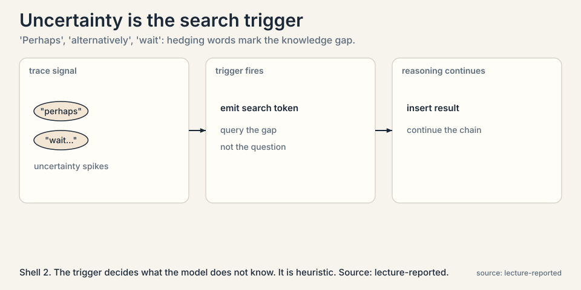
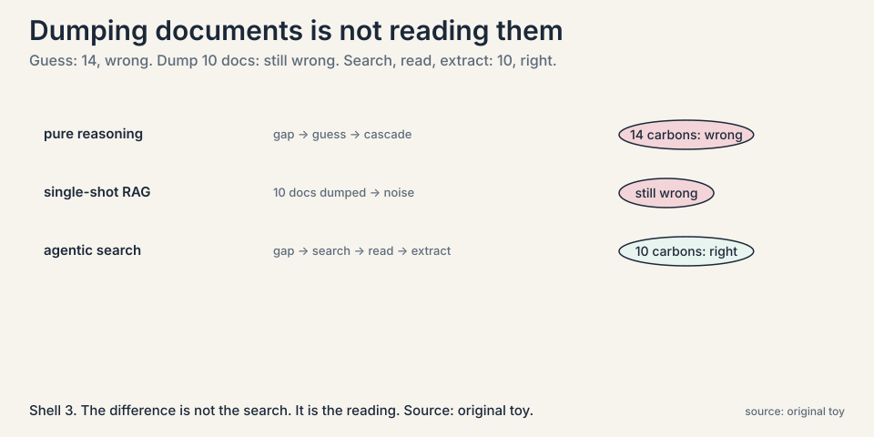
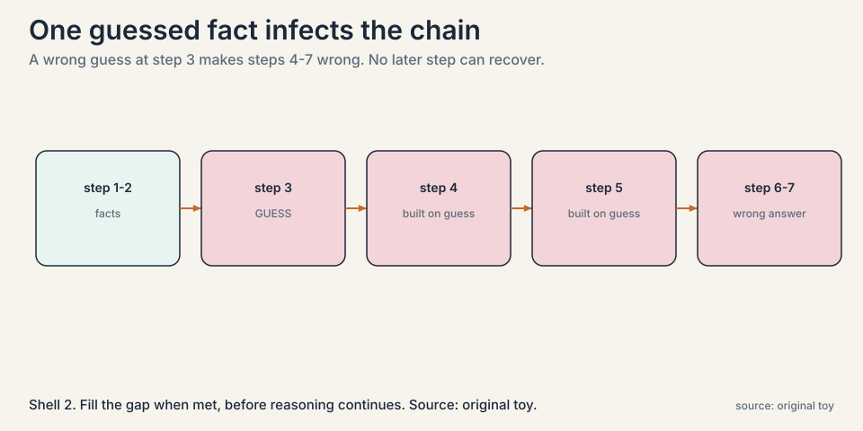
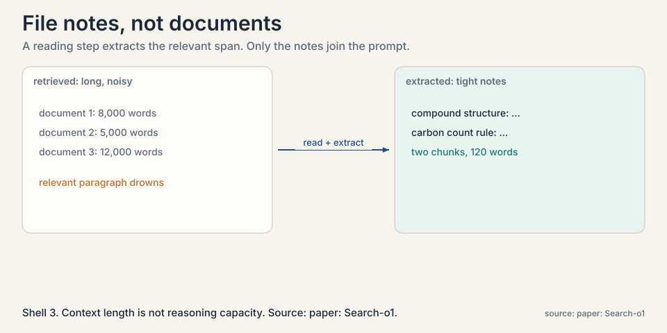
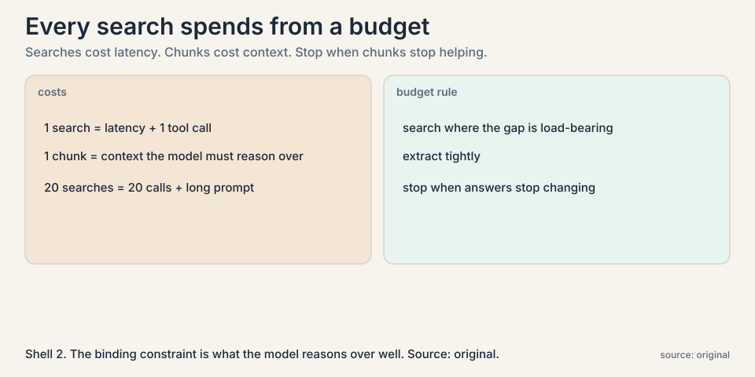

## The problem: the model does not know what happened yesterday

Large reasoning models are trained with a knowledge cutoff. If
something happened yesterday, it is not in the weights. Worse,
the model does not always admit the gap.

### Subchapter: knowledge cutoffs and silent gaps

A **knowledge gap** is a point in the reasoning where the model
needs a fact it does not reliably have. The naive fix is
retrieval-augmented generation (RAG): turn the question into a
search query, fetch documents, paste them into the prompt, and
generate. One retrieval, up front, before reasoning starts.

The cutoff is the obvious problem. The silent gap is the worse
one. A model that says "I do not know" can be helped. A model
that guesses fluently cannot be detected, and its guess becomes
a premise for everything after.

### Subchapter: uncertainty words as telltales

The lecture points to a telltale: on the GPQA science benchmark,
reasoning traces fill with uncertainty words, "perhaps",
"alternatively", "wait". The model is guessing past its
knowledge, and the guesswork propagates. One wrong guess early
in a long chain cascades into a wrong final answer.



The hedging words are not the mechanism. They are the symptom
the mechanism reads. The trigger watches the trace for signs
the model is guessing, and fires a search at exactly that
point. Imperfect, but pointed at the right moment.

## First attempt, shown failing: retrieve once, reason once

The lecture's toy is a chemistry question: after a chain of
reactions, how many carbon atoms are in product 3? Watch three
approaches.



### Subchapter: approach 1, pure reasoning and the cascade

Approach 1, pure reasoning. The model hits an unfamiliar
intermediate compound, guesses its structure from the weights,
and counts 14 carbons. Wrong. The guess cascaded.



The cascade is the key mechanism. Step 3's guess becomes step
4's premise, step 4's conclusion becomes step 5's premise, and
so on. No later step re-examines step 3, because each step
trusts its inputs. A single guessed fact early in a long chain
is enough to doom the answer. Filling the gap at the moment it
appears, before reasoning continues, is the entire point of
searching mid-thought rather than after.

### Subchapter: approach 2, single-shot RAG and the drowning

Approach 2, single-shot RAG. The model searches once, retrieves
10 documents about the compounds, pastes all of them into the
prompt, and reasons. Still wrong. The documents contain the
answer, but buried in noise: 10 long documents exceed what the
model can carefully reason over, and the relevant paragraph
drowns. Retrieval helped. Dumping hurt.

The failure is structural. A complex question needs different
facts at different reasoning steps. One retrieval at the start
cannot supply a fact the model only realizes it needs at step
7. And pasting raw documents treats the model's context as
infinite, which it is not.

## The key question

What if the model searches in the middle of thinking, whenever
it feels a knowledge gap, and reads what it finds instead of
filing it unread?

## The new idea: agentic search

The lecture builds the answer in two layers.

### Subchapter: layer 1, agentic RAG

**Agentic RAG.** The model emits special tokens when its
uncertainty spikes, triggering a search mid-reasoning. The
retrieved documents are inserted into the chain, and reasoning
continues with the new facts. Retrieval happens per gap, not
per question. A multi-part problem triggers several searches,
each aimed at the fact the current step needs.

The query is the gap, not the question. At step 7 the model
needs the structure of one intermediate compound, so it
searches for that compound, not for the original chemistry
question. Per-gap queries are narrower and better aimed than
the one broad query of single-shot RAG.

### Subchapter: layer 2, reason in documents

**Reason in documents (Search-o1).** Retrieved documents are long
and noisy. Instead of pasting them raw, a dedicated step reads
each document, judges relevance, and extracts only the needed
chunks. The lecture's human analogy: you do not file every
reference unread. You take notes. The extracted notes, not the
documents, join the prompt.



### Subchapter: the chemistry toy, replayed

Now replay the chemistry toy with both layers. The model
reaches the unfamiliar compound, uncertainty spikes, and it
searches. It retrieves candidate pages, reads them, extracts
the one paragraph giving the compound's structure, and
continues. Final count: 10 carbons. Correct. The difference
from approach 2 is not the search. It is the reading.

```ascii
pure reasoning:      gap -> guess -> 14 (wrong, cascades)
single-shot RAG:     10 docs dumped -> noise -> still wrong
agentic search:      gap -> search -> read -> extract -> 10 (right)
```

## Where it breaks, part 1: knowing what to search

The hardest subproblem is the trigger. How does the model know
which terms it does not know? The lecture is honest that this is
partly heuristic: uncertainty in the trace, named entities that
look load-bearing, terms the model cannot define. Search the
wrong thing and you retrieve noise. Miss the gap and the guess
cascades. The trigger is doing real epistemic work, deciding
what the model does not know, and it is imperfect.

### Subchapter: false positives and false negatives

The trigger fails in both directions. A false positive fires a
search on a fact the model actually knew: wasted latency,
wasted context, and retrieved noise that can derail a correct
chain. A false negative misses a real gap: the guess cascades
exactly as in approach 1. The lecture pairs search with a
memory of the reasoning state: a buffer tracking what is being
answered and what was assumed. Detecting past guesses is an
open problem. The current defense is to search at the first
sign of uncertainty rather than after the damage.

## Where it breaks, part 2: the context budget

Every retrieved chunk consumes context, and every search costs
latency. A deep research session that fires 20 searches and
extracts 20 chunks is 20 tool calls plus a long prompt.



### Subchapter: context length versus reasoning capacity

The lecture frames this as context engineering: the binding
constraint is what the model can actually reason over well, not
the nominal context length. Dumping more documents past that
point degrades answers, as approach 2 showed. The agent must
budget: search where the gap matters, extract tightly, and stop.

The distinction matters because vendors advertise context
length, not reasoning capacity over that length. A 1M-token
window that the model reasons over sloppily is worse than a
tight 20-chunk prompt it reasons over well. The decision rule:
measure answer quality against chunk count, not against window
size, and stop adding chunks when the answers stop changing.

## Mapping back

| Gap failure | Agentic search answer | How |
|---|---|---|
| Knowledge cutoff, silent guesses | Search mid-reasoning | Uncertainty triggers queries per gap, not one query per question. |
| Guesses cascade down the chain | Fill each gap when met | The fact arrives at the step that needs it. Later steps build on facts, not guesses. |
| 10 raw documents drown the reasoner | Reason in documents | Extract relevant chunks. Only the notes join the prompt. |
| One retrieval cannot serve step 7 | Iterate | Multiple search-read-reason rounds per session. |

## The honest price

Each search is latency and each chunk is context. The trigger
that decides what to look up is heuristic and can miss real
gaps or chase false ones. And the whole design assumes the
model's reasoning over long contexts is the bottleneck worth
engineering around. As long-context reasoning improves, the
optimal amount of extraction shifts. Deep research agents are
an applied form of the course's thesis: test-time compute,
spent on search and reading, buys capability the weights do
not have.

## Go deeper

<div style="position:relative;padding-bottom:56.25%;height:0;overflow:hidden;max-width:100%;margin:16px 0;">
<iframe style="position:absolute;top:0;left:0;width:100%;height:100%;" src="https://www.youtube-nocookie.com/embed/YkCDVn3_wiw" title="OpenAI Deep Research announcement livestream" frameborder="0" allow="accelerometer; autoplay; clipboard-write; encrypted-media; gyroscope; picture-in-picture" allowfullscreen></iframe>
</div>

- OpenAI's Deep Research announcement (Mark Chen, Head of Frontiers Research): multi-step research on the internet, discovering, synthesizing, and reasoning over content with an adapting plan. https://www.youtube.com/watch?v=YkCDVn3_wiw
- Li et al., Search-o1 (2025): agentic search plus the Reason-in-Documents module. https://arxiv.org/abs/2501.05366
- OpenAI, Introducing Deep Research (2025): the production system this chapter's ideas became. https://openai.com/index/introducing-deep-research/

> [!QA]
> Q: How is agentic RAG different from regular RAG?
> A: Regular RAG retrieves once, up front: question in, documents out, answer generated. Agentic RAG retrieves during reasoning: the model detects a knowledge gap mid-trace, emits a trigger, searches, inserts the result, and continues. A complex question gets several targeted retrievals, one per gap, instead of one broad retrieval per question.
> Follow-up: What triggers the search?
> A: Uncertainty signals in the trace: hedging words like "perhaps" and "wait", entities the model cannot ground, terms it cannot define. The lecture is candid that the trigger is heuristic. It is the agent deciding what it does not know, which is genuinely hard and sometimes wrong in both directions.

> [!QA]
> Q: Walk me through the three approaches on the chemistry toy.
> A: Approach 1, pure reasoning: the model hits an unfamiliar intermediate compound, guesses its structure, counts 14 carbons. Wrong, and the guess cascades. Approach 2, single-shot RAG: one search up front, 10 documents pasted in, the relevant paragraph drowns in noise. Still wrong. Approach 3, agentic search: at the gap, uncertainty spikes, the model searches for the compound, reads the pages, extracts the structure paragraph, continues. 10 carbons. Right. Same search capability as approach 2. The reading made the difference.
> Follow-up: Why did approach 2 fail if it had the same documents?
> A: Because retrieval is not reading. Ten raw documents exceed what the model reasons over carefully, so the relevant paragraph drowned. The model had the answer in context and still failed. Context length is not reasoning capacity.

> [!QA]
> Q: Why not just paste all retrieved documents into the prompt?
> A: Because the model cannot reason carefully over all of them. In the lecture's chemistry toy, 10 dumped documents still produced the wrong answer: the relevant paragraph drowned in noise. Search-o1's fix is a reading step that extracts only the relevant chunks. The prompt gets notes, not documents. Context length is not the same as reasoning capacity over that context.
> Follow-up: Is there a principled limit to how much to retrieve?
> A: The lecture frames it as a budget problem: retrieve where the gap is load-bearing, extract tightly, stop when marginal chunks stop changing the answer. There is no formula. It is context engineering, and the right budget moves as models' long-context reasoning improves.

> [!QA]
> Q: What does "knowledge gaps cascade" mean?
> A: One guessed fact early in a chain infects everything downstream. In the toy, guessing the intermediate compound's structure made the carbon count wrong, and no later reasoning step could recover because every step assumed the guess. Filling the gap at the moment it appears, before reasoning continues, is the entire point of searching mid-thought rather than after.
> Follow-up: Can the agent detect that its earlier step was a guess?
> A: Only imperfectly, which is why the lecture pairs search with memory of the reasoning state: a buffer tracking what is being answered and what was assumed. Detecting past guesses is an open problem. The current defense is to search at the first sign of uncertainty rather than after the damage.

> [!QA]
> Q: How does the trigger decide what to search for?
> A: It queries the gap, not the question. At step 7 the model needs one compound's structure, so it searches for that compound, not for the original chemistry question. The signals are heuristic: uncertainty words in the trace, named entities that look load-bearing, terms the model cannot define. The lecture is honest that this is partly guesswork: the trigger is the agent doing epistemology on itself, and it errs in both directions.
> Follow-up: What is the cost of a false positive trigger?
> A: Latency, context, and risk. An unnecessary search burns a tool call and inserts retrieved text that can derail a correct chain. Trigger-happy agents drown in their own retrievals. The tuning problem is real: sensitive enough to catch gaps, specific enough not to chase noise.

> [!QA]
> Q: What is "reason in documents" and why is it a separate step?
> A: A dedicated stage that reads each retrieved document, judges relevance, and extracts only the needed chunks before they join the main reasoning chain. It is separate because mixing long noisy documents into the main trace derails it: the reasoner starts reasoning about the documents instead of the problem. Separation keeps the main chain clean. The extracted notes join the prompt. The documents do not.
> Follow-up: Could the main model just read carefully instead?
> A: That is what approach 2 tried, and it failed. The reading step can use a smaller, cheaper model with one job: extract. Division of labor beats asking one model to both reason deeply and read widely at once. It is also cheaper: the extractor runs on documents, the reasoner runs on notes.

> [!QA]
> Q: You are building a deep research product. How do you budget searches?
> A: Three budgets. A per-question search cap, say 10, so one hard question cannot burn the latency budget. A per-session chunk cap, so the prompt stays inside the model's effective reasoning window, not its nominal window. And a stopping rule: halt when new chunks stop changing the draft answer. Instrument all three: log searches fired, chunks kept, and answer deltas per chunk. The lecture's honest price becomes your dashboard.
> Follow-up: What is the first thing that breaks at scale?
> A: The trigger. At scale, false-positive searches dominate cost: most questions have a few uncertain moments, and searching all of them multiplies latency. The fix is trigger calibration on real traffic: measure which fired searches actually changed answers, and tighten the threshold until the marginal search pays for itself.

## Recap: the whole lesson on one screen

1. **Yesterday is not in the weights.** Knowledge cutoffs plus
   silent guessing. Uncertainty words ("perhaps", "wait") mark
   the gaps.
2. **Single-shot RAG fails twice.** Pure reasoning guesses and
   cascades: 14, wrong. Dumping 10 documents drowns the
   reasoner: still wrong.
3. **The key question.** What if the model searches mid-thought
   and reads what it finds?
4. **Agentic RAG.** Uncertainty triggers searches per gap.
   Each reasoning step gets the fact it needs. Query the gap,
   not the question.
5. **Reason in documents.** Extract chunks, file notes, not
   documents. The chemistry toy: 10 carbons, correct.
6. **The trigger problem.** Deciding what you do not know is
   heuristic and sometimes wrong both ways. False positives
   waste budget. False negatives cascade.
7. **The context budget.** Searches cost latency. Chunks cost
   context. Budget both. Stop when chunks stop helping.
   Reasoning capacity, not window size, is the constraint.
8. **The honest price.** Test-time compute buys what the
   weights lack, per question, forever.

## Official sources and further reading

**Official:**
- CS329A Part 7: Self-Improvement with Search and Deep
  Research Agents (Autumn 2025): the lecture this chapter
  follows. https://www.youtube.com/watch?v=Uni9dqyuuDM
- Li et al., Search-o1: Agentic Search-Enhanced Large
  Reasoning Models (2025). [paper](https://arxiv.org/abs/2501.05366)

**Further reading:**
- OpenAI, "Introducing Deep Research" (2025): the production
  system these ideas became. [link](https://openai.com/index/introducing-deep-research/)
- "Agentic Context Engineering" (2025): the context-budget
  framing the lecture cites.

**Caveats from these sources.** The chemistry toy is the
lecture's illustration with simplified numbers. GPQA
uncertainty-word observations are qualitative. The optimal
retrieval budget is presented as an open engineering question,
not a solved one. The Deep Research announcement URL is
OpenAI's blog post. Verify it loads.

## Connections to the other courses

- **CS329Z:** RAG pipelines in production: chunking,
  retrieval, and evaluation, the engineering under this
  chapter's agent.
- **CS329A L03:** the search call is a ReAct action. The gap
  trigger is the thought that precedes it.
- **CS329A L05:** the memory buffer of reasoning state is a
  small tree of what is known and assumed. Search fills its
  gaps.
- **CS224N:** retrieval and long-context reasoning from the
  language-model side.
