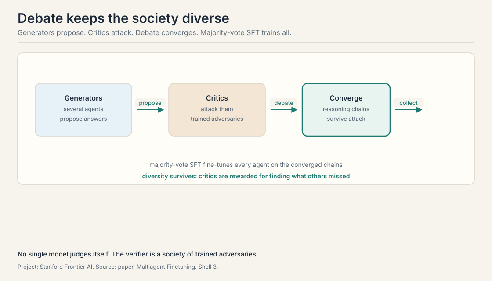
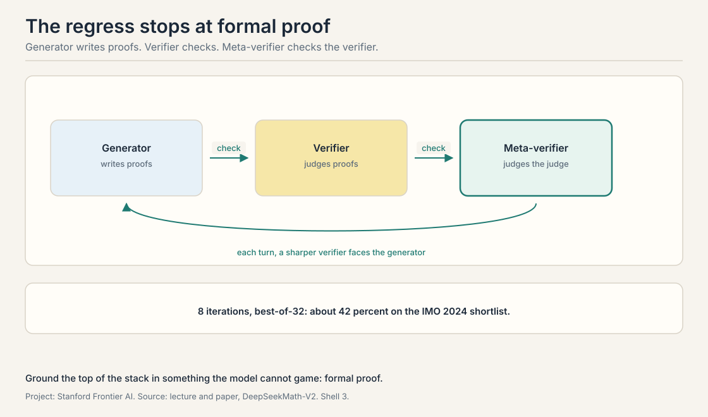
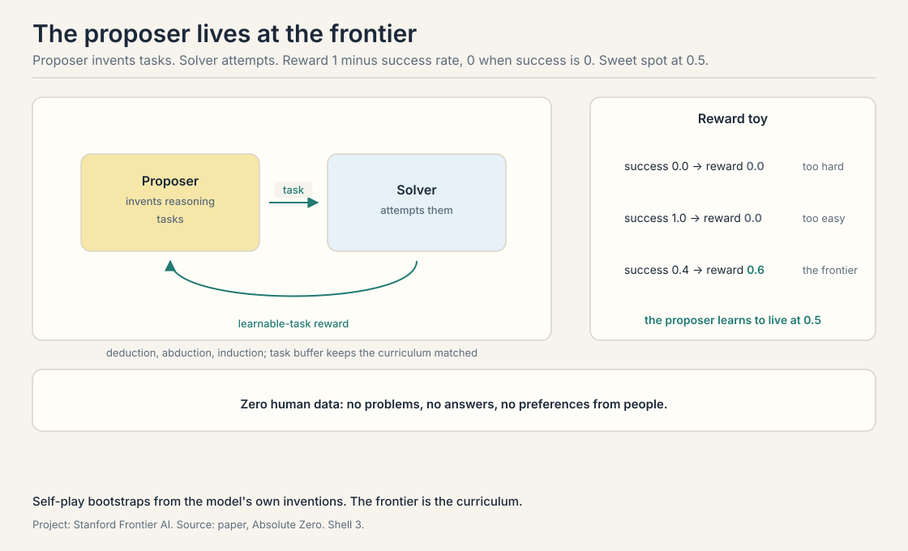

## The course's question, restated

*Builds on: All seven lectures, restating the question they built machinery to answer.*

Can agents improve themselves? Seven lectures built the
machinery: sample at test time, verify, plan, search, train on
the winners. This lecture points at what comes next. Three
research directions with results, then the open problems the
field has not cracked.

## Agents teaching agents: multi-agent fine-tuning

*Builds on: The generator-verifier loop, with the verifier externalized as a society of critics.*

**Multi-agent fine-tuning** replaces the single model with a
society. Several **generator** agents propose answers. Several
**critic** agents attack them: a **generator-critic** society.
The agents **debate**: each round, generators defend and revise, critics probe for flaws.
Then **majority-vote SFT**: collect the reasoning chains the
debate converged on and fine-tune every agent on them.

The finding the lecture stresses is **diversity preserved**.
Single-model self-training collapses: the model converges on
one style and the gains stall, the entropy collapse of Lecture
6 in social form. Debate keeps the agents different from each
other, because each critic is rewarded for finding what the
others missed. The system improves without collapsing into one
voice. The lecture reports transfer to GSM8K: the debated
reasoning patterns help on math the agents were not directly
trained on.

The mechanism is the course's **generator-verifier loop** with the
verifier externalized. No single model judges itself. The critics are the
verifier, and they are trained adversaries, not static tests.

## Verifiers checking verifiers: DeepSeekMath-V2

*Builds on: Multi-agent debate's externalized verifier, with a meta-verifier checking the checker.*

Lecture 6's DeepSeekMath trained a generator with GRPO. The
ceiling was the verifier: a learned reward model can be gamed.
**DeepSeekMath-V2** answers with a **meta-verifier**, a system
that checks the checker.

The loop has three roles. The **generator** writes proofs. The
**verifier** checks them. The **meta-verifier** checks the
verifier's judgments. The lecture reports the training curve:
over 8 iterations the proof score climbs, and with best-of-32
sampling the system reaches about 42 percent on the **IMO**,
International Mathematical Olympiad, 2024
shortlist. Each turn, the generator faces a sharper verifier,
and the verifier faces a sharper meta-verifier. The regress
stops because the top of the stack is checked against formal
proof: mathematics has a ground truth the loop cannot talk its
way past.

The published paper, November 2025, goes further than the
lecture's snapshot: gold-level performance on IMO 2025 and
118 of 120 on Putnam 2024. The lecture's 42 percent is the
training-curve figure from Autumn 2025. The paper's medals are
what the loop became. The direction is the point: when the
verifier is learned, verify the verifier, and ground the top
in something the model cannot game.

## Absolute Zero: no human data at all

*Builds on: Every method so far, which needed human data somewhere, asking what happens with none.*

Every method so far needed human data somewhere: problems,
answers, constitutions, preferences. **Absolute Zero** asks
what happens with none. Two roles, both played by the model: a
**proposer-solver** pair. The **proposer** invents reasoning tasks.
The **solver** tries to solve them. That is **self-play**: the
model plays both roles, proposer and solver improving by training
against each other with no human data. The proposer is rewarded for tasks the solver
solves about half the time: the reward is 1 minus the average
success rate, except an average success rate of exactly 0 pays
0 instead of 1, so trivial tasks and impossible tasks both pay
nothing. The sweet spot is the frontier of the solver's
ability.

The tasks come in three kinds. **Deduction**: given rules, draw
the conclusion. **Abduction**: given observations, find the
rules. **Induction**: given examples, find the pattern. The
proposer draws from a **task buffer**, a curriculum of past
tasks that keeps the difficulty matched to the solver. The
result the lecture reports: state of the art on reasoning
benchmarks with zero human data. No problems written by
people. No answers. No preferences. The loop bootstraps from
the model's own inventions.

The worked toy for the reward: solver success rate 0.0, reward
0, too hard. Success rate 1.0, reward 0, too easy. Success
rate 0.4, reward 0.6, the frontier. The proposer learns to live
at 0.5.

## Open-endedness: AlphaEvolve, recapped

*Builds on: Absolute Zero's self-play, with the verifier as the world and no fixed task at all.*

The lecture recaps **AlphaEvolve**, DeepMind's coding agent for
scientific discovery, as the open-ended direction. The system
evolves code: propose a change, run it, keep what works, repeat
over thousands of generations. The results the lecture cites:
a 4x4 complex matrix multiplication in 48 scalar multiplications,
the first improvement over Strassen's algorithm in 56 years,
plus data-center scheduling gains and hardware circuit
simplifications. The full lecture on it is not in this course's
sources. The recap here is the lecture's own. The idea earns
its place: evolution is the self-improvement loop with the
verifier as the world and no fixed task at all.

## Non-verifiable domains: where the loop has no anchor

*Builds on: the verifier regress, which stops at ground truth
in math but has nowhere to stop elsewhere.*

The lecture closes with problems, not results.

**Non-verifiable domains.** The whole loop assumes a verifier:
tests, proofs, answer keys. Chip design, wet-lab biology,
creative work: the feedback is slow, expensive, or subjective.
The lecture names this as the boundary of everything the
course taught. Extending the loop past verification is the
field's hardest problem.

## Intelligence per watt and hybrid routing

*Builds on: non-verifiable domains, the capability boundary,
with the economics boundary alongside it.*

**Intelligence per watt.** Capability is not the only metric.
The lecture reports a striking measurement: local models with
20 billion or fewer active parameters handle 88.7 percent of a
million sampled ChatGPT queries. Over two years, 3.1 times the
accuracy times 1.7 times the hardware efficiency gave 5.3
times the intelligence per watt. Meanwhile demand exploded:
Google's token volume went from 160 trillion in February to 1.3
quadrillion in October, and total demand rose 1,200 times. The
future the lecture sketches is **hybrid routing**: small local
models for the easy 88.7 percent, frontier models in the cloud
for the rest, with the router as the new research problem.

## Continual learning: the loop that never stops

*Builds on: intelligence per watt, the economics of running the
loop, with the missing capability that would let the loop run
forever.*

**Continual learning.** Models train once and freeze. The world
does not. The lecture names continual learning, absorbing new
knowledge without forgetting the old, as the missing piece of
the self-improving agent. Every loop in the course runs in
episodes. None runs forever.

## Test-time infrastructure: serving the loop

*Builds on: continual learning, the open capability problem,
with the open systems problem underneath it.*

**Test-time infrastructure.** The lecture names two systems,
Hydrogen and Tokamak [uncertain: no public corroboration found
for these as AI serving infrastructure], as the coming
infrastructure for test-time compute: serving stacks built for
sampling, searching, and verifying at scale. The loop's
economics depend on it.

> [!QA]
> Q: Why does debate preserve diversity when self-training collapses it?
> A: Self-training rewards agreement with the model's own best
> outputs. Every round pulls the distribution toward its own
> center, and the tails die: entropy collapse. Debate rewards
> disagreement: each critic scores by finding flaws the others
> missed. The generators must then cover the critics' attacks,
> which keeps multiple reasoning styles alive. The verifier is
> adversarial, so convergence means surviving attacks, not
> copying the majority.
> Follow-up: What breaks the debate?
> A: Collusion. If the critics learn to trade easy approvals,
> the adversarial pressure dies and the society collapses like
> a single model. The method needs the critics' incentives to
> stay opposed. Mechanism design, not just training.

> [!QA]
> Q: Where does the verifier regress stop?
> A: At ground truth the model cannot argue with. In
> DeepSeekMath-V2 the top of the stack is formal proof:
> mathematics with machine-checkable correctness. The
> meta-verifier can be gamed in principle, but the formal
> checker cannot be talked into accepting a wrong proof. The
> lecture's general point: every learned verifier needs a
> non-learned anchor, or the regress never ends.
> Follow-up: What is the anchor for non-math domains?
> A: That is the open problem. Code has tests. Math has proof.
> Chip design has simulation, slow but honest. Creative work
> has no anchor at all. The lecture lists non-verifiable
> domains as the boundary precisely because the regress has
> nowhere to stop there.

> [!QA]
> Q: Work the Absolute Zero proposer reward.
> A: The solver attempts the proposed task several times. The
> success rate is the fraction solved. The proposer's reward
> is 1 minus that rate, except the extremes pay nothing:
> success 0.0 means the task is impossible, reward 0. Success
> 1.0 means it is trivial, reward 0. Success 0.4 gives reward
> 0.6. The proposer maximizes reward by proposing tasks at the
> solver's frontier, near 0.5. The curriculum emerges: as the
> solver improves, yesterday's frontier becomes trivial, and
> the proposer must invent harder tasks.
> Follow-up: What stops the proposer and solver from colluding?
> A: Nothing in the math. The proposer could invent tasks with
> hidden backdoors the solver knows. The lecture does not
> address this. The honest answer: the benchmark results are
> the check. If the pair colluded, the solver would fail on
> real benchmarks. It does not, so the curriculum is real.
> But the vulnerability is structural.

> [!QA]
> Q: Explain the 5.3x intelligence-per-watt figure.
> A: Two multiplicative gains over two years. Accuracy per
> parameter rose 3.1 times: smaller models do more. Hardware
> efficiency rose 1.7 times: each watt does more. Multiply:
> 3.1 times 1.7 is about 5.3. Intelligence per watt, useful
> work per unit energy, rose more than fivefold. The
> companion fact: 88.7 percent of a million sampled ChatGPT
> queries are handleable by local models at or under 20
> billion active parameters. Most queries do not need the
> frontier.
> Follow-up: Why does demand still explode 1,200x?
> A: Jevons paradox. Cheaper intelligence gets used more, not
> less. The 1,200-fold demand rise swallows the 5.3-fold
> efficiency gain. The lecture's hybrid future, local for the
> easy 88.7 percent, cloud for the rest, is the response: put
> each query on the cheapest intelligence that can handle it.

> [!QA]
> Q: Why is continual learning the missing piece?
> A: Every loop in the course runs in episodes: sample, verify,
> train, stop. The world keeps moving after training ends.
> New facts arrive, old facts decay, and the frozen model goes
> stale. Continual learning would make the loop permanent:
> absorb the new without forgetting the old. The blocker is
> catastrophic forgetting: gradient updates on new data
> overwrite old knowledge. The lecture names it as open, with
> no method presented.
> Follow-up: Is the self-improvement loop continual learning?
> A: Not yet. The loop improves capability on a fixed task
> distribution. Continual learning changes the distribution
> underneath the model. The loop is a better student. Continual
> learning is a student who never graduates.

> [!QA]
> Q: The lecture says AlphaEvolve improved on Strassen after 56 years. Why does that matter for this course?
> A: Because the verifier was the world, not a benchmark.
> Matrix multiplication speed is measured, not judged. The
> evolution loop, propose, test, keep, ran for thousands of
> generations with no human in it and found what 56 years of
> humans missed. It is the course's loop at maximum
> open-endedness: no fixed dataset, no answer key, just a
> measurable objective and time.
> Follow-up: What is the catch?
> A: Measurability. Matrix multiplication has a clean
> objective. Most interesting problems do not. AlphaEvolve
> works where the world gives a number. The lecture's
> non-verifiable domains are the same boundary from the other
> side.

> [!QA]
> Q: Put the whole course in one loop.
> A: Generate: sample, plan, search, debate, propose tasks.
> Verify: tests, proofs, judges, critics, meta-verifiers, the
> world. Train: SFT on winners, RL on rewards, STaR on
> rationales, GRPO on groups. Repeat: the better model
> generates better data. The course's eight lectures are one
> flywheel with eight stations. The tax at every station is
> verification. The open problems are where verification does
> not exist.
> Follow-up: What would you work on?
> A: The verifier. Every lecture moved the bottleneck there:
> the generation-verification gap, the selection bottleneck,
> learned scorers, meta-verifiers, non-verifiable domains.
> Whoever builds the honest cheap verifier owns the loop.

## Recap: the whole lesson on one screen

1. **Societies beat selves.** Multi-agent fine-tuning: debate,
   then majority-vote SFT. Diversity survives. Transfers to
   GSM8K.
2. **Check the checker.** DeepSeekMath-V2: generator, verifier,
   meta-verifier. 8 iterations, best-of-32 about 42 percent on
   IMO 2024 shortlist. Papers report gold IMO 2025.
3. **Zero human data.** Absolute Zero: proposer and solver in
   self-play. Reward 1 minus success rate. Frontier at 0.5.
   Deduction, abduction, induction.
4. **Evolve in the world.** AlphaEvolve: 48 mults for 4x4
   complex matmul, first over Strassen in 56 years. The loop
   with the world as verifier.
5. **The boundary.** Non-verifiable domains: no anchor, no
   loop. The field's hardest problem.
6. **The economics.** 5.3x intelligence per watt in two years.
   88.7 percent of queries fit local models. Demand up
   1,200x. Hybrid routing is the future.
7. **The missing piece.** Continual learning: the loop that
   never stops. Catastrophic forgetting blocks it.

## Used where, as of October 2026

- **DeepSeekMath-V2 (November 2025):** gold-level IMO 2025,
  118 of 120 on Putnam 2024. The meta-verification loop in
  production research.
- **Absolute Zero lineage:** zero-data self-play is the
  extreme of the 2025-2026 trend toward synthetic curricula.
- **AlphaEvolve (Google DeepMind, 2025):** open-ended
  evolution as a discovery method, now a template for
  scientific agents.
- **Hybrid serving:** Perplexity's hybrid local-server
  inference orchestrator (Computex 2026) routes tasks between
  on-device and cloud models automatically, the local-cloud
  routing the lecture sketches: small models at the edge,
  frontier models behind the router.

## Official sources and further reading

**Official:**
- CS329A Part 9: Future Research Areas (Autumn 2025).
  https://www.youtube.com/watch?v=AyO6wyu4DEg

**Further reading:**
- Subramaniam et al., "Multiagent Finetuning" (2025).
  https://arxiv.org/abs/2501.05707
- DeepSeek-AI, "DeepSeekMath-V2" (2025).
  https://arxiv.org/abs/2511.22570
- Zhao et al., "Absolute Zero" (2025).
  https://arxiv.org/abs/2505.03335
- AlphaEvolve (2025). https://arxiv.org/abs/2506.13131

**Caveats from these sources.** The DeepSeekMath-V2 lecture
figures are the Autumn 2025 training-curve snapshot. The
paper's published results are stronger. The AlphaEvolve recap
is the lecture's own. The full lecture is not in this course's
sources. The intelligence-per-watt and demand figures are the
lecture's measurements as presented.

## Connections to the other courses

- **CS329Z:** multi-agent systems from the builder side:
  orchestration, debate patterns, and serving hybrid
  model fleets.
- **CS336:** what scaling the base model still buys: the
  pretraining axis the loop never replaces.
- **MSE435:** the economics of AI systems: cost, energy, and
  the intelligence-per-watt framing.
