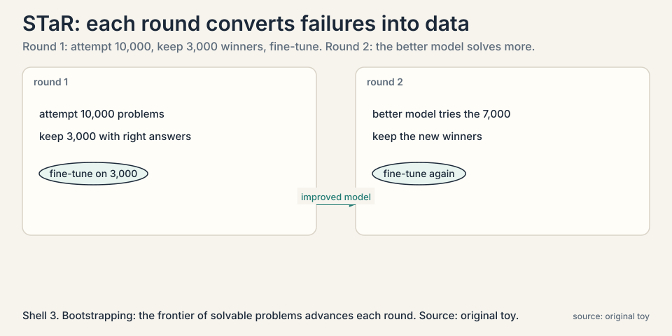
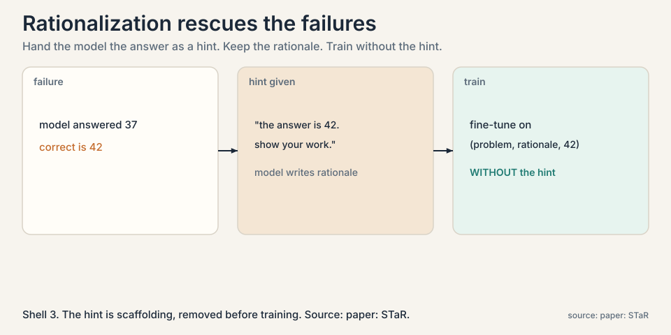
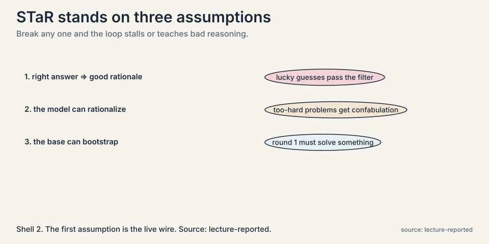
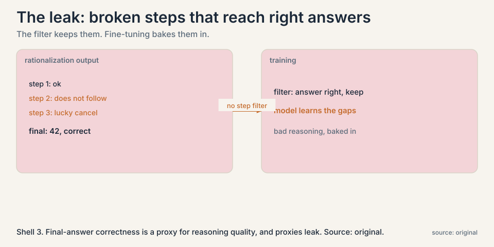
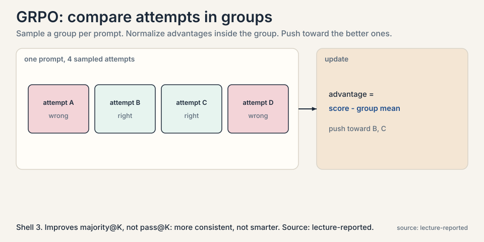

## The problem: nobody wrote down how to think

Lecture 2 found answers by sampling. But the model never
learned: every question paid the sampling bill again. To move
answers from the tail into the first try, the model must train
on reasoning itself. Here is the blocker: the internet has
almost no step-by-step reasoning traces at scale. Human
annotation is slow and expensive. Prompting with a few examples
underperforms training on large data. The data the loop needs
does not exist.

### Subchapter: the missing dataset

Think about what training needs: thousands of problems, each
with a worked solution, step by step. The internet has answers
without workings, textbooks with workings but at small scale,
and forums with workings of uneven quality. Nobody wrote down
how to think at the scale training needs. Human annotation
could fill the gap, but slowly and expensively, and the
lectures' whole bet is that the loop can manufacture its own
supervision instead.

## The key question

What if the model could manufacture its own reasoning data,
using known answers to sort its own attempts into good and bad?

## The loop, worked on a toy

**STaR** (Self-Taught Reasoner) is the answer. Start with two datasets. A small **prompt set**: a few problems
with human-written rationales, the worked examples. A large
**training set**: many problems with questions and correct
answers, but no rationales. Say 10,000 problems. The loop:

```ascii
round 1:
  few-shot prompt the model with the prompt set's rationales
  model attempts all 10,000 problems, writing rationales
  keep the 3,000 with correct answers  ->  new training data
  fine-tune the model on those 3,000

round 2:
  the better model attempts the 7,000 it missed
  keep the new winners, fine-tune again
  ...
```

Each round converts some failures into training data, and the
improved model converts more next round. That is the
**bootstrapping**: the model pulls itself up, with the correct
answers as the only outside supervision.



### Subchapter: why it is called off-policy RL

The lecture calls STaR a bare-bones off-policy RL: generate with
the current policy, keep what worked, train, repeat. Off-policy
means the learning step does not happen during generation.
The current policy generates attempts, a filter keeps winners,
and training updates the policy on that fixed dataset, like
learning from someone else's experience. Then the new policy
generates again. It is RL in the generate-filter-train loop
sense, without online gradient steps per attempt.

## The clever half: rationalization

Keeping winners handles the 3,000 the model could already solve.
What about the 7,000 it could not? Throwing them away wastes the
hardest problems, exactly the ones worth learning. STaR's second
move is **rationalization**: for a failed problem, give the model
the correct answer as a hint and ask it to produce the rationale.



### Subchapter: rationalization, step by step

```ascii
problem:   "A train travels... " (model answered 37, wrong)
hint:      "The correct answer is 42. Show your work."
model:     writes a rationale ending at 42
training:  fine-tune on (problem, rationale, 42) WITHOUT the hint
```

The hint is scaffolding, removed before training. The model
learns the problem as if it had solved it directly. This
expands the training set beyond what the model can solve alone,
into problems it can only solve with the answer in hand. Over
rounds, as the model improves, fewer hints are needed: the
frontier of solvable problems advances.

### Subchapter: why the hint works

The hint changes the task from search to construction. Finding
42 from scratch means searching the whole reasoning space.
Constructing a path to a known 42 means the endpoint is fixed
and the model only fills the middle. Construction is easier
than search, so problems beyond the model's solving reach fall
inside its rationalizing reach. The gap between the two is the
extra training data rationalization buys.

## The three assumptions, named

The lecture lists the assumptions STaR stands on, because each
is a place it can break:



1. **Correct answer implies good rationale.** Filtering keeps
   attempts that reached the right answer, assuming the
   reasoning was sound. A lucky guess with broken steps passes
   the filter and teaches broken reasoning.
2. **The model can rationalize from a hint.** Given the answer,
   the model must produce a valid path to it. If the problem is
   far beyond the model, the "rationale" is confabulation, and
   training on it teaches confabulation.
3. **The base model is strong enough to bootstrap.** Some
   fraction of problems must be solvable in round 1, or the
   loop never starts. The method cannot lift a model into a
   domain it cannot touch at all.

### Subchapter: assumption 1, the live wire

Assumption 1 is the live wire. Correct answers with wrong
reasoning are common: lucky guesses, flawed steps that cancel
out, proofs with gaps. The lecture stresses that final-answer
correctness is only a proxy for reasoning quality, and that
building step-level judges, process reward models, is the active
research direction aimed at this exact leak.

### Subchapter: assumption 2, the confabulation risk

If the problem is far beyond the model, the "rationale" is
confabulation: fluent steps that do not actually lead to the
answer. Training on confabulation teaches the model to sound
right while being wrong. The defense is the same as for
assumption 1: judge the steps, not just the ending. STaR
itself has no such judge.

### Subchapter: assumption 3, the foothold

STaR hill-climbs within reach of the base model. It does not
invent new capabilities from nothing. The iterative rounds
extend the reach, but the starting foothold must exist. The
practical consequence: pick the base model and the problem set
so round 1 solves a healthy fraction, or the loop never starts.

## Where it breaks, demonstrated

Assumption 1 is the live wire. The lecture's discussion
presses it: in step 3, rationalization, there is no filter on
the generated rationale's quality. A model handed the answer
42 can write steps that do not actually lead to 42, or lead
there by accident. Fine-tuning on those steps bakes the bad
reasoning into the weights. The lecture notes follow-up work
adding process-level filters, judging each step, but STaR
itself has none. Final-answer correctness is a proxy for
reasoning quality, and proxies leak.



And the lecture's candid admission: learning from negative
examples is not nailed. Failed attempts without successful
rationalization are discarded. The loop learns from what
worked and ignores the rest.

## The industrial version: DeepSeekMath and GRPO

The lecture presents DeepSeekMath as the same idea at
industrial scale. Generate many reasoning traces, verify
against known answers, and train with RL rather than plain
fine-tuning.

### Subchapter: DeepSeekMath, the data story

The lecture's emphasis is on the data, not just the algorithm.
DeepSeekMath continued pretraining a 7B coder model on 120
billion math-related tokens mined from Common Crawl. The
pipeline: seed from OpenWebMath, train a fastText classifier,
mine Common Crawl, iterate into new math domains. Two findings
the lecture highlights: curation beat prestige (training on
ArXiv hurt, code-then-math ordering helped), and the resulting
7B model scored 51.7% on the competition-level MATH benchmark
with no external toolkits and no voting, approaching
Gemini-Ultra and GPT-4. Self-consistency over 64 samples took
it to 60.9%. [uncertain: figures are from the lecture's
summary of the paper. verify against the paper before quoting.]

### Subchapter: GRPO, the mechanism

The algorithm named is **GRPO**, group-relative policy
optimization. The mechanism: sample a group of attempts per
prompt, compute each attempt's advantage relative to the
group's mean, and push the policy toward the better ones. No
separate value network, no per-token critic: the group is the
baseline.



The lecture's headline about GRPO is a careful one: it improves
majority@K, not pass@K. The model gets more consistent, not
fundamentally smarter. The same answers appear more often, so
voting works better, but the set of solvable problems barely
grows. Read that as the limit of the method: RL on verifiable
rewards sharpens what the model can do, it does not extend it
much.

### Subchapter: DAPO, the refinements

The lecture closes the RL section with **DAPO**, a set of
practical refinements. Dynamic sampling drops prompts that are
all-pass or all-fail, because they carry no gradient: every
attempt in the group gets the same reward, so the advantage is
zero and the update is noise. Asymmetric clipping treats good
and bad updates differently. The loss goes token-level instead
of sequence-level. And the monitoring advice: watch entropy and
response length, not loss. Falling entropy means the policy is
collapsing onto a few patterns. Growing response length without
growing scores means the model is padding, not reasoning. [uncertain:
DAPO details are from the lecture's summary. the lecture does not
name the paper.]

## Mapping back: what closing the loop buys

| Test-time-only failure | Train-time answer | How |
|---|---|---|
| Every question pays the sampling bill | Train on verified attempts | Winners become training data. Pass@1 rises, so fewer samples needed later. |
| No reasoning data on the internet | Generate it | The model's own attempts, filtered by correct answers, are the dataset. |
| Hard problems never solved, never learned | Rationalization | Hand the model the answer as a hint, keep the rationale, train without the hint. |
| One round, then stall | Iterate | Each round's better model solves more. The frontier advances. |

## The honest price

STaR assumes the answer key exists: it needs problems with
known correct answers, which means verifiable domains, math
and code, again. It assumes correct answers imply good
reasoning, which leaks. It learns nothing from failures it
cannot rationalize. And it can regress: the lecture's Q&A notes
that training on broken reasoning chains, overthinking traces
that loop without progress, can infect the model. The loop is
powerful and blind. What it cannot check, it cannot help but
absorb.

That blindness is the next chapter's subject. If the verifier
is the loop's judge, and the judge is learned, who judges the
judge?

## Go deeper

<div style="position:relative;padding-bottom:56.25%;height:0;overflow:hidden;max-width:100%;margin:16px 0;">
<iframe style="position:absolute;top:0;left:0;width:100%;height:100%;" src="https://www.youtube-nocookie.com/embed/YR9EztOF0R8" title="Noah Goodman on STaR: self-improvement, limits, and exploration" frameborder="0" allow="accelerometer; autoplay; clipboard-write; encrypted-media; gyroscope; picture-in-picture" allowfullscreen></iframe>
</div>

- Noah Goodman on STaR and self-taught reasoning: diminishing returns round after round, why exploration limits the loop, and what generalizes. https://www.youtube.com/watch?v=YR9EztOF0R8
- Zelikman et al., STaR (2022): the generate-filter-rationalize loop. https://arxiv.org/abs/2203.14465
- Shao et al., DeepSeekMath (2024): the data pipeline and GRPO at industrial scale. https://arxiv.org/abs/2402.03300

> [!QA]
> Q: What is STaR, in one paragraph?
> A: Self-Taught Reasoner. Start with a few human-written rationales and many problems with known answers but no rationales. Few-shot prompt the model to attempt all problems writing rationales. Keep the attempts with correct answers and fine-tune on them. For failures, give the model the correct answer as a hint, have it write the rationale, and fine-tune on those too, without the hint. Repeat. The model's own verified attempts become its reasoning training data.
> Follow-up: Why is it called off-policy RL?
> A: Because data generation and learning are decoupled. The current policy generates attempts, a filter keeps winners, and training updates the policy on that fixed dataset, like learning from someone else's experience. Then the new policy generates again. It is RL in the generate-filter-train loop sense, without online gradient steps per attempt.

> [!QA]
> Q: Walk me through one full STaR round with numbers.
> A: Start with 10,000 problems with known answers and a handful of human rationales. Few-shot prompt the model to attempt all 10,000, writing rationales. 3,000 reach correct answers: keep them as training data. For 2,000 of the failures, rationalization works: the model, given the answer, writes a usable rationale. Fine-tune on 5,000 examples total. The model improves. Round 2: it now solves 4,500 directly and rationalizes 2,500 more. Each round's frontier advances, until the remaining failures are beyond rationalizing reach and the loop plateaus.
> Follow-up: What does the plateau look like?
> A: Fewer new winners per round, and rationalizations that read well but do not hold up. The lecture's summary of the field: improvement tops out, because the model's intrinsic exploration is limited. Going beyond needs more aggressive exploration, which STaR does not provide.

> [!QA]
> Q: What is rationalization and why does it matter?
> A: Giving the model the correct answer as a hint and asking it to produce the reasoning that leads there, then training on the result as if the model solved it unaided. It matters because it rescues the hard problems: without it, training data is limited to what the model can already solve, and the loop can never reach beyond its current ability. With it, the frontier advances each round.
> Follow-up: What is the danger?
> A: Confabulated rationales. If the problem is too hard, the model writes steps that do not genuinely lead to the answer, and fine-tuning bakes that fake reasoning in. STaR has no filter on rationale quality beyond final-answer correctness. The lecture flags this as the method's weakest point and points to process-level judging as the fix.

> [!QA]
> Q: What are STaR's three assumptions?
> A: One, a correct final answer implies a good rationale, so filtering on answers filters for reasoning quality. Two, the model can generate a valid rationale when given the answer as a hint. Three, the base model is strong enough that some problems are solvable in round one, so bootstrapping starts. Break any one and the loop stalls or teaches bad reasoning.
> Follow-up: Which assumption fails most often in practice?
> A: The first. Correct answers with wrong reasoning are common: lucky guesses, flawed steps that cancel out, proofs with gaps. The lecture stresses that final-answer correctness is only a proxy for reasoning quality, and that building step-level judges, process reward models, is the active research direction aimed at this exact leak.

> [!QA]
> Q: Walk me through GRPO's update on one prompt.
> A: The model samples 4 attempts at a math problem. Two reach the right answer, two do not. GRPO computes each attempt's advantage as its reward minus the group mean: the right ones get positive advantage, the wrong ones negative. The policy update pushes probability toward the two winners and away from the two losers. No value network, no learned critic: the group mean is the baseline. Simple, stable, and the reason it scales.
> Follow-up: Why does it improve majority@K but not pass@K?
> A: Because it sharpens the distribution without widening it. The model produces its best answers more often, so voting over K samples works better. But problems the model could never solve stay unsolved: the update never shows the model anything outside its own samples. More consistent, not fundamentally smarter, in the lecture's phrase.

> [!QA]
> Q: What is DAPO's dynamic sampling, and why drop all-pass prompts?
> A: In GRPO, the advantage is reward minus group mean. If every attempt in the group passes, every advantage is zero: the update is pure noise. If every attempt fails, same thing. Dynamic sampling drops those prompts from the batch, spending the training budget only where the group disagrees. It is the train-time analog of Lecture 2's difficulty-adaptive sampling: spend compute where there is signal.
> Follow-up: Why watch entropy and response length instead of loss?
> A: Because loss can fall while the policy collapses. Falling entropy means the model is converging onto a few patterns: less diversity, less exploration. Growing response length with flat scores means padding, not reasoning. Both are early warnings that the RL is optimizing the metric instead of the capability.

> [!QA]
> Q: You want STaR for a new domain, say legal reasoning. What do you need first?
> A: An answer key. STaR needs problems with known correct answers at scale: thousands of legal questions with verified outcomes. Without them there is no filter and no rationalization hint. Then a base model strong enough to solve a healthy fraction in round 1. Then a step-level judge, because legal reasoning with a right conclusion and broken steps is exactly the leak: the model learns to sound like a lawyer while reasoning like a gambler. The domain needs verifiable outcomes before the loop can touch it.
> Follow-up: What is the rationalization risk in law specifically?
> A: Post-hoc justification. Given the verdict, the model writes a plausible-sounding legal argument that no court would accept: wrong precedents, invented distinctions. Training on it teaches confident fabrication. Legal STaR needs its rationales checked against real sources, not just the final answer.

## Recap: the whole lesson on one screen

1. **No reasoning data exists.** The internet has answers, not
   step-by-step traces. Human annotation is too slow.
2. **STaR manufactures it.** Attempt 10,000 problems, keep the
   3,000 with correct answers, fine-tune, repeat.
3. **Rationalization.** For failures, give the answer ("42")
   as a hint, keep the rationale, train without the hint.
   Construction is easier than search.
4. **Bootstrapping.** Each round's better model solves more.
   The solvable frontier advances, then plateaus.
5. **Three assumptions.** Correct answer implies good
   rationale. The model can rationalize. The base can start
   the climb. The first is the live wire.
6. **The leak.** No filter on rationale quality. Broken steps
   that reach right answers get baked into the weights.
7. **Industrial form.** DeepSeekMath: 120B curated math
   tokens, 51.7% on MATH at 7B, 60.9% with self-consistency.
   GRPO: group-relative advantages, majority@K not pass@K.
   DAPO: dynamic sampling, watch entropy and length.
8. **The honest price.** Needs answer keys. Learns nothing
   from un-rationalizable failures. Can absorb broken
   reasoning. Who judges the judge is next.

## Official sources and further reading

**Official:**
- CS329A Part 6: Train-Time Scaling and Scaling RL (Autumn
  2025): the lecture this chapter follows. [link](https://www.youtube.com/watch?v=yVnmHSAy3ck)
- Zelikman et al., "STaR: Bootstrapping Reasoning With
  Reasoning" (2022): the algorithm. [paper](https://arxiv.org/abs/2203.14465)
- Shao et al., "DeepSeekMath" (2024): the industrial-scale
  version with GRPO. https://arxiv.org/abs/2402.03300

**Further reading:**
- Zelikman et al. follow-ups on process filtering: judging
  rationale steps, not just final answers.

**Caveats from these sources.** The 10,000/3,000 numbers are
the lecture's representative illustration, not a reported
experiment. GRPO details are named, not derived, in the
lecture. The "learning from negatives not nailed" assessment
is the lecturers' summary of the field as of Autumn 2025.
DeepSeekMath figures are the lecture's summary. Verify
against the paper before quoting. DAPO details are
lecture-reported without a named paper.

## Connections to the other courses

- **CS329A L02:** the test-time half this chapter closes:
  sampling finds answers. STaR moves them into the weights.
- **CS329A L04:** the same keep-the-winners loop for code,
  with execution as the verifier instead of answer keys.
- **CS329A L09:** the leak this chapter leaves: judging
  reasoning steps, and the meta-verifier that judges judges.
- **CS336:** the training machinery underneath: fine-tuning
  and RL on language models.
