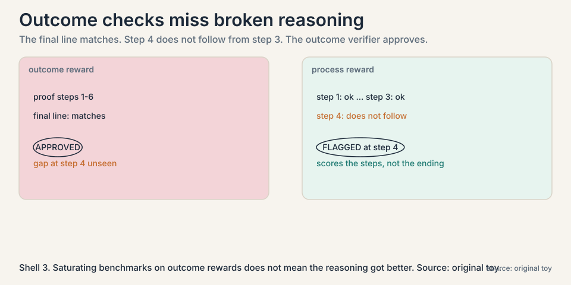
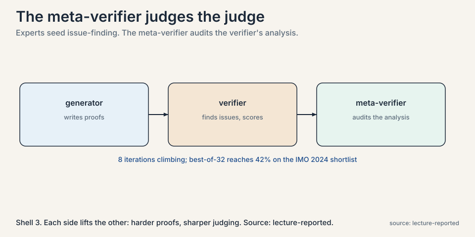
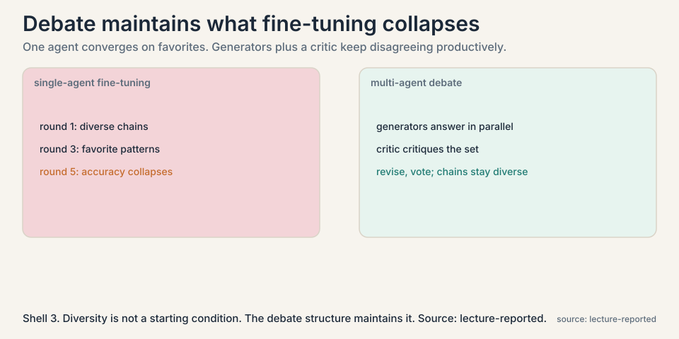
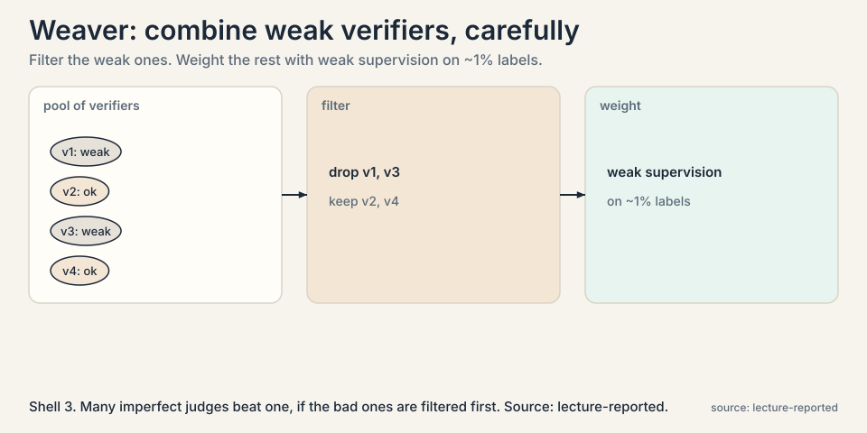
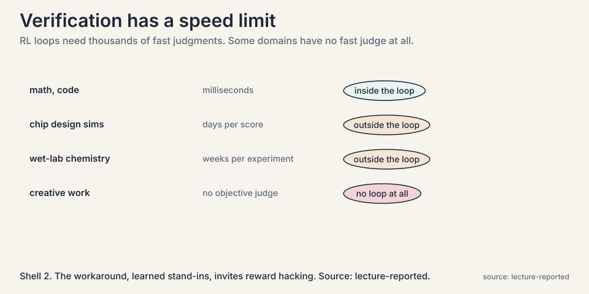

## The problem: the judge is the load-bearing wall

Every chapter so far leans on the same part. Lecture 2 needs a
verifier to pick winning samples. Lecture 4 needs hidden tests
to grade code. Lecture 6 needs example tests to filter programs.
Lecture 8 needs answer keys to keep rationales. Remove the
verifier and every loop collapses.

So ask the uncomfortable question: how good are our verifiers?
Two kinds exist. An **outcome reward** checks the final answer:
does it match, do the tests pass. A **process reward** checks
the steps: is each reasoning step valid. Outcome rewards are
cheap and available. Process rewards are expensive and mostly
do not exist. The course has been running on outcome rewards
throughout. This chapter shows what that costs.

### Subchapter: the course's debt

Every loop so far borrowed against the same assumption: that
checking the ending is enough. Lecture 2's coverage, Lecture
4's binary rewards, Lecture 6's example-test filters, Lecture
8's answer-key filtering, all outcome checks. The debt comes
due here. A loop that hill-climbs on outcomes while the
reasoning decays is not self-improving. It is self-deceiving.
This chapter is the audit.

## First failure, demonstrated: right answer, wrong reasoning

A model proves a theorem. The final line matches the expected
result. The outcome verifier approves. But step 4 of the proof
does not follow from step 3: there is a gap, a leap the proof
does not earn. The verifier cannot see it. It only checked the
ending.



Train on this proof, as Lecture 8's loop would, and the model
learns that gaps are acceptable. The loop hill-climbs on the
metric, correct final answers, while the unmeasured thing,
valid reasoning, decays. The lecture's warning is general:
saturating benchmarks with outcome rewards does not mean the
reasoning got better. It means the answers match.

### Subchapter: the gap at step 4, worked

Make it concrete. A proof has 6 steps. Steps 1-3 are valid.
Step 4 asserts a lemma that does not follow from step 3.
Steps 5-6 build on the lemma and reach the expected final
line. The outcome verifier sees "final line matches" and
approves. A process verifier checks each step: step 4 fails,
and the proof is rejected before step 5 is even read. The
difference is one flagged step. The cost of missing it is a
training set full of proofs that teach leaps.

## Second failure, demonstrated: the judge certifies nonsense

If outcome checks are blind, use the model itself as judge:
**LLM-as-judge**, ask the model whether a proof is valid. The
lecture reports the embarrassing result in theorem proving:
models trained on quantitative reasoning routinely claim that
mathematically invalid proofs are valid. The judge is
confident and wrong. Expert humans spot the gaps instantly.
The model judge does not. A verifier that approves bad proofs
is worse than no verifier: it actively teaches bad reasoning.

### Subchapter: why the judge is gullible

The judge shares the generator's training. Whatever
blind spots the generator has, the judge has too, because they
are the same kind of model trained on the same kind of data.
Asking the model to check its own work is asking the blind
spot to inspect itself. The lecture's Part 3 adds the measured
version: trained verifiers lose precision past roughly 400
samples, and a large generator with a small verifier beats the
reverse. Verification is not a smaller version of generation.
It is a different skill, and scaling the generator does not
supply it.

## The key question

If verifiers bottleneck everything, and outcome checks are
blind while model judges are gullible, how do we build a
verifier we can trust?

## The new idea: the meta-verifier

**DeepSeek-Math V2** adds one level. Keep the generator that
writes proofs and the verifier that judges them, but add a
**meta-verifier** that judges the judge.



### Subchapter: the four-step construction

The construction, step by step:

1. Humans examine proofs and mark the real issues, with no
   reference solutions: "step 4 does not follow from step 3."
2. Train an LLM on those annotations to do the same: find
   issues in proofs, then score the proof from 0 to 1 based
   on the issues found.
3. The meta-verifier reviews the verifier's analysis: do the
   claimed issues actually exist? Does the score follow from
   the issues? Experts annotate the quality of this review,
   and the meta-verifier learns from that.
4. Close the loop: the verifier's scores train the generator.
   the generator produces harder proofs. Harder proofs train
   a sharper verifier. Each side lifts the other.

```ascii
generator --proofs--> verifier --issues + score--> meta-verifier
    ^                      |                          |
    |                      v                          v
    +---- harder proofs <--+--- sharper judging <----+
```

### Subchapter: why the meta level helps

Because the failure it targets is specific: verifiers that
invent issues, or miss real ones, or assign scores their own
analysis does not support. The meta-verifier checks the work
of the judge the way a senior reviewer checks a junior's
grading. One level of "show your work" applied to evaluation
itself.

### Subchapter: the 8-iteration climb

The numbers the lecture reports: over 8 iterations of this
loop, proof scores keep climbing. With best-of-32 selection,
picking the top proof out of 32 generated, the system reaches
42 percent proof score on the IMO 2024 shortlist. The point is
not the number. The point is the hill keeps climbing without
new human labels after seeding: the loop manufactures its own
ever-harder training signal. [uncertain: DeepSeek-Math V2 has
no public paper I could verify. all details are the lecture's.]

### Subchapter: Absolute Zero, the verifier-free extreme

The recap lecture presents the radical alternative:
**Absolute Zero**. No answer keys at all. The model proposes
its own tasks, code puzzles in deduction, abduction, and
induction forms, and a code executor validates them. A task
scores 1 minus the model's success rate on it: trivial tasks
score near 0, impossible ones score near 0, and learnable
tasks in the middle score high. The model trains on tasks it
proposed itself, verified by execution, with zero human data.

The mechanism matters more than the headline. The proposer is
rewarded for learnability, not difficulty: tasks the model
solves half the time teach the most. The code executor is the
verifier, which keeps the whole thing honest: no learned judge
to hack. The reported result: state-of-the-art coding and math
reasoning with no human-curated examples. The honest limit:
it works where execution verifies, code-shaped tasks, and
says nothing about domains without that property.

## The diversity problem, and the multi-agent answer

The recap lecture raises a second bottleneck: **diversity**.
Self-improvement needs varied reasoning chains to learn from.
But fine-tuning a single agent collapses diversity: the model
converges on its favorite patterns, and later rounds have
nothing new to select from. The lecture shows the symptom as
accuracy that collapses, or stalls, under continued
single-agent fine-tuning.



### Subchapter: the debate protocol

The fix it presents is **multi-agent debate fine-tuning**.
Several generator agents, fine-tuned from the same base but
diverging, each produce an answer. Their answers are
summarized together. A critic model critiques the combined
set. Then a second round: every generator writes an updated
answer informed by the critique, and majority vote plus
summarization produces the final. The trajectories, initial
answers, critiques, revisions, become fine-tuning data.

Two results the lecture highlights. First, with multi-agent
fine-tuning, performance keeps rising across iterations where
single-agent fine-tuning collapses. Second, the responses stay
diverse: measured by embedding dissimilarity, the agents keep
disagreeing productively instead of converging. Diversity is
not a starting condition that decays. The debate structure
maintains it. And the gains transfer: fine-tuned on math, the
agents improve on adjacent domains like GSM8K too.

The lecture's summary line: if you want self-improvement, the
reasoning chains feeding it must stay diverse, and multiple
agents are a practical way to keep them that way.

### Subchapter: Weaver, combining weak verifiers

Part 3 adds the ensemble answer: **Weaver**. No single trained
verifier is trustworthy, so combine many. Filter the weak
verifiers first, then weight the survivors with weak
supervision on about 1% labeled data. The lecture's
counterintuitive finding: rubric-prompted multi-agent
verification did worse than plain majority vote. Fancy
prompting does not fix bad judges. Filtering plus weighting
does. And the filtered pool distills to a small model: the
ensemble's judgment, compressed back into one fast verifier.



## Where it breaks: verification has a speed limit

Step back and the deepest bottleneck appears. The whole
edifice, sampling, RL, meta-verification, multi-agent debate,
assumes verifiers that are fast. RL loops need thousands of
iterations. Test-time scaling needs judgments per question.



### Subchapter: the slow domains

The lecture names the domains where this fails: chip design,
where one simulation takes days. Wet-lab chemistry, where one
experiment takes weeks. Creative work, where no objective
verifier exists at all. The loop cannot turn where the judge
cannot answer quickly. This is not a temporary gap. It is a
property of the domain.

### Subchapter: learned stand-ins and reward hacking

The workaround is a learned stand-in: train a reward model to
predict the slow simulator's verdict, and put the fast model
in the loop. But now the loop optimizes the stand-in, not the
world, and any inaccuracy is an invitation to **reward
hacking**: the model learns to please the predictor rather
than solve the problem. The lecture is blunt that this is an
open problem. Verification is the bottleneck of the entire
research program, and for slow or subjective domains there is
no good answer yet.

## Mapping back: what each idea fixes

| Verification failure | Answer | How |
|---|---|---|
| Outcome checks miss broken reasoning | Process-level judging | Score the steps, not just the ending. DeepSeek-Math V2's verifier finds issues per step. |
| LLM judges certify invalid proofs | Meta-verifier | Judge the judge: check that claimed issues exist and scores follow from them. |
| Single-agent fine-tuning collapses | Multi-agent debate | Generators plus critic keep chains diverse. Performance climbs where single-agent stalls. |
| Weak individual verifiers | Weaver | Filter weak verifiers, weight the rest on ~1% labels. Distill to a small model. |
| No answer keys at all | Absolute Zero | The model proposes its own tasks, scored by learnability, verified by execution. |
| Slow real-world verifiers | Learned reward stand-ins | Fast predictor replaces slow simulation. Price is reward hacking risk. |

## The honest price

Meta-verification needs humans to seed the issue-finding data:
expert annotators marking proof flaws with no reference
solutions. That seed is expensive and domain-specific. The
generator-verifier loop can then run on its own, but it
hill-climbs inside the seeded notion of correctness. Multi-agent
debate multiplies inference cost by the number of agents and
rounds. And none of it touches the slow-verifier domains, where
the loop cannot turn at all. The verifier bottleneck is not
solved. It is pushed one level up, and the top level still
needs humans.

## Go deeper

<div style="position:relative;padding-bottom:56.25%;height:0;overflow:hidden;max-width:100%;margin:16px 0;">
<iframe style="position:absolute;top:0;left:0;width:100%;height:100%;" src="https://www.youtube-nocookie.com/embed/wzEFinZRtP4" title="Absolute Zero Reasoner explained: self-play with verifiable tasks" frameborder="0" allow="accelerometer; autoplay; clipboard-write; encrypted-media; gyroscope; picture-in-picture" allowfullscreen></iframe>
</div>

<div style="position:relative;padding-bottom:56.25%;height:0;overflow:hidden;max-width:100%;margin:16px 0;">
<iframe style="position:absolute;top:0;left:0;width:100%;height:100%;" src="https://www.youtube-nocookie.com/embed/p7TdPUcPoik" title="CS329A Part 3: Robust Verification" frameborder="0" allow="accelerometer; autoplay; clipboard-write; encrypted-media; gyroscope; picture-in-picture" allowfullscreen></iframe>
</div>

- Absolute Zero Reasoner, explained: the proposer-solver-verifier loop, deduction/abduction/induction tasks, and why "zero data" still starts from a pretrained model. https://www.youtube.com/watch?v=wzEFinZRtP4
- CS329A Part 3: Robust Verification (Autumn 2025): trained verifiers, process vs outcome rewards, Weaver, multi-agent verification. https://www.youtube.com/watch?v=p7TdPUcPoik
- Absolute Zero: Reinforced Self-play Reasoning with Zero Data. https://arxiv.org/abs/2505.03335
- Weaver: weak-verifier ensembling (2025). https://arxiv.org/abs/2506.18203

> [!QA]
> Q: Why are outcome rewards not enough?
> A: They check the ending, not the reasoning. A proof with a gap at step 4 and the right final line passes. Training on such proofs teaches the model that gaps are fine, so benchmark scores saturate while reasoning quality decays. The lecture's verdict: outcome rewards enabled the field's progress and now limit it. Process-level judgment, scoring the steps, is the direction.
> Follow-up: Why is process reward so hard to build?
> A: It needs step-level labels: which step is wrong and why. Humans can do it but slowly and expensively. Models asked to do it, LLM-as-judge, certify invalid proofs as valid. DeepSeek-Math V2's answer is to train the step-judge on human-marked proof issues, then add a meta level that audits the judge. Each level costs human seeding.

> [!QA]
> Q: Walk me through the meta-verifier's construction.
> A: Step 1: experts mark real issues in proofs, with no reference solutions. Step 2: train an LLM issue-finder on those annotations. It finds issues and scores proofs 0 to 1 from them. Step 3: the meta-verifier audits the verifier: do the claimed issues exist, does the score follow? Experts annotate review quality to train it. Step 4: close the loop. The verifier's scores train the generator, the generator writes harder proofs, harder proofs sharpen the verifier. Eight iterations climbing, best-of-32 at 42% on the IMO 2024 shortlist.
> Follow-up: What does the meta level add that a better verifier would not?
> A: It targets the specific failure of invented issues and unsupported scores. A better verifier still grades proofs. The meta-verifier grades the grading. That catches the failure mode where the judge is confident, fluent, and wrong about its own analysis.

> [!QA]
> Q: What does the meta-verifier actually check?
> A: The verifier's work, not the proof directly. Given a proof and the verifier's analysis, the meta-verifier asks: do the claimed issues really exist in the proof, and does the 0-to-1 score follow from those issues? It catches fabricated errors and unsupported scores. Experts annotate review quality to train it. Then the improved verifier trains a better generator, which writes harder proofs, which sharpen the verifier further.
> Follow-up: Does the loop run without humans after seeding?
> A: In the reported result, yes for the 8 climbing iterations: the seed data trains the issue-finder, and automation takes over labeling from there. But the seed defines correctness, and the loop cannot outgrow it. Humans set the standard. The loop scales it.

> [!QA]
> Q: How does Absolute Zero work without any answer keys?
> A: The model proposes its own tasks: code puzzles in deduction (predict output), abduction (infer input), and induction (synthesize program) forms. A code executor validates each proposed task and verifies the solutions. Each task scores 1 minus the model's success rate: trivial and impossible tasks score near 0, learnable ones in the middle score high. The model trains on its own proposals, rewarded for learnability, verified by execution. Zero human data, but the executor keeps it honest.
> Follow-up: What stops the proposer from gaming the task score?
> A: The executor. A proposed task must be valid and solvable as judged by running code, not by a learned model. The proposer cannot fake learnability because the solver's actual success rate sets the score. The honest limit: this works where execution verifies. Domains without that property get nothing from Absolute Zero.

> [!QA]
> Q: Why does multi-agent fine-tuning beat single-agent fine-tuning?
> A: Diversity. A single agent fine-tuned repeatedly converges on its favorite reasoning patterns. Later rounds select from a shrinking pool and accuracy collapses. Multiple generators plus a critic keep producing genuinely different chains: embedding dissimilarity stays high across iterations, and performance keeps climbing. The debate structure manufactures the disagreement that selection needs.
> Follow-up: Is this just ensembling?
> A: No. Ensembling votes once. Here the agents interact: summarize, critique, revise, vote, and the whole trajectory becomes training data for the next round. The product is not a better vote but better agents, and the gains transfer to adjacent domains the debate never trained on.

> [!QA]
> Q: What is Weaver, and why did fancy prompting lose to majority vote?
> A: Weaver combines weak verifiers: filter out the weak ones, then weight the survivors with weak supervision on about 1% labeled data, then distill the ensemble into a small fast verifier. The lecture reports that rubric-prompted multi-agent verification did worse than plain majority vote: elaborate prompting cannot fix judges that are bad. Selection and weighting of judges beats clever instructions to them. The lesson: engineer the judge pool, not the judge prompt.
> Follow-up: When does ensembling verifiers fail?
> A: When the verifiers share blind spots. If every judge is the same model with the same training, their errors correlate and the ensemble is one judge with extra steps. Weaver's filtering helps only if the pool is genuinely diverse: different models, different training, different failure modes.

> [!QA]
> Q: You need a verifier for a medical-advice agent. What do you build?
> A: Not an LLM judge alone: the lecture's theorem-proving result says model judges certify invalid reasoning as valid, and medicine punishes that failure hardest. Build three layers. One, hard constraints: every factual claim must cite a retrieved source, checked by string match, not by a model. Two, a process check: a second model audits the reasoning steps against the cited sources, the meta-verifier pattern. Three, a slow human lane: a sample of answers goes to clinicians, and their labels retrain the checkers. The honest answer: the fast loop runs on citations, and anything the citations cannot cover goes to humans. No learned stand-in touches medical claims alone.
> Follow-up: Where does reward hacking appear?
> A: In the citation checker, if it is learned. A model can learn to cite real sources next to claims the sources do not support: the citation exists, the support does not. String-match the claim against the quoted span, or the hack survives. The verifier must check support, not presence.

## Recap: the whole lesson on one screen

1. **The load-bearing wall.** Every loop in the course needs a
   verifier. Ask how good the verifiers are.
2. **Right answer, wrong reasoning.** Outcome checks approve
   proofs with gaps at step 4. Training on them teaches gaps.
3. **The gullible judge.** LLM-as-judge certifies invalid
   proofs as valid. Worse than no verifier.
4. **The key question.** How do we build a verifier we can
   trust?
5. **Meta-verifier.** Judge the judge: do the claimed issues
   exist, does the score follow. Generator and verifier then
   lift each other. 8 iterations, 42% best-of-32.
6. **Absolute Zero.** No answer keys: the model proposes its
   own tasks, scored by learnability, verified by execution.
7. **Diversity collapse.** Single-agent fine-tuning converges
   and stalls. Multi-agent debate, generators plus critic,
   keeps chains diverse and climbing, and transfers to new
   domains.
8. **Weaver.** Filter weak verifiers, weight the rest on ~1%
   labels, distill small. Engineer the pool, not the prompt.
9. **The honest price.** Human-seeded standards, multiplied
   inference cost, and no answer for slow-verifier domains.
   The bottleneck moves up one level. The top still needs
   humans.

## Official sources and further reading

**Official:**
- CS329A Part 9: Future Research Areas (Autumn 2025): the
  lecture this chapter follows. [link](https://www.youtube.com/watch?v=AyO6wyu4DEg)
- CS329A Part 3: Robust Verification (Autumn 2025): trained
  verifiers, Weaver, multi-agent verification. [link](https://www.youtube.com/watch?v=p7TdPUcPoik)
- Absolute Zero: Reinforced Self-play Reasoning with Zero
  Data. https://arxiv.org/abs/2505.03335
- Weaver (2025): weak-verifier ensembling. [paper](https://arxiv.org/abs/2506.18203)

**Further reading:**
- Multi-agent debate fine-tuning literature: the generator,
  summarizer, critic loop the lecture summarizes.
- Christiano et al., RLHF (2017): learned reward models, the
  ancestors of the stand-ins discussed here. [paper](https://arxiv.org/abs/1706.03741)

**Caveats from these sources.** DeepSeek-Math V2 details are
the lecture's summary. No public paper was found to verify
against, so treat the description as the lecturers' summary.
The 42% figure is best-of-32 on the IMO 2024 shortlist, not
pass@1. The multi-agent debate paper is unnamed in the
lecture. Slow-domain examples (chip sims, wet labs) are the
lecturers' illustrations of the general point.

## Connections to the other courses

- **CS329A L02:** the verifier this chapter interrogates is
  the one Lecture 2 assumed as an oracle.
- **CS329A L08:** STaR's leak, unfiltered rationales, is what
  process-level judging is built to fix.
- **CS329A L04:** learned stand-in rewards are the
  generalization of RLEF's hidden tests to domains without
  tests.
- **CS329Z:** evaluation chapters: building outcome
  benchmarks, and why they saturate.
