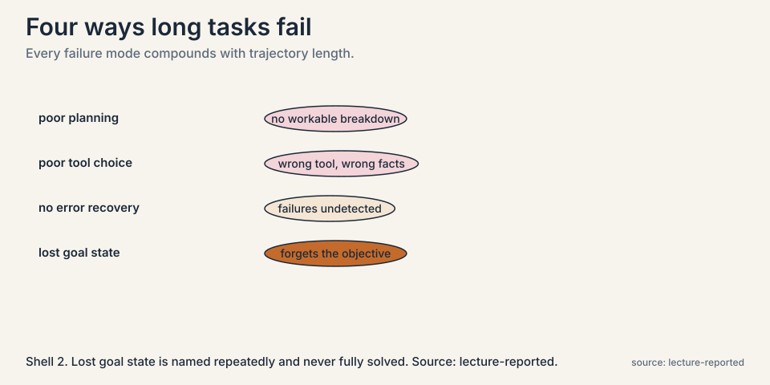
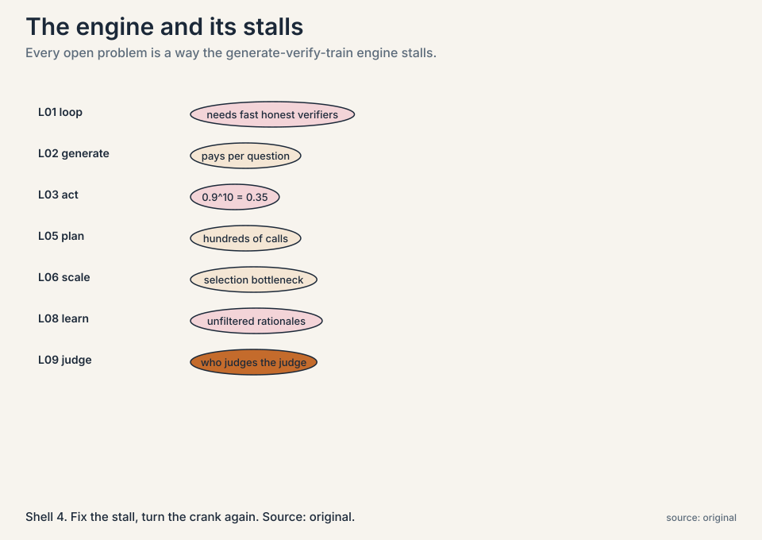
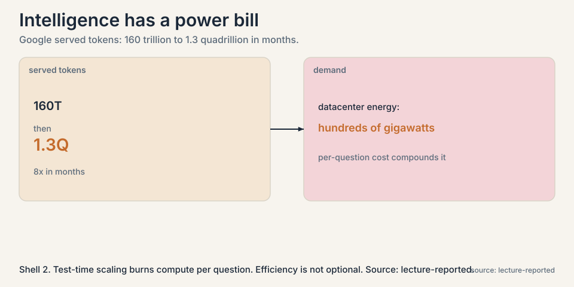

## The problem: benchmarks say "better", users say "unreliable"

Every method in this course reports wins: higher coverage,
better pass rates, climbing proof scores. But ask anyone who
has delegated a real afternoon of work to an agent, and the
report is different: it sometimes works, sometimes wanders,
sometimes confidently finishes the wrong task. Benchmark
scores and lived reliability disagree. This chapter is about
measuring what actually matters: how long a task an agent can
complete, and how reliably.

### Subchapter: agentic evals versus QA benchmarks

An **agentic evaluation** differs from a question-answering
benchmark in one way: the task takes time. Not seconds, but
minutes to hours of skilled human work: debugging a real
repository, reproducing a machine learning result, planning
under constraints. The unit of difficulty is the **time
horizon**: how long the task would take a skilled human.

QA benchmarks measure knowledge. Agentic evals measure what
the model can *do* with that knowledge over time: plan, act,
recover, persist. A model can ace a QA benchmark about
debugging and still fail to debug a real repository, because
the repository task needs an hour of sustained, error-prone
work and the benchmark needs one right answer.

## The measurement, worked concretely

The METR methodology the lecture presents works like this.
Take a battery of tasks spanning seconds to many hours. For
each task, have skilled professionals, roughly five years of
experience, record how long successful completion takes, and
take the geometric mean as the task's difficulty rating. Then
run models on the tasks and record the success rate at each
horizon.

 to 59 minutes (2025): six years, eleven doublings. Shell 2. Source: lecture-reported (METR). Project: Stanford Frontier AI.")

### Subchapter: the methodology, deep

Three choices make the metric work. First, the geometric mean
of expert times, not the arithmetic mean: task times are
log-normally distributed, and the geometric mean is the right
center for a multiplicative scale. Second, experts with about
five years of experience: skilled enough that their times
reflect the task, not their learning curve. Third, success
rate at each horizon, not average score: the metric asks "can
it finish", not "how close did it get".

### Subchapter: the trend, worked

The headline numbers, read off the lecture's trend line:

```ascii
model (year)          task horizon at 50% success
GPT-2 (2019)          2 seconds
GPT-4 (2023)          8 minutes
Claude 3.7 (2025)     59 minutes
```

From 2 seconds to 59 minutes in six years. The doubling time
is about 7 months: every 7 months, the task length the model
handles half the time doubles. Six years is 72 months, about
10 doubling periods, and 2 seconds doubled 10 times is 2,048
seconds, 34 minutes, in the right ballpark of the measured 59.
That is the capability trend, and it is steep.

### Subchapter: the 80 percent gap

Now the number that matters for deployment. Redo the
measurement at 80 percent success instead of 50:

. Project: Stanford Frontier AI.")

```ascii
Claude 3.7 (2025):    59 minutes at 50% success
                      ~15 minutes at 80% success
```

An intern who completes hour-long tasks half the time, and
15-minute tasks most of the time. The lecture's gloss: there
is always uncertainty. Capability at 50 percent is years
ahead of reliability at 80 percent. The gap between the two
curves is the headroom the field has not closed, and it is
large.

### Subchapter: the methodology's weak point

The lecture is also honest about the methodology's weak
point. Experts underestimate task difficulty: people fluent
in a field are conditioned to what success looks like, and
their times do not reflect how hard the task feels to a
model. Human difficulty and model difficulty are different
rulers. A task that takes an expert 10 minutes because she
knows exactly where to look can take a model an hour of
fumbling. The horizon numbers are in human-minutes, and the
translation to model-minutes is lossy.

## Where agents fail: the failure modes

The lecture walks through a failure-mode analysis comparing
a non-reasoning model (GPT-4) with a reasoning model (o1).



### Subchapter: poor planning

The model does not break the task into steps, or breaks it
wrongly. It acts before it has a plan, or plans at the wrong
granularity. Read against Lecture 5: this is what tree search
addresses, by comparing plans before committing.

### Subchapter: poor tool choice

Wrong tool, or right tool with a bad query. The trajectory
grounds itself in the wrong facts. Read against Lecture 3:
grounding in the wrong place is worse than no grounding,
because the trace builds confidently on it.

### Subchapter: no error recovery

Something goes wrong mid-task, as it always does in an
hour-long task, and the agent cannot detect it or replan. It
repeats the failing behavior. This is the compounding-error
arithmetic of Lecture 3, now measured: 0.9^n with n in the
dozens.

### Subchapter: lost goal state

Over a long horizon the agent forgets what it is optimizing:
no memory of the final goal, no sense of progress. It
optimizes a subtask as if it were the task. The honest
scorecard: planning gets LATS, tool choice gets grounding,
error recovery gets reflection and retries. Lost goal state
is named repeatedly and never fully solved. Memory structures
for agents remain an open research area.

### Subchapter: what drove the gains anyway

The lecture notes what has been driving the gains anyway:
better reasoning, better code generation, tool use, less
repetitive behavior, and crucially, **context engineering**,
structuring what the agent sees across steps so the tools
work better. Reliability engineering around the model, not
just the model, moves the curves. The model gets the
headlines. The harness gets the reliability.

### Subchapter: GDPval and DeepScholar-Bench

Two more evals from the lecture, each probing a different
weakness. **GDPval** measures win rate against experts with a
decade of experience on real professional tasks. The top
failure: instruction following. Under-specified prompts fall
apart: the agent does something reasonable that is not what
was wanted. The lesson: on expert tasks, the binding
constraint is often the prompt, not the model.

**DeepScholar-Bench** tests research synthesis: no system
scores above 19%. The failure pattern: foundational sources
missed, fluency high, verifiability low. The models write
beautiful literature reviews that cite the wrong papers or
misstate what they say. Fluency and verifiability trade off,
and current systems sit on the wrong end. Read it as the
measurement of Lecture 7's problem: the agents do not know
what they do not know, and they write smoothly past the gaps.

## The key question

If capability doubles every 7 months but reliability lags
years behind, what are the actual open problems?

## The road ahead, from the recap lecture

The course's closing lecture names the frontier explicitly.
Each item is a research problem, not a solved one.



### Subchapter: diversity of reasoning chains

Self-improvement feeds on varied attempts. Keeping them
diverse, across rounds of training, is unsolved. Multi-agent
debate is a start. The deeper problem: every training method
in the course is a filter, and filters converge. The loop
eats its own diversity unless something actively maintains it.

### Subchapter: breaking the verifier bottleneck

Everything needs fast, honest judges. Outcome checks are blind,
model judges are gullible, and slow domains have no judges at
all. Better verifiers improve everything downstream. The
lecturers' framing points here as the highest-impact open
problem: every loop consumes verifier judgments, so a
breakthrough in fast, trustworthy, process-level verification
speeds up all of them at once.

### Subchapter: data selection and curriculum

Only so much can be curated by humans. Which problems go into
the loop, in which order, a **curriculum**, matters enormously
and is barely studied. DAPO's dynamic sampling is a first
step: drop the prompts with no signal. But the full question,
what sequence of problems teaches fastest, is open. The
lectures treat it as the most underrated lever.

### Subchapter: non-verifiable domains

Creative writing, open-ended design, science with slow
experiments. The loop does not reach them today. Learned
reward stand-ins invite hacking. Absolute Zero shows the
pattern for escaping: find an executable verifier, even a
narrow one, and the loop can turn. The open question is how
far that pattern stretches.

### Subchapter: the cost of intelligence

Test-time scaling burns compute per question. Demand is
exploding: the lecture cites Google's served tokens jumping
from 160 trillion to 1.3 quadrillion in months, and
data-center energy demand in the hundreds of gigawatts.
Efficiency is not optional.



The recap adds the efficiency counterpoint: **intelligence
per watt**. Local models at or under 20B parameters now cover
most real chat queries. Not every question needs the
frontier. The open problem is routing: knowing which
questions earn the big model and which the small one answers
fine. The cost curve and the capability curve are racing, and
routing is where they meet.

And the through-line the lecturers keep returning to: the
self-improvement loop, generate, verify, train, is the
engine. Every open problem is a way the engine stalls.
Fix the stall, turn the crank again.

## Mapping back: the whole course in one table

| Chapter | Engine part | Core result | Honest price |
|---|---|---|---|
| L01 | The loop | Generate, verify, train | Needs fast honest verifiers |
| L02 | Generate | Log-linear coverage. Small beats big | Pays per question. Needs the check |
| L03 | Act | ReAct grounds thought in tools | Errors compound: 0.9^10 = 0.35 |
| L04 | Train on doing | RLEF: execution feedback to RL | Sparse binary signal. Tests required |
| L05 | Plan | LATS: tree search over plans | Hundreds of calls. Judge can mislead |
| L06 | Scale | AlphaCode: 10@k. Learned selectors | Selection bottleneck. Diversity engineered |
| L07 | Know | Agentic search fills gaps mid-thought | Trigger heuristics. Context budget |
| L08 | Learn | STaR: bootstrap reasoning from answers | Unfiltered rationales. Needs answer keys |
| L09 | Judge | Meta-verifier. Multi-agent debate | Human-seeded. Slow domains excluded |
| L10 | Measure | 7-month doubling. Reliability lags | 50% is not deployable |

## The honest price, final

The course's own measurement says the field is far from done.
An agent that handles hour-long tasks half the time is a
research result, not a coworker. The reliability gap, the
verifier bottleneck, and the cost curve are the three walls.
The doubling trend says the walls are moving. Nothing in the
lectures says they fall on their own.

## Go deeper

<div style="position:relative;padding-bottom:56.25%;height:0;overflow:hidden;max-width:100%;margin:16px 0;">
<iframe style="position:absolute;top:0;left:0;width:100%;height:100%;" src="https://www.youtube-nocookie.com/embed/jXtk68Kzmms" title="Beth Barnes (METR): the most important graph in AI right now" frameborder="0" allow="accelerometer; autoplay; clipboard-write; encrypted-media; gyroscope; picture-in-picture" allowfullscreen></iframe>
</div>

<div style="position:relative;padding-bottom:56.25%;height:0;overflow:hidden;max-width:100%;margin:16px 0;">
<iframe style="position:absolute;top:0;left:0;width:100%;height:100%;" src="https://www.youtube-nocookie.com/embed/AyO6wyu4DEg" title="CS329A Part 9: Future Research Areas" frameborder="0" allow="accelerometer; autoplay; clipboard-write; encrypted-media; gyroscope; picture-in-picture" allowfullscreen></iframe>
</div>

- Beth Barnes (METR) on the time-horizon graph: why the 50% horizon doubles every 7 months, and what the trend does and does not say. https://www.youtube.com/watch?v=jXtk68Kzmms
- CS329A Part 9: Future Research Areas (Autumn 2025): the recap lecture's open problems. https://www.youtube.com/watch?v=AyO6wyu4DEg
- Kwa et al., Measuring AI Ability to Complete Long Tasks (METR, 2025): the methodology and the doubling trend. https://metr.org/blog/2025-03-19-measuring-ai-ability-to-complete-long-tasks/

> [!QA]
> Q: What is the METR time-horizon result?
> A: The task length a model completes 50 percent of the time doubles roughly every 7 months: GPT-2 in 2019 managed 2 seconds, GPT-4 in 2023 managed 8 minutes, Claude 3.7 Sonnet in 2025 manages 59 minutes. Task difficulty is rated by the geometric mean of skilled professionals' completion times. It is a capability trend, not a reliability claim.
> Follow-up: Why is not 50 percent enough?
> A: Because deployment needs reliability. At 80 percent success, Claude 3.7's horizon drops from 59 minutes to about 15. The gap between the 50-percent curve and the 80-percent curve is years of headroom. An agent that finishes half its hour-long tasks is a demo. One that finishes 80 percent of 15-minute tasks is a tool. The field has the first, not the second.

> [!QA]
> Q: Walk me through the METR methodology.
> A: Assemble tasks spanning seconds to many hours: debugging repos, reproducing ML results, constrained planning. For each, record completion times from professionals with about five years of experience and take the geometric mean as the difficulty rating. Run models on the battery and record success rate at each horizon. Read off the horizon where success hits 50%: that is the headline number. The geometric mean matters because task times are log-normal: the arithmetic mean would be dominated by the longest tasks.
> Follow-up: What is the biggest threat to the metric's validity?
> A: The human-to-model difficulty translation. Experts underestimate difficulty because fluency looks like ease, and tasks that are easy for experts (knowing where to look) can be hard for models (fumbling through search). The horizons are in human-minutes. The model-minutes equivalent is unknown and probably larger.

> [!QA]
> Q: What are the main failure modes of long-horizon agents?
> A: Four, from the lecture's analysis. Poor planning: the task is not broken into workable steps. Poor tool choice: wrong tool or bad query grounds the trace in wrong facts. No error recovery: mid-task failures go undetected and un-replanned. Lost goal state: over long horizons the agent forgets the objective and optimizes a subtask. Every one of them compounds with trajectory length.
> Follow-up: Which of these did the course's methods address?
> A: Planning: LATS tree search. Tool choice: ReAct grounding, plus learned selectors in AlphaCode 2. Error recovery: reflection in LATS, retry loops in RLEF. Lost goal state: named repeatedly, never fully solved. Memory structures for agents remain an open research area. The honest scorecard is three partials and one open.

> [!QA]
> Q: What do GDPval and DeepScholar-Bench add?
> A: Different weaknesses. GDPval pits agents against decade-experience experts on professional tasks: the top failure is instruction following, and under-specified prompts fall apart. The binding constraint is the prompt, not the model. DeepScholar-Bench tests research synthesis: no system breaks 19%, foundational sources get missed, and fluency trades off against verifiability. Together they say: agents fail at doing what was asked and at knowing what they do not know.
> Follow-up: Why does fluency trade off against verifiability?
> A: Because the training rewards fluent, confident text, and hedging or checking breaks the flow the reward prefers. A model that writes "the evidence is mixed" gets less reward than one that writes a crisp, wrong claim. Until verification is in the reward, fluency wins and verifiability loses.

> [!QA]
> Q: What are the open problems the course leaves?
> A: Five from the recap lecture. Keeping reasoning chains diverse across training rounds. Building fast honest verifiers, especially process-level ones. Data selection and curriculum: which problems feed the loop in which order. Reaching non-verifiable domains: creativity, slow science, where no fast judge exists. And the cost of intelligence: test-time scaling's compute demand against exploding usage.
> Follow-up: Which one helps the most downstream?
> A: The lecturers' framing points at verification. Every loop, sampling, RL, debate, meta-verification, consumes verifier judgments. A breakthrough in fast, trustworthy, process-level verification would speed up all of them at once.

> [!QA]
> Q: What is "intelligence per watt" and why does the lecture raise it?
> A: Capability per unit of compute: how much task the model completes per joule. The lecture notes that local models at or under 20B parameters now cover most real chat queries, so not every question needs the frontier. The open problem is routing: sending each question to the cheapest model that handles it. The cost curve (tokens up 8x in months) and the capability curve (horizons doubling) are racing, and routing is where they meet.
> Follow-up: Does routing undercut the self-improvement loop?
> A: No, it scopes it. The loop builds the frontier models. Routing decides which questions earn them. A cheap model handling easy queries is test-time scaling's complement: spend the sampling budget where the difficulty is, which is Lecture 2's frontier logic applied across models instead of across samples.

> [!QA]
> Q: You must decide whether an agent is ready for deployment on 30-minute tasks. How do you evaluate it?
> A: Do not trust benchmark accuracy. Build an agentic eval: 50 real 30-minute tasks from your domain, rated by your own experts' completion times. Run the agent, measure success rate, and demand 80%, not 50%: the lecture's gap says 50% capability is years from deployable. Log every failure into the four modes (planning, tool choice, recovery, goal state) and fix the dominant one first. Re-measure. Ship only when the 80% number holds for two consecutive eval rounds, because single rounds are noisy.
> Follow-up: What is the most common evaluation mistake?
> A: Measuring the model instead of the system. The agent is model plus harness: prompts, tools, retries, context engineering. Evaluate the whole thing end to end, with production tools and production latency. A model that scores well in a sandbox with perfect tools fails with flaky ones, and flaky tools are what production has.

## Recap: the whole lesson on one screen

1. **Benchmarks vs reliability.** Scores climb. Users still
   see flakiness. Measure task horizons, not just accuracy.
2. **The trend.** 50%-success horizon doubles every 7 months:
   2 seconds (2019), 8 minutes (2023), 59 minutes (2025).
3. **The gap.** At 80% success, the 2025 frontier drops to
   about 15 minutes. Capability is years ahead of
   reliability.
4. **Failure modes.** Poor planning, poor tool choice, no
   error recovery, lost goal state. All compound with length.
5. **GDPval, DeepScholar.** Instruction following fails on
   expert tasks. No system breaks 19% on research synthesis.
   Fluency trades off against verifiability.
6. **What drove gains.** Reasoning, code, tools, less
   repetition, and context engineering around the model.
7. **The key question.** Capability doubles. Reliability
   lags. What are the real open problems?
8. **Five opens.** Diversity, verifiers, curriculum,
   non-verifiable domains, cost of intelligence.
9. **The engine.** Generate, verify, train. Every open
   problem is a stall in the engine. Fix the stall, turn
   the crank.

## Official sources and further reading

**Official:**
- CS329A Part 8: Agentic Evaluations and Long-Horizon Tasks
  (Autumn 2025): the lecture this chapter follows. [link](https://www.youtube.com/watch?v=8JAqLnTaZu4)
- METR, "Measuring AI Ability to Complete Long Tasks"
  (2025): the time-horizon methodology and doubling trend. [link](https://metr.org/blog/2025-03-19-measuring-ai-ability-to-complete-long-tasks/)

**Further reading:**
- The recap lecture's open-problems discussion (Part 9): [paper](https://www.youtube.com/watch?v=AyO6wyu4DEg)

**Caveats from these sources.** Horizon numbers are the
lecture's readings from METR plots, approximate. The 7-month
doubling is a fitted trend, not a law. Expert time estimates
underestimate difficulty, per the lecture itself. Model names
are Autumn 2025 snapshots. The METR blog URL is the March
2025 post. Verify it loads.

## Connections to the other courses

- **CS329Z:** evaluation engineering: building the
  benchmarks this chapter critiques, and doing it well.
- **CS336:** the pretraining side of the capability trend:
  where the base models come from.
- **CS229S:** the cost side of the road ahead: what
  exploding inference demand means for systems.
- **CS329A L01:** the full circle: the loop this chapter's
  open problems are all trying to unstall.
