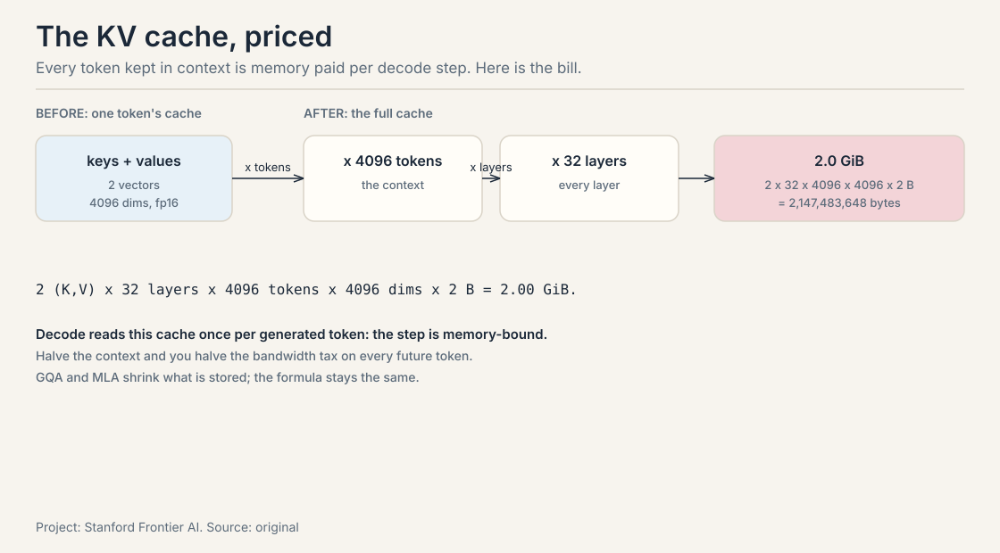

45 minutes · exam depth

This page alone clears the exam. Each section gives you the working
version plus the memory aids: mnemonics, never-confuse pairs, and
if-this-then-that rules. Every section ends with a self-test. Answers
are printed, so check yourself. Links take you into the full lesson
for the derivations.

### 1. The agent loop

An agent is a loop: perceive, plan, act, observe, check. A
reason-only agent hallucinates the Apple Remote's product line as
"iPhone, iPad, iPod Touch". An act-only agent dies on the first
unexpected screen. ReAct interleaves thought and action: 4 acts, 3
observations, and Thought 3 recovers from the wrong remote. The
survival math: four tool calls at 0.9 reliability each give 0.9^4 =
0.66. The check step after every action is the whole difference
between a demo and a system.

<figure class="crash-fig"><figcaption>Perceive, plan, act, observe, check. The check step is the difference between a demo and a system.</figcaption></figure>

**Mnemonic: PP-AOC.** Perceive, Plan, Act, Observe, Check. Say it as
"people plan, agents observe and check."

**Never-confuse:** observation is raw (the test output). The check is
the verdict (tests pass). A loop with observations but no check runs
until the budget dies.

**If-this-then-that:** if the answer needs no external facts, use
chain-of-thought, not ReAct. If the task decomposes up front, write
the plan down (plan-and-execute). If one prompt would need two jobs,
hand off to a specialist.

**Self-test.** Q1: Why does Thought 3 succeed where act-only fails?
A1: It diagnoses the failed search, extracts the hint ("Front Row
(software)"), and replans. Act-only has no step that reads a failure
and rewrites the plan. Q2: Name the three termination exits. A2: The
check passes, the budget dies, or the model declares done.

<ul class="crash-links">
<li><a href="l01-intro-agentic-systems.html">Lecture 1: the loop, traced turn by turn</a></li>
</ul>

### 2. Tool calling: the contract

Every tool call is four stages: Select, Arguments, Validate,
Execute. The crack is an argument like {"path": ["test.py"]} that
sails through selection and fails late in execution. Validate
before executing, never after. The security version: an 87%
successful pop-up attack works because the agent executes untrusted
tool output as instruction. Treat tool results as data, never as
instructions.

<figure class="crash-fig"><figcaption>Select, Arguments, Validate, Execute. The validate stage is where contracts are enforced.</figcaption></figure>

**Mnemonic: SAVE.** Select, Arguments, Validate, Execute. "Save the
call before it runs."

**Never-confuse:** MCP standardizes transport, not trust. A poisoned
server still poisons. Tools act (dangerous). Resources inform (safer
but not safe). Prompts template (keep yours sovereign).

**If-this-then-that:** if a tool fails transiently, append the error
as a result and retry with backoff (1s, 2s, 4s, max 3). If it fails
validation, never retry: it will fail the same way forever.

**Self-test.** Q1: Which stage is load-bearing and why? A1: Validate.
It kills {"path": ["test.py"]} with a clear error before the sandbox,
instead of a confusing executor crash that poisons the next Thought.
Q2: Five agents, eight tools: how many integrations before and after
MCP? A2: 40 before (5 x 8), 13 after (5 + 8).

<ul class="crash-links">
<li><a href="l02-compound-ai-systems.html">Lecture 1: compound systems and the tool-call symbol</a></li>
</ul>

### 3. LLMs for builders: the cost model

A language model is a probability distribution over the next
token. Temperature rescales before the softmax: on [0.7, 0.2, 0.1],
T=0.5 sharpens to [0.91, 0.07, 0.02] and T=2 flattens to [0.52,
0.28, 0.20]. Training minimizes cross-entropy, the negative log
likelihood of the true token. Attention at n=4096 computes 16.7M
scores: quadratic. Decoding is bandwidth bound: the KV cache is 2 x
layers x tokens x dims x bytes (2.0 GiB at 32 layers, 4096 tokens,
fp16). Every context token is bandwidth paid per decode step.

<figure class="crash-fig"><figcaption>2 x 32 x 4096 x 4096 x 2 bytes = 2.0 GiB. Decode reads it per token: memory-bound.</figcaption></figure>

| Sampling | Becomes | Use for |
|---|---|---|
| T = 0.5 | [0.91, 0.07, 0.02] | acting: steady tool calls |
| T = 2 | [0.52, 0.28, 0.20] | thinking: diverse plans |

**Mnemonic: STS.** Scale by T, Truncate (top-k/top-p), Sample. In
that order.

**Never-confuse:** prefill is parallel and compute-bound. Decode is
serial and memory-bound. SFT teaches format, not judgment. RLVR
rewards verifiable truth. RLHF rewards human taste (and its
sycophancy).

**If-this-then-that:** if the output goes to a parser, lower the
temperature. If the model must write code, prefer one midtrained on
code. If the verifier is weak, expect reward hacking.

**Self-test.** Q1: Price the KV cache for the worked model. A1: 2 x
32 x 4096 x 4096 x 2 bytes = 2,147,483,648 bytes, about 2.0 GiB. Q2:
Why is RLVR a better fit for agents than RLHF? A2: Agent success is
checkable in the world (tests pass, booking exists). RLHF rewards
what annotators prefer, which drifts into sycophancy.

<ul class="crash-links">
<li><a href="l03-llms-for-builders.html">Lecture 2: the builder's cost model, worked by hand</a></li>
</ul>

### 4. Spend compute at inference

Training is frozen. Queries vary. The jacket: +25% then -25% is not
$80. $80 x 1.25 = $100, $100 x 0.75 = $75, and the direct answer is
off by $5. Chain of thought is working memory, not intelligence:
each step is a checkable claim. Kimi K3's effort reward gives +1
for correct, 0 for wrong, -1 for wrong and over budget: the -1
teaches the budget. Repeated sampling: at 0.3 success per sample,
1 - 0.7^10 = 0.97 coverage. Sampling is cheap. The verifier is the
scarce resource.

<figure class="crash-fig"><figcaption>Low, medium, high: cost rises with effort. Set the dial per step, not per agent.</figcaption></figure>

**Mnemonic: the -1 teaches the budget.** Correct = +1, wrong = 0,
wrong and over budget = -1. Worse than being wrong cheaply.

**Never-confuse:** outcome reward checks the answer (cheap, blind).
process reward checks each step (teaches where, needs step labels).
Constrained decoding guarantees shape, not meaning.

**If-this-then-that:** if you have a verifier, sample many and pick
the best. If you have none, vote (self-consistency). If the context
fills, compact to goal + open loops + key facts. If you edit
mid-context, you invalidate the KV cache: append, never edit.

**Self-test.** Q1: Chain of thought: smarter model or working memory?
A1: Working memory. Each step is a checkable claim. It gives errors a
place to be caught. Q2: When does tree-of-thoughts beat a chain? A2:
When one chain keeps walking into dead ends on the same problem
class. The evaluator is load-bearing.

<ul class="crash-links">
<li><a href="l04-reasoning-and-context.html">Lecture 2: inference-time scaling and context engineering</a></li>
</ul>

### 5. RAG: the pipeline

RAG is a probability argument: p(y|x) = sum p(z|x) p(y|x,z). With a
trusted passage (p=0.9, weight 0.7) and a bad one (p=0.2, weight
0.3), the correct answer scores 0.69 and the trusted passage
dominates. Two architectures: RAG-Sequence pins one passage per
answer. RAG-Token re-picks per token. Chunks: 200-400 tokens, 10-20%
overlap. Embeddings: 768 numbers per chunk. The retriever measures
distances. Contextual retrieval improves recall with one LLM call per
chunk. Late chunking costs nothing if the encoder reads the document.
Time-sensitive facts decay: stale rows are a design debt, not a bug.

<figure class="crash-fig"><figcaption>Late chunking vs contextual retrieval: two ways to put document context into a chunk vector.</figcaption></figure>

**Mnemonic: 200-400, 10-20.** Chunk size 200-400 tokens, overlap
10-20%. Read ten chunks by hand before trusting the numbers.

**Never-confuse:** RAG-Sequence pins one passage per answer.
RAG-Token re-picks per token. Parametric memory answers from
training. Non-parametric from retrieval.

**If-this-then-that:** if the reader uses one passage per answer,
optimize MRR. If it synthesizes, optimize recall. If the facts are
time-sensitive, check freshness before trusting.

**Self-test.** Q1: Work the 0.69. A1: 0.7 x 0.9 + 0.3 x 0.2 = 0.63 +
0.06 = 0.69. The trusted passage decides. Q2: When does RAPTOR pay?
A2: When answers are spread across the corpus and fixed chunks hide
the bridge: a summary tree gives every level a queryable node.

<ul class="crash-links">
<li><a href="l05-rag-pipeline.html">Lecture 3: the RAG pipeline, worked by hand</a></li>
</ul>

### 6. The retriever zoo

BM25 scores exact terms: IDF 5.65 for "ACME" against 2.93 for
"revenue". Ten mentions score 1.96, not 10. DPR learns semantic
matches and beats BM25 on paraphrase with only 1,000 training pairs.
ColBERT's MaxSim scores every pair of query and document token
embeddings (458 ms per 1,000 docs on GPU). The cross-encoder is the
accurate reranker at 10,700 ms per 1,000 docs: never scan the
corpus. HNSW answers nearest-neighbor in milliseconds at billion
scale by skipping layers. Fuse with RRF on ranks, never scores:
0.0323 beats 0.0320. Hybrid is the default: BM25 first pass for the
rare literal, dense second, cross-encoder final, RRF at the joins.

<figure class="crash-fig"><figcaption>62 ms to 10,700 ms per 1,000 docs. Accuracy rises with latency; each rung buys the next.</figcaption></figure>

**Mnemonic: BM-Dense-Cross, RRF at the joins.** BM25 first, dense
second, cross-encoder final, fuse ranks with RRF.

**Never-confuse:** BM25 fails on paraphrase. DPR fails on rare
literals. Rank fusion uses ranks (0.0323 vs 0.0320), never raw
scores.

**If-this-then-that:** if the query contains a rare literal, run
BM25 first. If the corpus has multiple fields, weight them. If the
reader needs one passage, optimize MRR. If it synthesizes, optimize
recall.

**Self-test.** Q1: BM25 vs DPR on a paraphrased query: who wins, and
why? A1: DPR. BM25 scores exact terms and cannot see through
paraphrase. DPR's learned space keeps synonyms close. Q2: The
cross-encoder is the most accurate retriever: why is it not the
first stage? A2: 10,700 ms per 1,000 docs. It never scans the
corpus. It reranks a shortlist.

<ul class="crash-links">
<li><a href="l06-retrieval-methods.html">Lecture 3: the retriever zoo, priced per rung</a></li>
</ul>

### 7. Agentic retrieval fails with numbers

When no single passage answers the question, retrieval moves inside
the loop. Query 2 is born from observation 1. The loop owns three
decisions: whether to retrieve, what to rewrite, when to stop.
Nine failure modes, three groups. The loop's math: compounding
(0.95^20 = 0.36), no stopping rule (2,000 tokens x 25 rounds =
50,000), injection (87%, and it steers the next hop). The index:
recall ceiling (0.8 caps everything), stale index, permission leak
(fix at retrieval time, not generation). The reader:
lost-in-the-middle, distraction, evidence conflict (resolve: prefer
newer, prefer primary, or retrieve a tiebreaker).

<figure class="crash-fig"><figcaption>0.95^2 = 0.90. 0.95^5 = 0.77. 0.95^20 = 0.36. Reliable steps, unreliable chains.</figcaption></figure>

**Mnemonic: whether, what, when.** The three retrieval decisions the
loop owns. Whether to retrieve, what to write, when to stop.

**Never-confuse:** Self-RAG decides whether to retrieve (reflection
tokens). CRAG repairs bad retrieval (evaluator, web fallback,
knowledge strips). Confidence is not evidence: a stopping rule that
trusts confidence stops at the first plausible answer.

**If-this-then-that:** if the retriever's recall is 0.8, the system
caps at 0.8. If two passages disagree, resolve, never average. If
retrieved text carries instructions, it is untrusted input steering
the next hop.

**Self-test.** Q1: Work 0.95^20 and name the lesson. A1: 0.36. A
twenty-hop chain is wrong two times in three even though every step
is 95% reliable. Verify per hop. Keep chains short. Q2: The
permission system is per-document but chunks are shared: what now?
A2: The chunking broke the permission boundary. Re-chunk along
permission lines or tag each chunk with its ACL.

<ul class="crash-links">
<li><a href="l07-agentic-retrieval-failure-modes.html">Lecture 3: retrieval inside the loop and its nine failure modes</a></li>
</ul>

### 8. Evaluate the other nine runs

The demo is run 1 of 10. Score the other nine. Consistency: 7/10 on
the same task. Robustness: 4/10 on rephrased instructions. Legibility:
run 6 called a refund tool it should never touch: the outcome was
right, the trace was wrong. SWE-bench: 2,294 real issues, patch
grading. FAIL_TO_PASS must flip, PASS_TO_PASS must hold. GAIA: 466
questions, exact match. Humans 92%, GPT-4 with plugins 15%. The
judge is wrong 15 times in 100: calibrate against humans first.
Humans cost 17 hours per 100 tasks. Goodhart: the metric becomes the
target. Reward tampering: edit the tests, not the code. Sandbox the
grader. Score the trace. Print cost, latency, and safety next to
every score.

<figure class="crash-fig"><figcaption>Ten runs, seven succeed. Rephrased, four succeed. The demo is run 1 of 10.</figcaption></figure>

**Mnemonic: CRL.** Consistency, Robustness, Legibility. "Score the
CRL of every agent."

**Never-confuse:** a judge that grades its twin is a mirror, not a
measurement. Public benchmarks get you hired. Private evals keep you
from shipping a demo. Resolution rate and tone score are reported
side by side, never averaged.

**If-this-then-that:** if the judge is uncalibrated, its scores are
stories. If the score climbs but users complain, check contamination
first. If no verifiable outcome exists, calibrate the judge on a
human sample, then scale.

**Self-test.** Q1: Your agent scores 90% on a one-shot eval: name
three ways the number lies. A1: It is run 1 of 10 (consistency). It
is one phrasing (robustness). The split may have leaked (Goodhart).
Q2: What does PASS_TO_PASS catch that FAIL_TO_PASS misses? A2:
Regressions: a patch that fixes the bug but breaks an unrelated
feature fails PASS_TO_PASS.

<ul class="crash-links">
<li><a href="l08-evaluating-agents.html">Lecture 4: evaluating agents with numbers</a></li>
</ul>

### 9. Curveballs with worked answers

The exam probes the joints between sections. Each curveball below
has a worked answer: say the rule first, then the number.

**Curveball 1.** "Your RAG agent answers confidently but wrong on
multi-hop questions. The retriever's recall@10 is 0.85. Diagnose."
The ceiling is 0.85: the retriever bounds the system. But the
question is multi-hop, so check whether the right passages ever
arrive together. If query 2 depends on observation 1, one-shot
retrieval cannot supply it: the fix is agentic retrieval, then
re-measure recall on the per-hop queries. If the evidence arrives
and the answer is still wrong, it is distraction or
lost-in-the-middle: a reader-side failure. Measure each side
separately. The fix lives on opposite sides of the handoff.

**Curveball 2.** "The agent's tool calls cost $0.02 each and succeed
with probability 0.9. The task needs 4 calls. Budget: is this task
viable?" 0.9^4 = 0.66 success per attempt. Expected cost per success
= 4 x $0.02 / 0.66 = $0.12. If the task is worth more than $0.12,
viable. The levers: cut the calls (fewer tools, one call instead of
two), raise the per-step reliability (validate arguments), or add
retries with backoff (adds cost, buys success). Price before you
ship.

**Curveball 3.** "Two teams report scores: team A 92% with an
uncalibrated LLM judge, team B 89% verified by humans. Who wins?"
Team B. Team A's judge is wrong 15 times in 100, and a 3-point gap
inside that error is noise. An uncalibrated score is a story. The
calibrated number wins every time, even when it is smaller.

**Curveball 4.** "The CEO-year question returns 'Washington, D.C.'
and cites a page about the wrong year. What failed?" The citation
failed, not the answer. This is lost-in-the-middle or distraction:
the right city survived, the evidence did not. The fix is per-hop
verification: each Thought that consumes an observation records
which passage supported which claim. The trace is the audit trail.

**Curveball 5.** "Your agent's SWE-bench score rose 10 points after
you added the validation split to training. Real gain?" Goodhart:
the metric became the target. The score measures memory of the
validation set, not agency. Revert the change, hold out a private
split, and re-measure. A score that climbs while user complaints do
not fall is contamination until proven otherwise.

### 10. Rapid-fire self-test with answers

Ten questions, one line each. Answers inline. If any answer
surprises you, follow its link back.

1. The loop's five steps? **Perceive, plan, act, observe, check.**
2. Survival math for four 0.9 steps? **0.66.**
3. The four tool-call stages? **Select, Arguments, Validate, Execute.**
4. Five agents, eight tools, MCP integrations? **13, not 40.**
5. KV cache for 32 layers, 4096 tokens, 4096 dims, fp16? **2.0 GiB.**
6. T=0.5 on [0.7, 0.2, 0.1]? **[0.91, 0.07, 0.02].**
7. The -1 in Kimi K3 teaches what? **The budget.**
8. RAG-Sequence vs RAG-Token? **One passage per answer vs re-pick per
   token.**
9. 0.95^20? **0.36.**
10. The cheapest honest eval? **Verifiable outcomes on 20 real tasks,
    5 runs each, one-shot baseline.**

### 11. Go deeper

The papers behind the numbers above. Read them in this order.

- Yao et al., ReAct (2022): https://arxiv.org/abs/2210.03629 : the Thought/Act/Observe loop and its measurements.
- Shinn et al., Reflexion (2023): https://arxiv.org/abs/2303.11366 : verbal reinforcement from failed runs.
- Lewis et al., RAG (2020): https://arxiv.org/abs/2005.11401 : the original retrieve-then-generate recipe.
- Barnett et al. (2024): https://arxiv.org/abs/2401.05856 : seven failure points of RAG engineering.
- Asai et al., Self-RAG (2023): https://arxiv.org/abs/2310.11511 : retrieve, generate, and critique through self-reflection.
- Brown et al., Large Language Monkeys (2024): https://arxiv.org/abs/2407.21787 : inference compute keeps helping far past intuition.
- Wei et al., Chain-of-Thought (2022): https://arxiv.org/abs/2201.11903 : the scratch pad that started it all.
- HarnessAudit: https://harnessaudit.github.io : agent scaffold auditing.

