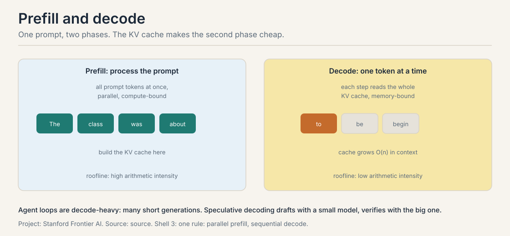
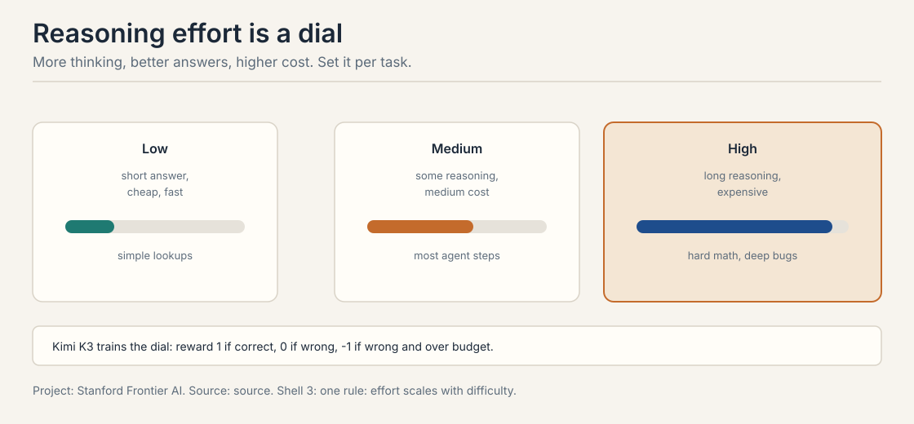

30 minutes · interview speed

This page tells the whole agents story fast. Each section gives you
the working version: enough to answer interview questions with
confidence. Links at the end of each section take you into the full
lesson when you want the derivations and the follow-ups.

### 1. The agent loop

An agent is a loop: perceive, decide, act, observe, check. A
reason-only agent hallucinates the Apple Remote's product line as
"iPhone, iPad, iPod Touch". An act-only agent dies on the first
unexpected screen. ReAct interleaves thought and action: 4 acts, 3
observations, and Thought 3 recovers from the wrong remote. The
survival math: four tool calls at 0.9 reliability each give 0.9^4 =
0.66. The check step after every action is the whole difference
between a demo and a system.

<figure class="crash-fig"><figcaption>Perceive, decide, act, observe, check. The check step is the difference between a demo and a system.</figcaption></figure>

<ul class="crash-links">
<li><a href="l01-intro-agentic-systems.html">Lecture 1: the loop, traced turn by turn</a></li>
</ul>

### 2. Tool calling: the contract

Every tool call is four stages: Select, Arguments, Validate,
Execute. The crack is an argument like {"path": ["test.py"]} that
sails through selection and fails late in execution. Validate
before executing, never after. The security version: an 87%
successful pop-up attack works because the agent executes untrusted
tool output as instruction. Treat tool results as data, never as
instructions.

<figure class="crash-fig"><figcaption>Select, Arguments, Validate, Execute. The validate stage is where contracts are enforced.</figcaption></figure>

<ul class="crash-links">
<li><a href="l02-compound-ai-systems.html">Lecture 1: compound systems and the tool-call symbol</a></li>
</ul>

### 3. LLMs for builders: the cost model

A language model is a probability distribution over the next
token. Temperature rescales before the softmax: on [0.7, 0.2, 0.1],
T=0.5 sharpens to [0.91, 0.07, 0.02] and T=2 flattens to [0.52,
0.28, 0.20]. Training minimizes cross-entropy, the negative log
likelihood of the true token. Attention at n=4096 computes 16.7M
scores: quadratic. Decoding is bandwidth bound, so the whole
efficiency game is making the model smaller and the memory closer,
not the math different.

<figure class="crash-fig"><figcaption>Prefill is compute bound. Decode is bandwidth bound. Every agent step pays the decode tax.</figcaption></figure>

<ul class="crash-links">
<li><a href="l03-llms-for-builders.html">Lecture 2: the builder's cost model, worked by hand</a></li>
</ul>

### 4. Spend compute at inference

Training is frozen; queries vary. The jacket: +25% then -25% is not
$80. $80 x 1.25 = $100, $100 x 0.75 = $75, and the direct answer is
off by $5. Chain of thought is working memory, not intelligence:
each step is a checkable claim. Kimi K3's effort reward gives +1
for correct, 0 for wrong, -1 for wrong and over budget: the -1
teaches the budget. Repeated sampling: at 0.3 success per sample,
1 - 0.7^10 = 0.97 coverage. Sampling is cheap; the verifier is the
scarce resource.

<figure class="crash-fig"><figcaption>Low, medium, high: cost rises with effort. Set the dial per step, not per agent.</figcaption></figure>

<ul class="crash-links">
<li><a href="l04-reasoning-and-context.html">Lecture 2: inference-time scaling and context engineering</a></li>
</ul>

### 5. RAG: evidence at answer time

Do not train the model on the documents; retrieve them at answer
time. p(y|x) = sum p(z|x) p(y|x,z): on the toy, 0.7 x 0.9 + 0.3 x
0.2 = 0.69, and the trusted passage dominates. Training breaks
three ways: stale (retrain weekly?), no citation, lossy
(reconstructions, not rows). Retrieval is dynamic, exact, and
checkable. The retriever's miss is the reader's ceiling. Chunk at
200 to 400 tokens with 10 to 20% overlap, and read ten chunks by
hand before tuning anything.

<figure class="crash-fig"><figcaption>RAG-Sequence picks one passage. RAG-Token re-picks per token and marginalizes.</figcaption></figure>

<ul class="crash-links">
<li><a href="l05-rag-pipeline.html">Lecture 3: the RAG pipeline, built from zero</a></li>
</ul>

### 6. The retriever zoo

BM25: IDF rewards rarity and frequency saturates; 62 ms, no
training, blind to paraphrase. DPR: meaning as a dot product,
beats BM25 on 4 of 5 datasets, misses rare literals. ColBERT:
MaxSim over tokens, token-sized index, 458 ms. Cross-encoder:
the best judge at 10,700 ms per 1k passages, shortlists only.
Hybrid: run BM25 and dense, fuse ranks with RRF, let consensus
win. MRR for one-passage readers, recall for synthesizers.

<figure class="crash-fig"><figcaption>BM25 misses paraphrase. Dense misses rare literals. Run both, fuse ranks, let consensus win.</figcaption></figure>

<ul class="crash-links">
<li><a href="l06-retrieval-methods.html">Lecture 3: the retriever zoo, priced in milliseconds</a></li>
</ul>

### 7. Retrieval inside the loop

One-shot RAG cannot answer multi-hop questions: no single passage
holds the answer. The agentic trace: search "ACME CEO took office
year", observe "CEO since 2019", then search "World Series host
2019". Query 2 is born from observation 1. The loop owns whether,
what, and when to stop. Nine failure modes, each priced:
compounding error (0.95^20 = 0.36), no stopping rule (50,000
tokens), injection steering the next hop, recall ceiling,
staleness, permission leaks, lost-in-the-middle, distraction,
evidence conflict.

<ul class="crash-links">
<li><a href="l07-agentic-retrieval-failure-modes.html">Lecture 3: agentic retrieval and its nine failure modes</a></li>
</ul>

### 8. Evaluate the other nine runs

The demo is run 1; the user lives in runs 2 through 10.
Consistency 7/10, robustness 4/10 on rephrasing, legibility: the
trace shows a refund tool the agent should never have touched.
SWE-bench: 2,294 real GitHub issues, FAIL_TO_PASS must flip and
PASS_TO_PASS must hold. GAIA: 466 questions, humans 92%, GPT-4
with plugins 15%. The LLM judge is wrong 15 times in 100; humans
cost 17 hours per 100 tasks. Goodhart: the metric becomes the
target. Sandbox the grader; score the trace.

<ul class="crash-links">
<li><a href="l08-evaluating-agents.html">Lecture 4: evaluating agents with numbers</a></li>
</ul>

**Q: ReAct in one sentence?**
A: Reason and act in an interleaved loop: 4 acts, 3 observations,
Thought 3 recovers. 0.9^4 = 0.66 survival without the check step.

**Q: Why validate tool arguments before executing?**
A: A malformed argument like {"path": ["test.py"]} fails late and
burns the turn. The 87% pop-up attack works on unvalidated,
untrusted tool output.

**Q: Chain of thought: smarter model or working memory?**
A: Working memory. Each step is a checkable claim. Long traces on
ambiguous questions accumulate confident errors in the open.

**Q: When is repeated sampling worth it?**
A: When you have a verifier. At 0.3 per-sample success, ten
samples give 0.97 coverage. Without a verifier, vote.

**Q: RAG-Sequence vs RAG-Token?**
A: Sequence picks one passage for the whole answer. Token
re-picks per token. Token matters when the answer draws on
multiple passages.

**Q: BM25 vs DPR in one line each?**
A: BM25: 62 ms, no training, exact terms, blind to paraphrase.
DPR: meaning as a dot product, needs 1,000 labeled pairs, misses
rare literals.

**Q: Why rerank a shortlist instead of scoring everything?**
A: The cross-encoder costs 10,700 ms per 1k passages with full
attention. It judges the top 100; the bi-encoder finds them.

**Q: What kills a 20-hop retrieval chain?**
A: Compounding error: 0.95^20 = 0.36. Keep chains short, verify
per hop, and write a stopping rule.

**Q: SWE-bench vs GAIA?**
A: SWE-bench: 2,294 GitHub issues, depth in one repo, test-gated.
GAIA: 466 questions, breadth across tools, exact match.

