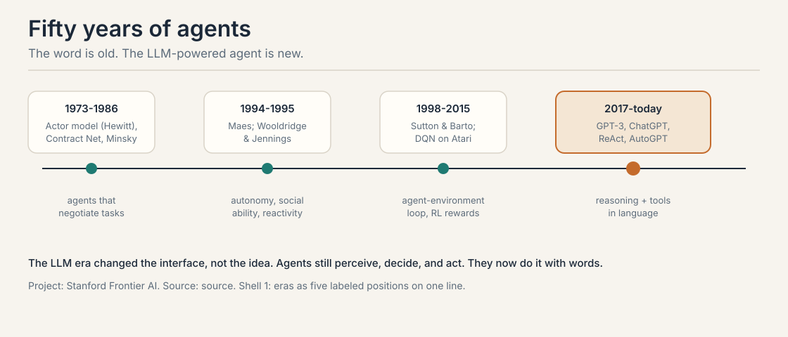
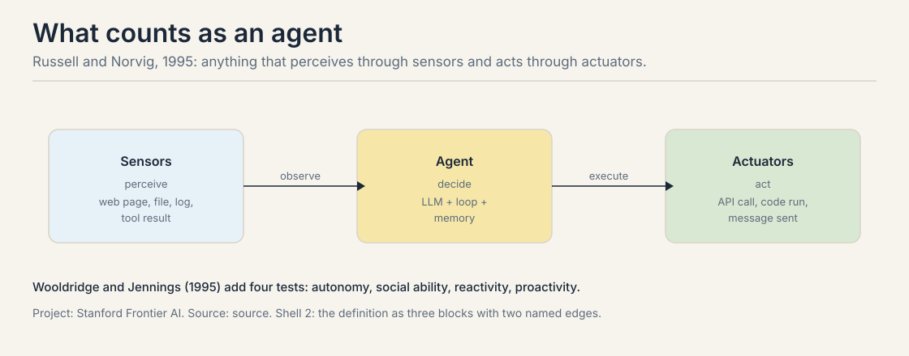
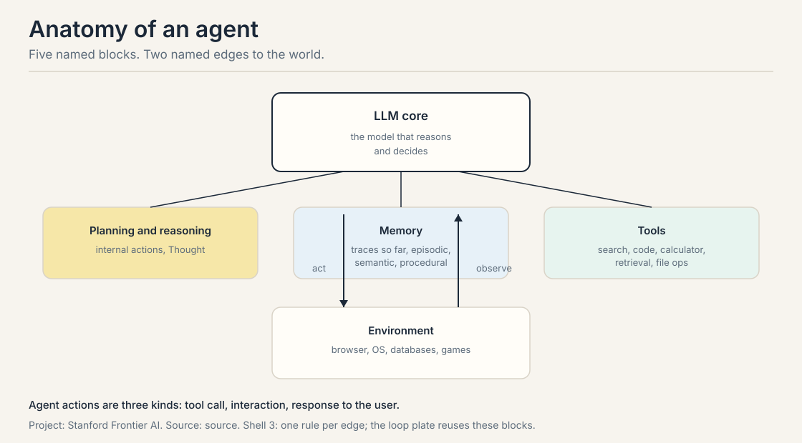
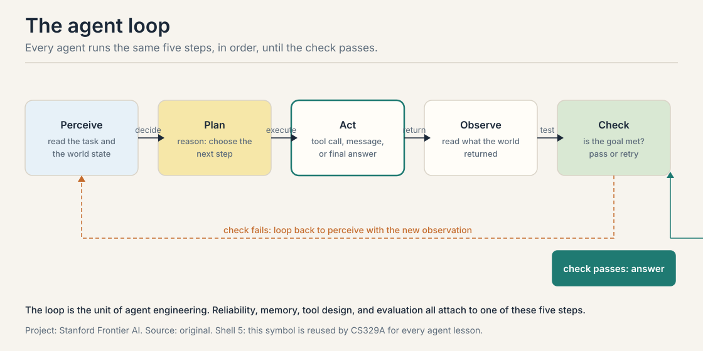
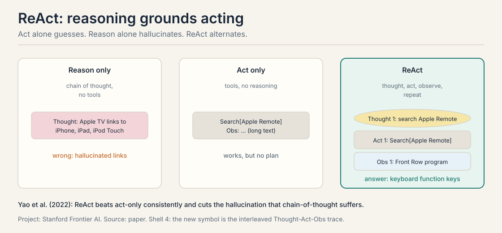
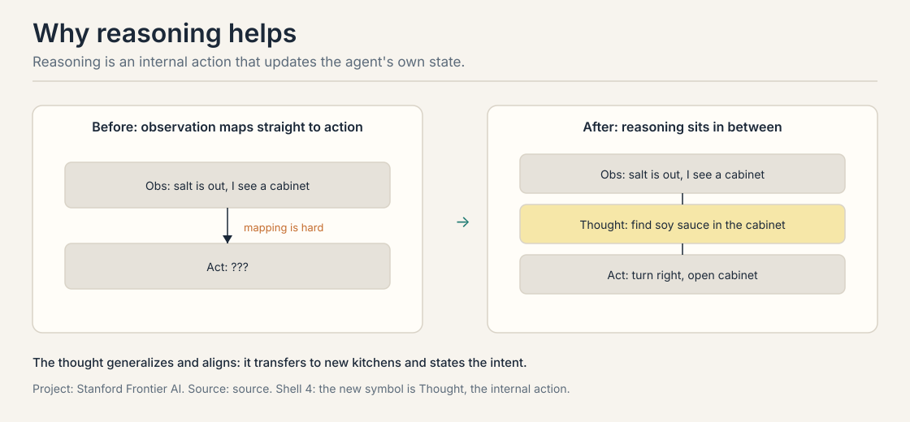
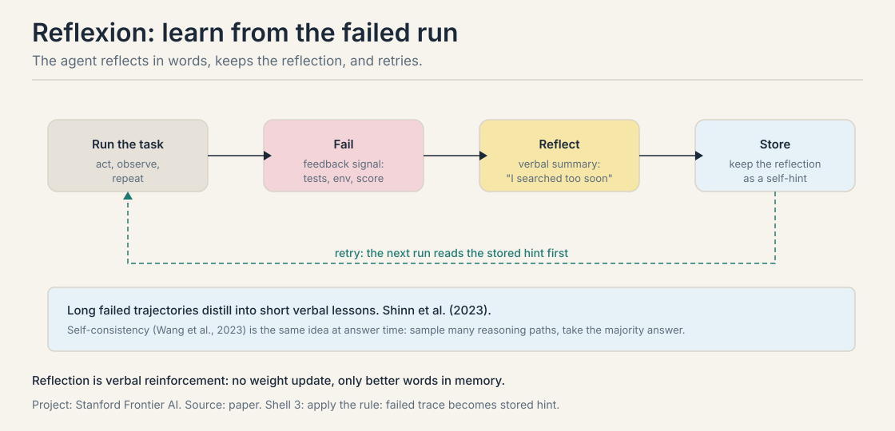
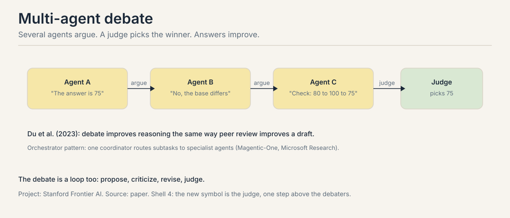

## The job: words must become actions

"Book me the cheapest flight to Chicago next Friday." A chatbot can
discuss flights. It can list airlines and explain layovers. It cannot
check a single price, click a single button, or book a single seat.
Talking about the world is not touching the world.

That gap is the whole subject of this course. A language model on its
own is a text machine: words in, words out. An agent closes the loop:
it reads the world, decides, acts on the world, and reads what happened.
This chapter builds that loop from zero. It starts with the history,
because the idea is fifty years older than the models.



The word comes from the Latin *agens*, one who acts. The first indexed
AI use is Hewitt, Bishop, and Steiger's actor formalism in 1973. The
1980s added the Contract Net Protocol, where agents negotiate tasks,
and Minsky's Society of Mind in 1986. The 1990s formalized the idea:
Pattie Maes on autonomous agents in 1994, Wooldridge and Jennings on
autonomy, social ability, reactivity, and proactivity in 1995, and
Russell and Norvig's textbook definition, also 1995. Then came the RL
era, from Sutton and Barto's 1998 book to DQN playing Atari in 2015.
The LLM era changed the interface to words: ReAct in October 2022,
ChatGPT in November 2022, BabyAGI and AutoGPT in March 2023.

Russell and Norvig's definition still stands: an agent is anything that
perceives through sensors and acts through actuators. A thermostat
qualifies. A web agent qualifies. The definition does not mention
intelligence. Wooldridge and Jennings add four tests that separate a
useful agent from a thermostat: autonomy (it works without constant
human control), social ability (it interacts with others), reactivity
(it responds to change), and proactivity (it takes initiative toward
goals).



## First attempt: answer from memory

Take a question the model might know. From the lecture:

> Aside from the Apple Remote, what other device can control the
> program Apple Remote was originally designed to interact with?

The straightforward approach is to ask the model and let it reason from
memory. The lecture shows three rungs of this approach. Standard:
answer directly. Reason-only: think step by step, then answer. Here is
the reason-only trace, exactly as the lecture shows it:

```ascii
Thought: Let's think step by step. Apple Remote was originally
         designed to interact with Apple TV. Apple TV can be
         controlled by iPhone, iPad, and iPod Touch. So the
         answer is iPhone, iPad, and iPod Touch.
Answer:  iPhone, iPad, iPod Touch
```

Every sentence sounds confident. Every link in the chain is wrong. The
Apple Remote was not designed for Apple TV. The answer is not iPhone,
iPad, and iPod Touch. The model built a clean argument on false facts
and never noticed, because it never checked anything outside its own
weights.

The third rung is act-only: let the model call tools but give it no
room to reason. It emits Search[Apple Remote], reads the result, emits
Search[Front Row], gets nothing back, and stops. It has no Thought step
to adapt the query. One failed observation ends the run.

## Where memory answers break

Two cracks, each demonstrated by the trace above.

First, confident hallucination. The reason-only trace is fluent,
structured, and wrong at every step. The lecture's verdict is blunt:
hallucination is a serious problem for chain-of-thought. No amount of
step-by-step polish fixes facts the model never had. The failure is not
a reasoning bug. It is an information bug: the model cannot know what
it never saw.

Second, brittle acting. Watch what happens to an act-only agent at the
failed search. The observation says: Could not find [Front Row].
There is no Thought step to reinterpret that failure, so the agent
cannot try "Front Row (software)". A single unhelpful observation kills
a four-step plan. The longer the task, the more certain some step
returns something unexpected, and the act-only agent has no way back.

A quick preview of the arithmetic, worked in full in the failure-modes
lesson: if each step of a 4-step plan has even a 10 percent chance of an
unhelpful observation, the plan survives with probability 0.9^4 = 0.66.
One run in three dies on noise. Acting without reasoning does not scale
to long plans.

## The key question

What if the model could think, act, read the result, and repeat, with
each thought grounded in a fresh observation?

## The machinery: five blocks around a core

Before the loop, the parts. An agent system has five blocks. The LLM
core sits in the center. It reasons and decides. Around it: planning and
reasoning (internal actions, the Thought steps), memory (the traces so
far), tools (search, calculator, code, retrieval, file operations), and
the environment (desktop OS, web browser, mobile apps, games,
databases). Two edges reach the world: act goes out, observe comes
back.



Agent actions come in three kinds: a tool call, an interaction, or a
response to the user. Everything the agent does in the world is one of
these three.

The trap is to treat the LLM as the agent. The LLM is one block. The
agent is the loop plus the blocks. Reliability lives in the loop design,
not in the model weights.

## The agent loop, built from zero

This is the canonical symbol of the course, and CS329Z owns it. CS329A
reuses this exact symbol for every agent it studies. Five steps, in
order, until the check passes.



Walk it on the flight task. **Perceive:** read the task and the current
world state into the working context: destination Chicago, date next
Friday, no prices yet. **Plan:** reason about the next step. This is the
Thought: "I need today's prices before I can compare anything." **Act:**
change the world. Call the flight search tool. **Observe:** read what
the world returned: three options with prices. **Check:** test whether
the goal is met. Cheapest identified and booked? If not, loop back to
perceive with the new observation in context.

The check is the step most builders skip. Without it, the agent runs
until it runs out of context or budget. A real check is a named test:
the booking confirmation exists, the unit tests pass, a human approved.
"Looks done" is not a check.

## ReAct: the loop with thoughts, traced by hand

ReAct (Yao et al., 2022) is the loop made concrete: Thought, Act,
Observe, repeat. Here is the full trace from the lecture, turn by turn.
This hand-traced loop is the course's signature symbol. Read it the way
the gold-standard chapter reads the attention toy: every turn earns its
place.

```ascii
Thought 1: I need to search Apple Remote and find the program
           it was originally designed to interact with.
Act 1:     Search[Apple Remote]
Obs 1:     The Apple Remote ... originally designed to control
           the Front Row media center program ...

Thought 2: Apple Remote was originally designed to control the
           Front Row media center program. I need to search
           Front Row next and find what other device can
           control it.
Act 2:     Search[Front Row]
Obs 2:     Could not find [Front Row]. Similar: ['Front Row
           (software)', ...]

Thought 3: Front Row is not found. I need to search
           Front Row (software).
Act 3:     Search[Front Row (software)]
Obs 3:     Front Row is a discontinued media center software ...

Thought 4: Front Row (software) is controlled by an Apple Remote
           or the keyboard function keys. So the answer is
           keyboard function keys.
Act 4:     Finish[keyboard function keys]
```

Four acts, three observations, one recovery. Turn 2 plans from the
evidence of turn 1. Turn 3 is the whole idea in miniature: the
observation failed, and the Thought adapted the query instead of dying.
Turn 4 answers from the observations, not from memory. The correct
answer, keyboard function keys, appears nowhere in the model's
original guess. It came from the world.



The lecture reports that ReAct beats act-only agents consistently and
cuts the hallucination that chain-of-thought suffers. The mechanism is
visible in the trace: observations ground each thought, and thoughts
repair failed actions.

A note on the reasoning step itself. For humans, reasoning means
deduction and analogy. For an LLM, it means intermediate text that
imitates those processes. For an agent, reasoning is an internal action:
it updates the agent's own state, not the world. The lecture's example:
"The dish should be savory, and salt is out, so I should find the soy
sauce in the cabinet to my right." Mapping that observation straight to
"turn right, open cabinet" is a leap. The Thought names the intent and
breaks the leap into a step.



Reasoning buys two things. Generalization: "find soy sauce in the
cabinet" transfers to a new kitchen. Alignment: the stated intent lets a
human check the plan before it acts. The misunderstanding to avoid:
this is not classical planning. There is no search tree and no formal
world model. It is text that imitates human mental processes, and it
works because the model trained on text full of them.

## Mapping back: what each piece fixes

| Crack in the first attempt | The answer | How |
|---|---|---|
| Reason-only hallucinates facts | Observations | Each Thought reads fresh evidence from the world before the next step |
| Act-only dies on one bad result | Thoughts | Thought 3 reinterprets the failed search and retries with a better query |
| No plan for long tasks | The loop | Perceive, plan, act, observe, check repeats until the goal is met |
| No way to know it is done | The check | A named test, not a feeling; loop back while it fails |

## The honest price

The loop costs per turn. Every Thought, Act, and Observe is tokens and
latency, and a four-turn trace like the one above spends several model
calls where a direct answer spends one. For easy questions, the loop is
overkill: if the answer needs no external facts, chain-of-thought alone
is cheaper and just as good.

The loop also amplifies mistakes. A bad observation poisons the next
Thought, which poisons the next Act. The preview math said 0.9^4 = 0.66
survival for a four-step plan at 10 percent noise per step. Longer
plans decay faster. The failure-modes lesson works this compounding in
full and shows what contains it.

And the check, the most important step, is the hardest to write. "The
booking exists" is checkable. "The answer looks right" is not. Every
serious agent project spends its hardest design hours on the check.

## The loop, extended

Three extensions of the same loop close the chapter.

**Reflexion** (Shinn et al., 2023) adds a reflection step. The agent
runs the task, fails, and receives a feedback signal: test results, an
environment score, a human note. It writes a verbal reflection, keeps it
in memory as a self-hint, and retries. Long failed trajectories distill
into short lessons. No weights change. The lesson is text, stored and
re-read.



**Multi-agent debate** (Du et al., 2023) parallelizes the correction.
Several agents propose answers, argue, and revise. A judge picks the
winner. Debate catches errors that one agent's blind spots hide. It
works when the errors are uncorrelated: three medium agents with
different blind spots beat one strong agent with one blind spot. If all
agents share the same weakness, debate amplifies it.



**The orchestrator** generalizes debate into teamwork. One coordinator
routes subtasks to specialist agents: a web agent, a code agent, a file
agent. Magentic-One from Microsoft Research is the lecture's example.
The orchestrator is itself an agent running the same five-step loop,
with "delegate to specialist" as one of its actions.

**Self-consistency** (Wang et al., 2023) is the no-tool, no-verifier
option. Prompt with chain-of-thought, generate many reasoning paths,
and take the most consistent final answer. More samples, majority vote.
It costs tokens linearly in the number of paths, and it belongs wherever
tools cannot go.

| Extension | What changes in the loop | When it wins |
|---|---|---|
| Reflexion | failure becomes a stored hint | one agent, repeated tries, verbal feedback available |
| Debate | several agents argue, judge picks | errors are uncorrelated across agents |
| Orchestrator | "delegate" becomes an action | subtasks need different tools |
| Self-consistency | many paths, majority vote | no tools, no verifier, fixed budget |

## Interview Q&A

> [!QA]
> Q: Why does ReAct beat chain-of-thought on knowledge-heavy questions?
> A: Chain-of-thought reasons only from the model's weights, so it hallucinates facts with full confidence. The lecture's trace shows it: a clean step-by-step argument for "iPhone, iPad, and iPod Touch" that is wrong at every link. ReAct pulls observations from the world between thoughts, so each reasoning step is grounded in fresh evidence. The trace adapts after a failed search and lands on "keyboard function keys", an answer the model never would have generated from memory. Yao et al. report that ReAct beats act-only agents consistently and cuts chain-of-thought hallucination.
> Follow-up: When would you prefer pure chain-of-thought over ReAct?
> A: When the task needs no external facts: pure math, logic puzzles, style rewriting. Each tool call costs latency and money, and observations add nothing when the answer is fully determined by reasoning over the prompt. Match the machinery to where the uncertainty lives: facts need tools, logic needs thoughts.

> [!QA]
> Q: Walk through the five steps of the agent loop for a coding task, and name the step builders skip.
> A: Perceive: read the issue and the repo state into context. Plan: a Thought like "the bug is in the parser's edge case". Act: a tool call that edits the file. Observe: read the test output. Check: do the tests pass, and is the fix minimal? The skipped step is the check. Without a named test, the loop never converges: the agent edits, tests fail, it edits again, and the context fills with stale attempts. "Looks done" is not a check.
> Follow-up: What is the difference between the check and the observation?
> A: The observation is raw: the test output, the page content, the tool result. The check is a verdict on the observation against the goal: tests pass, booking confirmed, answer verified. Observations accumulate; the check decides. A loop with observations but no check runs until the budget dies.

> [!QA]
> Q: What is the difference between Reflexion and fine-tuning on the failure?
> A: Reflexion changes no weights. The lesson from a failed run is stored as text in memory and read on the next attempt: fast, local to one task, no training run. Fine-tuning changes the weights and needs a dataset and a training run: slow, but the lesson generalizes across tasks. Pick Reflexion when the feedback is verbal and the task recurs in similar form. Pick fine-tuning when you have many failures and want the fix baked into the model.
> Follow-up: Why would debate beat a single stronger model?
> A: Uncorrelated errors. Three medium agents with different blind spots catch more than one strong agent with one blind spot, because the judge sees three independent attempts. But if all agents share the model's weakness, debate just amplifies it three times. Diversity of failure is the resource; the judge is only as good as the disagreement.

## Recap: the whole lesson on one screen

The story in eight steps. Each step answers the one before it.

1. **Words must become actions.** A chatbot discusses flights; it cannot
   book one. The agent closes the loop between words and the world.
2. **The idea is fifty years old.** Actors in 1973, formal definitions
   in 1995, RL agents in 2015, language agents from 2022. The interface
   changed to words; the loop did not.
3. **Memory answers hallucinate.** The reason-only trace argues cleanly
   for a wrong answer at every link. Fluency is not evidence.
4. **Acting without thought is brittle.** One failed observation kills
   the plan. At 10 percent noise per step, a four-step plan survives
   with probability 0.9^4 = 0.66.
5. **The loop: perceive, plan, act, observe, check.** The five steps in
   order until the check passes. The check is a named test, and it is
   the step most builders skip.
6. **ReAct grounds thought in observation.** Four acts, three
   observations, one recovery: Thought 3 adapts the failed search and
   the trace lands on keyboard function keys.
7. **The loop extends.** Reflexion stores lessons as text. Debate
   cancels uncorrelated errors. The orchestrator delegates to
   specialists. Self-consistency votes without tools.
8. **The price is per-turn cost and compounding error.** Every turn
   spends tokens and latency, and bad observations poison later steps.
   The check is the hardest step to write well.

## Official sources and further reading

**Official:**
- Lecture 1 slides (local: sources/agents/cs329z/lecture01.pdf): the
  anatomy diagram, the ReAct trace, the history timeline.
- Course site: http://web.stanford.edu/class/cs329z — logistics,
  office hours, project details.

**Further reading:**
- Lilian Weng, "LLM Powered Autonomous Agents": the survey the lecture
  cites for agent definitions.
- Sumers and Yao (2024), cognitive language agents: the lecture's
  pointer for deeper agent theory.

**Caveats from these sources.** The lecture states ReAct's advantage
qualitatively ("outperforms Act consistently"); exact benchmark numbers
are not in the slides, so none are quoted. No lecture video ID is on
record, so timestamps are omitted. The 0.9^4 survival figure is a worked
toy, not a measured rate.

## Connections to the other courses

- **CS336 L01:** the LLM core is a next-token predictor. Tokenization
  and the chain rule live there.
- **CS336 L15/L16:** post-training and RLVR shape the reasoning the
  core produces. The Thought step inherits their strengths and flaws.
- **CS329H L02:** human feedback trains the core's preferences; the
  preference pair explains sycophancy, which the safety lesson meets
  again.
- **CS329A:** reuses the agent loop symbol from this lesson for every
  agent it studies. Its agents are research systems; this course's are
  engineered ones.
- **This course:** the next lesson gives the loop its hands (tools),
  and the failure-modes lesson prices the compounding.
