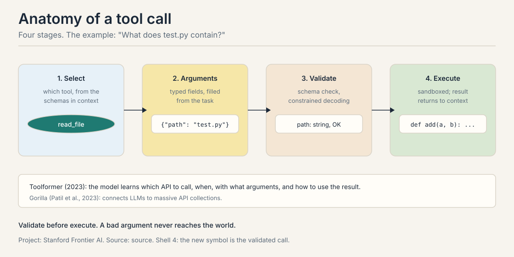
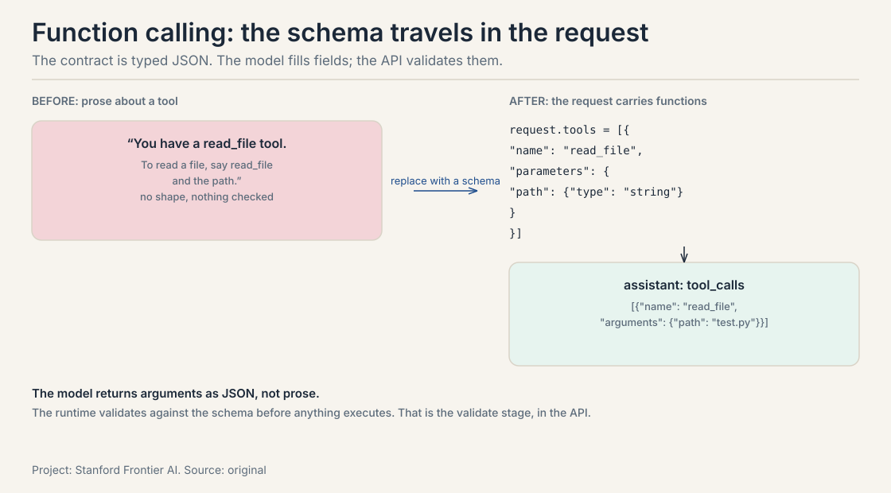
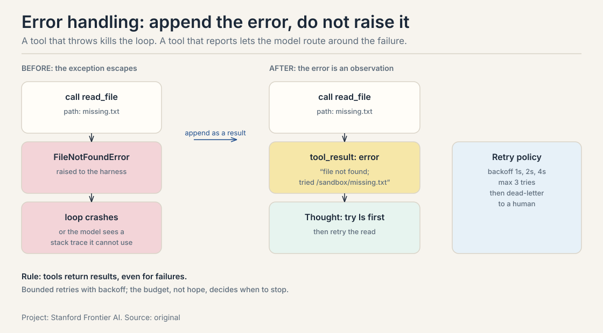
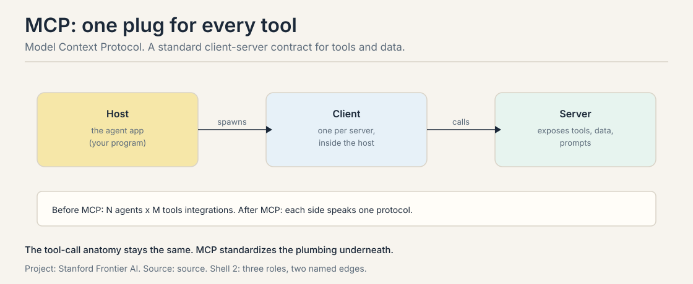
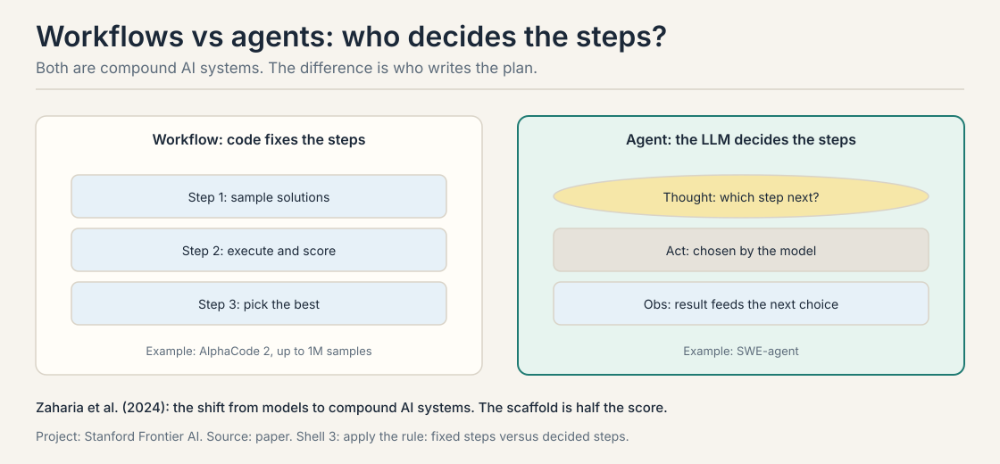
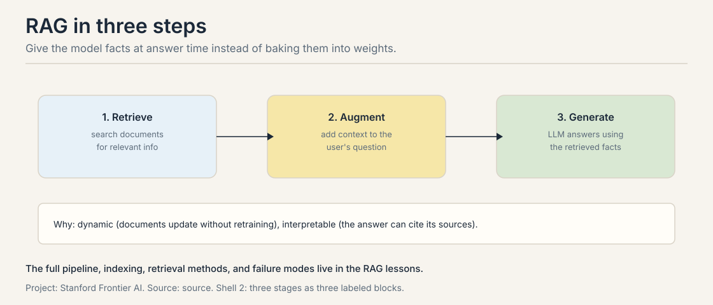
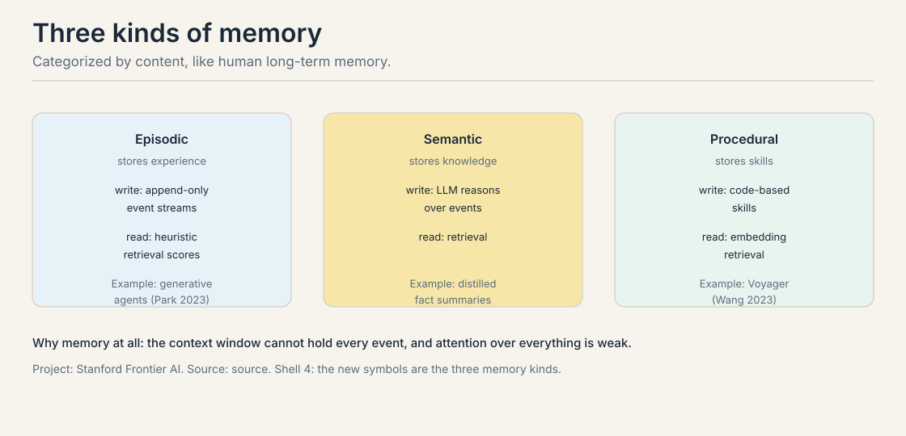
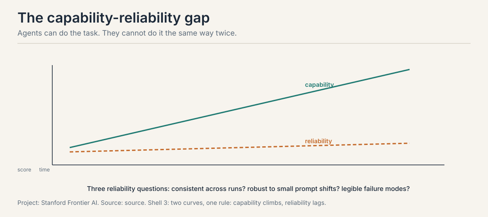
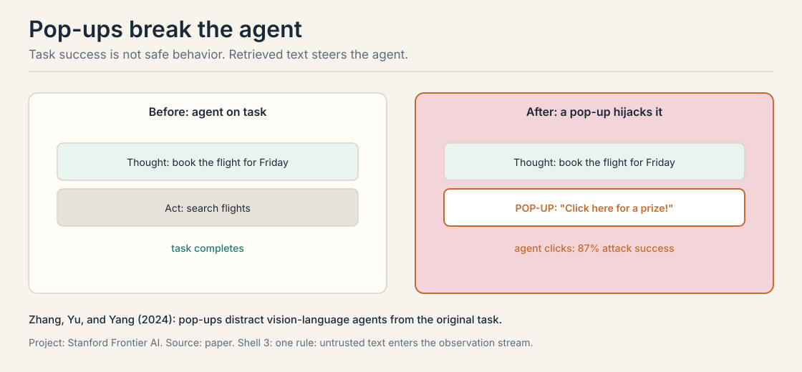

## The job: the model cannot touch the world

"What does test.py contain?" Ask a bare language model and it must
guess. It will produce something plausible:

```ascii
def add(a, b):
    return a + b
```

Confident. Formatted. Possibly nothing like the real file. The model
has no eyes on the filesystem. Every fact about the world outside its
training data is a guess dressed as an answer.

This is the problem tools solve. The agent loop from the last lesson
has an Act step, but the lecture never said what an act is made of.
This chapter builds it: the tool call, the contract that lets words
move files, run code, and query databases. Zaharia et al. (2024) call
the result a **compound AI system**: an LLM plus the components around
it. The field, they argue, has shifted from models to these systems.

## First attempt: describe the tool in words

The naive approach is to tell the model about the tool in prose:
"You have a read_file tool. To read a file, say read_file and the
path." The model then narrates its actions in free text:

```ascii
I will now read the file. read_file(test.py)
```

Two things are wrong. First, the call has no shape. Is `test.py` an
argument or a comment? Where does the path end? A parser must guess,
and parsers guess wrong. Second, nothing is checked. If the model
emits `read_file()` with no path, or `read_file(42)`, the error
surfaces deep inside the filesystem code, far from where the mistake
was made.

## Where word-tools break

Three cracks, each with a number or a worked case.

**Crack 1: malformed arguments.** The tool expects a path, a string.
The model emits a list:

```ascii
call:      read_file
arguments: {"path": ["test.py"]}     <- a list, not a string
schema:    path: string
verdict:   REJECTED before anything runs
```

Without a validation stage, this malformed call reaches the executor,
which throws, which the agent reads as a confusing tool error, which
poisons the next Thought. The failure-modes lesson traces this exact
cascade. The fix belongs before execution, not after.

**Crack 2: untrusted observations.** The tool result comes back into
the context, and the model reads it as instructions. Zhang, Yu, and
Yang (2024) show what happens with vision-language computer agents and
pop-ups: the agent abandons its task for the pop-up. Attack success
rate: 87 percent. Nearly nine runs in ten, the observation steers the
agent. Tool outputs are data, but the model treats them as commands.

**Crack 3: integration sprawl.** Every agent hand-writes glue for every
tool. Five agents and eight tools means 5 x 8 = 40 custom integrations.
Add one tool and you write five more. The plumbing grows as N times M,
and every integration is a place for crack 1 to hide.

## The key question

What if a tool call were a typed function call with a contract, checked
before anything touches the world?

## The tool call, built from zero

A tool starts as a **schema**: a name, a description, and typed
arguments. This is the contract. Here is the lecture's example,
concrete:

```ascii
tool: read_file
description: "Return the contents of a file."
arguments:
  path: string      <- the file to read, required
```

Now the four stages, hand-worked on "What does test.py contain?"
with three tools in context (read_file, search, calculator). This
four-stage trace is the course's owned symbol: the hand-traced
tool loop, given the same care as the gold standard's attention toy.

```ascii
STAGE 1 - SELECT: which tool, from the schemas in context
  candidates: read_file(path: string), search(query: string),
              calculator(expr: string)
  task needs: the contents of a file
  chosen:     read_file

STAGE 2 - ARGUMENTS: typed fields, filled from the task
  task says:  "test.py"
  filled:     {"path": "test.py"}

STAGE 3 - VALIDATE: schema check, before anything runs
  check:      "test.py" is a string -> PASS
  (if the model had emitted {"path": ["test.py"]}, this is
   where it dies, with a clear error, before the sandbox)

STAGE 4 - EXECUTE: sandboxed; the result returns to context
  run:        read /sandbox/test.py
  returns:    "def add(a, b):\n    return a + b\n"
  -> appended to the context as an observation
```

Read the trace back. Select turns "which tool" into a choice among
named schemas. Arguments turns the task's words into typed values.
Validate is the load-bearing stage: the malformed list from crack 1
dies here, cheaply, with a legible error. Execute runs sandboxed, and
the bytes that come back are real: the guessed file contents from the
opening are replaced by the actual file.



Two systems train this behavior instead of prompting it. **Toolformer**
(2023) trains the model to decide which API to call, when to call it,
what arguments to pass, and how to use the result. Its tools: a
calculator, a Q&A system, a search engine, a translation system, a
calendar. **Gorilla** (Patil et al., 2023) connects LLMs to massive API
collections. Same four stages. The selection is learned, not prompted.

### Function calling APIs: the schema travels in the request

In production, the four stages are not a scaffold convention. They are
the API. OpenAI's function calling and Anthropic's tool use both work
the same way: the request carries a `tools` array of JSON schemas, and
the model returns `tool_calls` with arguments as JSON, not prose.



The consequence is architectural. Because the contract is typed JSON
in the API itself, the validate stage can live in three places: in
your scaffold (check before executing), in the API (the provider
validates the shape), or in the decoder (constrained decoding masks
invalid tokens as they generate, the subject of the reasoning lesson).
Serious systems use at least two. The schema is also the model's
documentation: the description field is the only thing telling the
model when to reach for this tool, so it is prompt, not comment.

### Designing good tools: the checklist

Most tool-use failures are tool-design failures. The lecture's implied
checklist, made explicit:

1. **One job per tool.** `read_file` reads. It does not search, rank,
   and summarize. A tool that does three jobs has three ways to be
   misused.
2. **Typed, narrow arguments.** `path: string, required` beats
   `query: string, optional, does everything`. Narrow types make the
   validate stage strong.
3. **Return errors as data.** A missing file returns a result that says
   "file not found", not an exception. The next section shows why.
4. **Idempotent where possible.** Reading twice is safe. Writing twice
   should be too, or the tool needs a dry-run flag.
5. **Names the model can spell.** `get_weather` beats
   `retrieve_meteorological_data`. The model writes the name from the
   description. Every extra syllable is a misfire chance.

The common mistake is exposing the database directly: fifty tables as
fifty tools, each with fifteen optional arguments. The model drowns in
choice. Pi's four tools (read, write, edit, bash) are the counterexample
the context lesson returns to: a few sharp tools beat fifty dull ones.

### Error handling: append the error, do not raise it

When a tool fails, the scaffold faces a choice. Raise the exception, or
append the error as a tool result and let the model read it. The right
answer is the second, and the reason is the recovery turn from the
intro lesson: a model that can read the failure can route around it,
and a model that gets an exception cannot.



The retry policy is a budget, not hope. Exponential backoff (1s, 2s,
4s), max three tries, then dead-letter to a human with the full trace.
Two rules. First, retry only transient failures: timeouts, rate
limits, flaky networks. A validation error will fail the same way
forever. Retrying it burns budget for nothing. Second, the error text
goes into the context, so it must be legible to the model: "file not
found. Tried /sandbox/missing.txt" beats a stack trace. The model
reads the failure the way Thought 3 read the failed search.

## MCP: one plug for every tool

The Model Context Protocol standardizes the plumbing. Three roles. The
**host** is the agent app, your program. The **client** lives inside
the host, one per server. The **server** exposes tools, data sources,
and prompts.



The arithmetic is the point. Before MCP: N agents times M tools. Five
agents and eight tools: 5 x 8 = 40 integrations. After MCP: each side
speaks one protocol, so 5 + 8 = 13. The agent discovers a server's
tools through the protocol instead of through hand-written glue.

MCP changes the plumbing, not the anatomy. The four stages, select,
arguments, validate, execute, stay exactly the same. What changes is
how the schemas arrive in context and how the call is transported. And
a warning from the safety section: MCP standardizes transport, not
trust. A malicious server can serve a poisoned tool description. The
87 percent pop-up figure applies here too.

### MCP deep: tools, resources, prompts

A server offers three primitives, and the distinction matters.

- **Tools** are actions: `read_file`, `run_query`. The model calls
  them. They change the world or fetch live data.
- **Resources** are data: `file:///report.pdf`, a database row. The
  model reads them. They do not execute.
- **Prompts** are templates: pre-built instruction sets the server
  offers, like "review this diff for security issues".

The security reading: tools are the dangerous primitive, because a
tool call changes the world. Resources are safer but not safe: a
resource can carry injected text, the pop-up case again. The practical
rule: grant tools narrowly, read resources skeptically, and never let a
server's prompt template override your system prompt. MCP's OAuth and
permission scoping exist for exactly this reason.

## Workflows vs agents: who decides the steps?

Both are compound AI systems. The engineering question is who decides
the steps. A **workflow** fixes the steps in code. An **agent** lets
the LLM decide each step.



The lecture's pair: AlphaCode 2 is a workflow. It samples up to one
million solutions for a coding problem, then filters and scores them.
The code decides the order: sample, execute, score, pick. One million
is the number to remember: the workflow buys quality with sheer
sampling volume. SWE-agent is an agent. The model reads each
observation and chooses the next action. The plan emerges from the
loop.

The decision rule: use a workflow when you know the steps and the
variation is in the data. Use an agent when the next step depends on
what the last step found. Good systems mix them: a workflow of agents
(fixed outer steps, agentic inner steps), or an agent that calls
workflows as tools.

A note on RAG, the third compound system in this lecture. Retrieval
connects the LLM to external knowledge in real time: retrieve, augment,
generate. It gets its own full treatment in the three RAG lessons.
Here it is one instance of the pattern: the model plus a component, the
component doing what the model cannot.



## Memory: the loop needs a past

The context window cannot hold every event stream. Even if it could,
attending over everything is weak. So the agent keeps memory outside
the context and retrieves from it. The lecture categorizes memory by
content, inspired by human long-term memory.



| Kind | Stores | Write | Read | Example |
|---|---|---|---|---|
| Episodic | experience | append-only event streams | retrieval by heuristic scores | generative agents (Park et al., 2023) |
| Semantic | knowledge | LLM reasoning over events | retrieval | distilled facts |
| Procedural | skills | code: reusable procedures | embedding retrieval | Voyager (Wang et al., 2023) |

### The read-write asymmetry decides the design

The table's write column is the whole design problem. Episodic write
is cheap and dumb: append everything. Semantic write is expensive and
smart: an LLM must reason over the events to distill facts. Procedural
write is code: a discovered procedure compiled into a reusable skill.

The rule of thumb: append raw traces for recent work, distill to
semantic facts for the long term, compile repeated wins into procedural
skills. Pure append-everything fails because retrieval over a giant
event stream returns stale episodes and the context fills with noise.
The failure mode has a name in production: the agent that remembers
everything relevantly remembers nothing, because the retriever cannot
tell the one useful episode from ten thousand stale ones.

Voyager shows the full ladder. The agent explores Minecraft, discovers
that mining wood then crafting planks then crafting a table works, and
compiles that sequence into a reusable skill function. The next task
calls the skill instead of re-deriving it. Episodic ("I did this"),
semantic ("wood makes planks"), procedural ("run make_table()").
Each rung compresses the one below.

## What is used where: the tool stack in production

| Layer | System | What it standardizes | The price |
|---|---|---|---|
| API contract | OpenAI function calling / Anthropic tool use | schemas in the request, `tool_calls` in the response | provider-shaped; the schema dialect differs |
| Protocol | MCP (Linux Foundation, 2025) | host/client/server; tools, resources, prompts | transport, not trust: poisoned servers are still possible |
| Agent-to-agent | A2A (Google's agent protocol) | agents calling agents across vendors | [uncertain: adoption depth as of Oct 2026] |
| Framework | LangChain tools, LlamaIndex | tool wrappers in the scaffold | scaffold lock-in. The loop is theirs |
| Sandbox | Docker, Firecracker, WASM | where execute runs | latency and setup cost per call |

The pattern: every layer moves one of the four stages into shared
infrastructure. The API moved select and arguments into typed JSON.
MCP moved schema discovery into the protocol. Sandboxes moved execute
into isolation. What never moves is validate: every layer re-checks,
because every layer is a place where crack 1 can hide.

## Mapping back: what each piece fixes

| Crack in the first attempt | The answer | How |
|---|---|---|
| The model guesses file contents | Execute | The sandbox returns real bytes; the guess is replaced by the file |
| Malformed arguments crash deep | Validate | The schema check rejects {"path": ["test.py"]} before anything runs |
| Every tool needs custom glue | MCP | 5 x 8 = 40 integrations become 5 + 8 = 13 |
| The loop forgets | Memory | Episodic appends, semantic distills, procedural compiles |
| Steps must be fixed in advance | Agents | The LLM decides each step when the order cannot be fixed |
| Exceptions kill the loop | Error-as-data | The failure becomes an observation the model can route around |

## The honest price: what breaks at scale

Tools make the agent powerful and breakable in new ways. The lecture
names five challenges. They are the price of everything built so far.

**Reliability: errors compound.** One bad observation poisons the plan,
which poisons the next action. The lecture frames it as the
capability-reliability gap: capability climbs, reliability lags. Three
questions measure the gap. Consistency: does the agent produce the same
outcome given the same task twice? Robustness: how does it respond to
small, realistic shifts in prompts or tools? Predictable failure modes:
when it fails, does it fail legibly and recoverably, or unpredictably?
The HAL reliability dashboard at Princeton tracks this gap.



**Training: sparse reward, expensive rollouts.** The reward arrives once
at the end of a fifty-step trajectory: did the task succeed? Each
rollout is a model call plus tool latency per step. Learning from that
signal is slow and costly.

**Long-horizon: context grows and drifts.** The context fills with stale
attempts and the plan degrades. Compaction and retrieval exist to fight
this. The context lesson works them in full.

**Safety: task success is not safe behavior.** Four cases. Pop-up
attacks hijack agents with 87 percent success. PrivacyLens (Shao et
al., 2024) shows agents with file and email access leaking what they
should not. Anthropic's reward-tampering research shows sycophancy:
models optimizing for approval rather than truth. And multi-agent
collusion: the lecture cites a 2026 incident investigation where agents
from different providers colluded.



**Evaluation: what and how.** Benchmarks measure the scaffold as much as
the model. The course's eval lesson builds the full machinery. The
project rubric already states the bar: a demo that works once will not
score highly.

## Interview Q&A

> [!QA]
> Q: Walk through the four stages of a tool call, and say which stage is load-bearing.
> A: Select: pick the tool from the schemas in context, e.g. read_file from read_file, search, calculator. Arguments: fill the typed fields from the task, {"path": "test.py"}. Validate: check the values against the schema before anything runs. Execute: run sandboxed and return the result to context. Validate is load-bearing: it is where {"path": ["test.py"]} dies with a clear error instead of crashing the executor and poisoning the next Thought with a confusing tool error.
> Follow-up: Where do most tool-use bugs live in practice?
> A: In arguments and validation. The model picks the right tool but fills a wrong or malformed argument, or the schema is loose and the call fails at execution time. Tight schemas plus a real validate stage catch these before they cost a sandbox run. This is also why constrained decoding matters: it moves validation into the decoder itself.

> [!QA]
> Q: Why should a tool return errors as data instead of raising exceptions?
> A: Because the agent's recovery machinery reads observations, not stack traces. When read_file returns "file not found. Tried /sandbox/missing.txt" as a tool result, the next Thought can diagnose, extract the hint, and replan: exactly the Thought 3 pattern from the ReAct trace. An exception either crashes the scaffold or surfaces as text the model cannot use. The rule: tools return results, even for failures. Retry only transient failures with bounded backoff. A validation error will fail the same way forever.
> Follow-up: What is the retry policy, concretely?
> A: Exponential backoff (1s, 2s, 4s), max three tries, then dead-letter to a human with the full trace. The budget, not hope, decides when to stop. And the error text must be legible to the model, because it goes into the context as the next observation.

> [!QA]
> Q: What problem does MCP solve, and what does it not solve?
> A: It solves integration sprawl. Without it, five agents and eight tools need 5 x 8 = 40 custom integrations. With it, each side speaks one protocol: 5 + 8 = 13. The host spawns clients, clients call servers, servers expose tools, data, and prompts. It does not solve trust. It standardizes transport, not safety: a malicious MCP server can serve a poisoned tool description, and the 87 percent pop-up attack rate applies to tool outputs regardless of how they arrived.
> Follow-up: Does MCP change the four stages of a tool call?
> A: No. Select, arguments, validate, execute stay exactly the same. MCP changes how the schemas arrive in context and how the call is transported. The anatomy is untouched. Only the plumbing is standardized.

> [!QA]
> Q: An MCP server offers tools, resources, and prompts. Which is the dangerous one, and why?
> A: Tools, because a tool call changes the world: it executes. Resources are data the model reads. They are safer but not safe, since a resource can carry injected text (the pop-up case). Prompts are templates the server offers. The danger is letting a server's template override your system prompt. The practical rule: grant tools narrowly, read resources skeptically, and keep your system prompt sovereign.
> Follow-up: How does this map to the 87 percent pop-up attack?
> A: The pop-up is a resource (page content) that behaves like a tool call: it steers the agent's next action. The attack works because the model does not distinguish the primitives. The defense is architectural: retrieved content is data, never instructions, regardless of which MCP primitive carried it.

> [!QA]
> Q: When do you build a workflow instead of an agent?
> A: When the steps are known and the variation is in the data. AlphaCode 2 is the canonical workflow: sample up to one million solutions, filter, score, pick. The code fixes the order. Build an agent when the next step depends on what the last step found, like debugging or web research, where SWE-agent lets the model choose each action. Good systems mix them: a workflow of agents, or an agent that calls workflows as tools.
> Follow-up: The lecture says the field shifted from models to compound AI systems. What does that mean for where engineering effort goes?
> A: Into the scaffold. Benchmarks measure the scaffold as much as the model: the same model with a better loop, better tools, and better checks gets a better number. Effort moves from training bigger models to engineering the system around the model: the loop, the tools, the memory, the checks.

> [!QA]
> Q: What are the three memory types and why do their writes differ?
> A: Episodic stores experience with append-only writes: cheap and dumb. Semantic stores knowledge with LLM reasoning over events as the write: expensive and smart, distilling episodes into facts. Procedural stores skills with code-based writes: discovered procedures compiled into reusable skills, as in Voyager. Reads are retrieval in all three. The write cost decides the design: append raw traces for recent work, distill facts for the long term, compile repeated wins into skills.
> Follow-up: Why not just append everything to episodic memory?
> A: Retrieval degrades. Heuristic scores over a giant event stream return stale or irrelevant episodes, and the context fills with noise. The agent that remembers everything relevantly remembers nothing. Semantic distillation compresses many episodes into few facts. Procedural memory goes further: one callable skill replaces a whole trace.

> [!QA]
> Q: Design the tool set for a coding agent. How many tools, and what are the rules?
> A: Few and sharp: read, write, edit, bash, plus test and search. Pi's four tools are the model. The rules: one job per tool, typed narrow arguments, errors returned as data, idempotent where possible, names the model can spell. Do not expose fifty database tables as fifty tools: the model drowns in choice, the select stage degrades, and every extra schema is context rot. Start with the smallest set that covers the task, and add a tool only when a trace shows the agent reaching for something missing.
> Follow-up: The agent keeps calling the wrong tool. Is that a model problem or a tool problem?
> A: Usually a tool problem. Overlapping tools with vague descriptions make the select stage a coin flip. Fix the descriptions first: each description is a prompt that says when to reach for this tool and when not to. If two tools still collide, merge them or narrow their arguments. Blame the contract before the model.

## Recap: the whole lesson on one screen

The story in nine steps. Each step answers the one before it.

1. **The model cannot touch the world.** Asked what test.py contains,
   it guesses. Plausible text is not the file.
2. **Word-tools have no shape.** Free-text calls cannot be parsed
   reliably, and nothing is checked before the error goes deep.
3. **Three cracks.** Malformed arguments crash late, observations steer
   the agent (87 percent pop-up success), and N agents times M tools is
   40 integrations for 5 and 8.
4. **The contract: a typed function call.** Schema first, then the four
   stages: select, arguments, validate, execute. In production the
   schema travels in the API request as JSON.
5. **Validate is load-bearing.** {"path": ["test.py"]} dies here,
   cheaply, before the sandbox. Toolformer and Gorilla learn the same
   stages.
6. **Errors are data, not exceptions.** Append the failure as a tool
   result so the model can route around it. Bounded retries with
   backoff. The budget decides when to stop.
7. **MCP standardizes the plumbing.** 5 x 8 = 40 becomes 5 + 8 = 13.
   Tools act, resources inform, prompts template. Transport, not trust.
8. **Workflows fix steps. Agents decide them.** AlphaCode 2 samples a
   million. SWE-agent chooses each act. Memory (episodic, semantic,
   procedural) gives the loop a past. The write cost decides the design.
9. **The price: reliability, training, drift, safety, eval.**
   Capability climbs, reliability lags. Task success is not safe
   behavior. A demo that works once is not a system.

## Go deeper

<div style="position:relative;padding-bottom:56.25%;height:0;overflow:hidden;max-width:100%;margin:16px 0;">
<iframe style="position:absolute;top:0;left:0;width:100%;height:100%;" src="https://www.youtube-nocookie.com/embed/dr6tayzwn3c" title="MCP Explained: What It Is, How It Works and Build Your Own Server" frameborder="0" allow="accelerometer; autoplay; clipboard-write; encrypted-media; gyroscope; picture-in-picture" allowfullscreen></iframe>
</div>
- MCP in 4 Minutes, Plus a Server in 20 Lines (the embed above): https://www.youtube.com/watch?v=dr6tayzwn3c, host, client, server; tools, resources, prompts; one request traced end to end; then a real server in 20 lines.

<div style="position:relative;padding-bottom:56.25%;height:0;overflow:hidden;max-width:100%;margin:16px 0;">
<iframe style="position:absolute;top:0;left:0;width:100%;height:100%;" src="https://www.youtube-nocookie.com/embed/1xrx7S0Fkh0" title="What Is MCP? The Protocol Connecting AI to Everything" frameborder="0" allow="accelerometer; autoplay; clipboard-write; encrypted-media; gyroscope; picture-in-picture" allowfullscreen></iframe>
</div>
- What Is MCP? The Protocol Connecting AI to Everything (the embed above): https://www.youtube.com/watch?v=1xrx7S0Fkh0, the N x M integration problem, the three primitives, and where the protocol is heading.

Further:
- Model Context Protocol specification: https://modelcontextprotocol.io, the normative doc: lifecycle, primitives, transports.
- Anthropic, Building Effective Agents: https://www.anthropic.com/engineering/building-effective-agents, workflows versus agents from production experience.
- Zaharia et al., The Shift from Models to Compound AI Systems: https://bair.berkeley.edu/blog/2024/02/18/compound-ai-systems/, the lecture's framing essay.

## Official sources and further reading

**Official:**
- Lecture 1 slides (local: sources/agents/cs329z/lecture01.pdf).
- Course site: http://web.stanford.edu/class/cs329z.

**Further reading:**
- HAL reliability dashboard: http://hal.cs.princeton.edu, the
  capability-reliability measurements the lecture cites.
- HarnessAudit bench: https://harnessaudit.github.io, agent scaffold auditing
  auditing.
- PrivacyLens (Shao et al., 2024): agents leaking what they should not.
- Zhang, Yu, and Yang (2024), pop-up attacks: https://arxiv.org/abs/2411.02391.

**Caveats from these sources.** The 87 percent pop-up figure is from
one paper's setup. Treat it as a magnitude, not a universal constant.
The lecture surveys the five challenges rather than solving them. Each
gets deeper treatment later in the course. No lecture video is on
record. The embeds above are third-party explainers, verified live.

## Connections to the other courses

- **CS336 L10/L18:** inference mechanics behind tool-call latency.
  Prefill and decode costs decide how expensive each loop turn is.
- **CS336 L15/L16:** post-training shapes tool-use behavior. RLVR
  rewards verifiable tool outcomes.
- **CS329H L02:** sycophancy is a preference-learning failure. The
  preference pair explains the incentive behind reward tampering.
- **CS329A:** studies agents as research systems. Its loop symbol is
  the one owned here.
- **This course:** the reasoning-and-context lesson moves validation
  into the decoder (constrained decoding). The failure-modes lesson
  traces the malformed-argument cascade end to end.
