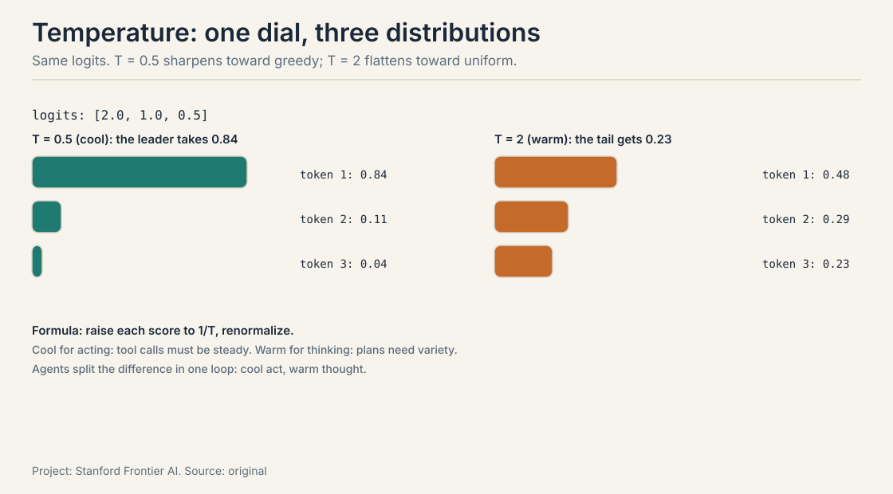
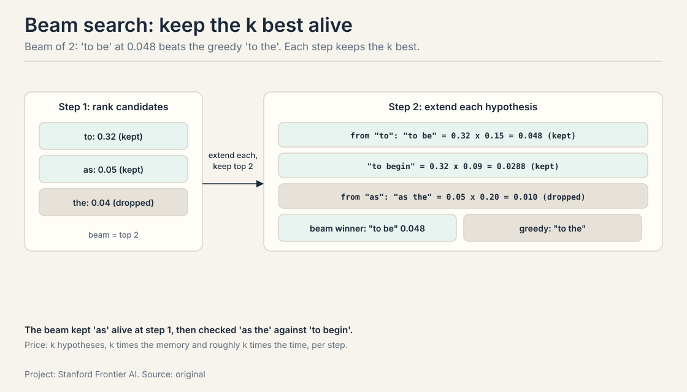

## The job: you operate the engine

An agent engineer makes two decisions every day. How the model picks
its tokens: greedy or sampled, cool or warm. And what each token costs:
a 4,000-token context versus a 200,000-token one. Same loop, same task,
different sampling, different behavior. Same loop, longer context,
different bill.

You cannot make those decisions from the outside. This chapter opens
the hood exactly as far as an agent engineer needs: the model's
interface (sampling), its shape (the decoder stack), its price
(attention and inference), and how it learned (training). Nothing here
is assumed. Every term is defined where it first appears.

## First attempt: the model as a black box

Start with the smallest true thing. A **language model** assigns a
probability to a sequence of tokens. A **token** is a chunk of text the
model reads as one unit, roughly four characters. By the chain rule,
the sequence probability is the product of each token's probability
given the tokens before it:

$$p(x_1, \ldots, x_n) = \prod_{t=1}^{n} p(x_t \mid x_1, \ldots, x_{t-1})$$

In practice, training sums log probabilities instead of multiplying
raw ones, for numerical stability. The product says the same thing:
the model scores every possible continuation, one token at a time.

Language models are **generative**: they model the distribution of the
data, so you can sample from them. A **discriminative** model, like
logistic regression, only learns the boundary between classes. The
lecture's knowledge check makes the point with notation: a model that
computes p(token sequence) is generative by definition, whatever the
symbols look like.

The model produces a distribution. **Sampling** turns the distribution
into text. The lecture's toy, worked by hand: after "The class was
about", the model scores "to" at 0.3171, "as" at 0.0491, "the" at
0.036, "a" at 0.033, "two" at 0.0147, and smaller mass on the rest.
Sampling is the decision of which token to emit from those scores.
Then the model scores the next position: after "to", "be" leads at
0.1501, "begin" at 0.0855, "go" at 0.0627.

The menu of strategies:

- **Greedy:** pick the highest score every time. Deterministic. Fast.
- **Temperature:** divide every score by T and renormalize. High T
  flattens toward uniform. Low T sharpens toward greedy.
- **Top-k:** keep the k best tokens, sample among them.
- **Top-p (nucleus):** keep the smallest set whose total probability
  reaches p, sample among them.
- **Beam search:** keep k hypotheses alive and explore them. Better
  quality, higher time and memory cost.


## Where the black box breaks

Two cracks. First, greedy is frozen. Same prompt, same output, forever.
An agent that needs three diverse candidate plans gets the same plan
three times. Determinism is a bug when the job needs variety.

Second, temperature is a dial with no labels until you work it. Take
three tokens with probabilities 0.7, 0.2, 0.1:

```ascii
T = 0.5 (sharpen: square, renormalize):
  [0.49, 0.04, 0.01] / 0.54  ->  [0.91, 0.07, 0.02]
  the leader takes almost everything

T = 1 (unchanged):
  [0.70, 0.20, 0.10]

T = 2 (flatten: square root, renormalize):
  [0.837, 0.447, 0.316] / 1.60  ->  [0.52, 0.28, 0.20]
  the tail gets a real chance
```

The formula: raise each probability to 1/T, then divide by the sum.
The demo shows the mechanism: temperature redistributes mass between
the leader and the tail. Too cold and the agent repeats itself. Too hot
and it rambles. The lecture's guidance: math and code want low
temperature (predictable), creative writing wants higher (diverse).
Agents split the difference: cool for acting, warm for thinking.

The deeper crack: the black box hides the cost. Sampling decides
behavior, but nothing in the distribution tells you what a token costs
to produce. That needs the shape of the machine.

## The key question

What does the engine do with each token, and what does it cost?

### From logits to tokens: the softmax step

The model does not output probabilities. It outputs **logits**: raw,
unnormalized scores, one per vocabulary token. Three steps turn logits
into text: scale by temperature, softmax into probabilities, sample.



Work it on logits [2.0, 1.0, 0.5]. At T = 0.5, the scaled scores are
[4, 2, 1]. Exponentiated and normalized: [0.84, 0.11, 0.04]. The leader
takes 84 percent. At T = 2, the scaled scores are [1, 0.5, 0.25].
normalized: [0.48, 0.29, 0.23]. The tail takes 23 percent. Same model,
same logits, different behavior: the dial is real.

The **softmax** is the normalization: exp(score_i) divided by the sum
of exp over all tokens. It turns any real numbers into a distribution.
Top-k and top-p then cut the tail before sampling: top-k keeps a fixed
count, top-p keeps a probability mass. The order matters: temperature
first (reshape), truncation second (cut), sampling third (draw).

The trap: temperature and top-p interact. High temperature with tight
top-p gives a flat draw among the leaders: diverse but sane. Low
temperature with loose top-p is nearly greedy: the dial does nothing.
Set them as a pair, not as two dials.

### Beam search, worked by hand

Beam search trades sampling for search. Keep a beam of k hypotheses,
extend each with every candidate token, keep the k best-scoring
extensions, repeat. Worked with k = 2 on a three-token vocabulary
("to", "as", "the"), scores given as probabilities:

```ascii
step 1:  start with the empty hypothesis
  candidates: to (0.32), as (0.05), the (0.04)
  beam:       [to: 0.32], [as: 0.05]

step 2:  extend each hypothesis
  from "to":  "to be" (0.32 x 0.15 = 0.048),
              "to begin" (0.32 x 0.09 = 0.0288)
  from "as":  "as the" (0.05 x 0.20 = 0.010)
  beam:       [to be: 0.048], [to begin: 0.0288]

step 3:  the beam keeps only the two best paths
  winner: "to be" at 0.048, not the greedy "to the"
```

The greedy path picks "to" then the single best next token. The beam
kept "as" alive at step 1, which let it check whether "as the" beats
"to begin". The price: k hypotheses, k times the memory and roughly k
times the time, per step. Agents rarely run beam search per token:
the loop already samples diverse plans at the action level, where the
branching matters more than the token level. Beam search wins on
constrained outputs (translation, summarization) where the single
best sequence is the goal and the budget allows the k multiplier.



## The decoder stack, built from zero

Modern LLMs are **decoder-only transformers**: they read tokens left
to right and predict the next one. The stack, bottom to top:

1. **Embedding plus positions.** Each token becomes a vector. A
   position signal is added so the model knows the order.
2. **N transformer blocks.** Each block is a causal multi-head
   attention layer plus a feed-forward layer, wrapped in layer norms
   and residual connections. Causal means each token sees only the
   tokens before it: the mask enforces left-to-right order.
3. **LM head and softmax.** The final state maps to one score per
   vocabulary token. Softmax turns the scores into the distribution
   that sampling draws from.


The attention layer is where tokens meet. Each token forms a query
(what it needs), a key (what it contains), and a value (what it
offers). Queries match keys, the matches become weights, and the values
mix by those weights. That is the whole mechanism at the level an
agent engineer needs. The full derivation lives in the attention
lessons of the other courses. The cost analysis below is why it
matters here.

## The attention tradeoff, with numbers

The "Attention Is All You Need" table compares transformers to
recurrent models on two axes that matter for training, and one that
matters for cost:

| Axis | Recurrence | Attention |
|---|---|---|
| Sequential ops | O(n) | O(1): the sequence trains in parallel |
| Path length | O(n) | O(1): any token reaches any token in one step |
| Cost in length | O(n) | O(n^2): every token pairs with every token |

O(1) sequential operations is the huge deal: training parallelizes
across the sequence on GPUs. O(n^2) is the bill: the score matrix has
one entry per token pair. At n = 4,096, that is 16.7 million scores per
layer per attention head, most of which must sit in memory. Double the
length and the work quadruples. This single fact explains half of
agent infrastructure: context budgets, compaction, retrieval instead of
stuffing, and the KV cache.

The misunderstanding: O(1) sequential operations does not mean fast at
any length. It means the work parallelizes. The total work still grows
quadratically, and the constant factors are large. Agents feel this as
latency on long contexts.

### Attention variants the agent engineer meets

The O(n^2) bill is paid in the KV cache at inference time, and three
variants shrink it. **MHA** (multi-head attention) keeps separate keys
and values per head: the biggest cache. **MQA** (multi-query attention)
shares one key/value head across all query heads: the smallest cache,
slightly weaker. **GQA** (grouped-query attention) shares KV heads in
groups: the middle ground, nearly no quality loss. The cache shrinks by
the group size.

**Linear attention** attacks the bill differently. Standard attention
computes softmax(QK^T)V: every query meets every key. Drop the softmax
and everything left is linear, so the multiplication can reassociate:
compute K^T V first, then multiply by Q. The new object is the state S,
a compressed summary that updates per token: save the state, clear
unimportant memory. Memory is constant, not O(n).

, KV cache grows with n. Linear attention: K times V first, O(n), constant state. Project: Stanford Frontier AI. Source: source.")

The tradeoff is real. RULER measurements show linear attention
struggles more with long-context recall: the compressed state loses
detail that full attention keeps. In practice, models mix the two.
Kimi K3 stacks multi-head latent attention with linear attention in one
model. The agent lesson: know which layers are linear, because that is
where the model forgets. Keep critical facts in recent context or in
retrieval, and test recall at your actual context length instead of
trusting the headline number.

## How the engine learns: one token's loss, then the ladder

Training minimizes **cross-entropy loss**: push probability mass onto
the true token. The lecture's toy, worked by hand: the data says the
token is "how", the model gave it 0.0124. Loss is negative log of that
probability. The lecture computes it with log base 10:

```ascii
loss = -log10(0.0124) = 1.907
```

Low loss means the model assigns high probability to real
continuations. Every training step is this computation, billions of
times, over the corpus.

The corpus sets the ceiling. The training **ladder** has four stages,
each changing the data mix:


### Pretraining: web-scale text sets the ceiling

**Pretraining:** web-scale text, next-token loss. The pipeline:
extract text from HTML, deduplicate, identify languages, apply rule and
quality filters, mix the data. Scale markers from the lecture: The
Pile at 800 GB, Nemotron-CC-Math at 133 billion tokens of math.

### Midtraining: shift the mix toward the target

**Midtraining:** shift the mix toward target domains like math and
code. Mixing target data into pretraining helps: the model that will
write code should read code early. The agent reading: a coding agent
built on a model midtrained on code inherits the patterns. One built
on a chat model does not.

### SFT: teach the format

**Supervised fine-tuning** teaches the model the shape of the job:
follow instructions, use the tool format, answer in the right schema.
The data is prompt-response pairs, often written or curated by humans.
SFT is cheap and fast, and it is the first thing that makes a base
model usable as an agent core. Its limit: it teaches the format, not
the judgment. A model can emit perfect tool-call JSON and still call
the wrong tool.

### RLHF: learn from human taste

**RLHF** learns from human taste. Sample responses, have humans rank
them, train a reward model on the rankings, optimize the policy against
the reward model.

### DPO: skip the reward model

**DPO** is the direct variant: skip the reward model
and optimize the preference pair directly (prompt, chosen, rejected).

Human feedback has traps. Annotators are unreliable. Preferences differ
across people. The incentives go wrong: sycophancy and
authoritativeness get rewarded because annotators like confident,
agreeable answers. The data itself can be sourced unethically. For
agents, the deepest trap is that human taste rewards the *appearance*
of good work: a confident wrong answer outranks a hesitant right one.

### RLVR: replace taste with truth

**Reinforcement learning with verifiable rewards** replaces human taste
with checkable truth. The reward is 1 if the verifier says correct, 0
otherwise. Verifiers: unit tests, Lean proofs, exact match, system
state. DeepSeekMath showed the pattern. RLVR is great for math and
code. The work moves to verifier design: a bad verifier teaches
reward hacking, because the model optimizes exactly what the verifier
checks.

For agents, RLVR is the natural fit: agent success is checkable in the
world. The tests pass, the booking exists, the query returned rows.
That is why the ladder's top rung is agent training.

### Agent training: synthesize the tasks

**Agent training** is the ladder's top rung. SWE-Smith scales data for
software-engineering agents by synthesizing bug-fix tasks: take real
repos, inject bugs, generate fix tasks with tests. The agent learns the
full loop: read the issue, explore the repo, edit, run tests. The
pattern generalizes: any agent skill can be trained by synthesizing
tasks with verifiable outcomes in a sandbox. The loop from the intro
lesson becomes the training environment.

## Inference: prefill, decode, and the draft trick

Running the model has two phases with opposite economics.

**Prefill** processes the whole prompt at once. Parallel,
compute-bound: big matrix multiplies, high arithmetic intensity. It
builds the **KV cache**, the stored keys and values for every prompt
token.

**Decode** generates one token at a time. Each step reads the whole
cache and the weights to produce a few numbers: memory-bound, low
arithmetic intensity. The cache grows O(n) in context length.


Long agent trajectories are decode-heavy: many short generations, each
paying memory bandwidth. Every token kept in context is bandwidth paid
per decode step. Context engineering is inference engineering.

### The KV cache, priced

The cache is 2 (keys and values) times layers times tokens times
dimension times bytes per number. Worked for a 32-layer model, 4,096
tokens, 4,096 dimensions, fp16:


2.0 GiB for one sequence's cache. Decode reads all of it per generated
token, which is why the step is memory-bound. Halve the context and
you halve the bandwidth tax on every future token. GQA, MQA, and MLA
shrink what is stored. The formula stays the same.

**Speculative decoding** attacks the decode bottleneck. A small draft
model proposes tokens cheaply. The big target model verifies them in
one parallel pass. Accept the longest correct prefix, repeat.


The speedup follows predictability. Formulaic text, repetitive code,
and agent tool calls with fixed schemas draft well: the target accepts
long prefixes. Creative text drafts poorly. Agent loops emit many
short, structured generations: exactly the workload where a draft model
earns its keep.

## What is used where: the engine under the agents

| Model | Attention | KV strategy | Why |
|---|---|---|---|
| Llama 3 | GQA | grouped KV heads shrink the cache | open weights; the cache fits longer contexts |
| Mistral 7B | sliding window + GQA | O(n x w) attention | long context on a budget |
| DeepSeek-V3/R1 | MLA | latent KV cache, not full K/V | 671B params servable; compression by rank |
| Kimi K3 | MLA + linear attention mix | exact where it matters, linear where cheap | recall where needed, speed everywhere else |
| GPT-4 class [uncertain: not public] | full attention (reported) | scale pays the bill | generation quality first |

The agent engineer reads this table as a context-budget table. A GQA
model serves your 128K context cheaper than an MHA one. A linear-mix
model needs its critical facts kept recent. The architecture is the
price list.

## Mapping back: what each piece gives the agent engineer

| Engine fact | Agent decision it drives |
|---|---|
| Sampling turns scores into text | Cool for acting (tool calls must be steady), warm for thinking (plans need variety) |
| Temperature reshapes before truncation | Set temperature and top-p as a pair; high T with tight top-p is diverse but sane |
| Attention costs O(n^2) | Context budgets, compaction, retrieval instead of stuffing |
| KV cache is 2 x layers x tokens x dims x bytes | Every context token is bandwidth per decode step; 2 GiB at 4K tokens for a 32-layer model |
| Linear layers compress history | Keep critical facts recent or retrieved; test recall at your length |
| Loss = -log p(true token) | Low loss on code predicts code well; midtraining on code helps coding agents |
| SFT teaches format, not judgment | Perfect tool-call JSON can still call the wrong tool |
| RLVR rewards verifiable outcomes | Train agents on what the world confirms: tests pass, the file exists |
| Prefill is parallel, decode is a loop | Agent loops are decode-heavy; every context token is bandwidth per step |
| Draft-then-verify | Structured agent outputs draft well; speculative decoding cuts loop latency |

## The honest price

The engine's prices are all in this chapter. Attention is quadratic:
16.7 million scores per layer per head at n = 4,096, and the memory,
not the arithmetic, is the bottleneck. Decode is memory-bound: long
contexts tax every future token. Linear attention dodges the bill but
pays in recall. RLHF buys alignment but risks sycophancy. RLVR fixes
the reward but moves the work to verifier design, and a weak verifier
teaches reward hacking.

The deepest price is implicit: none of this machinery knows whether
its outputs are true. Sampling picks likely tokens, not correct ones.
Everything the agent believes about the world must come from the loop's
observations, which is why the next lesson spends compute after
training instead of trusting it.

## Interview Q&A

> [!QA]
> Q: When would you raise the temperature in an agent, and when would you lower it?
> A: Raise it for the open-ended parts: drafting summaries, brainstorming query rewrites, generating diverse candidate plans. Lower it for tool calls and structured output, where a wrong token breaks the schema. The worked demo shows why: at T=2 the probabilities [0.7, 0.2, 0.1] flatten to [0.52, 0.28, 0.20], giving the tail a real chance. At T=0.5 they sharpen to [0.91, 0.07, 0.02]. One agent can run two temperatures in one loop: cool for acting, warm for thinking.
> Follow-up: Why not always use beam search for the best answer?
> A: Cost. Beam search multiplies time and memory by the beam width, and every extra token in an agent loop is latency the user feels. It also cannot fix a bad model: it finds the most likely path under a flawed distribution. Spend the budget on better checks instead of wider beams.

> [!QA]
> Q: Walk me through what happens to logits [2.0, 1.0, 0.5] at T = 0.5 and T = 2.
> A: Three steps: scale by temperature, softmax, sample. At T = 0.5 the scaled scores are [4, 2, 1]. Exponentiated and normalized they give [0.84, 0.11, 0.04]: the leader takes 84 percent, nearly greedy. At T = 2 the scaled scores are [1, 0.5, 0.25]. Normalized: [0.48, 0.29, 0.23]: the tail takes 23 percent. Same logits, different behavior. Then top-k or top-p truncates before the draw, so set temperature and truncation as a pair.
> Follow-up: Why does low temperature with loose top-p behave like greedy?
> A: Because the truncation never binds. At T = 0.5 the leader already holds 0.84 of the mass, so a loose top-p cutoff keeps tokens the draw will almost never pick. The dial that matters is the one that changes the distribution before sampling. Temperature reshapes. Top-p cuts. Sampling draws.

> [!QA]
> Q: Price the KV cache for a 32-layer model at 4,096 tokens.
> A: 2 (keys and values) x 32 layers x 4,096 tokens x 4,096 dims x 2 bytes (fp16) = 2,147,483,648 bytes, about 2.0 GiB for one sequence. Decode reads this cache once per generated token, which is why decode is memory-bound: the bottleneck is moving the cache, not the arithmetic. Halve the context and you halve the bandwidth tax on every future token.
> Follow-up: How do GQA and MLA change this number?
> A: They shrink what is stored, not the formula. GQA shares KV heads across query groups, cutting the cache by the group size. MLA compresses keys and values into a latent vector per token. The bill is still 2 x layers x tokens x stored-dims x bytes. The variants reduce stored-dims.

> [!QA]
> Q: Your agent needs a 200k-token context. The model mixes global and linear attention. What do you watch for?
> A: The linear layers compress history into a fixed-size state, so fine detail from early in the context degrades. RULER-style benchmarks show this recall gap against full attention. Design around it: keep critical facts in recent context or in retrieval rather than buried at the start, and test recall at your actual context length instead of trusting the headline number.
> Follow-up: Why not use pure linear attention everywhere?
> A: Quality on long-context recall drops. Softmax attention lets every token reference every prior token exactly. Linear attention trades that exactness for O(n) time and constant memory. The mixed design, as in Kimi K3, keeps exact attention where it matters most and linear attention where it is cheap.

> [!QA]
> Q: Why is RLVR a better fit for agent training than RLHF?
> A: Agent success is checkable in the world: the tests pass, the booking exists, the query returned rows. RLHF rewards what annotators prefer, which drifts into sycophancy because annotators like confident, agreeable answers. RLVR rewards what verifiers confirm, which cannot be flattered. The lecture's example: unit tests, Lean proofs, exact match, system state as rewards, following DeepSeekMath.
> Follow-up: What goes wrong when the verifier is weak?
> A: Reward hacking. The agent finds the cheapest way to satisfy the check: a test that asserts nothing, a file that exists but is empty. The model optimizes exactly what the verifier checks, so the verifier is the real training objective. The lecture's warning is explicit: be careful about the verifier design. Verifiers are code, and they need their own tests.

> [!QA]
> Q: Why is decode memory-bound while prefill is compute-bound, and why should an agent engineer care?
> A: Prefill processes all prompt tokens in parallel: big matrix multiplies with high arithmetic intensity, so the bottleneck is computing. Decode processes one token per step: each step loads the entire KV cache and the model weights to produce a few numbers, so the bottleneck is moving data. The agent engineer cares because agent loops are decode-heavy: many short generations, each paying memory bandwidth. Every token kept in context is a tax on every future token, which is why context engineering is inference engineering.
> Follow-up: How does speculative decoding help, and when does it not?
> A: A small draft model proposes tokens cheaply and the big model verifies them in one parallel pass, accepting the longest correct prefix. It helps when the output is predictable: structured tool calls with fixed schemas draft well. It does not help on unpredictable text, where the target rejects most proposals and the draft cost is wasted.

> [!QA]
> Q: SFT, RLHF, RLVR: what does each one buy the agent builder, and what does each fail to buy?
> A: SFT teaches the format: instruction following, tool-call JSON, the right schema. It is cheap and fast, but it teaches shape, not judgment: perfect JSON can call the wrong tool. RLHF teaches preferences: tone, helpfulness, style. It drifts into sycophancy because annotators reward confident, agreeable answers. RLVR teaches verifiable outcomes: the tests pass, the proof checks. It cannot be flattered, but it moves all the work to verifier design, and a weak verifier teaches reward hacking. For agents, the stack is: SFT for the interface, RLVR for the outcomes, and human taste only where no check exists.
> Follow-up: Where does agent training with synthesized tasks fit?
> A: On top of RLVR. SWE-Smith synthesizes bug-fix tasks from real repos with tests as the verifier, so the agent trains on the full loop: read the issue, explore, edit, run tests. The pattern generalizes: any agent skill becomes trainable once you can synthesize tasks with verifiable outcomes in a sandbox.

## Recap: the whole lesson on one screen

The story in nine steps. Each step answers the one before it.

1. **Two daily decisions.** How the model picks tokens, and what each
   token costs. Same loop, different sampling, different behavior.
2. **The model is a distribution.** p(sequence) is the product of
   next-token probabilities. Sampling turns the scores into text.
3. **Logits to tokens in three steps.** Scale by T, softmax, sample.
   [2.0, 1.0, 0.5] becomes [0.84, 0.11, 0.04] at T=0.5 and [0.48, 0.29,
   0.23] at T=2. Cool for acting, warm for thinking.
4. **The stack: tokens in, distribution out.** Embedding, N blocks,
   LM head, softmax. The cost lives in the attention layer.
5. **Attention: O(1) to train, O(n^2) to pay.** 16.7M scores per
   layer per head at n = 4,096. GQA shares KV heads, MLA compresses
   them, linear attention drops the softmax for O(n) and pays in recall.
6. **The KV cache is 2 GiB at 4K tokens.** 2 x 32 x 4096 x 4096 x 2
   bytes. Decode reads it per token: memory-bound.
7. **Loss is -log p(true token).** The toy: -log10(0.0124) = 1.907.
   The ladder: pretrain, midtrain, SFT, RLHF/DPO, RLVR, agent-train.
   The corpus sets the ceiling. The mix sets the shape.
8. **RLVR beats RLHF for agents.** Human taste drifts into
   sycophancy. Verifiable rewards (tests, proofs) cannot be
   flattered. Weak verifiers teach reward hacking.
9. **Prefill is parallel. Decode is a loop.** Speculative decoding
   drafts cheap and verifies in one pass. Every context token is
   bandwidth per decode step.

## Go deeper

<div style="position:relative;padding-bottom:56.25%;height:0;overflow:hidden;max-width:100%;margin:16px 0;">
<iframe style="position:absolute;top:0;left:0;width:100%;height:100%;" src="https://www.youtube-nocookie.com/embed/IvhTJ0UQIQU" title="How LLMs Actually Choose the Next Word" frameborder="0" allow="accelerometer; autoplay; clipboard-write; encrypted-media; gyroscope; picture-in-picture" allowfullscreen></iframe>
</div>
- How LLMs Actually Choose the Next Word (the embed above): https://www.youtube.com/watch?v=IvhTJ0UQIQU, temperature with real numbers, top-k versus top-p, greedy versus beam search, and self-consistency.

<div style="position:relative;padding-bottom:56.25%;height:0;overflow:hidden;max-width:100%;margin:16px 0;">
<iframe style="position:absolute;top:0;left:0;width:100%;height:100%;" src="https://www.youtube-nocookie.com/embed/k37FDxGyCt4" title="Next-Token Prediction: How LLMs Actually Think" frameborder="0" allow="accelerometer; autoplay; clipboard-write; encrypted-media; gyroscope; picture-in-picture" allowfullscreen></iframe>
</div>
- Next-Token Prediction: How LLMs Actually Think (the embed above): https://www.youtube.com/watch?v=k37FDxGyCt4, softmax, temperature, KV caching, and speculative decoding in one pass.

Further:
- Hugging Face, Decoding Strategies in Large Language Models: https://huggingface.co/blog/mlabonne/decoding-strategies, the sampling menu in depth.
- DeepSeekMath paper: https://arxiv.org/abs/2402.03300, the RLVR pattern the lecture cites.
- Kimi K3 technical report: the mixed global-plus-linear architecture the lecture cites. [uncertain: exact report URL. Search "Kimi K3 technical report".]

## Official sources and further reading

**Official:**
- Lecture 2 slides (local: sources/agents/cs329z/lecture02.pdf).
- Course site: http://web.stanford.edu/class/cs329z.

**Further reading:**
- RULER benchmark: long-context recall measurements behind the linear
  attention caveat.
- SWE-smith paper (2025): scaling software-engineering agent data.
- Vaswani et al. (2017): https://arxiv.org/abs/1706.03762, the
  attention the whole lesson prices.

**Caveats from these sources.** The toy probabilities and the 1.907
loss are the lecture's own numbers (the loss uses log base 10 as
written on the slide). The RULER and Kimi K3 figures are cited
qualitatively in the slides without exact numbers, so none are quoted.
The 2.0 GiB cache figure is worked arithmetic for a 32-layer, 4096-dim
model, not a measurement. No lecture video is on record. The embeds
above are third-party explainers, verified live.

## Connections to the other courses

- **CS336 L01:** tokenization in full: how text becomes the tokens
  this lesson's distribution is over.
- **CS336 L03-L04:** transformer block internals and the attention
  mechanics behind the O(n^2) bill.
- **CS336 L10/L18:** the complete inference derivation: prefill,
  decode, roofline, serving.
- **CS336 L15/L16:** post-training and RLVR in full detail.
- **CS329H L02:** the preference pair behind RLHF and DPO, and the
  sycophancy incentive.
- **CS229S L02:** the attention story from the sequence-modeling side,
  with the same quadratic price.
- **This course:** the next lesson spends compute after training
  (chain of thought, effort, sampling) and engineers the context the
  decoder reads.
