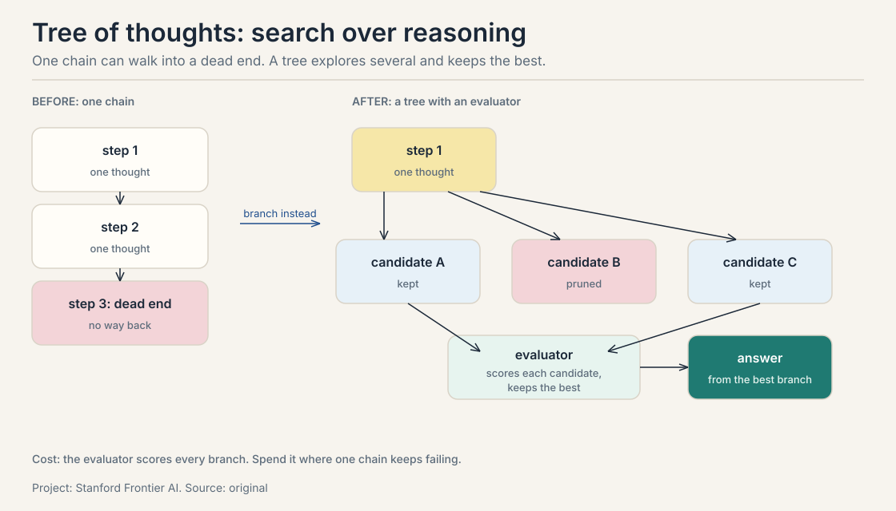
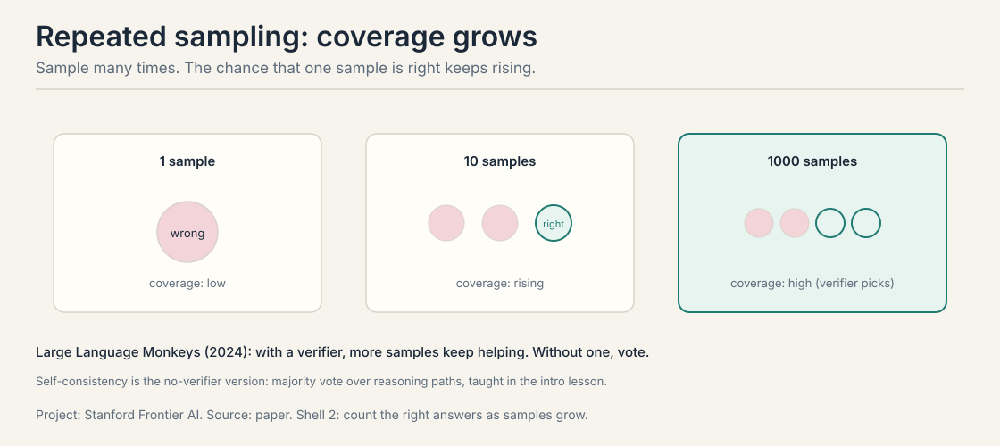
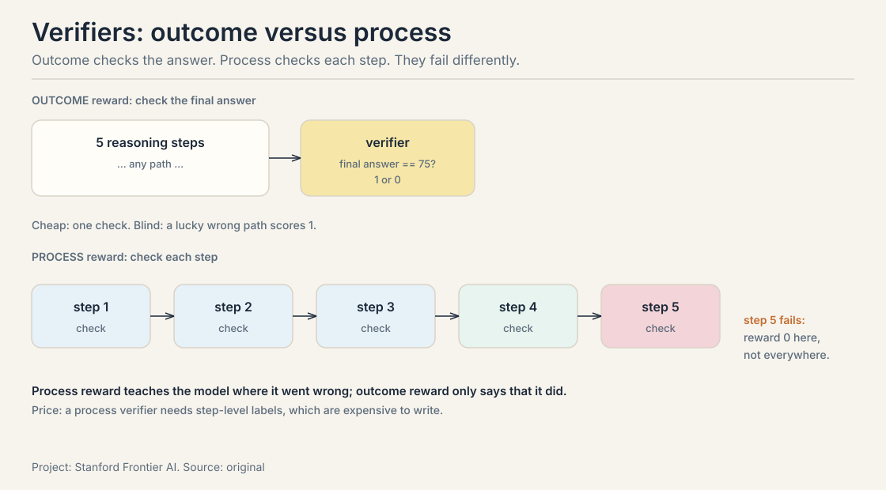
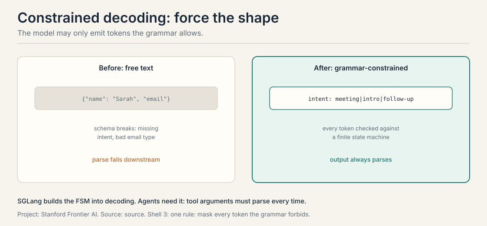
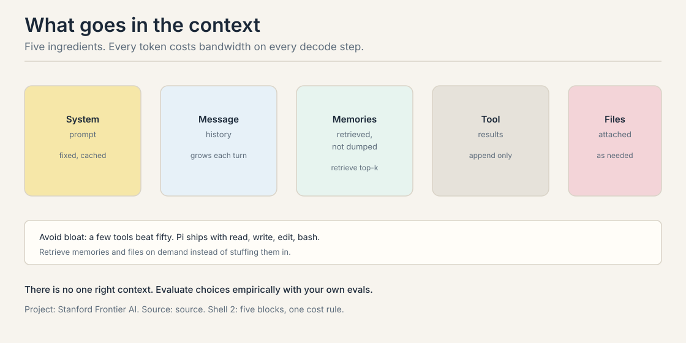
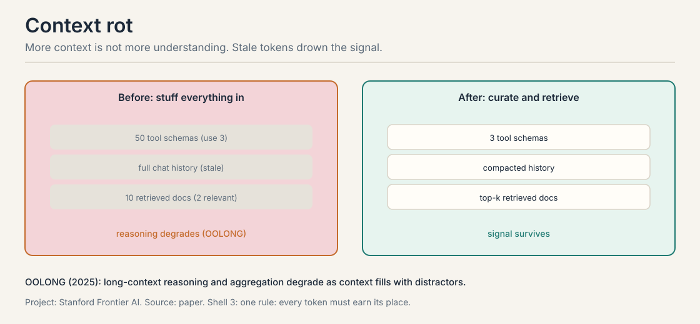
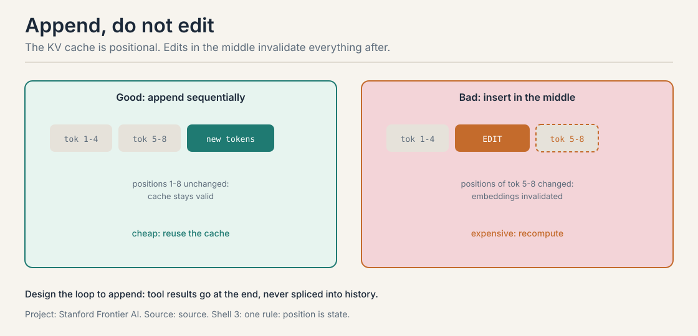
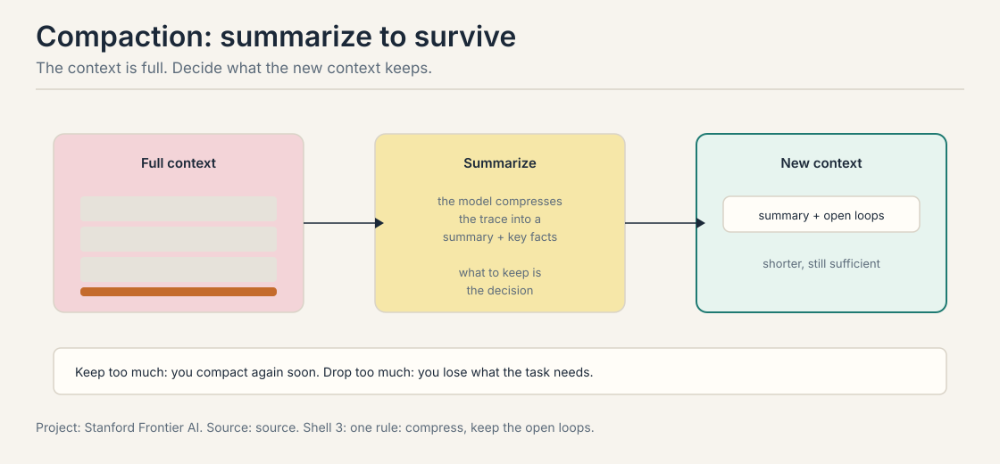
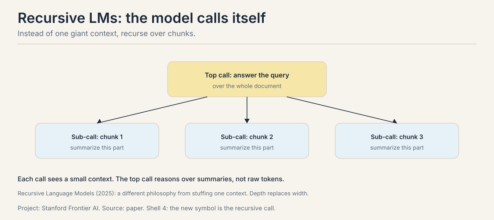

## The job: training is frozen, queries are not

Training happens once. Queries arrive forever, and they vary in
difficulty. "What is 2+2" and "debug this race condition" should not
cost the same. **Inference-time scaling** spends compute after
training, per query: more tokens for the hard ones, fewer for the easy
ones.

The lecture's toy makes the case. A jacket costs $80. The store raises
its price by 25 percent, then offers a 25 percent discount on the new
price. What is the final price?

## First attempt: answer directly

The direct answer pattern-matches: adding 25 percent and subtracting 25
percent looks like no change. So $80.

```ascii
+25% then -25%  ->  looks like cancellation  ->  $80
```

Wrong. The two percentages use different bases. The increase applies
to $80. The discount applies to the increased price. The pattern
"cancels out" is a mirage, and the direct answer walks into it with
full confidence.

## Where direct answers break

Work the arithmetic the direct answer skipped:

```ascii
increase:  $80 x 1.25 = $100   (25% of $80 is $20)
discount:  $100 x 0.75 = $75   (25% of $100 is $25)
check:     $80 + $20 - $25 = $75
```

The true answer is $75. The direct answer is off by $5, a 6.25 percent
error from a confident pattern match. The mistake is invisible without
the intermediate numbers. Each step of the worked version is a small,
checkable claim: $80 to $100, $100 to $75. The direct answer has no
steps to check.

## The key question

What if the model writes the steps, and we spend compute on the steps
that need it?

## Chain of thought: working memory, not smarts

**Chain of thought** (Wei et al., 2022) elicits the reasoning steps
before the answer. The model writes the intermediate math, and the
intermediate math is checkable. The jacket trace above is the whole
idea: $80 x 1.25 = $100, $100 x 0.75 = $75, check the bases.

The misunderstanding: chain of thought does not make the model
smarter. It gives the model working memory. Each step is a small claim
the model commits to in text, where a verifier or a human can catch it.
And the failure mode: long traces on ambiguous questions accumulate
confident-sounding errors. The steps are in the open, but open errors
are still errors. The fix is the same as in agents: verify the steps,
do not just admire them.

### Tree of thoughts: search over reasoning

Chain of thought walks one path. **Tree of thoughts** (Yao et al.,
2023) branches: at each step, generate several candidate thoughts,
score them with an evaluator, keep the best, and continue. Search over
reasoning steps, not just tokens.



The evaluator is the load-bearing part. It can be the model itself
("is this step promising?"), a learned value function, or a hard check
("does this partial solution still satisfy the constraints?"). The cost
is the evaluator: every branch scored is tokens spent. The decision
rule: reach for the tree when one chain keeps walking into dead ends
on the same problem class. For problems where the first path usually
works, the tree is expensive insurance.

## The effort dial

Reasoning models expose an **effort** setting: low, medium, high. Low
is cheap and fast for simple lookups. High spends many tokens on hard
math and deep bugs. The system prompt sets it per query.


Kimi K3 trains the dial explicitly with a budget-aware reward:

```ascii
correct answer:               reward = +1
wrong answer:                 reward =  0
wrong AND over the budget:    reward = -1
```

Read what the -1 teaches. A wrong answer already scores 0. A wrong
answer that also burned the budget scores -1: worse than being wrong
cheaply. The model learns two lessons at once: be right, and do not
spend effort where it does not pay. That is the dial, learned.

The K3 technical report (Moonshot AI, "Reasoning Effort RL") describes
the full scheme: each problem x gets a token budget b0(x) estimated
from the cold-start model, and any trajectory whose total token cost
T(y) exceeds a scaled threshold tau times b0(x) has its task reward
overridden to -1. Training anneals tau from large to small, producing
max, high, and low effort experts that are distilled into one model
which reads the effort level as an instruction. The lesson's +1/0/-1
table is the scheme's shape at one tau. The report adds the annealing
that turns one dial into three gears.

The agent lesson: set effort per step, not per agent. A file lookup
gets low effort. A tricky bug gets high effort. The loop already knows
which steps are hard: the ones that failed before.

## Repeated sampling: the verifier is the scarce resource

Sample the same prompt N times. With a verifier, pick the best.
**Coverage**, the chance that at least one sample is right, keeps
rising with more samples. Large Language Monkeys (Brown et al., 2024)
shows inference compute keeps helping far past intuition. The math of
coverage, worked on a toy: if each sample succeeds with probability
0.3, ten samples give 1 - 0.7^10 = 0.97. Ninety-seven percent coverage
from a thirty-percent model, provided the verifier can spot the winner.



Without a verifier, vote. **Self-consistency** is the no-verifier
version: sample many reasoning paths, take the majority answer. The
cost is linear in samples either way. The agent version: sample three
candidate plans, execute the best-scoring one. Sampling is cheap.
Checking is dear. The verifier is the scarce resource, which is why
the builders lesson spent so long on verifier design.

### Verifiers: outcome versus process

A verifier checks work. Two kinds, and they fail differently. An
**outcome** verifier checks the final answer: 75 or not, 1 or 0.
A **process** verifier checks each step: which step went wrong.



Outcome reward is cheap: one check at the end. It is also blind: a
lucky wrong path scores 1, and the model learns nothing about where
it succeeded. Process reward teaches the model where it went wrong,
step by step, but it needs step-level labels, which are expensive to
write. The builders lesson's RLVR is outcome reward at scale. Process
supervision is the premium version teams buy when outcome reward
plateaus. For agents, the check step of the loop is usually an outcome
verifier (tests pass), and the debugging skill is process verification
done by hand.

## Mapping back I: what inference-time compute buys

| Direct-answer crack | The answer | How |
|---|---|---|
| Pattern-match says $80 | Chain of thought | The steps $80 to $100 to $75 expose the base change |
| One chain walks into dead ends | Tree of thoughts | Branch, score with an evaluator, keep the best |
| Every query costs the same | Effort dial | Low for lookups, high for hard bugs; Kimi K3's -1 teaches the budget |
| One shot, one chance | Repeated sampling | 1 - 0.7^10 = 0.97 coverage from a 0.3 model, with a verifier |
| The verifier only sees the answer | Process reward | Check each step; teach where it went wrong |

The honest price of this half: tokens are money and latency. A small
model with a big inference budget can beat a big model with none, but
the budget is real. Spend it where the errors are.

## The second contract: structured output

Agents are programs, and programs need contracts. The model's output
goes to a parser, a tool, or another agent. Free text breaks the
contract: plausible-looking JSON with a missing field, a wrong type, a
trailing comma. The parser fails downstream and the loop burns a turn.

**Constrained decoding** enforces the contract at generation time. The
decoder may only emit tokens the grammar allows. SGLang implements this
with finite state machines built into decoding. Every token is checked
against the grammar as it is generated. The output always parses.



This is the validate stage of the tool call, moved into the decoder
itself. The cost: the grammar must be written, and constrained decoding
adds overhead per step. The benefit for agents is decisive: tool
arguments must parse every time. What constrained decoding cannot fix
is semantics. The output parses but can still be wrong: a valid tool
call with the wrong arguments, a well-formed plan that misunderstands
the goal. The grammar constrains shape, not meaning. Meaning needs the
check step.

**DSPy** (Declarative Self-improving Python) declares the contract one level up. A **signature** names the
input and output fields of a model call, and DSPy compiles the prompt
that implements it. The lecture's example extracts contact info:

```ascii
input:  "I'm Sarah (sarah@acme.co). Meet Thursday?"
output fields:
  name:   str
  email:   Union[str, None]     <- must match the JSON schema
  intent:  Literal['meeting',
            'intro', 'follow-up']  <- exact match, no extra chars
```

The compiled prompt wraps each field in markers and states the type
constraints in prose. The signature is the contract. The compiled
prompt is the implementation. Two lighter constraining tools: a small
classifier head on embeddings for fixed label sets (cheap, fast, no
generation), and the Toolformer pattern, where the tool's argument
schema is the structured output.

### Structured output in production

The providers productized this contract. OpenAI's structured outputs
and Anthropic's tool-use schemas both guarantee JSON matching a given
schema: the grammar approach, as an API feature. The decision rule for
builders: use the provider's structured output for tool calls and
handoff payloads (the shape must hold every time), and reserve
full constrained decoding (SGLang, Outlines, Guidance) for grammars
the API cannot express: nested conditionals, custom DSLs, exact-length
fields. Shape is a solved problem at the API layer. Spend your
engineering on meaning.

## The third contract: the context

**Context engineering** is the design of what the model sees. Five
ingredients: the system prompt, the message history, memories, tool
call results, and attached files.



Three practical rules from the lecture. **Avoid bloat:** a few tools
beat fifty. Pi (Mario Zechner's minimal terminal coding agent,
defined in the compound-systems lesson) ships with four: read, write, edit, bash. **Retrieve on
demand:** fetch the relevant memories and files when needed instead of
stuffing them in. **Evaluate empirically:** set up a small eval set and
test each context choice. There is no one right context. The context is
a design surface, not a dumping ground.

### Where stuffing breaks: context rot

More context is not more understanding. **OOLONG** (Bertsch et al.,
2025, arXiv:2511.02817) measures long-context reasoning and
aggregation: tasks that require analyzing chunks of text at the atomic
level and then aggregating the analyses into distributional answers.
The headline number: GPT-5, Claude Sonnet 4, and Gemini 2.5 Pro all
score below 50 percent accuracy on both task splits at 128K tokens.
Needle-in-a-haystack lets the model ignore almost the whole context
as noise. OOLONG forbids that, because the answer depends on nearly
every line. As the context fills with
distractors, the model's reasoning degrades. The lecture calls this
**context rot**.



The before state: fifty tool schemas when the task needs three, full
chat history gone stale, ten retrieved documents with two relevant.
The after state: three schemas, compacted history, top-k documents.
Same task, less rot, better answers. The mechanism is attention
dilution plus the decode cost from the builders lesson: every
distractor token is bandwidth spent on noise and a chance to mislead
the next step.

### The KV-cache placement rule

The KV cache is positional. Appending tokens at the end keeps every
existing position unchanged, so the cache stays valid. Inserting or
editing in the middle shifts positions: every token after the edit gets
new position embeddings, and their cached keys and values are wrong.



The design rule: the loop appends. Tool results go at the end of the
context, never spliced into history. Rewriting history is not just
confusing for the model. It is expensive, forcing recomputation of the
whole suffix.

### Compaction: the keep-or-drop dilemma

Long trajectories fill the context. **Compaction** summarizes it: the
model compresses the trace into a summary plus key facts, and the new
context starts from there.



The decision is what to keep, and the lecture names the two failure
modes without resolving them. Keep too much and you compact again
soon: no savings. Drop too much and you lose critical context: the
task fails for lack of a fact you had. Resolution is empirical: test
what the summary must contain for your task class. In practice, keep
the goal, the open loops (what is still undone), the key facts
discovered, and the current plan. Drop stale tool outputs, superseded
plans, and dead-end attempts. The summary is a new perceive step for a
fresh loop.

### Recursive LMs: a different philosophy

**Recursive language models** (Zhang, Kraska, and Khattab, MIT
CSAIL, arXiv:2512.24601, December 2025) reject the giant context.
Instead of loading the document into the context window, the long
context is held in a REPL environment as a variable. The root model
never sees the full text. It writes small code blocks that peek at
slices, grep for keywords, and chunk the document, and it calls
sub-LMs on the chunks with questions: summarize this part, extract
the dates from this part. The top call reasons over the sub-call
results.



Each call sees a small context, so there is no rot and no quadratic
blowup. The paper's reported numbers are strong: an RLM on GPT-5
scores 91.3 percent on BrowseComp+ (reasoning over up to 11 million
tokens of documents) against 70.5 percent for a summary-agent
baseline, and improves OOLONG scores substantially. The tradeoff:
detail is lost in the summaries, errors in a sub-call propagate
silently upward, and a reproduction study flags over-recursion
latency and non-termination on ambiguous prompts. Calibrate the
recursion depth.

Compare with RAG: RAG retrieves chunks into one context. RLM recurses
over chunks with separate calls, and the model itself decides the
chunking strategy in code. Both fight the same enemy, the O(n^2)
context. RAG is retrieval plus one reader. RLM is divide and conquer
with the model as the divider.

## What is used where: inference-time in production

| Technique | Production form | The check it needs |
|---|---|---|
| Reasoning effort | o-series, DeepSeek-R1, Claude extended thinking: the dial is a product feature | none extra: the model was trained for it |
| Repeated sampling | AlphaCode 2 samples up to 1M; SWE agents sample N patches | the verifier: tests, or the task fails |
| Self-consistency | cheap accuracy boost where no verifier exists | majority vote is the check |
| Constrained decoding | OpenAI structured outputs; SGLang grammars | the schema: shape guaranteed, meaning not |
| DSPy | signatures compiled to prompts; optimizers tune them | the metric the optimizer targets |
| Context engineering | Anthropic's agent guide: the five ingredients | a small eval set per context choice |
| Compaction | long-horizon agents summarize the trace | the keep list: goal, open loops, key facts |

The pattern: every production system pairs an inference-time spend
with a check. Effort without a verifier is hope. Sampling without a
test suite is noise. The check is the scarce resource in every row.

## Mapping back II: what the contracts fix

| Context crack | The answer | How |
|---|---|---|
| Parser chokes on free text | Constrained decoding | The grammar masks every forbidden token; output always parses |
| Fifty schemas, three needed | Avoid bloat | Pi's four tools; retrieve memories and files on demand |
| Distractors degrade reasoning | Curation | Three schemas, compacted history, top-k docs; OOLONG measures the rot |
| Mid-context edits kill the cache | Append-only loop | Tool results go at the end; positions never shift |
| The trace outgrows the window | Compaction or RLM | Summarize to goals plus open loops, or recurse over chunks |

## The honest price

Inference-time compute costs tokens, and tokens are latency and money.
Chain of thought gives working memory, not intelligence, and long
traces accumulate confident errors in the open. Context rot is
measured, not hypothetical. Compaction's keep-or-drop dilemma has no
principled answer: the lecture leaves it empirical. Recursive LMs dodge
the quadratic context but let sub-call errors propagate silently. Every
contract here, shape and context both, is a bet placed per task. The
lecture's final word on context stands: experiment, and measure.

## Interview Q&A

> [!QA]
> Q: Why does chain of thought help on the jacket problem, and what does that tell you about what CoT actually is?
> A: The naive answer pattern-matches: plus 25 minus 25 looks like zero change, so $80. Writing the steps forces the model to compute each stage: 80 to 100, then 100 to 75, exposing that the discount applies to a different base. The check, $80 + $20 - $25 = $75, closes it. What this tells you: CoT is working memory, not intelligence. Each step is a small, checkable claim committed to text. It does not make the model smarter. It gives errors a place to be caught.
> Follow-up: When does chain of thought hurt?
> A: When the steps are uncheckable and the model is confident anyway. Long reasoning traces on ambiguous questions accumulate confident-sounding errors, each step building on the last. The fix is the agent's fix: verify the steps against the world or a verifier. Open errors are still errors.

> [!QA]
> Q: You have a verifier and a fixed budget. One careful high-effort sample or 50 quick samples?
> A: Usually the 50 quick samples with the verifier picking. Coverage grows fast: at 0.3 success per sample, ten samples give 1 - 0.7^10 = 0.97 coverage. High effort wins when the task needs deep sequential reasoning that quick samples never stumble into: a proof with a 20-step dependency chain, a bug that needs sustained attention. Spend the budget where the errors are: breadth when solutions are scattered, depth when they are buried.
> Follow-up: What breaks repeated sampling?
> A: A bad verifier. If the check accepts wrong answers, more samples just find more ways to be wrong. This is the verifier-design warning from the builders lesson, applied at inference time. Sampling is cheap. Checking is dear. A cheap check is worse than none because it certifies garbage.

> [!QA]
> Q: When does tree-of-thoughts beat chain-of-thought, and what does it cost?
> A: When one chain keeps walking into dead ends on the same problem class: puzzles, planning, multi-step math where an early wrong turn poisons everything after. The tree branches at each step, scores candidates with an evaluator, and keeps the best. The cost is the evaluator: every branch scored is tokens spent. For problems where the first path usually works, the tree is expensive insurance. The decision rule: reach for the tree when chains fail systematically, not when they fail once.
> Follow-up: What makes a good evaluator for the tree?
> A: A cheap, reliable signal about partial solutions: constraint checks ("does this partial plan still satisfy the requirements?"), the model itself judging promise, or a learned value function. The evaluator is load-bearing: a bad one prunes the good branches and the tree is worse than one chain. This is the verifier problem again, one level up.

> [!QA]
> Q: Outcome reward versus process reward: what does each buy?
> A: Outcome reward checks the final answer: cheap, one check, but blind. A lucky wrong path scores 1 and the model learns nothing about where it succeeded. Process reward checks each step: it teaches the model where it went wrong, but it needs step-level labels, which are expensive to write. RLVR at scale is outcome reward. Process supervision is the premium version teams buy when outcome reward plateaus. For agents, the loop's check step is usually outcome (tests pass). Debugging skill is process verification done by hand.
> Follow-up: Why is process reward not always better?
> A: Label cost and label quality. Someone must judge every step, and step-level judges disagree more than answer-level judges. Noisy process labels teach the model to game the step judge instead of solving the task. Outcome reward has one judge and one verdict. Process reward has N judges and N chances to be wrong.

> [!QA]
> Q: Why does constrained decoding matter more for agents than for chatbots?
> A: A chatbot's output goes to a human who tolerates a malformed sentence. An agent's output goes to a parser, a tool, or another agent. One bad token breaks the tool call and burns a loop turn. Constrained decoding turns "usually valid JSON" into "always valid JSON" by masking every token the grammar forbids, as it is generated. It is the validate stage of the tool call moved into the decoder itself.
> Follow-up: What can constrained decoding not fix?
> A: Semantics. The output parses but can still be wrong: a valid tool call with the wrong arguments, a well-formed plan that misunderstands the goal. The grammar constrains shape, not meaning. Meaning needs the check step of the agent loop. Shape guarantees are cheap. Meaning guarantees are the whole hard problem.

> [!QA]
> Q: What is context rot, and what are the three practical defenses?
> A: Context rot is the measured degradation of reasoning as the context fills with distractors (OOLONG, 2025). More context is not more understanding: every distractor token is decode bandwidth spent on noise and a chance to mislead the next step. Three defenses from the lecture. Avoid bloat: a few tools beat fifty, as Pi's four tools show. Retrieve on demand: fetch memories and files when needed instead of stuffing them in. Compact: summarize the trace to goals, open loops, and key facts before the window fills.
> Follow-up: Why must the loop append rather than edit the context?
> A: The KV cache is positional. Appending at the end keeps every existing position unchanged, so the cache stays valid. Editing in the middle shifts positions: every token after the edit gets new position embeddings and its cached keys and values are wrong. Rewriting history forces recomputation of the whole suffix. The rule is append-only, with compaction as the one expensive rewrite.

> [!QA]
> Q: Your agent's context keeps filling up mid-task. Walk me through your options.
> A: First, stop the bleeding: cut the tool set to what the task needs, and retrieve memories and files on demand instead of stuffing them in. Second, compact: summarize the trace to the goal, the open loops, and the key facts, and restart the context from the summary. Third, consider recursion: a recursive LM delegates chunks to sub-calls instead of one giant context. The choice depends on the failure: bloat means curation, stale history means compaction, and a fundamentally too-large document means recursion or retrieval. In all cases, measure on a small eval set: the right context is empirical.
> Follow-up: What do you keep in a compaction summary?
> A: The goal, the open loops (what is still undone), the key facts discovered, and the current plan. Drop stale tool outputs, superseded plans, and dead-end attempts. The summary is a new perceive step for a fresh loop. The keep-or-drop dilemma has no principled answer: test what the summary must contain for your task class.

## Recap: the whole lesson on one screen

The story in nine steps. Each step answers the one before it.

1. **Training is frozen. Queries vary.** "What is 2+2" and "debug this
   race condition" should not cost the same. Spend compute per query.
2. **Direct answers pattern-match.** +25% then -25% looks like
   cancellation. $80. Wrong by $5.
3. **The steps expose the base.** $80 x 1.25 = $100, $100 x 0.75 =
   $75. Each step is a checkable claim. CoT is working memory, not
   smarts.
4. **Search the reasoning when chains die.** Tree of thoughts branches
   and scores. The evaluator is load-bearing.
5. **Effort is a dial.** Low, medium, high, set per step. Kimi K3's
   reward: +1 correct, 0 wrong, -1 wrong and over budget. The -1
   teaches the budget.
6. **Sample many, verify once.** 1 - 0.7^10 = 0.97 coverage from a
   0.3 model. Outcome reward checks the answer. Process reward checks
   each step. Checking is the scarce resource.
7. **Force the shape.** Constrained decoding masks forbidden tokens.
   Output always parses. DSPy signatures declare the contract. Shape,
   not meaning.
8. **Engineer the context.** Five ingredients. Defenses against rot:
   few tools, retrieve on demand, compact. Append, never edit: the KV
   cache is positional.
9. **The price is tokens.** Latency and money per step. Compaction's
   keep-or-drop dilemma is empirical. RLM dodges the quadratic
   context but propagates sub-call errors silently.

## Go deeper

<div style="position:relative;padding-bottom:56.25%;height:0;overflow:hidden;max-width:100%;margin:16px 0;">
<iframe style="position:absolute;top:0;left:0;width:100%;height:100%;" src="https://www.youtube-nocookie.com/embed/DTuhy_EGnBY" title="Why Thinking AI Models Are Different" frameborder="0" allow="accelerometer; autoplay; clipboard-write; encrypted-media; gyroscope; picture-in-picture" allowfullscreen></iframe>
</div>
- Why "Thinking" AI Models Are Different (the embed above): https://www.youtube.com/watch?v=DTuhy_EGnBY, chain of thought, test-time compute, how thinking models are trained with RL, and the honest caveats.

<div style="position:relative;padding-bottom:56.25%;height:0;overflow:hidden;max-width:100%;margin:16px 0;">
<iframe style="position:absolute;top:0;left:0;width:100%;height:100%;" src="https://www.youtube-nocookie.com/embed/sjhCFYpT3Mo" title="How AI Reasoning Chains Work - Making AI Think Step by Step" frameborder="0" allow="accelerometer; autoplay; clipboard-write; encrypted-media; gyroscope; picture-in-picture" allowfullscreen></iframe>
</div>
- Mini Leviathan, How AI Reasoning Chains Work (the embed above): https://www.youtube.com/watch?v=sjhCFYpT3Mo, chain-of-thought, tree-of-thought, and self-consistency walked through on reasoning tasks.

Further:
- Anthropic, Effective context engineering for AI agents: https://www.anthropic.com/engineering/effective-context-engineering-for-ai-agents, the five ingredients in production form.
- Yao et al., Tree of Thoughts (2023): https://arxiv.org/abs/2305.10601, deliberate search over reasoning steps.
- Brown et al., Large Language Monkeys (2024): https://arxiv.org/abs/2407.21787, inference compute keeps helping far past intuition.
- SGLang documentation: constrained decoding with finite state machines. [uncertain: exact docs URL. Search "SGLang structured generation".]

## Official sources and further reading

**Official:**
- Lecture 2 slides (local: sources/agents/cs329z/lecture02.pdf).
- Course site: http://web.stanford.edu/class/cs329z.

**Further reading:**
- Wei et al., Chain-of-Thought (2022): https://arxiv.org/abs/2201.11903.
- DSPy documentation: signatures and compilation.
- OOLONG (Bertsch et al., 2025): https://arxiv.org/abs/2511.02817, long-context reasoning and aggregation; frontier models below 50 percent at 128K.
- Recursive Language Models (Zhang, Kraska, and Khattab, 2025): https://arxiv.org/abs/2512.24601, the REPL-and-sub-call mechanism behind the recursive philosophy.
- Recursive Language Models paper (2025): the recursion philosophy.

**Caveats from these sources.** The slides cite blog and paper figures
for several claims. The plates here are original. Effort-level
mechanics differ across providers. The Kimi K3 reward numbers are the
lecture's. The coverage arithmetic is a worked toy, not a measured
rate. No lecture video is on record. The embed above is a third-party
explainer, verified live.

## Connections to the other courses

- **CS336 L10/L18:** the inference cost model behind every choice
  here. Decode bandwidth is the tax.
- **CS336 L15/L16:** reasoning models and RLVR: where the effort dial
  comes from.
- **CS329A:** studies inference-time scaling as a research subject
  (test-time compute, verifiers, search). This lesson is the
  engineering interface to the same ideas.
- **This course, intro lesson:** self-consistency and the agent loop.
  Inference-time methods plug into the plan and check steps.
- **This course, builders lesson:** verifier design, which repeated
  sampling depends on.
- **This course, RAG lessons:** retrieval is the main weapon against
  context rot. Compaction and RLM are the alternatives.
