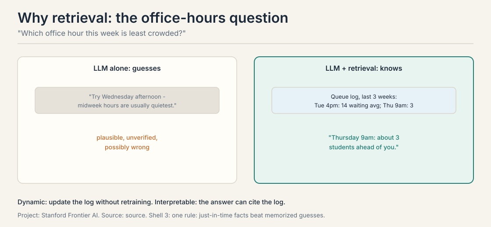
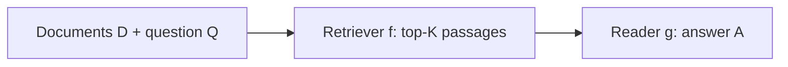
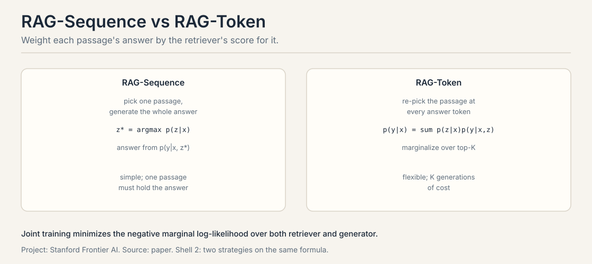
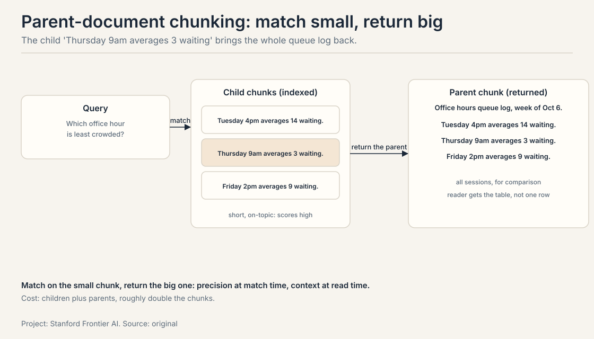
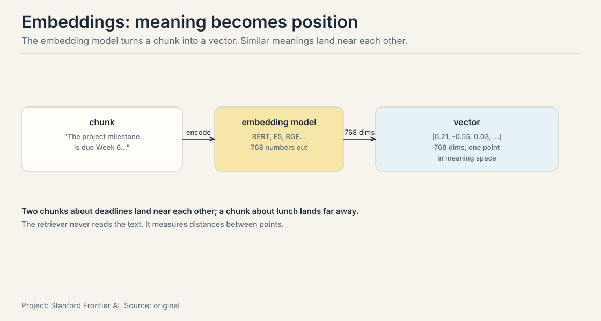
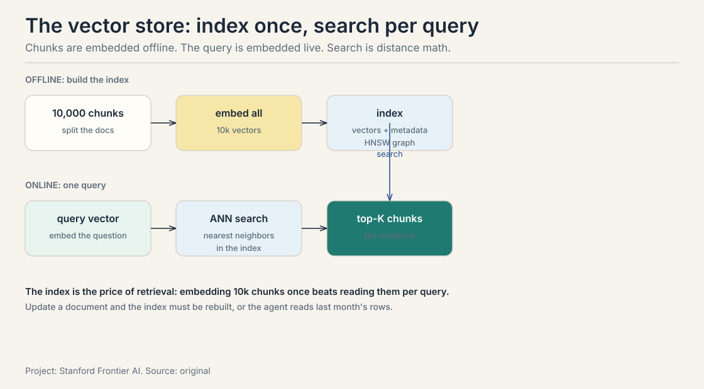
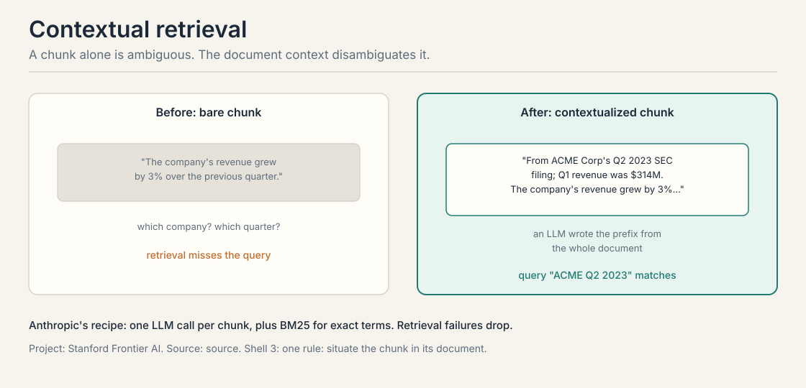
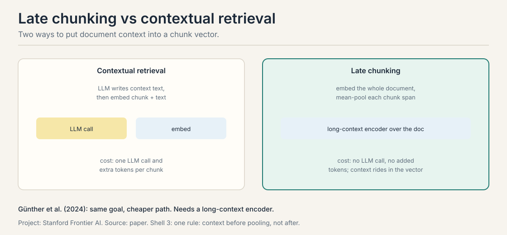
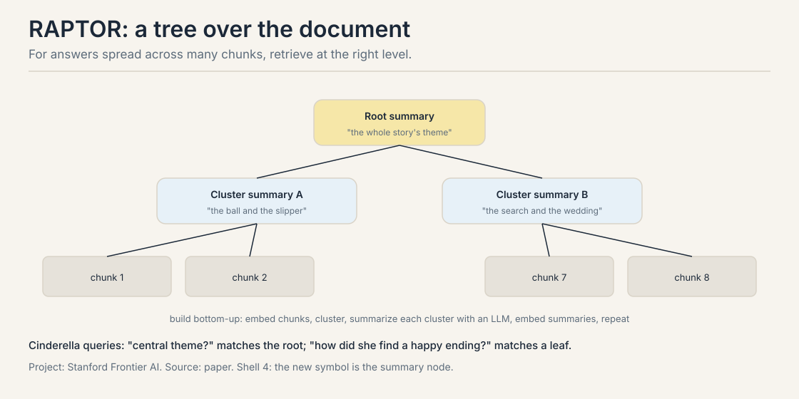

## The job: "Which office hour this week is least crowded?"

Ask the LLM alone and it answers from vibes: "Try the Wednesday
afternoon session. Midweek hours are usually quietest." Plausible.
Unverified. Possibly wrong. The model has never seen the queue log,
and it will not admit that.

Now give the agent the queue log first. Retrieved: Tuesday 4pm averages
14 waiting, Thursday 9am averages 3. The answer becomes "Thursday 9am,
about 3 students ahead of you." Specific, sourced, and checkable.



The difference is not eloquence. It is evidence. This chapter builds
the pipeline that puts evidence in front of the model at answer time:
retrieval-augmented generation, RAG.

## First attempt: train on the documents

The obvious fix is to teach the model the queue log: fine-tune on the
documents so the facts live in the weights. Then the model answers
from memory, no retrieval needed.

## Where training breaks

Three cracks, each concrete.

**Staleness.** The queue log changes every week. Retraining the model
every week to learn the new log is absurd: a training run for a
changing fact. Retrieval updates by replacing a file. The index is
rewritten in minutes. The weights never move.

**No citation.** A memorized answer cannot point at its source. "Trust
me, Thursday is quiet" is the model's word against nothing. A
retrieved answer carries its passage: here is the log line, check it
yourself. For office hours the stakes are low. For medical or legal
answers they are not.

**Lossy memory.** Training approximates. The model learns the shape of
the log, not its rows. Ask for the exact Tuesday average and you get a
reconstruction: 14, or 12, or "about a dozen". Retrieval returns the
row itself, byte for byte.

The lecture's summary: instead of asking the model to memorize
everything, provide the relevant content just in time. Retrieval is
dynamic (update documents without retraining) and interpretable (the
model can cite passages a human can verify).

### RAG vs fine-tuning vs prompting: the decision

The three options are not rivals. They answer different questions.

| Approach | Answers | When it wins |
|---|---|---|
| Prompting | "use this context" | the facts fit in the window and change per query |
| RAG | "fetch the facts" | the facts change, need citations, or exceed the window |
| Fine-tuning | "become the expert" | the knowledge is stable and must shape judgment: tone, reasoning patterns, domain intuition |

The best systems do all three: fine-tune the judgment, retrieve the
facts, prompt the format. The mistake is using one for another's job:
fine-tuning the queue log (stale next week), or retrieving the
company's voice (facts cannot teach style).

## The key question

What if the model reads the documents at answer time instead of
memorizing them?

## The retriever-reader framework, built from zero

Open-domain question answering splits into two modules. DrQA (Chen et
al., 2017) is the classic. Input: a document collection D and a
question Q. Output: an answer string A.



The **retriever** f(D, Q) returns the top-K passages. K is predefined,
for example 100. In DrQA it is a fixed TF-IDF sparse module: no
learning, just word overlap. The **reader** g(Q, {P1..PK}) writes the
answer from the question and those passages: a neural
reading-comprehension model, or today a zero-shot LLM.

The split is the point. Retrieval is a search problem over millions of
documents. Reading is a comprehension problem over K passages.
Different problems, different tools, one pipeline. And the handoff is
the fragile joint: if the retriever misses the evidence, the reader
cannot recover. If the reader ignores the passages, the retrieval was
wasted. The failure-modes lesson works both.

## RAG: weight answers by retrieval

RAG (Lewis et al., 2021) formalizes the pipeline as probability. A
**retriever** p(z|x) returns the top-K passages z for query x. A
**generator** p(y|x,z) writes the answer one token at a time, given
the query and a passage. The answer probability marginalizes over
passages:

$$p(y \mid x) \approx \sum_{z \in \text{top-K}} p(z \mid x)\, p(y \mid x, z)$$

Each passage's answer is weighted by how likely the retriever rates
that passage. Worked on a two-passage toy:

```ascii
query: "Which office hour is least crowded?"
  passage z1 (queue log):     p(z1|x) = 0.7
    answer "Thursday 9am":    p(y|x,z1) = 0.9  ->  0.7 x 0.9 = 0.63
  passage z2 (old FAQ):       p(z2|x) = 0.3
    answer "Thursday 9am":    p(y|x,z2) = 0.2  ->  0.3 x 0.2 = 0.06
  p("Thursday 9am" | x) = 0.63 + 0.06 = 0.69
```

The trusted passage dominates the sum. Training is joint: minimize the
negative marginal log-likelihood over both retriever and generator, so
the retriever learns to fetch passages that help the generator.

Two variants. **RAG-Sequence** picks one passage and generates the
whole answer with it. **RAG-Token** re-picks the passage at every token
of the answer. Sequence is cheaper. Token is more flexible. The
lecture's retriever is DPR (Dense Passage Retrieval): p(z|x) proportional to exp(d(z)^T q(x)),
two BERT encoders, top-K by maximum inner product search. The generator
is BART, reading the query and passage concatenated.



RAG beat the baselines on Natural Questions, TriviaQA, WebQuestions,
and CuratedTREC by exact match, and won human assessments on Jeopardy
question generation. The variants since (Gao et al., 2024 survey) keep
the same skeleton: retrieve, weight, generate.

## Indexing: the chunk is the basic unit

Retrieval needs one fixed-dimension vector per chunk, plus a similarity
metric. **Chunking** decides what one vector covers. The lecture's
toy: the same grading text, three splits.

```ascii
Same text, three splits
("Grading. The project milestone is due..."):

fixed-size (50 tokens):
  "... The project milestone is | due Week 6, Thursday 11:59pm. ..."
  -> "11:59pm" stranded at a boundary

fixed-size + overlap:
  "... milestone is due Week 6, | Thursday 11:59pm. ..."
  "... due Week 6, Thursday | 11:59pm. Late days may not ..."
  -> no sentence lost at a boundary

structure (split on headings):
  "Grading -- Milestone: Week 6, Thu 11:59pm. Late days: not allowed."
  -> clean, needs structure to exist
```

Fixed-size chunking segments by token count, typically 100 to 500
tokens. Too small and the vector has no context: it matches everything
vaguely. Too large and one vector averages many topics: it matches
nothing precisely. Overlap of 10 to 20 percent keeps sentences from
dying at boundaries. The fancier options: semantic chunking splits on
logical boundaries like sentences and sections. Context-enriched
chunking carries metadata or summaries per chunk. AI-driven dynamic
chunking uses an LLM to find natural breakpoints.

Start at 200 to 400 tokens with 10 to 20 percent overlap, then measure
on your eval set. The most common mistake is chunking without looking
at the documents: fixed-size splitting on PDFs with tables, code, or
headings shreds the structure the questions need. Read ten chunks by
hand before tuning anything.

### Recursive splitting: cut on real boundaries

Fixed-size splitting is the floor, not the ceiling. Four upgrades,
each fixing a different weakness.

**Recursive splitting** splits on a priority order of separators:
double newline (paragraph), then single newline, then space, then
character. A chunk that fits after paragraph splitting stays whole.
Only oversized pieces split further. The result: chunks that end at
real boundaries instead of mid-sentence. This is the production
default for prose.

### Semantic chunking: cut where meaning changes

**Semantic chunking** splits on meaning, not length. Embed each
sentence, compute the similarity between consecutive sentences, and
cut where the similarity drops: a topic change is a chunk boundary.
The chunks vary in size, but each one is about one thing. The price
is an embedding call per sentence at index time.

### Parent-document chunking: match small, return big

**Parent-document chunking** fixes the precision-recall dilemma.
Small chunks retrieve precisely (a 100-token chunk matches the query
tightly) but read poorly (no context around the hit). The index
stores small chunks. Each small chunk carries its parent chunk's ID.
Retrieval matches on the small chunk, then returns the parent.
Worked on the queue-log toy:

```ascii
child chunk:   "Thursday 9am averages 3 waiting."
parent chunk:  "Office hours queue log, week of Oct 6.
               Tuesday 4pm averages 14 waiting.
               Thursday 9am averages 3 waiting.
               Friday 2pm averages 9 waiting."
query:         "Which office hour this week is least crowded?"
match:         child scores high (short, on-topic)
return:        the parent, with all three sessions for comparison
```

The reader gets the comparison table, not one row. The cost is index
size: children plus parents, roughly double the chunks.

### Agentic chunking: the LLM places the cuts

**Agentic chunking** goes furthest: an LLM decides the boundaries by
reading the document and placing cuts where the topic changes. The
most accurate splits, and the most expensive: one model call per
document. Use it when the documents are few and the questions are
hard. Use recursive splitting when they are many.



### Embeddings: meaning becomes position

A chunk is text. The retriever needs numbers. An **embedding model**
(BERT, E5, BGE, and their successors) turns each chunk into a vector:
768 numbers that place the chunk at one point in meaning space. Similar
meanings land near each other.



Two chunks about deadlines land near each other. A chunk about lunch
lands far away. The retriever never reads the text. It measures
distances between points: dot product, cosine similarity, Euclidean
distance. The embedding model is the retriever's eyes, and its quality
decides everything downstream. A weak embedder buries the evidence
where no distance metric can find it.

### The vector store: index once, search per query

The **vector store** holds the chunk vectors plus metadata, and
answers nearest-neighbor queries. The work splits into two phases.



Offline: split the documents, embed every chunk, build the index
(usually an HNSW graph, a hierarchical navigable small world: a layered
graph index whose greedy walk reaches the query in about log N hops.
The next lesson builds it in full). Online: embed the
query, run approximate nearest-neighbor search, return the top-K
chunks. The index is the price of retrieval: embedding 10,000 chunks
once beats reading them per query. And the staleness rule: update a
document and the index must be rebuilt, or the agent answers from last
month's rows with this month's confidence.

## Contextual retrieval vs late chunking

A chunk without context is ambiguous. "The company's revenue grew by 3%
over the previous quarter." Which company? Which quarter? The embedding
of the bare chunk cannot match the query "What was the revenue growth
for ACME Corp in Q2 2023?"



**Contextual retrieval** (Anthropic) prepends a short LLM-written
context to each chunk: "From ACME Corp's Q2 2023 SEC filing. Q1 2023
revenue was $314M." The prompt shows the whole document and the chunk
and asks for one succinct situating paragraph. Now the chunk vector
carries the answer's identity. The recipe pairs it with hybrid
retrieval: embeddings catch meaning, BM25 catches exact terms, results
merge. BM25 is a sparse keyword scorer: it ranks a passage by how often
the query's words appear, weighs rare words above common ones, and
corrects for passage length so short documents do not win by default. The lecture reports that contextual embeddings reduced the
retrieval failure rate. The cost is one LLM call and extra tokens per
chunk at index time.

**Late chunking** (Günther et al., 2024) gets document context into the
vector without the LLM call. Embed the whole document with a
long-context encoder first. Then mean-pool the token vectors within
each chunk's span. The context rides in the vector because the encoder
saw the full document when it produced the token vectors.



The choice is economic. Indexing millions of chunks with an LLM call
each is expensive. If your encoder has the context length, late
chunking buys most of the gain for free.

### Query rewriting: ask better

The retriever scores passages against the query, but the user's
question is rarely the best query. "Which office hour this week is
least crowded?" contains no words from the queue log. **Query
rewriting** fixes the mismatch before retrieval: an LLM rewrites the
question into the terms the documents use ("office hour queue wait
times by session").

Two named variants. **HyDE** (hypothetical document embeddings) has
the LLM write a fake answer first, then retrieves with the fake
answer's embedding: the hypothetical document looks like the real
documents, so the distance math works. **Multi-query** generates
several rewrites and fuses the results. The cost is a model call
before retrieval. The gain is that the retriever finally sees a query
shaped like its index. The failure mode: a bad rewrite retrieves
confidently for the wrong question. Rewrite, then verify the retrieved
passages mention the original question's entities.

## RAPTOR and GraphRAG: when the answer is spread out

Flat chunk retrieval fails when the answer is spread across a document.
No single chunk holds it. **RAPTOR** (Sarthi et al., 2024) builds a
tree, bottom up: embed the chunks, cluster them, summarize each cluster
with an LLM, embed the summaries, and repeat.



Retrieval happens across levels. A detail question matches a leaf
chunk. A thematic question matches a summary node. The Cinderella test:
"what is the central theme of the story?" retrieves the root summary.
"how did she find a happy ending?" retrieves leaves. RAPTOR's selected
context usually contains what flat DPR retrieves, directly or inside a
summary. The cost is the tree build: clustering plus LLM summaries at
every level, and any document update can invalidate a subtree.

**GraphRAG** (Edge et al., 2024) is RAPTOR's cousin: it builds a
knowledge graph from the documents with an LLM, detects communities in
the graph, and answers queries from community summaries. Use it when
the questions are about relationships: who works with whom, what
connects these events. The shared idea: index the connections, not just
the chunks.

## What is used where: the RAG stack in production

| Layer | System | What it does | The price |
|---|---|---|---|
| Embeddings | E5, BGE, OpenAI embeddings | text to vectors | the embedder's quality is the ceiling |
| Vector store | Pinecone, Weaviate, Qdrant, pgvector | ANN search at scale | managed cost; index rebuilds on update |
| Managed RAG | OpenAI file search, Anthropic contextual retrieval | chunking plus retrieval as an API | less control over chunking and fusion |
| Search product | Perplexity, ChatGPT Deep Research | RAG as the product | the pipeline is theirs; you get answers |
| Graph | Neo4j-backed GraphRAG builds | relationships as retrievable units | the graph build: LLM extraction per document |

The pattern: every layer is a buy-vs-build decision on one pipeline
stage. Teams that own their corpus build the store. Teams that own
their questions buy the managed API. The eval lesson's rule applies:
measure retriever recall separately, because it is the ceiling of the
whole system no matter who built it.

## Mapping back: what each piece fixes

| Memorization crack | The answer | How |
|---|---|---|
| The log changes weekly | Dynamic index | Replace a file; the weights never move |
| "Trust me" has no source | Passages in context | The answer cites the log line; a human verifies |
| Training approximates | Exact text | Retrieval returns the row byte for byte |
| The question is not the query | Query rewriting | Rewrite into the index's terms; HyDE retrieves with a hypothetical answer |
| Bare chunks are ambiguous | Contextual retrieval / late chunking | Situate the chunk before embedding, or pool after encoding |
| The answer is spread out | RAPTOR / GraphRAG | Retrieve at the right tree level, or from the graph |

## The honest price

Indexing is a build cost paid before the first query: chunking,
embedding, and for RAPTOR, clustering plus LLM summaries at every
level. Retrieval is a latency cost paid per query: the next lesson
prices it exactly (62 ms to 10,700 ms depending on the method). And the
handoff is fragile: the retriever's miss is the reader's ceiling, and
a reader that ignores passages wastes the retrieval. Staleness cuts
the other way from training: the index must be rebuilt when documents
change, or the agent answers from last month's log. The retrieval
methods lesson builds the retriever zoo. The agentic lesson puts
retrieval inside the loop and prices every failure.

## Interview Q&A

> [!QA]
> Q: Why not just train the model on all the documents instead of retrieving?
> A: Three reasons, each demonstrated. Staleness: the queue log changes weekly and retraining weekly is absurd. Retrieval updates by replacing a file. No citation: a memorized answer cannot point at its source, while a retrieved answer carries its passage for a human to verify. Lossy memory: training approximates, so the exact Tuesday average comes back as a reconstruction. Retrieval returns the row byte for byte. Retrieval is dynamic, exact, and checkable.
> Follow-up: When is training better than retrieval?
> A: When the knowledge is stable and must be deeply integrated: reasoning patterns, domain intuition, style. Retrieval fetches facts. Training builds judgment. The best systems do both: train the judgment, retrieve the facts. The ladder lesson's midtraining is the training side of this split.

> [!QA]
> Q: Explain the RAG formula and work it on a tiny example.
> A: p(y|x) sums p(z|x) p(y|x,z) over the top-K passages: each passage's answer weighted by how likely the retriever rates that passage. Toy: the queue-log passage scores p(z1|x) = 0.7 and gives "Thursday 9am" probability 0.9, contributing 0.63. The old FAQ scores 0.3 and gives the same answer probability 0.2, contributing 0.06. Total: 0.69. The trusted passage dominates the sum. Training minimizes the negative marginal log-likelihood jointly, so the retriever learns to fetch passages that help the generator.
> Follow-up: RAG-Sequence versus RAG-Token: when does the choice matter?
> A: Sequence picks one passage for the whole answer. Token re-picks per token. It matters when the answer draws on multiple passages: a comparison answer needs token-level switching, while a single-fact answer is fine with one passage. Token is more flexible and more expensive. Most production systems approximate the token behavior with multi-hop retrieval instead.

> [!QA]
> Q: How do you choose a chunk size, and what is the most common mistake?
> A: Start at 200 to 400 tokens with 10 to 20 percent overlap. Smaller chunks give precise matches but lose context: the vector covers too little to be distinctive. Larger chunks keep context but blur: one vector averages several topics and matches vaguely. Then measure on your eval set, because the right size depends on your documents and questions. The most common mistake is chunking without looking: fixed-size splitting on PDFs with tables, code, or headings shreds the structure the questions need. Read ten chunks by hand before tuning anything.
> Follow-up: A bare chunk says "revenue grew by 3%". The query asks about ACME Corp Q2 2023. What are your two fixes and their costs?
> A: Contextual retrieval: an LLM writes a situating prefix per chunk ("From ACME Corp's Q2 2023 SEC filing..."), costing one LLM call and extra tokens per chunk at index time. Late chunking: embed the whole document with a long-context encoder, then mean-pool token vectors per chunk span, costing no LLM calls but requiring an encoder with real long-context ability. Same goal: disambiguate before the query arrives.

> [!QA]
> Q: Walk me through the vector store: what happens offline and what happens per query?
> A: Offline: split the documents into chunks, embed every chunk into a vector, build the index (usually an HNSW graph over the vectors plus metadata). Online: embed the query with the same model, run approximate nearest-neighbor search over the index, return the top-K chunks. The offline phase is the price of retrieval: embedding 10,000 chunks once beats reading them per query. The staleness rule: update a document and the index must be rebuilt, or the agent reads last month's rows.
> Follow-up: Why must the query use the same embedding model as the index?
> A: Because the vectors live in that model's meaning space. A different model's vectors have different geometry: distances between them are meaningless. Mixing embedders is like measuring one room in meters and another in feet and comparing the numbers. The index and the query must share the encoder.

> [!QA]
> Q: What is HyDE, and when does query rewriting backfire?
> A: HyDE (hypothetical document embeddings) has the LLM write a fake answer first, then retrieves using the fake answer's embedding. The hypothetical document looks like the real documents in the index, so the distance math works even when the user's question shares no words with the evidence. It backfires when the rewrite is confidently wrong: a bad hypothetical retrieves passages for the wrong question, and the reader answers from them. Rewrite, then verify the retrieved passages mention the original question's entities.
> Follow-up: Multi-query versus single rewrite: which and when?
> A: Single rewrite is cheaper: one model call, one retrieval. Multi-query generates several rewrites and fuses the results, which helps when the question is ambiguous and different phrasings retrieve different evidence. The fusion needs a rule (reciprocal rank fusion, RRF). Use multi-query when ambiguity is the failure mode. Use a single rewrite when the mismatch is just vocabulary.

> [!QA]
> Q: When does RAPTOR beat flat chunk retrieval?
> A: When the answer is spread across the document. Flat retrieval returns chunks that each look relevant but none of which contains the answer. RAPTOR's summary nodes compress many chunks into one retrievable unit, so a thematic question matches a node that actually contains the synthesized answer. The Cinderella queries are the demo: "central theme" needs the root summary, "how did she find a happy ending" needs the leaves. RAPTOR's selected context usually contains what flat DPR retrieves, directly or inside a summary.
> Follow-up: What is the catch?
> A: Build cost and staleness. The tree needs clustering plus LLM summaries at every level, and any document update can invalidate a subtree. For fast-changing corpora, flat chunking with good retrieval wins on maintenance. Match the index structure to the question shape and the update rate.

> [!QA]
> Q: RAG, fine-tuning, or prompting: a new support bot for a product whose docs change weekly. Decide.
> A: RAG, with prompting for the format. The docs change weekly, so fine-tuning is stale by design: you would retrain every week to learn changing facts. RAG reads the current docs at answer time, cites the passage, and updates by replacing a file. Fine-tune only the stable part: the support tone, the escalation judgment. Prompt the rest: the answer format, the citation style. The decision rule: stable judgment gets trained, changing facts get retrieved, per-query instructions get prompted.
> Follow-up: The bot's answers are correct but ignore the retrieved passages half the time. What do you check?
> A: The reader, not the retriever. Log whether the answer's claims appear in the retrieved passages: that is faithfulness, and it is a reader metric. If the retriever's recall is fine but the reader paraphrases from memory, the fix is in the prompt ("answer only from these passages") or in training, not in the index. The handoff is the fragile joint: measure each side separately.

## Recap: the whole lesson on one screen

The story in nine steps. Each step answers the one before it.

1. **The job: evidence at answer time.** The LLM alone guesses
   Wednesday. With the queue log it answers Thursday 9am, three
   waiting. Specific, sourced, checkable.
2. **Training breaks three ways.** Staleness (retrain weekly?),
   no citation ("trust me"), lossy memory (reconstructions, not
   rows). Stable judgment gets trained. Changing facts get retrieved.
3. **Split the problem.** Retriever f finds top-K passages (K = 100
   in DrQA). Reader g writes the answer. Search over millions,
   comprehend over K.
4. **Weight answers by retrieval.** p(y|x) = sum p(z|x) p(y|x,z).
   The toy: 0.7 x 0.9 + 0.3 x 0.2 = 0.69. The trusted passage
   dominates.
5. **The chunk is the unit.** 100 to 500 tokens, 10 to 20 percent
   overlap. Too small loses context. Too large blurs topics. Read
   ten chunks by hand.
6. **Embeddings turn text into points.** 768 numbers per chunk. The
   retriever measures distances, never reads text. The index is built
   offline. The query is embedded live.
7. **Situate before embedding.** Contextual retrieval writes a
   prefix per chunk (one LLM call each). Late chunking embeds the
   document then pools per span (no LLM call, needs a long-context
   encoder). Rewrite the query when it mismatches the index.
8. **Spread-out answers need trees.** RAPTOR: embed, cluster,
   summarize, repeat. Leaves for detail, nodes for theme. GraphRAG:
   index the relationships.
9. **The price: build cost, latency, fragility.** Indexing is paid
   upfront. Retrieval per query. The retriever's miss is the
   reader's ceiling.

## Go deeper

<div style="position:relative;padding-bottom:56.25%;height:0;overflow:hidden;max-width:100%;margin:16px 0;">
<iframe style="position:absolute;top:0;left:0;width:100%;height:100%;" src="https://www.youtube-nocookie.com/embed/YamlxX17n6Y" title="How AI Looks Things Up (RAG, Actually Explained)" frameborder="0" allow="accelerometer; autoplay; clipboard-write; encrypted-media; gyroscope; picture-in-picture" allowfullscreen></iframe>
</div>
- How AI Looks Things Up (RAG, Actually Explained) (the embed above): https://www.youtube.com/watch?v=YamlxX17n6Y, chunks, vectors, retrieve, augment, generate; RAG versus fine-tuning; the one honest catch.

<div style="position:relative;padding-bottom:56.25%;height:0;overflow:hidden;max-width:100%;margin:16px 0;">
<iframe style="position:absolute;top:0;left:0;width:100%;height:100%;" src="https://www.youtube-nocookie.com/embed/MgZ_Egy-DXI" title="Embeddings and Chunking Strategies in RAG" frameborder="0" allow="accelerometer; autoplay; clipboard-write; encrypted-media; gyroscope; picture-in-picture" allowfullscreen></iframe>
</div>
- Zero to Deployed, Embeddings and Chunking Strategies in RAG (the embed above): https://www.youtube.com/watch?v=MgZ_Egy-DXI, recursive, parent-child, semantic, and agentic chunking strategies in code.

Further:
- Anthropic, Contextual Retrieval: https://www.anthropic.com/engineering/contextual-retrieval, the prefix recipe in production.
- Gao et al. (2024) survey of RAG variants: the full zoo this lesson samples.
- Sarthi et al. (2024), RAPTOR: https://arxiv.org/abs/2401.18059, tree-structured retrieval.
- Edge et al. (2024), GraphRAG: https://arxiv.org/abs/2402.08907, knowledge graphs for retrieval.

## Official sources and further reading

**Official:**
- Lecture 3 slides (local: sources/agents/cs329z/lecture03.pdf).
- Course site: http://web.stanford.edu/class/cs329z.

**Further reading:**
- Lewis et al. (2021), RAG: https://arxiv.org/abs/2005.11401.
- Chen et al. (2017), DrQA: https://arxiv.org/abs/1704.00051.
- Günther et al. (2024), late chunking.

**Caveats from these sources.** The lecture reports RAG wins
qualitatively on named benchmarks without quoting exact numbers, so
none are quoted here. The 0.69 toy is worked arithmetic, not a
measured probability. Retrieval latency figures vary by hardware. The
methods lesson carries the lecture's numbers with that warning. No
lecture video is on record. The embed above is a third-party explainer,
verified live.

## Connections to the other courses

- **CS336 L01:** embeddings sit on tokenized text. The chunk vectors
  here are built on that pipeline.
- **CS329A:** studies retrieval as a research subject (learned
  retrievers, retrieval for self-improvement). This course builds the
  production pipeline.
- **This course, compound lesson:** RAG as a system block alongside
  tools and memory.
- **This course, retrieval methods:** the retriever zoo: BM25, DPR,
  ColBERT, hybrid search, rerankers, and what each costs.
- **This course, agentic retrieval:** retrieval moves inside the
  loop, and every failure mode of this pipeline gets priced.
