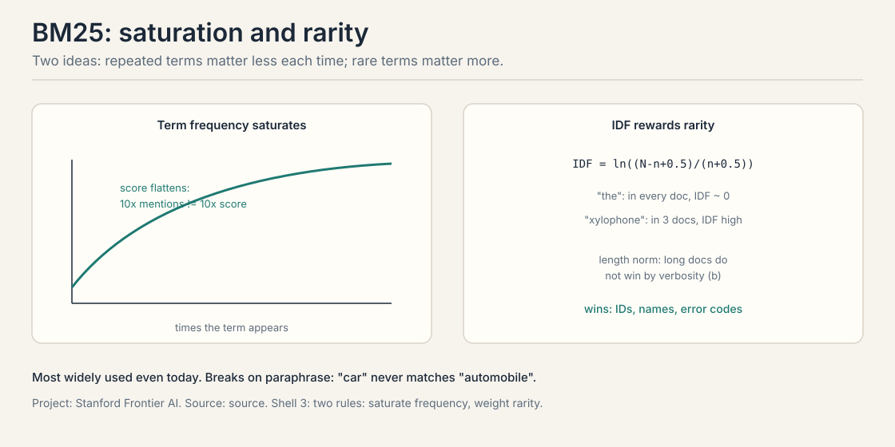
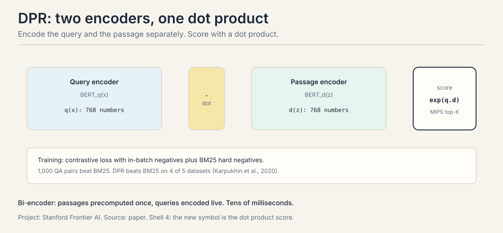
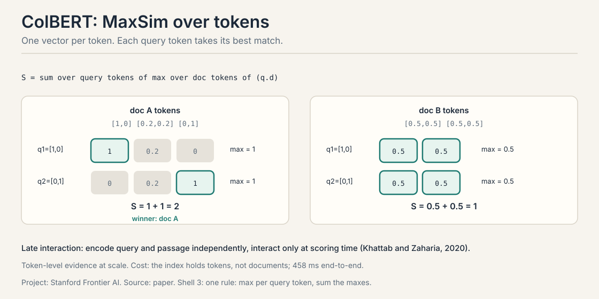
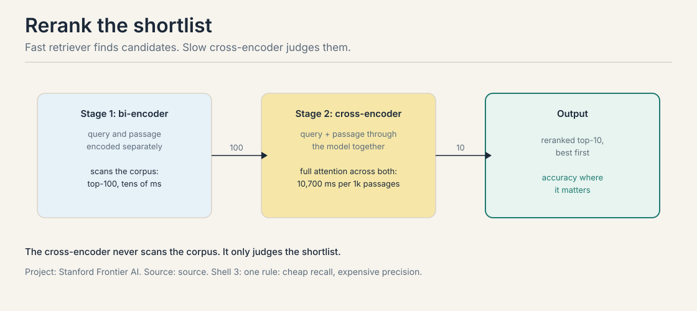
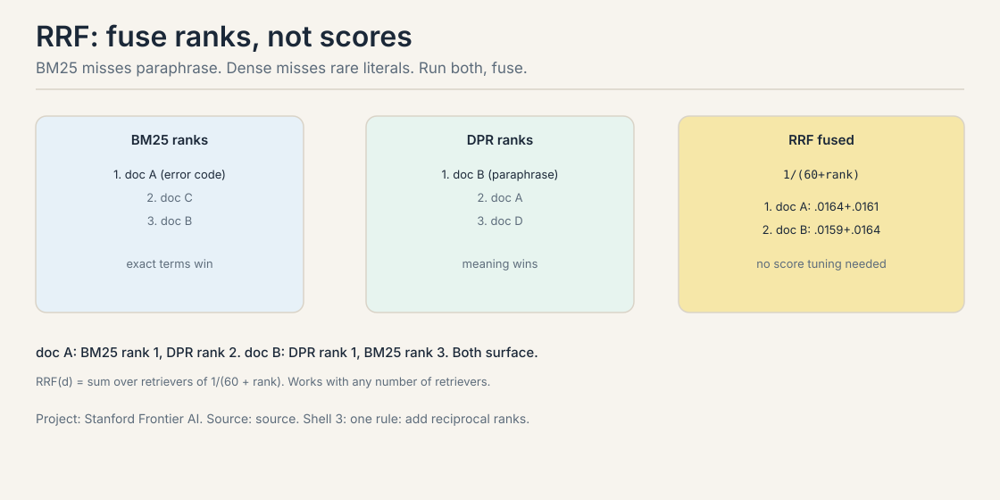
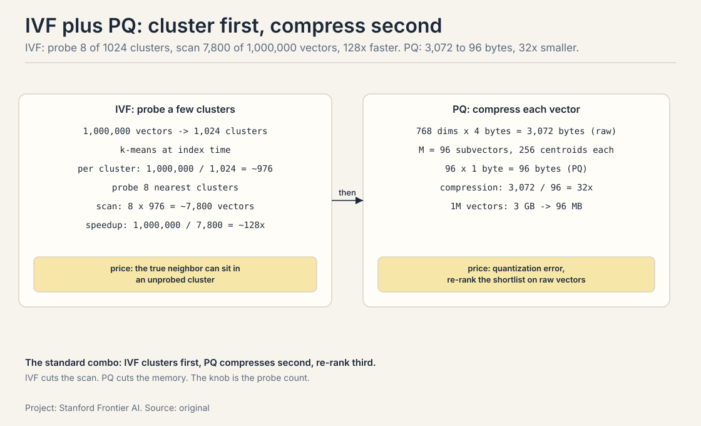
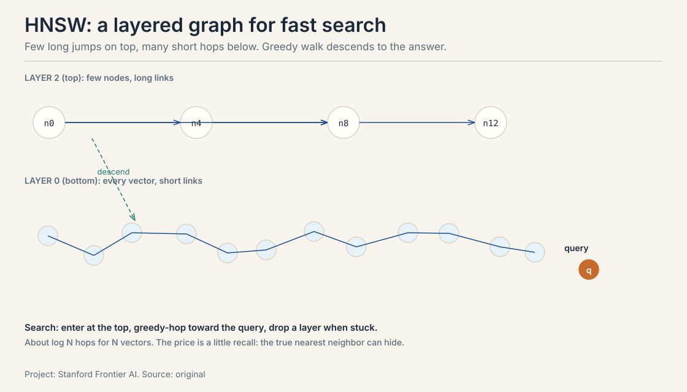
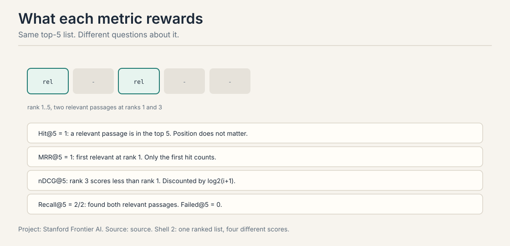
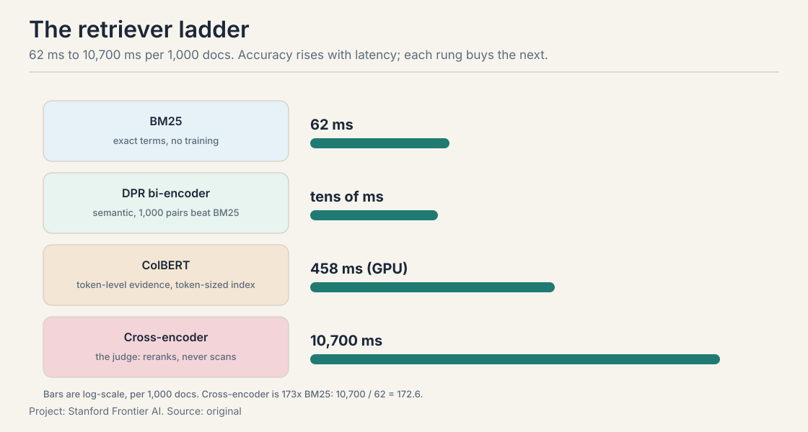

## The job: find the passages

"What was the revenue growth for ACME Corp in Q2 2023?" Ten thousand
chunks sit in the index. The retriever must return the few that answer
it. Everything in the RAG pipeline depends on this step: the reader
cannot recover evidence the retriever missed.

A **retriever** scores every candidate passage against the query and
returns the top-K. The question is what "scores" means. Words, or
meaning?

## First attempt: scan everything, compare words

The straightforward approach: compare the query to every passage
word by word, and scan the whole index per query. Two costs. The scan
is O(N x d): with 10 million chunks and 768-dimension vectors, one
query needs 7.68 billion multiply-adds. And word comparison misses
meaning entirely.

## Where word matching breaks

Two cracks, each with a worked case.

**Crack 1: paraphrase scores zero.** Query: "car". Passage: "the
automobile accelerated". Word overlap: none. A word matcher scores
this passage 0, though it is exactly relevant. Synonyms, paraphrases,
and different phrasings are invisible to word counting.

**Crack 2: dense vectors miss rare literals.** Query: "ERR_0x7F3A".
The passage contains that exact error code. A dense model trained on
ordinary text has no good vector for a code it never saw. The meaning
match is noise. Exact strings, product IDs, and names need exact
matching. The two approaches fail differently, which is why the course
ends with both.

## The key question

Can we score passages by meaning, and keep the exact words too?

## BM25: word matching done right

**BM25** is the most widely used retriever, even today. It scores a
document D against a query Q by summing over query terms:

```ascii
score(D, Q) = sum over query terms qi of:
  IDF(qi) x [ f(qi,D) x (k1 + 1) ]
      / [ f(qi,D) + k1 x (1 - b + b x |D|/avgdl) ]

  IDF(qi) = ln( (N - n(qi) + 0.5) / (n(qi) + 0.5) )
  f(qi,D)   = how often qi occurs in D
  |D|/avgdl = this doc's length vs the average
  N         = docs in the collection
  n(qi)     = docs that contain qi
```

Two ideas carry the formula. **IDF rewards rarity.** How rare is the
term across the collection? Worked on a 1,000-document corpus:

```ascii
"ACME" appears in 3 docs:
  IDF = ln(997.5 / 3.5) = ln(285) = 5.65
"revenue" appears in 50 docs:
  IDF = ln(950.5 / 50.5) = ln(18.8) = 2.93
```

The rare term scores nearly twice the common one. A document matching
"ACME" outranks one matching only "revenue". That is the whole idea:
rare terms discriminate, common terms do not.

**Term frequency saturates.** The tenth mention of a word matters less
than the first. With k1 = 1.2 and an average-length document, the
frequency factor f x 2.2 / (f + 1.2) gives:

```ascii
f = 1:   2.2 / 2.2  = 1.00
f = 10:  22 / 11.2  = 1.96
```

Ten times the mentions, less than twice the score. Keyword stuffing
cannot win. The length term (b x |D|/avgdl) stops long documents from
winning just by containing more words.



BM25 needs no training, no vectors, no labels. Its index is an
inverted index: term to document list. Query latency: 62 ms on the
lecture's MS MARCO setup. Its weakness is crack 1: paraphrase is
invisible to it.

### TF-IDF: the ancestor

Before BM25 there was **TF-IDF**: term frequency times inverse
document frequency, no saturation, no length normalization. TF-IDF
scores a term by how often it appears in the document times how rare
it is across the collection. BM25 is TF-IDF grown up: the saturation
curve (k1) stops keyword stuffing, and the length term (b) stops long
documents from winning on word count. The defaults everyone uses:
k1 = 1.2, b = 0.75. They are defaults because they work, not because
they are optimal: tune them on your eval set if BM25 is your final
retriever, not your first stage.

### Learned sparse: SPLADE

Dense vectors are not the only learned game. **SPLADE** learns a sparse
vector over the vocabulary: each passage gets weights on the terms it
contains *and* terms it should have contained (expansion). "Car" gets
weight on "automobile" without ever containing the word. The index
stays an inverted index, so it is fast like BM25, but the weights are
learned like DPR. The honest position: SPLADE is the bridge for teams
that want dense-like quality on sparse infrastructure. It does not
replace either. It gives you a third point on the tradeoff curve.

## DPR: meaning as a dot product

**Dense Passage Retrieval** (Karpukhin et al., 2020) encodes meaning
into vectors. Two BERT encoders: one for the query, one for the
passage. Score by dot product:

```ascii
p(z|x) proportional to exp( d(z)^T q(x) )
d(z) = BERT_d(z),   q(x) = BERT_q(x)
```

Worked on a two-dimensional toy:

```ascii
query   q = [0.8, 0.6]
doc A   d = [0.9, 0.4]   dot = 0.72 + 0.24 = 0.96
doc B   d = [0.1, 0.9]   dot = 0.08 + 0.54 = 0.62
winner: doc A
```

The query points mostly along the first axis. Doc A points the same
way. "Car" and "automobile" land near each other in vector space, so
the paraphrase that scored zero under BM25 now scores high. Top-K
retrieval is **maximum inner product search (MIPS)** over the passage
vectors, precomputed offline.



Training is contrastive: pull the query vector toward its true
passage, push it away from negatives. The negatives matter. **In-batch
negatives** reuse the other queries' passages in the batch as free
negatives. **BM25 hard negatives** add passages that word-match but
are wrong: the exact cases where dense must beat sparse. The results:
DPR beats BM25 on 4 of 5 datasets, and 1,000 QA pairs are enough to
beat BM25. No extra pretraining needed. DPR needs labeled pairs.
BM25 needs nothing. That is the price of meaning.

### Embedding models: the quality ladder

DPR used BERT. The field moved on. **E5** and **BGE** trained
contrastively on web-scale pairs and beat BERT-based DPR out of the
box. Instruction-tuned embedders take a task prefix ("query:", "passage:")
and adapt the geometry per task. The practical reading: the embedder
is the retriever's eyes, and upgrading it is the cheapest retrieval
win. Before tuning BM25's k1 or adding a reranker, try a newer
embedder on your eval set. A better geometry beats a better pipeline
on a bad geometry.

## ColBERT: score tokens, not documents

DPR compresses each passage into one vector. **ColBERT** (Khattab and
Zaharia, 2020) keeps one vector per token and interacts late: encode
the query and passage independently, interact only at scoring time.
The scoring rule is **MaxSim**:

```ascii
S(q,d) = sum over query tokens i of max over doc tokens j of (qi . dj)
```

Each query token takes its best-matching document token, and the best
matches sum. Worked on a toy, query tokens q1 = [1,0], q2 = [0,1]:

```ascii
doc A tokens: [1,0], [0.2,0.2], [0,1]
  q1 best: max(1, 0.2, 0) = 1
  q2 best: max(0, 0.2, 1) = 1
  S = 2
doc B tokens: [0.5,0.5], [0.5,0.5]
  q1 best: 0.5,  q2 best: 0.5
  S = 1
winner: doc A
```

Doc A has a token that matches each query token nearly exactly. The
late interaction keeps token-level evidence that a single passage
vector would blur. The price: the index stores one vector per token,
not per document, so it is much larger. End-to-end latency on MS
MARCO: 458 ms, between the fast retrievers and the slow judges.



## Rerank: the slow judge on a shortlist

A **bi-encoder** (BM25, DPR, ColBERT) encodes the query and passage
separately and scans the corpus. A **cross-encoder** feeds the query
and passage through the model together, with full attention across
both. It is more accurate and far slower: nothing is precomputed, so
it cannot scan a corpus.

The architecture that results: two stages.



Stage 1, the bi-encoder, scans the corpus and returns the top 100 in
tens of milliseconds. Stage 2, the cross-encoder, scores only those
100 with full attention. The lecture's number: 10,700 ms per 1,000
passages for a BERT-base cross-encoder. On a 100-passage shortlist
that is about a second: affordable as a second stage, impossible as a
first. Accuracy on a shortlist is what the cross-encoder buys.

## Hybrid search: fuse ranks, not scores

BM25 misses paraphrase. Dense misses rare literals. **Hybrid search**
runs both and fuses the two ranked lists. The fusion rule is
**reciprocal rank fusion (RRF)**: merge positions, not raw scores, so
no per-corpus tuning is needed and any number of retrievers can join.

```ascii
RRF(d) = sum over retrievers r of 1 / (k + rank_r(d)),   k = 60
```

Worked: doc A ranks 1st in BM25, 4th in DPR. Doc B ranks 2nd in both.

```ascii
RRF(A) = 1/61 + 1/64 = 0.0164 + 0.0156 = 0.0320
RRF(B) = 1/62 + 1/62 = 0.0161 + 0.0161 = 0.0323
winner: doc B
```

Doc B wins by ranking high in both lists. RRF rewards consensus: a
document that two different methods both like beats one that a single
method loves. The k = 60 constant dampens the difference between rank
1 and rank 2 so that agreement across lists dominates.



## Speed: approximate search over the index

Exact search is O(N x d) per query. **Approximate nearest neighbor
(ANN)** trades a little recall for a lot of speed. Three standard
tools. **IVF** (inverted file index): cluster the index, probe only
the nearest centroids. **PQ** (product quantization): compress each
vector into a short code. **HNSW** (hierarchical navigable small
world): a multi-layer proximity graph.

### IVF: cluster the index, probe a few clusters

IVF turns one big scan into a few small ones. Cluster the N vectors
into C centroids at index time (C = 1024 is typical for a million
vectors). At query time, find the nearest few centroids and scan only
their clusters. Worked on a toy: 1,000,000 vectors, 1,024 clusters,
probe 8 nearest clusters:

```ascii
per cluster:  1,000,000 / 1,024 = ~976 vectors
query scans:  8 clusters x 976 = ~7,800 vectors
speedup:      1,000,000 / 7,800 = ~128x
```

The price: the true nearest neighbor can sit in an unprobed cluster.
Probe more clusters and recall rises. The knob is the probe count.
IVF needs the clustering step (k-means over the index), unlike HNSW.

### PQ: compress each vector into a short code

PQ attacks the memory instead of the scan. A 768-dimension float32
vector is 3,072 bytes. PQ splits the vector into M subvectors (M = 96
is typical for 768 dims), quantizes each subvector to one of 256
centroids, and stores one byte per subvector:

```ascii
768 floats x 4 bytes = 3,072 bytes per vector (raw)
96 subvectors x 1 byte = 96 bytes per vector (PQ)
compression: 3,072 / 96 = 32x
1M vectors: 3 GB -> 96 MB
```

Distances are computed against the 256 centroids per subvector via
lookup tables, so the query is fast too. The price is quantization
error: the compressed vectors are approximations, so PQ is often
paired with a re-rank on the raw vectors of the shortlist. The
standard production combo is IVF plus PQ: cluster first, compress
second, re-rank third.



### HNSW: the graph behind the search

All vectors sit at the bottom layer, thinner samples above. Search
starts at the top, greedy-hops toward the query, and drops a layer
when stuck: about log N hops with high recall. The graph is built by
inserting one vector at a time, linking M nearest neighbors per layer
plus a heuristic long-range link so the greedy walk cannot get trapped.



The price is a little recall: the true nearest neighbor can hide from
the greedy walk. The tuning knobs: M (links per node: more links,
better recall, bigger index) and ef (search breadth: wider search,
slower query, better recall). For agent workloads, HNSW is the default
because it needs no training (unlike IVF) and queries in milliseconds
at billion-vector scale. Every managed vector store runs it underneath.

## Retrieval metrics: what each one rewards

Same top-5 list, different questions about it. The figure's list has
relevant passages at ranks 1 and 3.



Two queries make the differences concrete. Q1: first relevant passage
at rank 1. Q2: first relevant at rank 3.

The names first: MRR is mean reciprocal rank. nDCG is normalized
discounted cumulative gain.

```ascii
Hit@5:    any relevant passage in the top 5?
          Q1: yes, Q2: yes  ->  1.0
          position does not matter

MRR@5:    1 / (rank of the first relevant passage), averaged
          (1/1 + 1/3) / 2 = 0.667
          early ranks score higher

Recall@5: relevant passages found / all relevant passages
          rewards finding all of them, not just one

nDCG@5:   DCG = sum rel_i / log2(i+1); normalized by the ideal ranking
          rank position is discounted smoothly
Failed@k = 1 - Hit@k: queries with nothing relevant in the top k
```

Work nDCG on a toy where the top-5 list has relevance grades 3 at
rank 1 and 2 at rank 3 (other positions irrelevant):

```ascii
DCG  = 3 / log2(1+1) + 2 / log2(3+1)
     = 3 / 1 + 2 / 2
     = 4.0
IDCG = ideal order: 3 first, then 2
     = 3 / log2(2) + 2 / log2(3)
     = 3 + 1.262
     = 4.262
nDCG = 4.0 / 4.262 = 0.94
```

The log2 discount is the mechanism: rank 1 pays no discount, rank 3
pays log2(4) = 2, so a grade-2 passage at rank 3 contributes 1.0
instead of 2.0. Move that grade-2 passage to rank 2 and the DCG rises
to 3 + 2/1.585 = 4.262: the ideal, nDCG = 1.0. This is why nDCG is
the metric for ranked quality, not just presence: it scores the
whole ordering, smoothly.

Hit@k asks "did we find anything". MRR asks "how far down did the
user scroll". Recall asks "did we find all of it". nDCG asks "how good
is the whole ordering". Pick the metric that matches the reader: a
reader that reads one passage wants MRR. A reader that synthesizes
many wants recall.

## What is used where: the retrieval stack in production

| Layer | System | The choice | Why |
|---|---|---|---|
| Keyword | Elasticsearch, OpenSearch | BM25 as the default scorer | 62 ms, no training, exact terms |
| Vector | Pinecone, Weaviate, Qdrant, pgvector | HNSW over E5/BGE embeddings | managed ANN; the embedder is the ceiling |
| Hybrid | Elasticsearch RRF retriever, Weaviate hybrid | BM25 + dense fused by rank | the two failures are complementary |
| Rerank | Cohere Rerank, bge-reranker | cross-encoder on the top 100 | the slow judge where accuracy pays |
| Late interaction | ColBERTv2, PLAID | MaxSim with compressed indexes | token evidence at near-DPR speed |

The pattern: production stacks are all hybrid. Nobody ships pure BM25
or pure dense anymore: the failure modes are complementary, RRF fusion
is seven lines, and the reranker sits on top where the budget allows.
The lecture's latency table is the price list for each layer.

## Mapping back: what each retriever fixes

| Word-matching crack | The answer | How |
|---|---|---|
| Paraphrase scores zero | DPR | Meaning as vectors; "car" meets "automobile" |
| One vector blurs evidence | ColBERT | MaxSim keeps token-level matches |
| Sparse has no learning | SPLADE | Learned sparse weights on an inverted index |
| Fast retrieval is rough | Cross-encoder rerank | Full attention on the shortlist only |
| Each method fails differently | Hybrid + RRF | Fuse ranks; consensus wins |
| Exact scan is O(N x d) | ANN / HNSW | Log N hops, a little recall traded |

## The honest price: the latency table

The lecture's table, measured on MS MARCO (DPR on different hardware,
so treat cross-method gaps as magnitudes):

| Retriever | Precomputed offline | Query latency | Wins on | Breaks on |
|---|---|---|---|---|
| BM25 (sparse) | inverted index | 62 ms | exact terms: IDs, names, error codes | paraphrase, synonyms |
| DPR (bi-encoder) | one vector per passage | tens of ms | semantic match at corpus scale | rare literals; needs labeled pairs |
| ColBERT (late interaction) | one vector per token | 458 ms end-to-end | token-level evidence at scale | index size: tokens, not documents |
| Cross-encoder (BERT-base) | nothing | 10,700 ms per 1k passages | accuracy on a shortlist | cannot scan a corpus |



Every row is a tradeoff with a number. BM25 is fast, exact, and free
of training data. DPR is fast and semantic, but needs 1,000+ labeled
pairs and misses rare strings. ColBERT keeps token evidence at a 7x
latency cost and a token-sized index. The cross-encoder is the most
accurate judge and 170x slower than BM25 per passage: shortlists only.
There is no best retriever. There is only the retriever whose price
your pipeline can pay.

## Interview Q&A

> [!QA]
> Q: Walk me through the BM25 formula and explain the two ideas that matter.
> A: Score(D,Q) sums over query terms: IDF(qi) times a saturated term-frequency factor f x (k1+1) / (f + k1 x (1 - b + b x |D|/avgdl)). Idea one, IDF rewards rarity: on a 1,000-doc corpus, "ACME" in 3 docs gives IDF ln(285) = 5.65 while "revenue" in 50 docs gives 2.93, so the rare term discriminates nearly twice as hard. Idea two, term frequency saturates: at k1 = 1.2, one mention scores 1.00 and ten mentions score 1.96, so keyword stuffing cannot win. The length term stops long documents from winning on word count alone.
> Follow-up: Why is BM25 still the most widely used retriever?
> A: It needs no training, no vectors, and no labeled data, and it answers in 62 ms off an inverted index. For exact terms like error codes and product IDs it is unbeatable. Its blind spot is paraphrase, which is why production systems pair it with a dense retriever and fuse with RRF.

> [!QA]
> Q: How does DPR training work, and why do the negatives matter so much?
> A: Two BERT encoders produce the query and passage vectors. The score is the dot product, trained contrastively to pull the query toward its true passage and push it away from negatives. In-batch negatives reuse other queries' passages as free negatives. BM25 hard negatives are the load-bearing addition: passages that word-match but are wrong, the exact cases where dense must beat sparse. With good negatives, 1,000 QA pairs are enough to beat BM25, and DPR wins on 4 of 5 datasets with no extra pretraining.
> Follow-up: When does DPR lose to BM25?
> A: On rare literals: error codes, product IDs, unusual names. The dense model never learned a good vector for a string it rarely saw, while BM25 matches it exactly. This is the standard argument for hybrid search: the two methods fail differently, so run both and fuse.

> [!QA]
> Q: Explain ColBERT's MaxSim and when you would pay its price.
> A: ColBERT keeps one vector per token instead of one per passage. At scoring time, each query token takes its maximum dot product over all document tokens, and the maxima sum: S(q,d) = sum_i max_j (qi . dj). The toy: query tokens [1,0] and [0,1] against doc A's [1,0], [0.2,0.2], [0,1] give 1 + 1 = 2, beating doc B's 1. Token-level evidence survives that a single passage vector would blur. The price: the index is per-token, much larger, and end-to-end latency is 458 ms versus tens of ms for DPR. Pay it when token-level evidence decides relevance and the corpus fits the index budget.
> Follow-up: Bi-encoder versus cross-encoder: why do we need both?
> A: The cross-encoder runs the query and passage through the model together with full attention, so it judges relevance best, but nothing is precomputed and it costs 10,700 ms per 1,000 passages: it cannot scan a corpus. The bi-encoder precomputes passage vectors and scans in tens of ms but judges roughly. The two-stage design uses each where it wins: bi-encoder retrieves the top 100, cross-encoder reranks the shortlist.

> [!QA]
> Q: Work through RRF on two documents and explain why ranks beat scores.
> A: Doc A ranks 1st in BM25 and 4th in DPR. Doc B ranks 2nd in both. RRF with k = 60: RRF(A) = 1/61 + 1/64 = 0.0320, RRF(B) = 1/62 + 1/62 = 0.0323. Doc B wins by consensus. Ranks beat scores because raw scores from different methods live on incomparable scales: a BM25 score of 14.2 and a dot product of 0.96 cannot be added meaningfully. Ranks are already normalized, the k = 60 dampens rank-1 versus rank-2 gaps, and the method needs no per-corpus tuning and works with any number of retrievers.
> Follow-up: Which metric do you report for a reader that reads exactly one passage?
> A: MRR. Hit@k ignores position, but a one-passage reader only sees the top result, so rank 1 versus rank 3 is the whole game. MRR scores 1 for rank 1 and 1/3 for rank 3, which matches the reader's experience. For a reader that synthesizes many passages, report recall instead.

> [!QA]
> Q: How does HNSW find the nearest neighbor in about log N hops?
> A: The index is a layered graph. All vectors sit at the bottom layer. Thinner samples sit on the layers above, with longer links. Search enters at the top, greedy-hops toward the query (always moving to the neighbor closest to the query), and drops a layer when no neighbor is closer. Each layer narrows the search exponentially, so the total is about log N hops for N vectors. The build inserts one vector at a time, linking M nearest neighbors per layer plus a heuristic long-range link so the walk cannot get trapped. The price is a little recall: the true nearest neighbor can hide from the greedy walk.
> Follow-up: What do the M and ef knobs do?
> A: M is links per node: more links, better recall, bigger index. ef is the search breadth: a wider candidate list per hop, slower queries, better recall. Tune them against your recall target on an eval set: raise ef until recall@k stops improving, then stop, because every extra millisecond is paid per query.

> [!QA]
> Q: Your hybrid pipeline returns great passages but the answers are wrong. Where do you look?
> A: At the reader, not the retriever. If recall@k is healthy and the top passages contain the evidence, the failure is downstream: the reader ignores the passages, or the passages disagree and the reader picks wrong. Check faithfulness: do the answer's claims appear in the retrieved passages? The retriever's miss is the reader's ceiling, but a good retriever with a bad reader still fails. Measure each stage separately before touching the pipeline.
> Follow-up: And if the passages are great but the latency is 2 seconds?
> A: Price each stage. The cross-encoder on 100 passages is the usual suspect at about a second. Cut the shortlist to 30, or distill the reranker, or drop reranking for queries where the hybrid score gap is already decisive. The latency table is the budget: spend it where the errors are.

> [!QA]
> Q: Design the retrieval stack for a support bot over 2M technical docs with error codes and paraphrased questions. Name each layer.
> A: BM25 first for the error codes: exact terms like ERR_0x7F3A are its home turf, 62 ms, no training. Dense (E5/BGE) second for the paraphrased questions: meaning as vectors where BM25 scores zero. Fuse with RRF: consensus across the two lists, no score tuning. Cross-encoder rerank on the top 50 where accuracy pays: about half a second, acceptable for support. HNSW underneath the dense index for millisecond ANN at 2M vectors. Metrics: MRR for the one-passage answers, recall for the multi-doc syntheses, Failed@k to catch the queries with nothing retrieved.
> Follow-up: The corpus updates hourly. What breaks?
> A: The dense index rebuild. HNSW rebuilds are expensive at 2M vectors, so use a tiered index: a small fresh index for the last hour's docs searched alongside the big one, merged at query time. BM25's inverted index updates cheaply by comparison. Staleness is the price of the dense tier: measure how fast new docs must be searchable and size the fresh tier to it.

## Recap: the whole lesson on one screen

The story in nine steps. Each step answers the one before it.

1. **The job: score passages against the query.** Ten thousand
   chunks, one question. The reader cannot recover what the
   retriever misses.
2. **Scanning everything costs O(N x d).** 10M chunks x 768 dims =
   7.68B multiply-adds per query. Word comparison misses meaning
   anyway.
3. **Two cracks.** "Car" vs "automobile" scores zero (paraphrase).
   "ERR_0x7F3A" is noise to a dense model (rare literals).
4. **BM25: rarity and saturation.** IDF 5.65 for "ACME" vs 2.93
   for "revenue". Ten mentions score 1.96, not 10. 62 ms, no
   training. TF-IDF is the ancestor. SPLADE is the learned bridge.
5. **DPR: meaning as a dot product.** Two encoders, MIPS over
   precomputed vectors. Beats BM25 on 4 of 5 datasets with 1,000
   QA pairs. Needs labels. Misses rare strings. Newer embedders
   (E5, BGE) are the cheapest upgrade.
6. **ColBERT: MaxSim over tokens.** Each query token takes its best
   match. The maxima sum. Token-sized index, 458 ms.
7. **Rerank the shortlist.** Cross-encoder judges with full
   attention: 10,700 ms per 1k passages. Stage 1 retrieves 100,
   stage 2 judges them.
8. **Fuse with RRF. Search with HNSW.** RRF(B) = 0.0323 beats
   RRF(A) = 0.0320: consensus wins. HNSW: log N hops, M and ef
   trade recall for speed.
9. **Measure with the right metric.** MRR for one-passage readers,
   recall for synthesizers, Failed@k for the queries with nothing.

## Go deeper

<div style="position:relative;padding-bottom:56.25%;height:0;overflow:hidden;max-width:100%;margin:16px 0;">
<iframe style="position:absolute;top:0;left:0;width:100%;height:100%;" src="https://www.youtube-nocookie.com/embed/t5zTNqe0Jck" title="Hybrid Search And RRF" frameborder="0" allow="accelerometer; autoplay; clipboard-write; encrypted-media; gyroscope; picture-in-picture" allowfullscreen></iframe>
</div>
- Hybrid Search And RRF (the embed above): https://www.youtube.com/watch?v=t5zTNqe0Jck, why dense misses rare terms, BM25 misses meaning, and RRF fuses ranks in seven lines of Python.

<div style="position:relative;padding-bottom:56.25%;height:0;overflow:hidden;max-width:100%;margin:16px 0;">
<iframe style="position:absolute;top:0;left:0;width:100%;height:100%;" src="https://www.youtube-nocookie.com/embed/D5qEFJ8dXxQ" title="Hybrid Search Explained: Keyword plus Semantic for Better RAG" frameborder="0" allow="accelerometer; autoplay; clipboard-write; encrypted-media; gyroscope; picture-in-picture" allowfullscreen></iframe>
</div>
- Sukrid LearnHub, Hybrid Search Explained (the embed above): https://www.youtube.com/watch?v=D5qEFJ8dXxQ, BM25 and dense side by side, RRF versus score fusion, cross-encoder reranking as the third stage.

Further:
- Karpukhin et al. (2020), DPR: https://arxiv.org/abs/2004.04906, training with in-batch and BM25 hard negatives.
- Khattab and Zaharia (2020), ColBERT: https://arxiv.org/abs/2004.12832, late interaction.
- Humeau et al. (2020): bi-encoders versus cross-encoders.
- HNSW paper (Malkov and Yashunin): the multi-layer graph behind fast ANN search.

## Official sources and further reading

**Official:**
- Lecture 3 slides (local: sources/agents/cs329z/lecture03.pdf).
- Course site: http://web.stanford.edu/class/cs329z.

**Further reading:**
- SPLADE: learned sparse retrieval on inverted indexes.
- Elasticsearch RRF retriever documentation: hybrid search in production.

**Caveats from these sources.** Latency figures are the lecture's,
measured on MS MARCO with DPR on different hardware: treat
cross-method gaps as magnitudes, not exact ratios. The toy
computations (IDF, saturation, RRF, metrics) are worked arithmetic on
small examples, not measurements. No lecture video is on record. The
embed above is a third-party explainer, verified live.

## Connections to the other courses

- **CS336 L01:** the embeddings and token vectors the dense methods
  build on.
- **CS224N:** dense retrieval from the NLP side, with the same DPR
  and ColBERT papers.
- **This course, RAG pipeline:** the retriever-reader framework this
  lesson's zoo plugs into.
- **This course, indexing:** chunking decides what one vector covers.
  this lesson decides how vectors are scored.
- **This course, agentic retrieval:** the retriever becomes an action
  inside the loop, and its misses become the agent's failures.
