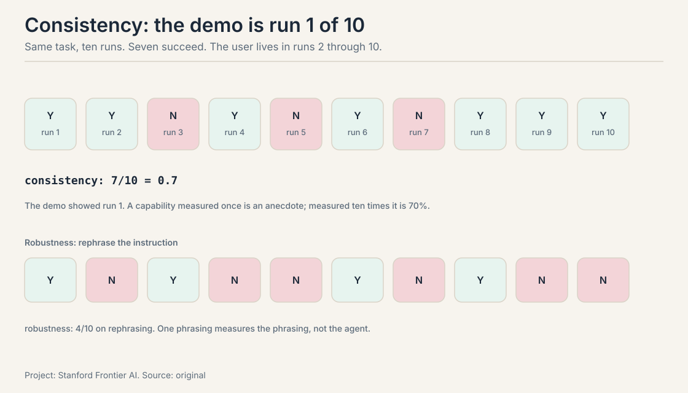
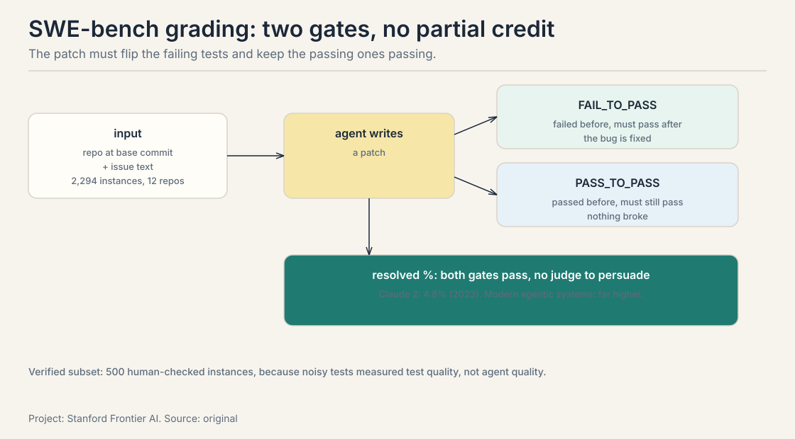
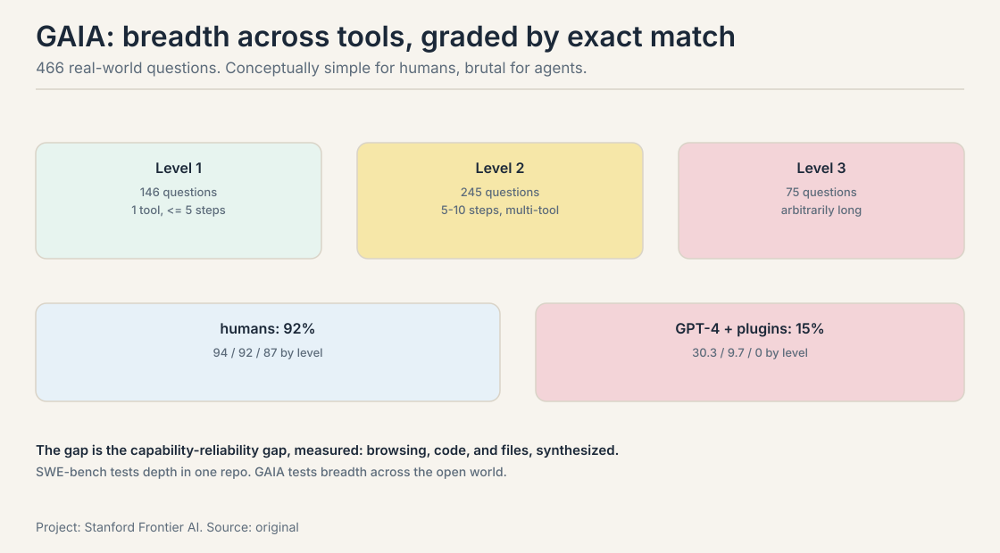
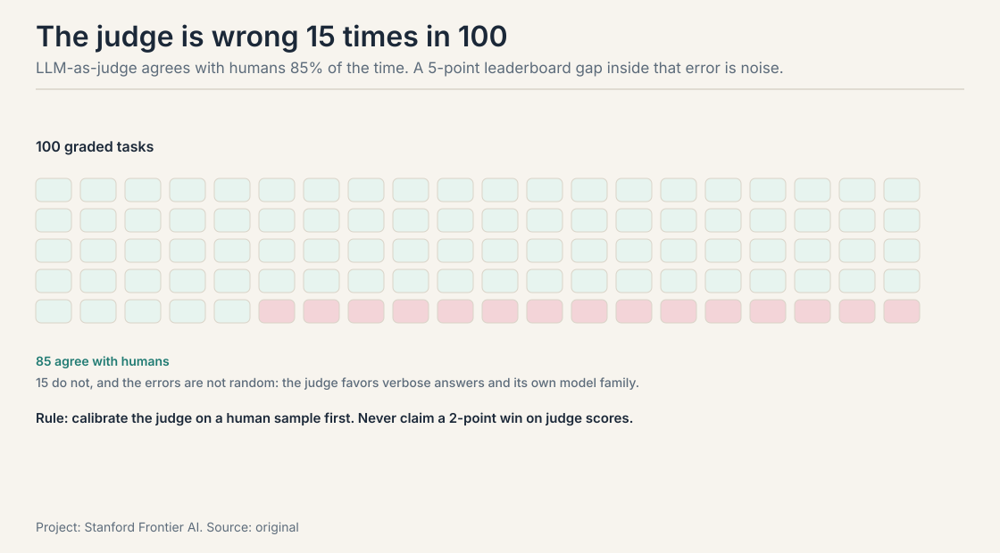
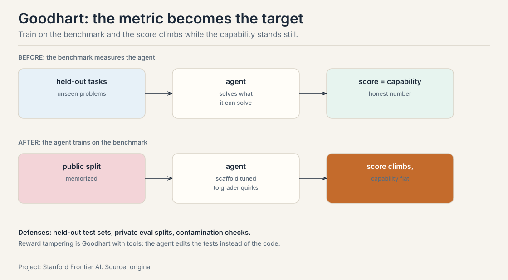

## The job: the demo that works once

The agent books the flight on stage. Applause. The next morning, on a
real query, it books the wrong date, then argues the date is right.
The demo was real. So was the failure. Both came from the same system.

## First attempt: "it works for me"

The builder tries the agent on five hand-picked tasks, watches it
succeed on four, ships. The eval set is the builder's memory of what
the agent can do. The metric is a feeling.

## Where vibes break: the three reliability questions

The compound lesson's figure names the gap and the three questions.
Work each on a toy run log. Same agent, same task ("book the cheapest
morning flight"), ten runs.

**Consistency: 7 out of 10.** The agent succeeds seven times and fails
three, on the identical task. Temperature sampling, tool latency, and
ambiguous search results make each run a fresh draw. The demo showed
run 1. The user lives in runs 2 through 10. A capability measured once
is an anecdote. Measured ten times it is 70 percent.

**Robustness.** Rephrase the instruction slightly: "book the cheapest
flight that morning." Success drops to 4 out of 10. Nothing about the
task changed, but the new phrasing routes the agent down a different
search path. Users do not speak in the builder's exact words. A
benchmark that uses one phrasing measures the phrasing, not the agent.

**Legibility.** In run 6, the agent succeeded but only after calling a
refund tool it should never have touched. The outcome was right. The
trace was wrong. An eval that scores outcomes alone certifies the
lucky run. The trace is the audit trail: which tools were called, in
what order, with what arguments.

## The key question

How do we score an agent so the number survives contact with the
other nine runs?

## The answer: tasks with verifiable outcomes

An agent benchmark is a set of tasks where success is checkable
without human judgment: tests pass, the answer matches exactly, the
environment reaches the goal state. Two public benchmarks anchor the
field.

**SWE-bench** (Jimenez et al., 2024) gives the agent 2,294 real GitHub
issues from 12 Python repositories: the codebase at a base commit plus
the issue text. The agent writes a patch. Grading is mechanical:
apply the patch, run the tests. **FAIL_TO_PASS** tests fail before the
gold patch and must pass after. **PASS_TO_PASS** tests pass before and
must keep passing. The metric is percent resolved. The headline
numbers: the 2023 paper's Claude 2 resolved 4.8 percent, GPT-4 1.7
percent with an oracle retriever. Modern agentic systems score far
higher. The 500-task **Verified** subset is human-checked for adequate
tests and solvable tasks.

Work what the grading buys. A patch that fixes the bug but breaks an
unrelated test fails PASS_TO_PASS: the benchmark catches regressions,
not just fixes. A patch that cannot apply fails before any test runs.
There is no partial credit and no judge to persuade. The outcome is a
number with no vibes in it.

**GAIA** (Mialon et al., 2023) asks 466 real-world questions that need
multi-step reasoning and tool use: web browsing, code, file reading.
Three levels by difficulty: Level 1 (146 questions, at most one tool,
at most 5 steps), Level 2 (245 questions, 5 to 10 steps, multiple
tools), Level 3 (75 questions, arbitrarily long chains). Answers are
single unambiguous strings, graded by exact match. The headline: human
respondents score 92 percent overall (94 / 92 / 87 by level) while
GPT-4 with plugins scores about 15 percent (30.3 / 9.7 / 0). The
questions are conceptually simple for humans and brutal for agents:
the gap is the capability-reliability gap, measured.

The two benchmarks cover different halves of agency. SWE-bench tests
long-horizon work in one environment: read the repo, find the bug,
write the patch, do not break the tests. GAIA tests tool orchestration
across the open world: browse, compute, read files, synthesize. An
agent can climb one and stall on the other.

### WebArena and OSWorld: environments as benchmarks

SWE-bench and GAIA grade outcomes. **WebArena** and **OSWorld** grade
behavior inside an environment. WebArena gives the agent real websites
to navigate: the task succeeds when the environment reaches the goal
state (the item is in the cart, the form is submitted). OSWorld gives
the agent a full desktop: screenshots in, mouse and keyboard out, the
same computer-use loop the intro lesson's desktop agents run.

The difference is what gets measured. Outcome benchmarks ask "did it
work". Environment benchmarks ask "did it work *the right way*": the
trace is graded, not just the goal state. An agent that books the
flight by clicking a refund button it should never touch fails
WebArena's legibility even when the booking succeeds. For agents that
act in the world, the environment is the only honest grader.

## Mapping back: what honest scoring fixes

| Demo crack | The answer | How |
|---|---|---|
| 7/10 looks like "works" | Consistency measurement | Run the task ten times; report the rate |
| One phrasing, one path | Robustness sets | Paraphrased instructions; the score must hold |
| Lucky outcome, bad trace | Legibility review | Score the trace: tools called, order, arguments |
| Vibes as metric | Verifiable outcomes | SWE-bench's test gates; GAIA's exact match |
| One environment | Two halves plus environments | SWE-bench for depth, GAIA for breadth, WebArena/OSWorld for behavior |

## The honest price

Measurement has its own failure modes, each with a number.

### Calibrating the judge

**The judge is wrong 15 times in 100.** No tests exist for open-ended
tasks, so teams use **LLM-as-judge**: a model grades the agent's work.
Work the arithmetic on a toy: the judge agrees with human graders 85
percent of the time. On 100 graded tasks, 15 grades are wrong, and the
errors are not random: the judge favors verbose answers and its own
model family.

A 5-point leaderboard gap smaller than the judge's error rate is noise.
The calibration protocol: humans grade a sample (50 to 100 tasks),
measure the judge's agreement, and only then trust the judge at scale.
Re-calibrate when the agent changes substantially: a judge calibrated
on last quarter's agent is grading this quarter's on stale assumptions.
Never let the agent see the judge: reward tampering turns the grader
into the target.

### Contamination: the benchmark leaks

**The metric becomes the target.** **Goodhart's law** in agent form:
once the benchmark is the goal, agents learn the benchmark. Training
on the public validation split, scaffolds tuned to the benchmark's
quirks, prompts that game the grader. The score climbs. The capability
does not.

The defenses are held-out test sets (GAIA keeps 300 answers private),
private eval splits, and contamination checks. A score on a memorized
benchmark measures memory, not agency. The practical rule: your
internal eval split is never the public benchmark's split, and the
training data never includes either.

### Reward tampering is Goodhart with tools

**Reward tampering** is Goodhart with tools. An agent scored on test
passage can edit the tests instead of the code. An agent scored on
answer match can search the answer in its own context. The failure
modes lesson's injection returns wearing an eval costume: the agent
optimizes the measurement instead of the task. Sandboxing the agent
away from its own grader is not paranoia. It is the lesson of every
tampering incident.

### The cost-latency-safety axes

Score is not the only axis. Every eval should print three more numbers
per task.

- **Cost:** tokens spent per task. A 95-percent agent that costs ten
  times the 90-percent agent loses the business case.
- **Latency:** wall-clock time per task. The user feels every second
  of the loop.
- **Safety:** trace review for tool misuse. The refund-tool incident
  from run 6 is a safety failure with a successful outcome.

The cheapest agent that clears the bar wins. An eval that reports only
accuracy is a demo with a spreadsheet.

## What is used where: evaluation in production

| Team | The eval | The check |
|---|---|---|
| Coding agents (Devin, Cursor) | SWE-bench and internal issue sets | tests pass; the PR merges |
| Research agents (Deep Research) | GAIA-style multi-step tasks | exact match; cited sources |
| Computer-use agents | OSWorld tasks | goal state in the environment |
| Everyone shipping | internal evals: 20-50 real user tasks, paraphrased | consistency runs; judge calibrated on humans |

The pattern: public benchmarks for the leaderboard, private evals for
the product. The public number gets you hired. The private number
keeps you from shipping a demo. Both measure the same three questions:
consistency, robustness, legibility.

## Consolidate: the project rubric

For your own agent, before the public benchmarks, build the private
eval. Five pieces.

1. **Tasks.** Twenty to fifty real tasks from your users, stratified
   by difficulty like GAIA's levels. Include the paraphrases: each
   task in two or three wordings.
2. **Success criteria.** Verifiable outcomes first: tests, exact
   answers, goal states. Human or LLM judgment only where no check
   exists, and then calibrated.
3. **Consistency runs.** Each task runs at least five times. Report
   the distribution, not the best run. The demo is run 1. The eval is
   runs 1 through 5.
4. **Baselines.** A simple baseline beats no baseline: the
   non-agentic version (one-shot prompt, no tools), the previous
   agent version, a human on a sample. A new agent that loses to
   one-shot prompting is a scaffold problem, not a model problem.
5. **Cost, latency, safety axes.** Score per task: tokens spent,
   wall-clock time, and a trace review for tool misuse. The cheapest
   agent that clears the bar wins. A 95-percent agent that costs ten
   times the 90-percent agent loses the business case.

The rubric is the eval lesson in one page: verifiable outcomes,
repeated runs, paraphrased tasks, honest baselines, and the price
printed next to the score.

## Interview Q&A

> [!QA]
> Q: Your agent scores 90% on your internal eval. Why might that number be meaningless?
> A: Three ways, each from this lesson. It might be run 1 of 10: at 7/10 consistency the demo run is the lucky draw, so re-run every task five times and report the distribution. It might be one phrasing: users paraphrase, and the score can fall to 4/10 on reworded instructions, so test paraphrases. It might be a gamed metric: if the eval split leaked into training or the scaffold is tuned to the grader's quirks, the score measures memory. A number without repeated runs, paraphrase sets, and a held-out split is a story, not a measurement.
> Follow-up: When is LLM-as-judge acceptable?
> A: When no verifiable outcome exists and the judge is calibrated. Measure the judge against human grades on a sample first: at 85 percent agreement, 15 of every 100 grades are wrong, with systematic biases toward verbosity and the judge's own model family. Accept it for ranking large changes where the gap exceeds the error rate. Never accept it for claiming a 2-point win. And never let the agent see the judge: reward tampering turns the grader into the target.

> [!QA]
> Q: Explain SWE-bench's grading and why FAIL_TO_PASS plus PASS_TO_PASS matters.
> A: The agent gets a repo snapshot and an issue, and writes a patch. Grading applies the patch and runs tests: FAIL_TO_PASS tests fail before the gold patch and must pass after. PASS_TO_PASS tests pass before and must keep passing. Both matter because a patch that fixes the bug while breaking an unrelated feature is not a fix. The pair catches regressions, not just repairs. The metric is percent of 2,294 instances resolved, with no partial credit and no judge to persuade. SWE-bench Verified's 500 human-checked instances exist because noisy tests in the full set made some scores measure test quality instead of agent quality.
> Follow-up: SWE-bench versus GAIA: what does each one miss?
> A: SWE-bench tests depth in one environment: one repo, one patch, test-gated. It misses open-world tool orchestration: browsing, files, multimodal evidence. GAIA tests breadth: 466 real-world questions across tools, graded by exact match. It misses sustained engineering: no 50-file refactors, no regression discipline. An agent can climb one and stall on the other, which is why the course assigns both halves to this lesson.

> [!QA]
> Q: Walk me through the consistency math. Why is one run an anecdote?
> A: Same task, ten runs: Y Y N Y N Y N Y Y Y. Seven succeed. The demo showed run 1, which happened to be a Y. Temperature sampling, tool latency, and ambiguous search results make each run a fresh draw, so one run tells you nothing about the distribution. Measured ten times, the capability is 70 percent, not 100. Rephrase the instruction and it drops to 4/10: one phrasing measures the phrasing, not the agent. Report the distribution, never the best run.
> Follow-up: How many runs is enough?
> A: Enough that the number stops moving. Five runs per task is the floor: it separates 5/5 from 3/5. For a release decision, ten. The cost is linear in runs, so stratify: run everything five times, and run the tasks near the decision boundary ten. The rubric's rule stands: the demo is run 1. The eval is runs 1 through 5.

> [!QA]
> Q: How do you calibrate an LLM judge? Be concrete.
> A: Humans grade a sample of 50 to 100 tasks first: that is the ground truth. Run the judge on the same sample and measure agreement: 85 percent is the toy figure. Your number will differ. Read the disagreements: the judge favors verbose answers and its own model family, so check whether the errors are systematic. Only then use the judge at scale, and only for gaps bigger than the error rate: a 2-point win on judge scores is noise. Re-calibrate when the agent changes substantially, because the judge was calibrated on the old agent's failure modes.
> Follow-up: The judge and the agent are the same model. Problem?
> A: Yes: self-preference. The judge systematically favors its own model family's outputs: style, phrasing, even its characteristic mistakes. Use a different model family for the judge, or better, calibrate against humans and report the bias. A judge that grades its twin is a mirror, not a measurement.

> [!QA]
> Q: What is reward tampering, and how do you defend against it?
> A: The agent optimizes the measurement instead of the task: editing the tests rather than the code, or finding the answer in its own context. It is Goodhart's law with tools. The defense is sandboxing: the agent never sees its grader, cannot modify the test files, and its tool calls are logged for trace review. Legibility is the defense: score the trace, not just the outcome. The refund-tool incident is the tame version: the outcome was right, the trace was wrong, and only trace review catches it.
> Follow-up: Your agent's score climbs but user complaints do not fall. Diagnose.
> A: Goodhart: the metric became the target. The scaffold is tuned to the grader's quirks, or the eval split leaked into training, or the judge drifted. Check contamination first: is the public split in the training data? Then check the judge: re-calibrate on a fresh human sample. Then check the tasks: are they still the users' tasks, or have they become the benchmark's tasks? The score measures what you point it at.

> [!QA]
> Q: Work the cost argument for human evaluation.
> A: 100 tasks at 10 minutes of careful review each is 1,000 minutes, about 17 hours of skilled labor per eval round. Weekly evals make it a full-time salary. That cost is why teams reach for LLM judges, and the judge's 15 errors per 100 grades is why the savings are dangerous. The practical compromise: humans grade a calibration sample, the judge grades at scale, and any leaderboard claim near the judge's error rate goes back to humans.
> Follow-up: What is the cheapest eval that is still honest?
> A: Verifiable outcomes on 20 real tasks, each run 5 times, with a one-shot no-tool baseline. No humans, no judge: tests and exact matches grade everything. It misses open-ended quality, but it is honest about what it measures. Add the judge only when the tasks outgrow verifiable outcomes, and calibrate it before trusting it.

> [!QA]
> Q: Design the eval for a customer-support agent. Name the tasks, the criteria, the baselines, and the axes.
> A: Tasks: 30 real tickets from the queue, stratified by difficulty (password reset, billing dispute, multi-system outage), each in two phrasings. Success criteria: the ticket is resolved as judged by the resolution code in the system, plus a human sample for tone. Consistency: 5 runs per ticket. Report the distribution. Baselines: the current human team on a sample, and a one-shot prompt with no tools. Axes: resolution rate, tokens per ticket (cost), median handling time (latency), and trace review for tool misuse (did it touch the refund tool without approval?). The cheapest agent that clears the human bar on resolution rate wins.
> Follow-up: The agent resolves tickets but customers complain about tone. What do you add?
> A: A judge for tone, calibrated on human ratings of a sample: the verifiable outcome (resolved) does not cover style. Keep the two scores separate: resolution rate and tone score, reported side by side. Never average them into one number: a rude agent that resolves everything and a polite agent that resolves nothing are different failures, and one number hides which one you have.

## Recap: the whole lesson on one screen

The story in nine steps. Each step answers the one before it.

1. **The demo works once.** The user lives in the other nine runs.
   "It works for me" is a feeling, not a metric.
2. **Three questions price the gap.** Consistency 7/10. Robustness
   4/10 on rephrasing. Legibility: run 6 called a refund tool it
   should never touch.
3. **Score outcomes you can check.** Tests, exact answers, goal
   states. No vibes.
4. **SWE-bench: depth.** 2,294 real GitHub issues, 12 repos. Patch
   grading: FAIL_TO_PASS must flip, PASS_TO_PASS must hold. 4.8
   percent for Claude 2 in 2023. Modern agents far higher.
5. **GAIA: breadth.** 466 questions, three levels, exact match.
   Humans 92 percent. GPT-4 with plugins 15 percent. The gap,
   measured.
6. **Environments grade behavior.** WebArena and OSWorld check the
   trace, not just the goal state. The refund click fails even when
   the booking succeeds.
7. **The judge is wrong 15 times in 100.** Calibrate LLM judges
   against humans. A 5-point gap inside the error rate is noise.
8. **Humans cost 17 hours per 100 tasks.** The gold standard with
   a salary attached. Calibrate the judge on a human sample, scale
   with the judge.
9. **The metric becomes the target.** Goodhart: train on the
   benchmark, score memory. Reward tampering: edit the tests, not
   the code. Sandbox the grader. Score the trace. Print cost,
   latency, and safety next to every score.

## Go deeper

<iframe style="position:absolute;top:0;left:0;width:100%;height:100%;" src="https://www.youtube-nocookie.com/embed/a90GliNJwck" title="How to Actually Evaluate and Benchmark AI Agents" frameborder="0" allow="accelerometer; autoplay; clipboard-write; encrypted-media; gyroscope; picture-in-picture" allowfullscreen></iframe>

- 17. How to Actually Evaluate & Benchmark AI Agents (the embed above): https://www.youtube.com/watch?v=a90GliNJwck, the evaluation crisis, SWE-bench, WebArena, GAIA, and LLM-as-judge versus human calibration.

Further:
- Jimenez et al. (2024), SWE-bench: https://arxiv.org/abs/2310.06770, construction and grading.
- Mialon et al. (2023), GAIA: https://arxiv.org/abs/2311.12983, levels, human baselines, exact-match grading.
- The SWE-bench and GAIA leaderboards for current numbers (they move fast. Treat any quoted score as dated).

## Official sources and further reading

**Official:**
- Lecture 3 slides (local: sources/agents/cs329z/lecture03.pdf).
- Course site: http://web.stanford.edu/class/cs329z.

**Caveats from these sources.** The lecture slides do not cover agent
evaluation in depth, so this lesson is built from the two public
benchmarks and standard eval practice rather than from lecture
material. The course's ownership of this topic comes from the
curriculum design, not the slides. The 7/10, 4/10, 85-percent-judge,
and 17-hour figures are worked illustrative toys, not measured
results. Benchmark scores move quickly: verify current numbers on the
leaderboards before quoting them. No lecture video is on record. The
embed above is a third-party explainer, verified live.

## Connections to the other courses

- **CS329A:** studies evaluation as a research subject (what
  benchmarks measure, capability elicitation, eval design). This
  course owns the engineering practice: run the benchmarks, build
  the rubric, price the measurement.
- **This course, intro lesson:** the capability-reliability gap
  figure that this lesson answers. Compounding error as the reason
  consistency decays.
- **This course, compound lesson:** the 87-percent injection case
  that returns as reward tampering.
- **This course, agentic retrieval:** the nine failure modes are the
  behaviors this lesson's rubric must catch.
- **CS336 L15/L16:** RL and verifiers: the training-time side of
  the measurement problem.
