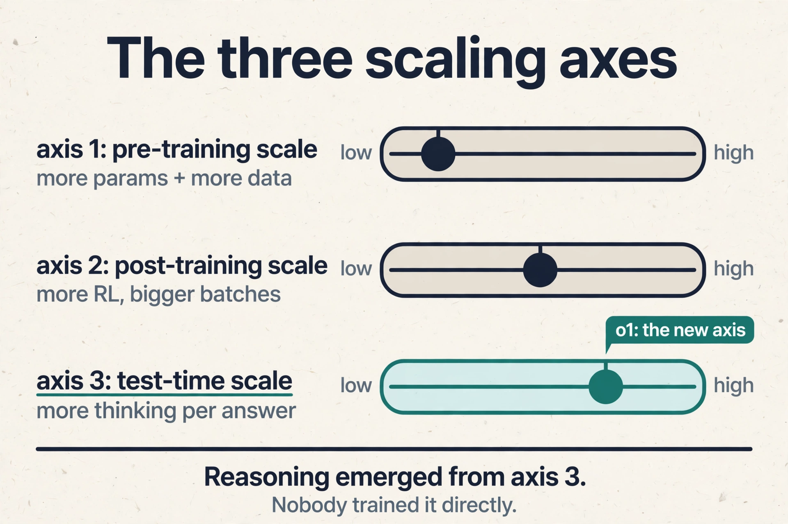
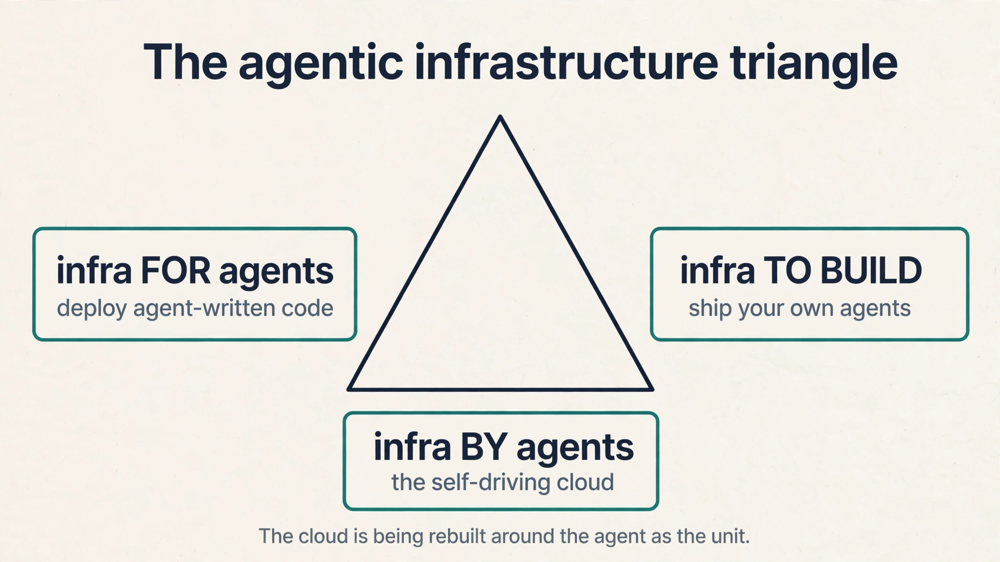

The whole course as a set of short stories. Each block
tells one idea the way the lesson tells it: the
problem, the number, the fix. Follow the links for the
full derivations.

## The numbers table: one glance

| Number | Meaning |
|---|---|
| $650B | Session framing of hyperscaler AI CapEx. ~$730B in reported 2026 plans by October |
| $60M/MW | Full build: $20M factory + $40M machines ($60B per GW) |
| $30M | of the $60M is GPUs: half the total, three quarters of IT spend |
| $4.7M/MW | Construction labor, the bottleneck bar. $4.7B in wages per GW |
| $15M/MW/yr | Renting bare chips: ~4-year payback |
| $30M/MW/yr | Selling tokens: ~2-year payback |
| $1-2M/MW/yr | OpEx: power, insurance, repairs |
| 6 years | Book depreciation standard. the 2026 critique says economic life is 3 |
| $36k / -$4.4k | H100 annual profit, year 2 / year 4 (Research Affiliates) |
| 150k / 2.5M | DeepSeek R1 RL hours / V3 pre-training hours: about 5% |
| 20 tokens/param | Chinchilla compute-optimal scaling rule |
| $2/$10 | Frontier convergence price, Sept 2026: GPT-6 Sol, Sonnet 5.5, Gemini 4 Argon |
| 86/86 | Claude picking Vercel's deployment in agent tests |
| 93% | Vercel support inquiries answered by its own agent |
| 54% | Anthropic share of enterprise coding market, early 2026 |
| 40% / 27% / 21% | Enterprise API spend: Anthropic / OpenAI / Google (late 2025) |
| ~$300 | GPUs activated by saying "thanks" to a flagship model |
| 2.1 GW | Abilene campus: two Denvers of power |

## Memory aids

**Mnemonic: DOLLAR.** The six lessons: **D**igital labor,
**O**pening the megawatt, **L**earning machines (models),
**L**abs to enterprise, **A**pplications (SaaS),
**R**ents accrue below the model. Follow the dollar from
thesis to stack.

**Never-confuse pairs.**

- Renting chips vs selling tokens: $15M vs $30M per
  MW/yr. Chips are the commodity. Tokens are the
  margin. Four years vs two.
- Book life vs economic life: 6 years on the books,
  ~3 years in the power ceiling. The payback must
  finish before the hardware dies economically.
- Lab evals vs enterprise evals: tier 1 steers base
  models, tier 2 steers your specialization. JPMorgan's
  good is not Goldman's.
- Presentation layer vs system of record: the pixels
  go plastic, the database holds. v0 rebuilds the
  surface, not the ACLs.
- Seat vs token: pay for access vs pay for
  intelligence used. The meter moved to the unit of
  cognition.
- Gateway vs sandbox: the CDN for tokens vs EC2 for
  agents. One routes intelligence. One houses the
  agent.
- Test-time vs training-time compute: spend when
  answering vs spend when learning. o1 opened the
  third axis.

**If-this-then-that rules.**

- If the bottleneck moves, the moat moves. Find the
  bottleneck, price the unit, follow the margin.
- If token demand stalls, the $650B is overbuild.
  That is the thesis's falsifier.
- If customers never see the chip, old chips stay
  valuable. Abstraction stretches depreciation.
- If the eval is wrong, the whole lab climbs the
  wrong hill. Guard the eval.
- If software is free, watch retention, not
  generation. Saturday toy vs Wednesday need.
- If the agent cannot transact with you in one call,
  you are invisible to the token economy. Expose
  MCP, CLI, API, consumption pricing.
- If the price war reaches your layer, compete on
  cost per accepted task, not cost per token.

### Digital labor

GDP growth = change in labor + change in capital +
change in technology (Cobb-Douglas, intuitive form).
Labor historically moved only through the birth rate,
a 20-year lead time. Agents doing real work are labor
produced by investment: the first labor force in
history that scales like capital. That is the $650B
CapEx thesis. It is bigger than the space program,
the highways, and the Manhattan Project. Falsifier:
token demand stalling.
[L01](l01-electrons-to-tokens.html)

### The AI production function

AI = data + algorithms + compute + energy + data
centers. The money concentrates on the last three.
Crusoe's founding inversion: at scale, energy is the
scarce input, so move the computers to the cheap
power. Abilene: renewable overbuild from tax credits
pushed power prices negative. Now a 2.1 GW campus
(two Denvers), a 1 GW substation, 9,000 workers on
site in a town of 120,000. Bottlenecks move: chips,
then memory, now energized shells, always skilled
labor. Vertical integration is the hedge.
[L01](l01-electrons-to-tokens.html)

### The $60M megawatt

$20M/MW builds the factory: labor $4.7M (the
bottleneck bar), gas plant $2-3M (turbines tripled
from $1M/MW), electrical (34.5 kV to 480 V),
mechanical (1M-gallon closed water loop, home-scale
annual use), materials. $40M/MW fills it: GPUs $30M,
networking $4M (one coherent cluster), CPUs + storage
$3M (CPUs now scarce too). Total $60B per gigawatt.
Half of it is GPUs. [L02](l02-sixty-million-megawatt.html)

### The payback

OpEx is only $1-2M/MW/yr. Renting bare chips brings
~$15M/MW/yr: a four-year payback on a revenue basis.
Add the managed token layer ("from electrons to
tokens") and revenue rises toward $30M/MW/yr: about
a two-year payback. The variable that matters is
depreciation: six years is the standard, and H100
rental prices rose above launch three years in.
Abstraction (customers never see the chip) stretches
useful life. The 2026 critique: economic life may be
3 years, which makes the two-year payback the safe
one. [L02](l02-sixty-million-megawatt.html)

### The model eras

2012 AlexNet: GPUs + ImageNet beat handcrafted
features. The bargain: uninterpretable scale.
2017 transformer: self-attention parallelizes on
GPUs, scales to long sequences. 2018-19
pre-training: next-token prediction on internet
text, backprop, trillions of tokens. The product:
compression of human knowledge into weights. Scaling
laws: Kaplan (bigger performs better, GPT-3),
Chinchilla (scale data with parameters, ~20
tokens/param). Intelligence becomes a capital
allocation problem. Then RLHF steers it (GPT-4).
Then o1 adds test-time compute. Chain of thought
emerges untrained. Plus tool use: agents.
[L03](l03-how-models-get-smarter.html)

### The bottleneck tour

Compute, then architecture, then pre-training data,
then usability, now RL environments, next continual
learning (the hot-stove problem: one loud signal,
permanent learning). Code came first for three
reasons: RLVR gives free verifiable rewards
(compiles, unit tests), code tokens are abundant,
and code is AGI-complete, the general language for
acting on the world. Price of the chapter: the
pre-training data wall. Only frontier labs can still
play there. By Aug 2026, 31% of filtered web text
was AI-generated. [L03](l03-how-models-get-smarter.html)

### Evals and the 5 percent

Evals set the roadmap: define the hill, RL is the
eval-maxing machine (SWE-bench started the code
race). Never train on the eval itself. Evals stack
in tiers: lab evals steer base models, enterprise
evals steer specialization (JPMorgan's good is not
Goldman's). DeepSeek: ~150k GPU-hours of RL on
2.4-2.5M of pre-training, about 5%. Post-training is
cheap and its share is growing (data-center-wide
RL). General models set the floor. Specialization
sets the ceiling. [L04](l04-evals-rlvr-enterprise.html)

### DoorDash and the Pareto frontier

DoorDash onboards 100k+ merchants a year. Menu
images plus a strict style guide defeated general
models. Fix: human-corrected outputs defined the
error rate, RL minimized it directly. No prompting.
Cognition/Windsurf: a small model trained hard on
bug-catching answers in under 2 seconds with
big-model accuracy. The production pattern is an
ensemble: general orchestrator, fast specialists,
proprietary data. Cursor's Composer shows continual
learning early: accept/revert telemetry as implicit
rewards, hours per step, massive batches.
[L04](l04-evals-rlvr-enterprise.html)

### The SaaS reckoning

Coding agents are the biggest TAM expansion in
software history: the programmer-headcount cap on
cloud demand is gone. "Writing code does not make you
special. Deploying code does." Agentic
infrastructure has three sides: for agents (deploy
agent-written code), to build agents (ship your own:
Vercel's support agent answers 93%), automated by
agents (the self-driving cloud). SaaS was one shared
interface for everyone. Now the presentation layer
goes plastic (two people rebuilt Salesforce's
surface) while the system of record holds. Software
is basically free. Reflexivity says engagement
compounds anyway. Retention is the metric to watch.
[L05](l05-software-is-dead.html)

### Where value accrues

In 2026: below the model. The CapEx is the moat
($60B/GW), demand outruns supply, and models
commoditize faster than concrete. Tokens are the new
commodity. Pricing moves from seats to tokens. The
AI gateway is a CDN for tokens (observe, fail over,
cache, balance). Semantic caching stands down ~300
GPUs when "thanks" needs no flagship. The sandbox is
EC2 for agents: an ephemeral computer per task.
The block economy: agents assemble local-reasoning
blocks (Claude picked Vercel 86/86). Long: anyone
moving at the speed of tokens. Short: static
content, code-is-scarce builders, closed
enterprises. The map is dated 2026. The method
(find the bottleneck, price the unit, follow the
margin) is durable. [L06](l06-where-value-accrues.html)

## Rapid-fire self-tests

1. GDP growth = labor + capital + technology. Which
   term was fixed, and what broke it? **Labor was
   fixed by the birth rate (20-year lead time).
   Digital labor broke it: agents are labor produced
   by investment.**
2. $60M/MW = ? **$20M factory (labor $4.7M, gas
   plant $2-3M, electrical, mechanical, materials)
   + $40M machines ($30M GPUs, $4M network, $3M
   CPU/storage).**
3. Payback: renting chips vs selling tokens?
   **$15M/MW/yr = ~4 years. $30M/MW/yr = ~2 years.
   OpEx $1-2M/MW/yr.**
4. Six years vs three years? **Book depreciation vs
   the 2026 economic-life critique. The two-year
   payback survives the critique. the four-year one
   does not.**
5. Chinchilla rule? **~20 training tokens per
   parameter. Starve the model and the parameters
   are wasted.**
6. The 5 percent? **DeepSeek R1 RL: ~150k
   GPU-hours on ~2.5M of pre-training. The share is
   rising.**
7. Eval loop? **Define the hill, RL climbs it, pick
   the next hill. Never train on the eval.**
8. Pareto frontier pattern? **General orchestrator,
   fast specialists, proprietary data.**
9. SaaS split? **Presentation layer goes plastic.
   System of record holds.**
10. Value in 2026? **Below the model. The method:
    find the bottleneck, price the unit, follow the
    margin.**
