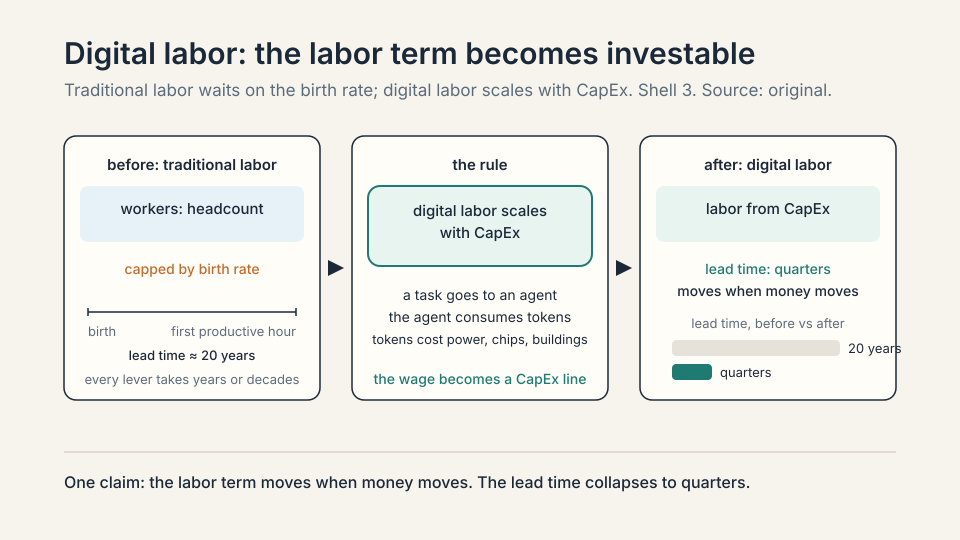
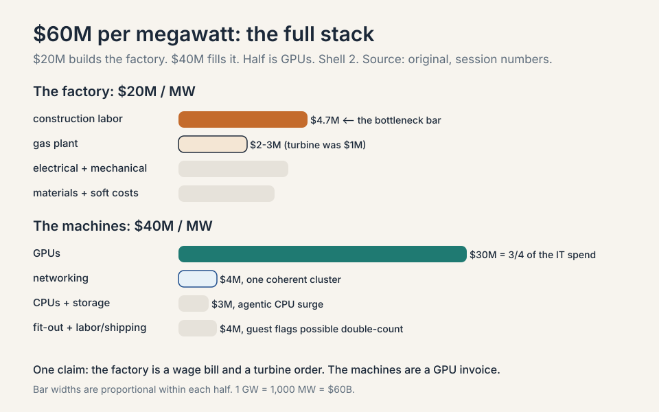
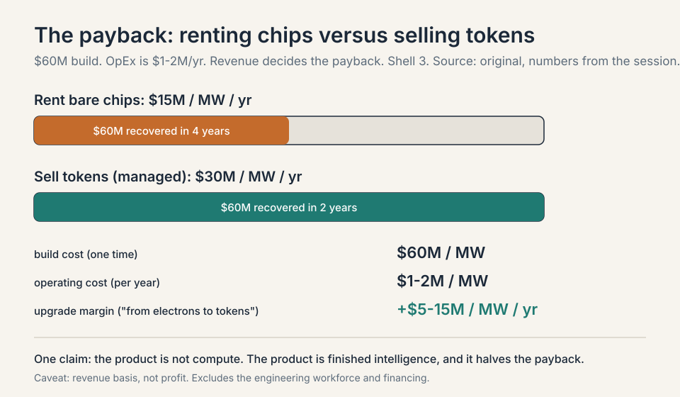
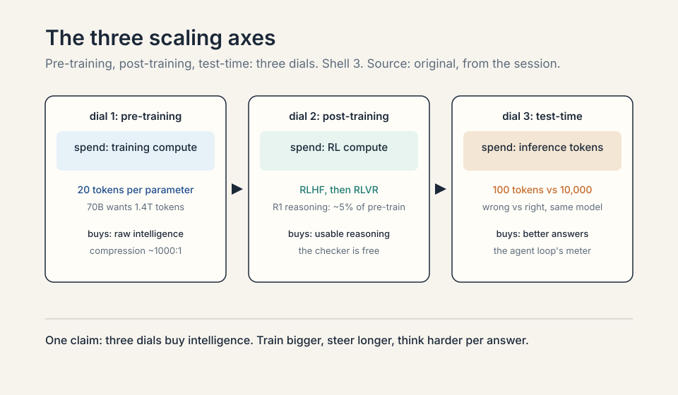
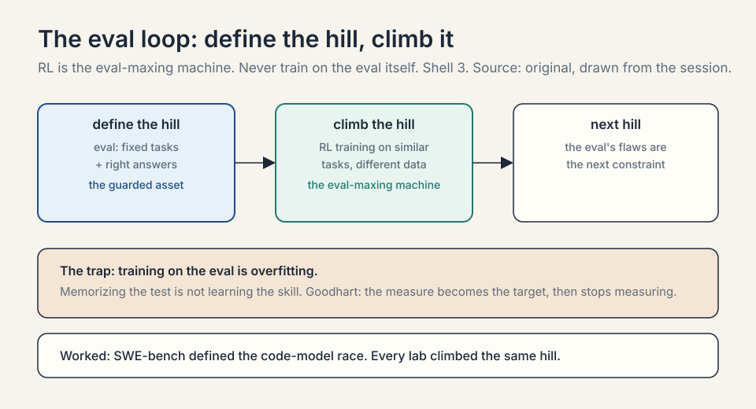
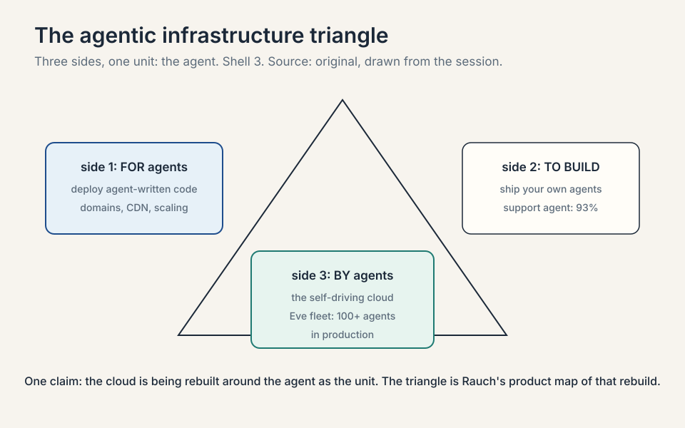

30 minutes · interview speed

This page tells the whole AI-economics story fast.
Each section gives you the working version: enough to
answer interview questions with confidence. Memory aid
and a self-test close each section. Links at the end
of each section take you into the full lesson for the
derivations and the follow-ups.

### 1. Why $650 billion is rational: digital labor

GDP growth comes from three terms: change in labor,
change in capital, change in technology. For all of
history the labor term moved only through the birth
rate, a 20-year lead time. AI breaks that: an agent
doing real work is labor produced by an investment
decision. Call it digital labor. The hyperscaler CapEx,
bigger than the space program and the Manhattan
Project, is a bet that the labor term of the growth
equation is now investable. The falsifier is token
demand stalling.

**Memory aid.** Labor was the slow term. Now it moves
with money. The toy: buying half a point of labor
growth compounds to a 5 percent larger economy in ten
years.

**Self-test.** Q: Why is the $650B a bet on labor,
not on chatbots? A: Because the spend buys the
factories that produce digital labor, and the return
is the labor term of GDP growth moving on an
investment horizon for the first time in history.

<ul class="crash-links">
<li><a href="l01-electrons-to-tokens.html">Lecture 1: the demand thesis</a></li>
</ul>

### 2. What the money buys: the $60M megawatt

Price the factory per megawatt. About $20M builds it:
construction labor alone is $4.7M per MW (the
bottleneck bar: electricians, welders, plumbers are
scarce), the gas plant is $2-3M per MW (turbines
tripled from $1M), plus electrical, mechanical, and
materials. About $40M fills it with machines: $30M in
GPUs, $4M in networking, $3M in CPUs and storage.
Total: $60B per gigawatt, half of it GPUs. The energy
insight behind it: at scale, energy is the scarce
input, so the winning move is moving computers to
cheap stranded power (Abilene: negative power prices
to a 2.1 GW campus).

**Memory aid.** Never-confuse pair: the factory is a
wage bill and a turbine order ($20M). The machines
are a GPU invoice ($40M). Half the total is one
vendor's chips.

**Self-test.** Q: A 1 GW campus costs what, and what
is the single biggest line? A: $60B. The biggest
single line is GPUs at $30M/MW ($30B per GW).
The biggest factory line is construction labor at
$4.7M/MW.

<ul class="crash-links">
<li><a href="l02-sixty-million-megawatt.html">Lecture 2: unit economics</a></li>
</ul>

### 3. The payback: 4 years for chips, 2 for tokens

OpEx is only $1-2M per MW per year. Renting bare
chips brings about $15M per MW per year: a four-year
payback on a revenue basis. Add the managed layer
that serves model APIs ("from electrons to tokens")
and revenue rises toward $30M per MW per year: about
a two-year payback. The swing variable is
depreciation: six years is the standard, H100 rental
prices rose above launch three years after debut,
and abstraction (customers never see the chip)
stretches useful life. On commoditization: old
compute commoditizes, the cutting edge and scale do
not. expect Nvidia's ~80% margins to compress toward
~60%.

**Memory aid.** If-this-then-that: if the 2026
critique is right and economic life is 3 years, then
the two-year payback survives and the four-year one
does not. Sell tokens.

**Self-test.** Q: Why does selling tokens halve the
payback? A: Because the managed layer adds $5-15M
per MW per year of revenue on the same $60M build.
The product is finished intelligence, not raw
compute. 60/15 = 4 years. 60/30 = 2 years.

<ul class="crash-links">
<li><a href="l02-sixty-million-megawatt.html">Lecture 2: the payback math</a></li>
</ul>

### 4. Why the machines keep getting more valuable

Tour the model layer as a moving bottleneck. AlexNet
(2012): GPUs plus ImageNet beat handcrafted
features. The transformer (2017): attention
parallelizes and scales to long sequences. The
pre-training era (2018-19): next-token prediction on
internet text. The scaling laws: Kaplan (bigger
performs better, GPT-3), Chinchilla (scale data with
parameters, ~20 tokens per parameter), which turned
intelligence into a capital allocation problem.
RLHF steered the raw model (GPT-4). Reasoning models
(o1, 2024) added test-time compute. chain of thought
emerged without being trained. Next bottleneck:
continual learning, the hot-stove problem of learning
from one loud signal. Price of the era: the
pre-training data wall.

**Memory aid.** Mnemonic: **A-T-P-S-R-R**: AlexNet,
Transformer, Pre-training, Scaling laws, RLHF,
Reasoning. Each letter breaks the previous era's
bottleneck.

**Self-test.** Q: What are the three scaling axes,
and which one is new? A: Pre-training scale, post-
training scale, and test-time scale. Test-time
compute is the new one (o1, 2024): spend compute
while answering, not just while training.

<ul class="crash-links">
<li><a href="l03-how-models-get-smarter.html">Lecture 3: the model layer</a></li>
</ul>

### 5. Evals, the 5 percent, and the enterprise layer

Evals set the roadmap: define the hill with a
benchmark, then RL is the eval-maxing machine
(SWE-bench started the code race). Post-training is
shockingly cheap: DeepSeek's RL stage used about
150k GPU-hours against 2.4-2.5M for pre-training,
roughly 5%, and the share is growing. Enterprises
live one tier down: general models set the floor,
but good differs per company, so specialization sets
the ceiling. DoorDash's proof: 100k+ merchants a
year, human-corrected menus defined the error rate,
RL minimized it directly. The production pattern is
an ensemble: general orchestrator, fast specialists
(sub-2-second bug checks), proprietary data.

**Memory aid.** Never-confuse pair: lab evals steer
the base model (tier 1, shared). Enterprise evals
steer your specialization (tier 2, proprietary).
JPMorgan's good is not Goldman's.

**Self-test.** Q: Why is post-training a startup's
game and pre-training a hyperscaler's? A: Because
the 5 percent only works on top of the 95. RL
steers representations it did not build. The floor
is bought by labs. the ceiling is bought by
specialists.

<ul class="crash-links">
<li><a href="l04-evals-rlvr-enterprise.html">Lecture 4: enterprise AI</a></li>
</ul>

### 6. The SaaS reckoning

Coding agents are the largest expansion of who can
create software in history, and they break the
programmer-headcount cap on cloud demand. "Writing
code does not make you special. deploying code does."
Agentic infrastructure rebuilds the cloud in three
parts: for agents, to build agents (Vercel's support
agent answers 93%), automated by agents (the
self-driving cloud). SaaS was a compromise, one
shared interface for everyone. now the presentation
layer goes plastic while the system of record holds.
Software becomes throwaway and basically free, but
reflexivity (once you know the efficiency, you never
forego it) says engagement compounds. Watch
retention, not generation.

**Memory aid.** The triangle: FOR agents, TO BUILD
agents, BY agents. The SaaS split: pixels go
plastic, the database holds.

**Self-test.** Q: Two people rebuilt Salesforce's
surface inside Vercel. What did they not rebuild,
and why? A: The system of record: the database,
the access controls, the workflows built over
decades. Generation is cheap. Trust and data
gravity are not.

<ul class="crash-links">
<li><a href="l05-software-is-dead.html">Lecture 5: software vs agents</a></li>
</ul>

### 7. Where value accrues: below the model

The course's core question, answered for 2026: value
concentrates below the model. The CapEx is the moat,
demand outruns supply, and models commoditize faster
than concrete. Tokens are the new commodity, and
pricing moves from seats to tokens. The October 2026
price ladder runs $0.50 to $50 per million output
tokens. the frontier converged at $2 per million
input across all three labs in September 2026. Two
new primitives capture the value: the AI gateway, a
CDN for tokens (semantic caching stands down ~300
GPUs when "thanks" needs no flagship model), and the
sandbox, EC2 for agents (an ephemeral computer per
task). The block economy explains agent choice:
agents assemble local-reasoning blocks they know
(Claude picked Vercel 86 out of 86). Bet long anyone
moving at the speed of tokens. short static content,
code-is-scarce builders, and closed enterprises. The
map is dated 2026. The method, find the bottleneck,
price the unit, follow the margin, is permanent.

**Memory aid.** Mnemonic: **DOLLAR** (Digital labor,
Opening the megawatt, Learning machines, Labs to
enterprise, Applications, Rents below the model).
The method: bottleneck, unit, margin.

**Self-test.** Q: An interviewer asks "where will
value accrue in 2030?" How do you answer? A: With
the method, not the map. Name today's bottleneck
with a number, price the unit it gates, follow the
margin, and name what would move it. In 2026 the
answer is below the model. The skill is redrawing
the map when the bottleneck moves.

<ul class="crash-links">
<li><a href="l06-where-value-accrues.html">Lecture 6: the accrual map</a></li>
</ul>

