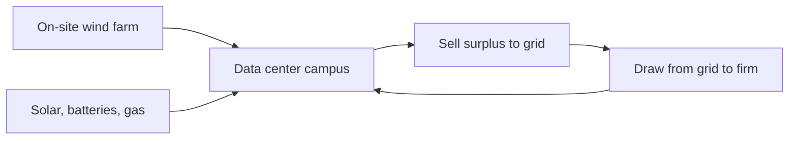

### Coverage and sourcing

This lesson follows one session: "Building AI Factories," the
MS&E 435 (Economics of the AI Supercycle, Spring 2026,
instructor Apoorv Agrawal) session with guest Chase
Lochmiller, co-founder and CEO of Crusoe, on infrastructure
and building AI factories at gigawatt scale. It also uses
the course site's framing of AI as "the biggest technology
supercycle since the PC, Internet, and Mobile." Figures and
claims marked "October 2026" are updates added after the
session, each with its source. No transcript or captions
exist for the video, so segment-level mapping of claims to
timestamps is not possible. The coverage map at the end of
the chapter maps every major session claim to the section
that covers it instead.

## The chart that opens the course

The first session opens on one chart. It plots the capital
expenditure of the five hyperscalers on AI, and the line goes up
and to the right, fast. **CapEx** means capital expenditure:
money spent to build long-lived assets, not to run the business
day to day. A **hyperscaler** is one of the giant cloud
operators: Amazon, Alphabet, Meta, Microsoft, and Oracle. To put
the scale in context, the host frames it as one of the largest
investments ever made: bigger than the space program, bigger
than the interstate highway system, bigger than the Manhattan
Project. Second only to the United States defense budget.

The natural question is the one the host puts to the guest:
when the hyperscalers spend on the order of $650 billion
building data centers, where does that money actually go?

A **megawatt** is one million watts of power draw. It is
the unit price of the whole business: the substation, the
cooling plant, and the rack count are all priced per
megawatt. Think of it as the "per seat" of the data center
business.

This chapter builds the answer from zero. It starts with what
it takes to produce AI at all, then shows why the spending is
rational under one economic model, then follows the money down
into the physical stack: the power path, the cooling path, the
steel, the concrete, and the hands. Three anchor numbers to
hold: about $20M per MW for the factory, about $40M per MW
for the machines, and a 4-year payback renting chips. It ends
by checking whether the $60 million megawatt earns its keep.
The next chapter prices the depreciation debate this chapter
opens. **Depreciation** is how an asset's cost is spread
over its useful life: the fight is over how many years a GPU
stays valuable.

### Subchapter: the chart, updated to October 2026

The session's $650B framing is a host's estimate from spring
2026. What happened next made the chart steeper, not flatter.
Three of the four largest hyperscalers raised their 2026
guidance mid-year. Latest full-year guidance as of September
2026:

| Company | 2025 actual | 2026 guidance | Year over year |
|---|---|---|---|
| Amazon | ~$128B | ~$220B | +72% |
| Alphabet | ~$91B | $195-205B | ~+115% |
| Meta | ~$72B | $130-145B | ~+90% |
| Microsoft | ~$118B | ~$175B | +48% |
| **Combined** | **~$410B** | **~$730B** | **+78%** |

Sources: company earnings calls and 10-K filings (a 10-K is
the audited annual report a US public company must file with
the SEC), via valueaddvc and financial press, July-September
2026. Oracle,
the fifth hyperscaler, guides about $70B of net cash capex
for fiscal 2027. Gross spend runs $90-95B. The $20-25B gap
is customer prepayments netted against the build: customers
partly finance the factory they will later rent
(Q1 FY2027 earnings call, September 2026). For scale, the
four companies spent a combined $141B in 2023.
The 2026 figure is 5.2 times that. Goldman Sachs credit
strategists put the 2027 combined bill near $1.14 trillion
(July 2026), later raising the base case to about $1.2
trillion with upside to $1.4 trillion. Treat that as
an analyst estimate, not a promise.

Two footnotes keep the table honest. Microsoft's $175B is
calendar-2026 capex including finance leases. A **finance
lease** is a lease accountants treat like a purchase: the
asset sits on the company's books. An **operating lease** is
treated as rent: it stays off the balance sheet. The number
looks smaller than an earlier ~$190B figure only because more
future data-center leases now count as operating leases, not
because the build shrank. And Amazon's trailing-twelve-month
**free cash flow**, the cash left after paying for operations
and capital spending, swung from an $18.2B inflow to a $7.6B
outflow in the second quarter of 2026 as the spending
accelerated (Amazon Q2 2026 earnings, July 30, 2026): the
money is real, and it is being spent ahead of the revenue.

In July 2026, Census data put US private data-center
construction at a $75.2 billion annualized pace, up 57%
year over year, and the sector accounted for essentially
all of that month's nonresidential construction growth.
A broader measure, private data-center outlays plus IT
equipment, pulled ahead of residential construction
investment for the first time in modern records. The
thesis from the session held up: the money kept flowing, and
it flowed to the three inputs this chapter identifies.

## The AI production function

Before the money, the recipe. The guest, Chase Lochmiller of
Crusoe, starts with a plain question: what does it take to
produce AI? His answer is an equation with five ingredients,
and the money lands on only three of them.
A **production function** is an economist's recipe: the list
of inputs a process needs, and what each one does. Decision
rule for the rest of the chapter: money flows to the inputs
that gate output, never to the inputs that do not.

```ascii
AI = data + algorithms + compute + energy + data centers
```

Four of the algorithm words need definitions now. A
**neural network** is a computing model built from layers
of simple math units that learns patterns from examples.
**Training** is the phase that teaches a neural network:
one giant compute run that sets the model's internal
numbers, done once. **Backpropagation** is the algorithm
that trains a neural network: it measures the error at
the output and pushes corrections backward through the
layers. A **transformer** is the neural network
architecture behind modern language models: the design
that made large-scale training work.

| Ingredient | Plain meaning | Economic role | $/MW |
|---|---|---|---|
| data | the text, images, and labels models learn from | raw material | no per-MW price |
| algorithms | backpropagation, neural networks, transformers | process technology | no per-MW price |
| compute | GPUs doing parallel tensor math at high speed | machinery | about $40M |
| energy | the electricity that runs the GPUs | fuel | about $20M, combined with data centers |
| data centers | the buildings that house and cool the machines | factory buildings | about $20M, combined with energy |

Read each ingredient the way an economist reads an input to a
factory. **Data** is raw material. Scale AI buys and labels
it. The transcript names a second company that sounds like
"Merkur": the match is Mercor, the AI talent marketplace
that routes 300,000+ vetted experts to labs like OpenAI,
Google, Meta, Microsoft, Amazon, and Nvidia, paying out over
$4M a day (Mercor company statements, September 2026). CEO
Brendan Foody said the annualized revenue run rate crossed
$2B in July 2026 (reported by Forbes, July 2026), after a
$350M Series C at a $10B valuation in October 2025, led by
Felicis. A **Series C** is a startup's third priced
venture-capital round: the letters run Seed, A, B, C, and
later letters mean later, larger raises, so a Series F sits
three rounds after a Series C. The market
now prices neutrality: Meta's $14.3B Scale AI investment in
June 2025 pushed OpenAI and Google to cut ties over
independence concerns. Handshake is the third name in the
transcript. **Algorithms** are the process
technology, invented mostly inside the research labs: new
architectures, recursive learning techniques, better ways to
use the data. **Compute** is the machinery: large numbers of
GPUs running the same math in parallel. **Energy** is the
fuel. **Data centers** are the factory buildings.

### Subchapter: data and algorithms, the unspent inputs

Data and algorithms are real costs, but they do not absorb
CapEx at the factory scale. Data labeling is a services
business with thin margins and no capacity constraint that
gates anything. Algorithms are labor costs inside labs: a few
hundred researchers, salaries in the millions, against a
$60B-per-gigawatt build. The guest's point is about marginal
bottlenecks: doubling the data budget buys no AI factory.
Doubling the energy budget buys a gigawatt of output. Money
flows to the inputs that gate output, and those are the last
three.

### Subchapter: compute, energy, data centers, where the money lands

The last three inputs share one property: each is bought by
the megawatt, defined at the top of this chapter. The
session prices it exactly: about $20M per MW for the factory
(the building plus the power plant) and about $40M per MW
for the machines inside. The production function is a menu.
The megawatt is the unit price. This chapter's longest
section opens each of those dollars.

## The growth equation

The guest reaches for a classic economics model to explain
the bet. It is called the **Cobb-Douglas** model of
production, and it decomposes the growth of an economy into
three additive parts. Douglas and Cobb published it in 1928.
A century later it still frames how economists split growth
into its causes.

The guest's intuitive version:

```ascii
GDP growth = change in labor + change in capital + change in technology

labor       more workers, or more productive hours
capital     buildings, plants, equipment, invested money
technology  ideas that make labor more productive
```

The textbook's formal version, for the record, is
multiplicative: output = A x K^a x L^b, where A is
technology, K is capital, L is labor, and the exponents are
each input's share of output. In growth rates that becomes:
GDP growth = tech growth + a x (capital growth) + b x (labor
growth). The guest uses the simple additive form. The
formal form agrees with his point: labor's contribution is
its share of output, about 0.6 in the US, times how fast the
workforce grows.

A **supercycle** is a long wave of investment driven by a
general-purpose technology: the PC, the internet, mobile,
and now AI. The course site names AI "the biggest technology
supercycle since the PC, Internet, and Mobile." The
Cobb-Douglas frame says a supercycle earns its name when it
moves one of the three terms hard.

Technology gets most of the press. The guest's argument is
about labor. Historically, the labor term could only change
through the birth rate: a 20-year lead time, because a new
worker must be born, raised, schooled, fed, and housed
before producing anything. Labor was the slow term. Capital
could move fast. Labor could not.


### Subchapter: the toy version, with numbers

Run the toy. Suppose an economy grows 3 percent a year,
split evenly: 1 point from labor, 1 from capital, 1 from
technology. The labor point is capped by demography. No
investment decision made this quarter changes how many
20-year-olds exist. The term is, for all practical purposes,
fixed on any horizon a company plans against.

Now suppose an investment could buy 0.5 points of labor
growth the way capital buys 1 point. Total growth moves
from 3 percent to 3.5 percent, and the buyer captures the
surplus. Compounded over a decade:

```
at 3.0%:  1.03^10  = 1.34
at 3.5%:  1.035^10 = 1.41
ratio:    1.41 / 1.34 = 1.05
```

That half point is the difference between $1.34 and $1.41
on every dollar of GDP: a 5 percent larger economy. The
$650 billion is a bid on that half point.

### Subchapter: why labor was the slow term

Birth rate is not a dial. Raising a worker costs two decades
of food, schooling, and housing before the first productive
hour. The guest jokes that he has three kids: he knows the
incubation period personally. Immigration moves labor across
borders but does not create it. Training changes quality,
not headcount. Every lever on the labor term has a lead
time measured in years or decades. Capital, by contrast,
deploys in quarters: a loan becomes a factory. The guest's
insight is that the asymmetry, not the technology itself,
is the opportunity.

**The key question:** what if the labor term could be moved
by an investment decision, the way capital always could?

## Digital labor: the term that became investable

AI breaks the cap. When you hand a task to a coding agent
("build a CRM for my new product") and it does the work,
that is labor being produced. Not a tool assisting a worker.
Labor itself, created by buying data centers and GPUs. The
guest's phrase is **digital labor**: the first labor force
in history whose size changes through an investment
decision instead of a birth rate.


### Subchapter: the mechanism, step by step

A **token** is the basic unit of text an AI model reads and
writes: roughly three quarters of a word. The paragraph you
just read is a few hundred tokens. Every token an agent
consumes costs compute, power, and buildings.

Step one: a task exists that a human would do for wages.
Step two: an agent does it, consuming tokens. Step three:
tokens cost power, chips, and buildings, all bought with
capital. The wage becomes a CapEx line. The labor term
moves when money moves, on a quarterly horizon, like
capital always did. That is the whole mechanism. Nothing in
it requires the agent to be as good as the human. It
requires the agent to be cheap enough per task.

### Subchapter: what it replaces and what it does not

Digital labor substitutes for routine cognitive work:
drafting, summarizing, triaging, coding boilerplate. It
does not substitute for physical presence, trust
relationships, or judgment under ambiguity. The guest's
thesis does not require replacing all labor. It requires
replacing enough that the labor term of GDP growth moves.
Even a fraction is a first in history. The guest's bar is
deliberately low: in the toy economy, half a point of labor
growth bought a 5 percent larger economy in ten years.
Decision rule: ask whether agents can take a slice of the
routine cognitive work, not whether they can do everything.

That is the thesis behind the chart. The $650 billion is
not a bet that chatbots are fun. It is a bet that the labor
term of the growth equation can now be scaled the way
capital always could, and that whoever builds the factories
for digital labor captures the return. Demand-side
corroboration exists: Goldman Sachs projects token
consumption rising roughly 24-fold by 2030, reaching about
120 quadrillion tokens a month, driven mainly by enterprise
AI agents (May 2026 report, "Decoding the Agentic Economy,"
analyst Jim Schneider), and expects AI supply and demand
to stay unbalanced until at least the second half of 2027
(June 2026 analysis).


## Why energy comes first

Here the chapter turns from the thesis to the strategy it
implies. If digital labor is the prize, the bottleneck is
whatever gates the factories. The guest's founding insight,
from just under a decade of building, was that the scarce
resource was **energy**, not chips. Decision rule: rank the
inputs by scarcity, then move the factory to the scarcest
one. Everything after this paragraph is that rule, applied.

### Subchapter: why the hubs filled first

The reasoning is market logic. Data center capacity had
grown steadily through the web 2.0 era, clustering in
established hubs. Northern Virginia, which the guest names,
runs a large share of the internet. Building "the next data
center in Northern Virginia" was a crowded trade: land
costs more, permitting queues are long, and power prices
reflect competition. Meanwhile the new workloads shared
one trait: at scale, they are limited by energy.
Training, defined at the top of this chapter, runs once.
**Inference** is running the trained model for users:
answering each query and generating each token, done
billions of times. **Proof-of-work** is the crypto
mining method where computers burn energy solving puzzles
to validate transactions. AI training and proof-of-work
crypto both turn electricity directly into output, which
is why both hunted cheap power.
The guest's premise is that markets are reasonably
efficient everywhere else. Energy was the one input where
the market had mispriced location.

### Subchapter: the inversion

So Crusoe inverted the usual plan. Instead of moving energy
to the computers, move the computers to the energy. Find
places with abundant cheap power that are not historical
data center markets, and build there. Moving data over
fiber is cheap. Moving electrons over transmission lines is
expensive and slow to permit. The inversion follows the
cheap move. The host gives the company name its frame:
Robinson Crusoe, the castaway who made do with what the
island had. The company makes do with stranded energy.

### Subchapter: Abilene, the tax-credit arithmetic

The worked example is Abilene, Texas, and it deserves the
arithmetic. West Texas is consistently windy and sunny.
Renewable developers built heavily there because
**production tax credits** paid them per clean electron
produced, independent of the sale price. The guest's
explanation: developers get paid by the government to
produce clean electrons, and they must sell them to someone
independent of the price. The result was overbuild: more
generation than the grid could carry out, and no marginal
buyer. Power prices went negative. There was not enough
transmission to move the power somewhere useful. Crusoe's
answer: "Have we got a power-hungry application for you?"

Crusoe signed its first two buildings there in June 2024,
and the site is now described as one of the largest AI
computing campuses in the world, possibly the largest.

. Eight buildings serve Oracle and OpenAI (Project Stargate); a 350 MW gas plant energizes the cluster. Shell 3. Source: original, numbers from the session; 1.2 GW cap from March 2026 press. Project: Stanford Frontier AI.")

### Subchapter: Abilene, the substations

The campus numbers set the scale for the whole course. A
**substation** is the facility where high-voltage grid
power is received and stepped down for local use. Abilene
has a 200 MW substation and a 1 GW substation, the latter
described as the largest privately owned substation in the
United States. One gigawatt is roughly the power draw of
the city of Denver, the guest's home town. The full campus
is 2.1 gigawatts in aggregate: two Denvers of power, all
feeding computers. Eight buildings serve Oracle and OpenAI,
the project known as Project Stargate.

### Subchapter: Abilene, one coherent cluster

The campus runs as **one coherent cluster**: all chips
across all data centers connect on the same
high-performance back-end network, so one training job can
run across every data center at once. That is an unusual
architecture. Most campuses are separate buildings that
happen to share a fence. Abilene is one machine with eight
halls.

### Subchapter: Abilene, the construction workforce

The human scale: a 5,000-car parking lot, completely full,
with roughly 9,000 people on site every day building the
campus, against a town of 120,000. Crusoe had to create
labor and retention incentives to attract workers to move
there for short-term construction. The long tail: the
steady operating staff is around 2,000 people running the
clusters and the power plant, a large permanent job creator
in that local economy.

### Subchapter: Abilene, the 350 MW gas plant

Abilene added a 350 MW natural gas plant to energize the
cluster: when the grid cannot deliver, the campus makes its
own power.

### Subchapter: Abilene since the session

The session's numbers are spring 2026: 2.1 GW planned.
October 2026 adds confirmation and a caution: the plan
stands, but the grid capped the build at 1.2 GW, 57% of
the plan.

| What changed | Detail |
|---|---|
| Scale capped at 1.2 GW | In March 2026 OpenAI and Oracle stopped expanding the site beyond 1.2 gigawatts, citing power grid delays of over a year. Construction continues on the eight buildings; only the growth beyond 1.2 GW halted. |
| 450,000 GB200s | At Oracle AI World in October 2026, Larry Ellison said the site will house more than 450,000 Nvidia GB200 GPUs at 1.2 GW, "enough power for one million four-bedroom homes." |
| First buildings live | The first two buildings went operational in September 2025. The remaining six are expected by mid-2026. |
| The money | Crusoe and Blue Owl raised about $15B in debt and equity for the project (reported at about $15B in March 2026 press coverage. A $7.1B JPMorgan-led construction loan for phase two was arranged by Newmark). JPMorgan provided about $9.6B of the debt [uncertain]. Oracle signed a 15-year lease [uncertain]. |
| The Microsoft expansion | The session noted an expansion planned to the south of the campus, for Microsoft. Announced in March 2026 as a 900 MW adjacent Abilene campus with an on-site power plant. Separately, Bloomberg reported (via Data Center Dynamics, October 2026) that Nvidia paid Crusoe about $150M as a deposit on the expansion footprint after Oracle and OpenAI dropped a planned 600 MW expansion, and that Nvidia is in talks with Meta as a possible tenant. A deal has not been signed, and neither company has confirmed the payment. |

The lesson, in one number: 2.1 GW planned, 1.2 GW
delivered. Power availability, not chips, set the ceiling:
43% of the plan died in grid delays of over a year. The
energy-first strategy won the site. The grid still set its
size.

### Subchapter: across the meter, defined

The model has a name: **across the meter**. The **meter**
is the interconnection point with the grid: the boundary
where the utility's wires meet yours. **Behind the meter**
is power generated on your side of that boundary. Across
the meter means: build on-site generation (wind, planned
solar, batteries, gas), use what the campus needs, sell
the surplus into the grid, and draw from the grid when the
campus needs firming (wind calm, sun down, maintenance).
One claim: the campus is a power plant that happens to
compute. Generation and load sit on the same site, and
the grid is the battery.

### Subchapter: Quan, the worked example

Abilene was not a one-off. The guest showed a second site
to prove the playbook repeats. Quan, Texas: 3,500 people
working on the project in a town of 1,500. It sits close
enough to Amarillo to draw on that city's working
population, and on some of the best wind in the United
States. An on-site wind farm feeds power directly into the
data center.

Apply the across-the-meter model: the wind farm sits
behind the meter, feeding the campus first. Surplus sales
into the grid create energy abundance that drops costs
for local ratepayers. The guest calls it mutually
beneficial: Crusoe invests in power infrastructure, and
the town gets cheaper, more abundant power. The customer
is unnamed: "a very big customer."



### Subchapter: what is used where, October 2026

The energy-first playbook is now the industry's default
strategy. The pattern repeats the Abilene logic at
national scale: secure generation, transmission, and
permits before the GPUs arrive, because power is the
longest lead-time input.

- **Nvidia, SB Energy, OpenAI in Ohio.** The PORTS-Pike
  campus in Pike County, Ohio targets 8 GW of IT load with
  at least 10 GW of new power generation. Nvidia invested
  $1.5B in SB Energy and agreed to up to $105B in credit
  support for the land, power, and shell buildout of the
  initial 4.25 GW, with an option on the remaining 3.75 GW.
  OpenAI signed a 20-year lease. The first 800 MW is
  expected in 2028. (Announced August 17, 2026. Nvidia
  8-K filing.) At the session's $60M per MW, 8 GW
  implies roughly $480B of implied build cost, financed
  through the lease structure, not paid upfront by one
  party.
- **Microsoft.** The guest reported Microsoft adding about
  a gigawatt of capacity in a single quarter in spring
  2026.
- **Crusoe.** In September 2026 Crusoe raised a $3.9B
  Series F, co-led by Mubadala Capital, with over 1 GW
  delivered and operational. Crusoe says OpenAI trained its
  Astra model at the Abilene campus.
- **The neoclouds.** A **neocloud** is a cloud provider
  built almost entirely around GPU infrastructure, selling
  compute rather than general IT. Nvidia CFO Colette Kress
  expects the neocloud partner network to end 2026 with
  about 8 GW of installed capacity, up from roughly 3 GW
  at the end of 2025 (Nvidia Q2 FY2027 earnings call,
  August 2026). Nvidia has become the financier of
  the layer, not just its supplier: up to $105B in credit
  support for the Ohio campus, $6.3B in guarantees with
  CoreWeave (announced with the July 2026 financing
  model), and memoranda with Apollo and BlackRock to
  mobilize more than $500B of third-party capital
  (announced July 2026, agreement signed August 17, 2026).

| Neocloud | Scale, October 2026 |
|---|---|
| CoreWeave (Nasdaq: CRWV) | 1.5 GW active power, 3.7-4.2 GW contracted, ~$104B revenue backlog. Q2 2026 revenue $2.575B, up 112% (Q2 2026 earnings, August 11, 2026). Full-year 2026 guidance: $12.4-13.2B revenue on $35-39B capex. |
| Nebius (Nasdaq: NBIS) | Q2 2026 group revenue $582.3M, up 454% (Q2 2026 earnings report, August 2026). $8.0B cash. 5 GW contracted power target by year-end 2026. |
| Lambda (private) | $1.5B+ Series E (Nov 2025), $1B credit facility (May 2026). Multibillion-dollar multi-year Microsoft agreement covering tens of thousands of Nvidia GPUs (announced November 2025; covered in September 2026 press). |
| Crusoe Cloud | Customers include Cognition, Figure, and Perplexity. Abstracts the chip: the user buys a service, not an A100 or H100. |

The row that matters for this chapter: every one of them
sells power-shaped compute. The factory is the product.


## The moving bottleneck

A common misunderstanding is that the binding constraint
in AI is fixed. The guest insists it moves, and the
history of the last four years proves it. A **binding
constraint** is the one input that gates output right now:
more of everything else changes nothing until it is
fixed. Four years, three gates: chips, then memory, now
energized shells, with skilled labor binding underneath
the whole time. Decision rule: invest in whatever gates
output this year, and be ready to move when the gate
moves. Last year's gate is a sunk cost.


### Subchapter: chips, four years ago

The first bottleneck was compute itself: getting the
chips. In 2023, H100 lead times stretched to 36-52 weeks,
and a single H100 card retailed for about $30,000
(HPCwire, August 2023). Training runs competed for scarce
GPUs, and allocation was the strategy. Whoever held the
most H100s held the lead. By early 2024 lead times had
eased to 3-4 months (Tom's Hardware), and buyers were
reselling surplus cards. That phase is over. Access to
chips has softened as the binding constraint. The
session's decision rule for that era: when lead times run
past two quarters, chips gate everything, and you buy
allocation, not architecture.

### Subchapter: memory, then

Memory stocks ripped next. High-bandwidth memory and the
memory subsystem of the chip package gated how many
training clusters could ship. The constraint moved one
layer inside the machine. The price moves carried the
signal: a 12-layer HBM3E stack rose from about $300 to
about $500 on contract renewal (SEdaily, 2025), and by
September 2026 spot buyers were paying about $2,100 for
a 36GB HBM3E stack against $365-510 contract prices
(Intuition Labs data, via financial press). Memory makers'
stock prices told the story before any analyst note did:
SK hynix ran about 250% year to date on HBM scarcity
(ainvest, May 2026), and Samsung's semiconductor division
posted an 80% profit surge in Q3 2025 on HBM3E demand.

### Subchapter: energized shells, today

The binding constraint today is finding places where you
can put the chips and turn them on: powered shells with
the electrical and cooling plant ready. A **power shell**
is an energized data center: the building, the
substation, the cooling, everything needed so that you
can plug in chips and start computing. Chips themselves
have become easier to get. The scarce thing is a place to
turn them on. Sometimes the binding layer is even more
specific: individual components like switchgear (the
industrial breakers that route and protect power circuits),
chillers (the machines that make the cold water for
cooling), or power generation equipment.

### Subchapter: labor, always

Underneath every phase, labor. The guest calls the
shortage of tradespeople a bottleneck in its own right,
with 9,000 people on site at Abilene every day against a
town of 120,000. Electricians, welders, plumbers,
construction workers: the factories need hands as much
as they need electrons. The session prices this
bottleneck exactly: $4.7M per MW of capitalized labor.
Multiply by 1,000 MW and one gigawatt carries $4.7B in
wages during construction. For Abilene's 2.1 GW, that is
roughly $9.9B of labor CapEx. There is huge competition
for these workers across many simultaneous projects.
Crusoe's answer is to reinvent how the infrastructure gets
built, which is the subject of the next section's final
subchapter.

### Subchapter: vertical integration as the hedge

This is why Crusoe is **vertically integrated**, meaning
it owns multiple layers of the stack instead of one. The
company works from energy development at the bottom,
through the data center buildings, up to GPU cluster
deployment and managed services at the top. When the
bottleneck moves, a single-layer company is stuck. A
vertically integrated one retools. The guest is explicit
about the boundary: not in the chip business, not in the
model business. Everything between energy and tokens.


## Inside the factory: anatomy of a megawatt

The host asked the question this whole chapter has been
building toward: walk through the spend of $100. Where
does it go, layer by layer? Before the walk, the guest's
own definition of the asset. A data center is a building
that has power and cooling, and you plug in computers.
At gigawatt scale the simple building becomes an
amalgamation of every form of engineering: chemical
engineering in the cooling architectures, mechanical and
electrical engineering in the high-voltage power systems,
and computer science and chip architecture in how compute
runs and data moves. The guest answered by walking
the campus, system by system. This section is that walk,
with the session's numbers attached. Every number below is
per megawatt, the unit price of the business. The walk
ends at two anchor numbers: about $20M per MW for the
factory and the power plant, about $40M per MW for the
machines inside.

### Subchapter: power distribution centers

Start at the substation. Power arrives at high voltage and
must be stepped down in stages before a chip can use it.
The campus uses small buildings with white roofs called
**power distribution centers**. They take power from the
substation at medium voltage, 34.5 kV (34,500 volts), and
distribute it onward to the rows of equipment. They are
the first stop on the power path.

### Subchapter: transformers

From the distribution centers, power flows to rows of
**transformers**. A transformer, the electrical kind, not
the machine-learning kind, steps voltage down: here from
34.5 kV to 480 or 415 volts, the level the data hall
equipment takes. Each stage trades voltage for current at
roughly constant power, until the level is safe for the
racks.

### Subchapter: switchgear

Between the substation and the rack also sit power
transformers, medium voltage **switchgear**, and low
voltage switchgear. Switchgear is the industrial breaker
system: it routes circuits and protects them, cutting
power when a fault would damage equipment. The guest's
image: think of the electrical panel in your home, where
you flip breakers when the lights go out, built at the
scale of a city, all inside one giant electrical room.

### Subchapter: the UPS

The **UPS**, the uninterruptible power supply, is a
battery system that smooths the power flowing from the
substation to the chip. It covers the seconds between a
grid failure and the generators starting, so a flicker
never becomes an outage. Crusoe also experiments with
alternative battery systems beyond the standard UPS.

### Subchapter: diesel generators

**Diesel generators** are the last resort: engines that
burn diesel to make electricity when the grid is down.
They back up the core network and storage, not the whole
campus.

### Subchapter: the five-nines sizing rule

**Five nines** means 99.999% uptime: about five minutes
of downtime a year. The guest's rule: not every system
needs it, but storage and networking do, so that in a
full grid outage the team can still reach a checkpoint
and move a workload. Backup is sized to what must
survive, not to everything. That is the decision: buy
five-nines reliability for storage and networking, and
ordinary reliability for the rest.


### Subchapter: chillers and the chilled water loop

Chips turn almost all their power into heat. Removing
that heat is the second great system. The campus uses
rows of **air-cooled chillers**: machines that make cold
water, built from wound copper coils that look, the guest
jokes, like RAM sticks. A chilled water loop runs through
the data center. Cold water enters the rack of GPUs. A
thermal transfer event moves heat from the energized chip
into the water. Hot water returns to the chillers, where
fans blow air over the copper coils and exhaust the heat.
Cold water goes back to the racks. The loop recirculates.
The worked limit: air cooling stays practical up to
roughly 15-25 kW per rack. Above that, fans cannot move
enough air to keep up (industry analyses, 2026).

### Subchapter: CDUs

**Cooling distribution units (CDUs)** sit inside the data
center and do the last step: they take water from the
chilled water pipe and distribute it to the individual
racks of GPUs. They are the bridge between the building's
water loop and the rack's plumbing.

### Subchapter: direct-to-chip liquid cooling

Air hits a wall around 20-50 kW per rack. **Direct-to-chip
liquid cooling** bolts a cold plate directly onto each
GPU, and coolant flows through the plate carrying heat
away at the chip. The worked numbers: direct-to-chip
handles 100-150 kW per rack, the band where an Nvidia
GB200 **NVL72** rack, about 120 kW, lives. **NVL72** is
Nvidia's rack-scale design: 72 GPUs on one **NVLink** (Nvidia's high-speed GPU-to-GPU interconnect) domain.
PUE runs roughly 1.05-1.15 against 1.4-1.8 for air
(industry analyses, 2026). The physics: water conducts heat roughly 25 times
better than still air, so the same rack that throttles on
air runs full speed on liquid. The price: plumbing at
every server, and CDUs sized for the higher heat flux. By
2026 this was the dominant liquid method, about 55% of
liquid-cooling deployments (Schneider Electric, via Data
Center Knowledge, 2026).

### Subchapter: immersion cooling

Above about 175-200 kW per rack, even cold plates
struggle. **Immersion cooling** removes the air entirely:
servers sit in tanks of dielectric fluid, and the fluid
carries the heat away, in two-phase designs by boiling
off the chip surface. The worked numbers: 200-250+ kW
per rack demonstrated (BitFury/Allied Control reached 250
kW per enclosure), PUE as low as 1.02. The price: tanks
instead of racks, expensive fluid ($50-100 per gallon for
single-phase oils, $200+ for two-phase fluorocarbons),
and greenfield-only retrofits. Two-phase adoption stalled
on **PFAS** (per- and polyfluoroalkyl substances, the
chemical family used in two-phase immersion coolants)
regulation. A replacement fluid was
qualified in early 2026, with the regulatory outcome
pending into 2027 (Data Center Knowledge, 2026).
Decision rule: air below about 20 kW per rack,
direct-to-chip for the 20-150 kW AI band, immersion only
when the rack passes about 175 kW.

| Rack power | Method | Session numbers |
|---|---|---|
| below about 20 kW | air | practical to roughly 15-25 kW per rack; fans cannot move enough air above it |
| 20-150 kW | direct-to-chip liquid cooling | 100-150 kW per rack; NVL72 about 120 kW; PUE roughly 1.05-1.15; about 55% of liquid-cooling deployments in 2026 |
| above about 175-200 kW | immersion cooling | 200-250+ kW per rack demonstrated; PUE as low as 1.02 |

### Subchapter: hot aisle containment

The air that remains still needs managing. **Hot aisle
containment** is the physical barrier, panels and
enclosures, that keeps hot exhaust air separated from
cold supply air so the two never mix. Without the
barrier, exhaust mixes into the cold supply, server
inlets run hotter, and the chillers must run colder to
compensate: energy spent fixing the mix.

### Subchapter: fan walls

**Fan walls** are banks of large fans: the air handling
that moves air through the data hall. They pull cold
supply air across the racks and push hot exhaust toward
the return path. Containment sets the lanes. The fan
wall drives the traffic.

### Subchapter: remote power panels

**Remote power panels** are the breaker panels inside
the data hall that feed the racks. They are the tail
end of the power path: the last distribution and
protection point before the racks draw their load. All
of this, plus the plumbing, is the mechanical half of
the factory.


### Subchapter: water, the myth and the measurement

The running public narrative is that AI data centers
drain local water. The session's numbers say something
precise and different.

| Claim | Number |
|---|---|
| Water in one building's cooling loop | about 1 million gallons |
| How often the loop is filled | once; it recirculates |
| Annual consumption | about the same as one single-family home |

The guest: "We use like zero water. We fill this system
one time." In water-scarce West Texas that design choice
is not cosmetic. It is what makes the site permittable.
The trap is confusing the loop's volume with its
consumption. The volume is large. The consumption is a
household.

### Subchapter: steel, concrete, and hands

Nothing was at the Abilene site before. The buildings
need steel, cement, and every trade that assembles them.
Crusoe runs its own **batch plant** on site: concrete
mixed on location, crews pouring 24 hours a day. Armies
of plumbers and pipe fitters weld the big plumbing
systems together. Site work, labor, man-hours: the
guest's list is deliberately physical. This is the $4.7M
per MW line from the bottleneck section, made concrete.

### Subchapter: the $20M per MW building stack

Now the dollars. The guest normalized the full power
plant plus building cost per megawatt. The total is
roughly $20B per gigawatt, or $20M per MW.

| Layer | Session number | What it is |
|---|---|---|
| Labor | $4.7M per MW | capitalized construction wages; $4.7B per GW, not OpEx. **OpEx** is operating expenditure: the money spent to run the asset each year, as opposed to CapEx, the money spent to build it |
| Gas plant | $2-3M per MW | on-site generation; turbine prices rose from $1M to $3M per MW |
| Tenant fit-out | ~$3M per MW | **tenant fit-out** is finishing the empty shell for its occupant: here the remote power panels, hot aisle containment, fan walls, and CDUs defined in the cooling walk above |
| Electrical equipment | ~$3.5-4.5M per MW [worked estimate] | transformers, distribution centers, medium and low voltage switchgear, UPS, generators |
| Mechanical equipment | ~$2-3M per MW [worked estimate] | chillers, plumbing, air handling units, fan walls |
| Materials | ~$1.5-2.5M per MW [worked estimate] | steel, cement, everything structural |
| Soft costs | ~$1-2M per MW [worked estimate] | insurance, construction-loan financing and debt service, siting, commissioning |

Four notes on the table. First, the guest built it that
afternoon and calls the numbers approximate: read them as
orders of magnitude, not invoices. Second, the guest did
not break out the last four lines. The ranges above are
worked estimates, not session numbers. The four known lines
sum to about $10-10.7M, leaving about $9.3-10M. Splitting
it by 2026 industry cost shares, electrical systems the
largest line at 40-45% of construction cost (Encor Advisors,
2026), power infrastructure 21% of a greenfield build
(Cushman and Wakefield, 2026), gives the ranges shown, and
the midpoints sum back to the $20M total within rounding.
Third, the direction is up, not down. Gas generation
infrastructure, labor, electrical equipment: every category
is inflating under demand. A gas turbine that cost $1M per
MW now costs $3M. The makers are a small set: GE Vernova,
Siemens, Mitsubishi Heavy Industries, Pratt and Whitney,
and Caterpillar's Solar. They have not expanded production
capacity much, so prices rose. The guest's market read:
it has been good to be a GE Vernova shareholder. Fourth,
the host's follow-up: assuming a gigawatt comes online in
a year, the labor line alone is $4.5-5B in wages per year.
That is CapEx, capitalized into the asset, not operating
expense.

### Subchapter: the rack network: NVLink, InfiniBand, RoCE

The machine stack's networking line deserves its own
subchapter. The latest Nvidia racks (GB200/GB300 class)
are full-rack designs: 72 GPUs on one **NVLink** domain.
NVLink is Nvidia's high-bandwidth GPU-to-GPU
interconnect, with a copper backplane tying the 72
together so they share memory at full speed. Racks then
connect through a second back-end network, typically
**InfiniBand** or **RoCE**, so thousands of GPUs share
data at training speed. InfiniBand is the dedicated
high-speed fabric built for this job. RoCE is RDMA over
Converged Ethernet: it does the same job over standard
Ethernet, where RDMA (remote direct memory access) lets
one machine read another machine's memory without
bothering its CPU. That is where the $4M goes: two
networks, one inside the rack, one between racks.

### Subchapter: the $40M machine stack, the table

The host asked the obvious question: where are the GPUs?
They are the next layer. The **IT CapEx** is the compute
infrastructure inside the building: roughly $40M per MW,
forward-looking, next-generation hardware.

| Layer | Session number | What it is |
|---|---|---|
| GPUs | ~$30M per MW | the accelerators; "this is why Jensen is always smiling" |
| Networking | ~$4M per MW | NVLink domains inside the rack, InfiniBand or RoCE between racks |
| CPUs and storage | ~$3M per MW | orchestration and data; CPUs are in shortage |
| In-the-room fit-out | ~$3M per MW | the tenant fit-out items from the building table, counted at the rack |
| Deployment labor, shipping | ~$1M per MW | getting it all installed |

The arithmetic sums to about $41M. The guest admits he
may be double-counting the fit-out line. Read $40M as
his rounded number.

### Subchapter: the CPU shortage, and why agents cause it

The CPU line carries a surprise. There is a massive
shortage of CPUs, and the cause is **agentic workflows**:
AI agents that loop, plan, call a tool, check the result,
repeat. With the boom in agents, with the boom in Claude,
every agent loop needs CPUs to orchestrate the compute
workload. The mechanism: each loop step is small,
sequential, and latency-sensitive, which is CPU work, not
GPU work. Millions of loops running at once drain the CPU
supply. The inference economy pulls CPUs the way the
training economy pulled GPUs.

### Subchapter: Crusoe Spark, the modular answer

The labor bottleneck has an engineering answer. Crusoe
designed **Crusoe Spark**: modular, self-contained AI
data centers manufactured in centralized US locations,
then deployed in fleets. Each air-cooled unit is 500 kW.
A liquid-cooled version is 2 MW. Fleets of units open up
sites that could never justify a gigawatt campus.

| | Stick-built campus | Crusoe Spark |
|---|---|---|
| Where it is built | on site, 9,000 workers | in a factory, then shipped |
| Field construction time | years | weeks |
| Cost | baseline | 30-50% savings, per the guest |
| Sizing | gigawatt scale or nothing | incremental: add units as demand grows |

The guest's claim: the $19M-per-MW-class build cost
comes down dramatically. The strategic effect matters
more than the number. Modular units open net new power
opportunities: smaller stranded-power sites become
buildable. Manufacturing centralizes the labor the field
cannot supply.


## The payback question: does $60M per megawatt earn?

$20M for the factory plus $40M for the machines is $60M
per MW. A gigawatt cluster costs $60B. The host's
question is the only one that matters: how does anybody
make money? The guest answers with three numbers and one
chart.

### Subchapter: the revenue math

OpEx, defined in the building stack above, is small for
the campus: roughly $1-2M per MW per year. Power,
insurance, on-site labor repairing and replacing failed
cables and GPUs. A failed GPU gets reseated in its
compute tray or sent back to the vendor on an **RMA**,
a return merchandise authorization: the formal process
for returning failed hardware for repair or replacement.
The engineering workforce and corporate overhead sit
outside this number, so read it as the plant-level figure.

Revenue, if you only rent the chips: roughly $15M per MW
per year, annualized, at then-current H100 rental
pricing. The arithmetic:

```
capex:    $60M per MW
revenue:  $15M per MW per year
opex:     $1-2M per MW per year
payback:  60 / 15 = about 4 years
```

The guest stresses this is a revenue-basis payback,
stripping out OpEx. Roughly four years. Two independent
corroborations arrived by October 2026. Nvidia CEO Jensen
Huang said at the G20 Innovation Ministerial in Chapel
Hill, on September 2, 2026, that a 1-gigawatt facility
costs $50-60B to build, matching the session's $60M per
MW to the dollar. And neocloud Nebius disclosed, in its
Q2 2026 shareholder letter, $20-25M of annual contract
value per MW on landmark deals, $40-50M per MW on
auction and short-term capacity, with deal payback of
1 year 10 months. The session's $15M base case sits
inside that market range. The number that makes it work
or breaks it is the depreciation curve:
how long each bar of the stack stays valuable. That is
the question Wall Street analysts ask, and the next
chapter takes it apart.

### Subchapter: the H100 price chart

The guest showed a Bloomberg chart of H100 rental prices.
The conventional wisdom said each new chip generation
would make the old one worthless. The chart says the
opposite. H100s debuted about three years before the
session. Their price fell at first, then the agent boom
drove demand back up, and the price exceeded the launch
price. A SemiAnalysis chart for Blackwells shows the same
shape after the late-year agent breakthrough. Old compute
regained value because demand outran supply again.


One counter-reading, for honesty: the April 2026 Research
Affiliates paper reads the same rental market the other
way, reporting H100 hourly rates falling from scarcity
peaks near $8 in 2024 to below $3 by late 2025 and below
$1 in early 2026. The guest's chart covers what happened
next: the agent boom drove demand back above supply, and
the price recovered past the debut level. Read the two
together: the rental market priced obsolescence fear
first, then agent demand repriced it. The rebound is not
a slide artifact: the guest says Crusoe is seeing it
firsthand in its own cloud business.

### Subchapter: spot pricing, defined

**Spot pricing** is the current market rental price: what
a GPU-hour costs right now, moving with supply and
demand, as opposed to a long-term contract rate. When the
guest says H100 spot prices rebounded, he means the live
rental market, not a price list.

### Subchapter: depreciation, defined

The chart's implication is about **depreciation**:
spreading an asset's cost over its useful life. A
$60,000 server with a six-year life books $10,000 of
depreciation cost a year. Public companies commonly
depreciate computers over five to six years. The guest's
honest answer: Crusoe will use compute as long as it is
valuable to someone. If the obsolescence critics are
right, the useful life is shorter than the books assume.
The next chapter prices both.

### Subchapter: Crusoe Cloud and the chip abstraction

Crusoe Cloud abstracts the chip away: the customer does
not know or care whether the job ran on an A100, an H100,
or an MI300. His analogy: logging into Zoom, you do not
ask which Intel or AMD chip runs the call. You buy the
service. If services abstract the hardware, useful life
may run longer than the books assume, because the
customer buys tokens, not a chip model. The abstraction
is the bet against the depreciation critics.

### Subchapter: the services uplift

Renting chips is the low-margin way to monetize a
factory. The guest's vertical integration adds a layer:
**managed services**. Two products sit on it. The
managed compute cluster is for the engineer: virtual
machines or a managed **Kubernetes** cluster to run a
training workload, with the customer managing the
infrastructure. Kubernetes is the open-source system for
running software in containers, self-contained packages,
across a fleet of machines: it schedules, restarts, and
scales them. The model endpoint is for everyone
else: Crusoe hosts the model and serves an API
endpoint, and the customer hits it for tokens. The
margin uplift is $5-15M per MW per year. In
the optimistic case the stack becomes $30M per MW per
year, and the payback halves.


This is the answer to the host's other question: how
much of the $650B goes to Crusoe? Crusoe sits between
the hyperscalers' CapEx and the token revenue. The
factory owner who can also sell the service captures
both the rent and the margin. The pure landlord gets
only the rent.

### Subchapter: compute, commodity or not?

The host raised the live debate: days earlier, Jensen
Huang had argued it on the Dwarkesh Patel podcast
(April 15, 2026), where Patel pressed him on whether
Nvidia gets commoditized if software keeps getting
cheaper. Huang's answer: "The input is electrons, the
output is tokens. In the middle is Nvidia." The guest's
answer to the host's version of the question is
three-way.

| Kind of compute | Verdict | Why |
|---|---|---|
| Older generations | commoditizes | falls further back as the frontier moves |
| The newest generation | commands a premium | the cutting edge always does; the history of the IT industry |
| Scale itself | not a commodity | operating at gigawatt scale is hard to replicate |

Capitalism compresses margins over time. The guest
expects Nvidia's ~80% gross margin to drift toward a
~60% stabilized silicon margin as competition bites.
**Gross margin** is revenue minus the cost of goods,
divided by revenue. But the newest hardware keeps a
premium, and scale keeps a moat. Both sides of the
debate can be right on different horizons. Decision rule:
price the newest generation at a premium, treat older
generations as commodities, and treat gigawatt-scale
operations as the moat.

### Subchapter: what breaks the thesis, modeled

The honest price needs numbers, not adjectives. Hold the
session's stack fixed and vary the revenue.

| Revenue per MW per year | Payback on $60M | Verdict |
|---|---|---|
| $30M (rent + services, optimistic) | 2 years | thesis sings |
| $15M (chip rental only) | 4 years | the session's base case |
| $10M (token prices fall a third) | 6 years | depreciation race gets tight |
| $7.5M (token prices halve) | 8 years | needs longer asset life than the books allow |

Two variables move the rows. Utilization: a megawatt
that sits idle earns nothing, and the $60M is already
spent. Asset life: if hardware is economically dead in
three years, only the top two rows survive. The entire
CapEx chart is a bet that token revenue per megawatt
stays in the upper rows for a decade. The bear cases
below attack exactly that.

## The bear cases and the long game

Every investment thesis has a falsifier, and this one is
sharp. The entire $650 billion rests on tokens staying
valuable: on digital labor actually substituting for human
labor at a price that covers the factories. If the demand
for tokens stalls, the chart is a monument to overbuild.
The falsifier has a number: if token revenue per megawatt
falls below about $7.5M a year, the payback stretches to
8 years, and the thesis needs asset lives the books do
not allow.

### Subchapter: the three-year obsolescence critique

A 2026 Research Affiliates paper ("When Will AI Be Both
Powerful and Profitable?", April 2026) argues hyperscaler
AI hardware has an economic productive life "closer to
three years than to the five-year accounting for
depreciation." The mechanism: each new chip generation
delivers sharply better compute per watt, and data
centers face hard power ceilings. Inside a fixed power
envelope, old chips must be swapped for new ones to hold
capacity. Economic obsolescence precedes physical
obsolescence by several years. The paper's dollar
version: under a two-year economic life, net capital
accumulation in 2026 would be just $125B of the $650B
headline, so most of the spend is replacement, not
growth. The derivation, step by step: net capital
formation equals gross investment minus economic
depreciation. The paper's Figure 1 shows that under a
two-year economic life the net-to-gross ratio never
exceeds 20%: more than four-fifths of every dollar is
replacement. Twenty percent of the $650B headline is
$130B. The paper's Table 2 vintage math lands at $125B.
Under a three-year life the same figure gives about
$215B. Michael Burry makes the harsher version: a
two-to-three-year useful life, which he estimates would
understate industry depreciation by about $176B over
2026-2028 (thesis first raised November 2025, reiterated
August-September 2026, reported by CNBC and TheStreet).
On this view, the bulk of the CapEx is maintenance,
replacing dead hardware, not growth. The thesis survives
only if token revenue per megawatt stays ahead of the
replacement treadmill. That is the race the next chapter
prices.

| View | Useful life | What the $730B is |
|---|---|---|
| Company books | 5-6 years | mostly growth assets |
| Research Affiliates | ~3 years | mostly replacement; under a 2-year life only $125B of $650B is net capital growth |
| The guest | as long as it earns | services abstract the chip |

### Subchapter: the voltage ladder, 345 kV to 900 V DC

The host asked for one long and one short. The short
starts with the ladder. The stack that steps power down
runs from 345 kV on today's transmission lines, soon 765
kV on new Texas lines, through the substation and
distribution voltages, down to the rack, where the guest
sees a shift toward 900 V DC distribution. Every rung is
a transformer, a breaker, a loss. The whole ladder is
built from old technology.

### Subchapter: solid-state transformers

The guest expects data centers to force innovation in
that ladder. The headline candidate: **solid-state
transformers**, which replace the century-old
iron-and-copper transformer with power electronics:
semiconductor switches that convert voltage with less
bulk and finer control. Add power electronics across the
stack, and the cost of stepping power down falls.

```ascii
before  345 kV AC on transmission lines (soon 765 kV, Texas)
step    substation and distribution voltages
step    34.5 kV to 480 or 415 V at the hall
rule    solid-state transformers: power electronics, not iron and copper
after   900 V DC distribution at the rack
price   every rung is a transformer, a breaker, a loss
```

### Subchapter: the incumbents' verdict

The guest's short is the legacy electrical stack: Eaton,
Schneider, and the companies that have not innovated
much in a century. Near term those incumbents do well.
They are his partners and the demand is real. Long term,
if they do not innovate, the cost of that whole layer
falls and their position with it. He names it as the
biggest opportunity in the room for electrical engineers:
how do you get power from 765 kV to 900 V DC in the
rack? Decision rule: partner with the incumbents for
the build, bet on the disruptors for the decade.

### Subchapter: open source takes share

The guest's other bearish call is on closed models.
Open source will do well and take share from closed
source model players. The mechanism is pricing power:
if open weights keep improving, the revenue side of the
token trade compresses, and the payback rows in the
table above slide down. The factory owner is hedged
either way. The model owner is not.

### Subchapter: the Starcloud program

The host asked about Elon Musk's space data centers.
The guest is genuinely interested, and Crusoe has a
partnership with Starcloud, which flew the first H100s
to space. October 2026 status: Starcloud-1 launched in
November 2025 with an H100 and ran the first LLM training
in orbit. Starcloud-2 was first planned for an October
2026 launch, but slipped in August 2026 to two 8 kW
satellites on 2027 rideshares (buying spare capacity on
someone else's rocket launch, rather than a dedicated
flight), carrying **Blackwell** B200s (Nvidia's
Blackwell-generation AI chips, the B200 being the
flagship) for live commercial workloads (Crusoe, AWS,
Google Cloud, and Nvidia are named customers). Starcloud filed with the
FCC for up to 88,000 satellites (accepted for filing in
March 2026), and signed its first lunar data-center
contract with Firefly in September 2026. Crusoe's orbital
role is a customer one: it buys compute on Starcloud's
satellites rather than operating them.

### Subchapter: what vanishes and what stays, in space

| Vanishes in space | Stays in space |
|---|---|
| Concrete foundations | Thermal management: vacuum sheds heat only by radiation |
| Permitting and grid approvals | Operations: no astronaut reseats a failed GPU |
| Millions of fiber strands: optics replace copper | Launch cost: needs Starship-class cost cuts, two orders of magnitude |
| Power procurement: the sun is the generator | Hardware failure: on Earth a failed GPU is reseated or RMA'd; in orbit there is no one to do either |

Background physics adds radiation hardening and debris
risk. Those are not from the session. Radiation
hardening: a charged particle can flip a stored bit
mid-computation, and Google's own Suncatcher tests found
Trillium's HBM subsystems the most sensitive component,
showing irregularities after 2 krad(Si) against an
expected five-year mission dose of 750 rad(Si) (Google
Research blog, October 2026). Debris: ESA's 2026 debris
model counts 68,450 objects larger than 10 cm in orbit,
each large enough to destroy a satellite (February 2026
reference epoch), and Starlink satellites performed over
300,000 collision-avoidance maneuvers in 2025.

### Subchapter: Google's Project Suncatcher

Google's Project Suncatcher is in the race: Trillium
TPUs in an 81-satellite formation, per Google's November
2025 design paper. A **TPU** is Google's
Tensor Processing Unit: Google's own AI chip, built as an
alternative to Nvidia GPUs. Trillium is the generation.
On October 1, 2026 the first prototype, a Planet-built
satellite carrying four Trillium TPUs, launched on a
SpaceX Falcon 9 rideshare. Suncatcher bets that Google's
in-house silicon, not Nvidia's, wins the orbital round.

### Subchapter: the launch-scarcity constraint

The constraint is launch scarcity: Falcon 9 rideshare
slots are booked out beyond late 2028. SpaceX's rideshare
site lists launch opportunities only through the end of
2027, all fully booked, and the Wall Street Journal
reported in September 2026 that SpaceX had stopped selling
new Falcon 9 rideshare missions beyond 2028. Starcloud raised
$250M at a $2.3B valuation in August
2026 to buy launch capacity. The guest's timeline: not
material in five years, probably not in ten, but a major
role over the longer run. Space removes the two scarcest
inputs on Earth, land-adjacent power and permission, and
keeps the two hardest problems, heat and hands.

### Subchapter: the student advice

The host's last question: advice for Stanford students
deciding what to study. The guest's answer is a
philosophy, not a curriculum. Two numbers frame it: he
has climbed five of the seven summits, and he expects
everyone to command the workforce of a million agents
within five years. The edge goes to learning speed.

| Crusoe value | The rule |
|---|---|
| Think like a mountaineer | plan A, plan B, and plan C to plan B (the guest has climbed five of the seven summits, including Everest) |
| Live on the infinite growth loop | nobody is a finished product; daily compounding of skill is the most valuable asset |

School content matters less than the process of
learning, he argues. In five years everyone will have,
in his phrase, the workforce of a million people at
their fingertips. The edge goes to whoever learns
fastest and wields the tools best. Decision rule: invest
in learning speed, not in the syllabus. The syllabus
expires. The learning rate compounds.

## Coverage map: every session claim and where it lives

No transcript or captions exist for the session video, so
segment-level mapping to timestamps is not possible. The
table below maps every major claim from the session and
the course-site framing to the section that covers it,
with file line numbers. October 2026 updates are marked.

| Session claim | Covered in | File line |
|---|---|---|
| Hyperscaler AI CapEx chart, ~$650B framing | The chart that opens the course | L42 |
| $650B figure is the host's framing, not an audited total | Coverage and sourcing; Official sources caveats | L26, L1521 |
| AI production function: data, algorithms, compute, energy, data centers | The AI production function | L134 |
| Money concentrates on compute, energy, data centers | data and algorithms, the unspent inputs | L195 |
| Mercor as the data-labor market example | The AI production function | L134 |
| Cobb-Douglas growth equation, intuitive additive form | The growth equation | L218 |
| Labor was the slow term: birth rate, 20-year lead time | why labor was the slow term | L287 |
| Digital labor: the labor term becomes investable | Digital labor: the term that became investable | L303 |
| Goldman Sachs 24-fold token consumption by 2030 | Digital labor (demand corroboration) | L352 |
| Energy-first strategy: move computers to cheap power | Why energy comes first; the inversion | L359, L391 |
| Northern Virginia as the crowded hub | why the hubs filled first | L369 |
| Abilene tax-credit overbuild and negative power prices | Abilene, the tax-credit arithmetic | L403 |
| Abilene substations: 200 MW and 1 GW; 2.1 GW campus | Abilene, the substations | L424 |
| Abilene as one coherent cluster across buildings | Abilene, one coherent cluster | L437 |
| Abilene construction workforce: 9,000 workers, 2,000 steady staff | Abilene, the construction workforce | L447 |
| Abilene 350 MW on-site gas plant | Abilene, the 350 MW gas plant | L458 |
| Abilene capped at 1.2 GW, March 2026 (Oct 2026 update) | Abilene since the session | L464 |
| 450,000 GB200s; Crusoe/Blue Owl $15B; Nvidia $150M deposit; Meta talks; Microsoft expansion plan (Oct 2026 updates) | Abilene since the session | L464 |
| Quan, Texas: across-the-meter model | across the meter, defined; Quan, the worked example | L485, L499 |
| Neoclouds: CoreWeave, Nebius, Lambda, Crusoe Cloud (Oct 2026 update) | what is used where, October 2026 | L526 |
| Moving bottleneck: chips, memory, energized shells, labor | The moving bottleneck | L579 |
| Vertical integration as the hedge: energy to tokens, not chips, not models | vertical integration as the hedge | L657 |
| Power path: distribution centers, transformers, switchgear, UPS, diesel, five nines | Inside the factory (six power-path subchapters) | L690-L737 |
| Cooling path: chillers, chilled water loop, CDUs, containment, fan walls, remote power panels | Inside the factory (cooling subchapters) | L750-L828 |
| Direct-to-chip and immersion cooling variants (Oct 2026 update) | direct-to-chip liquid cooling; immersion cooling | L774, L791 |
| Water: 1M gallons in the loop, one household of consumption | water, the myth and the measurement | L839 |
| $20M per MW building stack with labor, gas, fit-out lines | the $20M per MW building stack | L869 |
| NVLink/InfiniBand/RoCE rack architecture | the rack network: NVLink, InfiniBand, RoCE | L909 |
| $40M per MW machine stack: GPUs, networking, CPUs, fit-out, deployment | the $40M machine stack, the table | L927 |
| CPU shortage caused by agentic workflows | the CPU shortage, and why agents cause it | L946 |
| Crusoe Spark modular data centers | Crusoe Spark, the modular answer | L959 |
| $60M per MW payback: $15M revenue, ~4 years | the revenue math | L991 |
| Nebius $20-25M per MW contract value; Jensen Huang $50-60B per GW (Oct 2026 updates) | the revenue math | L991 |
| H100 spot price rebound chart | the H100 price chart | L1033 |
| Crusoe Cloud chip abstraction; Zoom analogy | Crusoe Cloud and the chip abstraction | L1079 |
| Managed services uplift: $5-15M per MW per year | the services uplift | L1090 |
| Compute commoditization three-way verdict | compute, commodity or not? | L1117 |
| Payback sensitivity table ($30M to $7.5M revenue rows) | what breaks the thesis, modeled | L1145 |
| Research Affiliates three-year obsolescence critique | the three-year obsolescence critique | L1177 |
| Burry $176B depreciation understatement | the three-year obsolescence critique | L1177 |
| Electrical stack disruption: 765 kV to 900 V DC, solid-state transformers | voltage ladder; solid-state transformers; incumbents' verdict | L1217-L1238 |
| Open source takes share from closed models | open source takes share | L1251 |
| Starcloud orbital program; Suncatcher; launch scarcity (Oct 2026 updates) | the Starcloud program; Google's Project Suncatcher; the launch-scarcity constraint | L1261-L1313 |
| Student advice: mountaineer thinking, infinite growth loop | the student advice | L1328 |
| Course-site framing: biggest supercycle since PC, Internet, Mobile | Coverage and sourcing; Official sources | L26, L1521 |

> [!QA]
> Q: What is the AI production function, in plain words?
> A: Five inputs make AI: data, algorithms, compute, energy, and data centers. Data is the raw material, algorithms are the process technology, GPUs are the machinery, electricity is the fuel, and data centers are the factory buildings. The guest's key claim is that the money concentrates on the last three. Data labeling created a real market (Scale AI and others), and algorithms live in the labs, but the CapEx chart is compute, energy, and buildings. Each of the last three is bought by the megawatt.
> Follow-up: Why would an investor care about this decomposition?
> A: Because it tells you where the spending must flow. If AI output scales with compute and energy, then every unit of AI demand converts mechanically into demand for GPUs, power plants, and data centers. The investor question becomes unit economics per megawatt, which is the next section.

> [!QA]
> Q: Explain the Cobb-Douglas argument for the AI supercycle.
> A: Cobb-Douglas decomposes GDP growth into three parts: change in labor, change in capital, and change in technology. Historically the labor term moved only through the birth rate, with a 20-year lead time, so it was the slow term. Digital labor breaks that: an agent doing real work is labor produced by an investment decision. For the first time, the labor term can scale the way capital always could, which is the economic case for building AI factories at gigawatt scale.
> Follow-up: What would falsify this thesis?
> A: Token demand stalling. If digital labor does not substitute for human labor at prices that cover the factories, the CapEx is overbuild. The guest's own bear cases point the same way: open source eroding closed-model pricing power would compress the revenue side of the trade.

> [!QA]
> Q: Walk me through the 3 percent toy economy.
> A: Split 3 percent annual growth into 1 point from labor, 1 from capital, and 1 from technology. The labor point is fixed by demography on any planning horizon. Now imagine investment could buy half a point of labor growth, the way capital buys its point. Total growth rises from 3 percent to 3.5 percent. Compounded over ten years, $1 grows to $1.34 at 3 percent and $1.41 at 3.5 percent: a 5 percent larger economy. The hyperscaler CapEx is a bid on that half point, not on chatbots.
> Follow-up: Why does the toy assume the split is even?
> A: It does not need to be. The toy only needs one fact: the labor term is the one that could not move on an investment horizon. Whatever its share, making it investable is a first in economic history, which is the guest's whole argument.

> [!QA]
> Q: Walk me through the power path and the cooling path of one megawatt.
> A: Power arrives at the substation at high voltage. Power distribution centers take it at 34.5 kV and feed rows of transformers that step it down to 480 or 415 volts. A UPS battery system smooths the flow, switchgear routes and protects it, and diesel generators back up only the core storage and networking. Cooling is a recirculating loop: air-cooled chillers push cold water to cooling distribution units, the CDUs feed the GPU racks, heat transfers from chip to water, and fans exhaust it over copper coils. Each building holds about a million gallons of water but consumes about one household's worth per year.
> Follow-up: Why back up only the core systems instead of everything?
> A: Five-nines backup for the whole campus would multiply the generator and battery spend. The guest sizes backup to what must survive a grid outage: storage and networking, so the team can reach a checkpoint and move the workload. Everything else can go dark and restart.

> [!QA]
> Q: Decompose the $60M per megawatt. Where does each dollar go?
> A: About $20M builds the factory and the power plant: $4.7M in capitalized labor, $2-3M for the gas plant, about $3M of tenant fit-out, plus electrical equipment, mechanical equipment, materials, and soft costs like insurance and construction-loan financing. About $40M fills it with machines: $30M for GPUs, $4M for networking (NVLink inside the rack, InfiniBand or RoCE between racks), $3M for CPUs and storage, about $3M of in-the-room fit-out, and $1M for deployment and shipping. Annual OpEx is only $1-2M per MW.
> Follow-up: Which of these lines is inflating fastest?
> A: Gas generation and labor. A gas turbine that cost $1M per MW now costs $3M because a small set of makers (GE Vernova, Siemens, Mitsubishi Heavy Industries, Pratt and Whitney, Caterpillar Solar) has not expanded capacity. Electricians' rates rise with the competition for their time across simultaneous builds.

> [!QA]
> Q: How does a $60M megawatt pay back? Show the math.
> A: Renting chips earns about $15M per MW per year against $1-2M of OpEx, so $60M divided by $15M is about a 4-year payback on a revenue basis. Adding a managed services layer, hosting the model and serving API endpoints, adds $5-15M per MW per year. In the optimistic case revenue reaches $30M and payback halves to 2 years. The swing variable is the depreciation curve: the payback only works if the hardware stays valuable long enough, which is the next chapter's fight.
> Follow-up: Model the downside. What if token prices halve?
> A: Revenue falls to about $7.5M per MW per year and payback stretches to 8 years. At that point the thesis needs asset lives well beyond the 5-6 year book standard, and the three-year obsolescence critique becomes lethal. That is why the guest watches token demand, not chip supply.

> [!QA]
> Q: Applied design: a county offers you stranded wind at 2 cents per kWh, but it is 300 miles from the nearest major fiber route and has no transmission out. Do you build a 500 MW AI factory there? Walk through the decision.
> A: Run the session's framework. One, energy: stranded wind at 2c/kWh beats grid rates, and the Abilene logic says take the cheap electrons. Two, firming: no transmission out means the grid cannot firm you, so price your own gas plant at $2-3M per MW or batteries, about $1-1.5B on a 500 MW build. Three, fiber: training tolerates distance because moving data is cheap, but inference needs low latency to users, so build training there, not inference. Four, labor: a remote county means building the workforce from nothing, Abilene needed 9,000 workers against a town of 120,000, so price the retention incentives. Five, permitting: stranded sites permit faster, and speed to energized shells is the binding constraint. Decision rule: build when the power discount times megawatt-hours exceeds the own-generation capex plus the labor premium plus the fiber build, and only for training workloads. This is exactly the Crusoe Spark case: modular units make the small stranded site buildable.
> Follow-up: What changes if the workload is inference for a consumer chatbot?
> A: Latency becomes the binding constraint instead of energy. Inference revenue is tokens served to users, and 300 miles of fiber adds round-trip time to every request. The energy discount rarely covers lost inference pricing power. The refined rule: energy-first for training, latency-first for inference. That is why the gigawatt campuses near cheap power train models, while inference pushes toward population centers.

> [!QA]
> Q: Steelman the bear case against the whole supercycle.
> A: Three independent falsifiers. First, demand: digital labor must substitute for human labor at prices that cover the factories. If token demand stalls, the CapEx is overbuild. Second, asset life: if Research Affiliates is right that AI hardware is economically dead in three years, two thirds of the spend is maintenance and the payback math breaks. Third, pricing power: open source models keep improving and compress what anyone can charge per token. The bull case needs all three to fail: durable token demand, long hardware life, and pricing power at the services layer.
> Follow-up: Which falsifier would you watch first?
> A: Token revenue per megawatt, quarterly. It is the single number that decides whether the top rows of the payback table hold. Utilization and pricing both flow into it, and it moves before any accounting debate about depreciation.

## Recap: the whole lesson on one screen

1. **The chart.** Hyperscaler AI CapEx goes up and to the
   right, fast. Roughly $650 billion in the session's
   framing. About $730 billion in reported 2026 guidance by
   October, up 78% from 2025. Bigger than the space
   program, the highways, the Manhattan Project.
2. **The recipe.** AI needs data, algorithms, compute,
   energy, and data centers. The money concentrates on the
   last three, bought by the megawatt.
3. **The growth equation.** Cobb-Douglas: GDP growth is
   change in labor plus change in capital plus change in
   technology.
4. **The slow term.** Labor historically moved only via
   the birth rate: a 20-year lead time. Fixed on any
   planning horizon.
5. **The toy.** 3 percent growth split three ways. Buying
   half a point of labor growth means a 5 percent larger
   economy in ten years. The CapEx is a bid on that half
   point.
6. **Digital labor.** Agents doing real work are labor
   produced by investment. The labor term is now scalable
   like capital. That is the $650B thesis.
7. **Energy first.** At scale, energy is the scarce input.
   Move the computers to the cheap power, not the reverse.
8. **Abilene.** Tax credits caused renewable overbuild,
   prices went negative. Now a 2.1 GW campus: two Denvers
   of power, 9,000 workers on site, a 1 GW substation. The
   grid capped growth at 1.2 GW in March 2026.
9. **Quan.** The playbook repeats: 3,500 workers in a
   town of 1,500, on-site wind, the across-the-meter
   model.
10. **The moving bottleneck.** Chips, then memory, now
    energized shells, always skilled labor. Vertical
    integration is the hedge. Not chips, not models.
11. **The $60M megawatt.** $20M for the factory and power
    plant, $40M for the machines. Labor is the largest
    factory line at $4.7M per MW. OpEx is only $1-2M.
12. **The payback.** $15M per MW per year renting chips:
    4 years. Managed services can add $5-15M: 2 years.
    The depreciation curve decides. Next: the dollar
    anatomy.

## Go deeper

<div style="position:relative;padding-bottom:56.25%;height:0;overflow:hidden;max-width:100%;margin:16px 0;">
<iframe style="position:absolute;top:0;left:0;width:100%;height:100%;" src="https://www.youtube-nocookie.com/embed/GcCGzfKdCd0" title="Building AI Factories (MS&E 435, Chase Lochmiller)" frameborder="0" allow="accelerometer; autoplay; clipboard-write; encrypted-media; gyroscope; picture-in-picture" allowfullscreen></iframe>
</div>

- [Building AI Factories (MS&E 435)](https://www.youtube.com/watch?v=GcCGzfKdCd0)
- The session this lesson follows, in full.
- [This Isn't a DataCenter. It's an AI Factory. (Acquired, IA Summit 2025)](https://www.youtube.com/shorts/8rKGDsiQt8Q)
- Chase Lochmiller on Crusoe's path from flaring methane to the 1.2 GW Abilene AI factory. Matches the energy-first and Abilene sections.

<div style="position:relative;padding-bottom:56.25%;height:0;overflow:hidden;max-width:100%;margin:16px 0;">
<iframe style="position:absolute;top:0;left:0;width:100%;height:100%;" src="https://www.youtube-nocookie.com/embed/8rKGDsiQt8Q" title="This Isn't a DataCenter. It's an AI Factory. (Acquired, IA Summit 2025)" frameborder="0" allow="accelerometer; autoplay; clipboard-write; encrypted-media; gyroscope; picture-in-picture" allowfullscreen></iframe>
</div>

- [MS&E 435 course site](https://mse435.stanford.edu/)
- [Hyperscaler AI capex tracker, 2026](https://valueaddvc.com/blog/big-tech-ai-capex-in-2025-microsoft-google-meta-amazon-and-the-spending-race)
- [Data center construction hits $75B pace (Crypto Briefing, Sept 2026)](https://cryptobriefing.com/data-center-construction-record-75b-pace/)
- [Crusoe Series F: $3.9B at $30.9B (company announcement, Sept 2026)](https://www.crusoe.ai/resources/newsroom/crusoe-announces-series-f-funding)
- [Abilene to deploy 450,000 GB200 GPUs (Data Center Dynamics, Oct 2026)](https://www.datacenterdynamics.com/en/news/openai-and-oracle-to-deploy-450000-gb200-gpus-at-stargate-abilene-data-center/)
- [Abilene capped at 1.2 GW (March 2026)](https://winbuzzer.com/2026/03/09/openai-oracle-cap-texas-ai-data-center-abilene-stargate-xcxwbn/)
- [Crusoe's independent AI supply chain (Energy Digital, Sept 2026)](https://energydigital.com/news/electrons-to-tokens-crusoes-independent-ai-supply-chain)
- [Crusoe and Starcloud: AI data centers in space (Data Center Dynamics, Oct 2025)](https://www.datacenterdynamics.com/en/news/crusoe-to-deploy-in-starcloud-satellite-data-center-in-late-2026-offer-limited-gpu-capacity-in-space-from-2027/)
- [The three-year obsolescence argument (Research Affiliates, April 2026)](https://media.researchaffiliates.com/1111_when_will_ai_be_both_powerful_and_profitable_d60468d9a2.pdf)

## Official sources and further reading

**Official:**
- Building AI Factories (MS&E 435, Spring 2026), guest
  Chase Lochmiller, Crusoe: [link](https://www.youtube.com/watch?v=GcCGzfKdCd0)
- [MS&E 435 course site](https://mse435.stanford.edu/)

**Further reading:**
- The course site's framing line: AI is "the biggest
  technology supercycle since the PC, Internet, and
  Mobile."
- Crusoe's own newsroom documents the company's path
  from modular flare-gas compute (2018) to the sale of
  its bitcoin mining operation to NYDIG (March 2025,
  about 425 sites and 270 MW of generation) and the
  pivot to AI campuses and cloud.

**Caveats from these sources.** The $650B figure is the
host's framing of hyperscaler spend, not an audited total.
The October 2026 capex numbers are analyst and press
estimates from company guidance, not audited totals, and
ranges differ across sources. The transcript spells the
guest's name "Lockmiller" in places. The course site
spells it "Lochmiller," used here. One data-labeling
company is transcribed as "Merkur": the match is Mercor,
verified against company reports (October 2026). The Cobb-Douglas treatment is the guest's
intuitive version (growth as a sum of three changes), not
the formal multiplicative production function. The formal
version is added here as textbook background. Abilene
"largest campus" and the 2.1 GW aggregate are the guest's
spring-2026 claims, stated with hedging. Press reports
cap the OpenAI/Oracle portion at 1.2 GW as of March 2026.
The cost-stack tables are the guest's that-afternoon
approximations, and he admits a possible double count in
the IT stack. Crusoe's Astra training claim is the
company's own statement.

## Connections to the other courses

- **CS229S:** the systems course prices the same stack
  from the inside: what the GPUs cost to run, why
  inference is memory-bound, and what FlashAttention saves.
  Read it for the engineering behind the dollars here.
- **CS336:** builds the transformer and the training
  stack that all this infrastructure exists to serve.
- **CS329A / CS329Z:** the agents course covers the
  digital labor itself: what agents can do and where
  they break.
- **MS&E435 L02:** opens the $60M megawatt and checks
  whether the unit economics pay back.
