## The chart that opens the course

The first session opens on one chart. It plots the capital
expenditure of the five hyperscalers on AI, and the line goes up
and to the right, fast. **CapEx** means capital expenditure:
money spent to build long-lived assets, not to run the business
day to day. A **hyperscaler** is one of the giant cloud
operators: Amazon, Alphabet, Meta, Microsoft, and Oracle. To put
the scale in context, the host frames it as one of the largest
investments ever made: bigger than the space program, bigger
than the interstate highway system, bigger than the Manhattan
Project. Second only to the United States defense budget.

The natural question is the one the host puts to the guest:
when the hyperscalers spend on the order of $650 billion
building data centers, where does that money actually go?

This chapter builds the answer from zero. It starts with what
it takes to produce AI at all, then shows why the spending is
rational under one economic model, then follows the money down
into the physical stack: the power path, the cooling path, the
steel, the concrete, and the hands. It ends by checking whether
the $60 million megawatt earns its keep. The next chapter
prices the depreciation debate this chapter opens.

### Subchapter: the chart, updated to October 2026

The session's $650B framing is a host's estimate from spring
2026. What happened next made the chart steeper, not flatter.
Three of the four largest hyperscalers raised their 2026
guidance mid-year. Latest full-year guidance as of September
2026:

| Company | 2025 actual | 2026 guidance | Year over year |
|---|---|---|---|
| Amazon | ~$128B | ~$220B | +72% |
| Alphabet | ~$91B | $195-205B | ~+115% |
| Meta | ~$72B | $130-145B | ~+90% |
| Microsoft | ~$118B | ~$175B | +48% |
| **Combined** | **~$410B** | **~$730B** | **+78%** |

Sources: company earnings calls and 10-K filings, via
valueaddvc and financial press, July-September 2026. Oracle,
the fifth hyperscaler, guides about $70B for its fiscal 2027.
For scale, the four companies spent a combined $141B in 2023.
The 2026 figure is 5.2 times that. Goldman Sachs projects the
combined number nearing $1.14 trillion in 2027. Treat that as
an analyst estimate, not a promise.

Two footnotes keep the table honest. Microsoft's $175B is
calendar-2026 capex including finance leases. The number
looks smaller than an earlier ~$190B figure only because more
future data-center leases now count as operating leases, not
because the build shrank. And Amazon's TTM free cash flow
compressed about 95% year over year as the spending
accelerated: the money is real, and it is being spent ahead
of the revenue.

In July 2026, US private data-center construction spending
hit a $75 billion annualized pace, passing residential
homebuilding for the first time in modern records. The
thesis from the session held up: the money kept flowing, and
it flowed to the three inputs this chapter identifies.

## The AI production function

Before the money, the recipe. The guest, Chase Lochmiller of
Crusoe, starts with a plain question: what does it take to
produce AI? His answer is an equation with five ingredients.
A **production function** is an economist's recipe: the list
of inputs a process needs, and what each one does.

```ascii
AI = data + algorithms + compute + energy + data centers
```

| Ingredient | Plain meaning | Economic role |
|---|---|---|
| data | the text, images, and labels models learn from | raw material |
| algorithms | backpropagation, neural networks, transformers | process technology |
| compute | GPUs doing parallel tensor math at high speed | machinery |
| energy | the electricity that runs the GPUs | fuel |
| data centers | the buildings that house and cool the machines | factory buildings |

Read each ingredient the way an economist reads an input to a
factory. **Data** is raw material. Companies like Scale AI
buy and label it. The transcript also names Mercor
[uncertain: the transcript reads "Merkur"] and Handshake as
players in this market. **Algorithms** are the process
technology, invented mostly inside the research labs: new
architectures, recursive learning techniques, better ways to
use the data. **Compute** is the machinery: large numbers of
GPUs running the same math in parallel. **Energy** is the
fuel. **Data centers** are the factory buildings.

The striking claim is which ingredients draw the money.
Data and algorithms matter, but the guest says the spending
concentrates on the last three: compute, energy, and data
centers. That is where Crusoe sits, and that is where the
CapEx chart is pointing. The rest of this chapter explains
why investors believe the return justifies it.

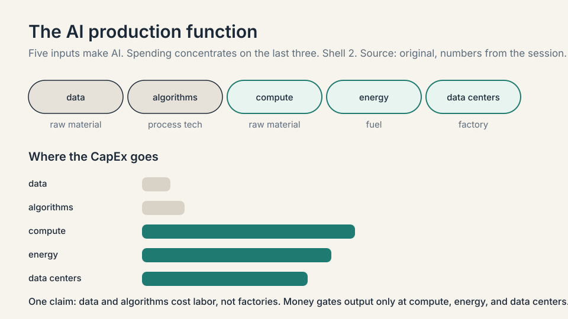

### Subchapter: data and algorithms, the unspent inputs

Data and algorithms are real costs, but they do not absorb
CapEx at the factory scale. Data labeling is a services
business with thin margins and no capacity constraint that
gates anything. Algorithms are labor costs inside labs: a few
hundred researchers, salaries in the millions, against a
$60B-per-gigawatt build. The guest's point is about marginal
bottlenecks: doubling the data budget buys no AI factory.
Doubling the energy budget buys a gigawatt of output. Money
flows to the inputs that gate output, and those are the last
three.

### Subchapter: compute, energy, data centers, where the money lands

The last three inputs share one property: each is bought by
the megawatt. A **megawatt** is one million watts of power
draw, and it prices everything: the substation, the cooling
plant, the rack count. Think of it as the "per seat" of the
data center business. The session prices it exactly: about
$20M per MW for the factory (the building plus the power
plant) and about $40M per MW for the machines inside. The
production function is a menu. The megawatt is the unit
price. This chapter's longest section opens each of those
dollars.

## The growth equation

The guest reaches for a classic economics model to explain
the bet. It is called the **Cobb-Douglas** model of
production, and it decomposes the growth of an economy into
three additive parts. Douglas and Cobb published it in 1928.
A century later it still frames how economists split growth
into its causes.

The guest's intuitive version:

```ascii
GDP growth = change in labor + change in capital + change in technology

labor       more workers, or more productive hours
capital     buildings, plants, equipment, invested money
technology  ideas that make labor more productive
```

The textbook's formal version, for the record, is
multiplicative: output = A x K^a x L^b, where A is
technology, K is capital, L is labor, and the exponents are
each input's share of output. In growth rates that becomes:
GDP growth = tech growth + a x (capital growth) + b x (labor
growth). The guest uses the simple additive form. The
formal form agrees with his point: labor's contribution is
its share of output, about 0.6 in the US, times how fast the
workforce grows.

A **supercycle** is a long wave of investment driven by a
general-purpose technology: the PC, the internet, mobile,
and now AI. The course site names AI "the biggest technology
supercycle since the PC, Internet, and Mobile." The
Cobb-Douglas frame says a supercycle earns its name when it
moves one of the three terms hard.

Technology gets most of the press. The guest's argument is
about labor. Historically, the labor term could only change
through the birth rate: a 20-year lead time, because a new
worker must be born, raised, schooled, fed, and housed
before producing anything. Labor was the slow term. Capital
could move fast. Labor could not.

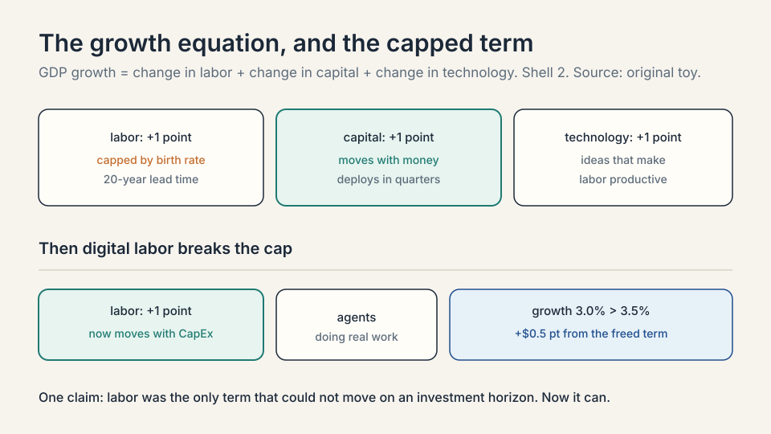

### Subchapter: the toy version, with numbers

Run the toy. Suppose an economy grows 3 percent a year,
split evenly: 1 point from labor, 1 from capital, 1 from
technology. The labor point is capped by demography. No
investment decision made this quarter changes how many
20-year-olds exist. The term is, for all practical purposes,
fixed on any horizon a company plans against.

Now suppose an investment could buy 0.5 points of labor
growth the way capital buys 1 point. Total growth moves
from 3 percent to 3.5 percent, and the buyer captures the
surplus. Compounded over a decade:

```
at 3.0%:  1.03^10  = 1.34
at 3.5%:  1.035^10 = 1.41
ratio:    1.41 / 1.34 = 1.05
```

That half point is the difference between $1.34 and $1.41
on every dollar of GDP: a 5 percent larger economy. The
$650 billion is a bid on that half point.

### Subchapter: why labor was the slow term

Birth rate is not a dial. Raising a worker costs two decades
of food, schooling, and housing before the first productive
hour. The guest jokes that he has three kids: he knows the
incubation period personally. Immigration moves labor across
borders but does not create it. Training changes quality,
not headcount. Every lever on the labor term has a lead
time measured in years or decades. Capital, by contrast,
deploys in quarters: a loan becomes a factory. The guest's
insight is that the asymmetry, not the technology itself,
is the opportunity.

**The key question:** what if the labor term could be moved
by an investment decision, the way capital always could?

## Digital labor: the term that became investable

AI breaks the cap. When you hand a task to a coding agent
("build a CRM for my new product") and it does the work,
that is labor being produced. Not a tool assisting a worker.
Labor itself, created by buying data centers and GPUs. The
guest's phrase is **digital labor**: the first labor force
in history whose size changes through an investment
decision instead of a birth rate.

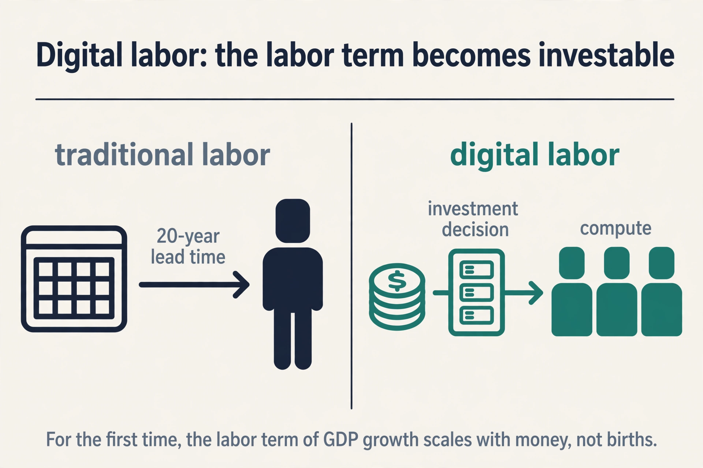

### Subchapter: the mechanism, step by step

Step one: a task exists that a human would do for wages.
Step two: an agent does it, consuming tokens. Step three:
tokens cost power, chips, and buildings, all bought with
capital. The wage becomes a CapEx line. The labor term
moves when money moves, on a quarterly horizon, like
capital always did. That is the whole mechanism. Nothing in
it requires the agent to be as good as the human. It
requires the agent to be cheap enough per task.

### Subchapter: what it replaces and what it does not

Digital labor substitutes for routine cognitive work:
drafting, summarizing, triaging, coding boilerplate. It
does not substitute for physical presence, trust
relationships, or judgment under ambiguity. The guest's
thesis does not require replacing all labor. It requires
replacing enough that the labor term of GDP growth moves.
Even a fraction is a first in history.

That is the thesis behind the chart. The $650 billion is
not a bet that chatbots are fun. It is a bet that the labor
term of the growth equation can now be scaled the way
capital always could, and that whoever builds the factories
for digital labor captures the return.

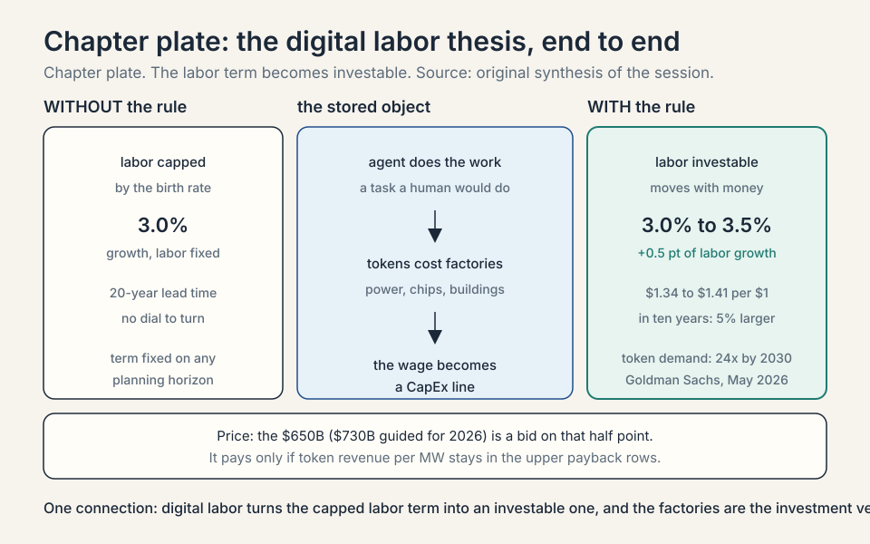
## Why energy comes first

Here the chapter turns from the thesis to the strategy it
implies. If digital labor is the prize, the bottleneck is
whatever gates the factories. The guest's founding insight,
from just under a decade of building, was that the scarce
resource was **energy**, not chips.

### Subchapter: why the hubs filled first

The reasoning is market logic. Data center capacity had
grown steadily through the web 2.0 era, clustering in
established hubs. Northern Virginia, which the guest names,
runs a large share of the internet. Building "the next data
center in Northern Virginia" was a crowded trade: land
costs more, permitting queues are long, and power prices
reflect competition. Meanwhile the new workloads, AI
training with backpropagation and proof-of-work crypto,
shared one trait: at scale, they are limited by energy.
The guest's premise is that markets are reasonably
efficient everywhere else. Energy was the one input where
the market had mispriced location.

### Subchapter: the inversion

So Crusoe inverted the usual plan. Instead of moving energy
to the computers, move the computers to the energy. Find
places with abundant cheap power that are not historical
data center markets, and build there. Moving data over
fiber is cheap. Moving electrons over transmission lines is
expensive and slow to permit. The inversion follows the
cheap move.

### Subchapter: Abilene, the worked example

The worked example is Abilene, Texas, and it deserves the
arithmetic. West Texas is consistently windy and sunny.
Renewable developers built heavily there because
**production tax credits** paid them per clean electron
produced, independent of the sale price. The guest's
explanation: developers get paid by the government to
produce clean electrons, and they must sell them to someone
independent of the price. The result was overbuild: more
generation than the grid could carry out, and no marginal
buyer. Power prices went negative. There was not enough
transmission to move the power somewhere useful. Crusoe's
answer: "Have we got a power-hungry application for you?"

Crusoe signed its first two buildings there in June 2024,
and the site is now described as one of the largest AI
computing campuses in the world, possibly the largest.

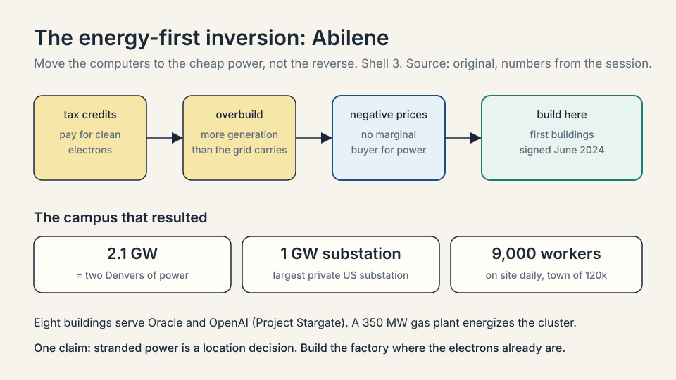

The campus numbers set the scale for the whole course. A
**substation** is the facility where high-voltage grid
power is received and stepped down for local use. Abilene
has a 200 MW substation and a 1 GW substation, the latter
described as the largest privately owned substation in the
United States. One gigawatt is roughly the power draw of
the city of Denver, the guest's home town. The full campus
is 2.1 gigawatts in aggregate: two Denvers of power, all
feeding computers. Eight buildings serve Oracle and OpenAI,
the project known as Project Stargate, plus a 350 MW
natural gas plant built to energize the cluster.

Three details make the example richer than the headline
numbers. First, the campus runs as **one coherent
cluster**: all chips across all data centers connect on the
same high-performance back-end network, so one training
job can run across every data center at once. That is an
unusual architecture. Second, the human scale: a 5,000-car
parking lot, completely full, with roughly 9,000 people on
site every day building the campus, against a town of
120,000. Crusoe had to create labor and retention
incentives to attract workers to move there for
short-term construction. Third, the long tail: the steady
operating staff is around 2,000 people running the clusters
and the power plant, a large permanent job creator in that
local economy. An expansion is planned to the south of the
campus, for Microsoft.

### Subchapter: Abilene since the session

The session's numbers are spring 2026. October 2026 adds
both confirmation and a caution.

| What changed | Detail |
|---|---|
| Scale capped at 1.2 GW | In March 2026 OpenAI and Oracle stopped expanding the site beyond 1.2 gigawatts, citing power grid delays of over a year. Construction continues on the eight buildings; only the growth beyond 1.2 GW halted. |
| 450,000 GB200s | At Oracle AI World in October 2026, Larry Ellison said the site will house more than 450,000 Nvidia GB200 GPUs at 1.2 GW, "enough power for one million four-bedroom homes." |
| First buildings live | The first two buildings went operational in September 2025. The remaining six are expected by mid-2026. |
| The money | Crusoe and Blue Owl raised about $15B in debt and equity for the project. JPMorgan provided about $9.6B of the debt. Oracle signed a 15-year lease. |
| The Microsoft expansion | A March 2026 report says Nvidia paid a $150M deposit to Crusoe to secure the space beyond the OpenAI/Oracle scope, with Meta discussed as a possible tenant. [uncertain: reported by press, not confirmed by the companies] |

The lesson: even the flagship site hits the same wall the
guest names. Power availability, not chips, set the
ceiling. The energy-first strategy won the site. The grid
still set its size.

### Subchapter: Quan, Texas, the second worked example

Abilene was not a one-off. The guest showed a second site
to prove the playbook repeats. Quan, Texas: 3,500 people
working on the project in a town of 1,500. It sits close
enough to Amarillo to draw on that city's working
population, and on some of the best wind in the United
States. An on-site wind farm feeds power directly into the
data center.

The model here has a name: **across the meter**. The
**meter** is the interconnection point with the grid.
Behind the meter is power generated on site. Across the
meter means: build on-site generation (wind, planned solar,
batteries, gas), use what the campus needs, sell the
surplus into the grid, and draw from the grid when the
campus needs firming (wind calm, sun down, maintenance).
The surplus sales create energy abundance that drops costs
for local ratepayers. The guest calls it mutually
beneficial: Crusoe invests in power infrastructure, and
the town gets cheaper, more abundant power. The customer
is unnamed: "a very big customer."

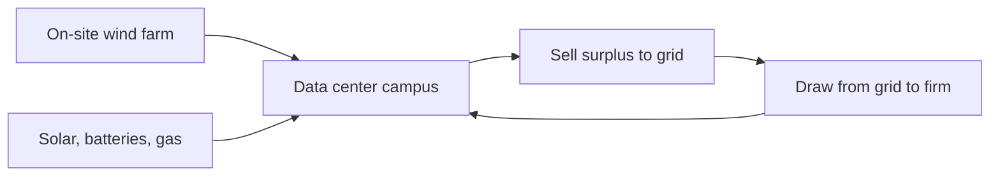

One claim: the campus is a power plant that happens to
compute. Generation and load sit on the same site, and
the grid is the battery.

### Subchapter: what is used where, October 2026

The energy-first playbook is now the industry's default
strategy. The pattern repeats the Abilene logic at
national scale: secure generation, transmission, and
permits before the GPUs arrive, because power is the
longest lead-time input.

- **Nvidia, SB Energy, OpenAI in Ohio.** The PORTS-Pike
  campus in Pike County, Ohio targets 8 GW of IT load with
  at least 10 GW of new power generation. Nvidia invested
  $1.5B in SB Energy and agreed to up to $105B in credit
  support. OpenAI signed a 20-year lease. The first 800 MW
  is expected in 2028. At the session's $60M per MW, 8 GW
  implies roughly $480B of implied build cost, financed
  through the lease structure, not paid upfront by one
  party.
- **Microsoft.** The guest reported Microsoft adding about
  a gigawatt of capacity in a single quarter in spring
  2026.
- **Crusoe.** In September 2026 Crusoe raised a $3.9B
  Series F, co-led by Mubadala Capital, with over 1 GW
  delivered and operational. Crusoe says OpenAI trained its
  Astra model at the Abilene campus.
- **The neoclouds.** A **neocloud** is a cloud provider
  built almost entirely around GPU infrastructure, selling
  compute rather than general IT. Nvidia's neocloud partner
  network is projected at about 8 GW of installed capacity
  by end of 2026.

| Neocloud | Scale, October 2026 |
|---|---|
| CoreWeave (Nasdaq: CRWV) | 1.5 GW active power, 3.7-4.2 GW contracted, ~$104B revenue backlog. Q2 2026 revenue $2.575B, up 112%. Full-year 2026 guidance: $12.4-13.2B revenue on $35-39B capex. |
| Nebius (Nasdaq: NBIS) | Q2 2026 group revenue $582.3M, up 454%. $8.0B cash. 5 GW contracted power target by year-end 2026. |
| Lambda (private) | $1.5B+ Series E (Nov 2025), $1B credit facility (May 2026). Multibillion-dollar multi-year Microsoft agreement covering tens of thousands of Nvidia GPUs. |
| Crusoe Cloud | Customers include Cognition, Figure, and Perplexity. Abstracts the chip: the user buys a service, not an A100 or H100. |

The row that matters for this chapter: every one of them
sells power-shaped compute. The factory is the product.

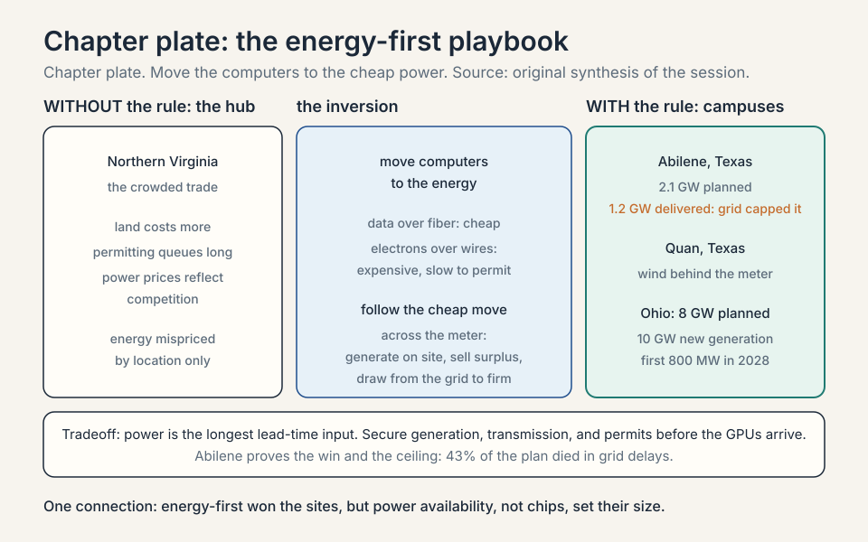

## The moving bottleneck

A common misunderstanding is that the binding constraint
in AI is fixed. The guest insists it moves, and the
history of the last four years proves it. A **binding
constraint** is the one input that gates output right now:
more of everything else changes nothing until it is
fixed.

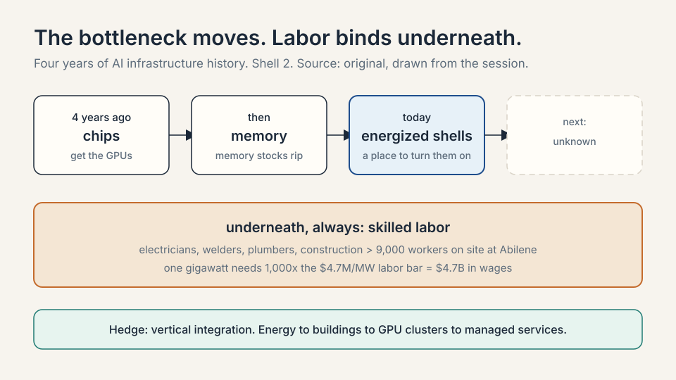

### Subchapter: chips, four years ago

The first bottleneck was compute itself: getting the
chips. Training runs competed for scarce GPUs, and
allocation was the strategy. Whoever held the most H100s
held the lead. That phase is over. Access to chips has
softened as the binding constraint.

### Subchapter: memory, then

Memory stocks ripped next. High-bandwidth memory and the
memory subsystem of the chip package gated how many
training clusters could ship. The constraint moved one
layer inside the machine. Memory makers' stock prices told
the story before any analyst note did.

### Subchapter: energized shells, today

The binding constraint today is finding places where you
can put the chips and turn them on: powered shells with
the electrical and cooling plant ready. A **power shell**
is an energized data center: the building, the
substation, the cooling, everything needed so that you
can plug in chips and start computing. Chips themselves
have become easier to get. The scarce thing is a place to
turn them on. Sometimes the binding layer is even more
specific: individual components like switchgear, chillers,
or power generation equipment.

### Subchapter: labor, always

Underneath every phase, labor. The guest calls the
shortage of tradespeople a bottleneck in its own right,
with 9,000 people on site at Abilene every day against a
town of 120,000. Electricians, welders, plumbers,
construction workers: the factories need hands as much
as they need electrons. The session prices this
bottleneck exactly: $4.7M per MW of capitalized labor.
Multiply by 1,000 MW and one gigawatt carries $4.7B in
wages during construction. For Abilene's 2.1 GW, that is
roughly $9.9B of labor CapEx. There is huge competition
for these workers across many simultaneous projects.
Crusoe's answer is to reinvent how the infrastructure gets
built, which is the subject of the next section's final
subchapter.

### Subchapter: vertical integration as the hedge

This is why Crusoe is **vertically integrated**, meaning
it owns multiple layers of the stack instead of one. The
company works from energy development at the bottom,
through the data center buildings, up to GPU cluster
deployment and managed services at the top. When the
bottleneck moves, a single-layer company is stuck. A
vertically integrated one retools. The guest is explicit
about the boundary: not in the chip business, not in the
model business. Everything between energy and tokens.

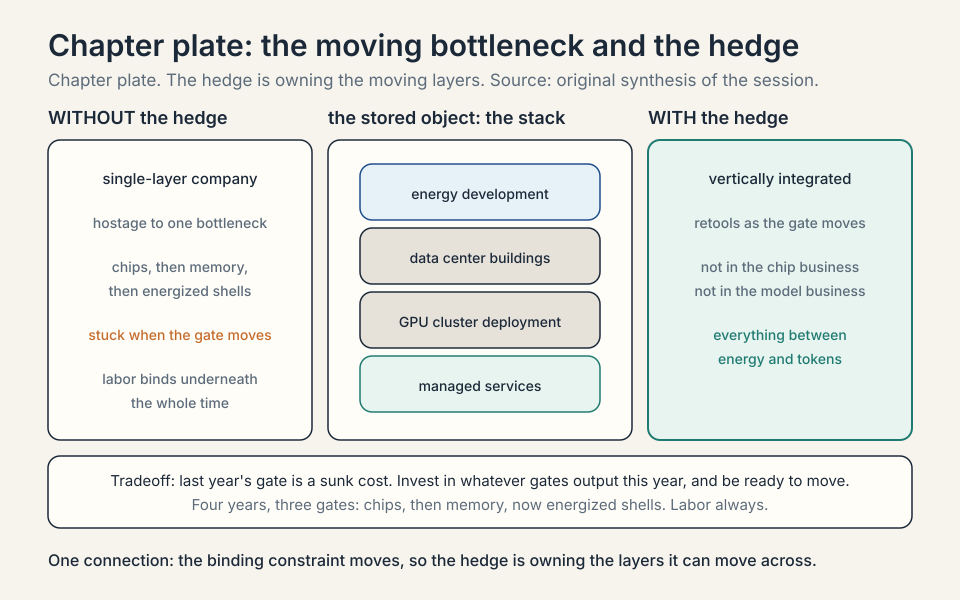
## Inside the factory: anatomy of a megawatt

The host asked the question this whole chapter has been
building toward: walk through the spend of $100. Where
does it go, layer by layer? The guest answered by walking
the campus, system by system. This section is that walk,
with the session's numbers attached. Every number below is
per megawatt, the unit price of the business.

### Subchapter: the power path

Start at the substation. Power arrives at high voltage and
must be stepped down in stages before a chip can use it.
The campus uses small buildings with white roofs called
**power distribution centers**. They take power from the
substation at medium voltage, 34.5 kV (34,500 volts), and
distribute it to rows of **transformers**. A transformer
steps voltage down: here from 34.5 kV to 480 or 415 volts,
the level the data hall equipment takes. Between the
substation and the rack sit power transformers, medium
voltage **switchgear** (the industrial breakers that route
and protect circuits), and low voltage switchgear. The
guest's image: think of the electrical panel in your home,
where you flip breakers when the lights go out, built at
the scale of a city, all inside one giant electrical
room.

Two more boxes ride the power path. The **UPS**, the
uninterruptible power supply, is a battery system that
smooths the power flowing from the substation to the
chip. And **diesel generators** back up the core network
and storage: not everything gets five-nines reliability.
**Five nines** means 99.999% uptime, about five minutes
of downtime a year. The guest's rule: not every system
needs it, but storage and networking do, so that in a
full grid outage the team can still reach a checkpoint
and move a workload. Backup is sized to what must
survive, not to everything.

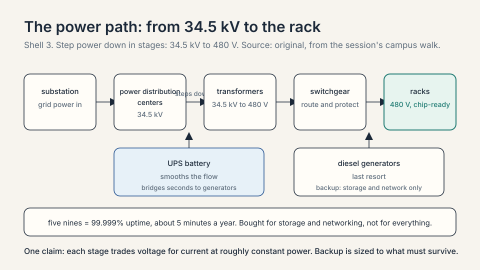

### Subchapter: the cooling path

Chips turn almost all their power into heat. Removing
that heat is the second great system. The campus uses
rows of **air-cooled chillers**: wound copper coils that
look, the guest jokes, like RAM sticks. A chilled water
loop runs through the data center. Cold water enters the
rack of GPUs. A thermal transfer event moves heat from
the energized chip into the water. Hot water returns to
the chillers, where fans blow air over the copper coils
and exhaust the heat. Cold water goes back to the racks.
The loop recirculates.

**Cooling distribution units (CDUs)** sit inside the data
center and do the last step: they take water from the
chilled water pipe and distribute it to the individual
racks of GPUs. Around them: remote power panels, hot
aisle containment systems, and fan walls, the air
handling that keeps the data hall's hot and cold air
separated. All of this, plus the plumbing, is the
mechanical half of the factory.

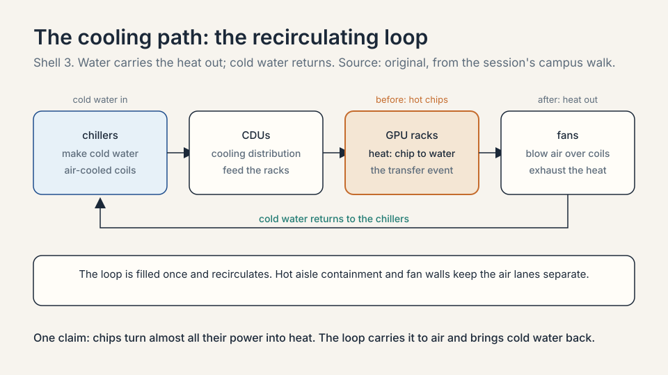

### Subchapter: water, the myth and the measurement

The running public narrative is that AI data centers
drain local water. The session's numbers say something
precise and different.

| Claim | Number |
|---|---|
| Water in one building's cooling loop | about 1 million gallons |
| How often the loop is filled | once; it recirculates |
| Annual consumption | about the same as one single-family home |

The guest: "We use like zero water. We fill this system
one time." In water-scarce West Texas that design choice
is not cosmetic. It is what makes the site permittable.
The trap is confusing the loop's volume with its
consumption. The volume is large. The consumption is a
household.

### Subchapter: steel, concrete, and hands

Nothing was at the Abilene site before. The buildings
need steel, cement, and every trade that assembles them.
Crusoe runs its own **batch plant** on site: concrete
mixed on location, crews pouring 24 hours a day. Armies
of plumbers and pipe fitters weld the big plumbing
systems together. Site work, labor, man-hours: the
guest's list is deliberately physical. This is the $4.7M
per MW line from the bottleneck section, made concrete.

### Subchapter: the $20M per MW building stack

Now the dollars. The guest normalized the full power
plant plus building cost per megawatt. The total is
roughly $20B per gigawatt, or $20M per MW.

| Layer | Session number | What it is |
|---|---|---|
| Labor | $4.7M per MW | capitalized construction wages; $4.7B per GW, not OpEx |
| Gas plant | $2-3M per MW | on-site generation; turbine prices rose from $1M to $3M per MW |
| Tenant fit-out | ~$3M per MW | remote power panels, hot aisle containment, fan walls, CDUs |
| Electrical equipment | part of the $20M | transformers, distribution centers, medium and low voltage switchgear |
| Mechanical equipment | part of the $20M | chillers, plumbing, air handling units, fan walls |
| Materials | part of the $20M | steel, cement, everything structural |
| Soft costs | part of the $20M | insurance, construction-loan financing and debt service, siting, commissioning |

Three notes on the table. First, the guest built it that
afternoon and calls the numbers approximate: read them as
orders of magnitude, not invoices. Second, the direction
is up, not down. Gas generation infrastructure, labor,
electrical equipment: every category is inflating under
demand. A gas turbine that cost $1M per MW now costs $3M.
The makers are a small set: GE Vernova, Siemens,
Mitsubishi Heavy Industries, Pratt and Whitney, and
Caterpillar's Solar. They have not expanded production
capacity much, so prices rose. The guest's market read:
it has been good to be a GE Vernova shareholder. Third,
the host's follow-up: assuming a gigawatt comes online in
a year, the labor line alone is $4.5-5B in wages per year.
That is CapEx, capitalized into the asset, not operating
expense.

### Subchapter: the $40M per MW machine stack

The host asked the obvious question: where are the GPUs?
They are the next layer. The **IT CapEx** is the compute
infrastructure inside the building: roughly $40M per MW,
forward-looking, next-generation hardware.

| Layer | Session number | What it is |
|---|---|---|
| GPUs | ~$30M per MW | the accelerators; "this is why Jensen is always smiling" |
| Networking | ~$4M per MW | NVLink domains inside the rack, InfiniBand or RoCE between racks |
| CPUs and storage | ~$3M per MW | orchestration and data; CPUs are in shortage |
| In-the-room fit-out | ~$3M per MW | the tenant fit-out items from the building table, counted at the rack |
| Deployment labor, shipping | ~$1M per MW | getting it all installed |

The arithmetic sums to about $41M. The guest admits he
may be double-counting the fit-out line. Read $40M as
his rounded number. The networking line deserves one
paragraph. The latest Nvidia racks (GB200/GB300 class)
are full-rack designs: 72 GPUs on one **NVLink** domain,
Nvidia's high-bandwidth GPU-to-GPU interconnect, with a
copper backplane tying them together. Racks then connect
through a second back-end network, typically
**InfiniBand** or **RoCE** (RDMA over Converged
Ethernet), so thousands of GPUs share data at
training speed. That is where the $4M goes.

The CPU line carries a surprise. There is a massive
shortage of CPUs, and the cause is agentic workflows.
With the boom in agents, with the boom in Claude, every
agent loop needs CPUs to orchestrate the compute
workload. The inference economy pulls CPUs the way the
training economy pulled GPUs.

### Subchapter: Crusoe Spark, the modular answer

The labor bottleneck has an engineering answer. Crusoe
designed **Crusoe Spark**: modular, self-contained AI
data centers manufactured in centralized US locations,
then deployed in fleets. Each air-cooled unit is 500 kW.
A liquid-cooled version is 2 MW. Fleets of units open up
sites that could never justify a gigawatt campus.

| | Stick-built campus | Crusoe Spark |
|---|---|---|
| Where it is built | on site, 9,000 workers | in a factory, then shipped |
| Field construction time | years | weeks |
| Cost | baseline | 30-50% savings, per the guest |
| Sizing | gigawatt scale or nothing | incremental: add units as demand grows |

The guest's claim: the $19M-per-MW-class build cost
comes down dramatically. The strategic effect matters
more than the number. Modular units unlock net new power
opportunities: smaller stranded-power sites become
buildable. Manufacturing centralizes the labor the field
cannot supply.

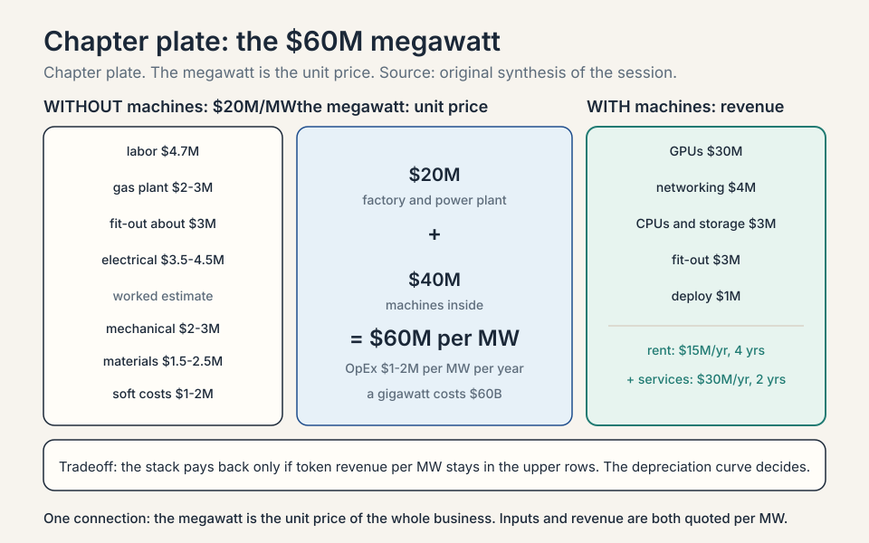
## The payback question: does $60M per megawatt earn?

$20M for the factory plus $40M for the machines is $60M
per MW. A gigawatt cluster costs $60B. The host's
question is the only one that matters: how does anybody
make money? The guest answers with three numbers and one
chart.

### Subchapter: the revenue math

**OpEx** means operating expenditure: the money to run
the asset each year. For the campus it is small: roughly
$1-2M per MW per year. Power, insurance, on-site labor
repairing and replacing failed cables and GPUs. The
engineering workforce and corporate overhead sit outside
this number, so read it as the plant-level figure.

Revenue, if you only rent the chips: roughly $15M per MW
per year, annualized, at then-current H100 rental
pricing. The arithmetic:

```
capex:    $60M per MW
revenue:  $15M per MW per year
opex:     $1-2M per MW per year
payback:  60 / 15 = about 4 years
```

The guest stresses this is a revenue-basis payback,
stripping out OpEx. Roughly four years. The number that
makes it work or breaks it is the depreciation curve:
how long each bar of the stack stays valuable. That is
the question Wall Street analysts ask, and the next
chapter takes it apart.

### Subchapter: the H100 price rebound

The guest showed a Bloomberg chart of H100 spot pricing.
**Spot pricing** is the current market rental price.
The conventional wisdom said each new chip generation
would make the old one worthless. The chart says the
opposite. H100s debuted about three years before the
session. Their price fell at first, then the agent boom
drove demand back up, and the price exceeded the launch
price. A SemiAnalysis chart for Blackwells shows the same
shape after the late-year agent breakthrough. Old compute
regained value because demand outran supply again.

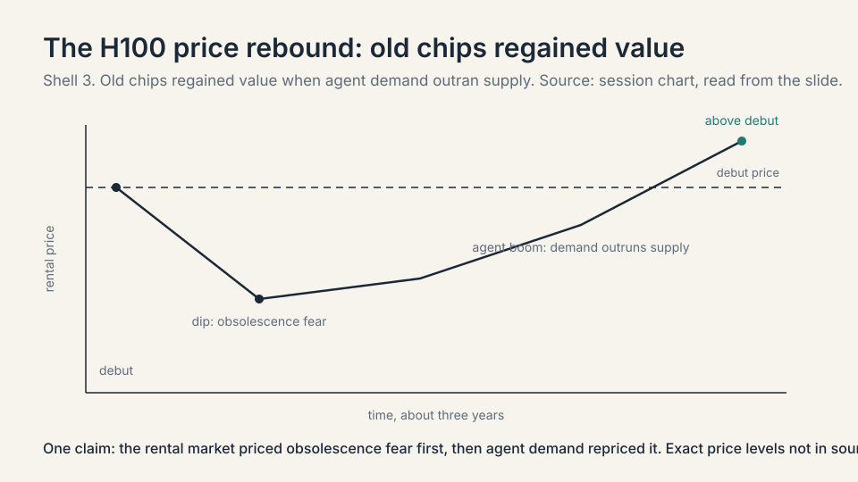

The implication is about **depreciation**: spreading an
asset's cost over its useful life. Public companies
commonly depreciate computers over five to six years.
The guest's honest answer: Crusoe will use compute as
long as it is valuable to someone. Crusoe Cloud
abstracts the chip away: the customer does not know or
care whether the job ran on an A100, an H100, or an
MI300. His analogy: logging into Zoom, you do not ask
which Intel or AMD chip runs the call. You buy the
service. If services abstract the hardware, useful life
may run longer than the books assume. If the
obsolescence critics are right, shorter. The next chapter
prices both.

### Subchapter: the services uplift

Renting chips is the low-margin way to monetize a
factory. The guest's vertical integration adds a layer:
**managed services**. Deploy the chips, host the model,
serve an API endpoint, and let the customer hit it for
tokens. The margin uplift is $5-15M per MW per year. In
the optimistic case the stack becomes $30M per MW per
year, and the payback halves.

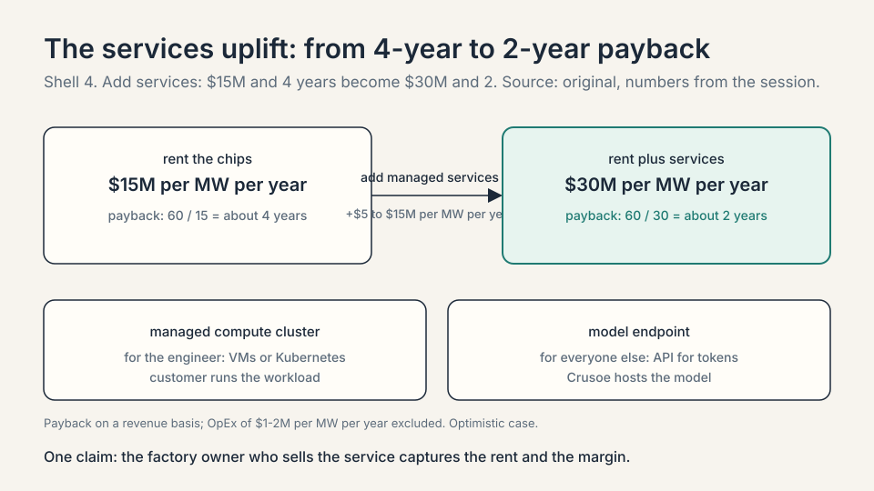

This is the answer to the host's other question: how
much of the $650B goes to Crusoe? Crusoe sits between
the hyperscalers' CapEx and the token revenue. The
factory owner who can also sell the service captures
both the rent and the margin. The pure landlord gets
only the rent.

### Subchapter: compute, commodity or not?

The host raised the live debate: Jensen Huang had just
argued about it publicly, and the question is whether
compute is becoming a commodity. The guest's answer is
three-way.

| Kind of compute | Verdict | Why |
|---|---|---|
| Older generations | commoditizes | falls further back as the frontier moves |
| The newest generation | commands a premium | the cutting edge always does; the history of the IT industry |
| Scale itself | not a commodity | operating at gigawatt scale is hard to replicate |

Capitalism compresses margins over time; the guest
expects Nvidia's ~80% gross margin to drift toward a
~60% stabilized silicon margin as competition bites.
**Gross margin** is revenue minus the cost of goods,
divided by revenue. But the newest hardware keeps a
premium, and scale keeps a moat. Both sides of the
debate can be right on different horizons.

### Subchapter: what breaks the thesis, modeled

The honest price needs numbers, not adjectives. Hold the
session's stack fixed and vary the revenue.

| Revenue per MW per year | Payback on $60M | Verdict |
|---|---|---|
| $30M (rent + services, optimistic) | 2 years | thesis sings |
| $15M (chip rental only) | 4 years | the session's base case |
| $10M (token prices fall a third) | 6 years | depreciation race gets tight |
| $7.5M (token prices halve) | 8 years | needs longer asset life than the books allow |

Two variables move the rows. Utilization: a megawatt
that sits idle earns nothing, and the $60M is already
spent. Asset life: if hardware is economically dead in
three years, only the top two rows survive. The entire
CapEx chart is a bet that token revenue per megawatt
stays in the upper rows for a decade. The bear cases
below attack exactly that.

## The bear cases and the long game

Every investment thesis has a falsifier, and this one is
sharp. The entire $650 billion rests on tokens staying
valuable: on digital labor actually substituting for human
labor at a price that covers the factories. If the demand
for tokens stalls, the chart is a monument to overbuild.

### Subchapter: the three-year obsolescence critique

A 2026 Fortune piece, summarizing Research Affiliates
research, argues hyperscaler AI hardware becomes
economically obsolete in about three years, not the five
to six years companies use on their books. The mechanism:
each new chip generation delivers sharply better
compute per watt, and data centers face hard power
ceilings. Inside a fixed power envelope, old chips must
be swapped for new ones to hold capacity. On this view,
roughly two thirds of the CapEx is maintenance,
replacing dead hardware, not growth. The thesis survives
only if token revenue per megawatt stays ahead of the
replacement treadmill. That is the race the next chapter
prices.

| View | Useful life | What the $730B is |
|---|---|---|
| Company books | 5-6 years | mostly growth assets |
| Research Affiliates | ~3 years | two thirds maintenance |
| The guest | as long as it earns | services abstract the chip |

### Subchapter: the electrical stack disruption

The host asked for one long and one short. The guest's
short is the legacy electrical stack: Eaton, Schneider,
and the companies that have not innovated much in a
century. The stack that steps power from 345 kV, soon
765 kV on new Texas lines, down to the rack is built
from old technology. The guest expects data centers to
force innovation: solid-state transformers, power
electronics, a shift toward 900 V DC distribution in
the rack. Near term those incumbents do well; they are
his partners and the demand is real. Long term, if they
do not innovate, the cost of that whole layer falls and
their position with it. He names it as the biggest
opportunity in the room for electrical engineers: how
do you get power from 765 kV to 900 V DC in the rack?

### Subchapter: open source takes share

The guest's other bearish call is on closed models.
Open source will do well and take share from closed
source model players. The mechanism is pricing power:
if open weights keep improving, the revenue side of the
token trade compresses, and the payback rows in the
table above slide down. The factory owner is hedged
either way; the model owner is not.

### Subchapter: data centers in space

The host asked about Elon Musk's space data centers.
The guest is genuinely interested, and Crusoe has a
partnership with Starcloud, which flew the first H100s
to space. October 2026 status: Starcloud-1 launched in
November 2025 with an H100 and ran the first LLM in
orbit. Starcloud-2 launched in October 2026 with more
H100s, Blackwell GPUs, and a Crusoe Cloud module.
Crusoe plans limited orbital GPU capacity from early
2027. Starcloud has proposed a constellation of up to
88,000 satellites to the FCC and talks about a 5 GW
orbital data center. Google's Project Suncatcher and
others are in the race.

| Vanishes in space | Stays in space |
|---|---|
| Concrete foundations | Thermal management: vacuum sheds heat only by radiation |
| Permitting and grid approvals | Operations: no astronaut reseats a failed GPU |
| Millions of fiber strands: optics replace copper | Launch cost: needs Starship-class cost cuts, two orders of magnitude |
| Power procurement: the sun is the generator | Radiation, debris, regulation (Morgan Stanley's risk list) |

The guest's timeline: not material in five years,
probably not in ten, but a major role over the longer
run. Space removes the two scarcest inputs on Earth,
land-adjacent power and permission, and keeps the two
hardest problems, heat and hands.

### Subchapter: the student advice

The host's last question: advice for Stanford students
deciding what to study. The guest's answer is a
philosophy, not a curriculum.

| Crusoe value | The rule |
|---|---|
| Think like a mountaineer | plan A, plan B, and plan C to plan B (the guest has climbed five of the seven summits, including Everest) |
| Live on the infinite growth loop | nobody is a finished product; daily compounding of skill is the most valuable asset |

School content matters less than the process of
learning, he argues. In five years everyone will have,
in his phrase, the workforce of a million people at
their fingertips. The edge goes to whoever learns
fastest and wields the tools best. Focus on the how,
not the what.

## Mapping back: why the money is rational

Each piece of this chapter answers the opening question.

| Opening puzzle | This chapter's answer |
|---|---|
| Why $650B of CapEx? | Digital labor: the labor term of GDP growth is now investable. The spending buys workers, not just tools. |
| What does AI need? | Five inputs: data, algorithms, compute, energy, data centers. The money concentrates on the last three. |
| Why start from energy? | At scale, energy is the scarce input. Stranded cheap power (Abilene) beats a crowded hub (Northern Virginia). |
| What does $100 of spend buy? | About $20M per MW for the factory and power plant, about $40M per MW for the machines inside. Labor is the largest single factory line at $4.7M per MW. |
| How does $60M per MW earn? | $15M per MW per year renting chips: 4-year payback. Managed services can add $5-15M and halve it. |
| What gates growth? | A moving bottleneck: chips, then memory, now energized shells, always skilled labor. Vertical integration is the hedge. |
| What could break it? | Token demand stalling; three-year hardware obsolescence; open source compressing model pricing. |
| What changed by Oct 2026? | The spend kept rising: ~$730B combined hyperscaler CapEx. Abilene capped at 1.2 GW by the grid. Power is the lead-time input for every site. |

> [!QA]
> Q: What is the AI production function, in plain words?
> A: Five inputs make AI: data, algorithms, compute, energy, and data centers. Data is the raw material, algorithms are the process technology, GPUs are the machinery, electricity is the fuel, and data centers are the factory buildings. The guest's key claim is that the money concentrates on the last three. Data labeling created a real market (Scale AI and others), and algorithms live in the labs, but the CapEx chart is compute, energy, and buildings. Each of the last three is bought by the megawatt.
> Follow-up: Why would an investor care about this decomposition?
> A: Because it tells you where the spending must flow. If AI output scales with compute and energy, then every unit of AI demand converts mechanically into demand for GPUs, power plants, and data centers. The investor question becomes unit economics per megawatt, which is the next section.

> [!QA]
> Q: Explain the Cobb-Douglas argument for the AI supercycle.
> A: Cobb-Douglas decomposes GDP growth into three parts: change in labor, change in capital, and change in technology. Historically the labor term moved only through the birth rate, with a 20-year lead time, so it was the slow term. Digital labor breaks that: an agent doing real work is labor produced by an investment decision. For the first time, the labor term can scale the way capital always could, which is the economic case for building AI factories at gigawatt scale.
> Follow-up: What would falsify this thesis?
> A: Token demand stalling. If digital labor does not substitute for human labor at prices that cover the factories, the CapEx is overbuild. The guest's own bear cases point the same way: open source eroding closed-model pricing power would compress the revenue side of the trade.

> [!QA]
> Q: Walk me through the 3 percent toy economy.
> A: Split 3 percent annual growth into 1 point from labor, 1 from capital, and 1 from technology. The labor point is fixed by demography on any planning horizon. Now imagine investment could buy half a point of labor growth, the way capital buys its point. Total growth rises from 3 percent to 3.5 percent. Compounded over ten years, $1 grows to $1.34 at 3 percent and $1.41 at 3.5 percent: a 5 percent larger economy. The hyperscaler CapEx is a bid on that half point, not on chatbots.
> Follow-up: Why does the toy assume the split is even?
> A: It does not need to be. The toy only needs one fact: the labor term is the one that could not move on an investment horizon. Whatever its share, making it investable is a first in economic history, which is the guest's whole argument.

> [!QA]
> Q: Walk me through the power path and the cooling path of one megawatt.
> A: Power arrives at the substation at high voltage. Power distribution centers take it at 34.5 kV and feed rows of transformers that step it down to 480 or 415 volts. A UPS battery system smooths the flow, switchgear routes and protects it, and diesel generators back up only the core storage and networking. Cooling is a recirculating loop: air-cooled chillers push cold water to cooling distribution units, the CDUs feed the GPU racks, heat transfers from chip to water, and fans exhaust it over copper coils. Each building holds about a million gallons of water but consumes about one household's worth per year.
> Follow-up: Why back up only the core systems instead of everything?
> A: Five-nines backup for the whole campus would multiply the generator and battery spend. The guest sizes backup to what must survive a grid outage: storage and networking, so the team can reach a checkpoint and move the workload. Everything else can go dark and restart.

> [!QA]
> Q: Decompose the $60M per megawatt. Where does each dollar go?
> A: About $20M builds the factory and the power plant: $4.7M in capitalized labor, $2-3M for the gas plant, about $3M of tenant fit-out, plus electrical equipment, mechanical equipment, materials, and soft costs like insurance and construction-loan financing. About $40M fills it with machines: $30M for GPUs, $4M for networking (NVLink inside the rack, InfiniBand or RoCE between racks), $3M for CPUs and storage, about $3M of in-the-room fit-out, and $1M for deployment and shipping. Annual OpEx is only $1-2M per MW.
> Follow-up: Which of these lines is inflating fastest?
> A: Gas generation and labor. A gas turbine that cost $1M per MW now costs $3M because a small set of makers (GE Vernova, Siemens, Mitsubishi Heavy Industries, Pratt and Whitney, Caterpillar Solar) has not expanded capacity. Electricians' rates rise with the competition for their time across simultaneous builds.

> [!QA]
> Q: How does a $60M megawatt pay back? Show the math.
> A: Renting chips earns about $15M per MW per year against $1-2M of OpEx, so $60M divided by $15M is about a 4-year payback on a revenue basis. Adding a managed services layer, hosting the model and serving API endpoints, adds $5-15M per MW per year. In the optimistic case revenue reaches $30M and payback halves to 2 years. The swing variable is the depreciation curve: the payback only works if the hardware stays valuable long enough, which is the next chapter's fight.
> Follow-up: Model the downside. What if token prices halve?
> A: Revenue falls to about $7.5M per MW per year and payback stretches to 8 years. At that point the thesis needs asset lives well beyond the 5-6 year book standard, and the three-year obsolescence critique becomes lethal. That is why the guest watches token demand, not chip supply.

> [!QA]
> Q: Why did Crusoe start from energy instead of compute?
> A: At scale, energy was the scarce input, and markets are reasonably efficient everywhere else. The web 2.0 era had already filled the established hubs like Northern Virginia. The new workloads (AI training, proof-of-work) are energy-hungry at scale, so the winning move was to find cheap stranded power and bring the computers to it. Abilene is the worked example: renewable overbuild from production tax credits pushed power prices negative, and Crusoe built one of the world's largest AI campuses there, now 2.1 gigawatts in aggregate.
> Follow-up: What is the risk of the energy-first strategy?
> A: Stranded power is stranded for a reason: no transmission, no local demand. If the grid buildout catches up or the tax regime changes, the cost advantage narrows. The Abilene answer was to build its own 1 GW substation and a 350 MW gas plant, which converts the risk into more CapEx. And in March 2026 the grid still capped the site's growth at 1.2 GW.

> [!QA]
> Q: Steelman the bear case against the whole supercycle.
> A: Three independent falsifiers. First, demand: digital labor must substitute for human labor at prices that cover the factories; if token demand stalls, the CapEx is overbuild. Second, asset life: if Research Affiliates is right that AI hardware is economically dead in three years, two thirds of the spend is maintenance and the payback math breaks. Third, pricing power: open source models keep improving and compress what anyone can charge per token. The bull case needs all three to fail: durable token demand, long hardware life, and pricing power at the services layer.
> Follow-up: Which falsifier would you watch first?
> A: Token revenue per megawatt, quarterly. It is the single number that decides whether the top rows of the payback table hold. Utilization and pricing both flow into it, and it moves before any accounting debate about depreciation.

## Recap: the whole lesson on one screen

1. **The chart.** Hyperscaler AI CapEx goes up and to the
   right, fast. Roughly $650 billion in the session's
   framing. About $730 billion in reported 2026 guidance by
   October, up 78% from 2025. Bigger than the space
   program, the highways, the Manhattan Project.
2. **The recipe.** AI needs data, algorithms, compute,
   energy, and data centers. The money concentrates on the
   last three, bought by the megawatt.
3. **The growth equation.** Cobb-Douglas: GDP growth is
   change in labor plus change in capital plus change in
   technology.
4. **The slow term.** Labor historically moved only via
   the birth rate: a 20-year lead time. Fixed on any
   planning horizon.
5. **The toy.** 3 percent growth split three ways. Buying
   half a point of labor growth means a 5 percent larger
   economy in ten years. The CapEx is a bid on that half
   point.
6. **Digital labor.** Agents doing real work are labor
   produced by investment. The labor term is now scalable
   like capital. That is the $650B thesis.
7. **Energy first.** At scale, energy is the scarce input.
   Move the computers to the cheap power, not the reverse.
8. **Abilene.** Tax credits caused renewable overbuild,
   prices went negative. Now a 2.1 GW campus: two Denvers
   of power, 9,000 workers on site, a 1 GW substation. The
   grid capped growth at 1.2 GW in March 2026.
9. **Quan.** The playbook repeats: 3,500 workers in a
   town of 1,500, on-site wind, the across-the-meter
   model.
10. **The moving bottleneck.** Chips, then memory, now
    energized shells, always skilled labor. Vertical
    integration is the hedge. Not chips, not models.
11. **The $60M megawatt.** $20M for the factory and power
    plant, $40M for the machines. Labor is the largest
    factory line at $4.7M per MW. OpEx is only $1-2M.
12. **The payback.** $15M per MW per year renting chips:
    4 years. Managed services can add $5-15M: 2 years.
    The depreciation curve decides. Next: the dollar
    anatomy.

## Go deeper

<div style="position:relative;padding-bottom:56.25%;height:0;overflow:hidden;max-width:100%;margin:16px 0;">
<iframe style="position:absolute;top:0;left:0;width:100%;height:100%;" src="https://www.youtube-nocookie.com/embed/GcCGzfKdCd0" title="Building AI Factories (MS&E 435, Chase Lochmiller)" frameborder="0" allow="accelerometer; autoplay; clipboard-write; encrypted-media; gyroscope; picture-in-picture" allowfullscreen></iframe>
</div>

- [Building AI Factories (MS&E 435)](https://www.youtube.com/watch?v=GcCGzfKdCd0)
- The session this lesson follows, in full.
- [This Isn't a DataCenter. It's an AI Factory. (Acquired, IA Summit 2025)](https://www.youtube.com/shorts/8rKGDsiQt8Q)
- Chase Lochmiller on Crusoe's path from flaring methane to the 1.2 GW Abilene AI factory. Matches the energy-first and Abilene sections.

<div style="position:relative;padding-bottom:56.25%;height:0;overflow:hidden;max-width:100%;margin:16px 0;">
<iframe style="position:absolute;top:0;left:0;width:100%;height:100%;" src="https://www.youtube-nocookie.com/embed/8rKGDsiQt8Q" title="This Isn't a DataCenter. It's an AI Factory. (Acquired, IA Summit 2025)" frameborder="0" allow="accelerometer; autoplay; clipboard-write; encrypted-media; gyroscope; picture-in-picture" allowfullscreen></iframe>
</div>

- [MS&E 435 course site](https://mse435.stanford.edu/)
- [Hyperscaler AI capex tracker, 2026](https://valueaddvc.com/blog/big-tech-ai-capex-in-2025-microsoft-google-meta-amazon-and-the-spending-race)
- [US data-center investment overview, 2026](https://www.theglobalstatistics.com/new-data-center-investments-in-us/)
- [Abilene to deploy 450,000 GB200 GPUs (Data Center Dynamics, Oct 2026)](https://www.datacenterdynamics.com/en/news/openai-and-oracle-to-deploy-450000-gb200-gpus-at-stargate-abilene-data-center/)
- [Abilene capped at 1.2 GW (March 2026)](https://winbuzzer.com/2026/03/09/openai-oracle-cap-texas-ai-data-center-abilene-stargate-xcxwbn/)
- [Crusoe's independent AI supply chain (Energy Digital, Sept 2026)](https://energydigital.com/news/electrons-to-tokens-crusoes-independent-ai-supply-chain)
- [Crusoe and Starcloud: AI data centers in space (Data Center Dynamics, Oct 2025)](https://www.datacenterdynamics.com/en/news/crusoe-to-deploy-in-starcloud-satellite-data-center-in-late-2026-offer-limited-gpu-capacity-in-space-from-2027/)
- [The three-year obsolescence argument (Fortune / Research Affiliates, April 2026)](https://github.com/jrob5756/news/blob/HEAD/reports/2026/04/16.md)

## Official sources and further reading

**Official:**
- Building AI Factories (MS&E 435, Spring 2026), guest
  Chase Lochmiller, Crusoe: [link](https://www.youtube.com/watch?v=GcCGzfKdCd0)
- [MS&E 435 course site](https://mse435.stanford.edu/)

**Further reading:**
- The course site's framing line: AI is "the biggest
  technology supercycle since the PC, Internet, and
  Mobile."
- Crusoe's own newsroom documents the company's path
  from modular flare-gas compute (2018) to the sale of
  its bitcoin mining operation to NYDIG (March 2025,
  about 425 sites and 270 MW of generation) and the
  pivot to AI campuses and cloud.

**Caveats from these sources.** The $650B figure is the
host's framing of hyperscaler spend, not an audited total.
The October 2026 capex numbers are analyst and press
estimates from company guidance, not audited totals, and
ranges differ across sources. The transcript spells the
guest's name "Lockmiller" in places. The course site
spells it "Lochmiller," used here. One data-labeling
company is transcribed as "Merkur" [uncertain: likely
Mercor]. The Cobb-Douglas treatment is the guest's
intuitive version (growth as a sum of three changes), not
the formal multiplicative production function; the formal
version is added here as textbook background. Abilene
"largest campus" and the 2.1 GW aggregate are the guest's
spring-2026 claims, stated with hedging; press reports
cap the OpenAI/Oracle portion at 1.2 GW as of March 2026.
The cost-stack tables are the guest's that-afternoon
approximations, and he admits a possible double count in
the IT stack. Crusoe's Astra training claim is the
company's own statement.

## Connections to the other courses

- **CS229S:** the systems course prices the same stack
  from the inside: what the GPUs cost to run, why
  inference is memory-bound, and what FlashAttention saves.
  Read it for the engineering behind the dollars here.
- **CS336:** builds the transformer and the training
  stack that all this infrastructure exists to serve.
- **CS329A / CS329Z:** the agents course covers the
  digital labor itself: what agents can do and where
  they break.
- **MS&E435 L02:** opens the $60M megawatt and checks
  whether the unit economics pay back.
