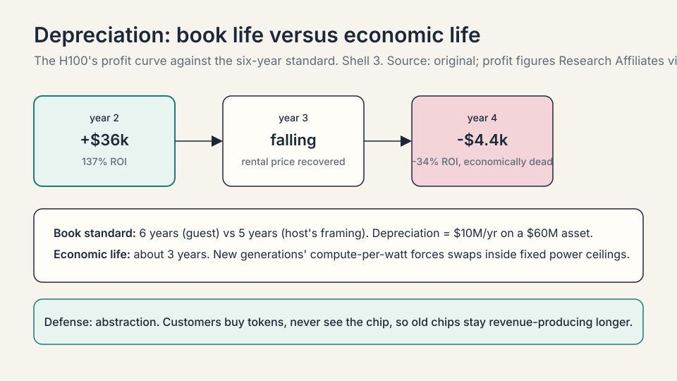
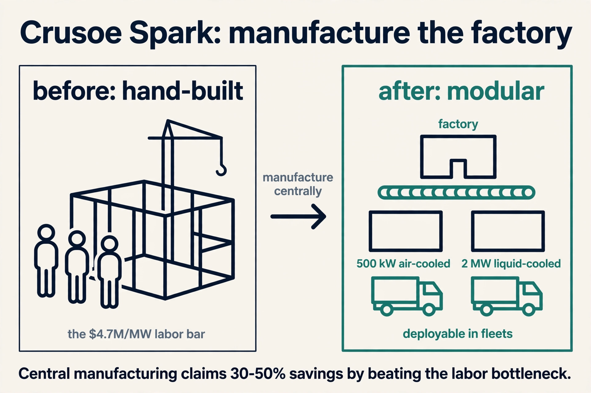

## The question from L01

L01 ended with the thesis: $650 billion of CapEx is a bet
on digital labor. This chapter asks the accountant's
version of the same question. If you had $100 of spend,
where does it go? The guest answers with the full cost
stack, normalized per megawatt, and every number below is
his, from the session.

A **megawatt** (MW) is a million watts of power draw. It
is the natural unit for pricing AI factories because
everything in the building, from the substation to the
cooling, scales with power. Think of it as the "per seat"
of the data center business.

## The factory: $20M per megawatt

The first $20M of the $60M buys the factory itself: the
power plant and the building, before a single GPU arrives.
The guest breaks it out on a per-megawatt basis, and the
bottom bar of his chart is the one he lingers on.


### Subchapter: labor, $4.7M per MW

This is capitalized construction labor, not operating
payroll. For a 1 GW campus the arithmetic is 4.7 million
times 1,000, which is $4.7 billion in wages to the people
pouring concrete and pulling cable. The guest is blunt
that this is a bottleneck: not enough electricians,
welders, plumbers, or construction workers, with many
gigawatt projects competing for the same trades. It is
the single largest bar inside the factory cost, and it
is the one that cannot be ordered from a catalog.

### Subchapter: the gas plant, $2-3M per MW

Crusoe built a roughly 350 MW natural gas plant at Abilene
to energize the cluster. At $3M per MW, that plant alone
is about $1.05 billion of the factory cost. The striking
detail is inflation: a gas turbine that used to cost $1M
per MW now costs $3M per MW, a threefold increase. Only
a handful of manufacturers build them (GE Vernova,
Siemens, Mitsubishi Heavy Industries, Pratt and Whitney,
Caterpillar's Solar), and they did not expand capacity as
everyone rushed to add generation. The guest notes it has
been good to be a GE Vernova shareholder. When the scarce
input is the turbine, the turbine maker prices like a
monopolist.

### Subchapter: electrical, mechanical, materials

**Soft costs.** Insurance, financing (servicing the
construction loan), siting, commissioning.

**Tenant fit-out.** Everything inside the data hall that
is not the computers: remote power panels, hot-aisle
containment, fan walls, cooling distribution units. The
guest flags he may be double-counting this bar, and
rounds the total anyway.

**Electrical equipment.** The full chain from high voltage
to the rack: transformers, power distribution centers,
medium- and low-voltage switchgear. Power arrives at the
Abilene substation and steps down from 34.5 kV (34,500
volts) to 480 or 415 volts at the rack. The guest's image:
your home breaker panel, at the scale of a city.

**Mechanical equipment.** Chillers, plumbing, air
handlers. Each building holds about 1 million gallons of
water in a closed recirculating loop. A common worry is
that AI drains local water. the guest's number is that
annual consumption is about the same as a single-family
home, because the loop is filled once. That matters in
West Texas, where water is scarce.

**Materials.** Steel, concrete, site work. Crusoe runs
its own concrete batch plant on site, pouring 24/7.

The bottom line of the bottom half: roughly **$20M per
MW**, or **$20 billion per gigawatt**, for the power
plant plus the building.

## The machines: $40M per megawatt

The next $40M buys the IT: the computers that go inside.
The split, which the guest calls forward-looking, is the
most concentrated cost picture in the course.

```ascii
$40M per MW: the machines inside the factory

GPUs              $30M   (three quarters of the IT spend)
networking        $4M    (NVLink, InfiniBand)
CPUs + storage    $3M
in-room fit-out   $3M
labor/shipping    $1M
```

### Subchapter: GPUs, $30M

Three quarters of the IT CapEx goes to one vendor's
chips. The newest racks hold 72 GPUs on one NVLink
domain, a single high-speed fabric so the chips share
data as one machine. Concentration is the point: half of
the entire $60M per MW, $30M of $60M, is GPUs from one
supply chain.

What is used where, October 2026: the frontier cluster
stack is Nvidia Blackwell and GB200/GB300 systems. The
guest's 80 percent gross margin figure for Nvidia is the
measure of that concentration: $24M of every $30M GPU
bar is margin above cost. The escape valve is custom
silicon: Google's TPUs, Amazon's Trainium, Meta's MTIA,
Microsoft's Maia. The guest's own warning: a lab may one
day spend a couple hundred billion on its own chips, 80
percent as effective per chip but far more numerous.

### Subchapter: networking, $4M

The racks must then be joined into one coherent cluster,
typically over InfiniBand or RDMA over Ethernet, so a
single training job can span every chip in every building.
At Abilene this means all chips across all data centers
operate as one workload. Networking is only 10 percent
of the IT spend, but it is what makes the $30M of GPUs
behave as one machine. A cluster that cannot synchronize
is $30M of isolated chips.

### Subchapter: CPUs and storage, $3M

The surprise here is a CPU shortage. Agentic workloads
need large numbers of CPUs to orchestrate the GPU work,
so CPU demand is surging alongside GPU demand. Agents
do not just consume GPU tokens. They run code, call
tools, manage state, and each of those steps spends
CPU. The $3M bar is the footprint of the agent era
inside the machine budget.

The guest flags that he may be double-counting the
fit-out bar, and rounds the total to **$40M per MW**.
Added to the factory, the full build is roughly **$60M
per MW**, which is **$60 billion for a 1 GW cluster**.

## The payback: does it earn?

Now the accountant's real question. You have spent $60M
per MW. What comes back? The guest gives three numbers:
the operating cost, the rental revenue, and the upgrade.


### Subchapter: the $15M rent line

**OpEx: $1-2M per MW per year.** Power, insurance, and
the on-site labor that repairs and replaces failed cables
and GPUs. The guest stresses this is limited. the big
money is all upfront.

**Revenue: about $15M per MW per year**, renting out
bare chips. Divide the $60M build by $15M a year and you
get a **four-year payback**, on a revenue basis and
before the engineering workforce and other costs the
$1-2M omits. The guest presents it as rough, assembled
that afternoon, but directionally the number the street
argues about.

### Subchapter: the $30M token line

**The upgrade: managed services.** Renting chips is the
commodity product. The guest's title for the deck is
"from electrons to tokens," and the margin lives in the
tokens. Add a managed layer that hosts models and serves
an API endpoint, and revenue rises by $5-15M per MW per
year, to roughly **$30M per MW** in the optimistic case.
The payback halves: **about two years**.

### Subchapter: the missing costs

The guest's own caveat: the $1-2M OpEx omits the
engineering workforce and other costs. By October 2026
the financing question got louder. The five hyperscalers'
projected 2026 capex of roughly $800B exceeds their
combined operating cash flow of about $707B: capex is
113 percent of cash flow. The buildout is no longer
self-funded. Brookings estimated the resulting
infrastructure would need about $3.7 trillion of annual
revenue by 2032 to produce a 10 percent unlevered
return. The payback math in this chapter is per factory.
The industry math adds debt.

The **key question** of the chapter: what decides between
the four-year and the two-year outcome? Two things.
First, depreciation: how long each bar of the $60M stays
valuable. Second, whether the product is raw compute or
finished intelligence.

## Depreciation: how long does a GPU stay valuable?

**Depreciation** is how accountants spread a purchase
over its useful life. A $60M asset that lasts 6 years
costs $10M a year on the books. if it lasts 3, it costs
$20M. For AI factories, the depreciation schedule is
the whole debate on Wall Street.



### Subchapter: the six-year standard

The host asks whether GPUs depreciate over the standard
5 years that public companies use for computers. The
guest answers that six is the standard, then reframes
the question: Crusoe will use compute "so long as it is
valuable to us or to someone else."

### Subchapter: the H100 evidence

The evidence he offers is a pricing chart for the H100.
It debuted about three years ago, the price fell as
expected, and then, with the agent demand boom, the
rental price rose back above its launch price. Blackwell
pricing, via SemiAnalysis, shows a similar pattern. Old
chips stayed valuable because demand grew faster than
the new supply.

### Subchapter: abstraction as the defense

The mechanism is **abstraction**. Crusoe builds services
so the customer never knows whether the work ran on an
A100, an H100, or an MI300. The guest's analogy: you do
not check which Intel or AMD chip runs your Zoom call.
You care about the service. As applications abstract the
hardware, older chips stay revenue-producing longer, and
the depreciation curve stretches.

### Subchapter: the three-year critique, with numbers

The counterweight arrived after the session. Research
Affiliates, summarized by Fortune in April 2026, priced
the H100's economic life directly: in year 2 the chip
generated about $36,000 of annual profit (137 percent
ROI). by year 4 it was losing about $4,400 a year
(negative 34 percent ROI). The driver is not wear. Each
new chip generation delivers sharply better
compute-per-watt, and data centers face hard power
ceilings: to hold capacity inside a fixed megawatt
envelope, you must swap old chips for efficient new
ones. The study's conclusion: roughly two thirds of
hyperscaler AI capex is maintenance, replacing obsolete
hardware, and the economic life of AI hardware is about
three years, not the five to six on the books.

Nobody knows which schedule is right. The guest says so
directly, and the honest reader holds both numbers.

## The commodity question

The host presses the debate the industry was having that
week: is compute a commodity? The guest's answer splits
by age and by scale.

### Subchapter: old compute commoditizes

As new generations arrive, last year's chips fall down
the price curve. The September 2026 price war is the
evidence: OpenAI's GPT-6 Sol at $2/$10 per million
tokens, Anthropic's Claude Opus 5.5 at $4/$20, DeepSeek
V4.1 Flash at $0.30/$1.20, xAI's Grok 4.7 at $2/$6.
Ramp's AI Index measured the effective enterprise price
at $0.68 per million tokens by early September 2026,
down 41 percent from March. The commodity logic is
winning at the token layer.

### Subchapter: the cutting edge and scale do not

Two things resist commoditization. First, **the cutting
edge**: the newest hardware always commands a premium,
which is the history of the IT industry. Second,
**scale**: operating at very large scale is hard to
replicate, and the guest calls it "absolutely not a
commodity."

On margins, he is specific. Nvidia commands roughly
**80% gross margins** today. His expectation: competition
does its work over time, and margins settle toward
standard silicon levels, call it **60%**. "Capitalism is
a powerful force."

## Two more factories: Quan and Spark

The session gives two more data points that sharpen the
unit economics.

### Subchapter: Quan, Texas

A town of 1,500 people with 3,500 workers on site,
drawing labor from nearby Amarillo. The site pairs the
data center with an on-site wind farm in one of the
windiest parts of the United States, in an arrangement
the guest calls **across the meter**: behind the meter
is on-site power, and across the meter means the campus
generates its own power, sells the surplus into the grid
(lowering local ratepayers' bills), and draws from the
grid when the wind drops. The customer is undisclosed
but described as very large.

### Subchapter: Crusoe Spark

A modular, self-contained AI data center, manufactured
centrally to cut the labor bottleneck: 500 kW
air-cooled units and 2 MW liquid-cooled units,
deployable in fleets. Claimed savings: **30 to 50
percent** on the infrastructure cost. This is the
answer to the $4.7M/MW labor bar: stop building every
factory by hand.



## Space data centers: the long bet

The final topic is the one the host clearly enjoys:
data centers in space. The guest is genuinely engaged
(Crusoe has a partnership with Star Cloud, which he says
has launched the first H100s into space
[uncertain: the guest's claim]) and runs the trade
honestly.

The attractions are the costs the $20M/MW stack would
skip: no concrete foundations, no permitting, no power
approvals, and optical interconnect instead of millions
of strands of fiber. The problems are thermal management
and operations. In a terrestrial data center, GPUs fail
and technicians reseat or return them. In space there is
no astronaut to pull a chip and send it back, so the
cluster suffers natural depreciation with no repair
path. Everything rides on launch cost: unless payload
costs fall by two orders of magnitude, the math does
not close.

His verdict: not material in 5 years, probably not in
10, but a major part of intelligent infrastructure over
the long run.

## October 2026: the capex race, by the numbers

Reported and analyst-estimated 2026 plans, the backdrop
for every number in this chapter:

| Company | 2026 CapEx plan | Notes |
|---|---|---|
| Amazon | ~$200-220B | AWS at $42B+ quarterly revenue. largest AI cluster buyer |
| Alphabet | ~$195-205B | Google Cloud crossed $20B/quarter. $460B+ backlog |
| Microsoft | ~$175B | AI business past $37B run rate |
| Meta | ~$115-135B | AI capex nearly doubled year over year |
| Oracle | ~$55.7B (FY2026) | New hyperscaler-scale entrant |

Combined: roughly $730-800B, nearly triple the 2024
total. Goldman Sachs projects about $1.14 trillion in
2027. The private data-center construction pace hit $75B
annualized in July 2026 and passed residential
homebuilding. The $60M/MW math of this chapter is now
being multiplied at civilizational scale, and the
depreciation debate above is the market's argument about
whether the multiplication is sane.

## Mapping back: the dollar, answered

| L01 puzzle | This chapter's answer |
|---|---|
| Where does the $100 go? | $20M/MW factory (labor $4.7M, gas plant $2-3M, electrical, mechanical, materials) plus $40M/MW machines ($30M GPUs, $4M network, $3M CPU/storage). $60B per GW. |
| Does it pay back? | $15M/MW/yr renting chips: ~4 years. $30M/MW/yr with managed tokens: ~2 years. OpEx only $1-2M/MW/yr. |
| What could break it? | Short depreciation (GPUs obsolete fast) or compute commoditization. The defense: H100 prices rose above launch, and abstraction stretches useful life. |
| What moves the cost? | Labor ($4.7M/MW bar, trades shortage), gas turbines ($1M to $3M/MW), and modular build (Spark: 30-50% savings). |

## The honest price: every number is moving

The guest's own warning closes the chapter. Ask whether
the $20M/MW is going up or down, and the answer is up:
gas generation, labor, and electrical equipment are all
inflating under demand. The $60M/MW is a snapshot, not a
law. The payback math only works while token demand
grows faster than the cost stack. That demand is the
subject of the rest of the course: the models (L03-L04)
that create it and the applications (L05-L06) that sell
it.

> [!QA]
> Q: Walk me through the $60M per megawatt.
> A: Two halves. About $20M per MW builds the factory: the power plant and the building, with construction labor alone at $4.7M per MW, the gas plant at $2-3M per MW, plus electrical, mechanical, and materials. About $40M per MW fills it with machines: $30M in GPUs, $4M in networking, $3M in CPUs and storage, and the rest in fit-out and deployment. That is $60 billion for a 1 GW cluster. The concentration to remember: half the total, $30M of $60M, is GPUs.
> Follow-up: Which of these costs is inflating fastest?
> A: The guest names gas turbines (from $1M to $3M per MW as a handful of manufacturers held capacity flat) and skilled labor (the $4.7M/MW bar, with electricians, welders, and plumbers in short supply across many simultaneous gigawatt builds). Electrical equipment is inflating too. His hedge against the labor bar is Crusoe Spark, the modular factory claiming 30-50% savings.

> [!QA]
> Q: How does an AI factory pay back?
> A: Spend $60M per MW upfront. Operating cost is only $1-2M per MW per year. Renting bare chips brings about $15M per MW per year, which is a four-year payback on a revenue basis. Add the managed-services layer that serves model APIs ("from electrons to tokens") and revenue rises toward $30M per MW per year, which is about a two-year payback. The upgrade from renting compute to selling tokens is the whole margin story.
> Follow-up: What is missing from that payback math?
> A: The guest says so himself: the $1-2M OpEx omits the engineering workforce and other costs, and the four-year figure is on a revenue basis, not profit. The deeper variable is depreciation: the payback assumes each bar of the $60M stays valuable for years. If GPUs went obsolete fast, the math would break. His evidence against that is the H100 rental price rising above its launch price three years after debut.

> [!QA]
> Q: Why is the $4.7M labor bar the hardest cost to fix?
> A: Because it is people, not parts. A 1 GW campus needs 1,000 times the $4.7M/MW bar, which is $4.7 billion in construction wages, and the electricians, welders, and plumbers do not exist in the needed numbers. Gas turbines can be ordered from five manufacturers. Labor must be hired town by town: Abilene puts 9,000 workers on site daily in a town of 120,000, and Quan puts 3,500 in a town of 1,500. The industrial answer is Spark: manufacture the factory centrally and ship it.
> Follow-up: Does modularity threaten the vertical-integration thesis from L01?
> A: No, it extends it. Spark is vertical integration one level deeper: the company that owns energy and buildings now owns the factory's manufacturing too. The hedge against a moving bottleneck is to own the layer the bottleneck moves through.

> [!QA]
> Q: Is compute a commodity?
> A: The guest splits it three ways. Old compute commoditizes as new generations arrive. The cutting edge is not a commodity: the newest hardware always commands a premium. And scale is not a commodity: operating at very large scale is hard to replicate. On margins, he expects Nvidia's roughly 80% gross margins to compress toward standard silicon levels, around 60%, because competition is a powerful force. Both sides of the debate can be right on different horizons.
> Follow-up: What would accelerate the commodity outcome?
> A: Abstraction. If customers buy tokens through a managed API and never know which chip ran the work, chips become interchangeable inputs and pricing power moves up the stack to whoever owns the customer relationship. That is exactly the business Crusoe is building toward with its managed-services layer.

> [!QA]
> Q: Walk me through the three-year obsolescence critique.
> A: Research Affiliates, summarized by Fortune in April 2026, priced the H100's economic life directly: about $36,000 of annual profit in year 2 (137 percent ROI), turning to a $4,400 annual loss by year 4 (negative 34 percent ROI). The driver is compute-per-watt: each new generation is so much more efficient that, inside a fixed power ceiling, old chips must be swapped out to hold capacity. Their conclusion: roughly two thirds of hyperscaler capex is maintenance replacement, and true economic life is about three years, not the five to six on the books.
> Follow-up: What does the critique imply for the two-year payback?
> A: That the two-year payback must finish before the three-year obsolescence. At $30M/MW/yr, $60M is recovered in two years with one year of margin left before the hardware's economic life ends. At $15M/MW/yr, the four-year payback runs past the obsolescence line, which means renting bare chips is the bet most exposed to the critique.

> [!QA]
> Q: What would you ask a neocloud CEO to test the unit economics?
> A: First, your realized $/MW/yr: contracted, not list. Second, your time from energized shell to first revenue in months, because every idle month eats the payback. Third, your chip refresh assumption: do you underwrite three years or six, and what does the model do if the new generation slips. The first question separates price takers from price makers. The third separates investors who have read the Research Affiliates paper from those who have not.

> [!QA]
> Q: Why do data centers in space not work yet?
> A: The attractions are real: no concrete, no permitting, no power approvals, and optical interconnect instead of millions of fiber strands. The blockers are thermal management and operations. GPUs fail constantly at scale, and in space nobody can reseat a chip or return it to the vendor, so the cluster depreciates with no repair path. The economics hinge on launch cost falling by two orders of magnitude. The guest's verdict: not material in 5 years, probably not in 10, but a major long-run piece of intelligent infrastructure.
> Follow-up: What does the space discussion reveal about terrestrial costs?
> A: It prices the frictions. Permitting, concrete, power approvals, and fiber installation are such large parts of the $20M/MW factory cost that removing them is the main attraction of orbit. The interest in space is a backhanded measure of how expensive building on Earth has become.

## Recap: the whole lesson on one screen

1. **The unit.** A megawatt is the "per seat" of AI
   factories. Everything scales with power.
2. **The factory: $20M/MW.** Labor $4.7M (the bottleneck
   bar), gas plant $2-3M (turbines tripled to $3M/MW),
   electrical (34.5 kV to 480 V), mechanical (1M-gallon
   water loop, home-scale annual use), materials.
3. **The machines: $40M/MW.** GPUs $30M, networking $4M
   (one coherent cluster), CPUs and storage $3M (CPUs
   now scarce too).
4. **The total: $60M/MW.** $60 billion per gigawatt.
   Half of it is GPUs.
5. **The return.** $15M/MW/yr renting chips: ~4-year
   payback. $30M/MW/yr selling tokens: ~2-year payback.
   OpEx just $1-2M/MW/yr.
6. **Depreciation.** Six years is the standard. H100
   rental prices rose above launch three years in.
   Abstraction stretches useful life. But the 2026
   critique says economic life is three years.
7. **The commodity split.** Old compute commoditizes.
   The cutting edge and scale do not. Nvidia 80% margins
   compress toward 60%.
8. **The frontier.** Quan (across-the-meter wind),
   Spark (modular, 30-50% cheaper), space (real physics,
   10+ years out). Next: what makes the machines worth
   it, the models.

## Go deeper

<div style="position:relative;padding-bottom:56.25%;height:0;overflow:hidden;max-width:100%;margin:16px 0;">
<iframe style="position:absolute;top:0;left:0;width:100%;height:100%;" src="https://www.youtube-nocookie.com/embed/GcCGzfKdCd0" title="Building AI Factories (MS&E 435, Chase Lochmiller)" frameborder="0" allow="accelerometer; autoplay; clipboard-write; encrypted-media; gyroscope; picture-in-picture" allowfullscreen></iframe>
</div>

- [Building AI Factories (MS&E 435, second half)](https://www.youtube.com/watch?v=GcCGzfKdCd0)
- The session this lesson follows, in full.
- [MS&E 435 course site](https://mse435.stanford.edu/)
- [AI infrastructure build-out and the financing question (Brookings / IEEE ComSoc, Sept 2026)](https://techblog.comsoc.org/2026/09/24/the-ai-infrastructure-build-out-a-10-trillion-bet-on-compute-power-and-networks/)
- [Hyperscaler AI capex ranking, 2026](https://infotechlead.com/data-center/ai-data-centre-investment-ranking-2026-amazon-google-microsoft-and-meta-lead-700-billion-infrastructure-race-98172)

## Official sources and further reading

**Official:**
- Building AI Factories (MS&E 435, Spring 2026), guest
  Chase Lochmiller, Crusoe: [link](https://www.youtube.com/watch?v=GcCGzfKdCd0)
- [MS&E 435 course site](https://mse435.stanford.edu/)

**Further reading:**
- SemiAnalysis: the Blackwell pricing analysis the
  guest cites for the post-launch price recovery
  pattern.

**Caveats from these sources.** The guest warns the
numbers were assembled that afternoon: treat them as
directional, and note his own flag of possible
double-counting in the fit-out bar. "Six is the
standard" for depreciation is his answer to the host's
"five years" framing. both are stated, neither is
audited. The Star Cloud H100 launch claim is the
guest's. Abilene "largest campus" is hedged by the
guest himself. The October 2026 capex and obsolescence
figures are analyst and press estimates, not audited
totals.

## Connections to the other courses

- **MS&E435 L01:** the demand thesis (digital labor)
  that this chapter's payback math must justify.
- **CS229S:** the engineering cost curves behind these
  dollars: GPU execution, memory walls, and why
  inference economics look the way they do.
- **MS&E435 L03:** the model layer: why the machines
  keep getting more valuable instead of commoditizing
  away.
- **MS&E435 L06:** where the value accrues in the
  stack, and who captures the token margin.
