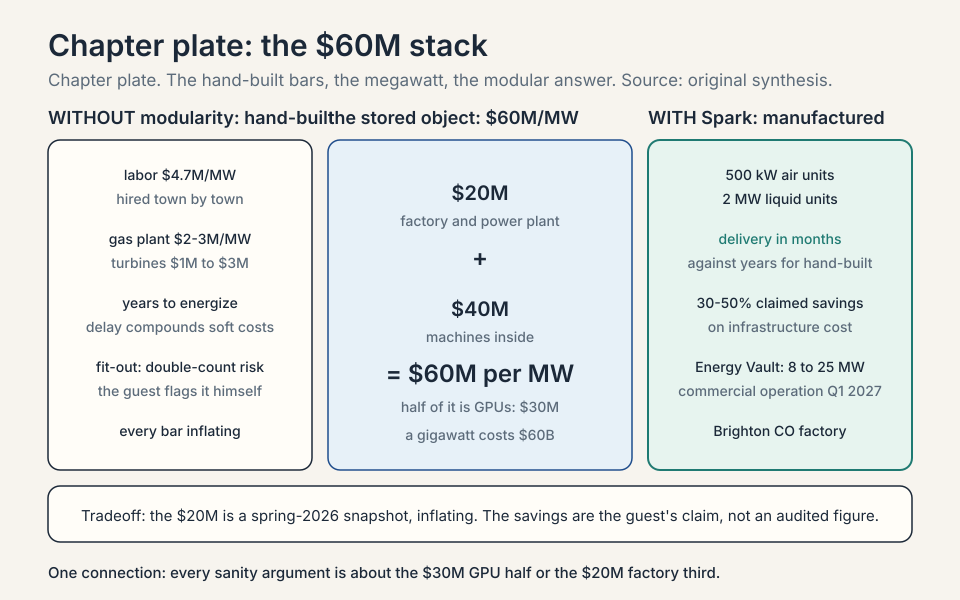
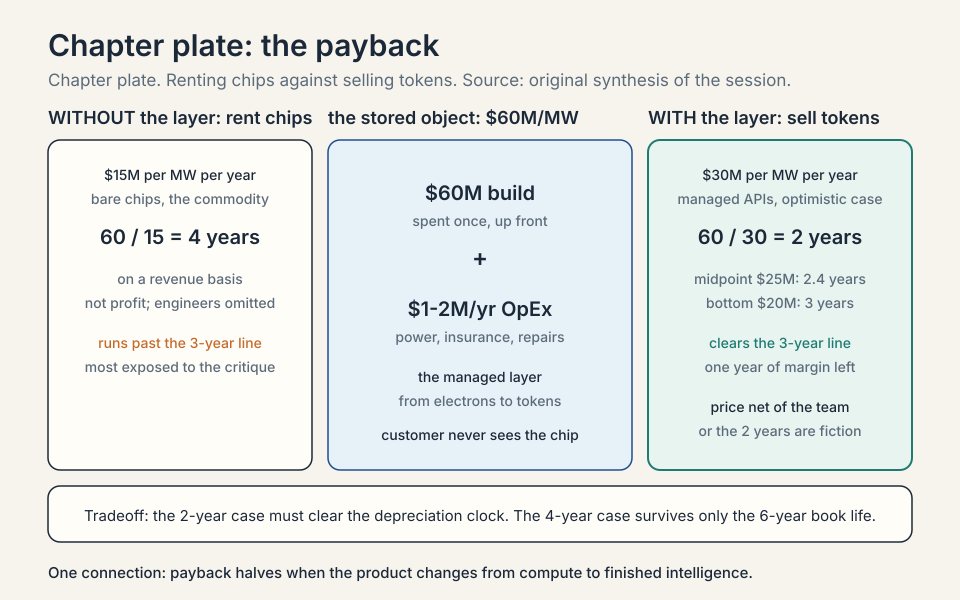
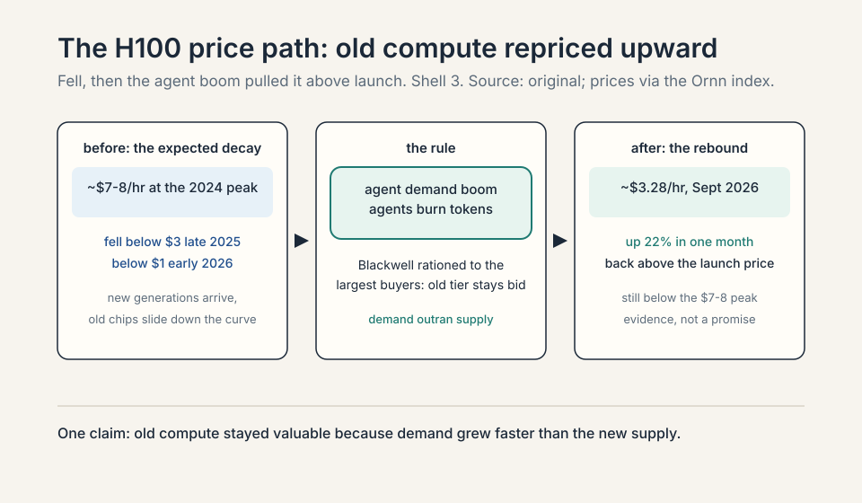
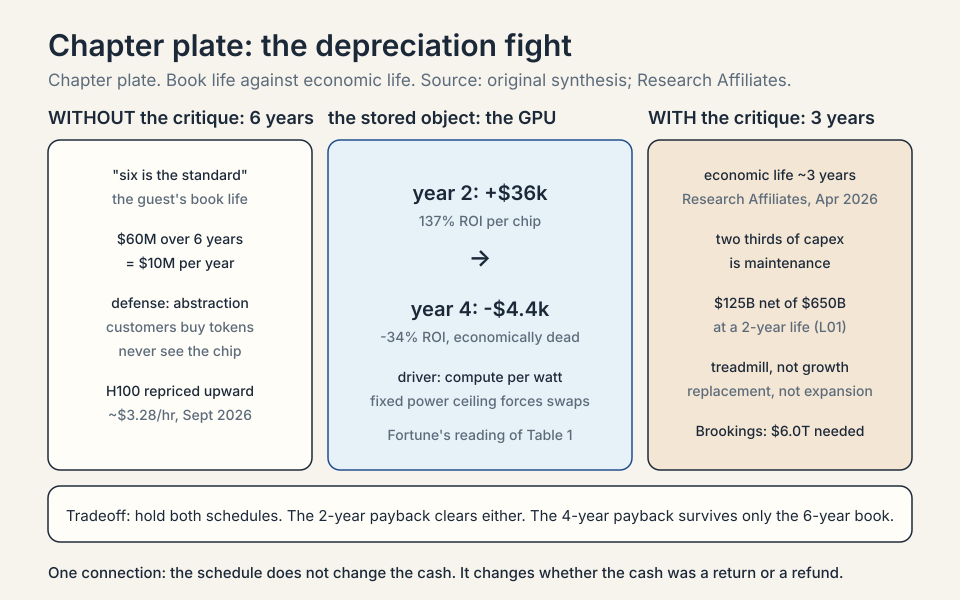
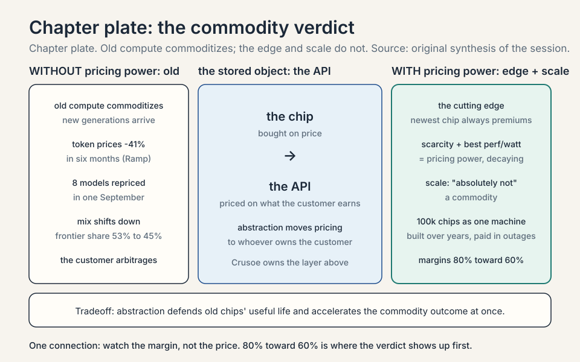
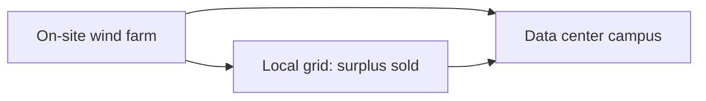
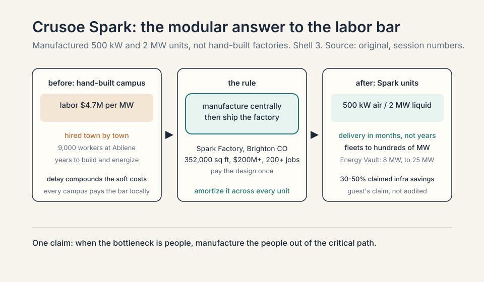
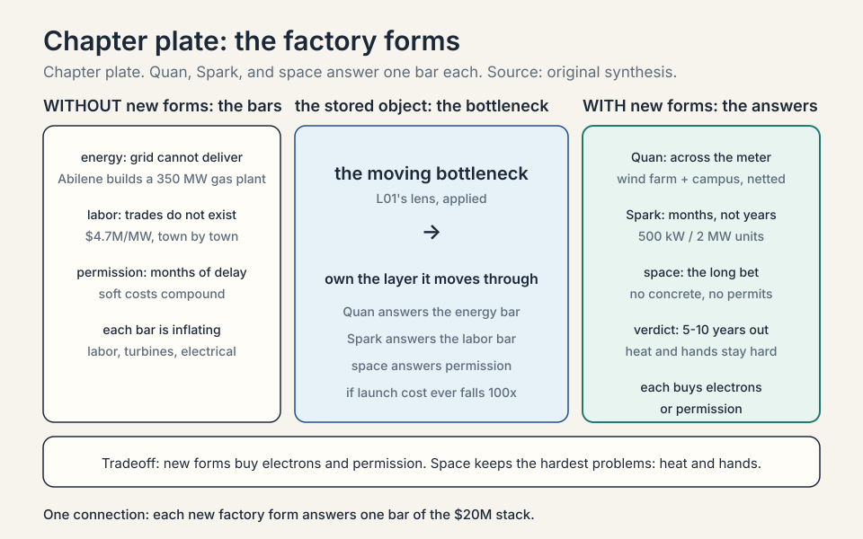

### Coverage and sourcing

This lesson follows the second half of the MS&E 435
(Economics of the AI Supercycle, Spring 2026,
instructor Apoorv Agrawal) session "Building AI
Factories," with guest Chase Lochmiller, co-founder and
CEO of Crusoe. L01 followed the first half: the **CapEx**
chart (CapEx: capital expenditure, money spent to build
long-lived assets), the production function, the energy-first
playbook, and the factory walk. This lesson is the
accountant's half: the full cost stack per **megawatt**
(a million watts of power draw, the "per seat" unit of the
data center business), the payback math, the **depreciation**
fight (depreciation: how accountants spread a purchase over
its useful life), the **commodity** debate (a commodity: a
good bought purely on price, with no meaningful difference
between sellers), and the new factory forms. No
transcript or captions exist for the video, so
segment-level mapping of claims to timestamps is not
possible. The coverage map at the end of the chapter
maps every major session claim to the section that
covers it. Figures and claims marked "October 2026"
are updates added after the session, each with its
source.

## The question from L01

L01 ended with the thesis: about $730 billion of CapEx
is a bet on digital labor. This chapter asks the
accountant's version of the same question. If you had
$100 of spend, where does it go? The guest answers with
the full cost stack, normalized per megawatt, and every
number below is his, from the session, with his own
caveats stated where he stated them.

The **megawatt** (MW) is the natural unit for pricing AI
factories because
everything in the building, from the substation to the
cooling loop, scales with power. Think of it as the
"per seat" of the data center business. A 1 gigawatt
(GW) campus is 1,000 megawatts. The session's unit
price is roughly **$60M per MW**: about $20M for the
factory, about $40M for the machines inside. That is
$60 billion for a 1 GW cluster. Hold those three
numbers. The rest of the chapter opens each of them.

## The factory: $20M per megawatt

The first $20M of the $60M buys the factory itself: the
power plant and the building, before a single GPU
arrives. The guest breaks it out on a per-megawatt
basis, and the bottom bar of his chart is the one he
lingers on. Two honesty notes before the bars. First,
the guest built the chart that afternoon, and he says
so on the record. Treat the numbers as directional, not
audited. Second, he flags that he may be double-counting
the tenant fit-out bar, and rounds the total anyway.


### Subchapter: labor, $4.7M per MW

The largest bar inside the factory cost is people. This
is capitalized construction labor, not operating
payroll: the wages paid to build the thing, booked as
part of the asset. Run the multiplication the guest
implies. A 1 GW campus is 1,000 MW. At $4.7M per MW,
that is $4.7 billion in construction wages for one
campus. Abilene, the session's reference campus, put
roughly 9,000 workers on site daily in a town of
120,000 people. That is the hiring problem made
visible: the trades do not exist in the needed numbers
where the campuses are going.

### Subchapter: why labor is the hardest bar

The guest is blunt: not enough electricians, welders,
plumbers, or general construction workers, with many
gigawatt projects competing for the same trades at the
same time. Here is why this bar resists every
procurement trick. A gas turbine can be ordered from a
catalog. A **transformer** (a device that steps power down
from transmission voltage to usable voltage) ships from a
factory. Labor must
be hired town by town, trained, housed, and retained
through a multi-year build, and every other gigawatt
project in the country is bidding for the same crews.
The electrician's rate rises because the next campus
over will pay more. This bar has no inventory to draw
down and no second source. It is the single largest
line inside the factory cost, and it is the one that
cannot be ordered from a catalog.

### Subchapter: the gas plant, $2-3M per MW

Crusoe built a roughly 350 MW natural gas plant at
Abilene to energize the cluster, because the grid
could not deliver the power on the needed timeline.
At $3M per MW, that one plant is about $1.05 billion
of factory cost: 350 times 3 equals 1,050, in millions.
The striking detail is the inflation. A gas turbine
that used to cost about $1M per MW now costs about
$3M per MW: a threefold increase. The mechanism is
concentration. Only a handful of manufacturers build
large gas turbines (the guest names GE Vernova,
Siemens, Mitsubishi Heavy Industries, Pratt and
Whitney, and Caterpillar's Solar), and they did not
expand capacity as every data center developer rushed
to add generation at once. When the scarce input has
five suppliers and the demand curve goes vertical,
the suppliers price like monopolists. The guest's
aside: it has been good to be a GE Vernova
shareholder.

### Subchapter: electrical equipment

The full chain from high voltage to the rack:
transformers, power distribution centers, and
medium- and low-voltage **switchgear** (the protection
and routing layer: breakers and switches that isolate
faults and direct power where it is needed). A
**transformer** is a device that changes voltage levels:
it steps power down from transmission voltage to usable
voltage, at the cost of some energy lost as heat. Power arrives at the
Abilene substation and steps down from 34.5 kV
(34,500 volts) to 480 or 415 volts at the rack. The
guest's image: your home breaker panel, at the scale
of a city. L01 walked this path in detail. This
chapter prices it as one of the lines inside the
$20M.

### Subchapter: mechanical equipment

Chillers, plumbing, and air handlers. The cooling
plant is a recirculating chilled-water loop: each
building holds about 1 million gallons of water, and
cooling distribution units move that water to the
GPU racks and back. The number that surprises people
is the consumption, not the inventory. Annual water
consumption is about the same as a single-family
home, because the loop is filled once and then
recirculated. That distinction matters in West Texas,
where water is scarce and the neighbors are watching.
The inventory is a million gallons. The draw on the
aquifer is a household. Confuse the two and you
misprice both the cost and the politics.

### Subchapter: materials

Steel, concrete, and site work. The guest's detail:
Crusoe runs its own concrete batch plant on site,
pouring 24/7. A **batch plant** mixes concrete at
the construction site instead of trucking it in,
which removes the delivery bottleneck when a campus
needs foundations at a pace no local supplier can
match. This is vertical integration applied to
cement: when the moving bottleneck is the concrete
supply, you buy the bottleneck. Materials are the
least interesting bar on the chart and the most
honest one. Nobody argues about the price of
concrete. They argue about the labor to pour it.

### Subchapter: soft costs

Insurance, financing (servicing the construction
loan), siting, and commissioning. **Commissioning**
is the testing phase: every system is run, measured,
and tuned before the first GPU arrives, because a
fault found at 10 MW is cheap and a fault found at
1 GW is a disaster. Soft costs are the tax that
complexity charges. They scale with project size and
with delay. A campus that energizes on schedule pays
them once. A campus that slips pays them twice.

### Subchapter: tenant fit-out, and the double count

Everything inside the data hall that is not the
computers: remote power panels, hot-aisle
containment, fan walls, cooling distribution units.
A **remote power panel** distributes electricity from
the main feed to rows of racks. **Hot-aisle
containment** is the ducting that separates the hot
exhaust air from the cold intake air so cooling
stays efficient. The guest flags, on the record,
that he may be double-counting this bar against the
mechanical and electrical bars, and rounds the total
anyway. Keep that flag in mind when the chapter
later rounds to $60M. The number is honest about
its own error bars.

### Subchapter: the $20M consolidation

Add it up: roughly **$20M per MW**, or **$20 billion
per gigawatt**, for the power plant plus the
building, before one GPU is racked. Ask whether that
$20M is going up or down, and the guest's answer is
up: gas generation, labor, and electrical equipment
are all inflating under demand. The $20M is a
snapshot from one afternoon in spring 2026, not a
law. What moves it: the labor bar (trades
shortage), the turbine bar (five suppliers, no
capacity adds), and speed (every month of delay
compounds the soft costs).

```ascii
$20M per MW: the factory before the machines

labor           $4.7M   (largest bar; cannot be ordered)
gas plant       $2-3M   (350 MW at Abilene; turbines 3x)
electrical      step-down chain, 34.5 kV to 480/415 V
mechanical      chillers; 1M-gallon loop, home-scale use
materials       steel, concrete; own batch plant, 24/7
soft costs      insurance, loan service, commissioning
fit-out         panels, containment, CDUs (double-count risk)
```

## The machines: $40M per megawatt

The next $40M buys the IT: the computers that go
inside. The split, which the guest calls
forward-looking, is the most concentrated cost
picture in the course. "Forward-looking" is doing
real work in that sentence: the mix shifts toward
the newest hardware generation, so the $30M GPU bar
is priced at frontier-chip prices, not at the
blended price of the installed fleet.

```ascii
$40M per MW: the machines inside the factory

GPUs              $30M   (three quarters of the IT spend)
networking        $4M    (NVLink: GPU-to-GPU links, InfiniBand: cluster fabric)
CPUs + storage    $3M
in-room fit-out   $3M
labor/shipping    $1M
```

### Subchapter: GPUs, $30M

Three quarters of the IT CapEx goes to one vendor's
chips. A **GPU** is a graphics processing unit: a
chip built to do thousands of simple math operations
in parallel, which is exactly what training a neural
network needs. The newest racks hold 72 GPUs on one
NVLink domain: a single high-speed fabric so the
chips share data as one machine. **NVLink** is
Nvidia's chip-to-chip interconnect: the wiring and
protocol that lets GPUs in one rack talk to each
other at very high speed. Concentration is the
point: half of the entire $60M per MW, $30M of $60M,
is GPUs from one supply chain. That concentration
is both the margin story and the risk story of the
whole supercycle.

### Subchapter: the 80 percent margin

The guest puts a number on the concentration:
Nvidia commands roughly **80% gross margins** today.
A **gross margin** is the share of revenue left
after the direct cost of making the product: an 80%
margin means $8 of every $10 of revenue is profit
above manufacturing cost. On the $30M GPU bar, that
is about $24M of margin above cost per megawatt.
His expectation: competition does its work over
time, and margins settle toward standard silicon
levels, call it **60%**. "Capitalism is a powerful
force." The mechanism is entry. Custom silicon and
rival chips do not need to beat Nvidia's chips.
They need to be good enough to force the price
down. The margin compresses from the edge, not from
the center.

### Subchapter: networking, $4M

The racks must then be joined into one coherent
cluster, typically over InfiniBand or RDMA over
Ethernet, so a single training job can span every
chip in every building. **InfiniBand** is a
high-speed networking standard built for
supercomputers: very high bandwidth, very low
latency. **RDMA over Ethernet (RoCE)** does a
similar job on standard Ethernet wiring. **NVLink**
joins GPUs inside the rack. InfiniBand or RoCE
joins racks into the cluster. At Abilene this means
all chips across all data centers operate as one
workload. Networking is only 10 percent of the IT
spend, but it is what makes the $30M of GPUs behave
as one machine. A cluster that cannot synchronize
is $30M of isolated chips. The failure mode is
silent: the GPUs all run, the job finishes, and it
finishes late, because the network starved the
math.

### Subchapter: CPUs and storage, $3M

The surprise inside this bar is a CPU shortage. A
**CPU** is the central processing unit: the
general-purpose chip that runs the operating
system and orchestrates work. Agentic workloads
need large numbers of CPUs to orchestrate the GPU
work: agents run code, call tools, manage state,
and each of those steps spends CPU before the GPU
ever sees a token. So CPU demand is surging
alongside GPU demand, and the CPUs are scarce too.
The $3M bar is the footprint of the agent era
inside the machine budget. The old mental model
said the GPU was the computer and the CPU was the
janitor. The agent era flipped it: the CPU is the
manager, and managers are now the bottleneck.

### Subchapter: fit-out and deployment, $4M

About $3M of in-the-room fit-out and about $1M for
deployment and shipping. Unboxing, racking,
cabling, and burn-in at gigawatt scale is a
logistics operation with its own line item. Read
the $40M as $41M before rounding, if you want the
strict version. The chapter rounds with him.

### Subchapter: the custom-silicon escape valve

What is used where, October 2026: the frontier
cluster stack is Nvidia Blackwell and GB200/GB300
systems. The escape valve from the 80% margin is
custom silicon: Google's TPUs, Amazon's Trainium,
Meta's MTIA, Microsoft's Maia. A **TPU** is
Google's Tensor Processing Unit: Google's own AI
chip, built as an alternative to Nvidia GPUs.
The guest's own warning runs the other direction:
a lab may one day spend a couple hundred billion
on its own chips, 80 percent as effective per chip
but far more numerous. The arithmetic of that
threat: 80% effectiveness at 50% of the price is
a winning trade if you can buy enough of them.
Nobody has yet, at frontier scale. The threat is
what keeps the 80% honest, or what will.

### Subchapter: the $60M consolidation

The guest's total: roughly **$60M per MW**, which
is **$60 billion for a 1 GW cluster**. Two ratios
to carry. Half the total is GPUs: $30M of $60M.
The factory is one third: $20M of $60M. Every
argument about the supercycle's sanity is an
argument about one of those two ratios: whether
the GPU half stays valuable, and whether the
factory third can be built cheaper. The next two
sections take those arguments in order.



## The payback: does it earn?

Now the accountant's real question. You have spent
$60M per MW. What comes back? The guest gives
three numbers: the operating cost, the rental
revenue, and the upgrade. The **key question** of
the chapter: what decides between the four-year
and the two-year outcome? Two things. First,
depreciation: how long each bar of the $60M stays
valuable. Second, whether the product is raw
compute or finished intelligence.


### Subchapter: OpEx, $1-2M per MW per year

**OpEx** is operating expenditure: the cost of
running the asset, as opposed to building it.
Power, insurance, and the on-site labor that
repairs and replaces failed cables and GPUs. The
guest stresses this is limited. The big money is
all upfront. That ratio is the whole attraction of
the business: spend $60M once, then collect rent
against $1-2M a year of running cost. It is also
the trap. When the upfront number is this large,
small errors in the revenue line compound into
enormous errors in the return.

### Subchapter: the $15M rent line

Revenue of about **$15M per MW per year**,
renting out bare chips. Divide the $60M build by
$15M a year and you get a **four-year payback**,
on a revenue basis. "On a revenue basis" means
before subtracting OpEx and before the costs the
OpEx omits: it is $60M divided by $15M, which is
4. The guest presents it as rough, assembled that
afternoon, but directionally the number the
street argues about. Four years to earn back the
build, renting the chips as a commodity.

### Subchapter: the missing costs

The guest's own caveat: the $1-2M OpEx omits the
engineering workforce and other costs. Read that
twice. The four-year payback divides by revenue,
not by profit, and the cost line it divides by is
incomplete. A serious underwrite adds the
engineers who keep the cluster healthy, the
software teams, the financing cost of the $60M,
and the refresh reserve for the hardware. The
guest does not hide this. He states it. The
honest version of the chapter keeps his caveat
attached to his number.

### Subchapter: the $30M token line

The upgrade is managed services. Renting chips is
the commodity product. The guest's title for the
deck is "from electrons to tokens," and the margin
lives in the tokens. Add a managed layer that
hosts models and serves an API endpoint, and
revenue rises by $5-15M per MW per year, to
roughly **$30M per MW** in the optimistic case.
The payback halves: **about two years**. The
mechanism is the **abstraction** ladder (abstraction:
hiding the hardware behind the service). Bare chips
sell compute. Managed services sell answers.
Answers price at what the customer earns from
them, not at what the chip costs. That gap is
the business.

### Subchapter: Crusoe Cloud and the chip abstraction

The mechanism is **abstraction**. Crusoe builds
services so the customer never knows whether the
work ran on an A100, an H100, or an MI300. The
guest's analogy: you do not check which Intel or
AMD chip runs your Zoom call. You care about the
service. As applications abstract the hardware,
older chips stay revenue-producing longer, and
the depreciation curve stretches. Abstraction is
also the moat. Whoever owns the customer
relationship owns the pricing power. The chip
becomes an input. The service becomes the
product.

### Subchapter: the managed-services uplift, worked

Take the midpoint of the guest's $5-15M range:
$10M of added revenue per MW per year. Revenue
goes from $15M to $25M. Payback goes from 4
years to 2.4 years: 60 divided by 25 is 2.4. At
the top of the range, $30M, payback is 2 years
flat. At the bottom, $20M, payback is 3 years.
The uplift is not free. It costs the engineering
organization that builds and runs the managed
layer, which is exactly the cost line the OpEx
omits. Price the uplift net of the team that
delivers it, or the two-year payback is a
gross-margin fiction.

### Subchapter: the financing layer, October 2026

By October 2026 the financing question got
louder than the payback question. The five
hyperscalers' projected 2026 capex of about
$800.5B exceeds their combined operating cash
flow of about $707.1B: capex is 113 percent of
cash flow (IEEE ComSoc Technology Blog,
September 2026, summarizing the Brookings
paper). Two estimators, same direction: this
$800.5B figure bundles company guidance with
analyst estimates, while the October 2026 table
below sums the four companies' own raised
guidances to about $730B. The buildout is no longer self-funded.
The industry must borrow. The Brookings paper
(Columbia professor Stijn Van Nieuwerburgh,
presented at Brookings) then asks what the
borrowed build must earn: about **$3.7 trillion
of annual AI revenue by 2032** to produce a 10
percent unlevered return (unlevered: before any
borrowing, the return as if the project were all
equity), which is roughly 9.2
percent of projected 2032 US GDP. In market
units, that is about **$5.5 per GPU-hour** at
full utilization, or $6.9 at 80 percent. The
paper's own sensitivity: if IT gear lasts three
years instead of six, the needed revenue jumps
to about **$6.0 trillion**. The payback math in
this chapter is per factory. The industry math
adds debt, and debt adds a clock.

| The financing layer | Number | Source |
|---|---|---|
| 2026 hyperscaler capex, projected | ~$800.5B | company guidance, analyst estimates |
| Combined operating cash flow | ~$707.1B | same |
| Capex as share of cash flow | 113% (800.5 / 707.1) | computed |
| Annual AI revenue needed by 2032, 6-year IT life | ~$3.7T | Brookings (Van Nieuwerburgh) |
| Needed if IT gear lives 3 years | ~$6.0T | Brookings sensitivity |
| Implied GPU-hour price | ~$5.5 at full use, $6.9 at 80% | Brookings |



## Depreciation: how long does a GPU stay valuable?

**Depreciation** is how accountants spread a
purchase over its useful life. A $60M asset that
lasts 6 years costs $10M a year on the books. If
it lasts 3, it costs $20M. For AI factories, the
depreciation schedule is the whole debate on
Wall Street. It decides whether the $60M is a
growth asset or a treadmill.


### Subchapter: the six-year standard

The host asks whether GPUs depreciate over the
standard 5 years that public companies use for
computers. The guest answers that six is the
standard, then reframes the question: Crusoe will
use compute "so long as it is valuable to us or
to someone else." The reframe matters. Book life
is an accounting choice. Economic life is a
market verdict. The guest is saying the second
decides, and the first follows. Nobody in the
session disputes the six. The fight is over
whether the market agrees.

### Subchapter: the H100 price chart, the evidence

The evidence he offers is a pricing chart for the
H100. It debuted about three years ago, the price
fell as expected, and then, with the agent demand
boom, the rental price rose back above its launch
price. Blackwell pricing, via SemiAnalysis, shows
a similar pattern. The September 2026 print
confirms the direction: H100 rental prices rose
about 22 percent in a month to roughly $3.28 per
hour, still below the $7-8 peak of 2024 but well
above the sub-$1 trough of early 2026
(Ornn compute-power index, via TradingKey,
September 7, 2026)
Old chips stayed valuable because
demand grew faster than the new supply. That is
the guest's whole depreciation defense in one
chart: the market repriced old compute upward.



### Subchapter: why the rebound happened

Two forces. First, the agent demand boom: agents
burn tokens at a rate chat never did, and every
token needs a chip. Second, the new supply was
spoken for: Blackwell systems were largely
reserved for the largest customers, which kept
demand for older H100 clusters strong. The
rebound is not a law. It is a market clearing at
one moment: demand outrunning supply at the old
tier while the new tier rations itself to the
biggest buyers. If Blackwell supply ever catches
up, the old tier reprices down. The chart is
evidence, not a promise.

### Subchapter: abstraction as the defense

The mechanism behind the defense is abstraction,
defined above: the customer buys the service, not
the chip. Crusoe's services hide whether the work
ran on an A100, an H100, or an MI300. As
applications abstract the hardware, older chips
stay revenue-producing longer, and the
depreciation curve stretches. The Zoom analogy
carries the point: nobody prices a Zoom call by
the CPU generation in the server. They price it
by the seat. Tokens are the seats. Chips are the
servers. The longer the abstraction holds, the
longer the six-year book life survives contact
with the three-year critique below.

### Subchapter: the three-year critique, with numbers

The counterweight arrived after the session.
Research Affiliates published "When Will AI Be
Both Powerful and Profitable?" (April 2026). The
paper's core finding: observed H100 hourly rates
fell from scarcity-driven peaks near $8 in 2024
to below $3 by late 2025 and below $1 in early
2026, and as new generations arrive, pricing
converges toward the marginal cost of the most
efficient hardware. During the first three years,
returns on capital are substantial. In year four,
revenue falls below total economic cost. The
chip remains in service because it still covers
marginal operating expenses, but it no longer
earns a return on invested capital. Economically,
the productive life of the asset is closer to
three years than to the five-year accounting
depreciation. Fortune's April 2026 summary of
the paper priced it per chip: about $36,000 of
annual profit in year 2 (137 percent ROI),
turning to about a $4,400 annual loss by year 4
(negative 34 percent ROI). Treat those two
figures as Fortune's reading of the paper's
Table 1, not as the session's numbers.

### Subchapter: the power-ceiling driver

The driver is not wear. Chips do not wear out in
three years. Each new chip generation delivers
sharply better compute-per-watt, and data centers
face hard power ceilings: the campus has a fixed
megawatt envelope, and the grid will not give it
more. To hold capacity inside that envelope, you
must swap old chips for efficient new ones. The
old chip still works. It just cannot pay its
share of the power bill against a new chip that
does twice the work per watt. Economic
obsolescence precedes physical obsolescence by
years. That is the sentence the whole critique
hangs on.

### Subchapter: the maintenance arithmetic

The study's conclusion: roughly two thirds of
hyperscaler AI capex is maintenance, replacing
obsolete hardware, and the economic life of AI
hardware is about three years, not the five to
six on the books. L01 ran the dollar version:
under a two-year economic life, net capital
formation in 2026 would be just $125B of the
$650B headline, so most of the spend is
replacement, not growth. On this view, the bulk
of the CapEx is a treadmill. The thesis survives
only if token revenue per megawatt stays ahead
of the replacement rate. That race is the real
subject of this chapter, and the number to
watch is token revenue per MW, quarterly.

### Subchapter: both schedules, held honestly

Nobody knows which schedule is right. The guest
says so directly, and the honest reader holds
both numbers. If the six-year book life holds,
the four-year payback clears with room to spare
and the two-year payback is a windfall. If the
three-year economic life is right, the two-year
payback must finish before the obsolescence
line: at $30M per MW per year, $60M is recovered
in two years with one year of margin left. At
$15M per MW per year, the four-year payback runs
past the line, and renting bare chips is the bet
most exposed to the critique. The depreciation
schedule does not change the cash. It changes
whether the cash was a return or a refund.



## The commodity question

The host presses the debate the industry was
having that week: is compute a commodity? The definition
from the coverage note still governs: a good bought purely
on price, with no meaningful difference between sellers.
The guest's answer
splits by age and by scale. Both sides of the
debate can be right on different horizons.

### Subchapter: old compute commoditizes

As new generations arrive, last year's chips fall
down the price curve. The September 2026 price
war is the evidence, and it is unusually clean.
Vendor price cuts in one month:

| Model | Input / output per M tokens | Date |
|---|---|---|
| OpenAI GPT-6 Astra | $10 / $50 | Sep 3 |
| DeepSeek V4.1 Flash | $0.30 / $1.20 | Sep 10 |
| xAI Grok 4.7 | $2 / $6 | Sep 21 |
| Anthropic Claude Opus 5.5 | $4 / $20 | Sep 22 |
| OpenAI GPT-6 Sol | $2 / $10 | Sep 22 |
| OpenAI GPT-6 Luna | $0.10 / $0.50 | Sep 22 |
| Anthropic Claude Sonnet 5.5 | $2 / $10 | Sep 28 |
| Google Gemini 4 Argon | $2 / $10 (intro) | Sep 30 |

(Digital Applied Q3 2026 price tracker, read
October 3, 2026. DeepSeek's is the peak rate, and
off-peak is half.) Ramp's AI Index measured the
enterprise result: the effective price per
million tokens fell 41 percent to $0.68 by early
September 2026, from a $1.15 peak in March
(Ramp AI Index, September 2026). Frontier models
(Opus, Fable, Sol) fell to 45 percent of token
share, down from a 53 percent August peak, as
volume moved to cheaper standard models. The
commodity logic is winning at the token layer.
Prices fall. Mix shifts down. The customer
arbitrages.

### Subchapter: the cutting edge does not

Two things resist commoditization. First, **the
cutting edge**: the newest hardware always
commands a premium, which is the history of the
IT industry. The frontier chip is scarce by
definition: it is the one the fabs cannot yet
make enough of. Scarcity plus the best
performance per watt equals pricing power. That
power decays as the next generation arrives,
which is exactly the old-compute story above.
The two claims do not conflict. They describe
the same curve at different points.

### Subchapter: scale does not

Second, **scale**: operating at very large scale
is hard to replicate, and the guest calls it
"absolutely not a commodity." The argument is
operational, not technological. Anyone can buy
the chips. Few can run 100,000 of them as one
machine, keep them fed with power and data,
replace the failures without stopping the job,
and do it at a cost per token that clears the
market. That capability is built over years and
paid for in outages. It does not commoditize on
a price sheet.

### Subchapter: the margin path, 80 to 60

On margins, the guest is specific. Nvidia
commands roughly 80% gross margins today. His
expectation: competition does its work over
time, and margins settle toward standard silicon
levels, call it 60%. "Capitalism is a powerful
force." The path is the custom-silicon escape
valve plus rival merchant chips plus the sheer
profit signal calling in entrants. Watch the
margin, not the price. The price can fall while
the margin holds, if costs fall faster. The
margin is where the commodity verdict shows up
first.

| The margin path, 80 to 60 | Rough gross margin | Driver |
|---|---|---|
| Nvidia today | ~80% | frontier-chip scarcity; best performance per watt |
| Standard silicon | ~60% | competition does its work: "capitalism is a powerful force" |
| Custom-silicon threat | ~80% as effective per chip, far more numerous | Google TPU, Amazon Trainium, Meta MTIA, Microsoft Maia |

### Subchapter: what accelerates the commodity outcome

Abstraction. If customers buy tokens through a
managed API and never know which chip ran the
work, chips become interchangeable inputs and
pricing power moves up the stack to whoever owns
the customer relationship. That is exactly the
business Crusoe is building toward with its
managed-services layer. The irony is clean: the
same abstraction that defends the depreciation
schedule (old chips stay useful) accelerates the
commodity outcome (chips become invisible).
Crusoe wins either way, because it owns the
layer above the chip. The chip vendor does not.

| The three-way commodity verdict | Commodity? | Evidence |
|---|---|---|
| Old compute | yes, commoditizes | token prices down 41% in six months (Ramp); eight models repriced in September 2026 |
| The cutting edge | no | the newest hardware always commands a premium: scarcity plus best performance per watt |
| Scale | no | "absolutely not a commodity": running 100,000 chips as one machine, built over years |



## Two more factories: Quan and Spark

The session gives two more data points that
sharpen the unit economics. Both are answers to
bars in the $20M stack. Quan answers the energy
bar. Spark answers the labor bar.

### Subchapter: Quan, Texas

A town of 1,500 people with 3,500 workers on
site, drawing labor from nearby Amarillo. The
ratio is the point: the workforce is more than
twice the town. The site pairs the data center
with an on-site wind farm in one of the windiest
parts of the United States, in an arrangement
the guest calls **across the meter**. **Behind
the meter** means power generated on site and
consumed on site, never touching the grid.
**Across the meter** is the guest's term for the
next step: the campus generates its own power,
sells the surplus into the grid (lowering local
ratepayers' bills), and draws from the grid when
the wind drops. The customer is undisclosed but
described as very large. The economics: the wind
farm turns an energy cost into a grid asset, and
the ratepayers become constituents instead of
opponents.



### Subchapter: the across-the-meter arithmetic

When the wind blows hard and the campus needs
less than the farm makes, the surplus flows to
the grid and the local ratepayer's bill falls.
When the wind drops, the campus draws from the
grid like any large customer. The campus is
never islanded. It is netted. The political
economy is as important as the electrical
economy: a data center that lowers local bills
permits faster than one that only consumes. The
across-the-meter model buys the two scarcest
inputs at once, electrons and permission.

### Subchapter: Crusoe Spark, the modular answer

A modular, self-contained AI data center,
manufactured centrally to cut the labor
bottleneck. Crusoe launched Spark in June 2025
and builds the units at its Spark Factory in
Brighton, Colorado: 352,000 square feet, over
$200M invested, 200-plus jobs, with the first
factory-produced modules expected in Q3 2026.
Deployments scale from hundreds of kilowatts to
tens or hundreds of megawatts by combining
units, with delivery in as little as three
months against years for a traditional build.
The session's unit sizes: 500 kW air-cooled
units and 2 MW liquid-cooled units, deployable
in fleets. The liquid-cooled version targets
the ultra-high-density GPU clusters. This is
the answer to the $4.7M/MW labor bar: stop
building every factory by hand.

### Subchapter: the Spark savings claim

Claimed savings: **30 to 50 percent** on the
infrastructure cost. That is the guest's claim
from the session, not an audited figure. The
mechanism is manufacturing economics. A
hand-built campus pays the labor bar at local
rates under schedule pressure. A factory-built
unit pays it once, in the design, and then
amortizes it across every unit the line
produces. The October 2026 evidence direction:
Energy Vault is deploying Spark units at its
Snyder, Texas campus. Phase 1 is 8 MW of powered
shell, expandable to 25 MW, targeting commercial
operation in Q1 2027 (Energy Vault press release,
July 27, 2026). Crusoe's Aalo nuclear partnership
will deploy a Spark unit at Idaho National Lab in
2027, powered by a 50 **MWe** (megawatts of electrical output, as opposed to thermal) microreactor pod (Crusoe
and Aalo Atomics announcement, July 30, 2026: a
proof of concept, with Aalo Pod fleet deployments
at Crusoe data centers targeted by end of 2029).
A Wall Street Journal report
(September 2026) says a Denver-area plant could
eventually produce 1 GW of Spark capacity a
year. "Eventually" is doing the work in that
sentence. One gigawatt a year would equal
everything Crusoe operates today.

### Subchapter: Spark and the vertical-integration thesis

Does modularity threaten the vertical-integration
thesis from L01? No. It extends it. Spark is
vertical integration one level deeper: the
company that owns energy and buildings now owns
the factory's manufacturing too. L01's rule was
that the hedge against a moving bottleneck is to
own the layer the bottleneck moves through. The
bottleneck moved to construction labor. Crusoe
bought a factory that makes factories. The
decision rule: when the bottleneck is people,
manufacture the people out of the critical path.



## Space data centers: the long bet

The final topic is the one the host clearly
enjoys: data centers in space. The decision rule for
the whole section: launch cost must fall by two orders
of magnitude, a factor of 100, or the trade does not
close, no matter how attractive the other lines look.
The guest is
genuinely engaged. Crusoe has a partnership with
Starcloud, which the guest says has launched the
first H100s into space [uncertain: the guest's
claim, and no independent confirmation was found]. He
runs the trade honestly: the attractions are the
costs the $20M/MW stack would skip, and the
problems are physics.

### Subchapter: what vanishes in orbit

No concrete foundations. No permitting and no
grid approvals. No millions of fiber strands:
optics replace copper. No power procurement: the
sun is the generator. Each of these is a line
item in the $20M factory stack or a delay in the
soft costs. The interest in space is a backhanded
measure of how expensive building on Earth has
become. If orbit looks attractive, it is because
the ground game got that costly.

### Subchapter: what stays in orbit

Thermal management: vacuum sheds heat only by
radiation, and radiators are heavy. Operations:
no astronaut reseats a failed GPU, so the
cluster suffers natural depreciation with no
repair path. In a terrestrial data center, GPUs
fail constantly at scale and technicians reseat
or return them. In space, a dead chip stays
dead, and the cluster degrades from day one.
Launch cost: unless payload costs fall by two
orders of magnitude, the math does not close.
Everything rides on that last number. Two
orders of magnitude is a factor of 100. Nothing
else in the trade matters until that moves.

| What vanishes in orbit | What stays in orbit |
|---|---|
| concrete foundations | thermal: vacuum sheds heat only by radiation, radiators are heavy |
| permitting, grid approvals | operations: no repair path, a dead chip stays dead |
| millions of fiber strands (optics instead) | launch cost: must fall by two orders of magnitude, a factor of 100 |
| power procurement (the sun generates) | the two hardest problems: heat and hands |

### Subchapter: the verdict and the orbital race

His verdict: not material in 5 years, probably
not in 10, but a major part of intelligent
infrastructure over the longer run. Space
removes the two scarcest inputs on Earth,
land-adjacent power and permission, and keeps
the two hardest problems, heat and hands. The
October 2026 orbital update lives in L01:
Starcloud-1 flew in November 2025, Starcloud-2
slipped to 2027 rideshares, and Google's Project
Suncatcher put its first prototype in orbit on
October 1, 2026. This chapter keeps the
session's framing. L01 carries the race.



## October 2026: the capex race, by the numbers

Reported and analyst-estimated 2026 plans, the
backdrop for every number in this chapter. This
table matches L01's, which passed the gates
with these figures:

| Company | 2025 actual | 2026 guidance | Year over year |
|---|---|---|---|
| Amazon | ~$128B | ~$220B | +72% |
| Alphabet | ~$91B | $195-205B | ~+115% |
| Meta | ~$72B | $130-145B | ~+90% |
| Microsoft | ~$118B | ~$175B | +48% |
| **Combined** | **~$410B** | **~$730B** | **+78%** |

Sources: company earnings calls and 10-K filings,
via valueaddvc and financial press,
July-September 2026. Oracle guides about $70B of
net cash capex for fiscal 2027. Goldman Sachs
credit strategists put the 2027 combined bill
near $1.2 trillion, with upside to $1.4
trillion (July 2026, an analyst estimate, not a
promise). The $60M/MW math of this chapter is
now being multiplied at civilizational scale,
and the depreciation debate above is the
market's argument about whether the
multiplication is sane.

## Mapping back: the dollar, answered

| L01 puzzle | This chapter's answer |
|---|---|
| Where does the $100 go? | $20M/MW factory (labor $4.7M, gas plant $2-3M, electrical, mechanical, materials, soft costs, fit-out) plus $40M/MW machines ($30M GPUs, $4M network, $3M CPU/storage, $4M fit-out and deployment). $60B per GW. |
| Does it pay back? | $15M/MW/yr renting chips: about 4 years on a revenue basis. $30M/MW/yr selling managed tokens: about 2 years. OpEx only $1-2M/MW/yr, but the engineering workforce is omitted. |
| What could break it? | Short depreciation (GPUs economically dead in 3 years) or compute commoditization (token prices falling 41% in six months). The defenses: H100 prices rebounded, and abstraction stretches useful life. |
| What moves the cost? | Labor (the $4.7M/MW bar, trades shortage), gas turbines ($1M to $3M/MW, five makers), and modular build (Spark: 30-50% claimed savings, delivery in months). |
| Who pays for the build? | Not the cash flows alone: 2026 capex is 113% of operating cash flow. The industry borrows, and the Brookings math says $3.7T of annual AI revenue by 2032 must cover it. |

## The honest price: every number is moving

The guest's own warning closes the chapter. Ask
whether the $20M/MW is going up or down, and
the answer is up: gas generation, labor, and
electrical equipment are all inflating under
demand. The $60M/MW is a snapshot, not a law.
The payback math only works while token demand
grows faster than the cost stack, and the
financing math only works while lenders believe
the depreciation schedule. That demand is the
subject of the rest of the course: the models
(L03-L04) that create it and the applications
(L05-L06) that sell it.

## Coverage map: every session claim and where it lives

No transcript or captions exist for the session
video, so segment-level mapping to timestamps is not
possible. The table below maps every major claim from
the session's second half to the section that covers
it, with file line numbers. October 2026 updates are
marked, and claims also covered in L01 are noted.
This chapter is the dollar-anatomy home for the shared
ones.

| Session claim | Covered in | File line |
|---|---|---|
| The $60M per MW framing ($20M factory + $40M machines) | The question from L01; the $60M consolidation | L51, L363 |
| $4.7M/MW capitalized labor, the largest factory bar | labor, $4.7M per MW | L86 |
| Trades shortage: electricians, welders, plumbers | why labor is the hardest bar | L100 |
| Abilene 350 MW gas plant; turbine $1M to $3M per MW | the gas plant, $2-3M per MW | L119 |
| Five turbine makers (GE Vernova, Siemens, MHI, P&W, Caterpillar Solar) | the gas plant, $2-3M per MW | L119 |
| Electrical chain: 34.5 kV to 480/415 V | electrical equipment | L140 |
| Mechanical: chillers, 1M-gallon loop, home-scale annual use | mechanical equipment | L157 |
| Own concrete batch plant, pouring 24/7 | materials | L173 |
| Soft costs: insurance, loan service, siting, commissioning | soft costs | L188 |
| Tenant fit-out; possible double count, flagged by guest | tenant fit-out, and the double count | L200 |
| $20M/MW total; inflating (labor, turbines, electrical) | the $20M consolidation | L216 |
| $40M/MW IT split, "forward-looking" | The machines: $40M per megawatt | L242 |
| GPUs $30M; 72-GPU NVLink domain | GPUs, $30M | L263 |
| Nvidia ~80% gross margins; compress toward ~60% | the 80 percent margin; the margin path | L280, L726 |
| Networking $4M; InfiniBand/RoCE; one coherent cluster | networking, $4M | L298 |
| CPUs + storage $3M; agentic CPU shortage | CPUs and storage, $3M | L319 |
| Fit-out $3M; deployment $1M | fit-out and deployment, $4M | L336 |
| Custom silicon escape valve; couple-hundred-billion warning | the custom-silicon escape valve | L345 |
| OpEx $1-2M/MW/yr; engineering workforce omitted | OpEx; the missing costs | L389, L416 |
| $15M/MW/yr renting chips; ~4-year payback, revenue basis | the $15M rent line | L403 |
| Managed services +$5-15M; ~$30M; ~2-year payback | the $30M token line | L430 |
| "From electrons to tokens" | the $30M token line | L430 |
| Chip abstraction; the Zoom analogy | Crusoe Cloud and the chip abstraction | L447 |
| Depreciation: six is the standard | the six-year standard | L516 |
| H100 price chart: fell, then rose above launch | the H100 price chart, the evidence | L530 |
| Blackwell pricing similar (SemiAnalysis) | the H100 price chart, the evidence | L530 |
| Research Affiliates three-year critique (Oct 2026 update) | the three-year critique, with numbers | L580 |
| Compute commodity debate; old commoditizes, edge and scale do not | The commodity question | L656 |
| September 2026 token price war (Oct 2026 update) | old compute commoditizes | L666 |
| Ramp AI Index $0.68, -41% (Oct 2026 update) | old compute commoditizes | L666 |
| Quan, Texas: 1,500 people, 3,500 workers, wind, across the meter | Quan, Texas | L763 |
| Crusoe Spark: modular, 500 kW and 2 MW units, 30-50% savings | Crusoe Spark; the Spark savings claim | L805, L825 |
| Space data centers: Starcloud partnership [uncertain] | Space data centers: the long bet | L869 |
| Launch cost must fall two orders of magnitude | what stays in orbit | L897 |
| Not material in 5-10 years verdict | the verdict and the orbital race | L913 |
| Hyperscaler 2026 capex ~$730B (Oct 2026 update) | October 2026: the capex race | L928 |
| Capex 113% of cash flow; Brookings $3.7T by 2032 (Oct 2026 update) | the financing layer | L477 |

> [!QA]
> Q: Walk me through the $60M per megawatt.
> A: Two halves. About $20M per MW builds the factory: the power plant and the building, with construction labor alone at $4.7M per MW, the gas plant at $2-3M per MW, plus electrical, mechanical, materials, soft costs, and fit-out. About $40M per MW fills it with machines: $30M in GPUs, $4M in networking, $3M in CPUs and storage, $3M in-room fit-out, and $1M in deployment and shipping. That is $60 billion for a 1 GW cluster. The concentration to remember: half the total, $30M of $60M, is GPUs from one supply chain.
> Follow-up: Which of these costs is inflating fastest?
> A: The guest names gas turbines (from $1M to $3M per MW as a handful of manufacturers held capacity flat) and skilled labor (the $4.7M/MW bar, with electricians, welders, and plumbers in short supply across many simultaneous gigawatt builds). Electrical equipment is inflating too. His hedge against the labor bar is Crusoe Spark, the modular factory claiming 30-50% savings on the infrastructure cost.

> [!QA]
> Q: How does an AI factory pay back? Show the math.
> A: Spend $60M per MW upfront. Operating cost is only $1-2M per MW per year: power, insurance, and on-site repair labor. Renting bare chips brings about $15M per MW per year, which is a four-year payback on a revenue basis: 60 divided by 15 is 4. Add the managed-services layer that serves model APIs ("from electrons to tokens") and revenue rises by $5-15M per MW per year, toward $30M in the optimistic case, which is about a two-year payback. The upgrade from renting compute to selling tokens is the whole margin story.
> Follow-up: What is missing from that payback math?
> A: The guest says so himself: the $1-2M OpEx omits the engineering workforce and other costs, and the four-year figure is on a revenue basis, not profit. The deeper variable is depreciation: the payback assumes each bar of the $60M stays valuable for years. If GPUs went obsolete fast, the math would break. His evidence against that is the H100 rental price rising above its launch price three years after debut, confirmed by the September 2026 print of about $3.28 per hour, up 22 percent in a month.

> [!QA]
> Q: Why is the $4.7M labor bar the hardest cost to fix?
> A: Because it is people, not parts. A 1 GW campus needs 1,000 times the $4.7M/MW bar, which is $4.7 billion in construction wages, and the electricians, welders, and plumbers do not exist in the needed numbers where the campuses are going. Gas turbines can be ordered from five manufacturers. Labor must be hired town by town: Abilene puts 9,000 workers on site daily in a town of 120,000, and Quan puts 3,500 in a town of 1,500. The industrial answer is Spark: manufacture the factory centrally and ship it, with delivery in as little as three months against years for a hand-built campus.
> Follow-up: Does modularity threaten the vertical-integration thesis from L01?
> A: No, it extends it. Spark is vertical integration one level deeper: the company that owns energy and buildings now owns the factory's manufacturing too. L01's rule was that the hedge against a moving bottleneck is to own the layer the bottleneck moves through. The bottleneck moved to construction labor, so Crusoe bought a factory that makes factories.

> [!QA]
> Q: Walk me through the depreciation fight, with the numbers on both sides.
> A: The book side: six years is the standard for GPUs, per the guest. The market side for six: the H100 price chart. It debuted about three years ago, fell as expected, then rose back above its launch price on the agent demand boom, and the September 2026 print had it up 22 percent in a month to about $3.28 per hour. Abstraction stretches the curve: customers buy the service, not the chip. The market side for three: Research Affiliates (April 2026). H100 hourly rates fell from near $8 in 2024 to below $3 by late 2025 and below $1 in early 2026. In year four, revenue falls below total economic cost. The driver is compute-per-watt: inside a fixed power envelope, old chips must be swapped for efficient new ones to hold capacity. Their conclusion: economic life is about three years, and roughly two thirds of hyperscaler AI capex is maintenance.
> Follow-up: What does the three-year view imply for the two payback cases?
> A: That the two-year payback must finish before the three-year obsolescence line. At $30M per MW per year, $60M is recovered in two years with one year of margin left. At $15M per MW per year, the four-year payback runs past the line, which makes renting bare chips the bet most exposed to the critique. The Brookings sensitivity makes it starker: if IT gear lasts three years instead of six, the industry needs about $6.0 trillion of annual AI revenue by 2032 instead of $3.7 trillion.

> [!QA]
> Q: Is compute a commodity?
> A: The guest splits it three ways. Old compute commoditizes as new generations arrive: the September 2026 price war is the evidence, with eight frontier models repriced in one month and Ramp's enterprise index at $0.68 per million tokens, down 41 percent from March. The cutting edge is not a commodity: the newest hardware always commands a premium, which is the history of the IT industry. And scale is not a commodity: operating at very large scale is hard to replicate, which the guest calls "absolutely not a commodity." On margins, he expects Nvidia's roughly 80% gross margins to compress toward standard silicon levels, around 60%, because competition is a powerful force.
> Follow-up: What would accelerate the commodity outcome?
> A: Abstraction. If customers buy tokens through a managed API and never know which chip ran the work, chips become interchangeable inputs and pricing power moves up the stack to whoever owns the customer relationship. That is exactly the business Crusoe is building toward with its managed-services layer. The irony: the same abstraction that defends the depreciation schedule accelerates the commodity outcome.

> [!QA]
> Q: Applied design: your board must choose between a 500 MW fleet of Crusoe Spark units and a 500 MW gigawatt-campus build. Walk through the decision with the session's numbers.
> A: Start with the bars. The campus build prices at roughly $60M per MW, so 500 MW is about $30B, with $4.7M per MW of that as construction labor, about $2.35B, hired town by town. The Spark fleet claims 30-50% savings on the infrastructure cost and delivery in as little as three months, which attacks exactly the labor bar and the delay-driven soft costs. Next, the workload split. Spark is positioned for inference, on-premise, and sovereign deployments. Training frontier models still favors very large, tightly connected clusters like Abilene. So the decision rule: if the 500 MW is inference or sovereign capacity near available power, take the Spark fleet for speed and labor immunity. If it is frontier training, take the campus for the NVLink-scale fabric. The guest's own line supports the split: for inference, you do not need an Abilene.
> Follow-up: What is the strongest argument against the Spark choice?
> A: That the 30-50% savings is the guest's claim, not an audited figure, and the fleet is unproven at the 500 MW scale in one place. A campus has a known cost stack with known error bars (the guest even flags his own double count). Spark has a claimed cost stack with company-reported deployments: Energy Vault's 25 MW framework and the Aalo 2027 unit are real, but they are tens of megawatts, not hundreds. Price the risk as the difference between a claimed 30% saving and a proven one.

> [!QA]
> Q: What would you ask a neocloud CEO to test the unit economics?
> A: First, your realized dollars per MW per year: contracted, not list, because list prices fall 41 percent in six months while contracts lag. Second, your time from energized shell to first revenue in months, because every idle month eats the payback and the soft costs compound. Third, your chip refresh assumption: do you underwrite three years or six, and what does the model do if the new generation slips a year. Fourth, your managed-services attach rate: what share of revenue is tokens versus bare chips, because that is the difference between the four-year and the two-year payback. The first question separates price takers from price makers. The third separates investors who have read the Research Affiliates paper from those who have not.
> Follow-up: What does an honest answer to the refresh question sound like, and what does a dodge sound like?
> A: An honest answer names both schedules: the six-year book life and the three-year economic critique, and says which one the underwriting uses and what breaks if the new generation slips a year. The CEO points to the H100 evidence: rental prices rebounded to about $3.28 per hour in September 2026 (Ornn, via TradingKey), which supports a longer life, but admits the Research Affiliates math that two thirds of hyperscaler capex is maintenance. A dodge is a single number with no sensitivity: "we depreciate over six years." The honest version prices the downside: if the three-year life is right, bare-chip rental at $15M per MW per year never clears the payback, and only the token line at $30M survives.

> [!QA]
> Q: Why do data centers in space not work yet?
> A: The attractions are real: no concrete, no permitting, no power approvals, and optical interconnect instead of millions of fiber strands. Each is a line item in the $20M factory stack. The blockers are thermal management and operations. Vacuum sheds heat only by radiation, and radiators are heavy. GPUs fail constantly at scale, and in space nobody can reseat a chip or return it to the vendor, so the cluster depreciates with no repair path: a dead chip stays dead. The economics hinge on launch cost falling by two orders of magnitude, a factor of 100. The guest's verdict: not material in 5 years, probably not in 10, but a major long-run piece of intelligent infrastructure.
> Follow-up: What does the space discussion reveal about terrestrial costs?
> A: It prices the frictions. Permitting, concrete, power approvals, and fiber installation are such large parts of the $20M/MW factory cost and such large sources of delay that removing them is the main attraction of orbit. The interest in space is a backhanded measure of how expensive building on Earth has become.

## Recap: the whole lesson on one screen

1. **The unit.** A megawatt is the "per seat" of AI
   factories. $60M per MW: $20M factory, $40M
   machines. $60B per GW.
2. **The factory: $20M/MW.** Labor $4.7M (the
   bottleneck bar, unorderable), gas plant $2-3M
   (turbines tripled to $3M/MW, five makers),
   electrical (34.5 kV to 480 V), mechanical
   (1M-gallon loop, home-scale annual use),
   materials (own batch plant, 24/7), soft costs,
   fit-out (double-count flagged).
3. **The machines: $40M/MW.** GPUs $30M (72-GPU
   NVLink domains, half the total), networking $4M
   (one coherent cluster), CPUs and storage $3M
   (agents made CPUs scarce), fit-out $3M,
   deployment $1M.
4. **The margin.** Nvidia at roughly 80% gross
   margins, compressing toward 60%. Custom silicon
   (TPUs, Trainium, MTIA, Maia) is the escape
   valve.
5. **The return.** $15M/MW/yr renting chips:
   about 4 years on a revenue basis. $30M/MW/yr
   selling managed tokens: about 2 years. OpEx
   $1-2M/MW/yr, engineering workforce omitted.
6. **The financing.** 2026 capex is 113% of
   operating cash flow. Brookings: $3.7T annual
   AI revenue by 2032 for a 10% unlevered return,
   $6.0T if IT gear lives three years.
7. **Depreciation.** Six years on the books.
   H100 prices rebounded above launch. Research
   Affiliates: economic life about three years,
   two thirds of capex is maintenance. Hold both.
8. **The commodity split.** Old compute
   commoditizes (token prices down 41% in six
   months). The cutting edge and scale do not.
9. **The frontier.** Quan (across-the-meter wind),
   Spark (modular, 30-50% claimed savings, months
   not years), space (real physics, 10+ years
   out). Next: the models that must pay for all
   of it.

## Go deeper

<div style="position:relative;padding-bottom:56.25%;height:0;overflow:hidden;max-width:100%;margin:16px 0;">
<iframe style="position:absolute;top:0;left:0;width:100%;height:100%;" src="https://www.youtube-nocookie.com/embed/GcCGzfKdCd0" title="Building AI Factories (MS&E 435, Chase Lochmiller)" frameborder="0" allow="accelerometer; autoplay; clipboard-write; encrypted-media; gyroscope; picture-in-picture" allowfullscreen></iframe>
</div>

- [Building AI Factories (MS&E 435, second half)](https://www.youtube.com/watch?v=GcCGzfKdCd0)
- The session this lesson follows, in full.

<div style="position:relative;padding-bottom:56.25%;height:0;overflow:hidden;max-width:100%;margin:16px 0;">
<iframe style="position:absolute;top:0;left:0;width:100%;height:100%;" src="https://www.youtube-nocookie.com/embed/fLInzyAP7jI" title="Crusoe CEO: Data Center Industry Has a 'Marketing Issue' (Bloomberg Tech)" frameborder="0" allow="accelerometer; autoplay; clipboard-write; encrypted-media; gyroscope; picture-in-picture" allowfullscreen></iframe>
</div>

- [Crusoe CEO: Data Center Industry Has a 'Marketing Issue' (Bloomberg Tech, Sept 2026)](https://www.youtube.com/watch?v=fLInzyAP7jI)
- Lochmiller on the $3.9B Series F, the build spanning data centers, cloud, and managed services, and the community case (water, jobs, tax revenue). Matches the payback, Spark, and financing sections.

- [MS&E 435 course site](https://mse435.stanford.edu/)
- [The AI infrastructure build-out: a $10 trillion bet (IEEE ComSoc Technology Blog, Sept 2026)](https://techblog.comsoc.org/2026/09/24/the-ai-infrastructure-build-out-a-10-trillion-bet-on-compute-power-and-networks/)
- [The three-year obsolescence argument (Research Affiliates, April 2026)](https://media.researchaffiliates.com/1111_when_will_ai_be_both_powerful_and_profitable_d60468d9a2.pdf)
- [H100 rental prices jump 22% in a month (Ornn, via TradingKey, Sept 7, 2026)](https://www.tradingkey.com/analysis/stocks/us-stocks/262155850-nvidia-h100-ornn-rental-surge-22-percent-jensen-huang-gpu-asset-tradingkey)
- [Crusoe's modular data centres target AI inference (EE News Europe, Sept 2026)](https://www.eenewseurope.com/en/crusoe-modular-data-centres-ai-inference/)
- [Hyperscaler AI capex ranking, 2026](https://infotechlead.com/data-center/ai-data-centre-investment-ranking-2026-amazon-google-microsoft-and-meta-lead-700-billion-infrastructure-race-98172)

## Official sources and further reading

**Official:**
- Building AI Factories (MS&E 435, Spring 2026), guest
  Chase Lochmiller, Crusoe: [link](https://www.youtube.com/watch?v=GcCGzfKdCd0)
- [MS&E 435 course site](https://mse435.stanford.edu/)

**Further reading:**
- SemiAnalysis: the Blackwell pricing analysis the
  guest cites for the post-launch price recovery
  pattern.
- Van Nieuwerburgh (Brookings, 2026): the $10.3T
  buildout paper behind the financing section.
  Baseline: 183 GW of US capacity by 2032, 6-year
  IT life, 50% operating cash flow margin, 10%
  discount rate. Three-year IT life sensitivity:
  $6.0T needed.

**Caveats from these sources.** The guest warns the
numbers were assembled that afternoon: treat them as
directional, and note his own flag of possible
double-counting in the fit-out bar. "Six is the
standard" for depreciation is his answer to the host's
"five years" framing. Both are stated, neither is
audited. The Starcloud H100 launch claim is the
guest's, with no independent confirmation found.
"80% gross margins" and "toward 60%" are the guest's
figures. The Spark 30-50% savings and the 500 kW /
2 MW unit sizes are the guest's session claims.
The October 2026 capex, financing, obsolescence,
and token-price figures are analyst and press
estimates, not audited totals. The Research
Affiliates $36k/$4.4k per-chip figures are
Fortune's April 2026 reading of the paper's
Table 1.

## Connections to the other courses

- **MS&E435 L01:** the demand thesis (digital labor)
  and the factory walk this chapter prices.
- **CS229S:** the engineering cost curves behind these
  dollars: GPU execution, memory walls, and why
  inference economics look the way they do.
- **MS&E435 L03:** the model layer: why the machines
  keep getting more valuable instead of commoditizing
  away.
- **MS&E435 L06:** where the value accrues in the
  stack, and who captures the token margin.
