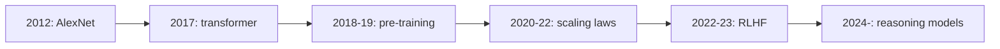

## The question from L02

L01 and L02 built the supply side: the thesis (digital
labor) and the factories ($60M per MW, two-to-four-year
payback). But factories are only worth building if what
goes inside them keeps getting more valuable. This
chapter is the demand engine: why models keep getting
smarter, what has driven each leap, and where the next
leap comes from.

The guide is Yash Patil, who joined OpenAI's
post-training team in early 2023, led agentic coding
research that became Codex, and left about a year ago to
found Applied Compute. He tells the story as a tour of
bottlenecks: at each era, one constraint gated progress,
and breaking it unlocked the next.

## Before the machines could see: AlexNet

Start in 2012. Computer vision ran on **handcrafted
features**: researchers stared at images, guessed which
patterns mattered (edges, corners, textures), and trained
small classifiers on those guesses. Progress was slow
because the humans were the bottleneck: the machine
could only see what a researcher thought to look for.

**AlexNet** broke this. The recipe had three parts: a
neural network (layers of tunable weights), a massive
dataset (ImageNet), and GPUs to train on. The result was
a step change in accuracy that proved a general
principle: scale compute and data, and predictive
accuracy jumps.

The guest marks this as the pivotal moment for a second
reason. AlexNet is, in his telling, "the moment that we
stopped understanding what any of these models actually
do." A **neural network** learns its own internal
representations from data: millions or billions of
parameters, tuned by training, that work brilliantly
while remaining uninterpretable. **Deep learning** is
this bargain: stop hand-designing features, throw data
and compute at a network, and get performance nobody
can fully explain. Every later chapter of AI economics
inherits that bargain.

## The transformer: an architecture that scales

Neural networks existed before 2017, but language models
were stuck. The dominant designs, **recurrent neural
networks** and **LSTMs**, processed text step by step,
which made them slow and hard to scale to long
sequences.

The **transformer**, from researchers at Google Brain,
replaced the chain with **self-attention**: every token
looks directly at every other token. Two properties
mattered economically. First, it ran far better on
existing GPU hardware, because the work parallelizes.
Second, it scaled to massively long sequences, which is
what language needs. Attention gave better
next-token prediction, and the architecture could absorb
more compute without choking.

Figure L03-F1. The eras of the model layer. Source:
original diagram for Stanford Frontier AI, drawn from
the session.



## The pre-training era: predicting the next token

With the transformer in hand, 2018 to 2019 became the
**pre-training** era. The method: take massive corpora
of text, and train the model to predict the next token.
A **token** is a chunk of text, roughly a word or part
of one. The training loop is simple to state. Show the
model text, ask it to predict the next token, compare
against the actual next token, and run **backpropagation**
to nudge the weights so the next prediction is better.
Repeat trillions of times.

The guest's framing of what falls out is worth quoting
in plain form: pre-training is **compression**. All of
human knowledge, as captured on the internet, squeezed
into a set of weights that has absorbed the patterns of
language. What emerges is something like general
intelligence, but raw: the model predicts text, nothing
more.

The limitation was immediate and practical. A raw
pre-trained model is a next-token machine. Ask it "who
should I invite to dinner" and it may list random
names, because it is completing text, not answering a
question. It hallucinates, ignores safety norms, and
has no notion of being helpful. Useful intelligence
needed a second stage.

## Scaling laws: bigger is better, then smarter is better

Two sets of **scaling laws**, empirical rules relating
inputs to performance, organized the next era.

The **Kaplan / OpenAI scaling laws** said: make the
model much bigger, and performance gets much better.
**GPT-3** was the proof: the first model that seemed to
have some level of general intelligence, a breakthrough
moment for the field.

The **Chinchilla scaling laws** refined the recipe.
Bigger is not enough on its own. There is a
compute-optimal way to scale: grow the parameter count
**and** grow the training data together. Training a
huge model on too little data wastes the parameters.

Economically, the scaling laws did something rare: they
turned intelligence into a capital allocation problem.
If performance follows compute and data predictably,
then the way to a smarter model is to spend more. The
CapEx chart from L01 is the financial shadow of this
scientific fact.

## RLHF: making the model usable

Once base models were generally useful, the problem
became steering them. **Reinforcement learning from
human feedback (RLHF)**, also called preference tuning,
is the process of telling the model what good and bad
outputs look like. Humans rank outputs, the model learns
the preferences, and out comes a system that answers
questions in a chat format, follows safety guidelines,
and refuses to explain how to build weapons.

**GPT-4** was the next step change in quality: the
product of scale plus steering, and the model that
convinced the world the recipe worked.

## Reasoning models: a new axis of scaling

In 2024, OpenAI's **o1** opened a new axis:
**test-time compute**. Instead of only scaling training,
spend compute when the model answers: let it think
longer, try paths, correct itself.

The guest stresses that the headline behavior,
**chain of thought**, was never directly trained. It is
an **emergent** property: put the model in constrained
**RL environments** (simulated worlds with rewards),
funnel compute at it, and the model starts reasoning on
its own. Nobody taught it to think step by step. The
behavior appeared.

Combine reasoning with **tool use**, models that browse
and write code, and you get agents: systems like Claude
Code, Codex, and deep research that work for long
stretches. The guest's term is **AI co-workers**.

Figure L03-F2. The three scaling axes. Source: original
diagram for Stanford Frontier AI, drawn from the
session.

```ascii
axis 1: pre-training scale     (more params + more data)
axis 2: post-training scale    (more RL, bigger batches)
axis 3: test-time scale        (more thinking per answer)

o1 = axis 3 appears. Reasoning emerges. Nobody trained it directly.
```

## The bottleneck tour

Now the key question of the chapter: what gated progress
at each step, and what gates it next? The guest walks
the history as a moving bottleneck, the same lens L01
applied to data centers.

```ascii
then:  compute to train          (get the GPUs)
then:  architecture              (needs the transformer)
then:  pre-training data         (train on the whole internet)
then:  usability                 (steer it with RLHF)
now:   RL environments           (worlds with rewards, for reasoning)
next:  continual learning        (learn from sparse real-world reward)
```

The current frontier is **RL environments**: constructed
worlds where the model acts, gets rewards, and learns.
The next, and the guest's pick for the holy grail, is
**continual learning**: a deployed model that learns
from extremely sparse rewards in the real world. His
analogy: you touch a hot stove once and never do it
again. One loud signal, permanent learning. Today's
models cannot do that. They need thousands of examples
where a human needs one. Whoever cracks learning from
one loud signal owns the next era.

## Why code came first

The host asks why every lab converged on software
engineering as the first frontier. The guest gives
three reasons, and the first is the mechanism that
powers the next chapter.

**1. Verifiable rewards.** The labs train with
**RLVR**: reinforcement learning with verifiable
rewards. To learn, the model needs a deterministic
check on whether it did the right thing. Code
compiles. Unit tests pass or fail. Math proofs check.
No human judge needed. The reward signal is loud,
cheap, and automatic.

**2. Data abundance.** There are enormous numbers of
code tokens on the internet, and synthetic code data is
easy to generate.

**3. Code is general.** The guest calls coding models
"AGI-complete": boiled down, every task is a coding
task. Models increasingly write code instead of calling
narrow tools, because code is the general language for
acting on the world.

A vivid aside proves the point sideways. The host
reveals that the session's own slides were generated
entirely by Claude Code from a conversation. The
guest has done the same. Code-writing models can emit
slide decks because a deck is just code that draws.
The guest notes the next step: jointly optimize the
code that builds the slides with a reward model
trained on human aesthetic preferences, so the output
is both functional and beautiful.

## Mapping back: the demand engine

| L02 question | This chapter's answer |
|---|---|
| Why do the machines keep getting more valuable? | Each era broke a bottleneck: AlexNet (data+GPUs), transformer (parallel architecture), pre-training (internet text), scaling laws (capital allocation), RLHF (usability), reasoning (test-time compute). |
| What makes intelligence investable? | Scaling laws turned smarts into spend: predictable returns to compute and data. The CapEx chart is this fact, financed. |
| What is scarce now? | RL environments: reward-bearing worlds to train reasoning. Data for pre-training is tapped out; only frontier labs can still play there. |
| Why did code lead? | RLVR: compile-and-test gives free, loud, verifiable rewards. Code tokens are abundant. Code is the general action language. |

## The honest price: the data wall

The chapter's price is the one the guest states
plainly: pre-training has hit a data wall. There is
only so much internet, and the frontier is reached.
Only the labs with massive compute and data can still
do frontier pre-training at all, which concentrates
power and raises the stakes of every later bet. The
field's response, RL environments and synthetic data,
trades compute for data: learn more from each sample
by trying thousands of times. Whether that trade
scales as well as the internet did is the open
question under the whole course.

> [!QA]
> Q: What is pre-training, in one paragraph?
> A: Pre-training is the massive first stage of training: take internet-scale text, trillions of tokens, throw enormous compute at a transformer, and train it to predict the next token, adjusting weights by backpropagation each time it is wrong. What falls out is compression: all of human knowledge squeezed into weights that have absorbed the patterns of language. The product is raw and unsteered: it completes text rather than answering questions, hallucinates freely, and needs a second stage before it is useful.
> Follow-up: Why does pre-training take orders of magnitude more compute than everything after it?
> A: Because it builds the representations from scratch on trillions of tokens. Every later stage, fine-tuning, RLHF, RLVR, starts from those weights and only steers them. The guest's number for the ratio appears in the next chapter: DeepSeek's RL stage used about 5 percent of its pre-training compute.

> [!QA]
> Q: What did the scaling laws change, economically?
> A: They turned intelligence into a capital allocation problem. The Kaplan laws showed that bigger models perform much better, proven by GPT-3. Chinchilla added that scaling must be compute-optimal: grow parameters and data together. Once returns to compute are predictable, the rational move is to spend, which is exactly what the $650B CapEx chart shows. Science gave investors a curve; finance is now climbing it.
> Follow-up: What breaks if the scaling laws slow down?
> A: The investment thesis. If more compute stops buying proportionally more intelligence, the factories from L01 and L02 become stranded assets and the depreciation debate turns ugly. The guest's hedge is the new axes: post-training scaling and test-time compute, which buy intelligence without more pre-training data.

> [!QA]
> Q: What is chain of thought, and why does its origin matter?
> A: Chain of thought is the model's behavior of thinking step by step, trying paths and correcting itself before answering. It matters because nobody trained it directly. It emerged from putting models in constrained RL environments and funneling compute at them. Emergence means capability can appear discontinuously from scale, which is both the bull case (more compute buys surprises) and the governance problem (surprises are hard to plan for).
> Follow-up: What is test-time compute?
> A: Compute spent while answering, not while training. The o1 breakthrough was a new scaling axis: let the model think longer at query time and it gets smarter per question. It converts inference from a fixed cost into a dial: pay more thinking, get better answers. That dial reprices every application built on top of models.

> [!QA]
> Q: Why did all the labs start with code?
> A: Three reasons. First, verifiable rewards: code compiles and unit tests pass or fail, so RLVR gets a free, loud, deterministic learning signal with no human judge. Second, data: code tokens are abundant and synthetic code data is easy to make. Third, generality: the guest calls coding "AGI-complete," since every task boiled down is a coding task, and models increasingly use code as their general language for acting on the world. The session's own slides, generated entirely by Claude Code, are the exhibit.
> Follow-up: What does "verifiable reward" rule out?
> A: Domains where correctness needs human judgment: taste, persuasion, strategy. Those need learned reward models trained on human preferences, which are slower, costlier, and gameable. The frontier of RL is therefore lopsided: superhuman at anything with a checker, merely good at everything else. Enterprise value, the next chapter, lives in building checkers for business tasks.

## Recap: the whole lesson on one screen

1. **AlexNet (2012).** GPUs plus ImageNet beat
   handcrafted features. Deep learning's bargain: stop
   understanding the model, start scaling it.
2. **Transformer (2017).** Self-attention parallelizes
   on GPUs and scales to long sequences. The
   architecture that could absorb the compute.
3. **Pre-training (2018-19).** Predict the next token
   on internet text, backpropagate, repeat trillions of
   times. Compression of human knowledge into weights.
4. **Scaling laws.** Kaplan: bigger performs better
   (GPT-3). Chinchilla: scale data with parameters.
   Intelligence becomes a capital allocation problem.
5. **RLHF.** Steer the raw model with human
   preferences. GPT-4: scale plus steering.
6. **Reasoning (2024).** o1 adds test-time compute.
   Chain of thought emerges, untrained. Plus tool use:
   agents, AI co-workers.
7. **The bottleneck tour.** Compute, architecture,
   pre-training data, usability, RL environments, and
   next: continual learning, the hot-stove problem.
8. **Why code first.** RLVR's verifiable rewards,
   abundant tokens, and code as the general action
   language. Next: how enterprises capture this.

## Official sources and further reading

**Official:**
- Enterprise Internal Knowledge (MS&E 435, Spring
  2026), guest Yash Patil, Applied Compute:
  https://www.youtube.com/watch?v=LRGX-gTegVA
- MS&E 435 course site: https://mse435.stanford.edu/

**Further reading:**
- Karpathy's write-up on RLVR, assigned in the course
  readings, on what happened in 2025.
- Kaplan et al., Scaling Laws for Neural Language
  Models (2020); the Chinchilla paper (Hoffmann et
  al., 2022).

**Caveats from these sources.** "The moment we stopped
understanding models" is the guest's gloss, not a
technical claim. The o1 emergence account follows the
guest's telling; the training details are not public.
The transcript spells the guest "Yash Patel" in the
intro; the course site and video page say "Yash
Patil," used here. Dates for eras are the guest's
periodization.

## Connections to the other courses

- **CS336:** the full technical build of the
  transformer and the pre-training pipeline this
  chapter narrates economically.
- **CS224N:** the NLP-side history: from RNNs to
  attention to large language models.
- **CS229:** the ML foundations: what backpropagation
  and loss optimization actually do.
- **MS&E435 L04:** the other half of this session:
  evals, RLVR economics, and enterprise specialization.
- **MS&E435 L02:** the factories all this scaling
  must pay for.
