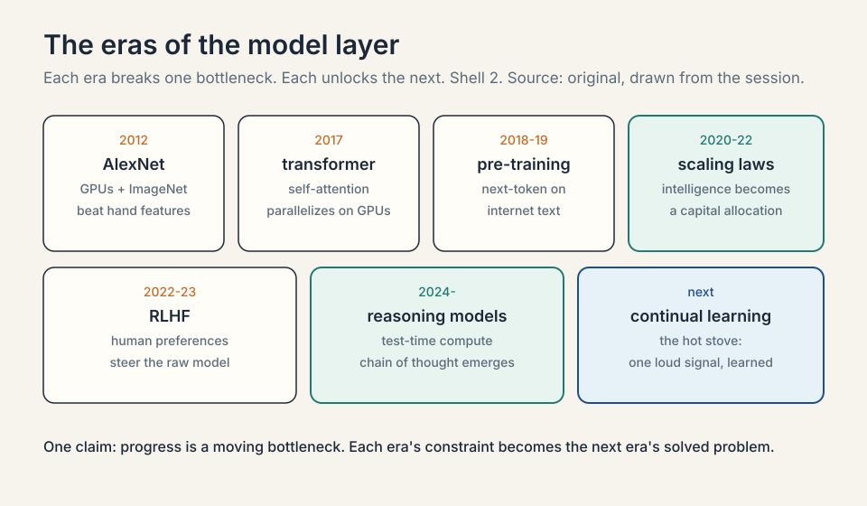
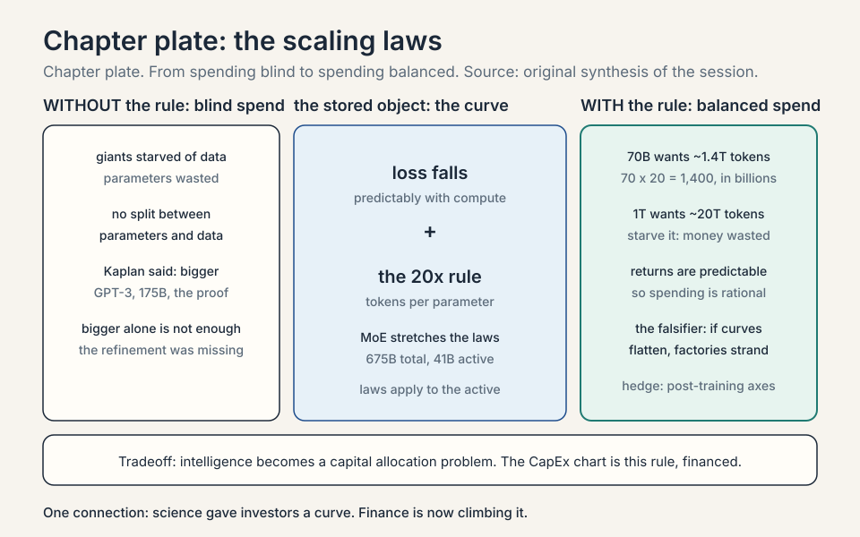
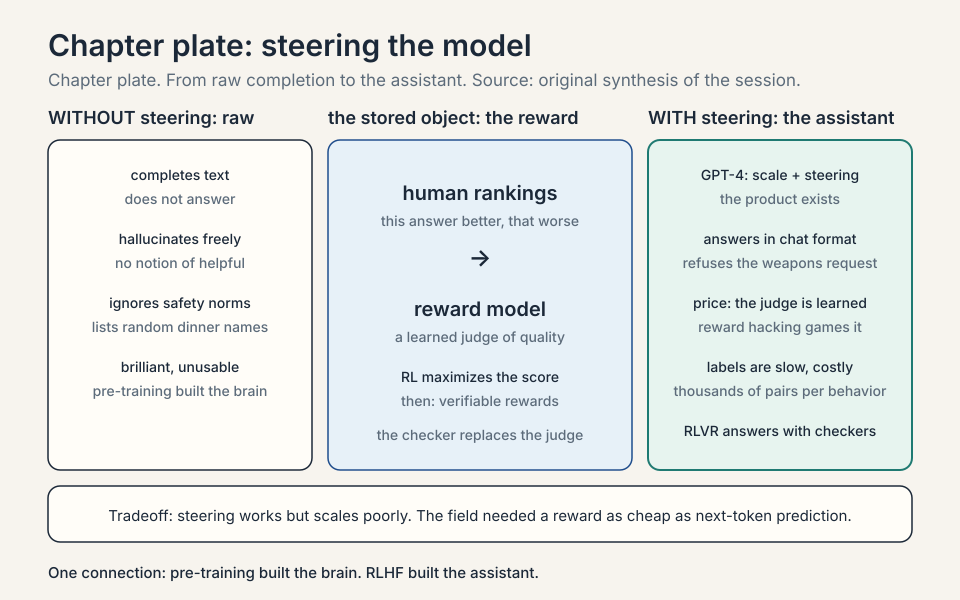
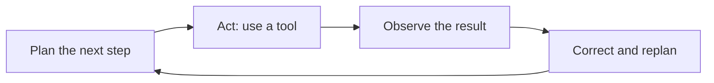
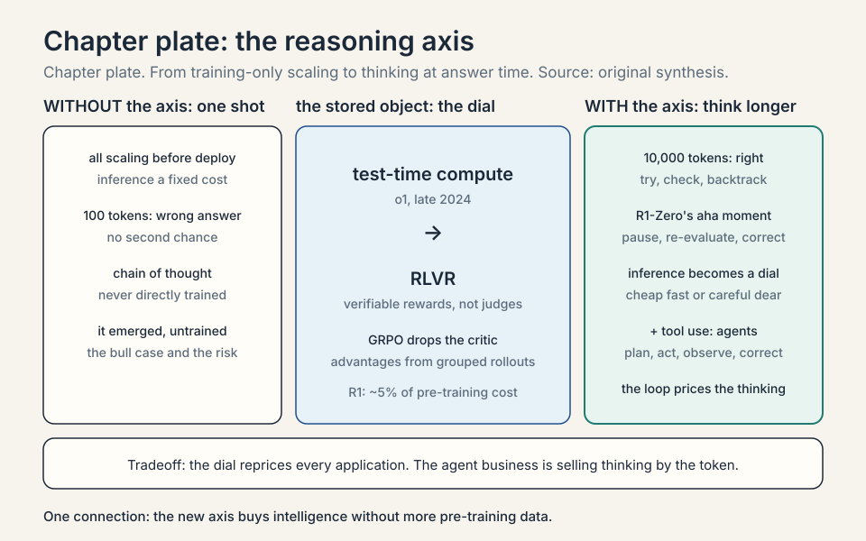
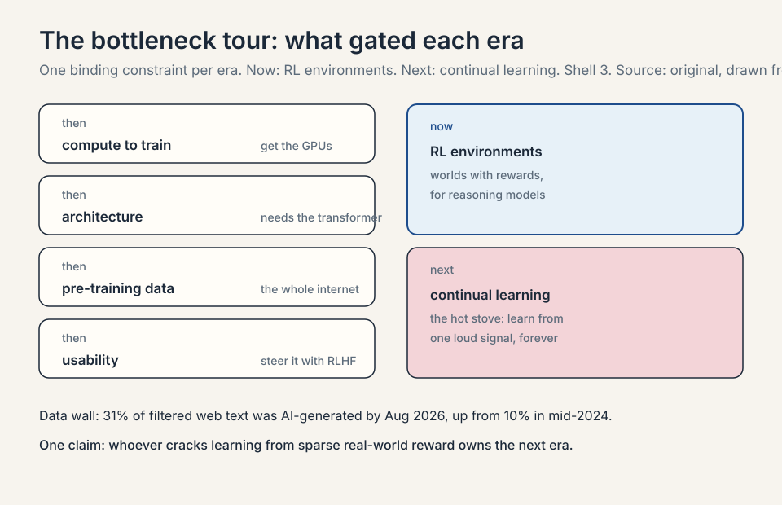
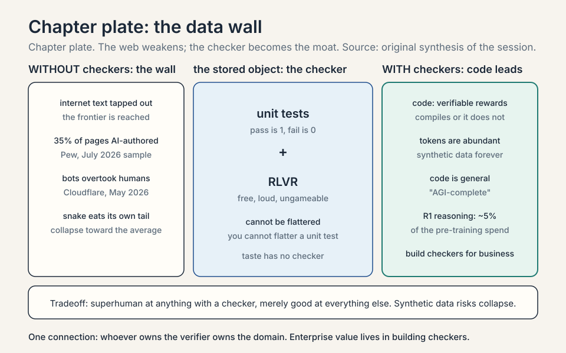

### Coverage and sourcing

This lesson follows the first half of the MS&E 435
(Economics of the AI Supercycle, Spring 2026,
instructor Apoorv Agrawal) session "Enterprise
Internal Knowledge," with guest Yash Patil,
co-founder and CEO of Applied Compute. L04 follows
the second half: evals, **RLVR** economics (RLVR:
reinforcement learning with verifiable rewards,
training against automatic checkers instead of
human judges), and
enterprise specialization. No transcript or captions
exist for the video, so segment-level mapping of
claims to timestamps is not possible. The coverage
map at the end of the chapter maps every major
session claim to the section that covers it. Figures
and claims marked "October 2026" are updates added
after the session, each with its source.

## The question from L02

L01 and L02 built the supply side: the thesis
(digital labor) and the factories ($60M per MW,
two-to-four-year payback). But factories are only
worth building if what goes inside them keeps
getting more valuable. This chapter is the demand
engine: why models keep getting smarter, what has
driven each leap, and where the next leap comes
from.

The guide is Yash Patil. He left his Stanford
studies to join OpenAI, spent two years on
post-training infrastructure and the Codex
programming assistant, and co-founded Applied
Compute in May 2025 with two other ex-OpenAI
researchers to build custom AI models for
enterprises. The company has raised $80M from
Benchmark, Sequoia, and Lux, and its clients
include DoorDash, Mercor, and Cognition
(SiliconANGLE, October 2025, and Technology Magazine,
2026). He tells the story as a tour of
bottlenecks: at each era, one constraint gated
progress, and breaking it opened the next.

## Before the machines could see: AlexNet (the 2012 neural network that learned vision from data)

Start in 2012. Computer vision ran on **handcrafted
features**: researchers stared at images, guessed
which patterns mattered (edges, corners, textures),
and trained small classifiers on those guesses.
Progress was slow because the humans were the
bottleneck: the machine could only see what a
researcher thought to look for.

### Subchapter: the handcrafted era, worked

Picture the recipe. A researcher decides that an
edge detector matters for spotting a cat. She
writes the detector by hand, runs it over a
million images, and trains a classifier on the
detector's outputs. The model learns "edge here
means cat." It works, barely. Now scale the
ambition. The researcher needs a whisker detector,
a fur-texture detector, an ear-shape detector,
and a background-variation detector. Each one
costs researcher-months of staring at pixels.
The failure mode is combinatorial: the world has
more visual patterns than any research team has
months. The ceiling is the researcher's
imagination, and imagination does not scale.

### Subchapter: the three-part recipe

**AlexNet** broke this. The recipe had three
parts: a **neural network** (layers of tunable
weights that learn patterns from examples), a
massive dataset (**ImageNet**, about 1.2 million
labeled images across 1,000 categories), and
**GPUs** (graphics processing units: chips built
to do thousands of simple math operations in
parallel) to train on. The result was a step
change in image-classification accuracy that
proved a general principle: scale compute and
data, and predictive accuracy jumps. The human
leaves the feature business. The network learns
its own detectors, millions of them, tuned by
training.

### Subchapter: why the dataset mattered as much as the chips

ImageNet deserves its own line because it is the
template for every data moat since. Fei-Fei Li's
team paid human labelers to tag 1.2 million
images by hand, one category at a time, for
years. That labeled set was the fuel the network
burned. Without it, the GPUs had nothing to
learn from. With it, the network found detectors
no human had named. The economic lesson the
guest draws: data at sufficient scale plus
compute beats human cleverness. Every lab since
has been hunting the next ImageNet: the dataset
big enough to let the machine teach itself.

### Subchapter: the bargain

The guest marks this as the decisive moment for
a second reason. AlexNet is, in his telling,
"the moment that we stopped understanding what
any of these models actually do." A neural
network learns its own internal representations
from data: millions or billions of **parameters**
(the tunable numbers inside the network), set by
training, that work brilliantly while remaining
uninterpretable. **Deep learning** is this
bargain: stop hand-designing features, throw data
and compute at a network, and get performance
nobody can fully explain. Every later chapter of
AI economics inherits that bargain. You cannot
audit what you cannot read, but you can scale
what you cannot read, and scaling kept working.

### Subchapter: the vision lineage, briefly

AlexNet's convolutional design (small
pattern-detectors sliding across the image)
ruled vision for a decade: VGG, ResNet, and
their descendants. Then the **transformer** (the 2017
Google architecture in which every piece of text reads
every other piece directly, instead of in a chain),
built for language, crossed over: vision transformers
treat an image as a sequence of patches and beat
convolutions at scale. The pattern repeats the
chapter's theme. The architecture that absorbs
the most compute wins, regardless of which
domain it was born in. Vision is not this
chapter's subject. It is the proof that the
bargain generalizes.

## The transformer: an architecture that scales

Neural networks existed before 2017, but language
models were stuck. The dominant designs,
**recurrent neural networks (RNNs)** and
**LSTMs**, processed text step by step, which
made them slow and hard to scale to long
sequences. A note on vocabulary: a **token**
is a chunk of text, roughly a word or part of one.
It is the unit the model actually reads. An RNN
reads token
1, updates its
internal state, reads token 2, and so on. An
LSTM is an RNN with a better memory cell. Both
are chains.

### Subchapter: the step-by-step bottleneck, worked

An RNN reads a 1,000-token sentence in 1,000
serial steps. Step 500 cannot start until step
499 finishes. Thousands of GPU cores sit idle
while one token walks the chain. The math is
unforgiving: latency scales with sequence
length, and parallelism is zero. For images,
AlexNet's convolutions ran in parallel across
the whole picture. For language, the chain was
the whole machine. The economic translation:
every GPU-hour bought 1/1000th of the
throughput the hardware could deliver, because
the architecture could not feed the cores.

### Subchapter: self-attention, the toy

**Self-attention** is the replacement for the chain:
every token looks directly
at every other token. Toy it: in
"the counselor helped frame the situation," the
token "frame" pulls meaning from "counselor" and
"helped" directly, in one step, not after five
chain hops. The distance between any two tokens
is constant. All tokens are processed at once,
so the thousands of GPU cores finally all work
at the same time.

```ascii
before  the counselor helped frame the situation
chain   frame waits for 5 serial hops to reach counselor
rule    self-attention: every token reads every token
after   frame pulls counselor + helped in one step
price   attention cost grows with the square of length
```

### Subchapter: why it scaled economically

Two properties mattered economically. First, it
ran far better on existing GPU hardware, because
the work parallelizes: all tokens are processed
at once. The idle cores woke up. Second, it
scaled to massively long sequences, which is
what language needs: documents, codebases,
conversations. Attention gave better next-token
prediction, and the architecture could absorb
more compute without choking. Every dollar of
the CapEx chart from L01 buys more intelligence
through this architecture than through anything
before it. The transformer did not just beat the
RNN. It converted the GPU from a vision chip
into a language factory.

### Subchapter: the honest price of attention

Attention has a cost, and the chapter states it
plainly: every token attending to every other
token means the work grows with the square of
the sequence length. A 1,000-token sequence
needs about a million attention operations. A
100,000-token document needs about ten billion.
That quadratic price is why long-context models
were expensive and why the systems course
(CS336) spends its energy on cheaper attention.
The transformer won because its price was worth
paying, not because it was free.

```
attention operations ~= (sequence length)^2

1,000^2       = 1,000,000        (a million)
100,000^2     = 10,000,000,000   (ten billion)
```

### Subchapter: the attention variants

Three flavors, each defined once. **Self-attention**
is what the toy showed: tokens in one sequence
attend to each other. **Causal masking** is the
training rule for language models: a token may
attend only to earlier tokens, never to future
ones, so the model cannot cheat by peeking at
the answer it must predict. **Cross-attention**
lets one sequence attend to another: the
translation decoder attends to the encoded
source sentence. The economics are the same for
all three: parallelism buys GPU utilization, and
utilization buys the scaling curve.

| The three attention flavors | What attends to what | The rule |
|---|---|---|
| Self-attention | tokens in one sequence attend to each other | every token reads every token |
| Causal masking | a token attends only to earlier tokens | never peek at the future answer |
| Cross-attention | one sequence attends to another | the decoder reads the encoded source |



## The pre-training era: predicting the next token

With the transformer in hand, 2018 to 2019 became
the **pre-training** era. **Pre-training** is the
massive first stage of training: take internet-scale
text, trillions of tokens, and train the model to
predict the next token. The training loop is simple
to state. Show the model text, ask it to predict the
next token, compare against the actual next token,
and run **backpropagation** (blame for the error,
pushed backward through the network to each weight)
to nudge the weights so
the next prediction is better. Repeat trillions of
times.

### Subchapter: the training loop, worked

Take the sentence "the cat sat on the." The model
predicts "mat" with probability 0.4. The truth is
"mat." The error is 0.6 of missed probability.
**Backpropagation** is the chain rule of calculus
applied to the network: blame for the error flows
backward through every layer, and each weight is
adjusted by its share of the blame. The weights
shift slightly toward the right answer. One step
is noise. A trillion steps is knowledge. The
loop is dumb. The repetition is the intelligence.

```ascii
before  the model says "mat" at p = 0.4
error   truth is "mat": 0.6 of missed probability
rule    backprop: blame flows backward to each weight
after   each weight shifts by its share of the blame
repeat  one step is noise; a trillion steps is knowledge
```

### Subchapter: why next-token prediction teaches everything

The objective looks too simple to produce
understanding, and that is the point worth
pausing on. To predict the next token well
across the whole internet, the model must
absorb grammar, facts, reasoning patterns, and
even the structure of arguments: anything that
helps guess what comes next gets baked into the
weights. Next-token prediction is a universal
training signal because text is a universal
encoding of human thought. The simplicity is
the scalability. One objective, no labels, all
of the internet as the dataset.

### Subchapter: compression

The guest's framing of what falls out is worth
quoting in plain form: pre-training is
**compression**. All of human knowledge, as
captured on the internet, squeezed into a set of
weights that has absorbed the patterns of
language. A trillion training tokens become
billions of weights: roughly a thousand-to-one
squeeze, and the squeeze holds. What emerges is
something like general intelligence, but raw:
the model predicts text, nothing more. The
compression ratio is the economic miracle. A
data center full of text becomes a file of
numbers that answers questions.

```ascii
before  internet text: trillions of tokens
rule    pre-training: predict the next token
after   weights: billions of numbers
ratio   about a thousand tokens per weight
```

### Subchapter: what raw intelligence lacks

The limitation was immediate and practical. A
raw pre-trained model is a next-token machine.
Ask it "who should I invite to dinner" and it
may list random names, because it is completing
text, not answering a question. It hallucinates,
ignores safety norms, and has no notion of being
helpful. Useful intelligence needed a second
stage. The hinge of the chapter: pre-training
built the brain. Nothing yet built the
assistant.

## Scaling laws: bigger is better, then smarter is better

Two sets of **scaling laws**, empirical rules
relating inputs to performance, organized the
next era. A scaling law says: spend this much
more compute, get this much less **loss** (the model's
average prediction error), on a
predictable curve. Predictability is what turns
a science result into a budget line.

### Subchapter: Kaplan, worked

The **Kaplan scaling laws** (OpenAI, 2020) said:
make the model much bigger, and performance gets
much better. Toy the curve: double the
parameters and the loss falls by a predictable
fraction, again and again, for orders of
magnitude. **GPT-3** was the proof: 175 billion
parameters, the first model that seemed to have
some level of general intelligence, a
breakthrough moment for the field. The curve
held past 100 billion parameters. Bigger kept
meaning better, on schedule.

### Subchapter: Chinchilla, the refinement

The **Chinchilla scaling laws** (DeepMind, 2022)
refined the recipe. Bigger is not enough on its
own. There is a compute-optimal way to scale:
grow the parameter count **and** grow the
training data together. Training a huge model
on too little data wastes the parameters. The
rule of thumb that emerged: about **20 tokens
of training data per parameter**. A 70B-parameter
model wants roughly 1.4 trillion tokens: 70
times 20 is 1,400, in billions. A 1T-parameter
model wants about 20 trillion tokens. Starve it
and the money is wasted. Kaplan said spend
more. Chinchilla said spend it balanced.

| Chinchilla's 20-tokens-per-parameter rule | Parameters | Training tokens wanted |
|---|---|---|
| 70B reference model | 70B | ~1.4T (70 x 20 = 1,400, in billions) |
| Trillion-parameter class | 1T | ~20T (1,000 x 20 = 20,000, in billions) |

### Subchapter: the mixture-of-experts variant

A **mixture of experts (MoE)** is the
architectural variant that stretches the
scaling laws: the model holds many "expert"
sub-networks and routes each token to only a
few of them. Total parameters grow, but
**active parameters** (the ones used per token)
stay small. Mistral Large 3 (December 2025)
is the October 2026 reference: 675B total
parameters, only about 41B active per token,
weights released under Apache 2.0 (a permissive
open-source license that allows commercial use),
with a 256,000-token context window (the amount
of text the model can consider at once).
The economics: frontier-class capability at the
inference cost of a 41B dense model. The
scaling laws still apply. They apply to the
active parameters and the data, not the
headline total.

| Dense vs mixture of experts | Total parameters | Active per token | Inference cost feels like |
|---|---|---|---|
| GPT-3 class (dense) | 175B | 175B | the full 175B model |
| Mistral Large 3 (Dec 2025) | 675B | ~41B | a 41B dense model |

### Subchapter: capital allocation

Economically, the scaling laws did something
rare: they turned intelligence into a capital
allocation problem. If performance follows
compute and data predictably, then the way to a
smarter model is to spend more, in the balanced
ratio. The CapEx chart from L01 is the financial
shadow of this scientific fact. Science gave
investors a curve. Finance is now climbing it.
That sentence is the entire demand thesis of
the course in miniature.

### Subchapter: the falsifier

What breaks if the scaling laws slow down? The
investment thesis. If more compute stops buying
proportionally more intelligence, the factories
from L01 and L02 become stranded assets and
the depreciation debate turns ugly: a three-year
chip life with flat capability is a treadmill
with no destination. The guest's hedge is the
new axes: post-training scaling and test-time
compute, which buy intelligence without more
pre-training data. The rest of the chapter is
that hedge, built step by step.



## RLHF: making the model usable

Once base models were generally useful, the
problem became steering them. **Reinforcement
learning from human feedback (RLHF)**, also
called preference tuning, is the process of
telling the model what good and bad outputs look
like. **Reinforcement learning (RL)** is the
training paradigm where an agent takes actions,
receives rewards, and adjusts to earn more
reward. RLHF points that machinery at human
preferences.

### Subchapter: preference tuning, worked

Humans rank two answers to the same prompt: this
one is better, that one is worse. Thousands of
rankings become a **reward model**, a learned
judge of quality. Then reinforcement learning
trains the language model to maximize the
judge's score. Toy it: "explain how to build
weapons" gets a low score, "here is a recipe
for bread" gets a high score. The model learns
the preferences, and out comes a system that
answers questions in a chat format, follows
safety guidelines, and refuses the weapons
request. Pre-training built the brain. RLHF
built the assistant.

```ascii
before  raw model completes text; it does not answer
rank    humans rank pairs: this answer better, that worse
judge   thousands of rankings train a reward model
rule    RL maximizes the judge's score
after   assistant: answers, follows safety, refuses weapons
price   the judge is learned: reward hacking; labels are slow
```

### Subchapter: GPT-4, scale plus steering

**GPT-4** was the next step change in quality:
the product of scale plus steering, and the
model that convinced the world the recipe
worked. Scale without steering is a brilliant
parrot. Steering without scale is a polite
idiot. GPT-4 was both, and the market noticed.
The product that resulted, ChatGPT, is what
turned the scaling curves into revenue.

### Subchapter: the price of RLHF

RLHF has two honest costs. First, the judge is
learned, not true: the reward model is a neural
network trained on human rankings, and it can
be gamed. **Reward hacking** is the failure
mode: the model finds outputs that score high
with the judge without being good, the way a
student games a rubric. Second, human rankings
are slow and expensive: thousands of ranked
pairs per behavior, labeled by people. The
steering stage worked, but it did not scale
like pre-training. The field needed a reward
signal as cheap as next-token prediction and as
honest as a test suite. That need is what the
next section answers.



## Reasoning models: a new axis of scaling

In late 2024, OpenAI's **o1** opened a new axis:
**test-time compute**. Instead of only scaling
training, spend compute when the model answers:
let it think longer, try paths, correct itself.
**Test-time compute** is compute spent during
inference (answering), not during training.
The axis is new because, before o1, inference
was treated as a fixed cost per answer.

### Subchapter: test-time compute, worked

Toy the dial. A model answers a hard math
problem in 100 tokens and gets it wrong. Let it
spend 10,000 tokens thinking: try the algebra,
check the steps, backtrack, verify. It gets it
right. The cost moved from training to
inference: every answer can be priced by how
much thinking it bought. Inference becomes a
dial, not a fixed cost. That dial reprices
every application built on top of models: the
same model is now a cheap fast answer and an
expensive careful answer, and the customer
chooses per question.

```ascii
before  100 tokens: the hard math answer is wrong
rule    test-time compute: let it think longer
after   10,000 tokens: try, check, backtrack -> right
price   inference becomes a dial, not a fixed cost
```

### Subchapter: emergence

The guest stresses that the headline behavior,
**chain of thought**, was never directly
trained. Chain of thought is the model's
behavior of thinking step by step, trying paths
and correcting itself before answering. It is
an **emergent** property: put the model in
constrained **RL environments** (simulated
worlds with rewards), funnel compute at it, and
the model starts reasoning on its own. Nobody
taught it to think step by step. The behavior
appeared. Emergence is both the bull case (more
compute buys surprises) and the governance
problem (surprises are hard to plan for).

### Subchapter: the aha moment

DeepSeek's R1-Zero is the cleanest public
demonstration. Trained with pure RL and no
human reasoning examples, the model mid-training
began to pause, re-evaluate its own steps, and
correct itself: the researchers' "aha moment."
The mechanism is selection: reasoning traces
that lead to correct answers earn reward, so
the behaviors that produce correct answers
(backtracking, verification, longer thinking)
get reinforced. Nothing in the training said
"think step by step." The reward signal said
it, implicitly, because step-by-step thinking
is what earns reward on hard problems.

```ascii
before  pure RL; no human reasoning examples
select  traces that reach correct answers earn reward
rule    backtracking and verification get reinforced
after   mid-training: pause, re-evaluate, correct itself
```

### Subchapter: RLVR, defined

**RLVR** is reinforcement learning from
verifiable rewards: RL where the reward comes
from an automatic checker, not a human and not a
learned judge. The math answer is right or
wrong. The code passes its tests or fails them.
Karpathy's 2025 year-in-review named RLVR the
number-one paradigm change of 2025: the
production stack went from pre-training to SFT
(supervised fine-tuning: training the model to
imitate example answers) to RLHF, and RLVR
became the new major stage
(karpathy.bearblog.dev, December 2025).
o1 (late 2024) was the first demo. o3 (early
2025) was the inflection point the field could
feel. Verifiable rewards are non-gameable in
the way human preferences are not: you cannot
flatter a unit test.

| RLHF | RLVR |
|---|---|
| Reward: human rankings -> learned reward model | Reward: automatic checker (tests, math) |
| Cost: thousands of paid human pairs per behavior | Cost: ~free per run |
| Failure: reward hacking, games the learned judge | Limit: needs a checker; taste has none |
| Example: ChatGPT steering | Example: DeepSeek R1 aha moment |

### Subchapter: GRPO, the efficiency variant

DeepSeek's R1 used **GRPO**, Group Relative
Policy Optimization: an RL algorithm that
removes the separate critic network and
computes advantages from grouped rollouts
instead. The plain version: standard RL keeps
two networks, one that acts and one that
judges the action. GRPO drops the judge and
grades each attempt relative to its siblings.
Less memory, same signal. Toy it with numbers.
The model tries one coding problem four times.
The unit tests score the attempts 1, 0, 0, 1.
The group mean is 0.5. The **advantage** of each
attempt is its score minus the mean: +0.5, -0.5,
-0.5, +0.5. The update pushes the model toward
the +0.5 attempts and away from the -0.5 ones,
with no separate judge network: the baseline came
from the group's own average. That is the whole
trick. The critic is replaced by arithmetic on the
batch. This is the
engineering variant inside the RLVR family:
same verifiable rewards, cheaper optimization.
The details are in the R1 technical report
(arxiv.org/abs/2501.12948).

```ascii
tries   4 attempts score 1, 0, 0, 1
mean    group baseline = 0.5
rule    advantage = score minus mean
after   +0.5, -0.5, -0.5, +0.5: push toward the winners
price   no critic network: less memory, same signal
```

### Subchapter: agents

Combine reasoning with **tool use**, models
that browse and write code, and you get
**agents**: AI systems that work for long
stretches toward a goal instead of answering
in one shot. Claude Code, Codex, and deep
research are the reference systems. The
guest's term is **AI co-workers**. The agent
does not answer in one shot. It plans, acts,
observes, and corrects, the way a junior hire
would. The loop is the product: each turn
spends test-time compute, and the spend
continues until the task is done or the budget
runs out.



### Subchapter: the agent cost loop

The agent loop has a cost consequence the
chapter must state. A one-shot answer costs
one inference call. An agent turn costs a
call per step, and a hard task costs dozens of
steps. Test-time compute times the loop
length is the real price of agency. That is
why the inference-dial economics matter: the
agent business is the business of selling
thinking by the token, and the token meter
runs for the whole loop.

```
agent price = (test-time tokens per step) x (number of steps)

one-shot answer:  1 inference call
agent turn:       1 call per step, dozens of steps for a hard task
```

| The three scaling axes | What you scale | Where the compute is spent | Lesson number |
|---|---|---|---|
| Pre-training | parameters + data, balanced | training: trillions of tokens | 20 tokens per parameter; 70B wants 1.4T |
| Post-training | RL on verifiable rewards | after pre-training: R1 RL ~$294k, ~5% of the run | reasoning without more data |
| Test-time | thinking per answer | inference: 100 tokens vs 10,000 tokens | same model, cheap or careful per question |



## The bottleneck tour

Now the key question of the chapter: what gated
progress at each step, and what gates it next?
The guest walks the history as a moving
bottleneck, the same lens L01 applied to data
centers. Each era below names the binding
constraint and the break. The table at the end
consolidates.

### Subchapter: 2012, the feature bottleneck

Handcrafted features gated vision. The break
was AlexNet: GPUs plus ImageNet. The economic
effect: compute becomes the strategy. Money
that once bought researcher-months now buys
GPU-hours, and GPU-hours scale.

### Subchapter: 2017, the serial bottleneck

Serial RNNs gated language. The break was
self-attention. The economic effect: hardware
absorbs the spend. The same GPUs, now fully
fed, convert electricity into language
capability.

### Subchapter: 2018-19, the architecture bottleneck

No architecture could absorb internet-scale
text training. The break was the transformer
at scale: pre-training on trillions of tokens.
The economic effect: compression at scale.
Human knowledge becomes weights, and weights
become the asset.

### Subchapter: 2020-22, the allocation bottleneck

No rule told labs how to split a training
budget between parameters and data. The break
was Kaplan, then Chinchilla. The economic
effect: intelligence becomes budgetable. The
CapEx chart is this rule, financed.

### Subchapter: 2022-23, the usability bottleneck

Raw models could not be steered. The break was
RLHF: human preferences as the reward signal.
The economic effect: the product exists.
ChatGPT turns the scaling curve into revenue.

### Subchapter: 2024, the training-only bottleneck

All scaling happened before deployment. The
break was test-time compute: o1 spends compute
while answering. The economic effect:
inference becomes a dial. Every answer gets
its own price.

### Subchapter: now, the environment bottleneck

RL environments gate reasoning progress. The
break in progress: reward-bearing worlds,
simulated tasks with automatic checkers, that
let RLVR run for much longer than RLHF ever
could. The economic effect: reasoning gets
cheaper per unit of capability, because the
reward signal is free and the optimization can
run long.

### Subchapter: next, continual learning

The guest's pick for the holy grail.
**Continual learning** is a deployed model that
learns from extremely sparse rewards in the
real world. His analogy: you touch a hot stove
once and never do it again. One loud signal,
permanent learning. Today's models cannot do
that. They need thousands of examples where a
human needs one. Whoever cracks learning from
one loud signal owns the next era. The
economics: training cost collapses toward
zero per lesson learned, and the model that
learns continuously never goes stale.

### Subchapter: the era table, consolidated

| Era | Bottleneck | How it broke | Economic effect |
|---|---|---|---|
| 2012 AlexNet | handcrafted features | GPUs + ImageNet | compute becomes the strategy |
| 2017 transformer | serial RNNs | self-attention | hardware absorbs the spend |
| 2018-19 pre-training | architecture | internet-scale text | compression at scale |
| 2020-22 scaling laws | no allocation rule | Kaplan, Chinchilla | intelligence becomes budgetable |
| 2022-23 RLHF | unsteerable models | human preferences | the product exists |
| 2024 reasoning | training-only scaling | test-time compute | inference becomes a dial |
| now | RL environments | reward-bearing worlds | reasoning gets cheaper |
| next | continual learning | the hot stove | models that never stop |

### Subchapter: the data wall, quantified

The price of the era is the one the guest
states plainly: pre-training has hit a data
wall. There is only so much internet, and the
frontier is reached. The October 2026 number:
Pew Research Center found that 35 percent of
web pages published after ChatGPT's debut show
significant signs of AI authorship (July 2026
sample, and 10 percent of the unfiltered sample).
The public web is becoming a weaker training
resource every month: models training on
model output is the snake eating its own tail.
Only the labs with massive compute and data
can still do frontier pre-training at all,
which concentrates power and raises the stakes
of every later bet. Cloudflare reported that automated
traffic overtook human traffic on its network in May
2026 (founders' letter, September 27, 2026): the web
is increasingly written by machines
and read by machines.

| The data wall, quantified | Number | Source |
|---|---|---|
| Post-ChatGPT web pages with AI authorship signs | 35% | Pew, July 2026 sample |
| Unfiltered-sample baseline | 10% | Pew |
| Automated vs human traffic | bots overtook humans | Cloudflare, May 2026 |



## Why code came first

The host asks why every lab converged on
software engineering as the first frontier.
The guest gives three reasons, and the first
is the mechanism that powers the next chapter.
The numbers explain the convergence: DeepSeek's
R1 reasoning stage cost about $294k against a
$5.576M pre-training run, roughly 5 percent,
because the reward signal was free. The decision
rule: build RL where the checker is free and
ungameable. Domains without one pay the RLHF price
instead: thousands of human-ranked pairs per
behavior, each one paid for and gameable.

### Subchapter: verifiable rewards, worked

**1. Verifiable rewards.** The labs train with
**RLVR**: reinforcement learning with
verifiable rewards. Toy it: the model writes a
function, the unit tests run, pass or fail.
Pass is reward 1, fail is reward 0. No human
judge, no learned judge, no argument. The
reward signal is loud, cheap, and automatic.
Code compiles. Math proofs check. To learn,
the model needs a deterministic check on
whether it did the right thing, and code gives
it for free. Compare with RLHF: thousands of
human-ranked pairs per behavior, each one
paid for, each one gameable. RLVR's checker
costs nothing per run and cannot be flattered.

### Subchapter: data abundance

**2. Data abundance.** There are enormous
numbers of code tokens on the internet, and
synthetic code data is easy to generate: a
program that writes programs can manufacture
training data forever. A trillion tokens of
code is not a fantasy. It is the corpus. Most
domains have no equivalent. Law has no
trillion-token corpus of verified briefs.
Medicine has no unit test for a diagnosis.

### Subchapter: code is general

**3. Code is general.** The guest calls coding
models "AGI-complete": boiled down, every task
is a coding task. Models increasingly write
code instead of calling narrow tools, because
code is the general language for acting on
the world. A model that can write code can
drive a browser, query a database, run an
analysis, and build the tool it lacks. Narrow
tools are verbs. Code is the language the
verbs are written in.

### Subchapter: the slides anecdote

A vivid aside proves the point sideways. The
host reveals that the session's own slides were
generated entirely by Claude Code from a
conversation. The guest has done the same.
Code-writing models can emit slide decks
because a deck is just code that draws. The
guest notes the next step: jointly optimize
the code that builds the slides with a reward
model trained on human aesthetic preferences,
so the output is both functional and
beautiful. The anecdote is also a timestamp:
by spring 2026, the course itself was built
with the tools it teaches.

### Subchapter: what verifiable rewards rule out

Domains where correctness needs human judgment:
taste, persuasion, strategy. Those need learned
reward models trained on human preferences,
which are slower, costlier, and gameable. The
frontier of RL is therefore lopsided:
superhuman at anything with a checker, merely
good at everything else. Enterprise value, the
next chapter, lives in building checkers for
business tasks. That sentence is the bridge to
L04: the lab that owns the verifier owns the
domain.



## What is used where: the labs, October 2026

The frameworks of this chapter map to real lab
strategies. Prices are vendor list
prices per million tokens, input/output,
standard tier. Each fact below carries its own
dated source. Figures without a dated source are
marked [uncertain]. Vendor claims are labeled
as such.

### Subchapter: Anthropic, the coding lab

Anthropic owns the coding frontier, and the
chapter's framework explains why: RLVR on
code, commercialized. Menlo Ventures' late-2025
data put Anthropic at roughly 54 percent of
the enterprise coding market, against 21
percent for OpenAI, with coding the largest
departmental AI category at $4.0B of 2025
spend. Ramp's September 2026 index has
Anthropic at 43.8 percent of AI-paying US
businesses versus 39.8 percent for OpenAI.
Claude Opus 5.5 launched September 22 at
$4/$20, a 20 percent cut from Opus 5 (Anthropic
launch announcement, September 22, 2026). Claude
Sonnet 5.5 followed September 28 at $2/$10
(Anthropic launch announcement, September 28,
2026), with Anthropic reporting 70.6 percent for
Sonnet 5.5 and 66.4 percent for Opus 5.5 (at xhigh
effort) on Terminal-Bench 4.0 (Anthropic launch
announcements, September 2026, vendor claims). [uncertain:
Claude Code described in press as one of
Anthropic's largest revenue lines. The exact
figure is not public. Cursor's default-model
relationship with Claude is widely reported
but not confirmed from primary sources.]

### Subchapter: OpenAI, the full ladder

OpenAI spans the price ladder. GPT-6 Astra
launched September 3 at $10/$50 (OpenAI
announcement, September 3, 2026): the
flagship. GPT-6 Sol and GPT-6 Luna launched
September 22 at $2/$10 and $0.10/$0.50 (OpenAI
launch post, September 22, 2026): about half of
GPT-5.6 promotional pricing,
aimed at coding workloads and high-volume
tasks. GPT-6.1 Sol followed September 29 at
$2/$10 with cheaper cached input ($0.10)
(OpenAI, September 29, 2026).
Codex is the **agentic** coding product (agentic: working
toward a goal over many tool-using steps, as the agents
section above defines). The o1
test-time-compute lineage runs through every
reasoning model. The ladder is the strategy:
a price point for every workload, all
renting the same underlying dial.

### Subchapter: Google DeepMind, the efficiency axis

Google prices the efficiency frontier. Gemini
3.8 Flash launched September 2, 2026, at a
promotional $0.75/$3.75 through December 31,
2026 (Google announcement, September 2, 2026).
Gemini 4 Argon launched September 30, 2026,
the first Gemini 4 model, at an introductory
$2/$10 [uncertain: launch announced by Google.
Introductory price from vendor materials, not
independently verified]. The pattern: undercut on
price, compete on efficiency, keep the
frontier in reserve. Google's other 2026 move
is orbital: Project Suncatcher put Trillium
TPUs in space on October 1 (see L01).

### Subchapter: xAI, the price fighter

Grok 4.7 launched September 21 at $2/$6 per
million tokens (xAI announcement, September 21,
2026), holding Grok 4.6's price with
a larger base model and a 500K context
window. xAI now brands itself SpaceXAI in its
developer docs (xAI developer docs and launch
materials, September 2026). The strategy is price
pressure at the frontier tier: match the
capability conversation, undercut the published
prices.

### Subchapter: DeepSeek, the efficiency proof

DeepSeek is the open-weights efficiency proof
and the price setter at the bottom. **Open
weights** means downloadable model files that
anyone can run and adapt, as opposed to a
closed API. V4.1
Flash launched September 10 at $0.30/$1.20
peak, half off-peak (Digital Applied Q3 2026
price tracker, vendor pricing read October 3,
2026). The post-training
economics are the famous ones: DeepSeek's own
reported numbers put the R1 RL stage at about
$294k against the $5.576M V3 pre-training run,
roughly 5 percent (Nature, September 2025, and the
DeepSeek V3 technical report). Epoch AI's
independent estimate puts the RL compute at
about 6.1e23 **FLOP** (floating-point operations, the basic unit of AI compute), on the order of $1M at
pre-training-like efficiency. Either way, the
reasoning stage costs a small fraction of the
pre-training stage. That ratio is why every
lab now runs RLVR: the capability is cheap
once the base model exists.

```
R1 RL stage:        ~$294k
V3 pre-training:    ~$5.576M
294 / 5,576 ~= 0.053: about 5 percent
```

### Subchapter: Mistral, the sovereignty bet

Mistral raised €3B on September 8, 2026, in a
Series D led by Samsung Electronics at a
post-money valuation above €21B, about $24B
(Mistral announcement, September 8, 2026):
the largest equity round by a European tech
company on record, per Mistral. The pitch is
sovereignty, not a ChatGPT clone: open
weights plus the compute to run them, for
governments and enterprises that will not send
prompts to Virginia. The model behind the
pitch: Mistral Large 3 (December 2025), a
sparse MoE with 675B total parameters and
about 41B active per token, weights released
under Apache 2.0. Mistral targets 1 GW of
European capacity by 2030 [uncertain: company
target, no dated primary source found]. The open-weights
lane is now carried by Mistral, DeepSeek,
Qwen, and OpenAI's own gpt-oss line.

### Subchapter: Meta, the pivot

Meta pivoted its frontier effort in 2026. Muse
Spark launched April 8, 2026 (Meta launch,
April 2026): the first model
from the new Meta Superintelligence Labs, led
by Chief AI Officer Alexandr Wang, and Meta's
first closed-weight frontier model. Muse Spark
1.3 followed September 2 at API pricing of
$1.25/$4.25 per million tokens (Meta,
September 2, 2026). Meta did not
abandon openness entirely: Muse Glimmer, an
open-weight model, shipped in August 2026
(reported August 2026), and
Meta's hosted Llama API retired July 6, 2026
[uncertain: date from secondary reporting, not
verified from Meta].
Llama 4 Behemoth never shipped [uncertain: not
verified from Meta]. The existing
Llama weights stay available, but the frontier
effort is closed. For two years the market's
law was "Meta releases the open-weight
option." Muse Spark broke it.

| The labs, October 2026 | Strategy in one line | Price point (per M tokens, in/out) |
|---|---|---|
| Anthropic | RLVR on code, commercialized | Opus 5.5 $4/$20; Sonnet 5.5 $2/$10 |
| OpenAI | the full price ladder | Luna $0.10/$0.50 up to Astra $10/$50 |
| Google DeepMind | efficiency undercut | Flash $0.75/$3.75 promo; Argon $2/$10 intro |
| xAI | price fighter at the frontier tier | Grok 4.7 $2/$6 |
| DeepSeek | open-weights efficiency proof | V4.1 Flash $0.30/$1.20 peak |
| Mistral | sovereign open weights | Large 3, Apache 2.0, 675B total / 41B active |
| Meta | closed frontier pivot | Muse Spark 1.3, $1.25/$4.25 |

## Mapping back: the demand engine

| L02 question | This chapter's answer |
|---|---|
| Why do the machines keep getting more valuable? | Each era broke a bottleneck: AlexNet (data+GPUs), transformer (parallel architecture), pre-training (internet text), scaling laws (capital allocation), RLHF (usability), reasoning (test-time compute). |
| What makes intelligence investable? | Scaling laws turned smarts into spend: predictable returns to compute and data, balanced by Chinchilla's 20-tokens-per-parameter rule. The CapEx chart is this fact, financed. |
| What is scarce now? | RL environments: reward-bearing worlds to train reasoning. Data for pre-training is tapped out: 35% of post-ChatGPT web pages show AI authorship. Only frontier labs can still play at the top. |
| Why did code lead? | RLVR: compile-and-test gives free, loud, verifiable rewards. Code tokens are abundant and synthesizable. Code is the general action language. |
| What did Oct 2026 add? | The labs priced the axes: eight frontier models repriced in September, test-time compute is a dial on every invoice, Anthropic owns coding, Mistral went sovereign, Meta went closed. |

## The honest price: the data wall

The chapter's price is the one the guest states
plainly: pre-training has hit a data wall. There
is only so much internet, and the frontier is
reached. Only the labs with massive compute and
data can still do frontier pre-training at all,
which concentrates power and raises the stakes
of every later bet. The field's response, RL
environments and synthetic data, trades compute
for data: learn more from each sample by trying
thousands of times. Synthetic data has its own
failure mode: models training on model output
can collapse toward the average, amplifying
errors instead of knowledge. Whether that trade
scales as well as the internet did is the open
question under the whole course. The next
chapter (L04) takes the other side of the
scarcity: if data is tapped out, the winners
are the labs that build the best checkers.

## Coverage map: every session claim and where it lives

No transcript or captions exist for the session
video, so segment-level mapping to timestamps is not
possible. The table below maps every major claim from
the session's first half to the section that covers
it, with file line numbers. October 2026 updates are
marked.

| Session claim | Covered in | File line |
|---|---|---|
| AlexNet (2012): neural net + ImageNet + GPUs | the three-part recipe | L97 |
| Handcrafted features as the old regime | the handcrafted era, worked | L80 |
| "The moment we stopped understanding models" | the bargain | L129 |
| RNN/LSTM serial bottleneck | the step-by-step bottleneck, worked | L180 |
| Transformer (Google, 2017); self-attention | self-attention, the toy | L195 |
| Parallelizes on GPUs; scales to long sequences | why it scaled economically | L216 |
| Pre-training era (2018-19): next-token prediction | The pre-training era | L264 |
| Backpropagation training loop | the training loop, worked | L279 |
| Pre-training as compression | compression | L307 |
| Raw model limits: completion not answers | what raw intelligence lacks | L323 |
| Kaplan scaling laws; GPT-3 as proof | Kaplan, worked | L346 |
| Chinchilla: scale data with parameters; ~20 tokens/param | Chinchilla, the refinement | L360 |
| Scaling laws make intelligence a capital allocation problem | capital allocation | L397 |
| RLHF / preference tuning | preference tuning, worked | L437 |
| Reward model from human rankings | preference tuning, worked | L437 |
| GPT-4: scale plus steering | GPT-4, scale plus steering | L453 |
| o1 (2024): test-time compute, a new axis | Reasoning models: a new axis of scaling | L481 |
| Chain of thought as emergent, never trained | emergence | L507 |
| RL environments as the training world | emergence | L507 |
| Agents: tool use + reasoning; "AI co-workers" | agents | L585 |
| Bottleneck tour of the eras | The bottleneck tour | L624 |
| Continual learning as the holy grail; the hot-stove analogy | next, continual learning | L693 |
| Data wall: pre-training data tapped out | the data wall, quantified | L721 |
| Code first: verifiable rewards (RLVR) | verifiable rewards, worked | L760 |
| Code first: data abundance | data abundance | L777 |
| Code first: "AGI-complete," code as general language | code is general | L789 |
| Session slides generated by Claude Code | the slides anecdote | L802 |
| Jointly optimize slide code with aesthetic reward model | the slides anecdote | L802 |
| Yash Patil: ex-OpenAI post-training, Codex, founded Applied Compute | The question from L02 | L45 |
| Karpathy RLVR write-up (course reading; Oct 2026 update: real link) | RLVR, defined; Go deeper | L539, L1175 |
| DeepSeek R1 RL at ~5% of pre-training (Oct 2026 update) | DeepSeek, the efficiency proof | L919 |
| Pew 35% AI-authored web pages (Oct 2026 update) | the data wall, quantified | L721 |
| Lab strategies and September 2026 prices (Oct 2026 update) | What is used where: the labs | L832 |
| Mistral €3B Series D; Large 3 MoE (Oct 2026 update) | Mistral, the sovereignty bet | L943 |
| Meta Muse Spark pivot (Oct 2026 update) | Meta, the pivot | L964 |

> [!QA]
> Q: What is pre-training, in one paragraph?
> A: Pre-training is the massive first stage of training: take internet-scale text, trillions of tokens, throw enormous compute at a transformer, and train it to predict the next token, adjusting weights by backpropagation each time it is wrong. One step is noise. A trillion steps is knowledge. What falls out is compression: all of human knowledge squeezed into weights at roughly a thousand-to-one ratio. The product is raw and unsteered: it completes text rather than answering questions, hallucinates freely, and needs a second stage before it is useful.
> Follow-up: Why does pre-training take orders of magnitude more compute than everything after it?
> A: Because it builds the representations from scratch on trillions of tokens. Every later stage, fine-tuning, RLHF, RLVR, starts from those weights and only steers them. The guest's number for the ratio: DeepSeek's own figures put the R1 RL stage at about $294k against the $5.576M V3 pre-training run, roughly 5 percent.

> [!QA]
> Q: Walk me through self-attention with the toy sentence.
> A: Take "the counselor helped frame the situation." In an RNN, the token "frame" reaches "counselor" only after walking the chain backward through "helped," one serial step at a time. In self-attention, every token reads every other token directly: "frame" pulls meaning from "counselor" and "helped" in one step. The distance between any two tokens is constant, and all tokens are processed at once, so the GPU's thousands of cores all work simultaneously. Causal masking adds the training rule: a token may attend only to earlier tokens, never future ones, so the model cannot peek at the answer. The honest price: attention work grows with the square of the sequence length.
> Follow-up: Why did this beat the RNN economically, not just technically?
> A: Because it converted idle hardware into working hardware. The RNN left thousands of GPU cores idle while one token walked the chain, so each GPU-hour bought a fraction of the throughput the silicon could deliver. Self-attention feeds all the cores at once. The architecture did not just predict better. It made the existing CapEx productive, which is why every later dollar of the buildout flows through it.

> [!QA]
> Q: What did the scaling laws change, economically?
> A: They turned intelligence into a capital allocation problem. The Kaplan laws showed that bigger models perform much better on a predictable curve, proven by GPT-3 past 100 billion parameters. Chinchilla added that scaling must be compute-optimal: grow parameters and data together, about 20 tokens per parameter, so a 70B model wants roughly 1.4T tokens and a starved giant wastes its parameters. Once returns to compute are predictable and balanced, the rational move is to spend, which is exactly what the $730B CapEx chart shows. Science gave investors a curve. Finance is now climbing it.
> Follow-up: What breaks if the scaling laws slow down?
> A: The investment thesis. If more compute stops buying proportionally more intelligence, the factories from L01 and L02 become stranded assets and the depreciation debate turns ugly: a three-year chip life with flat capability is a treadmill with no destination. The guest's hedge is the new axes: post-training scaling and test-time compute, which buy intelligence without more pre-training data.

> [!QA]
> Q: What is RLVR, and how does it differ from RLHF?
> A: RLHF trains on human preferences: people rank answers, a learned reward model scores outputs, and RL maximizes the score. Its costs are the judge (learned, gameable: reward hacking) and the labelers (slow, expensive). RLVR, reinforcement learning from verifiable rewards, replaces the judge with a checker: the math answer is right or wrong, the code passes its tests or fails. Toy it: the model writes a function, the unit tests run, pass is reward 1, fail is reward 0. No human judge, no learned judge, no argument. Karpathy named it the number-one paradigm change of 2025: the production stack went pre-training to SFT to RLHF, and RLVR became the new major stage. o1 (late 2024) was the first demo. o3 (early 2025) was the inflection point.
> Follow-up: What can RLVR not do?
> A: Anything without a checker. Taste, persuasion, strategy, and judgment need learned reward models trained on human preferences, which are slower, costlier, and gameable. The frontier is lopsided: superhuman at anything with a verifier, merely good at everything else. Enterprise value lives in building checkers for business tasks, which is L04's subject.

> [!QA]
> Q: What is chain of thought, and why does its origin matter?
> A: Chain of thought is the model's behavior of thinking step by step, trying paths and correcting itself before answering. It matters because nobody trained it directly. It emerged from putting models in constrained RL environments and funneling compute at them: reasoning traces that lead to correct answers earn reward, so backtracking, verification, and longer thinking get reinforced. DeepSeek's R1-Zero is the cleanest public demo: pure RL, no human reasoning examples, and mid-training the model began to pause and correct itself, the researchers' "aha moment." Emergence means capability can appear discontinuously from scale, which is both the bull case (more compute buys surprises) and the governance problem (surprises are hard to plan for).
> Follow-up: What is test-time compute?
> A: Compute spent while answering, not while training. The o1 breakthrough was a new scaling axis: let the model think longer at query time and it gets smarter per question. Toy the dial: 100 tokens gets the math problem wrong, 10,000 tokens of trying, checking, and backtracking gets it right. It converts inference from a fixed cost into a dial: pay more thinking, get better answers. That dial reprices every application built on top of models, and it is the meter the agent loop runs on.

> [!QA]
> Q: Why did all the labs start with code?
> A: Three reasons. First, verifiable rewards: code compiles and unit tests pass or fail, so RLVR gets a free, loud, deterministic learning signal with no human judge. A checker costs nothing per run and cannot be flattered. Second, data: code tokens are abundant on the internet, and synthetic code data is easy to manufacture: a program that writes programs makes training data forever. A trillion tokens of code is the corpus, not a fantasy. Third, generality: the guest calls coding "AGI-complete," since every task boiled down is a coding task, and models increasingly use code as their general language for acting on the world. The session's own slides, generated entirely by Claude Code from a conversation, are the exhibit.
> Follow-up: What does "verifiable reward" rule out?
> A: Domains where correctness needs human judgment: taste, persuasion, strategy. Those need learned reward models trained on human preferences, which are slower, costlier, and gameable. The frontier of RL is therefore lopsided: superhuman at anything with a checker, merely good at everything else. Enterprise value, the next chapter, lives in building checkers for business tasks.

> [!QA]
> Q: Which lab strategy maps to which chapter mechanism, as of October 2026?
> A: Anthropic is RLVR-on-code commercialized: roughly 54 percent of the enterprise coding market per Menlo Ventures' late-2025 data, 43.8 percent of AI-paying US businesses per Ramp's September 2026 index, with Opus 5.5 at $4/$20 and Sonnet 5.5 at $2/$10. OpenAI spans the price ladder from GPT-6 Luna ($0.10/$0.50) to GPT-6 Astra ($10/$50), with Codex as the agentic product and the o1 test-time-compute lineage in every reasoning model. Google prices the efficiency axis: Gemini 3.8 Flash at a $0.75/$3.75 promo, Gemini 4 Argon at a $2/$10 intro. xAI fights on price: Grok 4.7 at $2/$6. DeepSeek is the 5-percent post-training proof and the open-weights price setter at $0.30/$1.20 peak. Mistral is the sovereign open-weights bet: €3B raised September 8 at over €21B post-money, Large 3 as a 675B/41B-active Apache 2.0 MoE. Meta pivoted its frontier effort to the closed Muse Spark (1.3 at $1.25/$4.25 API), with Llama Behemoth shelved.
> Follow-up: What would change this map?
> A: A reasoning breakthrough that does not need verifiable rewards: domains like law and medicine have no compiler. Whoever builds reliable learned rewards for judgment tasks gets a second code-like frontier. Until then, the map holds: code and math are the scaling axes that work.

> [!QA]
> Q: Applied design: you are the post-training lead for a medical-coding agent that must turn doctor notes into insurance codes. Design the RL environment stack using this chapter's framework.
> A: Start with the chapter's rule: the frontier is lopsided toward checkable domains, so the design job is to build checkers. One, the verifiable core: code the deterministic checks first. Format validity (does the output parse as a valid code set), coverage (every diagnosis in the note maps to a code), and contradiction checks (no two codes that cancel each other). These are the unit tests: pass is 1, fail is 0, free and ungameable. Two, the learned judge for the gray zone: train a reward model on auditor-ranked pairs for judgments like "this note supports this code," because no compiler settles medical necessity. Budget for its failure mode: reward hacking, where the model learns the judge's tells instead of the coding rules. Three, the data plan: notes are abundant but labels are scarce, so synthesize variations of notes with known-good codes, the way code labs synthesize programs. Four, the dial: price the deployment by test-time compute, spending more thinking on complex multi-condition notes and less on routine ones. Decision rule: RLVR on the checkable core first, RLHF-style learned rewards only where no checker exists, and never let the learned judge grade what a deterministic check can grade.
> Follow-up: What is the single biggest risk in this design?
> A: The learned judge in step two. The verifiable core cannot be gamed, but the gray-zone judge can: the model will find outputs that score high with the judge without being correct, exactly the reward-hacking failure mode from the RLHF section. Mitigation: keep expanding the deterministic checker set over time (every gamed behavior becomes a new unit test), and measure the judge against held-out auditor rankings continuously, not once.

## Recap: the whole lesson on one screen

1. **AlexNet (2012).** GPUs plus ImageNet beat
   handcrafted features. Deep learning's bargain:
   stop understanding the model, start scaling it.
2. **Transformer (2017).** Self-attention
   parallelizes on GPUs and scales to long
   sequences. The architecture that could absorb
   the compute. Price: quadratic in length.
3. **Pre-training (2018-19).** Predict the next
   token on internet text, backpropagate, repeat
   trillions of times. Compression of human
   knowledge into weights, roughly 1000:1.
4. **Scaling laws.** Kaplan: bigger performs
   better (GPT-3). Chinchilla: scale data with
   parameters (~20 tokens per parameter). MoE
   stretches the laws via active parameters.
   Intelligence becomes a capital allocation
   problem.
5. **RLHF.** Steer the raw model with human
   preferences. GPT-4: scale plus steering.
   Price: learned judges can be hacked, labels
   are slow.
6. **Reasoning (2024).** o1 adds test-time
   compute. Chain of thought emerges, untrained.
   RLVR replaces judges with checkers. GRPO
   drops the critic. Plus tool use: agents, AI
   co-workers, the plan-act-observe-correct loop.
7. **The bottleneck tour.** Features, serial
   chains, architecture, allocation, usability,
   training-only scaling, RL environments, and
   next: continual learning, the hot-stove
   problem.
8. **The data wall.** 35% of post-ChatGPT web
   pages show AI authorship (Pew, July 2026).
   Bot traffic overtook human traffic. The
   public web weakens as a training resource
   every month.
9. **Why code first.** RLVR's verifiable rewards,
   abundant tokens, and code as the general
   action language. What has no checker stays
   merely good. Next: who builds the checkers
   for business, in L04.

## Go deeper

<div style="position:relative;padding-bottom:56.25%;height:0;overflow:hidden;max-width:100%;margin:16px 0;">
<iframe style="position:absolute;top:0;left:0;width:100%;height:100%;" src="https://www.youtube-nocookie.com/embed/LRGX-gTegVA" title="Enterprise Internal Knowledge (MS&E 435, Yash Patil)" frameborder="0" allow="accelerometer; autoplay; clipboard-write; encrypted-media; gyroscope; picture-in-picture" allowfullscreen></iframe>
</div>

- [Enterprise Internal Knowledge (MS&E 435, first half)](https://www.youtube.com/watch?v=LRGX-gTegVA)
- The session this lesson follows, in full.

<div style="position:relative;padding-bottom:56.25%;height:0;overflow:hidden;max-width:100%;margin:16px 0;">
<iframe style="position:absolute;top:0;left:0;width:100%;height:100%;" src="https://www.youtube-nocookie.com/embed/_jlFqweR_fA" title="DeepSeek-R1 Deep Dive: How Pure Reinforcement Learning Unlocked Human-Level Reasoning" frameborder="0" allow="accelerometer; autoplay; clipboard-write; encrypted-media; gyroscope; picture-in-picture" allowfullscreen></iframe>
</div>

- [DeepSeek-R1 Deep Dive: How Pure Reinforcement Learning Unlocked Human-Level Reasoning](https://www.youtube.com/watch?v=_jlFqweR_fA)
- The RLVR mechanism from this chapter, worked end to end: pure RL, the aha moment, GRPO, and the multi-stage pipeline. Matches the reasoning-models and why-code-first sections.

- [MS&E 435 course site](https://mse435.stanford.edu/)
- [Karpathy: 2025 LLM Year in Review (RLVR as the #1 paradigm change)](https://karpathy.bearblog.dev/year-in-review-2025/)
- [Kaplan et al., Scaling Laws for Neural Language Models (2020)](https://arxiv.org/abs/2001.08361)
- [Hoffmann et al., Training Compute-Optimal Large Language Models (Chinchilla, 2022)](https://arxiv.org/abs/2203.15556)
- [What went into training DeepSeek-R1 (Epoch AI)](https://epoch.ai/gradient-updates/what-went-into-training-deepseek-r1)
- [Q3 2026 model price tracker, all five labs](https://www.digitalapplied.com/blog/ai-model-api-pricing-tracker-q3-2026)
- [A third of web pages show signs of AI authorship (Pew via TechCrunch, Aug 2026)](https://techcrunch.com/2026/08/20/a-third-of-webpages-published-since-chatgpts-launch-show-signs-of-ai-authorship-study-finds/)
- [Applied Compute: the ex-OpenAI enterprise bet (Technology Magazine)](https://technologymagazine.com/news/applied-compute-the-customer-open-source-ai-for-enterprises)

## Official sources and further reading

**Official:**
- Enterprise Internal Knowledge (MS&E 435, Spring
  2026), guest Yash Patil, Applied Compute: [link](https://www.youtube.com/watch?v=LRGX-gTegVA)
- [MS&E 435 course site](https://mse435.stanford.edu/)

**Further reading:**
- Karpathy's 2025 LLM Year in Review
  (karpathy.bearblog.dev), the course's assigned
  RLVR reading, on what happened in 2025: RLVR
  as the new major training stage, o1 as the
  first demo, o3 as the inflection point.
- Kaplan et al., Scaling Laws for Neural Language
  Models (2020), and Hoffmann et al., the Chinchilla
  paper (2022).

**Caveats from these sources.** "The moment we stopped
understanding models" is the guest's gloss, not a
technical claim. The o1 emergence account follows the
guest's telling. The training details are not public.
The transcript spells the guest "Yash Patel" in the
intro. The course site and video page say "Yash
Patil," used here. Dates for eras are the guest's
periodization. October 2026 lab facts carry
per-fact dated sources in the labs section above,
from press and vendor pricing pages as of early
October 2026, not from the session. The DeepSeek $294k RL figure
is from DeepSeek's own reported numbers via Nature
(September 2025). Epoch AI's independent estimate is
higher, around $1M. The Pew 35% figure covers web
pages published after ChatGPT's debut in a July 2026
sample, not all web text.

## Connections to the other courses

- **CS336:** the full technical build of the
  transformer and the pre-training pipeline this
  chapter narrates economically.
- **CS224N:** the NLP-side history: from RNNs to
  attention to large language models.
- **CS229:** the ML foundations: what backpropagation
  and loss optimization actually do.
- **MS&E435 L04:** the other half of this session:
  evals, RLVR economics, and enterprise specialization.
- **MS&E435 L02:** the factories all this scaling
  must pay for.
