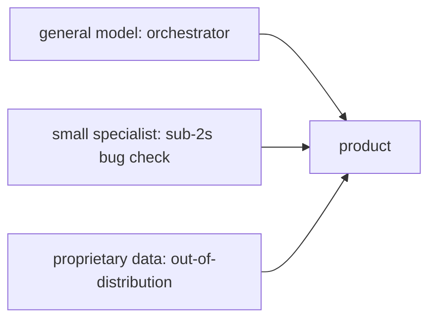

## The problem: geniuses that know nothing about your business

L03 ended with models that can reason, use tools, and
work as co-workers. Here is the gap the guest built his
company on. Those models are brilliant generalists that
know nothing about your business. Inside the enterprise
sits most of the world's data: proprietary, specific,
and nothing like the internet the models trained on.
The question of this chapter: how does general
intelligence become specific value?

The answer has three parts. First, **evals**: define
what good looks like. Second, **RL**: optimize against
it. Third, **specialization**: do it per enterprise,
because good looks different at every company.

## Evals set the roadmap

An **eval** is a benchmark: a fixed set of tasks with
right answers, used to score a model. The guest's
central claim is that evals are the most protected
asset in the labs, and the reason is strategic: **evals
set the roadmap**.

The mechanism is a loop the guest states as a slogan:
whatever hill you want to climb, first define it with
an eval; then RL is the eval-maxing machine. Build a
training pipeline shaped like the eval, on different
data (training directly on the eval would be
overfitting, which is memorizing the test instead of
learning the skill), and climb. Then pick the next
hill.

The worked example is code. **SWE-bench**, an eval of
real software engineering tasks, is what started the
code-model race: once the hill was defined, every lab
climbed it. The guest notes the named eval has flaws
and better ones followed, which is itself the point:
the eval is the steering wheel, so getting it right is
the highest-leverage work in the lab.

Figure L04-F1. The eval loop. Source: original diagram
for Stanford Frontier AI, drawn from the session.

```ascii
define the hill          climb the hill           next hill
+-----------------+      +-----------------+      +------------+
| eval: fixed     | ---> | RL training on  | ---> | new eval   |
| tasks + answers |      | similar tasks,  |      |            |
| (guarded asset) |      | different data  |      |            |
+-----------------+      +-----------------+      +------------+
RL is the eval-maxing machine. Do not train on the eval itself.
```

## Whose good: the tiered eval stack

Here the chapter turns enterprise. "Good" is not
universal. The guest's example: JPMorgan and Goldman
Sachs have different standards, different ways of
operating, different definitions of a correct output.
So evals stack in tiers.

```ascii
tier 1: lab evals         what the model labs optimize toward
tier 2: enterprise evals  what each company optimizes toward
```

Applied Compute lives at tier 2: the specialization
layer that takes frontier models and optimizes them
against one enterprise's evals. The general model sets
the floor. Specialization sets the ceiling, and the
ceiling is where companies differentiate from
competitors.

## The 5 percent number

The host asks the budget question directly: out of
$100 of training spend, how much is pre-training and
how much is post-training? The guest came with
numbers.

**DeepSeek V3** pre-training: about 2.4 to 2.5 million
H800 GPU-hours. The RL training that produced
**DeepSeek R1**: about 150,000 GPU-hours. Divide:
150,000 / 2,500,000 = 0.06, about **5 to 6 percent**.
The guest rounds to 5 percent.

Two readings of that number, both in the session.
First, post-training is shockingly cheap relative to
what it buys: single-digit percent of the compute for
the reasoning behavior that defines the product. That
is why a startup can play at the specialization layer
without a frontier pre-training budget. Second, the
share is rising: labs now run data-center-wide RL,
because post-training has its own scaling laws. Bigger
batches, more reasoning per attempt, better
performance. The 5 percent is a snapshot of a growing
share.

Figure L04-F2. The training budget split. Source:
original diagram for Stanford Frontier AI, numbers
from the session.

```ascii
$100 of training spend (DeepSeek V3 / R1, guest's numbers)

pre-training   $95  | 2.4-2.5M H800-hours | builds the representations
post-training  $5   | ~150k GPU-hours      | buys the reasoning
                    trend: the $5 share is growing (data-center-wide RL)
```

## The DoorDash worked example

The chapter's central case study makes specialization
concrete. **DoorDash** onboards more than 100,000
merchants a year. Each merchant supplies unstructured
material, including menu images. Turning those images
into a DoorDash storefront is genuinely hard: the
company has a precise style guide for how modifiers
attach to items, what counts as an add-on versus a
special ingredient, what can mix and match.

General models failed at this, even with prompting.
The fix was the eval loop from this chapter's opening.
Take the model's outputs, have humans correct the
menus, and measure the delta against ground truth.
That delta is a reward signal: the error rate. Then
optimize directly against reducing the error rate. No
prompt engineering. Just define good and bad, and let
RL climb.

Three details matter. First, the model is a **VLM**, a
vision-language model: a transformer that reads images
and text together. Second, the guest's answer to "why
not wait for GPT-17": enterprises care about the
frontier **today**, and the ROI on training now, with
an order of magnitude less compute than pre-training,
beats waiting years for a general model that still
will not know your style guide. Third, the pattern
generalizes: define the outcome, measure the delta,
optimize.

## The Pareto frontier: small, fast, specialized

The second case study is **Cognition / Windsurf**.
Imagine saving a file and, in under two seconds, a
model tells you whether you just wrote a bug. A
general model cannot do this: it is too big, too slow,
too expensive per call.

The guest's frame is the **Pareto frontier** of
performance, cost, and latency. Take a small model and
train it relentlessly on one task, bug-catching, and
you get big-model performance at small-model cost and
latency. The frontier is not one model. It is an
**ensemble**: general models as orchestrators, fast
specialized models as sub-agents, proprietary data
filling the gaps the general models never saw.

**Ramp Labs** gets a mention on the same pattern: an
RL-trained model for fast search inside spreadsheets,
improving the product experience directly.

Figure L04-F3. The ensemble pattern. Source: original
diagram for Stanford Frontier AI, drawn from the
session.



## Continual learning: the hot stove

L03 named continual learning as the next bottleneck.
Here the guest shows its early shape. **Continual
learning** means a deployed model that improves from
real-world use: understand how the system is used, see
the downstream consequences of its actions, and update
from that.

The worked example is **Cursor's Composer**: Cursor's
own coding model, trained on an open-source base plus
Cursor's coding data. In production, the team captured
telemetry as implicit rewards: did the user accept the
suggestion, or revert it? Then online training: collect
data, take a training step, repeat. The guest's scale
notes: hours per step, each step covering a huge
batch, days to weeks of investment to see improvement.
Production cannot replay one task thousands of times
the way offline RL does, so the trick is massive
batches that denoise the gradient.

The guest's own version is **context bases**: use
agents and offline compute to analyze documents and
past human-agent traces, extract the learnings, and
improve downstream performance at the same token
budget. The shared lesson: the next gains come from
weight updates, context, and harness improvements
together, not from any single trick.

## The data market: why the guest is cautious

The host asks for a long and a short. Long: compute
and chips, especially Nvidia, with one risk (more
below). Short, or at least cautious: the **data
market** as currently constituted.

The mechanism is a squeeze. An RL data vendor sells a
customer a task the model cannot do yet. Training
succeeds. The model gets smarter. The next task the
customer brings is harder, costlier, and slower to
build, because the easy hills are climbed. The vendor
is paid to obsolete its own product line.

The escape valve is **synthetic data** via the
**generator-verifier gap**: for code, hold out the unit
tests, let the model attempt the task, and check the
output automatically. No human needed. The smarter
models get, the better these pipelines run. The
guest's advice to data founders: keep pivoting to the
next wave. Robotics data. Egocentric video. Whatever
the models cannot yet generate for themselves.

The Nvidia long carries the mirror risk. Nvidia takes
roughly **75 percent margins** on its chips while labs
spend hundreds of billions. At some point a lab may
decide to spend a couple hundred billion on its own
silicon: 80 percent as effective per chip, but far more
chips. The guest stays long Nvidia, but names the
in-house risk plainly.

## Mapping back: from general to specific

| Enterprise puzzle | This chapter's answer |
|---|---|
| How do you steer a model? | Define the hill with an eval, then let RL maximize it. Evals are the guarded asset because they are the roadmap. |
| Why is post-training cheap? | DeepSeek: ~150k GPU-hours of RL versus 2.4-2.5M for pre-training, about 5%. The share is growing as RL scales. |
| Why specialize per company? | Good differs by company (JPMorgan versus Goldman). General models set the floor; specialization sets the ceiling. |
| How did DoorDash do it? | Human-corrected menus defined the error rate; RL minimized it directly. No prompting. A VLM, a style guide, a delta. |
| What breaks the data vendors? | Success: smarter models need harder tasks, which cost more to build. Synthetic data via the generator-verifier gap is the way out. |

## The honest price: the squeeze is structural

The chapter's price is the data-market squeeze, and it
applies beyond vendors. Every enterprise that builds
its evals and climbs its hills makes the general
models stronger, which raises the bar for the next
hill. Specialization is a treadmill: the floor rises
under you. The defense is the one the guest gives for
DoorDash: the ceiling is proprietary. Your style
guide, your telemetry, your traces. Nobody else's
general model will ever know them first.

> [!QA]
> Q: What is an eval, and why do labs guard them?
> A: An eval is a fixed benchmark of tasks with right answers that scores a model. Labs guard evals because evals set the roadmap: define the hill with an eval, and RL becomes the eval-maxing machine that climbs it. SWE-bench started the entire code-model race this way. Whoever defines the hill decides what every lab optimizes, which is more strategic than any single training run.
> Follow-up: Why not just train on the eval directly?
> A: That is overfitting: memorizing the test instead of learning the skill. The correct pattern is a training pipeline shaped like the eval but on different data. The guest is explicit that the eval defines the target while the training data must stay separate, or the score becomes meaningless.

> [!QA]
> Q: Explain the 5 percent number and why it matters.
> A: DeepSeek V3's pre-training took about 2.4 to 2.5 million H800 GPU-hours. The RL stage behind R1 took about 150,000. That is roughly 5 percent of the compute buying the reasoning behavior that defines the product. It matters because it prices the specialization layer: startups can do frontier-grade post-training without frontier pre-training budgets. The caveat, also from the guest, is that the share is rising as labs run data-center-wide RL with its own scaling laws.
> Follow-up: If RL is so cheap, why does pre-training still cost billions?
> A: Because RL steers representations it did not build. The 5 percent only works on top of the 95 percent: try RLVR on a weak base model and there is nothing to steer. Pre-training is the fixed cost of the floor; post-training is the variable cost of the ceiling. Both matter, and they are bought by different players.

> [!QA]
> Q: How did Applied Compute solve DoorDash's menu problem?
> A: DoorDash onboards over 100,000 merchants a year, each with unstructured menu images, and a strict style guide for modifiers and add-ons. General models failed even with prompting. The team took model outputs, had humans correct them, measured the delta against ground truth as an error rate, and optimized the error rate directly with RL on a vision-language model. Define good and bad, measure the gap, climb. No prompt engineering.
> Follow-up: Why not wait for the next general model to handle it?
> A: Two reasons from the guest. First, enterprises want the frontier now, not in years. Second, no general model will ever know DoorDash's proprietary style guide out of the box; the ceiling is company-specific by construction. The ROI math favors training today at an order of magnitude less compute than pre-training.

> [!QA]
> Q: What is the Pareto frontier argument for small specialized models?
> A: Performance, cost, and latency trade against each other, and a general model cannot be optimal on all three for every task. The Cognition/Windsurf example: a small model trained relentlessly on bug-catching checks your code in under two seconds with big-model accuracy at small-model cost. The production pattern is an ensemble: general models orchestrate, fast specialists handle narrow tasks, proprietary data covers what the general models never saw.
> Follow-up: What is continual learning, and what blocks it?
> A: A deployed model that improves from real-world use, learning from sparse rewards the way you learn a hot stove in one touch. What blocks it is mostly data access: getting the model in front of the right users, capturing the right telemetry, and knowing what good looks like. Cursor's Composer shows the early shape: accept/revert signals as implicit rewards, massive batches to denoise the gradient, hours per training step.

## Recap: the whole lesson on one screen

1. **The gap.** Frontier models are geniuses that know
   nothing about your business. Most of the world's
   data is proprietary and enterprise-held.
2. **Evals.** Define the hill first. RL is the
   eval-maxing machine. SWE-bench started the code
   race. Guard the eval; it is the roadmap.
3. **Tiers.** Lab evals steer the base models.
   Enterprise evals steer specialization. JPMorgan's
   good is not Goldman's.
4. **The 5 percent.** DeepSeek: ~150k GPU-hours of RL
   on ~2.5M of pre-training. Post-training is cheap
   and its share is growing.
5. **DoorDash.** 100k+ merchants a year, strict style
   guide. Human corrections defined the error rate;
   RL minimized it. A VLM, a delta, no prompting.
6. **The Pareto frontier.** Small models, trained
   hard on one task, beat general models on cost and
   latency. Ensemble: orchestrator plus specialists.
7. **Continual learning.** Cursor's Composer learns
   from accept/revert telemetry, hours per step. The
   hot-stove problem is the next bottleneck.
8. **The squeeze.** Data vendors train themselves out
   of easy tasks. Synthetic data via the
   generator-verifier gap is the escape. Next: what
   this does to software itself.

## Official sources and further reading

**Official:**
- Enterprise Internal Knowledge (MS&E 435, Spring
  2026), guest Yash Patil, Applied Compute:
  https://www.youtube.com/watch?v=LRGX-gTegVA
- MS&E 435 course site: https://mse435.stanford.edu/

**Further reading:**
- Karpathy's write-up on RLVR, in the course
  readings.
- Ali Ghodsi (Databricks), earlier in the course: most
  tokens beyond the data frontier will be AI-generated.

**Caveats from these sources.** The DeepSeek numbers
are the guest's ("I looked it up on the way here"),
not audited filings. "TreeBench" is the transcript's
rendering of the eval the guest calls flawed
[uncertain: exact name]. The Cursor training details
(hours per step, days to weeks) are the guest's
recollection. The 75 percent Nvidia margin figure is
the guest's estimate in this session (80 percent in
the Crusoe session); treat both as approximate.

## Connections to the other courses

- **MS&E435 L03:** the model history this chapter
  monetizes: pre-training, scaling laws, reasoning.
- **CS336:** the technical post-training stack: SFT,
  RLHF, and reward modeling from the inside.
- **CS329A / CS329Z:** agents in production: harnesses,
  tool use, and the orchestration layer the ensemble
  pattern assumes.
- **MS&E435 L05:** what the specialization layer does
  to the software business: when every company can
  build its own tools, what happens to SaaS?
