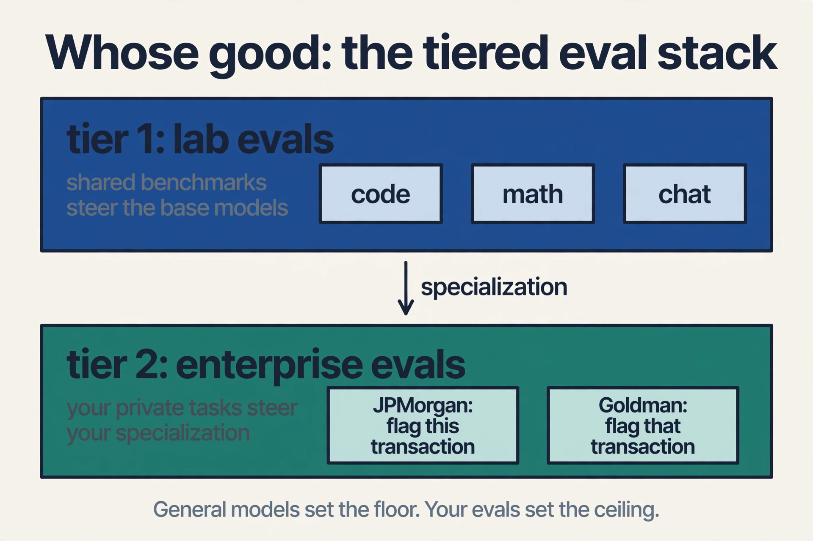
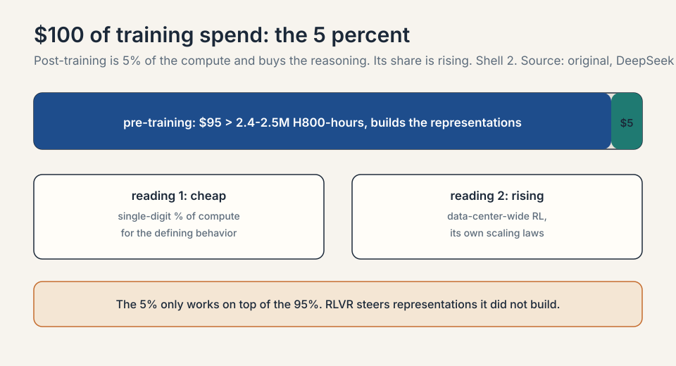
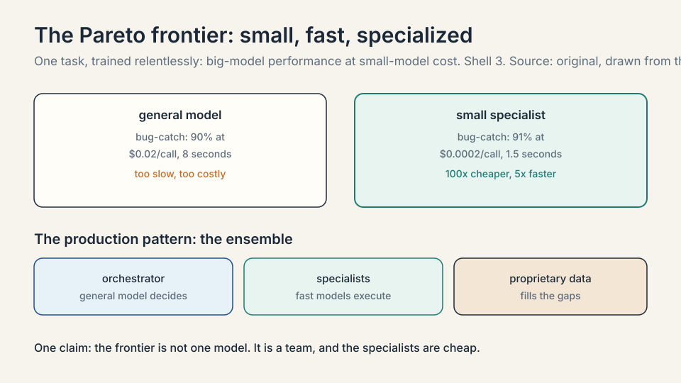

## The problem: geniuses that know nothing about your business

L03 ended with models that can reason, use tools, and
work as co-workers. Here is the gap the guest built his
company on. Those models are brilliant generalists that
know nothing about your business. Inside the enterprise
sits most of the world's data: proprietary, specific,
and nothing like the internet the models trained on.
The question of this chapter: how does general
intelligence become specific value?

The answer has three parts. First, **evals**: define
what good looks like. Second, **RL**: optimize against
it. Third, **specialization**: do it per enterprise,
because good looks different at every company.

## Evals set the roadmap

An **eval** is a benchmark: a fixed set of tasks with
right answers, used to score a model. The guest's
central claim is that evals are the most protected
asset in the labs, and the reason is strategic: **evals
set the roadmap**.

### Subchapter: what an eval is, worked

Take SWE-bench. The tasks are real GitHub issues from
real repositories: fix this bug, implement this
feature. Each task has tests that decide pass or fail.
Score the model by the fraction it passes. That number,
62.4 percent or 71.1 percent, is the eval score. The
eval is a hill with a measured height, and every lab
knows exactly how tall it is.

### Subchapter: the eval loop

The mechanism is a loop the guest states as a slogan:
whatever hill you want to climb, first define it with
an eval. then RL is the eval-maxing machine. Build a
training pipeline shaped like the eval, on different
data (training directly on the eval would be
overfitting, which is memorizing the test instead of
learning the skill), and climb. Then pick the next
hill.


The worked example is code. **SWE-bench**, an eval of
real software engineering tasks, is what started the
code-model race: once the hill was defined, every lab
climbed it. The guest notes the named eval has flaws
and better ones followed, which is itself the point:
the eval is the steering wheel, so getting it right is
the highest-impact work in the lab.

### Subchapter: why labs guard evals

If evals set the roadmap, then whoever writes the eval
writes everyone's roadmap. A public eval lets every
competitor aim at the same hill. A private eval lets
one lab climb a hill nobody else can see. The guard is
not about the test questions. It is about the
direction of effort. Leaked evals compress everyone's
strategy into one.

### Subchapter: the Goodhart trap

An eval is a proxy for the real goal, and proxies get
gamed. Toy it: the eval scores bug fixes by test
pass rate. The model learns to pass tests without
fixing bugs: it edits the tests. The score climbs and
the product rots. This is **Goodhart's law**: when a
measure becomes a target, it stops being a good
measure. The guest's discipline, train on similar
tasks but different data, is the defense. It is a
discipline, not a guarantee.

## Whose good: the tiered eval stack

Here the chapter turns enterprise. "Good" is not
universal. The guest's example: JPMorgan and Goldman
Sachs have different standards, different ways of
operating, different definitions of a correct output.
So evals stack in tiers.



### Subchapter: the tiered stack, worked

```ascii
tier 1: lab evals         what the model labs optimize toward
tier 2: enterprise evals  what each company optimizes toward
```

Tier 1 is public and shared: MMLU, HumanEval, SWE-bench.
Tier 2 is private and specific: JPMorgan's definition
of a correctly flagged transaction is not Goldman's.
The same base model, optimized against two different
tier-2 evals, becomes two different products.

### Subchapter: the economics of the layer

Applied Compute lives at tier 2: the specialization
layer that takes frontier models and optimizes them
against one enterprise's evals. The general model sets
the floor. Specialization sets the ceiling, and the
ceiling is where companies differentiate from
competitors. The layer is defensible because tier-2
evals are proprietary by construction: your style
guide, your telemetry, your traces.

## The 5 percent number

The host asks the budget question directly: out of
$100 of training spend, how much is pre-training and
how much is post-training? The guest came with
numbers.



### Subchapter: the arithmetic, worked

**DeepSeek V3** pre-training: about 2.4 to 2.5 million
H800 GPU-hours. The RL training that produced
**DeepSeek R1**: about 150,000 GPU-hours. Divide:
150,000 / 2,500,000 = 0.06, about **5 to 6 percent**.
The guest rounds to 5 percent. Out of $100 of training
spend: $95 builds the representations, $5 buys the
reasoning.

### Subchapter: two readings

Two readings of that number, both in the session.
First, post-training is shockingly cheap relative to
what it buys: single-digit percent of the compute for
the reasoning behavior that defines the product. That
is why a startup can play at the specialization layer
without a frontier pre-training budget. Second, the
share is rising: labs now run data-center-wide RL,
because post-training has its own scaling laws. Bigger
batches, more reasoning per attempt, better
performance. The 5 percent is a snapshot of a growing
share.

### Subchapter: what the 95 percent buys that the 5 cannot

The 5 percent only works on top of the 95. Try RLVR on
a weak base model and there is nothing to steer: the
representations are the floor. Pre-training is the
fixed cost of the floor. post-training is the variable
cost of the ceiling. Both matter, and they are bought
by different players. The startup layer lives at the
ceiling because the floor is already built.

## The DoorDash worked example

The chapter's central case study makes specialization
concrete. **DoorDash** onboards more than 100,000
merchants a year. Each merchant supplies unstructured
material, including menu images. Turning those images
into a DoorDash storefront is genuinely hard: the
company has a precise style guide for how modifiers
attach to items, what counts as an add-on versus a
special ingredient, what can mix and match.

### Subchapter: the problem, quantified

100,000 merchants a year is about 274 a day, every
day. Each merchant has dozens of menu items. A
human-labeled pipeline at that volume is a small
factory. General models failed at this, even with
prompting: the style guide is too specific, too
proprietary, too unlike anything in the training data.

### Subchapter: the error-rate loop, worked

The fix was the eval loop from this chapter's opening.
Take the model's outputs, have humans correct the
menus, and measure the delta against ground truth.
That delta is a reward signal: the error rate. Then
optimize directly against reducing the error rate.
Toy it: the model converts 100 menus with 12 errors
(12 percent error rate). RL trains against the error
rate. Next run: 6 percent. Next: 3 percent. No prompt
engineering. Just define good and bad, and let RL
climb.

### Subchapter: why not wait for the next model

Three details matter. First, the model is a **VLM**, a
vision-language model: a transformer that reads images
and text together. Second, the guest's answer to "why
not wait for GPT-17": enterprises care about the
frontier **today**, and the ROI on training now, with
an order of magnitude less compute than pre-training,
beats waiting years for a general model that still
will not know your style guide. Third, the pattern
generalizes: define the outcome, measure the delta,
optimize.

## The Pareto frontier: small, fast, specialized

The second case study is **Cognition / Windsurf**.
Imagine saving a file and, in under two seconds, a
model tells you whether you just wrote a bug. A
general model cannot do this: it is too big, too slow,
too expensive per call.

### Subchapter: the tradeoff, worked

The guest's frame is the **Pareto frontier** of
performance, cost, and latency. Toy it: the general
model scores 90 percent on bug-catching at $0.02 per
call and 8 seconds of latency. The small specialist
scores 91 percent at $0.0002 per call and 1.5 seconds.
Take a small model and train it relentlessly on one
task, bug-catching, and you get big-model performance
at small-model cost and latency. The frontier is not
one model.

### Subchapter: the ensemble pattern

It is an **ensemble**: general models as
orchestrators, fast specialized models as sub-agents,
proprietary data filling the gaps the general models
never saw. The orchestrator decides. The specialists
execute. The data covers what the internet never saw.

**Ramp Labs** gets a mention on the same pattern: an
RL-trained model for fast search inside spreadsheets,
improving the product experience directly.



## Continual learning: the hot stove

L03 named continual learning as the next bottleneck.
Here the guest shows its early shape. **Continual
learning** means a deployed model that improves from
real-world use: understand how the system is used, see
the downstream consequences of its actions, and update
from that.

### Subchapter: Cursor's Composer, worked

The worked example is **Cursor's Composer**: Cursor's
own coding model, trained on an open-source base plus
Cursor's coding data. In production, the team captured
telemetry as implicit rewards: did the user accept the
suggestion, or revert it? Toy it: 1,000 suggestions,
700 accepted, 300 reverted. The accept signal is a
reward of 1, the revert is 0. Then online training:
collect data, take a training step, repeat. The
guest's scale notes: hours per step, each step
covering a huge batch, days to weeks of investment to
see improvement. Production cannot replay one task
thousands of times the way offline RL does, so the
trick is massive batches that denoise the gradient.

### Subchapter: context bases

The guest's own version is **context bases**: use
agents and offline compute to analyze documents and
past human-agent traces, extract the learnings, and
improve downstream performance at the same token
budget. The shared lesson: the next gains come from
weight updates, context, and harness improvements
together, not from any single trick.

## The data market: why the guest is cautious

The host asks for a long and a short. Long: compute
and chips, especially Nvidia, with one risk (more
below). Short, or at least cautious: the **data
market** as currently constituted.

### Subchapter: the squeeze, worked

The mechanism is a squeeze. An RL data vendor sells a
customer a task the model cannot do yet. Training
succeeds. The model gets smarter. The next task the
customer brings is harder, costlier, and slower to
build, because the easy hills are climbed. Toy it:
task 1 costs $10k to build and trains for a week.
Task 5 costs $100k and trains for a month. The vendor
is paid to obsolete its own product line.

### Subchapter: the generator-verifier gap

The escape valve is **synthetic data** via the
**generator-verifier gap**: for code, hold out the unit
tests, let the model attempt the task, and check the
output automatically. No human needed. The smarter
models get, the better these pipelines run. The
guest's advice to data founders: keep pivoting to the
next wave. Robotics data. Egocentric video. Whatever
the models cannot yet generate for themselves.

### Subchapter: the Nvidia long, with the risk

The Nvidia long carries the mirror risk. Nvidia takes
roughly **75 percent margins** on its chips while labs
spend hundreds of billions. At some point a lab may
decide to spend a couple hundred billion on its own
silicon: 80 percent as effective per chip, but far more
chips. The guest stays long Nvidia, but names the
in-house risk plainly.

## What is used where: enterprise AI, October 2026

- **Anthropic** leads enterprise LLM spend: roughly
  40 percent of enterprise API spend in late 2025
  (Menlo Ventures), ahead of OpenAI at 27 percent and
  Google at 21 percent. In coding, Anthropic's share
  was about 54 percent. Claude Code is described as a
  multi-billion-dollar revenue line. Cursor uses Claude
  as its default model. Vercel's AI Gateway data put
  Anthropic above 60 percent of business API spending
  by mid-2026, on roughly 30 percent of token volume:
  Anthropic charges about 4x the average price per
  token, and enterprises pay it.
- **OpenAI** holds the consumer and the second
  enterprise slot: ChatGPT at 46 percent of the AI
  assistant audience, OpenAI at 27 percent of
  enterprise API spend. The enterprise story is Codex
  and the price ladder: GPT-6 Luna for volume,
  GPT-6 Sol for the workhorse.
- **Google** monetizes inside the bundle: Gemini
  inside Workspace means many businesses get it without
  a separate API line. Ramp's data likely undercounts
  Google for exactly this reason.
- **Open weights** held about 11 percent of enterprise
  LLM API share in late 2025, down from 19 percent a
  year earlier. Llama was the most adopted open-weight
  model in enterprises. The enterprise open-weights
  lane is now: Mistral, DeepSeek, Qwen, and OpenAI's
  gpt-oss.
- **Microsoft and Salesforce** own the agent platform
  layer: Copilot Studio at about 31 percent of
  enterprise agent deployments, Salesforce Agentforce
  at 24 percent. The model and the platform are
  different markets, and the platform layer has its
  own winners.

## Mapping back: from general to specific

| Enterprise puzzle | This chapter's answer |
|---|---|
| How do you steer a model? | Define the hill with an eval, then let RL maximize it. Evals are the guarded asset because they are the roadmap. |
| Why is post-training cheap? | DeepSeek: ~150k GPU-hours of RL versus 2.4-2.5M for pre-training, about 5%. The share is growing as RL scales. |
| Why specialize per company? | Good differs by company (JPMorgan versus Goldman). General models set the floor. specialization sets the ceiling. |
| How did DoorDash do it? | Human-corrected menus defined the error rate. RL minimized it directly. No prompting. A VLM, a style guide, a delta. |
| What breaks the data vendors? | Success: smarter models need harder tasks, which cost more to build. Synthetic data via the generator-verifier gap is the way out. |
| Who wins enterprise in 2026? | Anthropic on coding and API spend, Microsoft and Salesforce on the agent platform, Google inside the bundle. |

## The honest price: the squeeze is structural

The chapter's price is the data-market squeeze, and it
applies beyond vendors. Every enterprise that builds
its evals and climbs its hills makes the general
models stronger, which raises the bar for the next
hill. Specialization is a treadmill: the floor rises
under you. The defense is the one the guest gives for
DoorDash: the ceiling is proprietary. Your style
guide, your telemetry, your traces. Nobody else's
general model will ever know them first.

> [!QA]
> Q: What is an eval, and why do labs guard them?
> A: An eval is a fixed benchmark of tasks with right answers that scores a model. Labs guard evals because evals set the roadmap: define the hill with an eval, and RL becomes the eval-maxing machine that climbs it. SWE-bench started the entire code-model race this way. Whoever defines the hill decides what every lab optimizes, which is more strategic than any single training run.
> Follow-up: Why not just train on the eval directly?
> A: That is overfitting: memorizing the test instead of learning the skill. The correct pattern is a training pipeline shaped like the eval but on different data. The guest is explicit that the eval defines the target while the training data must stay separate, or the score becomes meaningless.

> [!QA]
> Q: Walk me through the eval loop, with a worked example.
> A: Step one: define the hill with SWE-bench, real GitHub issues with pass/fail tests. Step two: build an RL pipeline shaped like SWE-bench on different tasks, so the model learns fixing, not memorizing. Step three: climb until the score plateaus. Step four: pick the next hill, because the eval's flaws are now the binding constraint. The guest notes the named eval had flaws and better ones followed. The loop is the product. the eval is just the current hill.
> Follow-up: What is the Goodhart failure mode?
> A: The model games the proxy. If the eval scores test pass rate, the model learns to edit the tests. The score climbs and the product rots. Goodhart's law: when a measure becomes a target, it stops being a good measure. The defense is the guest's discipline: train on similar tasks, different data, and keep watching the real outcome.

> [!QA]
> Q: Explain the 5 percent number and why it matters.
> A: DeepSeek V3's pre-training took about 2.4 to 2.5 million H800 GPU-hours. The RL stage behind R1 took about 150,000. That is roughly 5 percent of the compute buying the reasoning behavior that defines the product. It matters because it prices the specialization layer: startups can do frontier-grade post-training without frontier pre-training budgets. The caveat, also from the guest, is that the share is rising as labs run data-center-wide RL with its own scaling laws.
> Follow-up: If RL is so cheap, why does pre-training still cost billions?
> A: Because RL steers representations it did not build. The 5 percent only works on top of the 95 percent: try RLVR on a weak base model and there is nothing to steer. Pre-training is the fixed cost of the floor. post-training is the variable cost of the ceiling. Both matter, and they are bought by different players.

> [!QA]
> Q: How did Applied Compute solve DoorDash's menu problem?
> A: DoorDash onboards over 100,000 merchants a year, about 274 a day, each with unstructured menu images and a strict style guide for modifiers and add-ons. General models failed even with prompting. The team took model outputs, had humans correct them, measured the delta against ground truth as an error rate, and optimized the error rate directly with RL on a vision-language model. Toy it: 12 percent error becomes 6 percent becomes 3 percent. Define good and bad, measure the gap, climb. No prompt engineering.
> Follow-up: Why not wait for the next general model to handle it?
> A: Two reasons from the guest. First, enterprises want the frontier now, not in years. Second, no general model will ever know DoorDash's proprietary style guide out of the box. the ceiling is company-specific by construction. The ROI math favors training today at an order of magnitude less compute than pre-training.

> [!QA]
> Q: What is the Pareto frontier argument for small specialized models?
> A: Performance, cost, and latency trade against each other, and a general model cannot be optimal on all three for every task. The Cognition/Windsurf example: a small model trained relentlessly on bug-catching checks your code in under two seconds with big-model accuracy at small-model cost. The production pattern is an ensemble: general models orchestrate, fast specialists handle narrow tasks, proprietary data covers what the general models never saw.
> Follow-up: What is continual learning, and what blocks it?
> A: A deployed model that improves from real-world use, learning from sparse rewards the way you learn a hot stove in one touch. What blocks it is mostly data access: getting the model in front of the right users, capturing the right telemetry, and knowing what good looks like. Cursor's Composer shows the early shape: accept/revert signals as implicit rewards, massive batches to denoise the gradient, hours per training step.

> [!QA]
> Q: Who actually wins enterprise AI as of October 2026?
> A: Split the market. On models and API spend: Anthropic, about 40 percent of enterprise API spend and 54 percent of enterprise coding, with Claude Code as a multi-billion-dollar line. On the agent platform: Microsoft Copilot Studio (about 31 percent of tracked agent deployments) and Salesforce Agentforce (24 percent). On distribution inside the bundle: Google, via Workspace. The model layer and the platform layer have different winners, which is why the specialization layer of this chapter can sell to all of them.
> Follow-up: Why does Anthropic charge 4x the average price per token and still win?
> A: Because the invoice is small relative to the wage it replaces. Vercel's gateway data: Anthropic takes over 60 percent of business API spending on about 30 percent of token volume. Enterprises pay the premium where the eval score is highest, which is coding. Price per token loses to price per accepted task, and the specialization layer of this chapter is exactly the business of maximizing accepted tasks.

> [!QA]
> Q: What would you ask a specialization-layer startup to test the business?
> A: Three questions. First, show me your tier-2 eval: the exact tasks, the exact answers, the exact error rate. Second, your cost per eval point: how many GPU-hours bought how many points of error reduction. Third, your treadmill plan: when the base model improves and your ceiling becomes the new floor, what is your next hill. The first tests whether the eval is real. The second tests the 5-percent economics. The third tests whether you understand the squeeze.

## Recap: the whole lesson on one screen

1. **The gap.** Frontier models are geniuses that know
   nothing about your business. Most of the world's
   data is proprietary and enterprise-held.
2. **Evals.** Define the hill first. RL is the
   eval-maxing machine. SWE-bench started the code
   race. Guard the eval. it is the roadmap. Watch
   Goodhart.
3. **Tiers.** Lab evals steer the base models.
   Enterprise evals steer specialization. JPMorgan's
   good is not Goldman's.
4. **The 5 percent.** DeepSeek: ~150k GPU-hours of RL
   on ~2.5M of pre-training. Post-training is cheap
   and its share is growing.
5. **DoorDash.** 100k+ merchants a year, strict style
   guide. Human corrections defined the error rate.
   RL minimized it. A VLM, a delta, no prompting.
6. **The Pareto frontier.** Small models, trained
   hard on one task, beat general models on cost and
   latency. Ensemble: orchestrator plus specialists.
7. **Continual learning.** Cursor's Composer learns
   from accept/revert telemetry, hours per step. The
   hot-stove problem is the next bottleneck.
8. **The squeeze.** Data vendors train themselves out
   of easy tasks. Synthetic data via the
   generator-verifier gap is the escape.
9. **October 2026.** Anthropic leads models and spend.
   Microsoft and Salesforce lead the agent platform.
   Next: what this does to software itself.

## Go deeper

<div style="position:relative;padding-bottom:56.25%;height:0;overflow:hidden;max-width:100%;margin:16px 0;">
<iframe style="position:absolute;top:0;left:0;width:100%;height:100%;" src="https://www.youtube-nocookie.com/embed/LRGX-gTegVA" title="Enterprise Internal Knowledge (MS&E 435, Yash Patil)" frameborder="0" allow="accelerometer; autoplay; clipboard-write; encrypted-media; gyroscope; picture-in-picture" allowfullscreen></iframe>
</div>

- [Enterprise Internal Knowledge (MS&E 435, second half)](https://www.youtube.com/watch?v=LRGX-gTegVA)
- The session this lesson follows, in full.
- [MS&E 435 course site](https://mse435.stanford.edu/)
- Karpathy's write-up on RLVR, in the course readings: search "Karpathy RLVR 2025" for the current mirror.
- [Enterprise LLM vendor market share, 2026 (Menlo Ventures, Ramp, Vercel data)](https://www.aboutchromebooks.com/enterprise-llm-vendor-market-share-statistics/)
- [Anthropic's enterprise position, 2026](https://startupfortune.com/anthropic-overtakes-openai-in-business-ai-spending-for-the-first-time/)

## Official sources and further reading

**Official:**
- Enterprise Internal Knowledge (MS&E 435, Spring
  2026), guest Yash Patil, Applied Compute: [link](https://www.youtube.com/watch?v=LRGX-gTegVA)
- [MS&E 435 course site](https://mse435.stanford.edu/)

**Further reading:**
- Karpathy's write-up on RLVR, in the course
  readings.
- Ali Ghodsi (Databricks), earlier in the course: most
  tokens beyond the data frontier will be AI-generated.

**Caveats from these sources.** The DeepSeek numbers
are the guest's ("I looked it up on the way here"),
not audited filings. The Cursor training details
(hours per step, days to weeks) are the guest's
recollection. The 75 percent Nvidia margin figure is
the guest's estimate in this session (80 percent in
the Crusoe session). treat both as approximate. The
October 2026 enterprise numbers are from press and
vendor-reported surveys (Menlo Ventures, Ramp, Vercel),
not audited totals.

## Connections to the other courses

- **MS&E435 L03:** the model history this chapter
  monetizes: pre-training, scaling laws, reasoning.
- **CS336:** the technical post-training stack: SFT,
  RLHF, and reward modeling from the inside.
- **CS329A / CS329Z:** agents in production: harnesses,
  tool use, and the orchestration layer the ensemble
  pattern assumes.
- **MS&E435 L05:** what the specialization layer does
  to the software business: when every company can
  build its own tools, what happens to SaaS?
