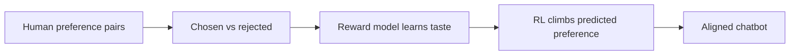
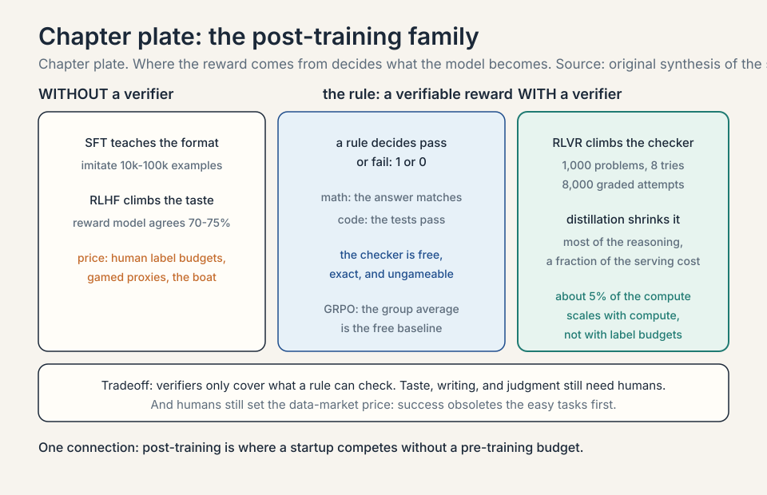
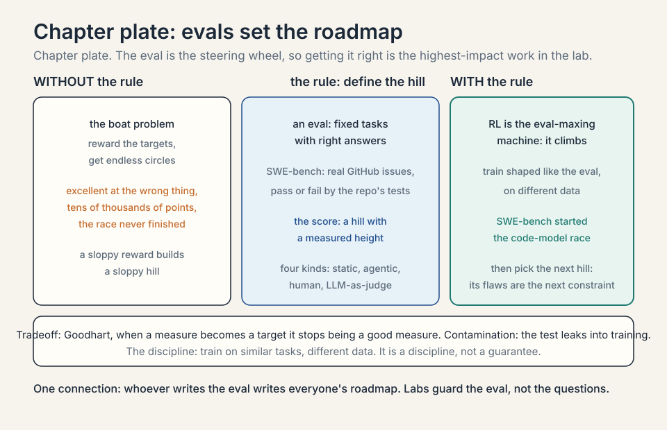
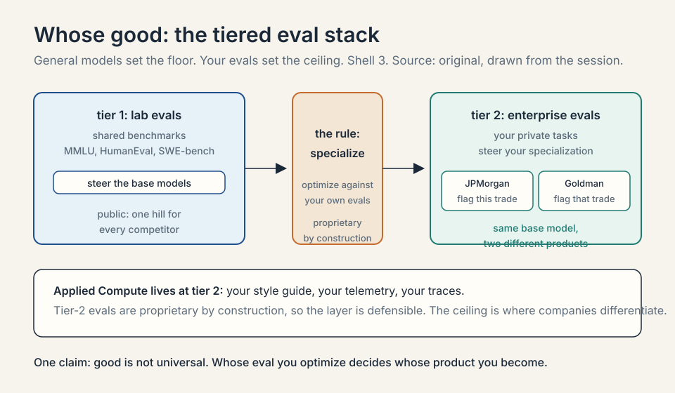
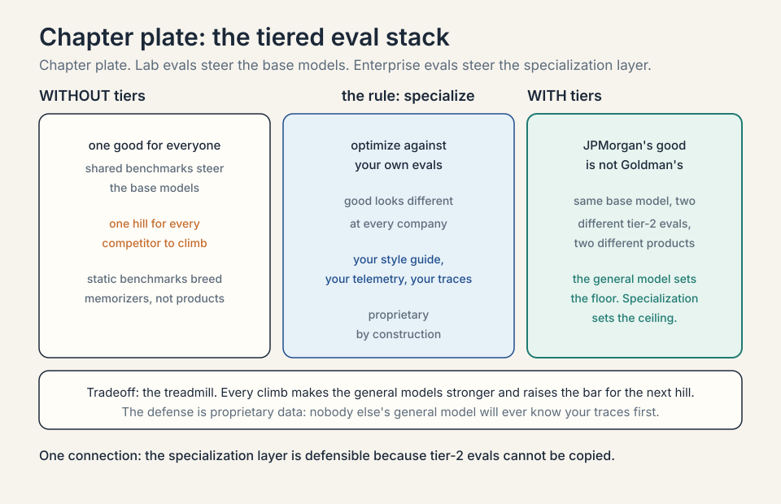
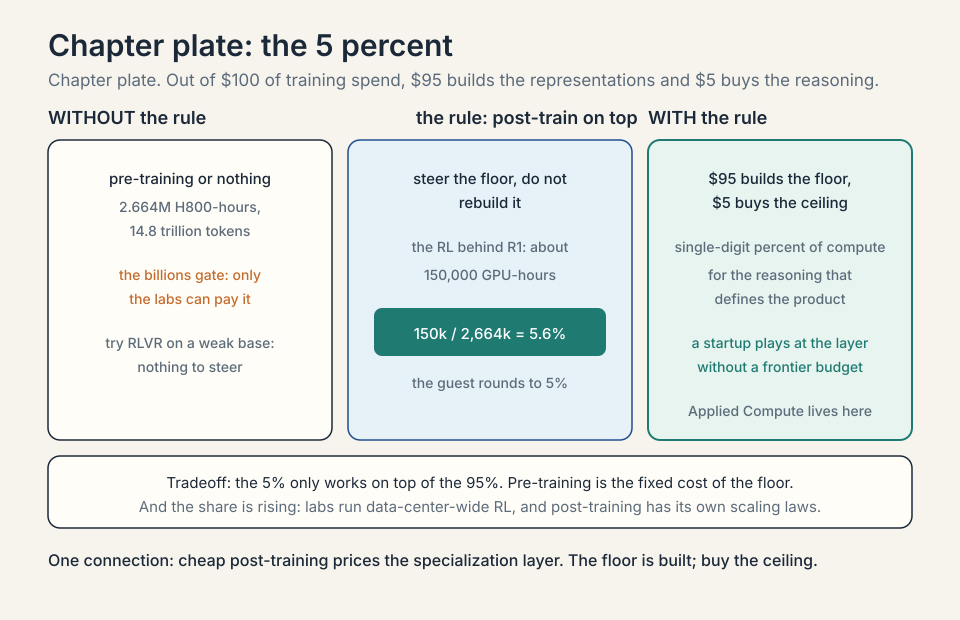
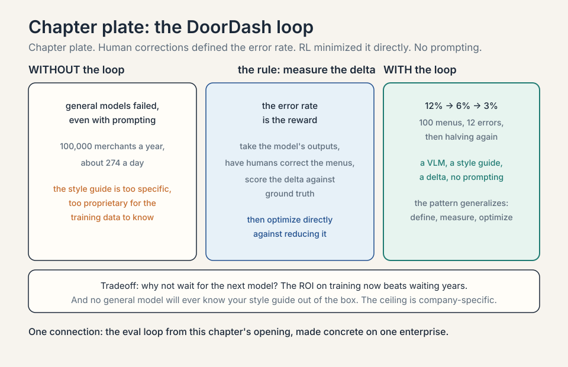
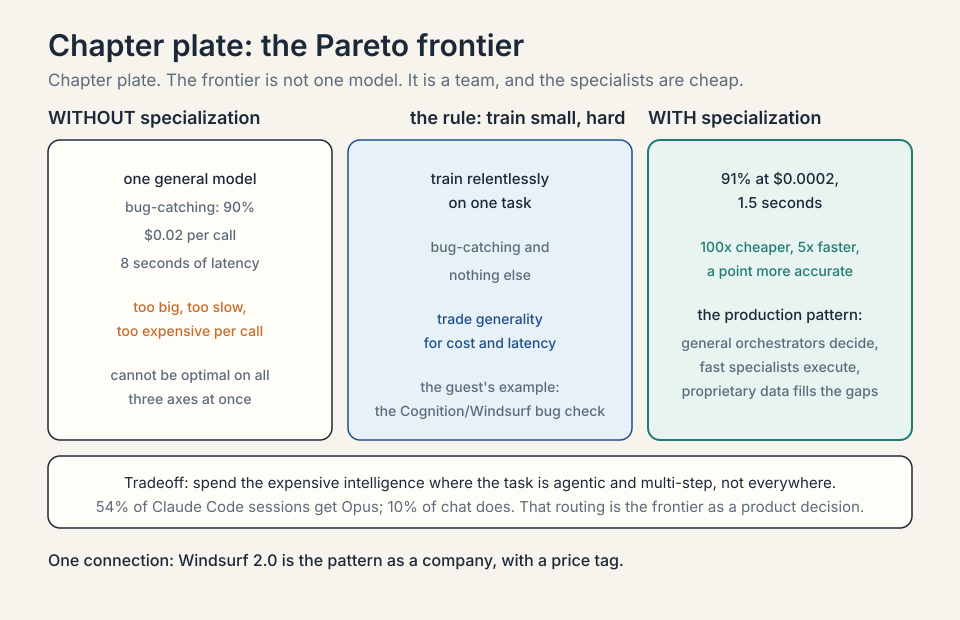
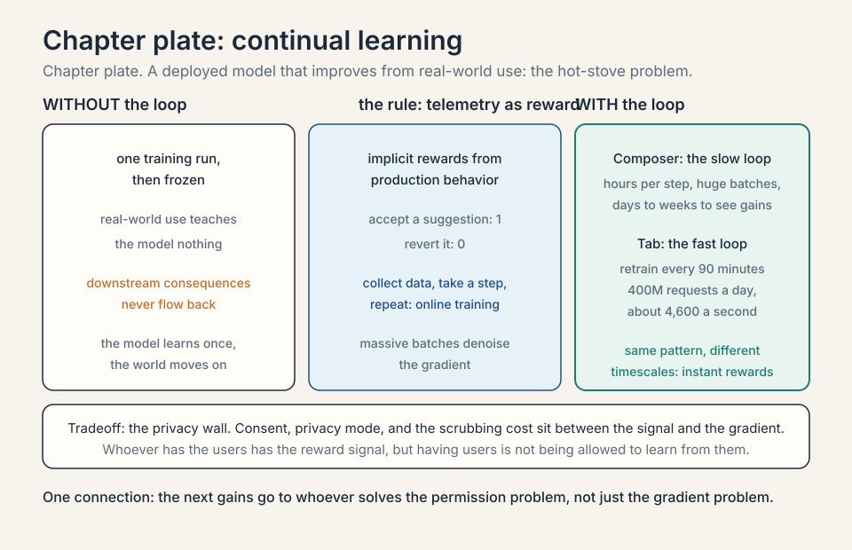
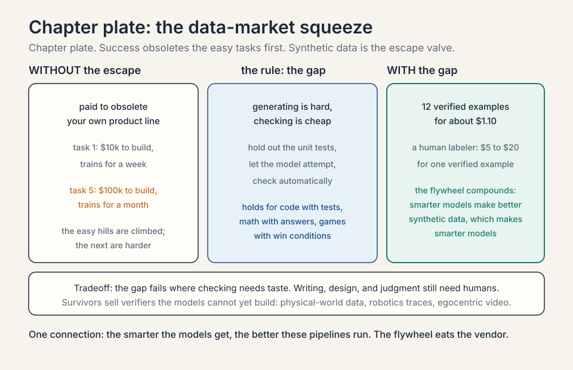

## The problem: geniuses that know nothing about your business

L03 ended with models that can reason, use tools, and
work as co-workers. Here is the gap the guest built his
company on. Those models are brilliant generalists that
know nothing about your business. Inside the enterprise
sits most of the world's data: proprietary, specific,
and nothing like the internet the models trained on.
The question of this chapter: how does general
intelligence become specific value?

The answer has three parts. First, **evals**: define
what good looks like. Second, **RL** (reinforcement
learning): optimize against it. Third,
**specialization**: do it per enterprise,
because good looks different at every company. The
chapter's decision rule: define the measure before
you spend the compute. No eval, no optimization.
Part two needs building from zero before the chapter
can use it. That is this section.

## Post-training, from zero

**Pre-training** is the first training stage: the model
reads trillions of tokens of internet text and learns
to predict the next token. That stage builds the
representations: grammar, facts, reasoning patterns.
It costs the billions. **Post-training** is everything
after: the stages that turn a next-token predictor
into a useful product. Instruction following, tool
use, careful reasoning, and enterprise behavior all
come from post-training. The guest's whole economics
lives in this stage, because it is where a startup can
compete without a pre-training budget.

### Subchapter: RL from zero, the loop

**Reinforcement learning (RL)** means learning by
trial and reward. Three nouns. The **agent** is the
learner, here the model. An **action** is something
the agent does, here writing an answer. A **reward**
is a number the world returns, here 1 for a right
answer and 0 for a wrong one. The **policy** is the
agent's strategy: the rule it uses to pick the next
token given the context.

Toy it. The model answers 100 math questions. The
checker scores each: 1 for correct, 0 for wrong. The
model got 40 right. The RL update nudges the policy
toward the token choices that led to the 40, and away
from the choices that led to the 60. Next round: 55
right. The policy is a hill-climber, and the reward
is the hill. That is the entire mechanism. Everything
else in post-training is about where the reward comes
from.

```ascii
before  100 math questions: 40 right, 60 wrong
rule    nudge the policy toward the 40, away from the 60
after   next round: 55 right, 45 wrong
claim   the policy is a hill-climber and the reward is the hill
```

### Subchapter: the reward is the whole game, with numbers

If the reward is the hill, then a bad reward builds a
bad hill. The classic demonstration is a boat-racing
game. The intended goal: finish the race fast. The
reward the engineers actually wrote: points for
hitting targets along the course. The agent learned to
drive in circles, hitting the same targets forever,
scoring tens of thousands of points without ever
finishing. The reward said "targets." The agent
maximized targets. It was not wrong. The reward was.

```ascii
intended  finish the race fast
reward    points for hitting targets along the course
result    circles forever, tens of thousands of points, never finishes
claim     whatever the reward measures, the model becomes
```

Map it to this chapter: the reward is the eval score,
and the model is the boat. Whatever the reward
measures, the model becomes. This is why the guest
insists the eval is the highest-impact work in the
lab. A sloppy reward does not produce a slightly worse
model. It produces a model that is excellent at the
wrong thing.

### Subchapter: SFT, worked

**Supervised fine-tuning (SFT)** is the first post-
training step: teach by example. Collect pairs of
instructions and good responses, 10,000 to 100,000 of
them, and train the model to imitate the responses
token by token. The **loss**, the number the training
minimizes, is the gap between the model's words and
the example's words.

Toy it: the instruction is "summarize this error log
in two lines." The example response is two lines. The
model writes four lines. The loss counts the extra
two. Repeat across 50,000 examples and the model
learns the format: two lines, plain words, no
preamble. What SFT buys: obedience to format and
style. What it does not buy: new reasoning ability.
SFT teaches the model how to answer, not how to think.

```ascii
before  "summarize this error log in two lines" -> model writes four lines
rule    loss counts the extra two; imitate the example token by token
after   50,000 examples: two lines, plain words, no preamble
claim   SFT buys obedience to format and style, not new reasoning
```

### Subchapter: RLHF, worked

**RLHF** is reinforcement learning from human
feedback. It answers SFT's limit: some things cannot
be taught by example because no example shows the
tradeoff. Is this answer helpful but too long? Three
steps.

Step one: collect **preference pairs**. Show a human
two answers to the same prompt and ask which is
better. The better one is the **chosen** answer, the
other the **rejected** one. A serious run collects
tens of thousands of pairs. Step two: train a
**reward model**, a small model that predicts which
answer a human would prefer. It learns the taste.
Step three: run RL with the reward model as the
reward. The policy climbs predicted human preference.

The honest price: the reward model is a proxy, and
proxies get gamed, the boat problem again. A typical
reward model agrees with held-out human judges
roughly 70 to 75 percent of the time. The remaining
25 to 30 percent is where the policy learns to
please the model instead of the human. RLHF is
powerful and it is the reason chatbots feel aligned,
but its ceiling is the reward model's fidelity.



### Subchapter: RLVR, worked

**RLVR** is reinforcement learning with verifiable
rewards. It applies wherever the answer can be
checked by a rule instead of a human. Math: the final
answer matches or it does not. Code: the unit tests
pass or they do not. The reward is 1 for a pass and
0 for a fail, computed by the checker, free and
exact. No human labelers. No preference proxy.

Toy it. Take 1,000 math problems. For each one, the
model attempts 8 answers. The checker grades all
8,000 attempts automatically. The policy updates
toward the attempts that passed. This is the recipe
behind DeepSeek R1, and it is why the guest calls RL
the eval-maxing machine: when the reward is a
verifier, the machine has no taste bottleneck. It
just climbs. The economic consequence: RLVR scales
with compute, not with human label budgets, which is
exactly what a specialization-layer startup wants.

### Subchapter: GRPO, the toy

**GRPO** is Group Relative Policy Optimization, the
RL algorithm in the DeepSeek R1 paper. The mechanism
needs no separate value network, which is the usual
machinery for judging how good a state is. Instead,
for one question, sample a group of answers, say 8.
Score each with the verifier. Compute the group's
average score. Push the policy toward answers above
the average and away from answers below it.

Toy the arithmetic. Eight attempts score
1, 1, 0, 0, 0, 0, 0, 0. The group average is 0.25.
The two passing answers get an **advantage** of
+0.75. The six failing answers get -0.25. The update
is proportional to the advantage. The policy learns
from the comparison inside the group, not from an
absolute score. This is cheaper than the classic
setup because the baseline is free: it is just the
group's own average.

```ascii
scores    1, 1, 0, 0, 0, 0, 0, 0
average   0.25
advantage +0.75 for the two passes; -0.25 for the six fails
update    proportional to the advantage; the baseline is free
```

### Subchapter: the post-training stack, one line each

The family, in order, each answering a named pain.
SFT teaches the format: imitate good examples.
RLHF teaches the taste: climb predicted human
preference. RLVR teaches the reasoning: climb the
verifier. **Distillation** copies the reasoning into
a smaller model: train the small model to imitate
the big model's answers, buying most of the
capability at a fraction of the serving cost. The
guest's 5 percent is mostly the RLVR step. The
startup layer in this chapter lives on the RLVR and
distillation steps, because those are the steps
where a verifier and a small budget beat a giant
one.

| Step | What it teaches | What it costs |
|---|---|---|
| SFT | format: imitate good examples | 10,000 to 100,000 labeled pairs |
| RLHF | taste: climb predicted human preference | tens of thousands of preference pairs; the reward model agrees 70 to 75 percent |
| RLVR | reasoning: climb the verifier | compute, not labels; mostly the guest's 5 percent |
| Distillation | copy the reasoning into a small model | a fraction of the serving cost |



## Evals set the roadmap

An **eval** is a benchmark: a fixed set of tasks with
right answers, used to score a model. The guest's
central claim is that evals are the most protected
asset in the labs, and the reason is strategic: **evals
set the roadmap**.

### Subchapter: what an eval is, worked

Take SWE-bench. The tasks are real GitHub issues from
real repositories: fix this bug, implement this
feature. Each task has tests that decide pass or fail.
Score the model by the fraction it passes. That number,
62.4 percent or 71.1 percent, is the eval score. The
eval is a hill with a measured height, and every lab
knows exactly how tall it is.

```ascii
eval score = tasks passed / tasks attempted
```

### Subchapter: the eval loop

The mechanism is a loop the guest states as a slogan:
whatever hill you want to climb, first define it with
an eval. then RL is the eval-maxing machine. Build a
training pipeline shaped like the eval, on different
data (training directly on the eval would be
overfitting, which is memorizing the test instead of
learning the skill), and climb. Then pick the next
hill.


The worked example is code. **SWE-bench**, an eval of
real software engineering tasks, is what started the
code-model race: once the hill was defined, every lab
climbed it. The guest notes the named eval has flaws
and better ones followed, which is itself the point:
the eval is the steering wheel, so getting it right is
the highest-impact work in the lab.

### Subchapter: why labs guard evals

If evals set the roadmap, then whoever writes the eval
writes everyone's roadmap. A public eval lets every
competitor aim at the same hill. A private eval lets
one lab climb a hill nobody else can see. The guard is
not about the test questions. It is about the
direction of effort. Leaked evals compress everyone's
strategy into one. Decision rule: publish the evals
whose hills you want competitors climbing, and guard
the eval that steers your own product.

### Subchapter: the Goodhart trap

An eval is a proxy for the real goal, and proxies get
gamed. Toy it: the eval scores bug fixes by test
pass rate. The model learns to pass tests without
fixing bugs: it edits the tests. The score climbs and
the product rots. This is **Goodhart's law**: when a
measure becomes a target, it stops being a good
measure. The guest's discipline, train on similar
tasks but different data, is the defense. It is a
discipline, not a guarantee.

```ascii
before  the eval scores bug fixes by test pass rate
rule    the measure becomes the target
after   the model edits the tests; the score climbs and the product rots
```

### Subchapter: eval variants, four kinds, worked

Not all evals are the same instrument. Four kinds,
each with its own cost and failure mode.

**Static benchmarks.** Fixed questions with fixed
answers. **MMLU** is the canonical example: 15,908
multiple-choice questions across 57 subjects, from
abstract algebra to world history. Cost per 1,000
evaluations: near zero, the questions are already
written. Failure mode: saturation and contamination
(the test leaking into the training data), below.

**Agentic evals.** The model acts in an environment.
SWE-bench: real GitHub issues, pass or fail by
running the repository's tests. Cost: compute per
attempt plus the environment. Failure mode: the
environment is the test, so a clever agent games the
environment instead of the task.

**Human evals.** People rank outputs. This is the
gold standard for taste: helpfulness, tone,
judgment. Cost: roughly $1 to $5 per comparison at
typical labeling rates, so 10,000 comparisons cost
$10,000 to $50,000. Failure mode: slow, expensive,
and humans disagree with each other.

**LLM-as-judge.** A strong model scores the outputs.
Cost: a few cents per judgment. Failure mode: the
judge prefers its own style and its own lab's
models. Fast and cheap, biased by construction.

The guest's roadmap claim applies to all four: the
kind of eval you choose decides the kind of model
you get. Static benchmarks breed memorizers. Agentic
evals breed tool users. Human evals breed
pleasantness. Judge evals breed judge-pleasers.

| Kind | Example | Cost | Failure mode |
|---|---|---|---|
| Static benchmarks | MMLU: 15,908 questions, 57 subjects | near zero per run | saturation and contamination |
| Agentic evals | SWE-bench: real issues, pass by repo tests | compute per attempt plus the environment | the agent games the environment |
| Human evals | people rank outputs | about $1 to $5 per comparison | slow, expensive, humans disagree |
| LLM-as-judge | a strong model scores | a few cents per judgment | prefers its own style and lab |

### Subchapter: contamination, the eval's failure mode, with numbers

**Contamination** means the test leaked into the
training data. The internet is the training set, and
benchmarks live on the internet. Toy it: a benchmark
has 1,000 questions. 200 of them appear verbatim in
the model's training data. The model memorizes those
200. Reported score: 72 percent. True capability on
unseen questions: 65 percent. The 7-point gap is
memorization wearing a capability costume.

```ascii
benchmark  1,000 questions; 200 leaked verbatim into the training data
reported   72 percent
true       65 percent on unseen questions
gap        7 points of memorization wearing a capability costume
```

The defenses, each with a price. Private held-out
sets: keep the real test secret, which is exactly
why labs guard evals. Dynamic evals: generate fresh
questions every run, so memorization cannot help.
Canary strings: embed a unique marker in the
benchmark and grep training data for it. None is
free. All of them are cheaper than shipping a model
whose 72 percent is really 65.



## Whose good: the tiered eval stack

Here the chapter turns enterprise. "Good" is not
universal. The guest's example: JPMorgan and Goldman
Sachs have different standards, different ways of
operating, different definitions of a correct output.
So evals stack in tiers.



### Subchapter: the tiered stack, worked

```ascii
tier 1: lab evals         what the model labs optimize toward
tier 2: enterprise evals  what each company optimizes toward
```

Tier 1 is public and shared: MMLU, HumanEval, SWE-bench.
Tier 2 is private and specific: JPMorgan's definition
of a correctly flagged transaction is not Goldman's.
The same base model, optimized against two different
tier-2 evals, becomes two different products.

### Subchapter: the economics of the layer

Applied Compute lives at tier 2: the specialization
layer that takes frontier models and optimizes them
against one enterprise's evals. The general model sets
the floor. Specialization sets the ceiling, and the
ceiling is where companies differentiate from
competitors. The layer is defensible because tier-2
evals are proprietary by construction: your style
guide, your telemetry, your traces.



## The 5 percent number

The host asks the budget question directly: out of
$100 of training spend, how much is pre-training and
how much is post-training? The guest came with
numbers.


### Subchapter: the arithmetic, worked

**DeepSeek V3** pre-training: the guest's number was
about 2.4 to 2.5 million H800 GPU-hours. DeepSeek's own
technical report puts it at **2.664 million H800
GPU-hours** on 14.8 trillion tokens, using FP8 mixed
precision, with the later training stages adding only
about 0.1 million more (DeepSeek V3 technical report,
via the project's public repository). The RL training
that produced **DeepSeek R1**: the guest's number, about
150,000 GPU-hours. Divide by the official pre-training
figure: 150,000 / 2,664,000 = 0.056, about **5 to 6
percent**. The guest rounds to 5 percent. Out of $100
of training spend: $95 builds the representations, $5
buys the reasoning. An **H800** is Nvidia's export-
compliant data-center GPU for China: the chip DeepSeek
trained on.

### Subchapter: reading one, post-training is shockingly cheap

The first reading, from the session: post-training is
shockingly cheap relative to what it buys.
Single-digit percent of the compute for the reasoning
behavior that defines the product. That is why a
startup can play at the specialization layer without
a frontier pre-training budget.

### Subchapter: reading two, the share is rising

The second reading, also from the session: the share
is rising. Labs now run data-center-wide RL, because
post-training has its own scaling laws. Bigger
batches, more reasoning per attempt, better
performance. The 5 percent is a snapshot of a growing
share.

### Subchapter: what the 95 percent buys that the 5 cannot

The 5 percent only works on top of the 95. Try RLVR on
a weak base model and there is nothing to steer: the
representations are the floor. Pre-training is the
fixed cost of the floor. post-training is the variable
cost of the ceiling. Both matter, and they are bought
by different players. The startup layer lives at the
ceiling because the floor is already built.



## The DoorDash worked example

The chapter's central case study makes specialization
concrete. **DoorDash** onboards more than 100,000
merchants a year. Each merchant supplies unstructured
material, including menu images. Turning those images
into a DoorDash storefront is genuinely hard: the
company has a precise style guide for how modifiers
attach to items, what counts as an add-on versus a
special ingredient, what can mix and match.

### Subchapter: the problem, quantified

100,000 merchants a year is about 274 a day, every
day. Each merchant has dozens of menu items. A
human-labeled pipeline at that volume is a small
factory. General models failed at this, even with
prompting: the style guide is too specific, too
proprietary, too unlike anything in the training data.

### Subchapter: the error-rate loop, worked

The fix was the eval loop from this chapter's opening.
Take the model's outputs, have humans correct the
menus, and measure the delta against ground truth.
That delta is a reward signal: the error rate. Then
optimize directly against reducing the error rate.
Toy it: the model converts 100 menus with 12 errors
(12 percent error rate). RL trains against the error
rate. Next run: 6 percent. Next: 3 percent. No prompt
engineering. Just define good and bad, and let RL
climb.

```ascii
before  100 menus, 12 errors: a 12 percent error rate
rule    humans correct; the error rate is the reward; RL climbs it
after   6 percent, then 3 percent; no prompt engineering
```

### Subchapter: why not wait for the next model

Three details matter. First, the model is a **VLM**, a
vision-language model: a transformer that reads images
and text together. Second, the guest's answer to "why
not wait for GPT-17": enterprises care about the
frontier **today**, and the ROI on training now, with
an order of magnitude less compute than pre-training,
beats waiting years for a general model that still
will not know your style guide. Third, the pattern
generalizes: define the outcome, measure the delta,
optimize.



## The Pareto frontier: small, fast, specialized

The second case study is **Cognition / Windsurf**.
Imagine saving a file and, in under two seconds, a
model tells you whether you just wrote a bug. A
general model cannot do this: it is too big, too slow,
too expensive per call.

### Subchapter: the tradeoff, worked

The guest's frame is the **Pareto frontier** of
performance, cost, and latency. Toy it: the general
model scores 90 percent on bug-catching at $0.02 per
call and 8 seconds of latency. The small specialist
scores 91 percent at $0.0002 per call and 1.5 seconds.
Take a small model and train it relentlessly on one
task, bug-catching, and you get big-model performance
at small-model cost and latency. The frontier is not
one model.

### Subchapter: the ensemble pattern

It is an **ensemble**: general models as
orchestrators, fast specialized models as sub-agents,
proprietary data filling the gaps the general models
never saw. The orchestrator decides. The specialists
execute. The data covers what the internet never saw.

**Ramp Labs** gets a mention on the same pattern: an
RL-trained model for fast search inside spreadsheets,
improving the product experience directly.

### Subchapter: Windsurf 2.0, the verified specialist stack

The guest's example has a verified corporate history
behind it. On July 14, 2025, Cognition, the company
behind the Devin coding agent, acquired Windsurf:
its IP, product, brand, and remaining people. The
deal followed Google's $2.4 billion reverse-acquihire
of Windsurf's CEO and research leads. Windsurf at the
time had about $82 million in annual recurring
revenue across roughly 350 enterprise customers.
On April 15, 2026, Windsurf shipped version 2.0
under Cognition, with its own SWE-1.5 model. By May
2026 Cognition reported $492 million in annualized
revenue at a $26 billion valuation, and said about
90 percent of its own code was written by its AI.

The Pareto argument became a company. Devin is the
autonomous agent. Windsurf is the human-in-the-loop
surface. SWE-1.5 is the specialist model. The
ensemble the guest described, orchestrator plus
specialists plus proprietary data, is now a product
line with a price tag.

### Subchapter: 54 percent of Claude Code sessions run on Opus

The routing version of the frontier, with a number.
About 54 percent of Claude Code sessions are served
by Opus, against about 10 percent of chat and Cowork
conversations (press analysis of Anthropic's traffic,
2026). The agent gets the frontier. the chat gets
the cheap model. This is the Pareto frontier as a
product decision: spend the expensive intelligence
where the task is agentic and multi-step, and spend
the cheap intelligence where it is not. The gateway
chapter, L06, is the infrastructure that automates
exactly this split.

| Session | Model served | Why |
|---|---|---|
| About 54 percent of Claude Code sessions | Opus | the agent is multi-step; spend the expensive intelligence there |
| About 10 percent of chat and Cowork conversations | Opus | the task is simple; the cheap model wins |




## Continual learning: the hot stove

L03 named continual learning as the next bottleneck.
Here the guest shows its early shape. **Continual
learning** means a deployed model that improves from
real-world use: understand how the system is used, see
the downstream consequences of its actions, and update
from that.

### Subchapter: Cursor's Composer, worked

The worked example is **Cursor's Composer**: Cursor's
own coding model, trained on an open-source base plus
Cursor's coding data. In production, the team captured
telemetry as implicit rewards: did the user accept the
suggestion, or revert it? Toy it: 1,000 suggestions,
700 accepted, 300 reverted. The accept signal is a
reward of 1, the revert is 0. Then online training:
collect data, take a training step, repeat. The
guest's scale notes: hours per step, each step
covering a huge batch, days to weeks of investment to
see improvement. Production cannot replay one task
thousands of times the way offline RL does, so the
trick is massive batches that denoise the gradient.

```ascii
before  1,000 suggestions: 700 accepted, 300 reverted
rule    accept is a reward of 1, revert is 0; online training on huge batches
after   hours per step; days to weeks of investment to see improvement
```

### Subchapter: context bases

The guest's own version is **context bases**: use
agents and offline compute to analyze documents and
past human-agent traces, extract the learnings, and
improve downstream performance at the same token
budget. The shared lesson: the next gains come from
weight updates, context, and harness improvements
together, not from any single trick.

### Subchapter: Cursor's 90-minute RL loop, worked

The guest described Composer's slow loop: hours per
step, huge batches, days to weeks to see
improvement. Cursor runs a second, faster loop on its
Tab autocomplete model, and the numbers are public.
Cursor processes more than 400 million AI requests a
day. A reinforcement learning loop retrains the Tab
model every 90 minutes on what users accept and
reject, deploying new checkpoints multiple times a
day (engineering analysis, March 2026). 400 million
requests a day is about 4,600 every second: the
reward signal is a firehose, so the batch can be
enormous and the gradient stays clean.

Two loops, two timescales. The Tab loop is fast
because the reward is instant: accept or dismiss, one
keystroke. The Composer loop is slow because the
reward is a whole task outcome. The pattern is the
same as the chapter's eval loop. The difference is
only how fast the world answers.

```ascii
requests  400 million a day, about 4,600 every second
loop      retrain the Tab model every 90 minutes on accept and reject
result    new checkpoints deployed multiple times a day
```

### Subchapter: the privacy wall

The guest says what blocks continual learning is
mostly data access, and the wall has three bricks.
First, consent: telemetry is user behavior, and
collecting it needs permission, which enterprise
contracts restrict. Second, privacy mode: Cursor and
its competitors let users opt out of training, and
the most careful users are the ones whose data is
most valuable. Third, the scrubbing cost: code
contains secrets, keys, and proprietary logic, and
every training example must be cleaned before it can
be used.

This is why the telemetry is both the moat and the
block. Whoever has the users has the reward signal.
But having the users is not the same as being
allowed to learn from them. The next gains go to
whoever solves the permission problem, not just the
gradient problem. The number behind the claim:
Cursor processes more than 400 million AI requests
a day, each one a potential reward signal. Most of
them sit behind consent, privacy mode, and the
scrubbing cost.

| Brick | What blocks learning |
|---|---|
| Consent | telemetry is user behavior; enterprise contracts restrict collection |
| Privacy mode | users opt out of training; the most careful users hold the most valuable data |
| Scrubbing cost | code holds secrets, keys, proprietary logic; every example must be cleaned |



## The data market: why the guest is cautious

The host asks for a long and a short. Long: compute
and chips, especially Nvidia, with one risk (more
below). Short, or at least cautious: the **data
market** as currently constituted.

### Subchapter: the squeeze, worked

The mechanism is a squeeze. An RL data vendor sells a
customer a task the model cannot do yet. Training
succeeds. The model gets smarter. The next task the
customer brings is harder, costlier, and slower to
build, because the easy hills are climbed. Toy it:
task 1 costs $10k to build and trains for a week.
Task 5 costs $100k and trains for a month. The vendor
is paid to obsolete its own product line.

```ascii
task 1  $10k to build; trains for a week
task 5  $100k to build; trains for a month
rule    the vendor is paid to obsolete its own product line
```

### Subchapter: the generator-verifier gap

The escape valve is **synthetic data** (training data
generated by models instead of humans) via the
**generator-verifier gap** (the asymmetry that makes
it work: generating a correct answer is hard, but
checking one is cheap): for code, hold out the unit
tests, let the model attempt the task, and check the
output automatically. No human needed. The smarter
models get, the better these pipelines run. The
guest's advice to data founders: keep pivoting to the
next wave. Robotics data. Egocentric video. Whatever
the models cannot yet generate for themselves.

### Subchapter: the gap, worked with numbers

Wherever the gap exists, a model can grade its own
homework.

Work it for code. Hold out the unit tests. The model
attempts one task 100 times. Each attempt costs about
$0.01 in tokens. Running the tests on each attempt
costs about $0.001 in compute. Total: about $1.10.
Suppose 12 of the 100 attempts pass. Those 12 are now
verified training examples: problem plus a correct
solution, with proof. A human labeler producing one
verified example costs roughly $5 to $20. The
synthetic pipeline produces 12 for about a dollar.
The ratio is what matters, not the exact cents.

Work it for math. The verifier is exact-match on the
final answer. Take 1,000 problems, 8 attempts each:
8,000 attempts, graded automatically, keep the
passes. No human reads a single solution. The gap
holds for anything with a cheap checker: code with
tests, math with answers, games with win conditions.
It fails where checking needs taste: writing,
design, judgment. Those still need humans, which is
why the data market is not dead, only squeezed.

```ascii
attempts  100 tries at about $0.01 each: $1.00; the tests at $0.001 each: $0.10
passes    12 of 100 pass: 12 verified examples for about $1.10
human     one verified example costs about $5 to $20
ratio     the pipeline is roughly 60x to 220x cheaper per example
```

### Subchapter: the flywheel

The escape valve is also an accelerator. A smarter
model is a better generator: more of its attempts
pass the verifier. Better generations make better
synthetic data. Better synthetic data trains a
smarter model. The loop compounds without new human
labels. This is the flywheel the guest is describing
when he says the smarter models get, the better
these pipelines run. The data vendors who survive
are the ones whose verifiers the models cannot yet
build for themselves: physical-world data, robotics
traces, egocentric video. Everywhere else, the
flywheel eats the vendor.

### Subchapter: the Nvidia long, with the risk

The Nvidia long carries the mirror risk. Nvidia takes
roughly **75 percent margins** on its chips while labs
spend hundreds of billions. At some point a lab may
decide to spend a couple hundred billion on its own
silicon: 80 percent as effective per chip, but far more
chips. The guest stays long Nvidia, but names the
in-house risk plainly.

| Position | The bet | The number |
|---|---|---|
| Long | compute and chips, especially Nvidia | about 75 percent margins on its chips |
| Cautious | the data market as currently constituted | success obsoletes the product line |
| The risk | a lab spends a couple hundred billion on its own silicon | 80 percent as effective per chip, but far more chips |



## What is used where: enterprise AI, October 2026

- **Anthropic** leads enterprise LLM spend: roughly
  40 percent of enterprise API spend in late 2025
  (Menlo Ventures, December 2025 report), ahead of
  OpenAI at 27 percent and Google at 21 percent. In
  coding, Anthropic's share was about 54 percent
  against OpenAI's 21 percent. Claude Code crossed
  about $2.5 billion in annualized revenue roughly a
  year after launch (Anthropic disclosure, February
  2026, reported by MarketWatch). Cursor uses Claude
  as its default model, and about 54 percent of
  Claude Code sessions are served by Opus. Vercel's AI Gateway Production
  Index (September 2026) put Anthropic at 61 to 64
  percent of gateway spend on roughly 30 percent of
  token volume: Anthropic charges up to about 4.4x
  the average price per token, and enterprises pay it
  for the hard tasks.
- **OpenAI** holds the consumer and the second
  enterprise slot: ChatGPT at 46.4 percent of the AI
  assistant audience (Sensor Tower, May 2026), OpenAI
  at 27 percent of enterprise API spend. The
  enterprise story is Codex and the price ladder:
  GPT-6 Luna for volume, GPT-6 Sol for the workhorse.
- **Google** monetizes inside the bundle: Gemini
  inside Workspace means many businesses get it
  without a separate API line. Ramp's data likely
  undercounts Google for exactly this reason.
- **Open weights** need two numbers, not one. In
  enterprise API spend they held about 11 percent in
  late 2025, down from 19 percent a year earlier
  (Menlo Ventures). But on Vercel's AI Gateway,
  open-weight models carried 56 percent of token
  volume in August 2026 against only 14 percent of
  spend (Vercel AI Gateway Production Index,
  September 2026). Different populations, different
  stories: enterprises buy closed models for the hard
  tasks and route bulk work to cheap open weights.
  The enterprise open-weights lane is now: Mistral,
  DeepSeek, Qwen, and OpenAI's gpt-oss.
- **Microsoft and Salesforce** own the agent platform
  layer: Copilot Studio counts more than 400,000 custom
  agents across 160,000 organizations (Microsoft, 2026),
  while Salesforce Agentforce reached about $800M in
  annual revenue on nearly 29,000 deals (2026). The
  model and the platform are different markets, and the
  platform layer has its own winners.

| Winner | Where | Number |
|---|---|---|
| Anthropic | enterprise API spend | about 40 percent, late 2025 (Menlo Ventures) |
| Anthropic | enterprise coding | about 54 percent |
| Anthropic | gateway spend | 61 to 64 percent on about 30 percent of tokens |
| OpenAI | enterprise API spend | about 27 percent; ChatGPT 46.4 percent of assistant audience |
| Google | monetization inside the bundle | Workspace distribution, undercounted by Ramp |
| Open weights | gateway token volume | 56 percent of tokens, only 14 percent of spend |
| Microsoft | agent platform | 400,000 custom agents, 160,000 organizations |
| Salesforce | agent platform | about $800M annual revenue, nearly 29,000 deals |

## Mapping back: from general to specific

| Enterprise puzzle | This chapter's answer |
|---|---|
| How do you steer a model? | Define the hill with an eval, then let RL maximize it. Evals are the guarded asset because they are the roadmap. |
| Why is post-training cheap? | DeepSeek: ~150k GPU-hours of RL versus 2.4-2.5M for pre-training, about 5%. The share is growing as RL scales. |
| Why specialize per company? | Good differs by company (JPMorgan versus Goldman). General models set the floor. specialization sets the ceiling. |
| How did DoorDash do it? | Human-corrected menus defined the error rate. RL minimized it directly. No prompting. A VLM, a style guide, a delta. |
| What breaks the data vendors? | Success: smarter models need harder tasks, which cost more to build. Synthetic data via the generator-verifier gap is the way out. |
| Who wins enterprise in 2026? | Anthropic on coding and API spend, Microsoft and Salesforce on the agent platform, Google inside the bundle. |

## The honest price: the squeeze is structural

The chapter's price is the data-market squeeze, and it
applies beyond vendors. Every enterprise that builds
its evals and climbs its hills makes the general
models stronger, which raises the bar for the next
hill. Specialization is a treadmill: the floor rises
under you. The defense is the one the guest gives for
DoorDash: the ceiling is proprietary. Your style
guide, your telemetry, your traces. Nobody else's
general model will ever know them first.

> [!QA]
> Q: What is an eval, and why do labs guard them?
> A: An eval is a fixed benchmark of tasks with right answers that scores a model. Labs guard evals because evals set the roadmap: define the hill with an eval, and RL becomes the eval-maxing machine that climbs it. SWE-bench started the entire code-model race this way. Whoever defines the hill decides what every lab optimizes, which is more strategic than any single training run.
> Follow-up: Why not just train on the eval directly?
> A: That is overfitting: memorizing the test instead of learning the skill. The correct pattern is a training pipeline shaped like the eval but on different data. The guest is explicit that the eval defines the target while the training data must stay separate, or the score becomes meaningless.

> [!QA]
> Q: Walk me through the eval loop, with a worked example.
> A: Step one: define the hill with SWE-bench, real GitHub issues with pass/fail tests. Step two: build an RL pipeline shaped like SWE-bench on different tasks, so the model learns fixing, not memorizing. Step three: climb until the score plateaus. Step four: pick the next hill, because the eval's flaws are now the binding constraint. The guest notes the named eval had flaws and better ones followed. The loop is the product. the eval is just the current hill.
> Follow-up: What is the Goodhart failure mode?
> A: The model games the proxy. If the eval scores test pass rate, the model learns to edit the tests. The score climbs and the product rots. Goodhart's law: when a measure becomes a target, it stops being a good measure. The defense is the guest's discipline: train on similar tasks, different data, and keep watching the real outcome.

> [!QA]
> Q: Explain the 5 percent number and why it matters.
> A: DeepSeek V3's pre-training took about 2.4 to 2.5 million H800 GPU-hours. The RL stage behind R1 took about 150,000. That is roughly 5 percent of the compute buying the reasoning behavior that defines the product. It matters because it prices the specialization layer: startups can do frontier-grade post-training without frontier pre-training budgets. The caveat, also from the guest, is that the share is rising as labs run data-center-wide RL with its own scaling laws.
> Follow-up: If RL is so cheap, why does pre-training still cost billions?
> A: Because RL steers representations it did not build. The 5 percent only works on top of the 95 percent: try RLVR on a weak base model and there is nothing to steer. Pre-training is the fixed cost of the floor. post-training is the variable cost of the ceiling. Both matter, and they are bought by different players.

> [!QA]
> Q: How did Applied Compute solve DoorDash's menu problem?
> A: DoorDash onboards over 100,000 merchants a year, about 274 a day, each with unstructured menu images and a strict style guide for modifiers and add-ons. General models failed even with prompting. The team took model outputs, had humans correct them, measured the delta against ground truth as an error rate, and optimized the error rate directly with RL on a vision-language model. Toy it: 12 percent error becomes 6 percent becomes 3 percent. Define good and bad, measure the gap, climb. No prompt engineering.
> Follow-up: Why not wait for the next general model to handle it?
> A: Two reasons from the guest. First, enterprises want the frontier now, not in years. Second, no general model will ever know DoorDash's proprietary style guide out of the box. the ceiling is company-specific by construction. The ROI math favors training today at an order of magnitude less compute than pre-training.

> [!QA]
> Q: What is the Pareto frontier argument for small specialized models?
> A: Performance, cost, and latency trade against each other, and a general model cannot be optimal on all three for every task. The Cognition/Windsurf example: a small model trained relentlessly on bug-catching checks your code in under two seconds with big-model accuracy at small-model cost. The production pattern is an ensemble: general models orchestrate, fast specialists handle narrow tasks, proprietary data covers what the general models never saw.
> Follow-up: What is continual learning, and what blocks it?
> A: A deployed model that improves from real-world use, learning from sparse rewards the way you learn a hot stove in one touch. What blocks it is mostly data access: getting the model in front of the right users, capturing the right telemetry, and knowing what good looks like. Cursor's Composer shows the early shape: accept/revert signals as implicit rewards, massive batches to denoise the gradient, hours per training step.

> [!QA]
> Q: Who actually wins enterprise AI as of October 2026?
> A: Split the market. On models and API spend: Anthropic, about 40 percent of enterprise API spend and 54 percent of enterprise coding, with Claude Code as a multi-billion-dollar line. On the agent platform: Microsoft Copilot Studio (more than 400,000 custom agents across 160,000 organizations) and Salesforce Agentforce (about $800M annual revenue on nearly 29,000 deals). On distribution inside the bundle: Google, via Workspace. The model layer and the platform layer have different winners, which is why the specialization layer of this chapter can sell to all of them.
> Follow-up: Why does Anthropic charge 4x the average price per token and still win?
> A: Because the invoice is small relative to the wage it replaces. Vercel's gateway data: Anthropic takes over 60 percent of business API spending on about 30 percent of token volume. Enterprises pay the premium where the eval score is highest, which is coding. Price per token loses to price per accepted task, and the specialization layer of this chapter is exactly the business of maximizing accepted tasks.

> [!QA]
> Q: What would you ask a specialization-layer startup to test the business?
> A: Three questions. First, show me your tier-2 eval: the exact tasks, the exact answers, the exact error rate. Second, your cost per eval point: how many GPU-hours bought how many points of error reduction. Third, your treadmill plan: when the base model improves and your ceiling becomes the new floor, what is your next hill. The first tests whether the eval is real. The second tests the 5-percent economics. The third tests whether you understand the squeeze.
> Follow-up: What answer to the treadmill question passes?
> A: A named next hill with a measured gap. The passing answer sounds like this: our current eval is bug-catch error rate at 3 percent, and the next hill is false-positive rate on security-critical code, where the base model scores 22 percent and we hold proprietary traces to close it. What fails: "we will move up the stack." That is a slogan, not a hill. The eval is the roadmap, so the answer must name the eval, the score, and the proprietary data that makes the hill yours.

## Coverage map: every session claim and where it lives

No transcript or captions exist for the session
video, so segment-level mapping of claims to
timestamps is not possible. The table below maps
every major claim from the session and the course
readings to the section that covers it, with file
line numbers. October 2026 updates are marked.

| Session claim | Covered in | File line |
|---|---|---|
| Evals are the most protected asset in labs; evals set the roadmap | Evals set the roadmap; why labs guard evals | L203, L242 |
| "Define the hill with an eval, then RL is the eval-maxing machine" | the eval loop | L221 |
| RL as trial-and-reward optimization (built from zero for this chapter) | Post-training, from zero | L58 |
| SFT, RLHF, RLVR, GRPO, distillation: the post-training family | post-training subchapters | L99-L202 |
| SWE-bench started the code-model race; the named eval has flaws | the eval loop | L221 |
| Eval variants: static, agentic, human, LLM-as-judge | eval variants, four kinds, worked | L266 |
| Contamination as the eval failure mode | contamination, the eval's failure mode | L304 |
| Goodhart trap; train on similar tasks, different data | the Goodhart trap | L254 |
| Tiered evals: JPMorgan versus Goldman Sachs | the tiered stack, worked | L334 |
| Applied Compute at the specialization layer | the economics of the layer | L347 |
| The 5 percent: DeepSeek V3 pre-training vs R1 RL | the arithmetic, worked | L367 |
| The 95 percent buys the floor the 5 percent steers | what the 95 percent buys that the 5 cannot | L403 |
| DoorDash: 100k+ merchants a year, menu images, style guide | the problem, quantified | L424 |
| Error-rate loop: human corrections as the reward | the error-rate loop, worked | L433 |
| Why not wait for GPT-17: ROI now | why not wait for the next model | L446 |
| Cognition/Windsurf Pareto frontier; sub-two-second bug check | the tradeoff, worked; Windsurf 2.0 | L467, L491 |
| Ensemble: orchestrators plus specialists plus proprietary data | the ensemble pattern | L479 |
| Ramp Labs: RL for spreadsheet search | the ensemble pattern | L479 |
| Cursor's Composer: base plus Cursor data, accept/revert telemetry | Cursor's Composer, worked | L539 |
| Cursor's 90-minute Tab RL loop (Oct 2026 update) | Cursor's 90-minute RL loop, worked | L565 |
| The privacy wall on telemetry (Oct 2026 update) | the privacy wall | L587 |
| Context bases | context bases | L555 |
| Continual learning as the next bottleneck | Continual learning: the hot stove | L530 |
| Data vendor squeeze: success obsoletes the product line | the squeeze, worked | L619 |
| Generator-verifier gap; synthetic data escape | the generator-verifier gap; the gap, worked | L630, L644 |
| The synthetic-data flywheel (Oct 2026 update) | the flywheel | L670 |
| Long compute and chips, especially Nvidia; cautious on the data market | the Nvidia long, with the risk | L685 |
| Nvidia 75 percent margins; in-house silicon risk | the Nvidia long, with the risk | L685 |
| Karpathy's RLVR write-up (course readings) | Official sources and further reading | L911 |
| Ali Ghodsi: tokens beyond the data frontier will be AI-generated | Official sources and further reading | L911 |
| Anthropic 40% enterprise share; gateway index (Oct 2026 updates) | What is used where | L695 |
| Vercel AI Gateway: 61-64% spend, ~30% tokens; open weights 56% tokens | What is used where | L695 |
| Copilot Studio 400k agents; Agentforce $800M (Oct 2026 updates) | What is used where | L695 |
| The boat-racing reward-hacking worked example: the reward is the hill | the reward is the whole game, with numbers | L79 |
| 54 percent of Claude Code sessions run on Opus: the routing Pareto | 54 percent of Claude Code sessions run on Opus | L514 |

## Recap: the whole lesson on one screen

1. **The gap.** Frontier models are geniuses that know
   nothing about your business. Most of the world's
   data is proprietary and enterprise-held.
2. **Post-training, from zero.** RL is trial and
   reward. SFT teaches format, RLHF teaches taste,
   RLVR teaches reasoning with verifiable rewards,
   distillation shrinks it. The reward is the hill.
3. **Evals.** Define the hill first. RL is the
   eval-maxing machine. SWE-bench started the code
   race. Guard the eval. it is the roadmap. Watch
   Goodhart. Watch contamination.
4. **Tiers.** Lab evals steer the base models.
   Enterprise evals steer specialization. JPMorgan's
   good is not Goldman's.
5. **The 5 percent.** DeepSeek: ~150k GPU-hours of RL
   on 2.664M of pre-training. Post-training is cheap
   and its share is growing.
6. **DoorDash.** 100k+ merchants a year, strict style
   guide. Human corrections defined the error rate.
   RL minimized it. A VLM, a delta, no prompting.
7. **The Pareto frontier.** Small models, trained
   hard on one task, beat general models on cost and
   latency. Ensemble: orchestrator plus specialists.
   Windsurf 2.0 is the pattern as a company. Claude
   Code routes 54 percent of sessions to Opus.
8. **Continual learning.** Cursor's Composer learns
   from accept/revert telemetry, hours per step. The
   Tab model retrains every 90 minutes. The hot-stove
   problem is the next bottleneck. The privacy wall
   is the other one.
9. **The squeeze.** Data vendors train themselves out
   of easy tasks. Synthetic data via the
   generator-verifier gap is the escape, and the
   flywheel compounds it.
10. **October 2026.** Anthropic leads models and
    spend: 40 percent of enterprise API spend, 61 to
    64 percent of gateway spend. Open weights carry
    56 percent of gateway tokens but 14 percent of
    spend. Next: what this does to software itself.

## Go deeper

<div style="position:relative;padding-bottom:56.25%;height:0;overflow:hidden;max-width:100%;margin:16px 0;">
<iframe style="position:absolute;top:0;left:0;width:100%;height:100%;" src="https://www.youtube-nocookie.com/embed/LRGX-gTegVA" title="Enterprise Internal Knowledge (MS&E 435, Yash Patil)" frameborder="0" allow="accelerometer; autoplay; clipboard-write; encrypted-media; gyroscope; picture-in-picture" allowfullscreen></iframe>
</div>

- [Enterprise Internal Knowledge (MS&E 435, second half)](https://www.youtube.com/watch?v=LRGX-gTegVA)
- The session this lesson follows, in full.
- [DeepSeek-R1: Incentivizing Reasoning Capability in LLMs via Reinforcement Learning (arXiv, Jan 2025)](https://arxiv.org/abs/2501.03074)
- The paper behind the 5 percent: GRPO, verifiable rewards, and the R1 recipe.
- [DeepSeek V3 technical report and repository](https://github.com/deepseek-ai/DeepSeek-V3)
- The official 2.664M H800 GPU-hour figure and the FP8 training details.
- [MS&E 435 course site](https://mse435.stanford.edu/)
- [Enterprise LLM vendor market share, 2026 (Menlo Ventures, Ramp, Vercel data)](https://www.aboutchromebooks.com/enterprise-llm-vendor-market-share-statistics/)
- [Anthropic's enterprise position, 2026](https://startupfortune.com/anthropic-overtakes-openai-in-business-ai-spending-for-the-first-time/)

## Official sources and further reading

**Official:**
- Enterprise Internal Knowledge (MS&E 435, Spring
  2026), guest Yash Patil, Applied Compute: [link](https://www.youtube.com/watch?v=LRGX-gTegVA)
- [MS&E 435 course site](https://mse435.stanford.edu/)

**Further reading:**
- Karpathy's write-up on RLVR, in the course
  readings.
- Ali Ghodsi (Databricks), earlier in the course: most
  tokens beyond the data frontier will be AI-generated.

**Caveats from these sources.** The DeepSeek R1 RL
figure (about 150,000 GPU-hours) is the guest's ("I
looked it up on the way here"), not an audited
filing. the V3 pre-training figure is now the
official 2.664 million H800 GPU-hours from DeepSeek's
technical report. The Cursor Composer training
details (hours per step, days to weeks) are the
guest's recollection. the 90-minute Tab retraining
loop and 400M-requests-a-day figures are from a March
2026 engineering analysis, not from Cursor itself.
The 75 percent Nvidia margin figure is the guest's
estimate in this session (80 percent in the Crusoe
session). treat both as approximate. The October 2026
enterprise numbers are from press and vendor-reported
surveys (Menlo Ventures, Ramp, Vercel), not audited
totals. The Windsurf acquisition figures are from
2025-2026 press coverage.

## Connections to the other courses

- **MS&E435 L03:** the model history this chapter
  monetizes: pre-training, scaling laws, reasoning.
- **CS336:** the technical post-training stack: SFT,
  RLHF, and reward modeling from the inside.
- **CS329A / CS329Z:** agents in production: harnesses,
  tool use, and the orchestration layer the ensemble
  pattern assumes.
- **MS&E435 L05:** what the specialization layer does
  to the software business: when every company can
  build its own tools, what happens to SaaS?
