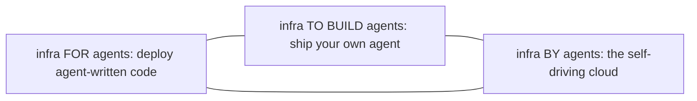

## The question from L04

L04 showed enterprises building their own specialized
models. Follow that to its conclusion and an
uncomfortable question appears for the software
industry. If every company can generate its own tools,
what happens to the companies that sell software? This
chapter is the SaaS reckoning, told by Guillermo Rauch,
founder and CEO of Vercel, a $9.3 billion company that
sits exactly where the reckoning lands.

His background matters to the argument. Rauch grew up
in a suburb of Buenos Aires, taught himself to code,
learned English from software manuals, and bet his
company on open source because free tools were the only
tools he could access as a teenager. Vercel's founding
obsession was **developer experience**: deploying a
website on the clouds of the day took a seasoned
engineer weeks, and Rauch decided that was absurd.

## The TAM explodes

**TAM** is total addressable market: everyone who could
ever buy your product. Rauch's original TAM math was
simple. Roughly 20 million developers in the world
could create front-end projects, and Vercel would give
them the superpower to deploy: not just deploy, but
deploy globally fast and scalable, with no load
balancers to configure.

Then coding agents arrived, and the math broke open.
Rauch tells it as a history of expanding access. First
developers were a tiny priesthood around university
mainframes. Then the PC, the web, and open source
widened the circle. Coding bootcamps promised React in
three months. Each wave added creators. AI is the
biggest wave: anyone who can describe what they want
can now create software.

The numbers moved fast. Starting around October 2025,
with the arrival of strong coding models (the guest
names Opus 4.5), deployments on Vercel surged. His
metaphor: coding agents are the peanut butter being
spread across the whole world, and Vercel is the jelly:
the deployment layer underneath. The cloud's economics
used to be bounded by headcount. **Elastic compute**,
the EC2 idea of a computer per credit card, was
designed for human-written code: how much compute you
could sell was capped by how many programmers existed.
That cap is gone. Demand now comes from agents writing,
repairing, and securing software around the clock.

Figure L05-F1. The TAM expansion. Source: original
diagram for Stanford Frontier AI, drawn from the
session.

```ascii
who can create software

mainframes:   a priesthood at universities
PC + web:     millions
bootcamps:    + React in 3 months
Vercel bet:   ~20M developers can deploy
agents:       anyone who can describe it  <-- the cap breaks
```

## Writing code is not special. Deploying is.

Rauch's sharpest line is a redefinition of where value
lives. "Writing code does not make you special.
Deploying code and putting it in front of a customer
does make you special."

The evidence is the world's pile of dead software.
GitHub, SourceForge, and their ancestors hold mountains
of code that never runs anywhere. Nobody can easily run
most repositories. The learning, Rauch argues, only
starts when a user confronts the running version. That
is why agents changed his business: coding agents do
not share the human bias of keeping code safe on a
laptop. They love to deploy.

This reframes the cloud itself. Rauch jokes that if
Amazon started AWS today it would not be Amazon Web
Services but **Amazon Agent Services**, because the
entity people now ship is the agent, not the page.
The infrastructure primitives are being rebuilt for
that entity, which is the next chapter's subject.

## The three-sided triangle

**Agentic infrastructure**, Rauch's term for the
rebuild, has three sides.

**Side 1: infrastructure for coding agents.** The
peanut butter needs the jelly. When you use Claude
Code, Codex, or v0, the agent writes software that must
deploy somewhere. That somewhere, with domains, CDN,
and scaling handled, is side one.

**Side 2: infrastructure to build your own agents.**
The guest's example: a founder pitching an AI-native
school. The product is not a set of web pages. It is
an agent, with humans (teachers, students) in the
loop. Vercel's own support agent belongs here: it now
answers **93 percent** of user inquiries, improved
satisfaction versus humans, and let the company give
free support to far more people.

**Side 3: infrastructure automated by agents.** The
self-driving cloud. Rauch borrows an anecdote from
Stripe's founder: his pager-duty ringtone was ducks,
and years later hearing ducks still spikes his
cortisol. Running software at scale means 3 a.m.
pages. Vercel automated much of it, but the vision is
total: an agent that configures, monitors, and
optimizes everything, then reports back ("I made your
software twice as fast, here is the PR, conversion is
up").

Figure L05-F2. The agentic infrastructure triangle.
Source: original diagram for Stanford Frontier AI,
drawn from the session.



## SaaS was the lowest common denominator

Now the reckoning proper. **SaaS**, software as a
service, was built on a compromise. Smart product
teams locked themselves in rooms and asked: what one
interface makes the most customers happy? Then they
shipped that interface to everyone. It worked because
building software was expensive, so one shared design
had to serve thousands of companies.

Rauch's claim: that compromise is ending, because the
cost of a tailored interface collapsed. Two exhibits
from the session:

**The parking lot.** A startup CEO replaced the
company's parking management software with something
he live-coded in v0, and saved real money. How many
brilliant Palo Alto companies were ever going to build
great parking software? None. An entire category of
mediocre software existed only because building the
good version was not worth anyone's time. Now it is
one or two prompts away.

**The Salesforce rebuild.** Inside Vercel, a team of
two rebuilt all of Salesforce for internal use:
account research, opportunity briefs, pitch
intelligence, generated on demand. Salesforce the
company is worth hundreds of billions. Two people
rebuilt its surface for their company's needs.

The crucial qualifier, which Rauch stresses: the
**system of record** stays. The database, the access
control lists, the workflows Salesforce built over
decades: those are not regenerated. What becomes
plastic is the **presentation layer**: the pixels on
top of the system of record, tuned to each business.
It is not SaaS versus agents. It is SaaS with an
agent-shaped surface.

## Throwaway software and reflexivity

Push the logic one step further and software becomes
disposable. Rauch reports customers buying Vercel and
v0 so sales engineers can walk into a prospect meeting
with a custom version of the product already built.
Living software beats a slide deck. Three calls later
it is thrown away. Useful for one call, dead by
Wednesday.

His summary line: "software is basically now free."
But free drives engagement, through what Shopify's
Tobi Lutke calls the **reflexivity of AI**. Once you
know you are one prompt away from communicating with
high-fidelity software, you never go back. Rauch wrote
years ago that it is hard to forego efficiency; the
coding-agent era is that essay coming true. Engineers
tell him they could never code the old way again.

The **key question** of the chapter: if software is
free, what is scarce? Rauch's answer runs through the
session. Taste. Distribution. The system of record.
Trust. And the infrastructure underneath it all,
which is the next chapter.

## What stays hard

A common misunderstanding is that all software work
collapses to prompting. Rauch, who runs a company
that cannot stop hiring engineers, disagrees. The
audience for software changed, not the difficulty of
the deep work.

His exhibit is Vercel's own infrastructure: sometimes
it takes a quorum of three agents plus smart humans
staring at a single line of code to decide what is
true. The plumbing of the agentic world, sandboxes,
gateways, isolation, remains genuinely hard
engineering. What changed is who shows up at the door:
customers who have never heard of Vercel, whose agent
brought them there, asking for help through a
transcript. Support is becoming agent-to-agent, and
Rauch's team debugs by reading the customer's agent's
transcript like a flight recorder.

Figure L05-F3. What dies and what stays. Source:
original diagram for Stanford Frontier AI, drawn from
the session.

```ascii
dies (or goes plastic):            stays hard:
- lowest-common-denominator SaaS     - system of record (data, ACLs)
- parking-lot-grade internal tools   - infrastructure plumbing
- one-call demo software             - trust, distribution, taste
- drag-and-drop "coding with         - the deployment layer itself
  training wheels"
```

## Mapping back: the SaaS question, answered

| The fear | This chapter's answer |
|---|---|
| Agents kill software. | They kill the compromise: one shared interface for everyone. Tailored software is now cheap, so the average interface gets better, not worse. |
| What happens to SaaS companies? | The system of record survives; the presentation layer goes plastic. Winners expose agent interfaces: MCP, CLIs, APIs, consumption pricing. |
| Is anything defensible? | Taste, distribution, trust, the data underneath, and the infrastructure. Rauch is long anyone "moving at the speed of tokens." |
| Does engineering get easier? | The audience explodes; the deep work stays hard. Vercel cannot stop hiring engineers. |

## The honest price: retention

The chapter's price is the question the host puts
sharply: **retention**. If software is free and
disposable, do people still need it on Wednesday
morning, or was it a Saturday-morning toy? Rauch
drinks from the firehose and sees both: one-call
throwaway next to deeply embedded workflows. His bet
is reflexivity: once the efficiency is known, it is
never foregone. But he does not claim every generated
app survives. The honest version of "software is
dead" is "undifferentiated software is dead." The
next chapter prices what replaces it.

> [!QA]
> Q: What does "writing code does not make you special" mean?
> A: It means the scarce step was never authoring text; it was putting running software in front of a user. The world is full of repositories nobody can run. The learning starts when a user confronts the working version. Coding agents forced this redefinition because they deploy compulsively, without the human bias toward keeping code safe on a laptop. Value moved from the artifact (code) to the outcome (running software in front of customers).
> Follow-up: What does this imply for where a founder should build?
> A: At the deployment and distribution layer, not the generation layer. Generation is commoditizing; every model writes code. The jelly in Rauch's metaphor, the layer that takes agent-written code and puts it in front of users with domains, scaling, and security, is where the durable position sits. That is the Vercel bet restated.

> [!QA]
> Q: Is SaaS dead?
> A: Rauch's answer is precise: undifferentiated SaaS is dead, the system of record is not. SaaS was a compromise: one interface designed to make the most customers happy, because building software was expensive. With generation cheap, the presentation layer becomes plastic and tailored per business. What survives is the database, the access controls, the workflows, and the trust underneath. His two exhibits: a CEO replacing parking software with v0, and two people rebuilding Salesforce's surface inside Vercel while keeping Salesforce's data layer.
> Follow-up: Which SaaS companies survive the transition?
> A: The ones that expose themselves to agents: MCP interfaces, CLIs, APIs, consumption-based pricing, instant signup. Agents want the raw signal, not a three-month enterprise sales process. Companies built on "code is scarce," like drag-and-drop builders, or on static content aggregation, face the hardest path. Rauch is long anyone moving at the speed of tokens.

> [!QA]
> Q: What is the three-sided agentic infrastructure triangle?
> A: Side one is infrastructure for coding agents: somewhere for agent-written code to deploy. Side two is infrastructure to build your own agents: the tools to ship agents as products, like Vercel's support agent that answers 93 percent of inquiries. Side three is infrastructure automated by agents: the self-driving cloud that configures, monitors, and optimizes itself, then reports back with a PR. The triangle is Rauch's map of where the cloud is being rebuilt.
> Follow-up: Why "Amazon Agent Services"?
> A: Because the shippable entity changed. EC2 was built for human-written code, and cloud revenue was bounded by programmer headcount. Now the entity is the agent: long-running, token-consuming, deploying software. Rauch's joke is an economic claim: the cloud's unit of sale is moving from the virtual machine to the agent, and the primitives (sandbox as the new EC2, token gateway as the new CDN) are being rebuilt to match.

> [!QA]
> Q: What is the reflexivity of AI?
> A: Tobi Lutke's term, quoted by Rauch: once you know you are one prompt away from high-fidelity software, you never forego it. Efficiency, once experienced, is not given up. Engineers tell Rauch they could never code the old way again. Reflexivity is the demand-side engine of the whole chapter: free software does not kill engagement, it multiplies it, because every task becomes worth doing well.
> Follow-up: What is the retention risk?
> A: The host's challenge: Saturday-morning toy versus Wednesday-morning need. If generated software is disposable, usage may not compound. Rauch's honest answer is that both exist: one-call throwaway demos alongside deeply embedded workflows. His bet is that reflexivity wins on average, but he does not claim every generated app retains. Retention, not generation, is the metric to watch.

## Recap: the whole lesson on one screen

1. **The TAM explodes.** From mainframe priesthood to
   ~20M developers to anyone who can describe what they
   want. The programmer-headcount cap on cloud demand
   is gone.
2. **Deploying is the scarce step.** Code that never
   runs teaches nothing. Agents deploy compulsively.
   Value moved from artifact to outcome.
3. **The triangle.** Infrastructure for agents, to
   build agents, automated by agents. The cloud is
   being rebuilt around the agent as the unit.
4. **SaaS was a compromise.** One interface for the
   most customers, because building was expensive.
   The expense is gone.
5. **Two exhibits.** A CEO vibe-coded the parking
   software. Two people rebuilt Salesforce's surface.
   The system of record stayed in both cases.
6. **Throwaway software.** Custom demos per sales
   call, dead by Wednesday. "Software is basically
   now free."
7. **Reflexivity.** Once you know the efficiency, you
   never forego it. Free software multiplies
   engagement instead of killing it.
8. **What stays hard.** Systems of record, trust,
   distribution, taste, and the infrastructure
   plumbing. Next: pricing the token economy.

## Official sources and further reading

**Official:**
- Applications, Coding AI (MS&E 435, Spring 2026),
  guest Guillermo Rauch, Vercel:
  https://www.youtube.com/watch?v=HA7lZd7zk3M
- MS&E 435 course site: https://mse435.stanford.edu/

**Further reading:**
- Mitchell Hashimoto on the "block economy":
  the building-blocks framing Rauch cites for agent
  ergonomics.
- Rauch's essay "it is hard to forego efficiency,"
  referenced in the session.

**Caveats from these sources.** The $9.3B valuation
is the host's intro figure. The 20M-developer TAM is
Rauch's estimate. The Opus 4.5 deployment surge is
dated "since October last year" in the session
[uncertain: October 2025]. The 93 percent support
figure is Vercel's internal metric. "Two people
rebuilt Salesforce" is Rauch's characterization of an
internal project.

## Connections to the other courses

- **MS&E435 L04:** the specialization layer that lets
  every enterprise build its own tools: the supply
  side of this chapter's demand.
- **CS329A / CS329Z:** agents as products: harnesses,
  tool use, and evaluation of agentic systems.
- **CME295:** AI product thinking: the product
  instincts behind the agent-native rebuild.
- **MS&E435 L06:** the pricing layer: how the token
  economy replaces seat-based SaaS economics.
