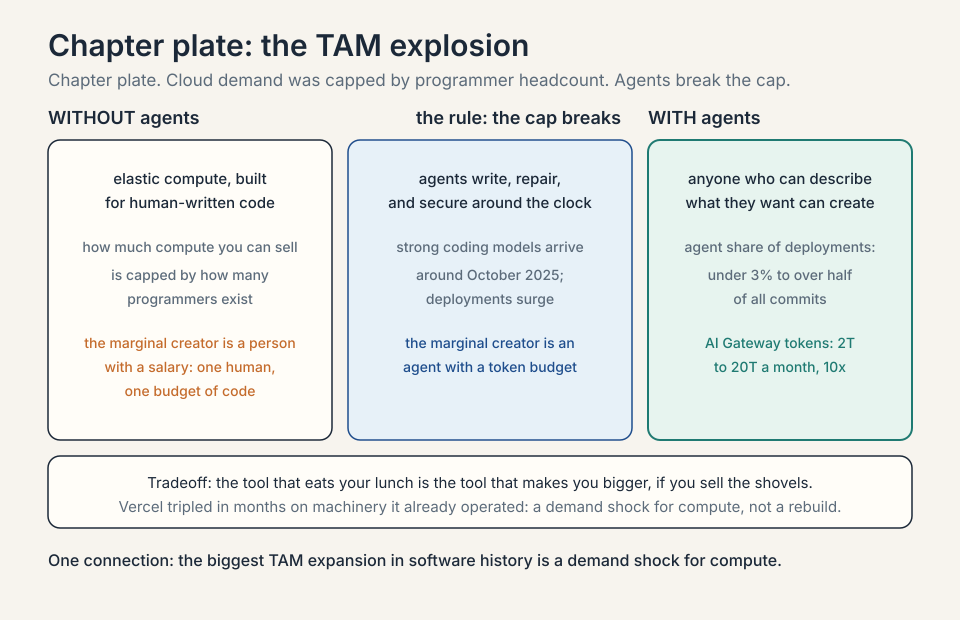
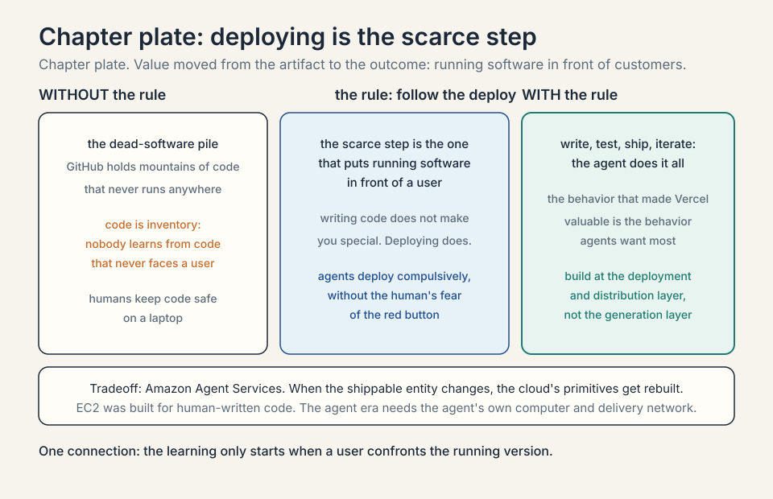
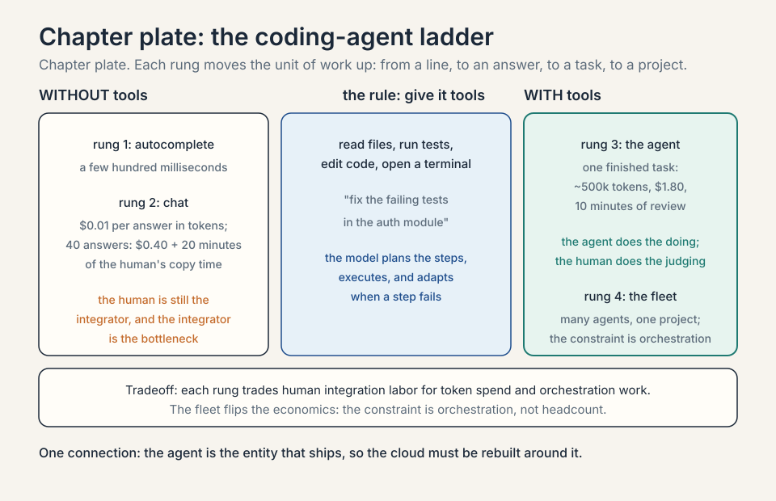
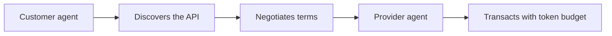
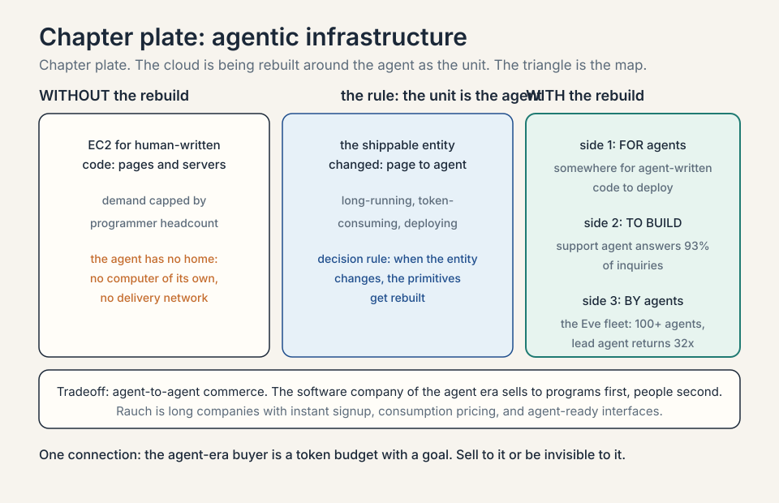
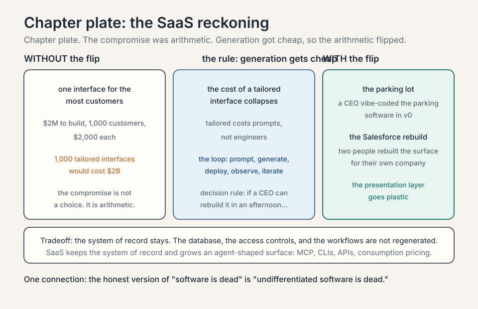
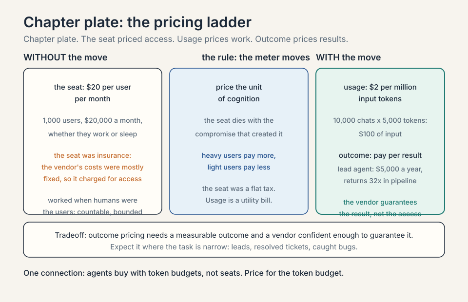
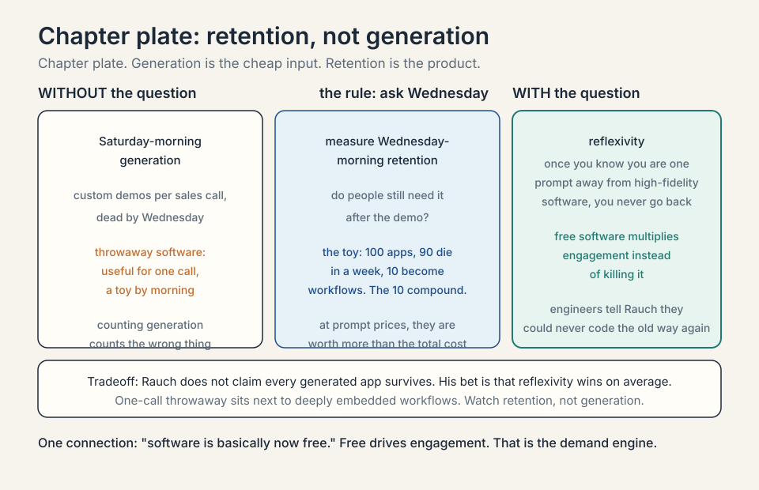

## The question from L04

L04 showed enterprises building their own specialized
models. Follow that to its conclusion and an
uncomfortable question appears for the software
industry. If every company can generate its own tools,
what happens to the companies that sell software? This
chapter is the SaaS (software as a service) reckoning,
told by Guillermo Rauch, founder and CEO of Vercel,
a $9.3 billion company that sits exactly where the
reckoning lands. Three mechanisms drive the
reckoning: the creator pool explodes from millions
to anyone, the cost of a tailored interface collapses
from engineers to prompts, and the meter moves from
seats to tokens. The decision rule: follow the
deploy, not the code. The scarce step is the one
that puts running software in front of a user.

His background matters to the argument. Rauch grew up
in a suburb of Buenos Aires, taught himself to code,
learned English from software manuals, and bet his
company on open source because free tools were the only
tools he could access as a teenager. Vercel's founding
obsession was **developer experience**: deploying a
website on the clouds of the day took a seasoned
engineer weeks, and Rauch decided that was absurd.

## Vercel in three generations

Rauch's company reorganized itself around the agent
era in 2026, and its own history explains why. Three
generations. First, 2015 to 2020: unify fragmented
web operations, CI/CD (continuous integration and
delivery), CDN (content delivery network),
serverless functions,
through Next.js deployment. Second, 2023 to 2025:
unify model integration through the AI SDK, which
reached 3 million weekly downloads (Vercel, Series F
announcement, September 2025). The claim that it
ranks second only to OpenAI's own package is
[uncertain]: no dated ranking was verified. Third,
starting in 2025:
unify the infrastructure that agent applications run
on: model routing, isolated compute, task
orchestration, observability, one platform. The
session sits at the start of generation three.

| Generation | Years | What Vercel unified | Proof |
|---|---|---|---|
| 1 | 2015 to 2020 | web operations: CI/CD, CDN, serverless through Next.js | the deployment obsession |
| 2 | 2023 to 2025 | model integration through the AI SDK | 3 million weekly downloads (Series F, September 2025) |
| 3 | from 2025 | agentic infrastructure: routing, sandboxes, orchestration, observability | the agent era |

### Subchapter: the agent share of deployments, worked

The number that forced the reorganization: at the
start of 2026, fewer than 3 percent of deployments
on Vercel's platform were triggered by coding
agents (programs that write software toward a goal,
using tools, without a human at every step). By June 2026, agents accounted for more than
half of all commits (company disclosures, June
2026). Token requests through the AI Gateway jumped
from 2 trillion to 20 trillion a month in the same
span. The tool that eats your lunch is also the tool
that makes you bigger, as long as you are the one
selling the shovels. Rauch's triangle is the product
map of that realization.

| Metric | Start of 2026 | June 2026 |
|---|---|---|
| Deployments triggered by coding agents | under 3 percent | more than half of all commits |
| AI Gateway token requests | 2 trillion a month | 20 trillion a month, a 10x jump |

### Subchapter: the raise that priced the bet

In August 2025 Bloomberg reported Vercel raising
hundreds of millions led by Accel at about a $9
billion valuation, nearly triple its $250 million
raise the previous May. The market priced the
company on the agent thesis before the session was
filmed. The host's $9.3 billion intro figure is in
that range. The valuation is a bet that deployment
is the scarce step in an agent-written world.

## The TAM explodes

**TAM** is total addressable market: everyone who could
ever buy your product. Rauch's original TAM math was
simple. Roughly 20 million developers in the world
could create front-end projects, and Vercel would give
them the superpower to deploy: not just deploy, but
deploy globally fast and scalable, with no load
balancers to configure.


### Subchapter: the access ladder, with numbers

Rauch tells it as a history of expanding access. First
developers were a tiny priesthood around university
mainframes: thousands of people. Then the PC, the web,
and open source widened the circle to millions. Coding
bootcamps promised React in three months and added
hundreds of thousands. Vercel's bet was 20 million
developers. Each wave multiplied the creators by an
order of magnitude.

### Subchapter: the agents break the cap

Then coding agents arrived, and the math broke open. AI
is the biggest wave: anyone who can describe what they
want can now create software. The numbers moved fast.
Starting around October 2025, with the arrival of
strong coding models (the guest names Opus 4.5,
launched November 24, 2025),
deployments on Vercel surged. His metaphor: coding
agents are the peanut butter being spread across the
whole world, and Vercel is the jelly: the deployment
layer underneath.

### Subchapter: elastic compute's broken cap

The cloud's economics used to be bounded by headcount.
**Elastic compute**, the EC2 idea of a computer per
credit card, was designed for human-written code: how
much compute you could sell was capped by how many
programmers existed. That cap is gone. Demand now
comes from agents writing, repairing, and securing
software around the clock. The marginal creator is no
longer a person with a salary. It is an agent with a
token budget.



## Writing code is not special. Deploying is.

Rauch's sharpest line is a redefinition of where value
lives. "Writing code does not make you special.
Deploying code and putting it in front of a customer
does make you special."

### Subchapter: the dead-software pile

The evidence is the world's pile of dead software.
GitHub, SourceForge, and their ancestors hold mountains
of code that never runs anywhere. Nobody can easily run
most repositories. The learning, Rauch argues, only
starts when a user confronts the running version. Code
is inventory. Running software is revenue.

### Subchapter: agents deploy compulsively

That is why agents changed his business: coding agents
do not share the human bias of keeping code safe on a
laptop. They love to deploy. The agent writes, tests,
ships, and iterates without the human's fear of the
red button. The behavior that made Vercel valuable,
frictionless deployment, is the behavior agents want
most.

### Subchapter: where value moved

This reframes the cloud itself. Rauch jokes that if
Amazon started AWS today it would not be Amazon Web
Services but **Amazon Agent Services**, because the
entity people now ship is the agent, not the page.
The infrastructure primitives are being rebuilt for
that entity, which is the next chapter's subject.
The decision rule: when the shippable entity
changes, the primitives get rebuilt. EC2 was built
for human-written code, with cloud revenue capped by
programmer headcount. The agent era needs the
agent's own computer and the agent's own delivery
network, metered in tokens. Value moved from the
artifact (code) to the outcome (running software in
front of customers).



## Coding agents, from zero

The ladder has four rungs, and each rung changes who
does what. The definition from the chapter's opening
still holds: a coding agent is a program that writes
software toward a goal, using tools, without a human
at every step.

### Subchapter: rung one, autocomplete

The model completes the line you are typing. GitHub
Copilot made this standard in 2021. You stay in
charge. The model guesses the next tokens. Latency
budget: a few hundred milliseconds, or it breaks
flow. This is assistance, not agency: the human
plans, the model types.

### Subchapter: rung two, chat

The model answers questions and writes code blocks
in a chat panel. You copy the code into your
project. The human still integrates. The unit of
work is one answer. Toy it: one answer costs about
$0.01 in tokens and 30 seconds of the human's
copy-and-integrate time. A task that needs 40
answers costs $0.40 in tokens and 20 minutes of the
human's time: 40 times 30 seconds is 1,200 seconds.
The human is still the integrator, and the
integrator is the bottleneck. This is where most
developers met AI coding, and it is already obsolete
as the frontier.

### Subchapter: rung three, the agent

The model gets tools: read files, run tests, edit
code, open a terminal. You give it a goal, "fix the
failing tests in the auth module," and it plans the
steps, executes them, and adapts when a step fails.
**Claude Code** and **Codex** live here. The unit of
work is a finished task. Toy it: one finished task
burns about 500,000 tokens across its tool calls,
roughly four input tokens for every output token.
Assume $2 per million input tokens and $10 per
million output tokens. Then 400,000 input tokens
cost $0.80 and 100,000 output tokens cost $1.00:
$1.80 for the task, against 10 minutes of human
review. The agent does the doing. The human does the
judging. This is the rung the whole chapter is
about: the agent is the entity that ships, which is
why the cloud must be rebuilt around it.

### Subchapter: rung four, the fleet

Many agents work in parallel, coordinated by a
router. Cursor's cloud agents, Vercel's internal
fleet of 100+ agents, Cognition's Devin swarms.
The unit of work is a project. The human sets
direction. The economics flip here: the marginal
programmer is an agent with a token budget, and the
constraint is orchestration, not headcount.

| Rung | Name | Unit of work | Who integrates | Economics |
|---|---|---|---|---|
| 1 | Autocomplete | the line | the human types | a few hundred milliseconds, or it breaks flow |
| 2 | Chat | one answer | the human integrates | $0.01 per answer; 40 answers cost $0.40 and 20 minutes |
| 3 | The agent | one finished task | the agent does; the human judges | about 500,000 tokens, $1.80, against 10 minutes of review |
| 4 | The fleet | one project | the router; the human directs | the constraint is orchestration, not headcount |



## The three-sided triangle

**Agentic infrastructure**, Rauch's term for the
rebuild, has three sides.


### Subchapter: side 1, for coding agents

The peanut butter needs the jelly. When you use Claude
Code, Codex, or v0 (Vercel's prompt-to-app product),
the agent writes software that must
deploy somewhere. That somewhere, with domains, CDN,
and scaling handled, is side one. The economics:
every agent-written app is a deployment customer. The
more agents write, the more side one earns.

### Subchapter: v0's business, the loop priced

**v0**, named above, closes the loop: describe an
interface, get working code, deploy it on the same
platform. The pricing is usage-based (metered by use,
not by seat): the free plan
includes $5 in monthly generation credits, paid team
access starts at $30 per user per month, business at
$100, enterprise custom. Credits are a prepaid dollar
balance, and models charge by input and output
tokens including chat history and source files.

The loop is the product. Generation without
deployment is a demo. v0 closes it: prompt, generate,
deploy, observe, iterate, all on one platform. The
parking-lot CEO and the Salesforce rebuild both ran
this loop. The moat is not the generator. Every lab
has one. The moat is the shortest path from prompt
to a URL a customer can open.

| Plan | Price | What you get |
|---|---|---|
| Free | $0 | $5 in monthly generation credits |
| Team | $30 per user per month | paid generation access |
| Business | $100 per user per month | business tier |
| Enterprise | custom | enterprise tier |

### Subchapter: side 2, to build your own agents

The guest's example: a founder pitching an AI-native
school. The product is not a set of web pages. It is
an agent, with humans (teachers, students) in the
loop. Vercel's own support agent belongs here: it now
answers **93 percent** of user inquiries, improved
satisfaction versus humans, and let the company give
free support to far more people. The 93 percent is the
proof that an agent can be the product, not the demo.

### Subchapter: side 3, automated by agents

The self-driving cloud. Rauch borrows an anecdote from
Stripe's founder: his pager-duty ringtone was ducks,
and years later hearing ducks still spikes his
cortisol. Running software at scale means 3 a.m.
pages. Vercel automated much of it, but the vision is
total: an agent that configures, monitors, and
optimizes everything, then reports back ("I made your
software twice as fast, here is the PR, conversion is
up").

### Subchapter: the Eve fleet, the vision running

In June 2026 Vercel open-sourced **Eve**, its agent
framework, and published the fleet it runs
internally: more than 100 agents. Six are named.
**d0**, a data-analysis agent any employee can query
in Slack, handles more than 30,000 questions a month
and enforces data permissions automatically. The
**Lead Agent** is an autonomous sales-development
representative that works inbound leads the moment
they arrive: it costs about $5,000 a year to run and
returns about 32 times that, maintained part-time by
one engineer. **Vertex**, the support agent, resolves
92 percent of incoming tickets without escalation.
**Athena**, a sales cockpit built by the RevOps team
without engineering involvement, answers pipeline
questions from Snowflake and Salesforce in plain
language, assembled in six weeks. At the top sits
**V**, a router that receives every inbound Slack
message and directs it to the right specialist. Side
three is not a vision deck. It is a production
fleet with measured returns. The 92 percent is the
June 2026 press figure for Vertex, the named fleet
agent. The 93 percent earlier is the session's own
internal metric for the same support role. They are
two separate measurements from two sources.

| Agent | What it does | Measured return |
|---|---|---|
| d0 | data-analysis agent any employee can query in Slack | more than 30,000 questions a month; enforces data permissions |
| Lead Agent | autonomous sales-development representative | about $5,000 a year to run; returns about 32 times that; maintained part-time by one engineer |
| Vertex | support agent | resolves 92 percent of tickets without escalation |
| Athena | sales cockpit built on Snowflake and Salesforce | assembled in six weeks without engineering involvement |
| V | router for every inbound Slack message | directs each message to the right specialist |

### Subchapter: agent-to-agent commerce

The fleet changes who the customer is. Vercel's
support now serves customers who have never heard of
Vercel: their agent brought them there, and the
support ticket is the customer's agent's transcript,
read like a flight recorder. Push this one step
further and agents buy from agents: one agent
discovers the API, another negotiates the terms,
neither is human. The software company of the agent
era sells to programs first and people second. That
is why Rauch's long is companies with instant
signup, consumption pricing, and agent-ready
interfaces: the buyer is now a token budget with a
goal.





## SaaS was the lowest common denominator

Now the reckoning proper. **SaaS**, software as a
service, was built on a compromise. Smart product
teams locked themselves in rooms and asked: what one
interface makes the most customers happy? Then they
shipped that interface to everyone. It worked because
building software was expensive, so one shared design
had to serve thousands of companies.

### Subchapter: the compromise mechanism, worked

Toy the economics. A SaaS company spends $2M building
one interface that serves 1,000 customers. Cost per
customer: $2,000. Building 1,000 tailored interfaces
would cost $2B. So the company builds one and calls it
a product. The compromise is not a choice. It is
arithmetic. When generation gets cheap, the arithmetic
flips: tailored interfaces cost prompts, not
engineers.

```ascii
shared    $2M to build; 1,000 customers; $2,000 each
tailored  1,000 interfaces; $2B
rule      the cost of a tailored interface flips: prompts, not engineers
```

### Subchapter: the parking lot

Rauch's claim: that compromise is ending, because the
cost of a tailored interface collapsed. Two exhibits
from the session. **The parking lot.** A startup CEO
replaced the company's parking management software
with something he live-coded in v0, and saved real
money. How many brilliant Palo Alto companies were
ever going to build great parking software? None. An
entire category of mediocre software existed only
because building the good version was not worth
anyone's time. Now it is one or two prompts away.
The decision rule: if a CEO can rebuild your
category in an afternoon with v0, your category was
the compromise, not the product.

### Subchapter: the Salesforce rebuild

**The Salesforce rebuild.** Inside Vercel, a team of
two rebuilt all of Salesforce for internal use:
account research, opportunity briefs, pitch
intelligence, generated on demand. Salesforce the
company is worth hundreds of billions. Two people
rebuilt its surface for their company's needs.

### Subchapter: the system of record stays

The crucial qualifier, which Rauch stresses: the
**system of record** stays. The database, the access
control lists, the workflows Salesforce built over
decades: those are not regenerated. What becomes
plastic is the **presentation layer**: the pixels on
top of the system of record, tuned to each business.
The split is not SaaS versus agents. SaaS keeps the system of record and grows an
agent-shaped surface.




## Pricing variants: seat, usage, outcome

If software goes plastic, the seat must die with the
compromise that created it. Three pricing models,
each with worked numbers.

### Subchapter: the seat, worked

The classic SaaS meter: $20 per user per month,
1,000 users, $20,000 a month. The customer pays for
access whether anyone logs in or not. The seat was
insurance: the vendor's costs were mostly fixed, so
it charged for the right to use, not the use. It
worked when humans were the users, because humans
are countable and their usage is bounded by the
workday.

### Subchapter: usage, worked

The token-era meter: pay per unit of work. $2 per
million input tokens. A support agent handling
10,000 conversations a month at 5,000 tokens each
burns 50 million tokens: $100 of input. Heavy users
pay more, light users pay less, and the vendor's
revenue scales with the value delivered. The seat
was a flat tax. Usage is a utility bill. Every
company on Rauch's long list prices this way:
consumption-based, metered, no sales call required.

### Subchapter: outcome, worked

The emerging meter: pay per result. The Lead Agent
costs $5,000 a year and returns 32 times that in
pipeline: the customer is buying qualified leads,
not tokens. Outcome pricing aligns the vendor with
the buyer completely, but it needs a measurable
outcome and a vendor confident enough to guarantee
it. Expect it where the task is narrow: leads,
resolved tickets, caught bugs. The seat priced
access. Usage prices work. Outcome prices results.

| Meter | Worked number | What it prices |
|---|---|---|
| Seat | $20 per user per month; 1,000 users, $20,000 a month | access, whether users work or sleep |
| Usage | $2 per million input tokens; 10,000 chats at 5,000 tokens: $100 of input | work; heavy users pay more |
| Outcome | the Lead Agent: $5,000 a year, returns 32x in pipeline | results; the vendor guarantees the outcome |



## Throwaway software and reflexivity

**Reflexivity** is the engine of this section:
once you know you are one prompt away from
high-fidelity software, you never go back. The term
is Shopify CEO Tobi Lutke's, quoted by Rauch.

Push the logic one step further and software becomes
disposable. Rauch reports customers buying Vercel and
v0 so sales engineers can walk into a prospect meeting
with a custom version of the product already built.
Living software beats a slide deck. Three calls later
it is thrown away. Useful for one call, dead by
Wednesday.

### Subchapter: the retention question, worked

The host puts it sharply: **retention**. If software
is free and disposable, do people still need it on
Wednesday morning, or was it a Saturday-morning toy?
Toy the math: 100 generated apps, 90 die in a week,
10 become workflows. The 10 compound. The 90 were
cheap. The question is not whether most generated
software dies. It is whether the survivors are worth
more than the total cost of generation. At prompt
prices, they are. The decision rule: measure
Wednesday-morning retention, not Saturday-morning
generation. Generation is the cheap input. Retention
is the product.

```ascii
100 generated apps -> 90 die in a week -> 10 become workflows
the 90 were cheap; the 10 compound
rule  measure Wednesday-morning retention, not Saturday-morning generation
```

### Subchapter: reflexivity

His summary line: "software is basically now free."
But free drives engagement. That is reflexivity at
work: the demand-side engine of the whole chapter.
Rauch wrote
years ago that it is hard to forego efficiency. the
coding-agent era is that essay coming true. Engineers
tell him they could never code the old way again.



## What stays hard

A common misunderstanding is that all software work
collapses to prompting. Rauch, who runs a company
that cannot stop hiring engineers, disagrees. The
audience for software changed, not the difficulty of
the deep work.

### Subchapter: the single-line quorum

His exhibit is Vercel's own infrastructure: sometimes
it takes a quorum of three agents plus smart humans
staring at a single line of code to decide what is
true. The plumbing of the agentic world, sandboxes,
gateways, isolation, remains genuinely hard
engineering.

### Subchapter: agent-to-agent support

What changed is who shows up at the door: customers
who have never heard of Vercel, whose agent brought
them there, asking for help through a transcript.
Support is becoming agent-to-agent, and Rauch's team
debugs by reading the customer's agent's transcript
like a flight recorder. The support ticket is now a
log of another machine's reasoning.

## What is used where: the coding-agent market, October 2026

- **Claude Code (Anthropic)** is the enterprise coding
  standard: roughly 54 percent of the enterprise
  coding market (Menlo Ventures, late 2025), about
  $2.5 billion in annualized revenue roughly a year
  after launch (Anthropic disclosure, February 2026,
  reported by MarketWatch), and the default model
  inside Cursor.
  This is the agent Rauch's triangle is built for.
- **Codex (OpenAI)** is the challenger: OpenAI's
  agentic coding product, priced on the GPT-6 ladder.
  In enterprise coding share it sits near 21 percent,
  well behind Claude Code.
- **Cursor** is the distribution proof: the editor
  that made agents the default way to write code,
  reaching $1 billion in annual recurring revenue in
  24 months, the fastest in B2B SaaS history, on more
  than 400 million AI requests a day. Claude is the
  default model, and its own Composer model shows
  the continual-learning pattern from L04.
- **v0 (Vercel)** is the generation-to-deployment
  loop: the product in the parking-lot and Salesforce
  exhibits, generating interfaces from prompts and
  deploying them on the same platform. Pricing is
  usage-based: $5 in monthly credits free, team
  access from $30 per user per month.
- **Windsurf / Cognition** is the specialist bet:
  Cognition acquired Windsurf in July 2025 after
  Google's $2.4B reverse-acquihire, shipped Windsurf
  2.0 in April 2026, and reported $492M in annualized
  revenue at a $26B valuation in May 2026. The small-
  model, fast-feedback loop from L04's Pareto
  frontier is now an enterprise product category.

| Player | Position, October 2026 | Number |
|---|---|---|
| Claude Code (Anthropic) | the enterprise coding standard | about 54 percent share; about $2.5B annualized revenue |
| Codex (OpenAI) | the challenger | about 21 percent of enterprise coding share |
| Cursor | the distribution proof | $1B ARR in 24 months; 400M AI requests a day |
| v0 (Vercel) | the generation-to-deployment loop | $5 free credits; team from $30 per user per month |
| Windsurf / Cognition | the specialist bet | $492M annualized revenue; $26B valuation (May 2026) |

## Mapping back: the SaaS question, answered

| The fear | This chapter's answer |
|---|---|
| Agents kill software. | They kill the compromise: one shared interface for everyone. Tailored software is now cheap, so the average interface gets better, not worse. |
| What happens to SaaS companies? | The system of record survives. the presentation layer goes plastic. Winners expose agent interfaces: MCP (Model Context Protocol), CLIs, APIs, consumption pricing. |
| Is anything defensible? | Taste, distribution, trust, the data underneath, and the infrastructure. Rauch is long anyone "moving at the speed of tokens." |
| Does engineering get easier? | The audience explodes. the deep work stays hard. Vercel cannot stop hiring engineers. |
| Who wins the agent market in 2026? | Claude Code on enterprise coding, v0 on generation-to-deploy, Cursor on distribution. |

## The honest price: retention

The chapter's price is the question the host puts
sharply: **retention**. If software is free and
disposable, do people still need it on Wednesday
morning, or was it a Saturday-morning toy? Rauch
drinks from the firehose and sees both: one-call
throwaway next to deeply embedded workflows. His bet
is reflexivity: once the efficiency is known, it is
never foregone. But he does not claim every generated
app survives. The honest version of "software is
dead" is "undifferentiated software is dead." The
next chapter prices what replaces it.

> [!QA]
> Q: What does "writing code does not make you special" mean?
> A: It means the scarce step was never authoring text. it was putting running software in front of a user. The world is full of repositories nobody can run. The learning starts when a user confronts the working version. Coding agents forced this redefinition because they deploy compulsively, without the human bias toward keeping code safe on a laptop. Value moved from the artifact (code) to the outcome (running software in front of customers).
> Follow-up: What does this imply for where a founder should build?
> A: At the deployment and distribution layer, not the generation layer. Generation is commoditizing. every model writes code. The jelly in Rauch's metaphor, the layer that takes agent-written code and puts it in front of users with domains, scaling, and security, is where the durable position sits. That is the Vercel bet restated.

> [!QA]
> Q: Walk me through the TAM math, before and after agents.
> A: Before: roughly 20 million developers in the world could create front-end projects, and Vercel sold them deployment superpowers. Cloud revenue was bounded by programmer headcount: one human, one salary, one budget of code. After: anyone who can describe what they want can create software, and agents write around the clock. The marginal creator is an agent with a token budget, not a person with a salary. The cap on how much software gets made, and how much compute it consumes, is gone.
> Follow-up: How does the TAM expansion show up in Vercel's numbers?
> A: In the deployment surge starting October 2025 with strong coding models (the guest names Opus 4.5): agents went from under 3 percent of deployments to more than half of all commits, and AI Gateway token requests jumped from 2 trillion to 20 trillion a month. The peanut butter spread, and the jelly was already on the shelf.

> [!QA]
> Q: Is SaaS dead?
> A: Rauch's answer is precise: undifferentiated SaaS is dead, the system of record is not. SaaS was a compromise: one interface designed to make the most customers happy, because building software was expensive. With generation cheap, the presentation layer becomes plastic and tailored per business. What survives is the database, the access controls, the workflows, and the trust underneath. His two exhibits: a CEO replacing parking software with v0, and two people rebuilding Salesforce's surface inside Vercel while keeping Salesforce's data layer.
> Follow-up: Which SaaS companies survive the transition?
> A: The ones that expose themselves to agents: MCP interfaces, CLIs, APIs, consumption-based pricing, instant signup. Agents want the raw signal, not a three-month enterprise sales process. Companies built on "code is scarce," like drag-and-drop builders, or on static content aggregation, face the hardest path. Rauch is long anyone moving at the speed of tokens.

> [!QA]
> Q: What is the three-sided agentic infrastructure triangle?
> A: Side one is infrastructure for coding agents: somewhere for agent-written code to deploy. Side two is infrastructure to build your own agents: the tools to ship agents as products, like Vercel's support agent that answers 93 percent of inquiries. Side three is infrastructure automated by agents: the self-driving cloud that configures, monitors, and optimizes itself, then reports back with a PR. The triangle is Rauch's map of where the cloud is being rebuilt.
> Follow-up: Why "Amazon Agent Services"?
> A: Because the shippable entity changed. EC2 was built for human-written code, and cloud revenue was bounded by programmer headcount. Now the entity is the agent: long-running, token-consuming, deploying software. Rauch's joke is an economic claim: the cloud's unit of sale is moving from the virtual machine to the agent, and the primitives (sandbox as the new EC2, token gateway as the new CDN) are being rebuilt to match.

> [!QA]
> Q: What is the reflexivity of AI?
> A: Tobi Lutke's term, quoted by Rauch: once you know you are one prompt away from high-fidelity software, you never forego it. Efficiency, once experienced, is not given up. Engineers tell Rauch they could never code the old way again. Reflexivity is the demand-side engine of the whole chapter: free software does not kill engagement, it multiplies it, because every task becomes worth doing well.
> Follow-up: What is the retention risk?
> A: The host's challenge: Saturday-morning toy versus Wednesday-morning need. If generated software is disposable, usage may not compound. Rauch's honest answer is that both exist: one-call throwaway demos alongside deeply embedded workflows. His bet is that reflexivity wins on average, but he does not claim every generated app retains. Retention, not generation, is the metric to watch.

> [!QA]
> Q: Who wins the coding-agent market as of October 2026, and why?
> A: Claude Code leads enterprise coding at about 54 percent share, a multi-billion-dollar revenue line and the default model in Cursor. OpenAI's Codex is the challenger near 21 percent. Cursor is the distribution proof that agents are the default way to write code. Vercel's v0 closes the generation-to-deployment loop. The winner's trait is not the best model alone. It is the tightest loop: generate, deploy, observe, iterate, which is exactly Rauch's triangle as a product.
> Follow-up: What is the bear case for the leader?
> A: The September 2026 price war: OpenAI cut GPT-6 Sol to $2/$10 and Anthropic cut Opus 5.5 to $4/$20 within ninety minutes of each other. When the generation layer commoditizes, the agent's model becomes swappable and the moat moves to distribution and data. The leader's risk is that the loop matters more than the model, and someone else owns the loop.

> [!QA]
> Q: What would you ask a SaaS CEO to test the reckoning thesis?
> A: Three questions. First, what share of your interface is now generated per customer versus shared: the plastic share. Second, your agent surface: do you expose MCP, a CLI, and consumption pricing, or is an agent still stuck at your sales form. Third, your system of record: what data or workflow would a two-person team with v0 fail to reproduce. The first measures how far the reckoning has reached you. The third measures what is actually defensible.
> Follow-up: What answer to the third question counts as defensible?
> A: A named asset a two-person team cannot regenerate. The passing answer sounds like this: twenty years of audited transaction records with regulatory provenance, plus access-control lists wired into three banks' compliance systems. What fails: "our data." The test is specific: name the dataset, the workflow, or the trust relationship that prompts cannot rebuild. If the CEO can only point at the interface, the interface is already plastic.

## Coverage map: every session claim and where it lives

No transcript or captions exist for the session
video, so segment-level mapping of claims to
timestamps is not possible. The table below maps
every major claim from the session to the section
that covers it, with file line numbers. October
2026 updates are marked.

| Session claim | Covered in | File line |
|---|---|---|
| Rauch's background: Buenos Aires, self-taught, open source bet | The question from L04 | L23 |
| Developer experience as the founding obsession | The question from L04 | L23 |
| TAM: 20 million developers who can create front-end projects | The TAM explodes | L96 |
| The access ladder: mainframes to bootcamps | the access ladder, with numbers | L108 |
| Coding agents break the cap: anyone who can describe it can create | the agents break the cap | L119 |
| Elastic compute's broken cap: demand no longer bounded by headcount | elastic compute's broken cap | L132 |
| "Writing code does not make you special. Deploying does" | Writing code is not special. Deploying is. | L144 |
| The dead-software pile: GitHub full of code that never runs | the dead-software pile | L151 |
| Agents deploy compulsively | agents deploy compulsively | L160 |
| "Amazon Agent Services": the shippable entity is the agent | where value moved | L170 |
| The three-sided agentic infrastructure triangle | The three-sided triangle | L248 |
| Side 1: infrastructure for coding agents | side 1, for coding agents | L255 |
| Side 2: infrastructure to build your own agents; the school example; the support agent at 93 percent of inquiries | side 2, to build your own agents | L285 |
| Side 3: infrastructure automated by agents; the ducks anecdote | side 3, automated by agents | L296 |
| SaaS was the lowest common denominator | SaaS was the lowest common denominator | L347 |
| The compromise mechanism: one interface for the most customers | the compromise mechanism, worked | L357 |
| The parking lot: CEO vibe-coded the parking software | the parking lot | L368 |
| The Salesforce rebuild by a team of two | the Salesforce rebuild | L384 |
| The system of record stays; the presentation layer goes plastic | the system of record stays | L393 |
| Throwaway software: custom demos per sales call | Throwaway software and reflexivity | L447 |
| Retention: the host's Wednesday-morning question | the retention question, worked | L462 |
| Reflexivity of AI (Tobi Lutke); "Software is basically now free" | reflexivity | L477 |
| The single-line quorum: three agents plus humans on one line | the single-line quorum | L495 |
| Agent-to-agent support: debugging via transcript | agent-to-agent support | L504 |
| Rauch's long and short: anyone moving at the speed of tokens; static content, code-is-scarce builders, closed firms | Mapping back | L549 |
| Vercel's three generations; Eve fleet (Oct 2026 updates) | Vercel in three generations; the Eve fleet | L50, L308 |
| Agent share of deployments: under 3% to over half (Oct 2026 update) | the agent share of deployments, worked | L70 |
| AI Gateway 2T to 20T tokens a month (Oct 2026 update) | the agent share of deployments, worked | L70 |
| v0 pricing: credits and tiers (Oct 2026 update) | v0's business, the loop priced | L265 |
| Agent-to-agent commerce (Oct 2026 update) | agent-to-agent commerce | L331 |
| Pricing variants: seat, usage, outcome (Oct 2026 update) | Pricing variants | L406 |
| Coding-agent ladder: autocomplete to fleet (textbook build) | Coding agents, from zero | L187 |
| Cursor $1B ARR; Cognition $492M ARR (Oct 2026 updates) | What is used where | L514 |

## Recap: the whole lesson on one screen

1. **The TAM explodes.** From mainframe priesthood to
   ~20M developers to anyone who can describe what they
   want. The programmer-headcount cap on cloud demand
   is gone.
2. **The access ladder.** Mainframes, PC, web, open
   source, bootcamps, Vercel's 20M bet, agents. Each
   wave multiplied creators by an order of magnitude.
3. **Deploying is the scarce step.** Code that never
   runs teaches nothing. Agents deploy compulsively.
   Value moved from artifact to outcome.
4. **The agent ladder.** Autocomplete, chat, agent,
   fleet. Each rung moves the unit of work up: from
   a line, to an answer, to a task, to a project.
5. **The triangle.** Infrastructure for agents, to
   build agents, automated by agents. The cloud is
   being rebuilt around the agent as the unit.
6. **The Eve fleet.** Vercel runs 100+ agents in
   production: d0 answers 30,000 questions a month,
   the Lead Agent returns 32x its cost, Vertex
   resolves 92 percent of tickets. Side three is
   measured, not imagined.
7. **SaaS was a compromise.** One interface for the
   most customers, because building was expensive.
   The expense is gone.
8. **Two exhibits.** A CEO vibe-coded the parking
   software. Two people rebuilt Salesforce's surface.
   The system of record stayed in both cases.
9. **Pricing.** The seat priced access. Usage prices
   work. Outcome prices results. Agents buy with
   token budgets, not seats.
10. **Throwaway software.** Custom demos per sales
    call, dead by Wednesday. "Software is basically
    now free."
11. **Reflexivity.** Once you know the efficiency, you
    never forego it. Free software multiplies
    engagement instead of killing it.
12. **What stays hard.** Systems of record, trust,
    distribution, taste, and the infrastructure
    plumbing. Next: pricing the token economy.

## Go deeper

<div style="position:relative;padding-bottom:56.25%;height:0;overflow:hidden;max-width:100%;margin:16px 0;">
<iframe style="position:absolute;top:0;left:0;width:100%;height:100%;" src="https://www.youtube-nocookie.com/embed/HA7lZd7zk3M" title="Applications, Coding AI (MS&E 435, Guillermo Rauch)" frameborder="0" allow="accelerometer; autoplay; clipboard-write; encrypted-media; gyroscope; picture-in-picture" allowfullscreen></iframe>
</div>

- [Applications, Coding AI (MS&E 435, first half)](https://www.youtube.com/watch?v=HA7lZd7zk3M)
- The session this lesson follows, in full.
- [MS&E 435 course site](https://mse435.stanford.edu/)
- [Enterprise LLM vendor market share, 2026](https://www.aboutchromebooks.com/enterprise-llm-vendor-market-share-statistics/)
- [The Building Block Economy (Star History, on Mitchell Hashimoto's April 2026 essay)](https://www.star-history.com/blog/building-blocks/)
- Ghostty's libghostty as the receipt: the block outgrew the product it was born from, five times faster.
- [Vercel's agentic infrastructure: Eve, Agent Stack, and the fleet (June 2026)](https://www.techtimes.com/articles/318642/20260618/vercel-eve-launches-open-source-agent-framework-backed-its-own-production-fleet.htm)

## Official sources and further reading

**Official:**
- Applications, Coding AI (MS&E 435, Spring 2026),
  guest Guillermo Rauch, Vercel: [link](https://www.youtube.com/watch?v=HA7lZd7zk3M)
- [MS&E 435 course site](https://mse435.stanford.edu/)

**Further reading:**
- Mitchell Hashimoto on the "block economy":
  the building-blocks framing Rauch cites for agent
  ergonomics.
- Rauch's essay "it is hard to forego efficiency,"
  referenced in the session.

**Caveats from these sources.** The $9.3B valuation
is the host's intro figure. Bloomberg reported a
raise at about $9B in August 2025. The 20M-developer
TAM is Rauch's estimate. The Opus 4.5 deployment
surge is dated "since October last year" in the
session. Opus 4.5 itself launched November 24, 2025
(auditor-verified). The 93 percent
support figure is Vercel's internal metric from the
session. June 2026 press on the Eve fleet reports
92 percent for the Vertex agent. "Two people rebuilt
Salesforce" is Rauch's characterization of an
internal project. The agent-deployment share (under
3 percent to over half) and the 2T-to-20T gateway
figures are Vercel's June 2026 disclosures. The
October 2026 market shares are press and vendor-
reported survey estimates.

## Connections to the other courses

- **MS&E435 L04:** the specialization layer that lets
  every enterprise build its own tools: the supply
  side of this chapter's demand.
- **CS329A / CS329Z:** agents as products: harnesses,
  tool use, and evaluation of agentic systems.
- **CME295:** AI product thinking: the product
  instincts behind the agent-native rebuild.
- **MS&E435 L06:** the pricing layer: how the token
  economy replaces seat-based SaaS economics.
