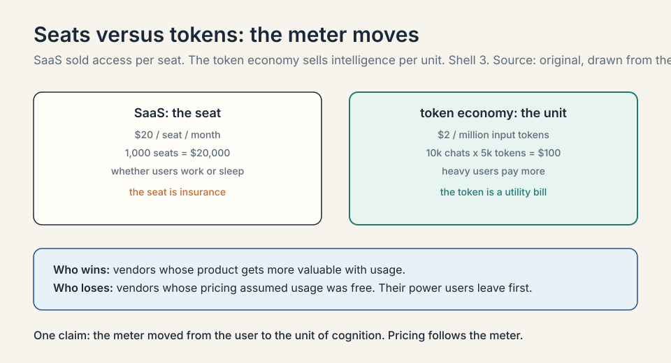
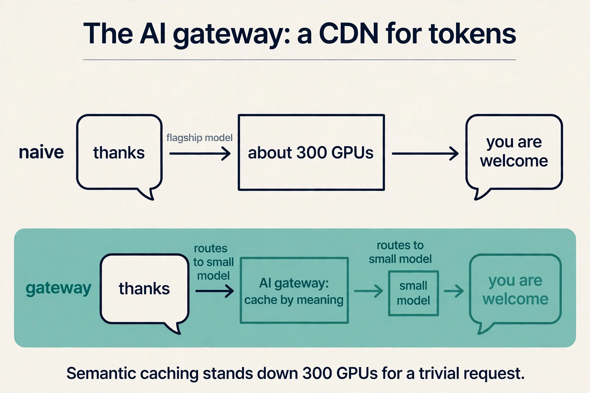
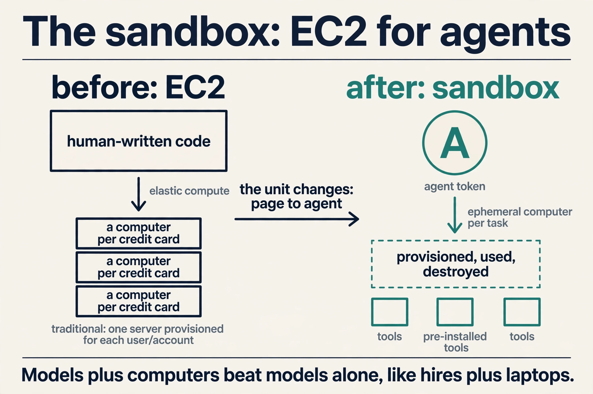
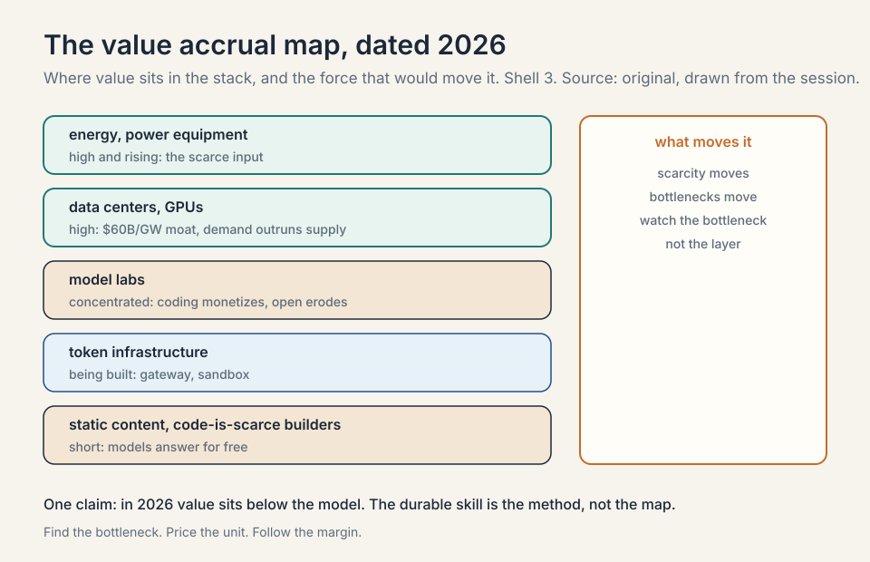

## The course's core question

Every session of MS&E435 circles one question, and the
host asks it directly in this one: from chips to data
centers to infrastructure below the model, the model,
and the agents above it, **where will value accrue?**

Rauch's answer is dated and specific: "at least in
2026, right this second," value concentrates **below
the model**. Chips, data centers, power, cooling,
energy. Above the model there is real value, in coding
models, customer support, legal, and other verticals,
but it is narrow and concentrated. The money is in the
picks and shovels.

This chapter is the map of that answer: why the value
sits where it does, the new primitives being built to
capture it, and how the guests say to bet.

## Why below the model wins (for now)

Three forces push value down the stack, and each one
has a number from the course.

### Subchapter: the CapEx is the moat, worked

L02 priced it: $60M per MW, $60B per gigawatt. Capital
at that scale is its own barrier. Few players can
finance AI factories, so the returns concentrate among
those who can. By October 2026 the moat had a
financing wall behind it: the five hyperscalers'
projected capex of about $800B exceeds their combined
operating cash flow of about $707B. The buildout is
113 percent self-unfunded. The moat is now also a
balance-sheet contest.

### Subchapter: demand outruns supply, with 2026 numbers

The Applied Compute session named compute scarcity
outright: demand far outpacing supply. By 2026 the
numbers filled in. Amazon guided roughly $200-220B of
capex, Alphabet $195-205B, Meta $115-135B, Microsoft
about $175B. Google Cloud crossed $20B a quarter with
$460B of backlog. Scarcity prices flow to the scarce
input. Today that input is energized compute, not
model weights.

### Subchapter: models commoditize faster than concrete

The Crusoe session's long/short said it plainly: old
compute commoditizes, but so do old models, and open
source takes share from closed-source model players.
The September 2026 price war is the exhibit: OpenAI
and Anthropic cut frontier prices within ninety
minutes of each other, DeepSeek sells flash
intelligence at $0.30/$1.20, and the effective
enterprise token price fell 41 percent in six months.
A data center's revenue can be repriced per token for
a decade. A model's pricing power erodes with every
open release.

The honest qualifier is the date. "In 2026" is doing
real work in Rauch's sentence. Value accrual moves as
bottlenecks move, and L01 showed bottlenecks always
move.

## Tokens: the new commodity

The unit of the new economy is the **token**: a chunk
of text the model reads or writes, roughly a word or
part of one. Rauch's framing: Vercel used to stream
pixels to users. Now it streams intelligence in the
form of tokens. Tokens are, in his phrase, "the new
hot commodity."

### Subchapter: the seat-to-token arithmetic, worked

This changes the pricing model of software. **SaaS**
sold **seats**: a fixed price per user per month.
Toy it: $20 per seat per month, 1,000 seats, $20,000
a month whether the users work or sleep. The token
economy sells **intelligence by the unit**: $2 per
million input tokens. A support agent that handles
10,000 conversations a month at 5,000 tokens each
burns 50M tokens: $100 of input. The meter moved
from the user to the unit of cognition. Heavy users
pay more. Light users pay less. The seat was
insurance. The token is a utility bill.

### Subchapter: what is used where, the October 2026 price ladder

The death of the seat and the rise of the token is the
same event as L05's SaaS reckoning, priced. The
October 2026 ladder, standard tiers, short context,
from vendor pricing pages:

| Model | Input $/1M | Output $/1M |
|---|---|---|
| OpenAI GPT-6 Luna | $0.10 | $0.50 |
| DeepSeek V4.1 Flash | $0.30 | $1.20 |
| Google Gemini 3.8 Flash (promo) | $0.75 | $3.75 |
| Anthropic Claude Haiku 4.5 | $1 | $5 |
| Anthropic Claude Sonnet 5.5 | $2 | $10 |
| OpenAI GPT-6 Sol | $2 | $10 |
| Google Gemini 4 Argon (intro) | $2 | $10 |
| xAI Grok 4.7 | $2 | $6 |
| Anthropic Claude Opus 5.5 | $4 | $20 |
| OpenAI GPT-6 Astra | $10 | $50 |
| Anthropic Claude Fable 5.1 | $10 | $50 |

The spread is a hundredfold, $0.50 to $50 on output.
Three facts to read off it. First, frontier-class
intelligence fell to $2 per million input tokens
across all three major labs in the same week of
September 2026. Second, every lab discounts: batch
APIs cut 50 percent, prompt caching cuts cached
tokens 10x, DeepSeek halves prices off-peak. Third,
the list price is the ceiling. the gateway of this
chapter exists to make sure nobody pays it.

## The AI gateway: a CDN for tokens

Every new commodity needs infrastructure, and the
session builds it by analogy. In the first internet,
pages needed **CDNs** (content delivery networks):
companies like Akamai and Fastly that scaled,
accelerated, and secured the delivery of pixels.

### Subchapter: the analogy, worked

Tokens need the same treatment. Rauch's **AI gateway**
is "a CDN for tokens": a layer in front of the model
providers that observes token traffic, fails over
between providers, secures it, accelerates it, caches
it, and load-balances it. Toy it: a request arrives.
The gateway checks its cache by meaning, picks the
cheapest capable model, and only calls the flagship
if the task demands it. The pixel CDN did this for
images in 1998. The token CDN does it for cognition
in 2026.

### Subchapter: semantic caching, worked

The worked example is the session's most memorable
piece of arithmetic. Saying "thanks" to a flagship
model activates something like **300 GPUs** to produce
"you are welcome." A smart gateway sees the request,
recognizes it needs no frontier intelligence, and
routes it to a small model behind the scenes. That is
**semantic caching**: caching by meaning, not by exact
text. The 300 GPUs stand down. The margin is the
difference between flagship cost and small-model cost,
captured on every trivial request at planetary scale.
Toy the savings: 1M "thanks"-class requests a day at
$50/M flagship output versus $0.50/M small-model
output. The gateway keeps the difference.

### Subchapter: the 95 percent reuse

Rauch notes the product reuses about 95 percent of
Vercel's existing CDN machinery: the same rocket
engine, new fuel. That reuse is itself an economic
point about why incumbents of the pixel CDN era have
a head start in the token CDN era. Points of
presence, failover logic, caching layers, abuse
handling: the hard problems are the same. Only the
commodity changed.

## The sandbox: EC2 for agents

The second primitive is compute. **EC2** taught the
world elastic compute: a computer per credit card,
scalable to a million machines. But EC2 was designed
for human-written code.

### Subchapter: the Docker precedent, worked

Agents need their own unit. Rauch's **sandbox** is, in
his words, the EC2 of agents: an ephemeral computer
handed to an agent to work in. The mechanism has a
striking precedent. In post-training, models are
handed Docker containers with broad permissions: they
cut their teeth inside mini-computers before facing
the world. Giving a model a computer extracts more
capability from it, the way giving a new hire a laptop
extracts more from the hire. IT pre-installs software
for the human. The sandbox pre-provisions tools for
the agent.

### Subchapter: the economics

The economics follow. Vercel's sandbox reuses the same
virtualization primitive as every deployment on the
platform, which is why, Rauch says, almost nothing
broke during the deployment surge: the company 3x'd
in months and doubled daily deployments since
January on machinery it already operated. Marginal
cost of one more sandbox: near zero. Marginal value
of one more agent running inside it: whatever the
agent produces.

### Subchapter: the security category

And the security corollary: like the PC revolution
brought viruses and phishing, agents bring
exfiltration and leakage, so sandbox security is a
product category being born in real time. Every new
sandbox is a new computer on the network, and every
new computer is an attack surface. Isolation,
permissions, and monitoring are the product.

## The block economy: why agents picked Vercel

The host presses on the session's most startling
statistic: in a test of 86 agent runs, Claude chose
Vercel's deployment option **86 out of 86 times**,
and the report the guest cites gives Vercel's UI
engine a 90.1 percent "near monopoly." Was it a deal?
Rauch will not confirm or deny commercial
arrangements, but his substantive answer is a theory
of agent choice.

### Subchapter: local reasoning, worked

Agents reuse what they know. Models trained on the
internet's code learned Next.js, React, and the
open-source stack deeply. But there is a deeper
mechanism: **local reasoning**. Rauch's example is
Tailwind, the CSS framework he bet on early despite
its ugly-looking code. Tailwind lets a developer
reason about one component in isolation: it works the
same wherever it is placed. Toy it: a component with
local reasoning needs only its own 200 tokens of
context to modify. A component with global coupling
needs the whole 50,000-token file. Inside a finite
**context window** (about a million tokens: not
nearly enough to hold all of humanity's code), the
agent always picks the block it can reason about
locally.

### Subchapter: the 86 out of 86

That property, shared by React and Next.js, is what
makes code **composable** for agents. The agent
cannot swallow the world, so it assembles blocks.
The 86-out-of-86 result is agents voting for the
blocks they know: the stack most represented in the
training data, with the best local-reasoning
properties, wins every run.

### Subchapter: agentic ergonomics, the rule

Mitchell Hashimoto, the HashiCorp founder who joined
Vercel's board, calls this the **block economy**: the
market for building blocks agents can snap together.
Rauch's strategic moral: if you want Claude Code or
Codex to choose your technology, build blocks with
agentic ergonomics. Open infrastructure wins because
agents need a target to throw code at. The rule for
builders: minimize the tokens an agent needs to use
your block correctly.

## How to bet: the long/short

Both guest sessions end with long/short picks, and
together they are the course's investment summary.

### Subchapter: Rauch's long, worked

**Rauch's long:** anyone "moving at the speed of
tokens." Concretely: companies with consumption-based
pricing, instant signup, and agent-ready interfaces
(MCP, CLIs, APIs). Toy the test: a company charges
$20/seat/month with a sales-led signup. An agent
cannot buy it, cannot try it, cannot meter it. It is
invisible to the token economy. The long is the
company the agent can transact with in one call.

### Subchapter: the rate-limiter provocation

His provocation to his own company: "no more rate
limits." Rate limiters encode guesses about maximum
demand ("no company will deploy more than 100 times
per minute"), and in the agent era those guesses keep
being wrong. A YC company that did not exist three
months earlier now produces deployment volumes that
surprise Vercel itself.

### Subchapter: Rauch's short

**Rauch's short:** static data and content businesses
(his early call: Stack Overflow, a database of
programming Q&A, against free model answers).
companies built on the premise that code is scarce or
hard to produce (drag-and-drop builders, "coding with
training wheels," which he calls patronizing). and
companies that do not open up, the e-brochure
enterprises where agents cannot reach the raw signal.

### Subchapter: Lochmiller's long/short

**Lochmiller's long/short** (from the Crusoe
session): long the buildout, with the bear case aimed
at the legacy electrical stack (Eaton, Schneider):
fine near-term, at risk long-term if power
electronics and solid-state transformers collapse
their costs. And open source taking share from
closed-source model players.

### Subchapter: the October 2026 update to the bets

The through-line: bet on the layers where demand is
growing faster than supply can respond, and against
the layers where AI turns a scarce asset (code,
answers, interfaces) into a commodity. October 2026
added three data points. Anthropic's enterprise lead
vindicates the "above the model, narrow and
concentrated" call: coding models monetize. The
September price war vindicates the commoditization
call: frontier tokens fell to $2/M input across all
three labs. Meta's pivot from open Llama to closed
Muse Spark vindicates the open-source-takes-share
risk running in reverse: even the open champion went
closed at the frontier.

## The method: find the bottleneck, price the unit, follow the margin

The chapter's price is the one Rauch states himself:
the map is dated 2026. Value accrues below the model
**right this second** because that is where scarcity
sits. Scarcity moves. If compute supply catches
demand, if open models commoditize the gateway layer,
if agents learn to route around today's primitives,
the map redraws. The durable skill the course teaches
is not the 2026 answer but the method: find the
bottleneck, price the unit, follow the margin. That
method is the whole course in one line.

### Subchapter: the method as an interview framework

Use it as a three-step answer to any "where does
value accrue" question. Step one: name the bottleneck
in this market, with a number. Step two: price the
unit that the bottleneck gates, in dollars. Step
three: follow the margin to whoever collects it, and
name what would move it. The interviewer is not
testing your 2026 map. They are testing whether you
can redraw it when the bottleneck moves.

> [!QA]
> Q: Where does value accrue in the AI stack, and why below the model?
> A: In 2026, below the model: chips, data centers, power, cooling, energy. Three reasons. The CapEx is the moat: $60B per gigawatt admits few players, and the 2026 buildout now exceeds the hyperscalers' combined operating cash flow. Demand outruns supply: compute scarcity is the stated fact of the era, with Google Cloud holding $460B of backlog. And models commoditize faster than concrete: open source erodes closed-model pricing while a data center reprices per token for a decade. Above the model, value exists but is narrow: coding models, support, legal.
> Follow-up: What moves value up the stack?
> A: Scarcity moving. If energized compute stops being the bottleneck, pricing power flows to whoever owns the customer relationship or the proprietary data. The specialization layer of L04 is the candidate: enterprise evals and telemetry cannot be commoditized by open weights. Watch the bottleneck, not the layer.

> [!QA]
> Q: Walk me through the seat-to-token arithmetic.
> A: SaaS sold seats: $20 per seat per month, 1,000 seats, $20,000 a month whether users work or sleep. The token economy sells intelligence by the unit. A support agent handling 10,000 conversations a month at 5,000 tokens each burns 50M input tokens. At $2 per million, that is $100 of input. The meter moved from the user to the unit of cognition. Heavy users pay more, light users pay less. The seat was insurance against usage. The token is a utility bill for it.
> Follow-up: Who wins and who loses in the transition?
> A: Winners: vendors whose product gets more valuable with more usage, because the meter now rewards it. Losers: vendors whose pricing assumed usage was free to the customer. The losers' customers discover they were subsidizing the power users, and the power users leave first.

> [!QA]
> Q: What is the AI gateway, and what is semantic caching?
> A: The AI gateway is a CDN for tokens: it observes, fails over, secures, accelerates, caches, and load-balances traffic to model providers, the way Akamai did for pixels. Semantic caching is its sharpest trick: cache by meaning, not exact text. Saying "thanks" to a flagship model can activate around 300 GPUs to write "you are welcome." The gateway routes that to a small model instead. The margin is the cost difference, captured on every trivial request at scale.
> Follow-up: Why does Vercel have a head start here?
> A: Reuse. Rauch says the gateway reuses about 95 percent of the CDN machinery Vercel already operates: the same rocket engine, new fuel. Pixel delivery and token delivery share the hard problems: global points of presence, failover, caching, abuse handling. The incumbent advantage transferred across the commodity boundary.

> [!QA]
> Q: What is the sandbox, and why do agents need computers?
> A: The sandbox is EC2 for agents: an ephemeral computer provisioned per agent task, then destroyed. Agents need computers because tool use extracts more capability from a model: in post-training, models are handed Docker containers and learn by doing, the way a new hire with a laptop outperforms one without. IT pre-installs software for humans. the sandbox pre-provisions tools for agents. Vercel's version reuses its deployment virtualization primitive, which is why the 3x deployment surge broke almost nothing.
> Follow-up: What is the security implication?
> A: A new product category. The PC era brought viruses and phishing with every new computer. the agent era brings exfiltration and data leakage with every new sandbox. Agents can be tricked into leaking data the way users were tricked by Nigerian-prince emails. Sandbox isolation, permissions, and monitoring are being built now, in real time, as the attack surface grows.

> [!QA]
> Q: What is the block economy?
> A: Mitchell Hashimoto's term for the market in composable building blocks that agents snap together. Agents cannot fit all of humanity's code in a million-token context window, so they assemble local-reasoning components: Tailwind, React, Next.js, shadcn. The 86-out-of-86 result, Claude choosing Vercel's deployment every time, is agents voting for the blocks they know. The strategic moral: to be chosen by agents, build open blocks with agentic ergonomics, because agents reuse what they can reason about locally.
> Follow-up: How does the block economy relate to the 100ms Amazon rule?
> A: Both are about the economics of the interface. Amazon found that 100ms of slowdown costs 1 percent of conversion: speed is money in the pixel era. In the block economy, composability is money: the block that snaps in fastest wins the agent's choice. Different eras, same lesson: reduce the friction between intent and outcome, and the market pays.

> [!QA]
> Q: Read the October 2026 price ladder. What does it say about strategy?
> A: Three readings. First, the frontier converged: $2 per million input tokens at OpenAI, Anthropic, and Google in the same week of September 2026, which means price is no longer a differentiator at the frontier. Second, the ladder is a hundredfold wide ($0.50 to $50 on output), so routing is the product: whoever routes each request to the cheapest capable model captures the spread. Third, discounts are structural: batch 50 percent off, caching 10x, DeepSeek off-peak half. The list price is the ceiling. The gateway exists to make sure nobody pays it.
> Follow-up: What is the trap in competing on price alone?
> A: The Uber lesson from 2026: Anthropic's premium pricing still won enterprise spend because price per token loses to price per accepted task. A cheap model that needs three retries costs more than an expensive model that gets it right once. The gateway's job is cost per outcome, not cost per token.

> [!QA]
> Q: What would you ask a token-infrastructure founder to test the bet?
> A: Three questions. First, your effective $/M tokens after routing, caching, and batching: list prices are fiction, show me realized. Second, your failover story: when a provider degrades, how many milliseconds to the next one, and who notices. Third, your answer to open weights: when the best small model is free and downloadable, what does your gateway sell that a local router cannot. The first tests the margin. The third tests whether the business survives commoditization.

## Recap: the whole lesson on one screen

1. **The question.** From chips to agents: where does
   value accrue? In 2026: below the model.
2. **Why below.** The CapEx is the moat ($60B/GW),
   demand outruns supply, and models commoditize
   faster than concrete.
3. **Tokens.** The new commodity. Vercel went from
   streaming pixels to streaming intelligence.
   Pricing moves from seats to tokens.
4. **The price ladder.** $0.50 to $50 per million
   output tokens, a hundredfold spread. Frontier
   converged at $2/M input in September 2026.
5. **The AI gateway.** A CDN for tokens: observe,
   fail over, secure, accelerate, cache, balance.
   Semantic caching stands down 300 GPUs for
   "thanks."
6. **The sandbox.** EC2 for agents: an ephemeral
   computer per task. Models plus computers beat
   models alone, like hires plus laptops.
7. **The block economy.** Agents assemble
   local-reasoning blocks (86/86 for Vercel).
   Build open blocks with agentic ergonomics.
8. **The bets.** Long: anyone moving at the speed
   of tokens (usage pricing, MCP, instant signup).
   Short: static content, code-is-scarce builders,
   closed enterprises.
9. **The expiry.** The map is dated 2026. The durable
   skill is the method: find the bottleneck, price
   the unit, follow the margin.

## Go deeper

<iframe style="position:absolute;top:0;left:0;width:100%;height:100%;" src="https://www.youtube-nocookie.com/embed/HA7lZd7zk3M" title="Applications, Coding AI (MS&E 435, Guillermo Rauch)" frameborder="0" allow="accelerometer; autoplay; clipboard-write; encrypted-media; gyroscope; picture-in-picture" allowfullscreen></iframe>

- [Applications, Coding AI (MS&E 435, second half)](https://www.youtube.com/watch?v=HA7lZd7zk3M)
- The session this lesson follows, in full.
- [MS&E 435 course site](https://mse435.stanford.edu/)
- The Economics of Generative AI (course introduction): value accrual in the AI stack, market trends and revenue: https://www.youtube.com/watch?v=LNSvp-9b-J0
- [Q3 2026 model price tracker, all five labs](https://www.digitalapplied.com/blog/ai-model-api-pricing-tracker-q3-2026)

## Official sources and further reading

**Official:**
- Applications, Coding AI (MS&E 435, Spring 2026),
  guest Guillermo Rauch, Vercel: [link](https://www.youtube.com/watch?v=HA7lZd7zk3M)
- [MS&E 435 course site](https://mse435.stanford.edu/)

**Further reading:**
- The "Economics of Generative AI" session (course
  introduction): value accrual in the AI stack, market
  trends and revenue: [link](https://www.youtube.com/watch?v=LNSvp-9b-J0)

**Caveats from these sources.** "In 2026" is Rauch's
own dating of the below-the-model call. The 300-GPU
"thanks" is his illustrative meme, not a metered
measurement. The 86/86 and 90.1 percent figures come
from a report the guest cites, not from Vercel's own
audit. The Amazon 100ms-to-1-percent figure is
Amazon's published finding as quoted by the guest.
The October 2026 price ladder is from vendor pricing
pages and press as of early October 2026.

## Connections to the other courses

- **MS&E435 L01/L02:** the below-the-model value:
  the digital-labor thesis and the $60M megawatt it
  prices.
- **MS&E435 L05:** the seat-to-token transition from
  the application side: why SaaS pricing had to die.
- **CS229S:** the systems behind the gateway and
  sandbox: caching, batching, and serving at scale.
- **CME295:** product thinking for the token era:
  what to build when intelligence is metered.
