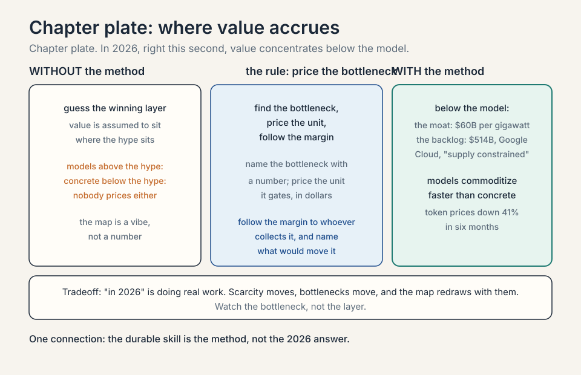
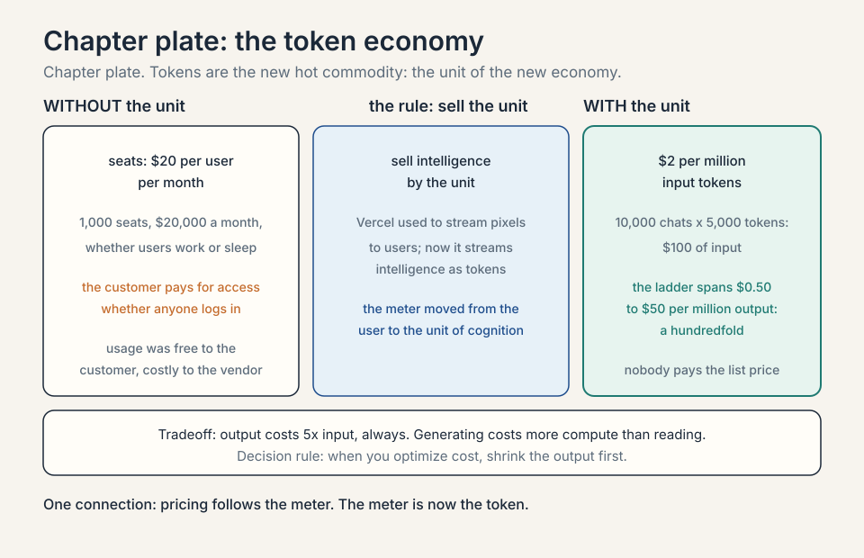
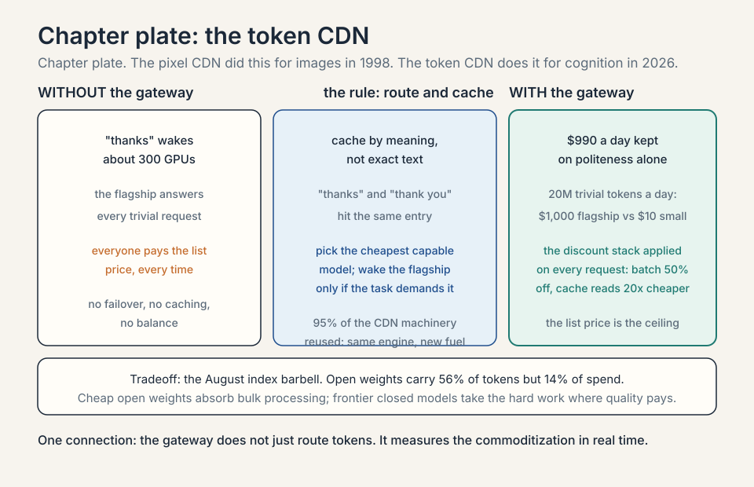
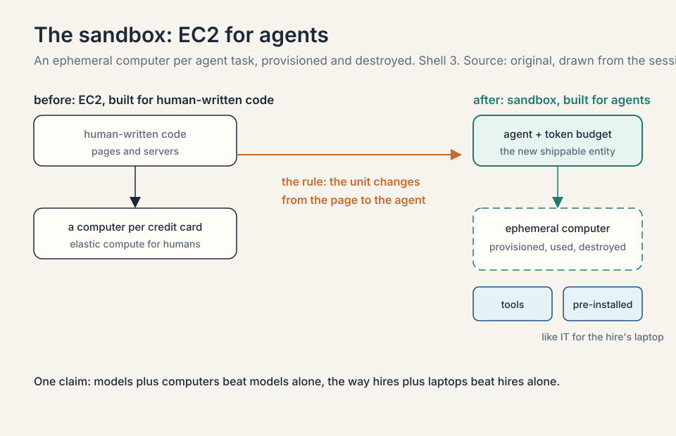
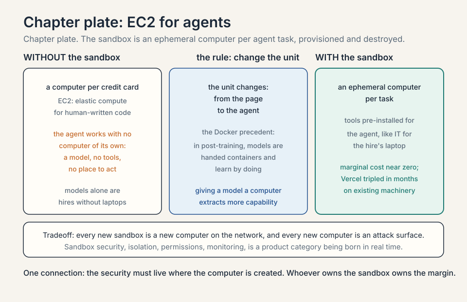
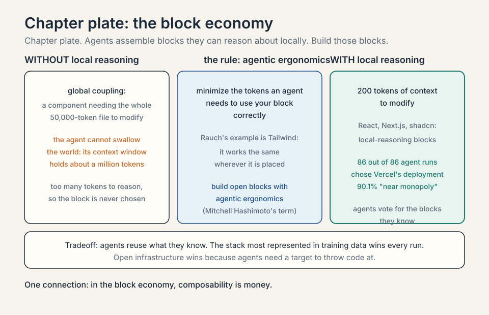
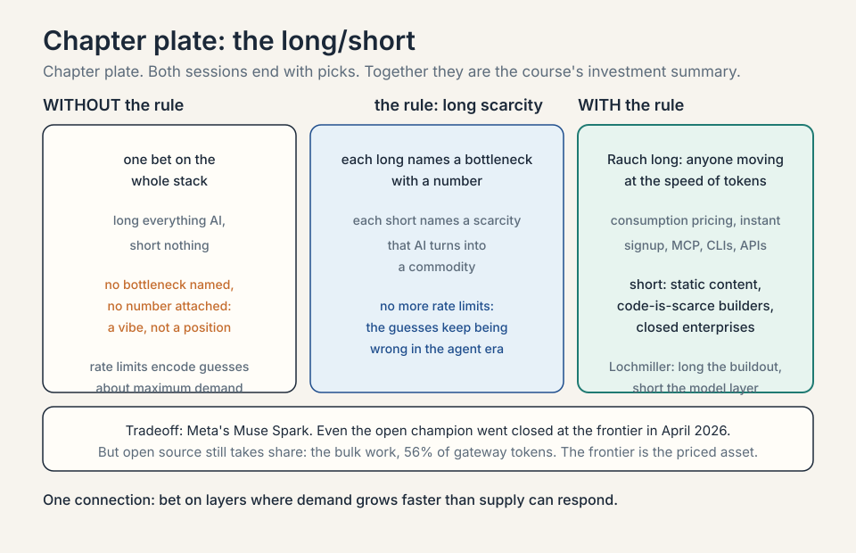
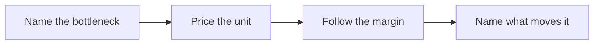

## The course's core question

Every session of MS&E435 circles one question, and the
host asks it directly in this one: from chips to data
centers to infrastructure below the model, the model,
and the agents above it, **where will value accrue?**
Three forces answer it, each with a number: the CapEx
moat ($60 billion per gigawatt), the demand-supply
gap (Google Cloud's $514 billion contracted
backlog), and the model price collapse (blended
enterprise token prices down 41 percent in six
months, per the September 2026 Ramp AI Index).

| Force | The number | What it prices |
|---|---|---|
| The CapEx moat | $60B per gigawatt | capital at that scale is its own barrier |
| Demand outruns supply | $514B Google Cloud contracted backlog | scarcity prices flow to the scarce input |
| Models commoditize faster than concrete | token prices down 41 percent in six months | a model's pricing power erodes with every open release |

Rauch's answer is dated and specific: "at least in
2026, right this second," value concentrates **below
the model**. Chips, data centers, power, cooling,
energy. Above the model there is real value, in coding
models, customer support, legal, and other verticals,
but it is narrow and concentrated. The money is in the
picks and shovels.

This chapter is the map of that answer: why the value
sits where it does, the new primitives being built to
capture it, and how the guests say to bet.

## Why below the model wins (for now)

Three forces push value down the stack, and each one
has a number from the course.

### Subchapter: the CapEx is the moat, worked

L02 priced it: $60M per MW, $60B per gigawatt. Capital
at that scale is its own barrier. Few players can
finance AI factories, so the returns concentrate among
those who can. By October 2026 the moat had a
financing wall behind it. Moody's put hyperscaler
spending at $785 billion in 2026, rising to $1
trillion in 2027. PIMCO estimated that capex would
absorb about 94 percent of the hyperscalers'
operating cash flow in 2026, against under 50 percent
two years earlier. Bank of America put the figure
near 90 percent. The gap is being filled with debt:
Moody's expected about $240 billion of hyperscaler
debt issuance in 2026, and S&P Global projected
negative free operating cash flow for its six tracked
companies in both 2026 and 2027. Alphabet posted its
first negative-free-cash-flow quarter since going
public (Q2 2026: negative $5.9 billion free cash
flow on $44.9 billion of capex, reported July 2026).
The moat is now also a balance-sheet
contest: the winners are the companies that can
borrow hundreds of billions while the buildout
outruns their cash flow.

| Figure, 2026 | Number |
|---|---|
| Moody's hyperscaler spending | $785B in 2026, rising to $1T in 2027 |
| Share of operating cash flow | about 94 percent (PIMCO), near 90 percent (Bank of America) |
| Hyperscaler debt issuance | about $240B (Moody's) |
| S&P Global's six tracked companies | negative free operating cash flow in both 2026 and 2027 |
| Alphabet, Q2 2026 | negative $5.9B free cash flow on $44.9B capex |

### Subchapter: demand outruns supply, with 2026 numbers

The Applied Compute session named compute scarcity
outright: demand far outpacing supply. By 2026 the
numbers filled in. Amazon guided roughly $200-220B of
capex, Alphabet $195-205B, Meta $130-145B, Microsoft
about $175B: about $730B across the four, with
Oracle's ~$70B of net cash capex on top. Google Cloud
did $24.8B of revenue in Q2 2026, up 82 percent year
over year, with a contracted backlog of $514B.
Alphabet's CEO said on the earnings calls that the
company is "supply constrained" and "compute
constrained in the near-term": cloud revenue would
have been higher if they could meet demand.
Scarcity prices flow to the scarce input. Today that
input is energized compute, not model weights.

| Player | 2026 number |
|---|---|
| Amazon | about $200-220B capex guidance |
| Alphabet | $195-205B capex guidance |
| Meta | $130-145B capex guidance |
| Microsoft | about $175B capex guidance |
| Oracle | about $70B of net cash capex |
| Combined | about $730B, the four plus Oracle |
| Google Cloud | $24.8B Q2 revenue, up 82 percent; $514B contracted backlog |

### Subchapter: models commoditize faster than concrete

The Crusoe session's long/short said it plainly: old
compute commoditizes, but so do old models, and open
source takes share from closed-source model players.
The September 2026 price war is the exhibit: OpenAI
and Anthropic cut frontier prices within ninety
minutes of each other, DeepSeek sells flash
intelligence at $0.30/$1.20, and the effective
enterprise token price (a **token** is a chunk of
text the model reads or writes, roughly a word or
part of one) fell 41 percent in six months (Ramp AI
Index, September 2026: blended enterprise token
prices dropped 41 percent to $0.68 per million).
A data center's revenue can be repriced per token for
a decade. A model's pricing power erodes with every
open release.

The honest qualifier is the date. "In 2026" is doing
real work in Rauch's sentence. Value accrual moves as
bottlenecks move, and L01 showed bottlenecks always
move.



## Tokens: the new commodity

The unit of the new economy is the token, defined
above. Rauch's framing: Vercel used to stream
pixels to users. Now it streams intelligence in the
form of tokens. Tokens are, in his phrase, "the new
hot commodity."

### Subchapter: the seat-to-token arithmetic, worked

This changes the pricing model of software. **SaaS**
sold **seats**: a fixed price per user per month.
Toy it: $20 per seat per month, 1,000 seats, $20,000
a month whether the users work or sleep. The token
economy sells **intelligence by the unit**: $2 per
million input tokens. A support agent that handles
10,000 conversations a month at 5,000 tokens each
burns 50M tokens: $100 of input. The meter moved
from the user to the unit of cognition. Heavy users
pay more. Light users pay less. The seat was
insurance. The token is a utility bill.


### Subchapter: what is used where, the October 2026 price ladder

The death of the seat and the rise of the token is the
same event as L05's SaaS reckoning, priced. The
October 2026 ladder, standard tiers, short context,
from vendor pricing pages:

| Model | Input $/1M | Output $/1M |
|---|---|---|
| OpenAI GPT-6 Luna | $0.10 | $0.50 |
| DeepSeek V4.1 Flash | $0.30 | $1.20 |
| Google Gemini 3.8 Flash (promo) | $0.75 | $3.75 |
| Anthropic Claude Haiku 4.5 | $1 | $5 |
| Anthropic Claude Sonnet 5.5 | $2 | $10 |
| OpenAI GPT-6 Sol | $2 | $10 |
| OpenAI GPT-6.1 Sol | $2 | $10 |
| Google Gemini 4 Argon (intro) | $2 [uncertain] | $10 [uncertain] |
| xAI Grok 4.7 | $2 | $6 |
| Anthropic Claude Opus 5.5 | $4 | $20 |
| OpenAI GPT-6 Astra | $10 | $50 |
| Anthropic Claude Fable 5.1 | $10 | $50 |

Two footnotes. GPT-6.1 Sol launched September 29, a
week after GPT-6 Sol, at the same $2/$10 with
cheaper cached input. GPT-6 Astra's $10/$50 is the
short-context tier: prompts above 272K tokens bill
at $20/$75. The Gemini 4 Argon model is verified,
launched late September 2026. Its $2/$10 price is
[uncertain]: no verified price sheet was found, and
it is listed here at the frontier convergence point
as a placeholder, not a confirmed rate.

The spread is a hundredfold, $0.50 to $50 on output.
Three facts to read off it. First, workhorse-class
intelligence fell to $2 per million input tokens at
OpenAI and Anthropic in the same week of September
2026 (GPT-6 Sol on September 22, Claude Sonnet 5.5 on
September 28), with Google's Gemini 4 Argon launching
days later at an unverified price. Second, every lab
discounts: **batch APIs** (non-urgent requests
processed in bulk) cut 50 percent, **prompt caching**
(repeated context billed at cache-read rates) cuts
cached tokens 10x, DeepSeek halves prices
off-peak. Third,
the list price is the ceiling. the gateway of this
chapter (the **AI gateway**: a CDN for tokens) exists
to make sure nobody pays it.

### Subchapter: September 22, 2026, the ninety-minute price war, worked

The ladder's sharpest rows were born on the same
day. On September 22, 2026, OpenAI launched GPT-6
Sol at $2/$10 and GPT-6 Luna at $0.10/$0.50, and
Anthropic launched Claude Opus 5.5 at $4/$20, within
about ninety minutes of each other. Only OpenAI's
cut was roughly 50 percent against the previous
generation. Anthropic's was 20 percent: Opus 5.5 at
$4/$20 against Opus 5.0's $5/$25, with cache reads
cut 60 percent to $0.20 per million. OpenAI
attributed the reductions to inference and
caching efficiencies passed through to customers.
Anthropic's cut made the benchmark-leading model
cheaper than the model it replaced: Opus 5.5 tops
the Artificial Analysis Intelligence Index at 58,
against 48 for GPT-6 Sol and 53 for GPT-6 Astra.

The economics underneath: GPT-6 Sol costs about
$1.06 per typical benchmark task, about 50 percent
less than GPT-5.6 Sol's $1.99. GPT-6 Luna costs
about $0.07 per task, down from $0.18 (Artificial
Analysis, September 22, 2026). Price per
token fell, but cost per unit of work fell faster,
because the models also got more efficient. The
price war is not just cheaper tokens. It is cheaper
cognition.

| Cut, September 22, 2026 | Before | After | Size |
|---|---|---|---|
| OpenAI GPT-6 Sol | GPT-5.6 Sol | $2/$10 | about 50 percent against the previous generation |
| Anthropic Claude Opus 5.5 | Opus 5.0 at $5/$25 | $4/$20 | 20 percent; cache reads cut 60 percent to $0.20 per million |
| GPT-6 Sol per typical task | $1.99 | $1.06 | about 50 percent less |
| GPT-6 Luna per typical task | $0.18 | $0.07 | about 61 percent less |

### Subchapter: the five-times rule

Read the Anthropic column of the ladder: Haiku
$1/$5, Sonnet $2/$10, Opus $4/$20, Fable $10/$50.
Output is priced at exactly five times input on
most models in the ladder. Two rows break the rule:
Grok 4.7 at $2/$6, about three times input, and
DeepSeek V4.1 Flash at $0.30/$1.20, four times
input. The reason is
physical: generating a token costs more compute
than reading one. Input tokens are processed in
parallel. Output tokens are generated one at a
time, each waiting on the last. The 5x rule is the
price of sequentiality. Decision rule: when you
optimize cost, shrink the output first. A verbose
model at $2/$10 costs more than a terse model at
$4/$20 if it writes three times the tokens.

```ascii
price of output tokens = 5 x price of input tokens
Haiku $1/$5, Sonnet $2/$10, Opus $4/$20, Fable $10/$50
```

### Subchapter: the discount stack, worked

Nobody serious pays the list price. Three discounts
stack.

**Batch.** 50 percent off input and output across
the Anthropic and OpenAI ladders. GPT-6 Astra at
batch: $5/$25. Opus 5.5 at batch: $2/$10, the same
as Sonnet's list price.

**Cache.** Opus
5.5 cache reads cost $0.20 per million against $4
fresh: a 20x cut. GPT-6 Sol cached input is $0.20
against $2. GPT-6 Luna cached input is $0.01
against $0.10. An agent that reuses its context
window across 100 tool calls pays the fresh price
once and the cache price 99 times.

**Off-peak.** DeepSeek prices by the clock: peak
hours bill the list rate, off-peak bills half.
V4.1 Flash off-peak is $0.15/$0.60, undercutting
GPT-6 Luna's $0.10/$0.50 on output but not on
input.

Work the stack. A nightly batch job running GPT-6
Sol with cached context: $2 list becomes $1 batch,
and the cached 90 percent of input bills at $0.20
instead of $2. The realized price is a fraction of
the list. The gateway's job is to apply this stack
automatically, on every request, at planetary
scale.

| Discount | Size | Worked example |
|---|---|---|
| Batch | 50 percent off input and output | GPT-6 Astra at batch: $5/$25; Opus 5.5 at batch: $2/$10, the same as Sonnet's list price |
| Cache | Opus 5.5 reads at $0.20 per million against $4 fresh: a 20x cut | GPT-6 Sol cached input $0.20 against $2; Luna $0.01 against $0.10 |
| Off-peak | half the list rate | DeepSeek V4.1 Flash off-peak: $0.15/$0.60 |



## The AI gateway: a CDN for tokens

Every new commodity needs infrastructure, and the
session builds it by analogy. In the first internet,
pages needed **CDNs** (content delivery networks):
companies like Akamai and Fastly that scaled,
accelerated, and secured the delivery of pixels.

### Subchapter: the analogy, worked

Tokens need the same treatment. The AI gateway is a
layer in front of the model providers that observes
token traffic, fails over between providers, secures
it, accelerates it, caches it, and load-balances it.
Toy it: a request arrives.
The gateway checks its cache by meaning, picks the
cheapest capable model, and only calls the flagship
if the task demands it. The pixel CDN did this for
images in 1998. The token CDN does it for cognition
in 2026.

### Subchapter: semantic caching, worked

The worked example is the session's most memorable
piece of arithmetic. Saying "thanks" to a flagship
model activates something like **300 GPUs** to produce
"you are welcome." A smart gateway sees the request,
recognizes it needs no frontier intelligence, and
routes it to a small model behind the scenes. That is
**semantic caching**: caching by meaning, not by exact
text. The 300 GPUs stand down. The margin is the
difference between flagship cost and small-model cost,
captured on every trivial request at planetary scale.
Toy the savings: 1M "thanks"-class requests a day at
$50/M flagship output versus $0.50/M small-model
output. The gateway keeps the difference.

### Subchapter: semantic caching, the price list

Caching has two levels, and the ladder prices both.
**Exact caching** reuses a previous response
verbatim: the cache-read rates are the price. Opus
5.5 cache reads cost $0.20 per million input tokens
against $4 fresh. GPT-6 Sol cached input is $0.20
against $2. GPT-6 Luna cached input is $0.01 against
$0.10. **Semantic caching** goes further: it matches
by meaning, so "thanks" and "thank you" hit the
same entry, and the small model answers without
waking the flagship at all.

Work the margin. One million "thanks"-class
requests a day, each needing about 20 output
tokens: 20 million tokens. At flagship output
prices ($50/M) that is $1,000 a day. Routed to a
small model at $0.50/M output, it is $10 a day.
The gateway keeps $990 a day on politeness alone.
Multiply by every trivial request on the internet
and the routing layer is a business.

| Level | What it reuses | The price |
|---|---|---|
| Exact caching | a previous response, verbatim | cache-read rates: Opus 5.5 $0.20/M against $4 fresh; Sol $0.20 against $2; Luna $0.01 against $0.10 |
| Semantic caching | by meaning: "thanks" and "thank you" hit the same entry | the small model answers; the flagship never wakes |

. Shell 3. Source: original diagram for Stanford Frontier AI. Project: Stanford Frontier AI.")

### Subchapter: the 95 percent reuse

Rauch notes the product reuses about 95 percent of
Vercel's existing CDN machinery: the same rocket
engine, new fuel. That reuse is itself an economic
point about why incumbents of the pixel CDN era have
a head start in the token CDN era. Points of
presence, failover logic, caching layers, abuse
handling: the hard problems are the same. Only the
commodity changed.

### Subchapter: the gateway index, August 2026, worked

Vercel publishes an AI Gateway Production Index from
its anonymized gateway traffic, and the September
2026 edition is the volume-versus-value split made
visible. In August 2026, open-weight models carried
56 percent of all tokens crossing the gateway, up
from 11 percent in April, but captured only 14
percent of the spend. Anthropic took 61 to 64
percent of every spend dollar on roughly 30 percent
of token volume, at up to 4.4 times the average
token price. DeepSeek's V4.1 Flash led token volume
at about 59 percent on one board while taking about
5 percent of spend.

Two readings. First, the barbell: cheap open
weights absorb bulk processing, frontier closed
models take the high-difficulty work where quality
pays. Second, the price collapse: the average token
price fell 23.2 percent in August alone, the third
straight monthly decline, more than 50 percent over
five months. The gateway does not just route
tokens. It measures the commoditization in real
time. One limit, stated plainly: this is one
provider's traffic sample, not the whole market,
and teams running open weights in-house pay GPU and
operations costs the index never sees.

| Lab | Token share | Spend share |
|---|---|---|
| Open-weight models | 56 percent of gateway tokens | 14 percent of spend |
| Anthropic | about 30 percent of token volume | 61 to 64 percent of spend, at up to 4.4x the average token price |
| DeepSeek V4.1 Flash | about 59 percent on one board | about 5 percent of spend |



## The sandbox: EC2 for agents

The second primitive is compute. **EC2** taught the
world elastic compute: a computer per credit card,
scalable to a million machines. But EC2 was designed
for human-written code.

### Subchapter: the Docker precedent, worked

Agents need their own unit. Rauch's **sandbox** is, in
his words, the EC2 of agents: an ephemeral computer
handed to an agent to work in. The mechanism has a
striking precedent. In post-training, models are
handed Docker containers with broad permissions: they
cut their teeth inside mini-computers before facing
the world. Giving a model a computer extracts more
capability from it, the way giving a new hire a laptop
extracts more from the hire. IT pre-installs software
for the human. The sandbox pre-provisions tools for
the agent.

```ascii
before  a model alone: no computer, no tools
rule    hand it a Docker container with broad permissions
after   it learns by doing; like a new hire with a laptop
```

### Subchapter: the economics

The economics follow. Vercel's sandbox reuses the same
virtualization primitive as every deployment on the
platform, which is why, Rauch says, almost nothing
broke during the deployment surge: the company tripled
in months and doubled daily deployments since
January on machinery it already operated. Marginal
cost of one more sandbox: near zero. Marginal value
of one more agent running inside it: whatever the
agent produces.

### Subchapter: the security category

And the security corollary: like the PC revolution
brought viruses and phishing, agents bring
exfiltration and leakage, so sandbox security is a
product category being born in real time. Every new
sandbox is a new computer on the network, and every
new computer is an attack surface. Isolation,
permissions, and monitoring are the product.

```ascii
PC era     every new computer -> viruses and phishing
agent era  every new sandbox -> exfiltration and leakage
product    isolation, permissions, monitoring: a category born in real time
```





## The block economy: why agents picked Vercel

The **block economy** is Mitchell Hashimoto's term
for the market in composable building blocks that
agents snap together.

The host presses on the session's most startling
statistic: in a test of 86 agent runs, Claude chose
Vercel's deployment option **86 out of 86 times**,
and the report the guest cites gives Vercel's UI
engine a 90.1 percent "near monopoly." Was it a deal?
Rauch will not confirm or deny commercial
arrangements, but his substantive answer is a theory
of agent choice.

### Subchapter: local reasoning, worked

Agents reuse what they know. Models trained on the
internet's code learned Next.js, React, and the
open-source stack deeply. But there is a deeper
mechanism: **local reasoning**. Rauch's example is
Tailwind, the CSS framework he bet on early despite
its ugly-looking code. Tailwind lets a developer
reason about one component in isolation: it works the
same wherever it is placed. Toy it: a component with
local reasoning needs only its own 200 tokens of
context to modify. A component with global coupling
needs the whole 50,000-token file. Inside a finite
**context window** (about a million tokens: not
nearly enough to hold all of humanity's code), the
agent always picks the block it can reason about
locally.

```ascii
local reasoning   a component needs only its own 200 tokens to modify
global coupling   a component needs the whole 50,000-token file
rule  minimize the tokens an agent needs to use your block correctly
```

### Subchapter: the 86 out of 86

That property, shared by React and Next.js, is what
makes code **composable** for agents. The agent
cannot swallow the world, so it assembles blocks.
The 86-out-of-86 result is agents voting for the
blocks they know: the stack most represented in the
training data, with the best local-reasoning
properties, wins every run.

```ascii
86 agent runs -> Claude chose Vercel 86 times: 100 percent
the report the guest cites gives Vercel's UI engine 90.1 percent
```

### Subchapter: agentic ergonomics, the rule

Mitchell Hashimoto, the HashiCorp founder who joined
Vercel's board, coined the term. Rauch's strategic
moral: if you want Claude Code or Codex to choose
your technology, build blocks with agentic
ergonomics. Open infrastructure wins because agents
need a target to throw code at. The rule for
builders: minimize the tokens an agent needs to use
your block correctly.



## How to bet: the long/short

Both guest sessions end with long/short picks, and
together they are the course's investment summary.
The rule for reading them: each long names a
bottleneck with a number, and each short names a
scarcity that AI is turning into a commodity.


### Subchapter: Rauch's long, worked

**Rauch's long:** anyone "moving at the speed of
tokens." Concretely: companies with consumption-based
pricing, instant signup, and agent-ready interfaces:
**MCP** (Model Context Protocol, the open standard
for connecting agents to tools and data), CLIs, and
APIs. Toy the test: a company charges
$20/seat/month with a sales-led signup. An agent
cannot buy it, cannot try it, cannot meter it. It is
invisible to the token economy. The long is the
company the agent can transact with in one call.

### Subchapter: the rate-limiter provocation

His provocation to his own company: "no more rate
limits." Rate limiters encode guesses about maximum
demand ("no company will deploy more than 100 times
per minute"), and in the agent era those guesses keep
being wrong. A YC company that did not exist three
months earlier now produces deployment volumes that
surprise Vercel itself.

### Subchapter: Rauch's short

**Rauch's short:** static data and content businesses
(his early call: Stack Overflow, a database of
programming Q&A, against free model answers).
companies built on the premise that code is scarce or
hard to produce (drag-and-drop builders, "coding with
training wheels," which he calls patronizing). and
companies that do not open up, the e-brochure
enterprises where agents cannot reach the raw signal.

### Subchapter: Lochmiller's long

**Lochmiller's long** (from the Crusoe session): long
the buildout. The buildout is the physical AI
factory: chips, data centers, power, cooling. The
bear case sits inside the long: the legacy
electrical stack (Eaton, Schneider) is fine
near-term, at risk long-term if power electronics
and solid-state transformers collapse their costs.

### Subchapter: Lochmiller's short

**Lochmiller's short** (from the Crusoe session):
open source taking share from closed-source model
players. Old models commoditize, and each open
release erodes closed-model pricing power. The short
is the model layer. The long is the concrete.

### Subchapter: the October 2026 update to the bets

The through-line: bet on the layers where demand is
growing faster than supply can respond, and against
the layers where AI turns a scarce asset (code,
answers, interfaces) into a commodity. October 2026
added three data points. Anthropic's enterprise lead
vindicates the "above the model, narrow and
concentrated" call: coding models monetize. The
September price war vindicates the commoditization
call: frontier tokens fell to $2/M input across all
three labs. Meta's pivot from open Llama to closed
Muse Spark vindicates the open-source-takes-share
risk running in reverse: even the open champion went
closed at the frontier.

### Subchapter: Muse Spark, the verified pivot

The pivot has dates. For years Meta was the open-
weights champion: Llama 1 through Llama 4, the last
released April 2025 as Scout and Maverick. On April
8, 2026, Meta Superintelligence Labs, the new AI
division led by Alexandr Wang as Chief AI Officer,
announced **Muse Spark**: the first Meta flagship
with closed weights. No downloads, no self-hosting,
API and the Meta AI app only. Version 1.1 followed
in July with the paid Meta Model API, 1.2 in
August, and 1.3 on September 2, 2026, emphasizing
long-horizon agentic workflows and coding.

| Release | Date | What it is |
|---|---|---|
| Muse Spark | April 8, 2026 | Meta's first closed-weight flagship: API and the Meta AI app only |
| Version 1.1 | July 2026 | adds the paid Meta Model API |
| Version 1.2 | August 2026 | iteration |
| Version 1.3 | September 2, 2026 | long-horizon agentic workflows and coding |
| Muse Glimmer | August 2026 | open weights, sized for consumer GPUs and local agents |
| Muse Code | 2026 | Meta's coding-agent entry against Claude Code and Codex |

Meta did not abandon openness entirely. **Muse
Glimmer**, released August 2026, is an open-weight
model sized for consumer GPUs and local agents.
**Muse Code** is Meta's coding-agent entry against
Claude Code and Codex. And the Model API's
**Contributor Endpoint** offers cheaper pricing in
exchange for letting Meta train on your data: the
data flywheel as a price tier. The strategic read:
frontier weights are now a monetizable asset, and
even the company that gave models away decided the
frontier was worth charging for. Open source still
takes share, per the gateway index, but the share
it takes is the cheap bulk work, not the frontier.

| Pick | The position | The number behind it |
|---|---|---|
| Rauch long | anyone moving at the speed of tokens | consumption pricing, instant signup, MCP, CLIs, APIs |
| Rauch short | static content, code-is-scarce builders, closed enterprises | the model answers for free |
| Lochmiller long | the buildout: chips, data centers, power, cooling | the $60B per gigawatt moat |
| Lochmiller short | open source taking share from closed models | token prices down 41 percent in six months |



## The method: find the bottleneck, price the unit, follow the margin

The chapter's price is the one Rauch states himself:
the map is dated 2026. Value accrues below the model
**right this second** because that is where scarcity
sits. Scarcity moves. If compute supply catches
demand, if open models commoditize the gateway layer,
if agents learn to route around today's primitives,
the map redraws. The durable skill the course teaches
is not the 2026 answer but the method: find the
bottleneck, price the unit, follow the margin. That
method is the whole course in one line.

### Subchapter: the method as an interview framework

Use it as a three-step answer to any "where does
value accrue" question. Step one: name the bottleneck
in this market, with a number. Step two: price the
unit that the bottleneck gates, in dollars. Step
three: follow the margin to whoever collects it, and
name what would move it. The interviewer is not
testing your 2026 map. They are testing whether you
can redraw it when the bottleneck moves.



### Subchapter: the framework, worked on sandbox security

Apply it to a market the chapter only sketched:
sandbox security. Step one, the bottleneck: every
agent needs an isolated computer, and every new
computer is an attack surface. The number: agent-
initiated commits went from under 3 percent to over
half of Vercel's deployments in six months. The
sandbox count grows with the agent count.

Step two, price the unit: the secured sandbox-hour.
The buyer pays for isolation, permission
enforcement, and audit trails per agent task. The
comparable is the PC era: antivirus and endpoint
security became a multi-billion-dollar category
because every new computer needed protection.

Step three, follow the margin: it accrues to whoever
owns the sandbox primitive, because security must
live where the computer is created. Vercel's
sandbox reuses its deployment virtualization, which
is why the moat transfers. What would move it: a
sandbox standard that commoditizes isolation, or an
attack that makes enterprises distrust shared
sandbox infrastructure. Three steps, one number
each, and the answer is a map instead of a guess.

| Step | The number | The answer |
|---|---|---|
| 1. Name the bottleneck | agent-initiated commits went from under 3 percent to over half in six months | every agent needs an isolated computer; every new computer is an attack surface |
| 2. Price the unit | the secured sandbox-hour | the buyer pays for isolation, permissions, and audit trails per agent task |
| 3. Follow the margin | whoever owns the sandbox primitive | security must live where the computer is created |

> [!QA]
> Q: Where does value accrue in the AI stack, and why below the model?
> A: In 2026, below the model: chips, data centers, power, cooling, energy. Three reasons. The CapEx is the moat: $60B per gigawatt admits few players, and 2026 capex is set to absorb about 94 percent of the hyperscalers' operating cash flow. Demand outruns supply: compute scarcity is the stated fact of the era, with Google Cloud holding $514B of backlog. And models commoditize faster than concrete: open source erodes closed-model pricing while a data center reprices per token for a decade. Above the model, value exists but is narrow: coding models, support, legal.
> Follow-up: What moves value up the stack?
> A: Scarcity moving. If energized compute stops being the bottleneck, pricing power flows to whoever owns the customer relationship or the proprietary data. The specialization layer of L04 is the candidate: enterprise evals and telemetry cannot be commoditized by open weights. Watch the bottleneck, not the layer.

> [!QA]
> Q: Walk me through the seat-to-token arithmetic.
> A: SaaS sold seats: $20 per seat per month, 1,000 seats, $20,000 a month whether users work or sleep. The token economy sells intelligence by the unit. A support agent handling 10,000 conversations a month at 5,000 tokens each burns 50M input tokens. At $2 per million, that is $100 of input. The meter moved from the user to the unit of cognition. Heavy users pay more, light users pay less. The seat was insurance against usage. The token is a utility bill for it.
> Follow-up: Who wins and who loses in the transition?
> A: Winners: vendors whose product gets more valuable with more usage, because the meter now rewards it. Losers: vendors whose pricing assumed usage was free to the customer. The losers' customers discover they were subsidizing the power users, and the power users leave first.

> [!QA]
> Q: What is the AI gateway, and what is semantic caching?
> A: The AI gateway is a CDN for tokens: it observes, fails over, secures, accelerates, caches, and load-balances traffic to model providers, the way Akamai did for pixels. Semantic caching is its sharpest trick: cache by meaning, not exact text. Saying "thanks" to a flagship model can activate around 300 GPUs to write "you are welcome." The gateway routes that to a small model instead. The margin is the cost difference, captured on every trivial request at scale.
> Follow-up: Why does Vercel have a head start here?
> A: Reuse. Rauch says the gateway reuses about 95 percent of the CDN machinery Vercel already operates: the same rocket engine, new fuel. Pixel delivery and token delivery share the hard problems: global points of presence, failover, caching, abuse handling. The incumbent advantage transferred across the commodity boundary.

> [!QA]
> Q: What is the sandbox, and why do agents need computers?
> A: The sandbox is EC2 for agents: an ephemeral computer provisioned per agent task, then destroyed. Agents need computers because tool use extracts more capability from a model: in post-training, models are handed Docker containers and learn by doing, the way a new hire with a laptop outperforms one without. IT pre-installs software for humans. the sandbox pre-provisions tools for agents. Vercel's version reuses its deployment virtualization primitive, which is why the 3x deployment surge broke almost nothing.
> Follow-up: What is the security implication?
> A: A new product category. The PC era brought viruses and phishing with every new computer. the agent era brings exfiltration and data leakage with every new sandbox. Agents can be tricked into leaking data the way users were tricked by Nigerian-prince emails. Sandbox isolation, permissions, and monitoring are being built now, in real time, as the attack surface grows.

> [!QA]
> Q: What is the block economy?
> A: Mitchell Hashimoto's term for the market in composable building blocks that agents snap together. Agents cannot fit all of humanity's code in a million-token context window, so they assemble local-reasoning components: Tailwind, React, Next.js, shadcn. The 86-out-of-86 result, Claude choosing Vercel's deployment every time, is agents voting for the blocks they know. The strategic moral: to be chosen by agents, build open blocks with agentic ergonomics, because agents reuse what they can reason about locally.
> Follow-up: How does the block economy relate to the 100ms Amazon rule?
> A: Both are about the economics of the interface. Amazon found that 100ms of slowdown costs 1 percent of conversion: speed is money in the pixel era. In the block economy, composability is money: the block that snaps in fastest wins the agent's choice. Different eras, same lesson: reduce the friction between intent and outcome, and the market pays.

> [!QA]
> Q: Read the October 2026 price ladder. What does it say about strategy?
> A: Three readings. First, the workhorse tier converged: $2 per million input tokens at OpenAI (GPT-6 Sol) and Anthropic (Claude Sonnet 5.5) in the same week of September 2026, which means price is no longer a differentiator at that tier. Second, the ladder is a hundredfold wide ($0.50 to $50 on output), so routing is the product: whoever routes each request to the cheapest capable model captures the spread. Third, discounts are structural: batch 50 percent off, caching 10x, DeepSeek off-peak half. The list price is the ceiling. The gateway exists to make sure nobody pays it.
> Follow-up: What is the trap in competing on price alone?
> A: The Uber lesson from 2026: Anthropic's premium pricing still won enterprise spend because price per token loses to price per accepted task. A cheap model that needs three retries costs more than an expensive model that gets it right once. The gateway's job is cost per outcome, not cost per token.

> [!QA]
> Q: What would you ask a token-infrastructure founder to test the bet?
> A: Three questions. First, your effective $/M tokens after routing, caching, and batching: list prices are fiction, show me realized. Second, your failover story: when a provider degrades, how many milliseconds to the next one, and who notices. Third, your answer to open weights: when the best small model is free and downloadable, what does your gateway sell that a local router cannot. The first tests the margin. The third tests whether the business survives commoditization.
> Follow-up: What answer to the open-weights question passes?
> A: A named capability a local router cannot replicate. The passing answer sounds like this: planetary failover across nine providers with 200-millisecond reroute, semantic caching over our own traffic history, and spend controls wired into the customer's procurement system. What fails: "our routing is smarter." The gateway index shows open weights taking 56 percent of gateway tokens: the founder must name the 14 percent of spend that stays, and why it cannot be served from a laptop.

## Coverage map: every session claim and where it lives

No transcript or captions exist for the session
video, so segment-level mapping of claims to
timestamps is not possible. The table below maps
every major claim from the session to the section
that covers it, with file line numbers. October
2026 updates are marked.

| Session claim | Covered in | File line |
|---|---|---|
| The core question: where will value accrue? | The course's core question | L23 |
| "At least in 2026, right this second," value is below the model | The course's core question | L23 |
| Above the model: real but narrow value (coding, support, legal) | The course's core question | L23 |
| The CapEx is the moat: $60M per MW, $60B per gigawatt | the CapEx is the moat, worked | L53 |
| Demand outruns supply: compute scarcity | demand outruns supply, with 2026 numbers | L78 |
| Models commoditize faster than concrete; open source takes share | models commoditize faster than concrete | L95 |
| Tokens are the new hot commodity; Vercel streams intelligence | Tokens: the new commodity | L118 |
| Seat-to-token arithmetic: $20/seat vs $2/M tokens | the seat-to-token arithmetic, worked | L126 |
| The October 2026 price ladder | the October 2026 price ladder | L142 |
| The AI gateway: a CDN for tokens | The AI gateway: a CDN for tokens | L265 |
| Semantic caching: the 300-GPU "thanks" | semantic caching, worked | L286 |
| The 95 percent reuse of CDN machinery | the 95 percent reuse | L326 |
| The sandbox: EC2 for agents | The sandbox: EC2 for agents | L365 |
| The Docker precedent: models learn inside containers | the Docker precedent, worked | L372 |
| Sandbox economics: near-zero marginal cost | the economics | L386 |
| Sandbox security as a new product category | the security category | L398 |
| The 86-out-of-86: Claude chose Vercel every run | the 86 out of 86 | L443 |
| Local reasoning: Tailwind, 200 tokens vs 50,000 | local reasoning, worked | L425 |
| The block economy (Mitchell Hashimoto) | agentic ergonomics, the rule | L453 |
| "Amazon Agent Services": the shippable entity is the agent | agentic ergonomics, the rule | L453 |
| Rauch's long: anyone moving at the speed of tokens | Rauch's long, worked | L474 |
| "No more rate limits" provocation | the rate-limiter provocation | L487 |
| Rauch's short: static content, code-is-scarce builders, closed firms | Rauch's short | L497 |
| Lochmiller's long and short (Crusoe session) | Lochmiller's long; Lochmiller's short | L508, L518 |
| The September 22 price war (Oct 2026 update) | the ninety-minute price war, worked | L190 |
| The five-times rule: output costs 5x input (Oct 2026 update) | the five-times rule | L218 |
| The discount stack: batch, cache, off-peak (Oct 2026 update) | the discount stack, worked | L233 |
| Cache-read price list (Oct 2026 update) | semantic caching, the price list | L302 |
| Gateway index: 56% tokens, 14% spend (Oct 2026 update) | the gateway index, August 2026, worked | L337 |
| Google Cloud $514B backlog, "supply constrained" (Oct 2026 update) | demand outruns supply | L78 |
| Financing wall: 94% of cash flow, $240B debt (Oct 2026 update) | the CapEx is the moat, worked | L53 |
| Alphabet's first negative-free-cash-flow quarter, Q2 2026 (Oct 2026 update) | the CapEx is the moat, worked | L53 |
| Muse Spark: the verified pivot (Oct 2026 update) | Muse Spark, the verified pivot | L542 |
| The method: find the bottleneck, price the unit, follow the margin | The method | L570 |
| The interview framework, worked on sandbox security | the framework, worked on sandbox security | L594 |

## Recap: the whole lesson on one screen

1. **The question.** From chips to agents: where does
   value accrue? In 2026: below the model.
2. **Why below.** The CapEx is the moat ($60B/GW),
   demand outruns supply, and models commoditize
   faster than concrete. The financing wall: 2026
   capex absorbs about 94 percent of operating cash
   flow, filled with roughly $240B of debt.
3. **Tokens.** The new commodity. Vercel went from
   streaming pixels to streaming intelligence.
   Pricing moves from seats to tokens.
4. **The price ladder.** $0.50 to $50 per million
   output tokens, a hundredfold spread. The
   workhorse tier converged at $2/M input in
   September 2026. Output costs 5x input on most models.
5. **The discount stack.** Batch halves, cache reads
   cost 20x less than fresh, DeepSeek halves
   off-peak. Realized prices are fractions of list.
6. **The AI gateway.** A CDN for tokens: observe,
   fail over, secure, accelerate, cache, balance.
   Semantic caching stands down 300 GPUs for
   "thanks." The August index: open weights 56
   percent of tokens, 14 percent of spend.
7. **The sandbox.** EC2 for agents: an ephemeral
   computer per task. Models plus computers beat
   models alone, like hires plus laptops.
8. **The block economy.** Agents assemble
   local-reasoning blocks (86/86 for Vercel).
   Build open blocks with agentic ergonomics.
9. **The bets.** Long: anyone moving at the speed
   of tokens (usage pricing, MCP, instant signup).
   Short: static content, code-is-scarce builders,
   closed enterprises. Muse Spark: even Meta went
   closed at the frontier.
10. **The expiry.** The map is dated 2026. The
    durable skill is the method: find the
    bottleneck, price the unit, follow the margin.

## Go deeper

<div style="position:relative;padding-bottom:56.25%;height:0;overflow:hidden;max-width:100%;margin:16px 0;">
<iframe style="position:absolute;top:0;left:0;width:100%;height:100%;" src="https://www.youtube-nocookie.com/embed/HA7lZd7zk3M" title="Applications, Coding AI (MS&E 435, Guillermo Rauch)" frameborder="0" allow="accelerometer; autoplay; clipboard-write; encrypted-media; gyroscope; picture-in-picture" allowfullscreen></iframe>
</div>

- [Applications, Coding AI (MS&E 435, second half)](https://www.youtube.com/watch?v=HA7lZd7zk3M)
- The session this lesson follows, in full.
- [MS&E 435 course site](https://mse435.stanford.edu/)
- The Economics of Generative AI (course introduction): value accrual in the AI stack, market trends and revenue: https://www.youtube.com/watch?v=LNSvp-9b-J0
- [Q3 2026 model price tracker, all five labs](https://www.digitalapplied.com/blog/ai-model-api-pricing-tracker-q3-2026)

## Official sources and further reading

**Official:**
- Applications, Coding AI (MS&E 435, Spring 2026),
  guest Guillermo Rauch, Vercel: [link](https://www.youtube.com/watch?v=HA7lZd7zk3M)
- [MS&E 435 course site](https://mse435.stanford.edu/)

**Further reading:**
- The "Economics of Generative AI" session (course
  introduction): value accrual in the AI stack, market
  trends and revenue: [link](https://www.youtube.com/watch?v=LNSvp-9b-J0)

**Caveats from these sources.** "In 2026" is Rauch's
own dating of the below-the-model call. The 300-GPU
"thanks" is his illustrative meme, not a metered
measurement. The 86/86 and 90.1 percent figures come
from a report the guest cites, not from Vercel's own
audit. The Amazon 100ms-to-1-percent figure is
Amazon's published finding as quoted by the guest.
The October 2026 price ladder is from vendor pricing
pages and press as of early October 2026, except the
Gemini 4 Argon row, whose price is [uncertain]. The
Google Cloud figures ($24.8B revenue, $514B backlog)
are from Alphabet's Q2 2026 earnings. the financing
figures are analyst estimates (Moody's, PIMCO, Bank
of America, S&P Global), not company guidance. The
gateway index figures are Vercel's traffic sample as
reported by press, not the whole market. The Muse
Spark dates are from 2026 press coverage.

## Connections to the other courses

- **MS&E435 L01/L02:** the below-the-model value:
  the digital-labor thesis and the $60M megawatt it
  prices.
- **MS&E435 L05:** the seat-to-token transition from
  the application side: why SaaS pricing had to die.
- **CS229S:** the systems behind the gateway and
  sandbox: caching, batching, and serving at scale.
- **CME295:** product thinking for the token era:
  what to build when intelligence is metered.
